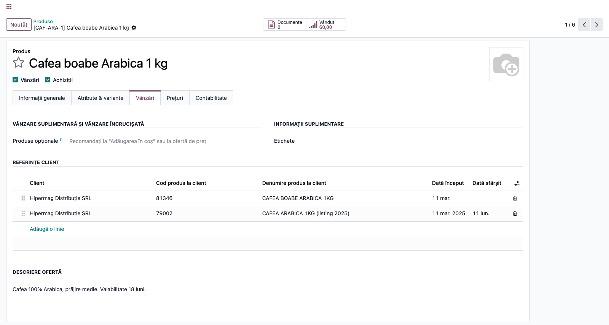
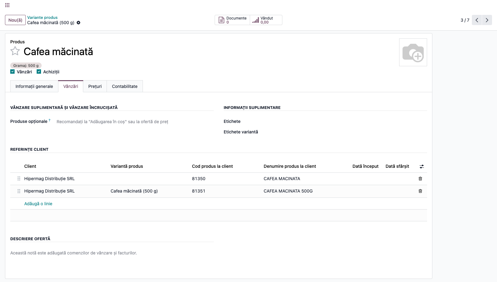
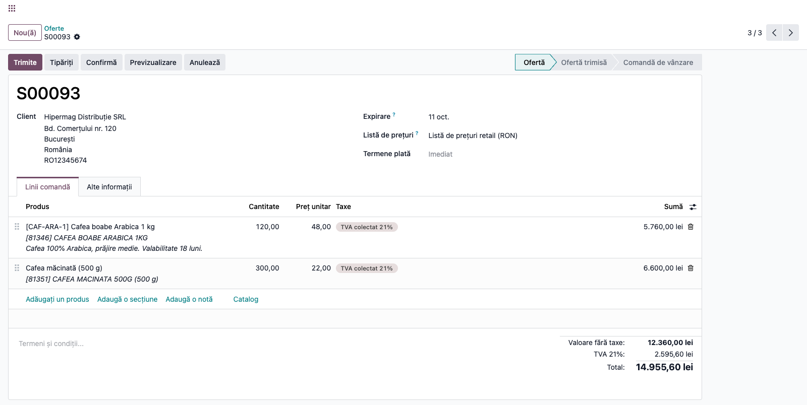
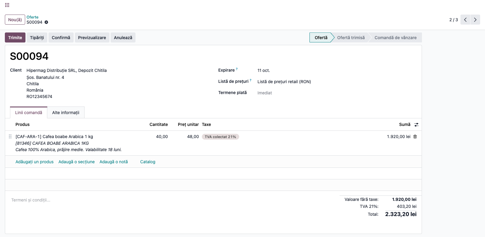
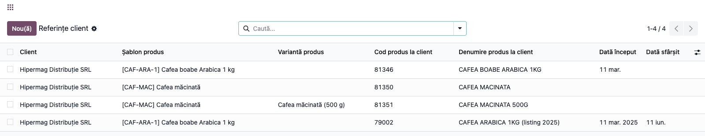
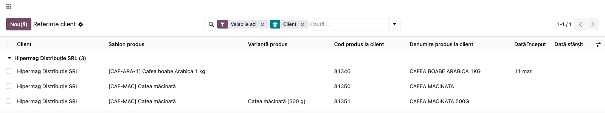
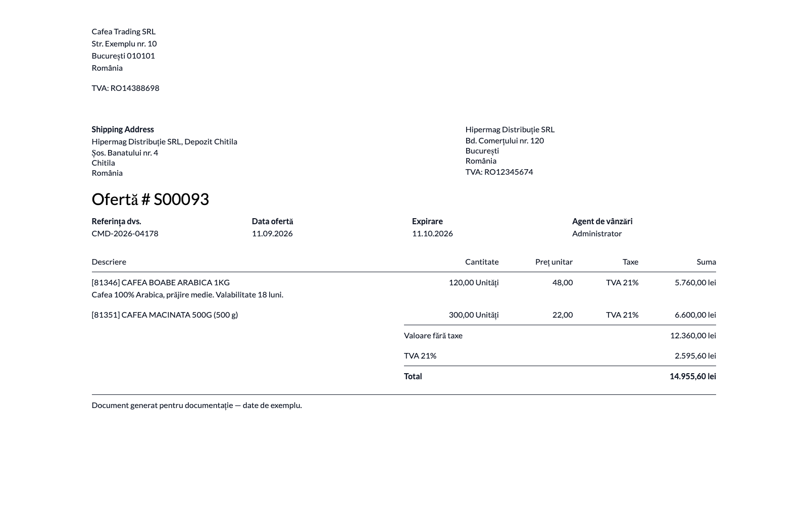
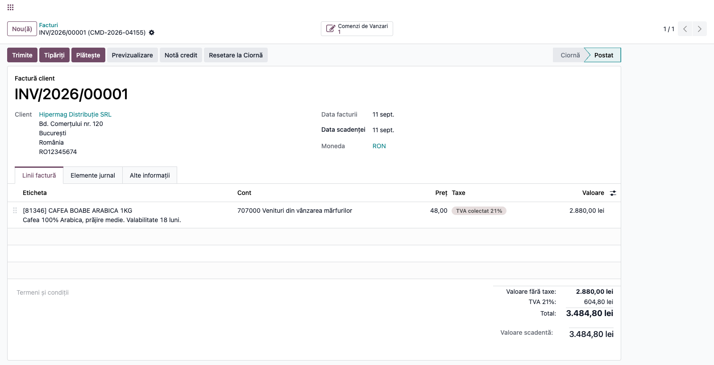

# Fișă Modul: Codul și denumirea produsului la client, pe linia de vânzare

**Modul:** `deltatech_sale_product_reference`
**Utilizator principal:** Operator vânzări / responsabil conturi-cheie (retail, EDI)
**Prioritate:** 🟡 Medie (calitatea documentelor către clienți-cheie; nu blochează operarea, dar o comandă respinsă de recepția clientului o blochează pe a lui)

---

## 1. Scop business

Un lanț de retail nu comandă „Cafea boabe Arabica 1 kg — cod intern CAF-ARA-1"; el comandă **articolul
81346**, cu denumirea din nomenclatorul lui. Recepția mărfii, confruntarea comenzii și plata se fac la
client pe **codul lui**, nu pe al nostru — iar dacă oferta, comanda și factura poartă doar denumirea
noastră, cineva de la client (sau de la noi) traduce manual linie cu linie, cu erorile de rigoare.

Modulul ține, pentru fiecare produs, **codul și denumirea sub care fiecare client îl cunoaște** și le
pune **automat** pe descrierea liniei de comandă de vânzare, de unde ele merg mai departe pe factură
și, prin ea, în e-Factură.
Este oglinda exactă a ceea ce Odoo face deja în achiziții: acolo, descrierea liniei de comandă se
compune din **fișa furnizorului** (codul și denumirea furnizorului pentru produsul respectiv); aici se
compune din **fișa clientului**. Operatorul nu caută nimic și nu tastează nimic pe linie.

## 2. Bază legală și context

Modulul este unul de **prezentare a documentelor comerciale** — nu modifică sume, cote de taxă sau
înregistrări contabile. Contextul de reținut:

- **Conținutul facturii.** Factura trebuie să cuprindă *denumirea și cantitatea bunurilor livrate*
  (Legea 227/2015 — Codul fiscal, **art. 319 alin. (20) lit. h)**). Modulul înlocuiește denumirea
  noastră cu **denumirea folosită de client**, deci consultantul trebuie să verifice, la punerea în
  funcțiune, că denumirea clientului **identifică efectiv bunul** — un cod sec, fără denumire
  („81346"), nu satisface cerința. Când clientul nu are o denumire proprie, modulul păstrează
  denumirea noastră și adaugă doar codul lui (vezi Pasul 3).
- **Cerință comercială, nu fiscală.** Obligația de a factura pe codul cumpărătorului nu vine din lege,
  ci din **contractele cu lanțurile de retail** și din protocoalele EDI (comandă → aviz → factură
  confruntate automat la client pe codul lui de articol). Nerespectarea ei duce la respingerea
  documentului de către client, nu la o sancțiune fiscală.
- **e-Factura.** Modulul scrie **doar descrierea liniei**. În XML-ul e-Facturii aceasta ajunge în
  `cac:Item/cbc:Description`, deci codul clientului călătorește ca **text de descriere**. De reținut
  trei lucruri:
  - `cac:Item/cbc:Name` rămâne **numele afișat al produsului nostru** (cu tot cu codul intern), iar
    `cac:SellersItemIdentification/cbc:ID` rămâne **codul nostru intern** — modulul nu le atinge;
  - câmpul dedicat pentru codul cumpărătorului, **BT-156 `cac:BuyersItemIdentification/cbc:ID`**,
    **nu** este completat de acest modul. Odoo îl poate alimenta, dar numai dintr-un câmp Studio pe
    linia de factură (`x_studio_peppol_buyers_item_id`); dacă un client îl cere, aceea e o
    configurare separată;
  - CIUS-RO **trunchiază** `cbc:Description` la **200 de caractere** (și `cbc:Name` la 100). Cu o
    denumire lungă a clientului plus descrierea de vânzare, verificați că nu pierdeți informație.

## 3. Utilizatori și roluri

Responsabilul de cont-cheie introduce referințele o singură dată, la deschiderea contului sau la
schimbarea listingului; operatorul de vânzări doar introduce comenzile și vede descrierea completată.

Roluri necesare la testare:

- **Utilizator Vânzări** (`sales_team.group_sale_salesman`) — *citește* referințele; vede lista pe
  fișa produsului și obține descrierea corectă pe comenzi, dar **nu** poate adăuga sau modifica
  referințe și **nu** vede meniul dedicat;
- **Manager Vânzări** (`sales_team.group_sale_manager`) — creează, modifică și șterge referințe;
  doar el vede meniul **Vânzări → Produse → Referințe client**.

De reținut: căutarea referinței la compunerea descrierii rulează cu **drepturi ridicate** (ca la fișa
furnizorului în standard). Descrierea se compune corect și când linia e creată de un utilizator care
nu are drept de citire pe referințe — de exemplu de utilizatorul tehnic al unui import EDI/API.

## 4. Conturi și date implicate

**Modulul nu generează nicio notă contabilă și nu modifică nicio sumă.** Nu atinge conturi, cote de
TVA, poziții fiscale sau jurnale. Singurul câmp scris este **descrierea liniei de comandă de vânzare**
(`name`) și, la facturare, **eticheta liniei de factură**. Cantitatea, prețul unitar, reducerea și
taxele rămân exact cele stabilite de listele de prețuri și de poziția fiscală.

**Atenție — prețul din referință este informativ.** Câmpul **Preț unitar** de pe referință notează
prețul convenit cu clientul pentru articolul respectiv, ca informație pentru operator. El **nu este o
listă de prețuri**: nu se aplică pe comandă și nu concurează cu `pricelist`-ul. Prețul liniei vine, ca
întotdeauna, din lista de prețuri a clientului.

**De ce denumirile clientului apar cu majuscule și fără diacritice**: sunt reproduse exact cum vin din
nomenclatorul lui (de regulă un export de retail sau EDI). Nu e o scăpare de localizare — tocmai
fidelitatea față de forma lui e scopul.

Date minime pentru demo:

- un **client-firmă** (ex. „Hipermag Distribuție SRL"), cu cel puțin o **adresă de livrare** copil
  (ex. „Hipermag Distribuție SRL — Depozit Chitila"), pentru a arăta rezolvarea pe firmă;
- un **al doilea client**, fără nicio referință, pentru comparație (descrierea standard);
- un **produs fără variante** (ex. „Cafea boabe Arabica 1 kg", referință internă `CAF-ARA-1`), cu
  **descriere de vânzare** completată, ca să se vadă că referința se pune *înaintea* ei;
- un **produs cu variante** (ex. „Cafea măcinată", atribut *Gramaj*: 250 g / 500 g), pentru referința
  specifică unei variante;
- **referințele clientului**: pe produsul simplu, cod `81346` și denumire „CAFEA BOABE ARABICA 1KG";
  pe varianta de 500 g, cod `81351` și denumire „CAFEA MACINATA 500G";
- opțional, o referință **expirată** (dată sfârșit în trecut) pe același produs, pentru a demonstra că
  este ignorată.

## 5. Configurare inițială

1. **Instalați modulul** din **Aplicații** (caută „Sale Product Reference"). Nu adaugă nicio
   dependență proprie peste **Vânzări** (`sale`): **Achiziții** și **Stoc** nu sunt necesare.
   (Contabilitatea vine oricum împreună cu Vânzări — modulul însă nu o folosește.)
2. **Verificați drepturile.** În **Setări → Utilizatori și companii → Utilizatori**, cei care
   întrețin nomenclatorul clienților trebuie să aibă rolul **Vânzări: Manager**. Utilizatorii cu rol
   de simplu vânzător văd lista, dar nu o pot modifica — comportament intenționat: o referință greșită
   se propagă tăcut pe toate ofertele către acel client.

   **Atenție — un drept în plus pentru Pașii 1 și 2.** Adăugarea unei referințe *de pe fișa
   produsului* salvează produsul, deci cere și dreptul **Produse: Creare**
   (`product.group_product_manager`), pe care rolul *Vânzări: Manager* **nu** îl include. Un
   utilizator configurat doar ca manager de vânzări primește eroare de acces la salvare. Fără acest
   drept, referințele se întrețin din meniul **Vânzări → Produse → Referințe client** (Pasul 5), care
   scrie direct în tabelul modulului și funcționează cu rolul de manager de vânzări.
3. **Activați variantele** (doar dacă veți lega referințe de variante): **Setări → Vânzări →
   Catalog de produse → Variante**. Fără variante pe produs, coloana **Variantă produs** rămâne
   ascunsă în listă — nu e o eroare.
4. **Opțional, multi-monedă și multi-companie.** Coloana **Monedă** apare pe referință doar cu grupul
   *Mai multe monede* activ, iar coloana **Companie** doar în context multi-companie. O referință
   lăsată fără companie se aplică în toate companiile. Atenție: lista centralizată **nu** filtrează
   pe companie (modulul nu are reguli de înregistrare), deși căutarea referinței la compunerea
   descrierii o face — într-o bază multi-companie, afișați coloana **Companie** înainte de a compara
   rândurile.
5. **Numai la actualizarea de la o versiune anterioară lui 19.0.2.0.0 — pas obligatoriu.**
   Până la 19.0.2.0.0, referințele clienților erau ținute **în lista de prețuri furnizor**
   (`product.supplierinfo`), cu clientul înregistrat ca „furnizor" al produsului. La actualizare:
   - rândurile partenerilor care sunt **doar clienți** sunt copiate automat în noul tabel
     **Referințe client**; nu trebuie să faceți nimic pentru ele;
   - rândurile partenerilor care **n-au încă rang de client** (`customer_rank = 0` — partener căruia
     nu i s-a postat încă nicio factură de client; rangul **nu** se ridică la confirmarea comenzii, ci
     la postarea facturii, deci un partener poate avea zeci de comenzi și tot să fie în această
     categorie)
     **nu sunt nici copiate, nici numărate**. Sunt invizibile în avertismentul din jurnal, deci
     căutați-le explicit: comparați numărul de rânduri din **Liste de prețuri furnizor** ale
     partenerilor pe care îi tratați ca clienți cu numărul de **Referințe client** create;
   - rândurile partenerilor care sunt **și client, și furnizor** **rămân pe loc** și sunt **numărate
     într-un avertisment în jurnalul serverului**. Nu pot fi deosebite automat de prețuri reale de
     furnizor, deci mutarea lor este o decizie umană. Căutați în log linia care începe cu
     `product.customerinfo:` imediat după actualizare, notați numărul și rezolvați-le manual:
     verificați-le în **Achiziții → Configurare → Liste de prețuri furnizor** și re-creați-le, pe cele
     care erau de fapt referințe de client, în **Vânzări → Produse → Referințe client**.
   - **Actualizarea nu șterge nimic** din listele de prețuri furnizor. După ce confirmați că
     referințele au fost copiate corect, **ștergeți manual rândurile vechi de client** de acolo —
     altfel ele continuă să influențeze achizițiile (vezi secțiunea 9).

## 6. Flux de utilizare

### Pasul 1 — Referința clientului pe fișa produsului

Deschideți produsul din **Vânzări → Produse → Produse** și treceți în tabul **Vânzări**. Sub setările
de vânzare apare lista **Referințe client** — corespondentul, pe partea de vânzări, al listei „Liste
de prețuri furnizor" din tabul Achiziții.

Adăugați un rând pentru fiecare client care are propriul cod pentru acest produs:

- **Client** — firma cu care s-a negociat listingul (nu punctul de livrare; vezi Pasul 4);
- **Cod produs la client** — codul lui de articol, ex. `81346`. Ajunge între paranteze drepte, în
  fața denumirii. Lăsat gol, se folosește referința noastră internă;
- **Denumire produs la client** — denumirea din nomenclatorul lui, ex. „CAFEA BOABE ARABICA 1KG".
  Lăsată goală, se păstrează denumirea noastră;
- **Dată început** / **Dată sfârșit** — valabilitatea, dacă listingul are termen. Goale = mereu valabilă;
- **Preț unitar** — opțional și **pur informativ** (secțiunea 4).

Coloanele **Preț unitar**, **Monedă** și **Companie** sunt **ascunse implicit**; se afișează din
butonul de coloane (⚙) din colțul din dreapta al listei. Ordinea rândurilor (mânerul din stânga)
decide între mai multe referințe ale **aceluiași** client.

În captură, produsul are două referințe ale aceluiași client: cea valabilă (`81346`) și una expirată
de câteva luni (`79002`), păstrată pentru istoricul comenzilor vechi.



### Pasul 2 — Referință pentru o variantă anume

Când clientul are coduri diferite pe gramaje, culori sau mărimi, referința se leagă de **variantă**,
nu de produs. Două căi, cu efecte diferite — de reținut de operator:

- **de pe fișa produsului** (Pasul 1), completând coloana **Variantă produs**: alegeți explicit
  varianta; lăsată goală, referința se aplică **tuturor** variantelor;
- **de pe fișa variantei** — fie din butonul **Variante** de pe produs, fie din
  **Vânzări → Produse → Variante produs** (calea din captură): rândul adăugat acolo este legat
  **automat** de varianta pe care o editați.

Lista de pe variantă arată **toate** referințele produsului, nu doar pe ale variantei curente — așa
vedeți dintr-o privire ce se aplică. La compunerea descrierii, **referința pe variantă bate referința
pe tot produsul**.



### Pasul 3 — Comanda de vânzare: descrierea se completează singură

Creați oferta din **Vânzări → Comenzi → Oferte**, alegeți clientul și adăugați produsul pe o linie.
Descrierea liniei se compune automat:

```
[81346] CAFEA BOABE ARABICA 1KG
<descrierea de vânzare a produsului, dacă există>
```

**Ce trebuie să găsiți pe ecran, înainte de a trimite oferta:**

1. **Găsiți** pe linia de comandă descrierea: trebuie să înceapă cu **codul clientului** între
   paranteze drepte, urmat de **denumirea lui**. La un produs cu variante, denumirea e urmată de
   atributele variantei între paranteze rotunde — ex. `[81351] CAFEA MACINATA 500G (500 g)`.
   Pe ecran, rândul de deasupra este coloana **Produs** — acolo apare mereu denumirea noastră,
   pentru ca operatorul să știe ce vinde; descrierea care pleacă pe documente este **rândul italic
   de sub ea**.
2. **Verificați** că este codul clientului *acestei* comenzi, nu al altuia, și că denumirea
   identifică bunul (secțiunea 2). Pe o linie cu produs **fără** referință pentru clientul respectiv,
   descrierea trebuie să rămână cea standard — asta e comportamentul corect, nu o lipsă.
3. Abia apoi **confirmați** comanda. Descrierea trece pe factură la emiterea ei — vezi **Pasul 7**,
   unde se explică de ce e nevoie ca modulul să intervină ca să rămână *doar* formularea clientului.

Reguli de comportament pe care operatorul trebuie să le știe:

- dacă lăsați codul gol pe referință, apare **referința noastră internă** cu denumirea clientului;
  dacă lăsați denumirea goală, apare **codul clientului** cu denumirea noastră;
- **o descriere modificată manual se pierde** dacă ulterior schimbați **clientul comenzii** sau
  **produsul de pe linie** — atunci descrierea se recompune de la zero. Modificările manuale rezistă
  la orice altă schimbare pe comandă. Dacă textul negociat trebuie păstrat, puneți-l pe referință, nu
  pe linie;
- **referințele expirate sunt ignorate**: o referință a cărei **Dată sfârșit** a trecut nu se mai
  aplică, iar linia revine la descrierea standard. Data comparată este **data comenzii**, nu ziua de
  azi — o comandă veche redeschisă își păstrează descrierea de atunci.



### Pasul 4 — Comandă de la un punct de livrare al aceleiași firme

Listingul se negociază cu **firma**, dar comenzile vin adesea de la **depozitele** ei, fiecare fiind
un contact separat în Odoo. Nu trebuie să dublați referințele pe fiecare adresă.

Creați o ofertă pe adresa de livrare („Hipermag Distribuție SRL — Depozit Chitila") și adăugați
același produs: descrierea preia **referința firmei-mamă**. Modulul caută referința pe clientul
comenzii, pe **părintele** lui și pe **entitatea comercială** — deci o referință pusă o singură dată,
pe firmă, acoperă toate punctele ei de livrare. Dacă un depozit are totuși un cod propriu, puneți o
referință direct pe el: **partenerul exact bate părintele**.



### Pasul 5 — Verificarea centralizată a referințelor

Înainte de un sezon de listing sau după un import, verificați referințele dintr-un singur loc:
**Vânzări → Produse → Referințe client** (vizibil managerilor de vânzări).

1. **Găsiți** lista: una sau mai multe linii per pereche client–produs (câte una per variantă), cu
   **Client**, **Șablon produs**, **Variantă produs**, **Cod produs la client**, **Denumire produs la
   client** și valabilitatea. Lista arată **toate**
   referințele, inclusiv pe cele expirate (în captură, rândul `79002`, cu **Dată sfârșit** completată).
2. **Verificați**: (a) aplicați filtrul **Valabile azi** — ascunde referințele expirate sau
   neîncepute; dacă un rând dispare, valabilitatea lui e explicația; (b) grupați pe **Client**
   (Grupare după → Client) ca să citiți nomenclatorul complet al unui cont-cheie; (c) nu există
   **două rânduri** cu același client și același produs, ambele valabile, decât dacă diferă prin
   variantă (altfel decide ordinea, iar rezultatul e greu de anticipat de operator); (d) codurile
   clientului corespund cu ultima listă primită de la el.
3. Lista permite **editare în masă**: selectați mai multe rânduri și modificați o coloană o singură
   dată — util la schimbarea în bloc a datei de sfârșit, la schimbarea listingului.



Cu filtrul **Valabile azi** și gruparea pe **Client** aplicate, aceeași listă arată doar ce e în
vigoare — în exemplu, 3 referințe din 4: rândul expirat a dispărut. Diferența dintre cele două
numere este chiar lista referințelor ieșite din valabilitate.



### Pasul 6 — Documentul trimis clientului

Din ofertă, apăsați **Tipăriți**. Pe PDF, în coloana **Descriere** a fiecărei linii, apar
codul și denumirea clientului — documentul poate fi confruntat de client direct pe nomenclatorul lui,
fără traducere manuală.



### Pasul 7 — Factura

Confirmați comanda și emiteți factura (**Creează factură**). Pe linia de factură, în coloana
**Eticheta**, trebuie să apară **exact** ce ați citit pe ofertă: `[cod client] denumire client`,
urmat de descrierea de vânzare — **fără** denumirea noastră de produs deasupra.

De ce merită verificat explicit: la crearea facturii, Odoo pune în față denumirea produsului ori de
câte ori descrierea liniei nu o mai conține, ca o notă contabilă scrisă de mână să rămână
identificabilă. Cum acest modul **înlocuiește** denumirea noastră cu a clientului, regula standard o
reintroducea — deci pe ecranul facturii, pe factura tipărită și în eticheta elementului de jurnal
apăreau din nou ambele denumiri, exact lucrul pe care modulul îl elimină pe ofertă. Începând cu
**19.0.2.0.1**, modulul suprimă acest comportament pe liniile care au referință de client; pe liniile
fără referință, comportamentul standard rămâne neatins.

*Precizare pentru e-Factura:* XML-ul **nu** era afectat de acest defect — exportatorul standard
elimină oricum denumirea redundantă a produsului din `cbc:Description`. Corectura privește documentele
pe care le vede omul: ecranul, PDF-ul și nota contabilă.



### Note de monografie și raportare

**Nu există note contabile generate de acest modul** — nicio linie Dr/Cr, niciun cont afectat. Modulul
este strict de prezentare pe documentele comerciale.

Ce se propagă totuși mai departe, prin mecanisme standard sau prin alte module:

| Destinație | Ce ajunge acolo | Prin ce |
|---|---|---|
| Factura clientului | descrierea liniei, preluată de pe linia de comandă la crearea facturii — fără denumirea noastră adăugată deasupra (vezi Pasul 7) | mecanism standard `sale` → `account`, cu o corecție a acestui modul |
| e-Factura (XML) | descrierea articolului (`cac:Item/cbc:Description`), deci codul clientului ca text; **nu** BT-156 (vezi secțiunea 2) | modulul de e-Factura instalat, fără intervenția acestui modul |
| Avizul de însoțire | descrierea per client pe linia de livrare | **doar** cu `inedit_reports` instalat (vezi secțiunea 7) |
| Rapoartele de vânzări | **nimic** — raportarea se face pe produs și pe variantă, nu pe text | — |

## 7. Legături cu alte module / declarații

| Modul / proces | Rol în flux | Tip legătură |
|---|---|---|
| `sale` | modulul pe care se grefează: linia de comandă și compunerea descrierii ei | dependență (manifest) — singura |
| `account` | preia descrierea pe factură, prin mecanismul standard de facturare a comenzii | indirect, cu o singură corecție (`_prepare_invoice_line` pe `sale.order.line`, nu cod pe `account`) |
| `inedit_reports` (Inedit Venture) | duce descrierea per client pe **avizul de însoțire**; fără el, descrierea rămâne pe ofertă/comandă/factură | consumator (îl declară în `depends`) |
| `terrabit_inedit` (Inedit Venture) | pachetul de proiect care îl instalează la client | consumator (îl declară în `depends`) |
| `deltatech_edi` / `deltatech_edinet` | importul comenzilor EDI folosește **încă vechea convenție** (clientul ca furnizor în lista de prețuri furnizor) pentru a recunoaște articolul comandat | **limitare cunoscută** — vezi mai jos |
| `purchase`, `stock` | **nu mai sunt atinse** începând cu 19.0.2.0.0 | efect secundar eliminat (vezi secțiunea 9) |

**Limitare cunoscută — importul EDI.** La importul comenzilor EDI, recunoașterea articolului comandat
de client se face încă prin vechea convenție („clientul ca furnizor" în `product.supplierinfo`), nu
prin **Referințe client**. Consecința practică la un client cu EDI activ: rândurile vechi din lista de
prețuri furnizor **nu pot fi șterse**, deși referințele au fost copiate în noul tabel — ștergerea lor
ar rupe importul. Mai mult, ștergerea **nici nu are efect durabil**: importul le **re-creează** la
următoarea comandă primită, deci un consultant care le șterge le va vedea reapărând și va crede că
ștergerea n-a funcționat. Mutarea importului EDI pe `product.customerinfo` este subiectul unei modificări
separate; până atunci, la clienții cu EDI, așteptați-vă să întrețineți codul în **două locuri** și
consemnați asta în procedura de lucru a clientului.

**Ce e automat:** compunerea descrierii la adăugarea produsului pe linie, recompunerea ei la
schimbarea clientului comenzii sau a produsului liniei, rezolvarea pe firmă pentru comenzile venite de
la punctele de livrare, precedența variantei, ignorarea referințelor expirate, aplicarea referinței și
pe liniile create cu descriere explicită (import EDI/API), copierea la actualizare a rândurilor vechi
neambigue.

**Ce rămâne manual:** introducerea și întreținerea referințelor (nu există import automat din listele
clienților), decizia asupra rândurilor ambigue rămase după actualizare, ștergerea rândurilor vechi din
lista de prețuri furnizor și, la clienții cu EDI, întreținerea codului în ambele locuri.

## 8. Verificări pentru consultant

- [ ] Modulul se instalează fără erori pe o bază cu **Vânzări**, fără a cere Achiziții sau Stoc.
- [ ] Pe fișa produsului, tabul **Vânzări** conține lista **Referințe client**; cu un utilizator având
      doar rolul *Vânzări: Utilizator*, lista e vizibilă dar **nu** se poate adăuga un rând, iar meniul
      **Vânzări → Produse → Referințe client** **nu** apare.
- [ ] Comandă pentru un client **cu** referință: descrierea liniei este `[cod client] denumire client`.
- [ ] Comandă pentru un client **fără** referință, pe același produs: descrierea rămâne cea standard.
- [ ] Referință **doar cu cod** (denumire goală) → apare codul clientului cu **denumirea noastră**;
      referință **doar cu denumire** → apare **referința noastră internă** cu denumirea clientului.
- [ ] Produs cu **descriere de vânzare** completată: aceasta apare **sub** rândul cu referința, nu e
      înlocuită de ea.
- [ ] Produs **cu variante**: referința pe variantă are prioritate față de cea pe tot produsul, iar
      atributele variantei apar între paranteze rotunde după denumire.
- [ ] Referință adăugată **de pe fișa variantei** → în coloana **Variantă produs** apare automat
      varianta editată (nu se aplică tuturor variantelor).
- [ ] Comandă pe o **adresă de livrare** copil a firmei → se aplică referința firmei-mamă. Referință
      pusă direct pe adresa de livrare → aceasta **bate** referința firmei.
- [ ] Referință cu **Dată sfârșit** în trecut → este ignorată, descrierea revine la cea standard.
      Filtrul **Valabile azi** din lista centralizată o ascunde.
- [ ] Descriere **modificată manual** pe linie: rezistă la schimbări pe comandă (ex. referința
      comenzii client), dar **se recompune** la schimbarea clientului comenzii sau a produsului liniei.
- [ ] Linie creată cu descriere explicită (import EDI/API) pe un client **cu** referință: descrierea
      este **înlocuită** de referință. Pe un client **fără** referință: textul importat se **păstrează**.
- [ ] Variantă dintr-un **alt** produs pe o referință → eroare de validare („Varianta … nu aparține
      produsului …"); dată de început **după** data de sfârșit → eroare de validare.
- [ ] Prețul de pe referință **nu** ajunge pe linia de comandă (prețul vine din lista de prețuri).
- [ ] **La actualizare de pe o versiune anterioară lui 19.0.2.0.0**: rândurile de client din lista de
      prețuri furnizor apar în **Referințe client**; numărul rândurilor **ambigue** (partener care e și
      client, și furnizor) este cel din avertismentul din jurnalul serverului; **nimic nu s-a șters**
      din lista de prețuri furnizor; o a doua rulare a actualizării **nu duplică** referințele.
- [ ] După actualizare, un rând de client rămas în lista de prețuri furnizor **nu** mai schimbă
      descrierea liniei de vânzare (o face doar tabelul nou).
- [ ] Ecranul de **reaprovizionare** al produsului nu mai propune clientul ca furnizor (verificare de
      făcut doar pe bazele migrate, **după** ștergerea manuală a rândurilor vechi).
- [ ] Factura creată din comandă poartă pe linie **doar** `[cod client] denumire client` (plus
      descrierea de vânzare) — **fără** `[cod intern] denumirea noastră` pe rândul de deasupra.
      Pe o linie **fără** referință, factura păstrează comportamentul standard (denumirea produsului).

## 9. Mesaje de eroare frecvente

| Mesaj / simptom | Cauză probabilă | Remediere |
|-----------------|-----------------|-----------|
| Descrierea liniei rămâne cea standard, deși clientul are referință | Referința e pe **altă variantă** a produsului, sau valabilitatea ei nu acoperă **data comenzii**, sau e legată de alt partener decât firma comenzii | Deschideți **Vânzări → Produse → Referințe client**, filtrați pe client și produs și scoateți filtrul **Valabile azi** ca să vedeți și referințele expirate |
| Descrierea nu se actualizează după ce am corectat referința | Descrierea se compune la **crearea liniei**; corectarea referinței nu retrage liniile deja scrise | Ștergeți și re-adăugați linia, sau schimbați și puneți la loc produsul pe linie |
| Textul scris manual pe linie a dispărut | S-a schimbat **clientul comenzii** sau **produsul liniei** — atunci descrierea se recompune integral | Puneți textul negociat pe **referință**, nu pe linie |
| Apare codul nostru intern în loc de al clientului | Câmpul **Cod produs la client** e gol pe referință | Completați-l; gol înseamnă intenționat „folosește referința noastră" |
| Prețul de pe comandă nu e cel din referință | Prețul de pe referință e **informativ**, nu e listă de prețuri | Puneți prețul într-o **listă de prețuri** a clientului |
| Coloana **Variantă produs** nu apare în listă | Produsul are o singură variantă | Normal; coloana apare doar la produsele cu variante |
| Coloana **Monedă** / **Companie** nu apare | Grupul *Mai multe monede*, respectiv contextul multi-companie, inactive | Activați-le din **Setări**, dacă sunt necesare |
| Meniul **Referințe client** nu e vizibil | Utilizatorul nu are rolul **Vânzări: Manager** | Normal; vânzătorii văd lista doar pe fișa produsului, în citire |
| „Varianta … nu aparține produsului …" | Varianta aleasă e a altui produs (apare la import sau la schimbarea produsului pe o referință existentă) | Alegeți o variantă a produsului de pe referință, sau goliți câmpul |
| „Data de sfârșit trebuie să fie după data de început." | Valabilitate inversată pe referință | Corectați datele |
| După actualizare, o parte din referințe lipsesc din tabelul nou, iar numărul lipsă e mai mare decât cel din avertisment | Două categorii diferite: partenerii **și clienți, și furnizori** (numărați în avertisment, nu pot fi deosebiți de prețuri reale de furnizor) și partenerii **fără rang de client** (`customer_rank = 0`, fără comandă confirmată) — aceștia din urmă **nu apar deloc** în avertisment | Verificați rândurile în **Achiziții → Configurare → Liste de prețuri furnizor** și re-creați manual referințele de client. Pentru a doua categorie, comparați numărul total de rânduri ale partenerilor-clienți cu numărul de referințe create; diferența neexplicată de avertisment sunt ei |
| Clientul apare ca **furnizor** propus în ecranul de reaprovizionare, deși modulul e actualizat | Rândurile vechi au rămas în lista de prețuri furnizor — actualizarea nu șterge nimic | Ștergeți-le manual, **după** ce confirmați copierea. La un client cu EDI, verificați întâi secțiunea 7 (importul EDI le folosește încă) |
| Importul EDI nu mai recunoaște articolele după ce am șters rândurile vechi | `deltatech_edi` folosește încă vechea convenție | Re-creați rândurile în lista de prețuri furnizor până la mutarea importului pe **Referințe client** |
| Rândurile șterse din lista de prețuri furnizor **reapar** | La un client cu EDI, importul le re-creează la fiecare comandă primită | Normal, nu e o ștergere eșuată. La clienții cu EDI codul se întreține deocamdată în ambele locuri (secțiunea 7) |
| Pe factură apare denumirea noastră **deasupra** celei a clientului | (a) versiune a modulului anterioară lui **19.0.2.0.1**; (b) pe 19.0.2.0.1, referința nu se mai rezolvă la momentul facturării — a fost ștearsă, a expirat, sau s-a schimbat clientul comenzii între timp | (a) actualizați modulul; (b) re-creați sau prelungiți referința, apoi ștergeți și regenerați linia de factură |
| Codul clientului nu apare pe **aviz** | Avizul standard nu preia descrierea per client | Funcționalitate adusă de `inedit_reports`; fără el, codul rămâne pe ofertă/comandă/factură |

## 10. Capturi de ecran

Capturile (`readme/screenshots/`) sunt **generate automat** din `tests/test_screenshots.py` (mixinul
`ScreenshotCase` din `l10n_ro_doc_screenshots`, import defensiv), în **limba română**, pe date de
demonstrație inventate (client „Hipermag Distribuție SRL", produse de cafea) — nicio dată reală de
client:

1. `01_referinta_pe_produs.png` — fișa produsului, tabul **Vânzări**: lista **Referințe client** cu
   codul și denumirea clientului, valabilitatea, plus o referință expirată.
2. `02_referinta_pe_varianta.png` — fișa unei variante: referința legată de varianta editată, alături
   de referința pe tot produsul.
3. `03_comanda_descriere_linie.png` — oferta: liniile cu descrierea compusă `[cod client] denumire
   client`, pentru un produs simplu și pentru o variantă.
4. `04_comanda_punct_livrare.png` — ofertă pe adresa de livrare a firmei: se aplică referința
   firmei-mamă.
5. `05_lista_referinte.png` — **Vânzări → Produse → Referințe client**: lista centralizată, cu toate
   referințele (inclusiv cea expirată), înainte de aplicarea filtrelor.
6. `06_lista_referinte_filtrata.png` — aceeași listă, cu filtrul **Valabile azi** și gruparea pe
   **Client**: rămân doar referințele în vigoare.
7. `07_oferta_pdf.png` — oferta tipărită: liniile poartă codul și denumirea clientului.
8. `08_factura_descriere_linie.png` — factura emisă din comandă: linia poartă doar formularea
   clientului, fără denumirea noastră deasupra. (Coloana **Produs** e ascunsă implicit pe factură în
   Odoo 19 — ce se vede în **Eticheta** este chiar descrierea liniei, nu un efect al coloanei lipsă.)

> Pe oferta tipărită (`07`), eticheta **„Shipping Address"** apare în engleză. Este un gol de
> traducere în Odoo standard — traducerea română există, dar e legată de pagina de portal, nu de
> șablonul de raport — nu o scăpare a acestui modul.

Regenerare:

```bash
./odoo/odoo-bin -c odoo.conf -d <db> \
    -i deltatech_sale_product_reference,l10n_ro,l10n_ro_doc_screenshots --without-demo=all \
    --test-tags=/deltatech_sale_product_reference:TestSaleProductReferenceScreenshots \
    --stop-after-init
```

> Restrângeți `--test-tags` la clasa de mai sus: tag-ul generic al capturilor rulează testele de
> capturi ale **tuturor** modulelor din `addons_path` și le rescrie imaginile.

## 11. Observații pentru manual

Ideea-cheie de păstrat pentru operator: **referința se întreține pe produs, nu pe comandă.** Odată
introdus codul clientului pe fișa produsului, nimeni nu mai atinge descrierea liniilor — iar un text
scris manual pe linie este o soluție fragilă, care se pierde la prima schimbare de client sau de
produs.

De insistat în manual pe:

1. **Referința se leagă de firmă, nu de depozit** — o singură introducere acoperă toate punctele de
   livrare ale clientului; se coboară la nivel de adresă doar când aceasta chiar are alt cod;
2. **Codul și denumirea sunt independente** — se poate completa doar unul; ce lipsește se ia din fișa
   noastră de produs;
3. **Prețul de pe referință e doar o notiță** — prețul efectiv vine din lista de prețuri, mereu;
4. **Valabilitatea se compară cu data comenzii** — la schimbarea listingului nu ștergeți referința
   veche, ci puneți-i o dată de sfârșit: comenzile vechi își păstrează astfel descrierea de atunci;
5. **Referința pe variantă bate referința pe produs** — la produsele cu gramaje/culori, verificați
   întotdeauna pe care dintre ele e legată;
6. **Verificați o dată și factura, nu doar oferta** — e documentul pe care clientul îl înregistrează
   și îl plătește, și singurul loc unde Odoo ar reintroduce, din proprie inițiativă, denumirea
   noastră deasupra celei a clientului (vezi Pasul 7);
7. **La bazele migrate de pe versiuni anterioare lui 19.0.2.0.0**, explicați de ce clientul apărea
   înainte la „Furnizori" și că rândurile vechi trebuie curățate manual — cu excepția clienților cu
   **EDI**, unde importul le mai folosește deocamdată (secțiunea 7).
