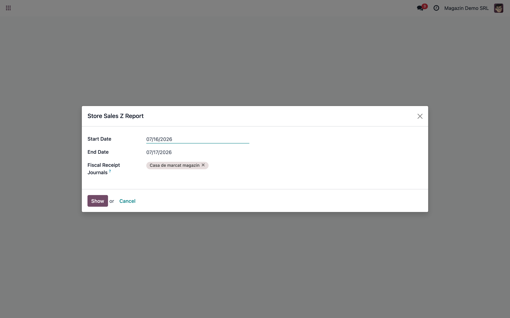
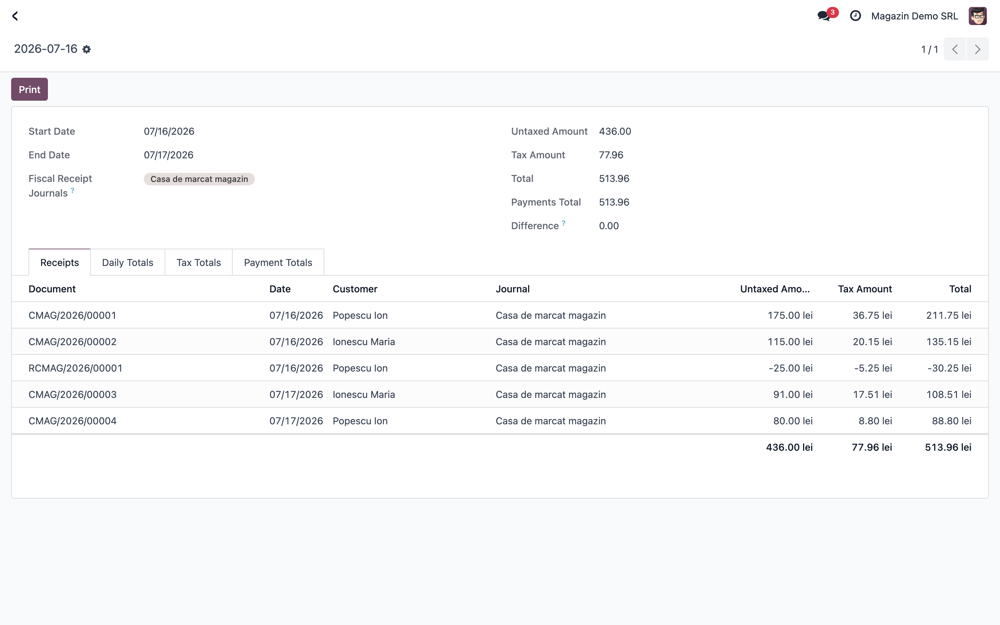
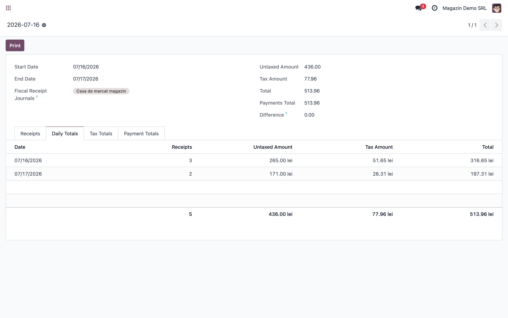
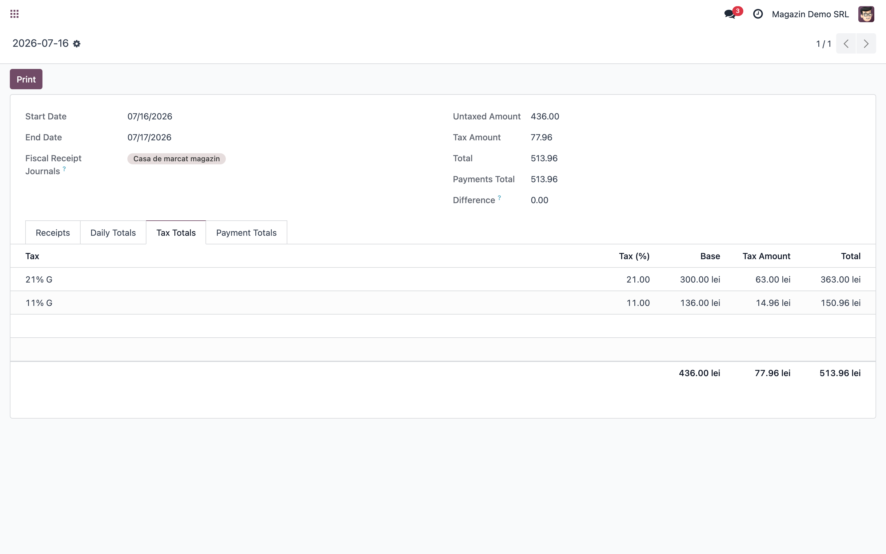
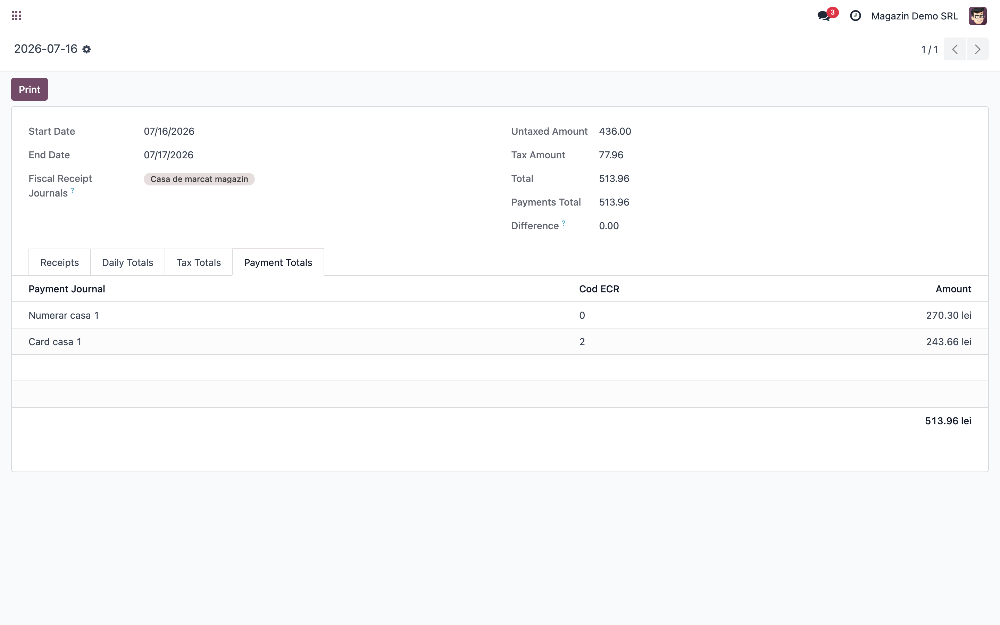
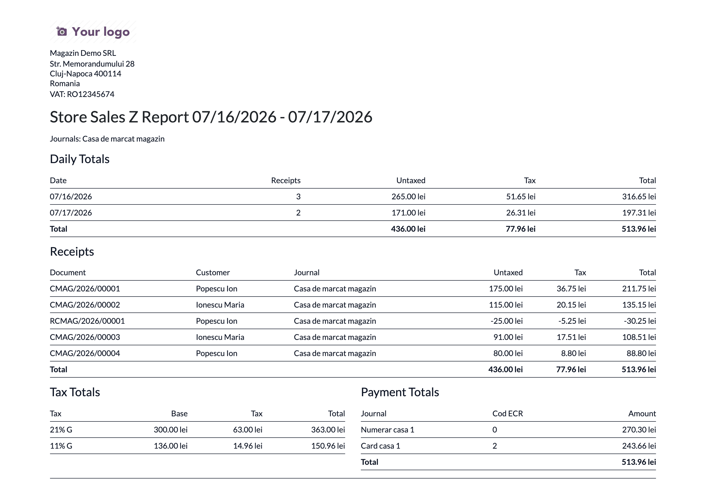

# Fișă Modul: Raport Z Vânzări Magazin (punctaj cu raportul Z al casei de marcat)

**Modul:** `deltatech_sale_store_report`
**Utilizator principal:** Operator magazin, Casier, Contabil
**Prioritate:** 🟠 Medie (verificare zilnică recomandată pentru magazinele care emit bonuri fiscale din Odoo)

---

## 1. Scop business

Modulul `deltatech_sale_store_report` oferă un raport al vânzărilor din magazin cu **bon
fiscal tipărit**, construit astfel încât să poată fi **punctat cu raportul Z** al casei de marcat
(raportul fiscal de închidere zilnică). Pentru o zi sau o perioadă și una sau mai multe case
(jurnale de bonuri fiscale), raportul afișează:

- **lista documentelor** (facturi, chitanțe, stornări) cu bon fiscal tipărit în interval;
- **totalurile pe zile** — pentru punctajul unei luni întregi cu șirul de rapoarte Z zilnice;
- **totalurile pe cote de TVA**, grupate exact cum le grupează fișierul trimis la casa de marcat
  (după prima taxă a fiecărei linii) — de comparat cu grupele de TVA (A/B/C…) de pe raportul Z;
- **totalurile pe tip de plată** (numerar, card, tichete), pe jurnalul de plată și codul ECR — de
  comparat cu totalurile pe tipuri de plată de pe raportul Z;
- un câmp **Difference** (total bonuri − plăți legate), evidențiat cu roșu când e nenul.

Consultantul folosește documentul pentru reproducerea fluxului în baza demo și pentru instruirea
clientului asupra punctajului zilnic casă de marcat ↔ Odoo.

## 2. Bază legală și context

- **OUG 28/1999** privind obligația operatorilor economici de a utiliza aparate de marcat
  electronice fiscale (AMEF) — raportul fiscal de închidere zilnică (raportul Z) este obligatoriu
  la sfârșitul fiecărei zile de vânzare.
- Vânzările încasate pe bon fiscal trebuie să se regăsească în evidența contabilă; punctajul zilnic
  Z ↔ documente emise din Odoo este verificarea operațională care garantează această corelare.

Modulul este un **raport de verificare** — nu generează note contabile și nu comunică cu casa de
marcat. Emiterea bonului (fișierul pentru ECR) este funcționalitatea modulului de bază
`deltatech_sale_store`.

## 3. Utilizatori și roluri

- **Operator magazin / casier:** rulează raportul la închiderea zilei, imediat după scoaterea
  raportului Z de pe casă, și semnalează diferențele.
- **Contabil:** verifică punctajul pe cote de TVA și pe tipuri de plată, arhivează PDF-ul lângă
  raportul Z fizic.
- **Consultant:** configurează jurnalele și instruiește clientul pe fluxul de punctaj.

Meniul raportului este vizibil pentru grupul **Facturare** (`account.group_account_invoice`).

## 4. Date și câmpuri implicate

Raportul se bazează pe datele din `deltatech_sale_store`:

- `account.journal.fiscal_receipt` — bifă pe **jurnalul de facturi** care reprezintă casa de marcat
  („Fiscal Receipts Journal"); un jurnal per casă de marcat, dacă sunt mai multe.
- `account.journal.cod_ecr` — pe **jurnalele de plată**, codul de plată al casei de marcat:
  `0` = numerar, `1` = tichet, `2` = card.
- `account.move.receipt_print` — marcat automat la generarea fișierului de bon fiscal (butonul de
  tipărire bon); raportul include **doar** documentele cu această bifă.
- `account.move.invoice_date` — documentele sunt selectate după **data facturii**; raportul
  corespunde cu Z-ul doar dacă bonul se tipărește în aceeași zi cu data facturii.
- Plățile se citesc din `matched_payment_ids` (plățile reconciliate cu documentele zilei), grupate
  pe jurnalul de plată.

Conturi uzuale implicate (informativ, prin jurnalele de plată): **5311** (casa în lei) pentru
numerar, cont de sume în curs de decontare (ex. **5125**) pentru încasările cu cardul — conform
configurării clientului.

## 5. Configurare inițială

1. Instalați modulul `deltatech_sale_store_report` (trage automat `deltatech_sale_store`).
2. Pe jurnalul de facturi al magazinului (tip *Vânzări*), bifați **Fiscal Receipts Journal**.
   Dacă există mai multe case de marcat, configurați câte un jurnal de facturi per casă.
3. Pe jurnalele de plată folosite în magazin, completați **Cod ECR**: `0` pe jurnalul de numerar,
   `2` pe cel de card, `1` pe cel de tichete. (Aceleași coduri sunt folosite la generarea
   fișierului pentru casa de marcat.)
4. Verificați că utilizatorii care rulează raportul au grupul **Facturare**
   (`account.group_account_invoice`).
5. Emiteți în baza demo câteva vânzări din magazin cu bon fiscal tipărit și încasate (numerar și
   card), pe cote diferite de TVA.

## 6. Flux de utilizare

### Pasul 1 — Deschiderea raportului

Accesați **Contabilitate → Contabilitate → Store Sales Z Report**. Se deschide fereastra de opțiuni
cu **intervalul de date** (implicit ambele date sunt azi, deci raportul rămâne zilnic dacă nu
schimbați nimic) și **jurnalele de bonuri fiscale** (implicit toate jurnalele companiei cu bifa
*Fiscal Receipts Journal*).

**Verificați:** pentru punctajul cu un anumit Z, lăsați selectat **doar jurnalul casei respective**;
pentru punctajul zilnic ambele date sunt ziua raportului Z, iar pentru verificarea unei luni întregi
setați intervalul lunii.

### Pasul 2 — Citirea rezultatului

Apăsați **Show**. Se deschide raportul cu totalurile generale (bază, TVA, total, plăți, diferență)
și patru tab-uri:

- **Receipts** — câte un rând per document cu bon tipărit: document, client, jurnal, bază, TVA,
  total; stornările apar cu **valori negative**;
- **Daily Totals** — câte un rând per zi din interval (număr de bonuri, bază, TVA, total) — pe
  acesta se face punctajul lună ↔ șirul de Z-uri;
- **Tax Totals** — totalurile pe cote de TVA (bază + TVA + total per cotă);
- **Payment Totals** — totalurile pe jurnal de plată, cu codul ECR și suma.

**Verificați** pe ecran: câmpul **Difference** este zero. O diferență nenulă înseamnă de regulă un
bon neîncasat complet sau o plată nelegată de document — de lămurit înainte de punctaj.

### Pasul 3 — Punctajul cu raportul Z

1. **Total vânzări:** totalul din raport = totalul vânzărilor de pe Z.
2. **Pe cote de TVA:** liniile din *Tax Totals* = grupele de TVA de pe Z (A/B/C…). Gruparea se face
   după prima taxă a fiecărei linii de factură, identic cu fișierul trimis la casă, deci valorile
   sunt comparabile unu-la-unu.
3. **Pe tipuri de plată:** liniile din *Payment Totals* = totalurile numerar / card / tichete de pe
   Z, identificabile prin **Cod ECR**.
4. **Pe o perioadă (ex. o lună):** fiecare rând din *Daily Totals* = totalul unui raport Z zilnic;
   o zi care nu bate se investighează apoi individual, rulând raportul doar pe ziua respectivă.

### Pasul 4 — Tipărirea PDF

Apăsați **Print** pe raportul afișat. Se generează PDF-ul cu toate secțiunile (pe un interval de
mai multe zile apare și tabelul cu totalurile pe zile), pentru
arhivare lângă raportul Z fizic.

## 7. Legături cu alte module / procese

| Modul / proces | Rol în flux | Tip legătură |
|---|---|---|
| `deltatech_sale_store` | fluxul de vânzare din magazin: bon fiscal, `receipt_print`, jurnale `fiscal_receipt`, `cod_ecr` | dependență (manifest) |
| Fișierul pentru ECR (`account.invoice.export.bf`) | sursa bonului tipărit; raportul grupează TVA identic cu acest fișier | corelare (date) |
| `deltatech_payment_report` | raport generic de încasări pe interval; util ca verificare complementară, dar fără cote de TVA | complementar |
| Registrul de casă / SAGA | punctajul Z ↔ Odoo precede predarea datelor către contabilitate | proces client |

Ce este automat: selecția documentelor cu bon tipărit, gruparea pe cote de TVA și pe coduri ECR,
semnul negativ la stornări, calculul diferenței față de plăți.
Ce rămâne manual: alegerea zilei și a casei, compararea efectivă cu cifrele de pe Z și lămurirea
diferențelor.

## 8. Verificări pentru consultant

- [ ] Modulul se instalează fără erori pe baza demo (trage `deltatech_sale_store`).
- [ ] Meniul **Store Sales Z Report** apare în Contabilitate pentru un utilizator cu grupul Facturare.
- [ ] Jurnalele cu *Fiscal Receipts Journal* sunt propuse implicit în wizard.
- [ ] O factură cu bon tipărit și încasată apare în *Receipts*, cu baza/TVA/total corecte.
- [ ] O factură **fără** bon tipărit (fără `receipt_print`) **nu** apare în raport.
- [ ] O stornare cu bon apare cu valori **negative** și scade totalul.
- [ ] *Tax Totals* însumează corect pe cote; suma bazelor + TVA = totalul general.
- [ ] *Payment Totals* arată jurnalul de plată cu **Cod ECR** corect (0/1/2) și suma încasată.
- [ ] **Difference** este 0 când toate bonurile sunt încasate integral și plățile legate.
- [ ] Pe un interval de mai multe zile, *Daily Totals* are câte un rând per zi, iar suma zilelor =
  totalul general.
- [ ] PDF-ul se generează și conține toate secțiunile (inclusiv totalurile pe zile la interval).

## 9. Mesaje de eroare și simptome frecvente

| Mesaj / simptom | Cauză probabilă | Remediere |
|-----------------|-----------------|-----------|
| Raportul e gol | Documentele nu sunt postate, nu au `receipt_print`, jurnalul nu are bifa *Fiscal Receipts Journal* sau data e greșită | Verificați bifa pe jurnal, starea documentelor și că bonul a fost tipărit din Odoo |
| **Difference** nenul | Bon neîncasat complet, plată nelegată (nereconciliată) de document sau plată rămasă în draft | Deschideți documentele din *Receipts* și verificați plățile legate |
| Un document apare pe raport deși bonul nu i-a fost tipărit | Factură **duplicată** dintr-una cu bon tipărit, pe versiuni `deltatech_sale_store` anterioare fixului `copy=False` pe `receipt_print` | Actualizați `deltatech_sale_store`; corectați manual bifa pe duplicat |
| Bonul tipărit a doua zi apare pe ziua greșită | Selecția se face pe **data facturii**, nu pe momentul tipăririi | Disciplina operațională: bonul se tipărește în ziua facturii; altfel diferența se explică manual la punctaj |
| Totalul nu bate cu Z, fără diferențe în Odoo | Bonuri emise **direct pe casă**, fără document în Odoo, sau fișier generat din Odoo dar nerulat pe casă | Comparați bon cu bon lista *Receipts* cu banda casei; raportul e exact instrumentul care izolează aceste cazuri |
| Linia de plată are Cod ECR gol | `cod_ecr` necompletat pe jurnalul de plată | Completați codul ECR pe jurnal (0 numerar, 1 tichet, 2 card) |
| Meniul nu apare | Utilizatorul nu are grupul Facturare | Acordați `account.group_account_invoice` |

## 10. Limitări cunoscute

- **Nu există timestamp de tipărire a bonului** — selecția se face pe `invoice_date` (decizie de
  proiectare, pentru a nu adăuga câmpuri pe `account.move`). Corespondența cu Z ține doar dacă
  bonurile se tipăresc în ziua facturii.
- `receipt_print` se marchează la **generarea fișierului** pentru casă, nu la tipărirea fizică a
  bonului — un fișier generat dar nerulat pe casă apare în raport, dar nu pe Z.
- Raportul acoperă fluxul de vânzare din magazin pe facturi/chitanțe (`deltatech_sale_store`);
  **nu** acoperă vânzările din Odoo POS.
- Sumele sunt în moneda companiei.

## 11. Capturi de ecran

Capturile (`readme/screenshots/`) sunt realizate manual pe o bază demo cu planul de conturi RO
(cotele actuale 21% / 11%), companie „Magazin Demo SRL", o casă de marcat (jurnalul *Casa de marcat
magazin*) și jurnale de plată cu cod ECR 0 (numerar) și 2 (card): facturi cu bon fiscal și o
stornare pe două zile consecutive, toate încasate integral (Difference = 0).

1. `01_wizard_optiuni.png` — fereastra de opțiuni: intervalul de date și jurnalele de bonuri fiscale.
2. `02_raport_bonuri.png` — rezultatul cu totalurile generale și tab-ul *Receipts* (stornarea în negativ).
3. `03_totaluri_tva.png` — tab-ul *Tax Totals*: baze și TVA pe cote (21%, 11%).
4. `04_totaluri_plati.png` — tab-ul *Payment Totals*: numerar / card, cu codul ECR.
5. `05_raport_pdf.png` — raportul tipărit (PDF), cu toate secțiunile.
6. `06_totaluri_zilnice.png` — tab-ul *Daily Totals*: câte un rând per zi din interval.

## 12. Observații pentru manual

În manualul clientului, prezentați raportul ca **rutina de închidere de zi**: scoate Z-ul de pe
casă → rulează *Store Sales Z Report* pe ziua și casa respectivă → verifică Difference = 0 →
punctează totalul, cotele de TVA și tipurile de plată → tipărește PDF-ul și arhivează-l lângă Z.
Accentuați că raportul nu „repară" diferențele — le face vizibile bon cu bon, iar lămurirea lor
(bon lipsă în Odoo, bon nerulat pe casă, plată nelegată) este pasul de disciplină zilnică al
magazinului. Pentru contabil, menționați și verificarea lunară: raportul rulat pe întreaga lună,
cu *Daily Totals* punctat rând cu rând cu șirul de rapoarte Z zilnice.
