# Fișă Modul: Echipamente în contract — instalare, citiri și facturare pe consum

**Modul:** `deltatech_service_equipment`
**Utilizator principal:** Responsabil service (instalări, contracte), tehnician (citiri), facturare
(emiterea facturilor lunare pe consum)
**Prioritate:** 🔴 Ridicată (cantitatea de pe factura clientului vine direct din citirile de contor)

---

## 1. Scop business

O firmă care închiriază sau întreține echipamente cu plată pe consum (multifuncționale plătite pe
pagină, echipamente plătite pe oră de funcționare) facturează lunar diferența dintre două citiri de
contor. Pentru asta are nevoie ca echipamentul, contorul, contractul și factura să fie legate.

Modulul leagă echipamentele din `deltatech_service_equipment_base` de contractele din
`deltatech_service_agreement` și aduce:
- **ciclul de viață al echipamentului**: *Disponibil → Instalat* la client, cu adresa și
  amplasamentul, apoi dezinstalare;
- **asistenții de operații**: **Instalare**, **Adaugă la contract** și **Elimină din contract**
  (dezinstalare), fiecare cu citirea contoarelor și cu o înregistrare în istoric;
- **contoarele create din șabloanele categoriei** echipamentului (butonul **Creează contoare**);
- **liniile de contract legate de echipament și contor**. La pregătirea facturării, cantitatea
  liniei se calculează din citirile nefacturate;
- **blocarea facturării fără citiri**, pe tipurile de contract care cer citiri;
- **anexa de contoare** a facturii (export XLS cu indexul vechi, indexul nou și diferența);
- **istoricul** instalărilor, adăugărilor în contract și dezinstalărilor;
- **crearea automată a echipamentului** la crearea unei serii (lot) pentru un produs dintr-o
  categorie marcată *Tipul de echipament este obligatoriu*.

## 2. Bază legală și context

Factura se emite ca orice factură client din Odoo, pe jurnalul de vânzări al tipului de contract:

| Operație | Notă contabilă | Observații |
|---|---|---|
| Service / tipărire plătite pe pagină | 4111 = 704 + 4427 | 704 „Venituri din servicii prestate” |
| Chiria echipamentului (dacă se facturează separat) | 4111 = 706 + 4427 | 706 „Venituri din redevențe, locații de gestiune și chirii” |

Modulul nu decide contul: contul de venit vine de pe **produsul-serviciu** (secțiunea 5). Alegeți pe
fiecare serviciu contul potrivit operațiunii (704 pentru service pe pagină, 706 pentru chirie), nu 701
(produse finite) sau 707 (mărfuri).

**Taxa** vine din taxele produsului, cu cota standard de 21 % în 2026. **Facturarea din consumuri nu
aplică poziția fiscală a clientului** (vezi limitările): pentru clienți din UE sau din afara UE,
corectați manual taxa și contul pe factura în ciornă.

Prestările facturate lunar pe citiri sunt **prestări cu decontări succesive**: se consideră efectuate
la data citirii (art. 281 alin. (7) din Legea 227/2015), iar factura se emite cel târziu pe 15 a
lunii următoare (art. 319 alin. (16)). De aceea factura se datează la data ultimei citiri incluse,
nu la începutul perioadei (Pasul 6).

Pe factură, eticheta liniei include echipamentul și indexurile („Index vechi … Index nou …”), iar
anexa XLS de contoare servește ca document justificativ al cantității facturate.

## 3. Utilizatori și roluri

Drepturile vin din grupurile `deltatech_service_base` (secțiunea *Serviciu* din fișa utilizatorului)
și din drepturile de facturare Odoo:

| Rol | Ce face | Drept Odoo |
|---|---|---|
| Responsabil service | instalează echipamente, le adaugă în contracte, creează contoare, pregătește facturarea | **Serviciu / Manager** |
| Tehnician | introduce citiri (**Adaugă citiri**) | **Serviciu / Utilizator** |
| Facturare | emite și confirmă facturile | **Serviciu / Utilizator** + **Facturare / Facturare** |
| Excepție de la citiri | poate pregăti facturarea fără citiri, pe contractele care le cer | grupul **Poate factura fără citiri de contor** |

Butoanele **Instalare**, **Adaugă la contract**, **Elimină din contract** și **Creează contoare** din
fișa echipamentului sunt vizibile doar pentru **Manager**. Pentru restricțiile de drepturi
moștenite din modulul de bază (piese, verificări, măsurători), vezi fișa
`deltatech_service_equipment_base`.

## 4. Conturi și date implicate

| Obiect | Rol |
|---|---|
| Echipament (`service.equipment`) | primește starea de instalare, clientul, adresa, amplasamentul, contractul, data instalării |
| Contor și citiri | citirile se leagă de consumul facturat (*Consum*), ca să nu fie facturate de două ori |
| Linie de contract (`service.agreement.line`) | serviciul facturat, prețul, echipamentul și contorul |
| Consum (`service.consumption`) | cantitatea și prețul pe perioadă, din care se face factura |
| Istoric (`service.history`) | jurnalul operațiilor pe echipament și contract |
| Cont 704 (706 la chirie) / 4427 / 4111 | prin factura client (secțiunea 2) |

Date demo folosite în capturi: compania **Demo Service Imprimante SRL**, clientul **Tipografia Nord
SRL** (sediul din Suceava), multifuncționalul **MF-0231** (Canon imageRUNNER 1643i), instalat la
începutul lunii de acum două luni cu indexul **12.000**. Contractul **AG/00001** are tipul „Service
cu plată pe pagină”, cu serviciul „Pagină A4 alb-negru” la **0,05 lei / pagină** (cont 704).

| Citire | Index | Diferență |
|---|---|---|
| La instalare | 12.000 | 0 (*Valoare inițială* a contorului = 12.000) |
| Sfârșitul primei luni | 14.850 | 2.850 |
| Sfârșitul lunii trecute | 17.600 | 2.750 |

Pregătirea facturării pe luna trecută adună citirile nefacturate: **5.600 pagini × 0,05 = 280,00
lei**, plus TVA 21 % 58,80 lei, total **338,80 lei**. Nota contabilă a facturii: 4111 = 704 280,00
+ 4427 58,80.

Al doilea multifuncțional, **MF-0232**, e *Disponibil* și servește la capturile de instalare.

## 5. Configurare inițială

1. **Categorie contor** (*Serviciu → Configurare → Categorie contor*): pe lângă unitatea de măsură a
   citirii, completați **Unitate de măsură pentru facturare**. Folosiți **aceeași unitate** ca la
   citire (vezi limitările: conversia între unități e greșită).

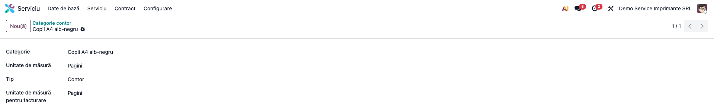

2. **Categorie echipament** (*Serviciu → Configurare → Categorie echipament*): în lista de șabloane
   adăugați, pentru fiecare contor, **serviciul facturat**, **categoria de contor** și **moneda**.
   Din aceste șabloane se creează contoarele echipamentului și liniile de contract.

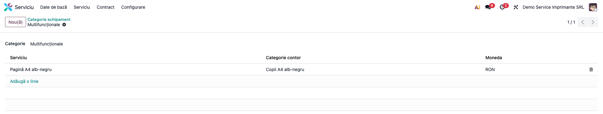

3. **Tip echipament**: alegeți *Categoria*. Tab-ul *Contoare* al tipului afișează șabloanele
   categoriei: se editează pe categorie.
4. **Produsul-serviciu** (ex. „Pagină A4 alb-negru”): de tip *Serviciu*, cu contul de venit din grupa
   **704** și taxa de vânzare corectă.
5. **Tip contract** (*Serviciu → Configurare → Tip contract servicii*): jurnalul de vânzări și bifa
   **Necesită citiri pentru facturare**. Cu ea, pregătirea facturării e refuzată pentru contractele
   fără *Citiri efectuate*.

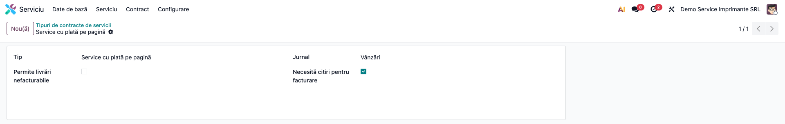

6. **Opțional — echipament automat din serie**: pe categoria produsului bifați *Tipul de echipament
   este obligatoriu* și pe produs alegeți *Tip echipament*. La crearea unei serii (lot) pentru acel
   produs se creează automat echipamentul, cu seria și tipul completate.
7. **Opțional — livrări nefacturabile**: în setările *Inventar*, *Ieșire nefacturabilă* alege tipul
   de operație folosit pentru consumabilele date în service (vezi limitările).

## 6. Flux de utilizare

### Pasul 1 — Echipamentul disponibil și contoarele lui

Un echipament nou e **Disponibil**. În antetul fișei, un *Manager* vede ①: **Adaugă citiri**,
**Adaugă la contract**, **Instalare** și, cât echipamentul nu are contoare, **Creează contoare**.
Ordinea corectă e **Creează contoare → Instalare → Adaugă la contract**. *Adaugă la contract* trece
și el echipamentul în *Instalat*.

Schimbați starea echipamentului **doar prin asistenți**, nu din bara de stare: bara din modulul de
bază se poate apăsa și schimbă starea fără client, citiri sau istoric.

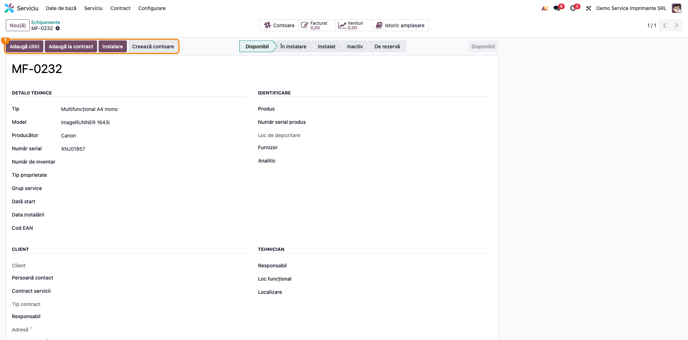

**Creează contoare** creează câte un contor pentru fiecare șablon al categoriei. Înainte de prima
citire, completați pe fiecare contor **Valoare inițială** = indexul de la punerea în funcțiune
(vezi Pasul 5 și limitările). Apăsați butonul **pe câte un echipament**, nu pe o selecție.

### Pasul 2 — Instalarea la client

**Instalare** deschide asistentul: *Client* (obligatoriu), *Locație* (adresa clientului unde e
instalat), *Amplasament* (text liber, ex. „Etaj 1, birou DTP”), *Data* și, la *Citiri*, indexul
fiecărui contor. **Aplică**:
- trece echipamentul în **Instalat**, cu clientul, adresa și amplasamentul;
- creează citirile introduse;
- scrie în istoric „Instalare echipament la …”.

Secțiunea *Elimină / Perioadă* din asistent nu contează la instalare.

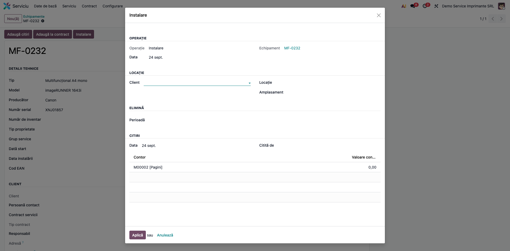

*Data instalării* se pune **ziua curentă**, nu data din asistent. Corectați-o în fișa
echipamentului **după** pasul următor, pentru că și *Adaugă la contract* o rescrie (vezi
limitările).

### Pasul 3 — Adăugarea în contract

Creați **întâi contractul**: *Serviciu → Contract → Contracte → Nou(ă)*, cu partenerul, *Ciclul de
facturare*, *Tipul* și *Data contractului* (nu mai târziu decât prima citire facturabilă). În
asistentul **Adaugă la contract**, contractul e obligatoriu.

În asistent alegeți contractul și, la *Citiri*, **introduceți indexul curent** al fiecărui contor
(ex. 12.000). Asistentul propune 0; lăsat așa, creează o citire 0 care strică diferențele următoare
(vezi limitările). **Aplică** creează, pentru fiecare șablon de contor al categoriei, o linie de
contract cu serviciul, contorul și unitatea de facturare. Echipamentul primește contractul, iar
istoricul primește „Adăugare la contract …”.

După acest pas, corectați *Data instalării* în fișa echipamentului, dacă instalarea nu a fost azi.

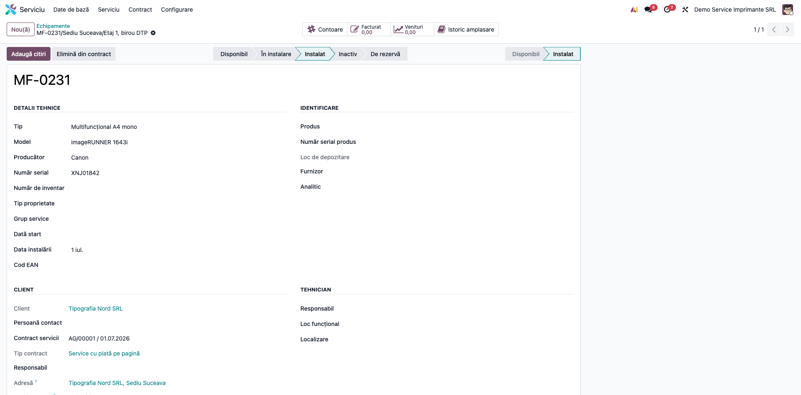

Liniile noi au **prețul 1**: completați prețul real pe fiecare linie, apoi deschideți contractul
(**În curs**). Liniile legate de un contor apar cu roșu, pentru că au cantitatea 0: e normal,
cantitatea vine din citiri.

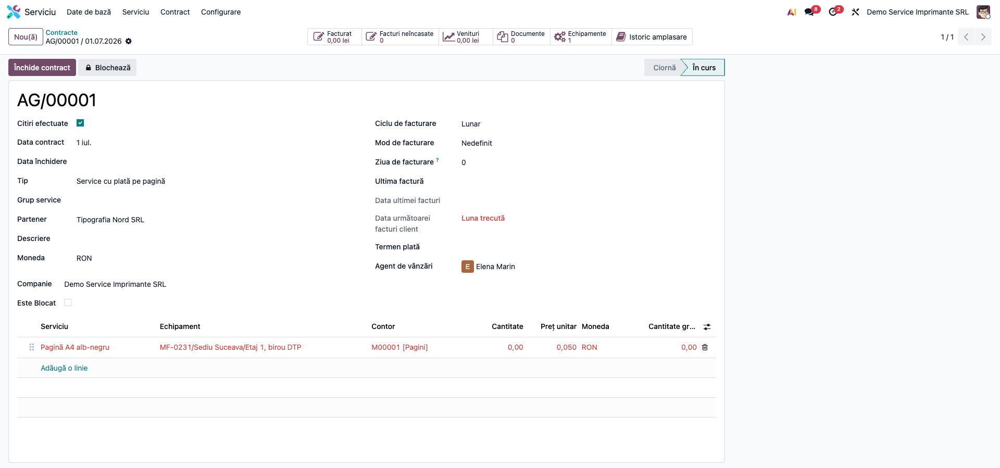

Pe fișa contractului, butonul **Echipamente** arată echipamentele din contract, iar **Istoric
amplasare** arată istoricul contractului.

### Pasul 4 — Citirile lunare

**Adaugă citiri** din fișa echipamentului deschide asistentul *Introducere citiri contoare* din
modulul de bază. Asistentul propune valoarea estimată la data aleasă și avertizează la o valoare mai
mică decât ultima citire sau la citiri ulterioare datei. Citirile se pot introduce și direct din
*Citiri contoare* (vezi fișa `deltatech_service_equipment_base`).

Pe echipamentele cu piese, verificări sau măsurători, un *Utilizator* nu poate deschide fișa (vezi
fișa modulului de bază). Tehnicianul introduce atunci citirile din *Serviciu → Serviciu → Citiri
contoare*.

Pe contract, după citiri, bifați **Citiri efectuate**. Dacă un echipament din contract nu are citiri
mai noi de 7 zile, Odoo afișează un avertisment și **debifează** câmpul.

### Pasul 5 — Pregătirea facturării

*Serviciu → Contract → Contracte*: selectați contractele și apăsați **Pregătire facturare** în
antetul listei (sau **Acțiuni → Pregătire facturare**). Alegeți **Perioada** și **Aplică**.

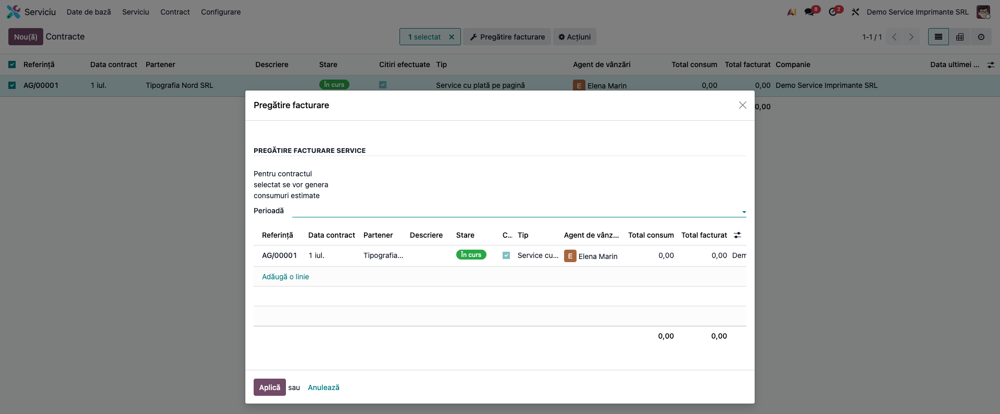

Pentru fiecare linie legată de un contor se creează un **consum**. Cantitatea e suma diferențelor
tuturor citirilor **încă nefacturate**, cu data între data contractului (sau data instalării, dacă e
mai târzie) și sfârșitul perioadei. Nu contează doar citirile din perioadă, ci toate cele nefacturate.
Citirile preluate se leagă de consum și nu mai intră în altă facturare. Eticheta consumului
conține echipamentul și indexurile. Coloana *Venituri* rămâne 0 până la facturare: se calculează din
cantitatea facturată.

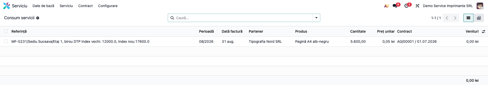

Pe un tip de contract cu **Necesită citiri pentru facturare**, contractele fără *Citiri efectuate*
sunt refuzate („Contractul … nu are citirile de contor efectuate.”). Excepție: utilizatorii din
grupul *Poate factura fără citiri de contor*. Pe facturarea automată programată, contractele fără
*Citiri efectuate* sunt sărite, indiferent de tip.

### Pasul 6 — Facturarea

Înainte de facturare, **datați consumurile** la data ultimei citiri incluse: din lista *Consum
servicii*, selectați consumurile și **Acțiuni → Schimbă data facturii** (în demo, ultima zi a
lunii). Implicit, data vine din *Data următoarei facturi client* a contractului și poate fi
începutul perioadei, adică înaintea citirii facturate (secțiunea 2).

*Serviciu → Contract → Facturare* (sau, din lista de consumuri, **Acțiuni → Facturare**): alegeți
jurnalul și gruparea (pe partener, pe contract sau pe linie de contract), apoi **Aplică**. Rezultă
facturile client în ciornă. Din cantitatea consumului se scade *Cantitatea gratuită* a liniei de
contract; un consum sub cantitatea gratuită nu se facturează.

Pe factură, **Exportă contoarele în XLS** ① descarcă anexa de contoare: echipament, serie, contor,
adresă, index vechi, index nou și diferență, cu totalul.

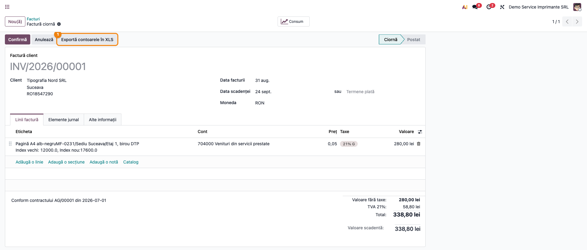

Înainte de confirmare, verificați **data facturii**: cel puțin data ultimei citiri incluse și cel
târziu 15 a lunii următoare. Verificați și **taxa**, la clienții cu poziție fiscală (UE, export).
Factura se transmite apoi în e-Factura în 5 zile lucrătoare.

### Pasul 7 — Dezinstalarea

**Elimină din contract** deschide asistentul de **dezinstalare** (nu doar scoaterea din contract).
Alegeți **Perioada** de facturare a consumului rămas și introduceți indexul de la dezinstalare.
**Aplică**:
- creează citirea de dezinstalare și pregătește consumul rămas pe perioada aleasă (consumul se
  facturează apoi ca în Pasul 6);
- refuză dezinstalarea („Trebuie să facturați consumul înainte de dezinstalare”) dacă citirea de
  dezinstalare nu intră în consum, de exemplu când data ei e după sfârșitul perioadei alese;
- trece echipamentul în **Disponibil**, fără client și fără contract, și dezactivează liniile lui de
  contract;
- scrie în istoric „Dezinstalare echipament de la …”.

Alegeți o perioadă **încă nepregătită** pentru acel contract (vezi limitările).

### Pasul 8 — Istoricul

*Serviciu → Serviciu → Istoric echipament/contract* sau butonul **Istoric amplasare** din fișa
echipamentului arată operațiile: instalare, adăugare în contract, dezinstalare.

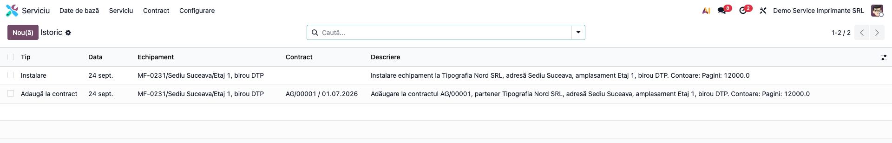

## 7. Legături cu alte module / declarații

- **`deltatech_service_equipment_base`** (dependență) — echipamente, contoare, citiri, estimare,
  asistentul *Introducere citiri contoare*. Vezi fișa lui pentru limitările citirilor: o citire cu
  dată în trecut umflă consumul facturat până la **Recalculează valorile**.
- **`deltatech_service_agreement`** (dependență) — contractele, tipurile de contract, perioadele,
  consumurile, pregătirea facturării și facturarea.
- **`account`** — factura client și nota 4111 = 704 (706 la chirie) + 4427; **`stock`** — seria echipamentului,
  locația de stoc și tipul de locație (*În stoc*, *În chirie*, *Client*).
- **D300 / D394 / e-Factura**: factura emisă intră ca orice factură client în decontul de TVA și în
  D394. Facturile către clienții din România, persoane juridice și persoane fizice, se transmit în
  e-Factura în 5 zile lucrătoare de la emitere. Modulul nu modifică aceste fluxuri.

## 8. Verificări pentru consultant

- [ ] Categoria echipamentului are șabloane de contoare cu serviciu, categorie de contor și monedă.
- [ ] Categoria de contor are *Unitatea de măsură pentru facturare* **egală** cu unitatea citirii.
- [ ] Produsul-serviciu are contul de venit potrivit (704 service pe pagină, 706 chirie) și taxa
      corectă.
- [ ] La un client cu poziție fiscală (UE, export), factura în ciornă se corectează manual: taxa și
      contul nu se mapează.
- [ ] *Valoare inițială* a fiecărui contor = indexul de la instalare, iar în **Adaugă la contract**
      s-a introdus indexul curent, nu 0. Pe demo, prima factură are
      „Index vechi: 12000.0, Index nou: 17600.0” și 5.600 pagini, nu 17.600.
- [ ] După **Instalare** și **Adaugă la contract**, echipamentul e *Instalat*, cu clientul, adresa
      și contractul. *Data instalării* e corectată după ambele operații, dacă instalarea s-a făcut
      în altă zi.
- [ ] Liniile de contract create de **Adaugă la contract** au prețul real (nu 1).
- [ ] Pe un tip de contract cu citiri obligatorii, pregătirea facturării e refuzată fără *Citiri
      efectuate*.
- [ ] Pe demo: consum 5.600 × 0,05 = 280,00 lei, TVA 58,80, total 338,80; nota 4111 = 704 + 4427;
      factura datată 31 a lunii citirii, nu 1.
- [ ] O a doua pregătire a facturării nu refacturează citirile deja legate de un consum.
- [ ] Anexa XLS a facturii arată indexul vechi, indexul nou și diferența.

## 9. Mesaje de eroare frecvente

| Mesaj / simptom | Cauză probabilă | Remediere |
|---|---|---|
| Prima factură are toată valoarea contorului („Index vechi: 0.0”) | *Valoare inițială* a contorului e 0, iar citirea de la instalare intră în consum cu diferența ei | Completați *Valoare inițială* = indexul de la instalare **înainte** de prima pregătire a facturării |
| Consum 0 deși există citiri | *Data instalării* (ziua în care s-a apăsat **Instalare** sau **Adaugă la contract**) sau *Data contractului* e după citiri | Corectați *Data instalării* (după ambele operații) și *Data contractului* |
| Diferență negativă mare după **Adaugă la contract**, apoi o factură cu tot indexul | În asistent s-a lăsat valoarea propusă 0 la *Citiri* | Ștergeți citirea 0 (dacă a intrat deja într-un consum, ștergeți întâi consumul, cât timp nu e facturat) și apăsați **Recalculează valorile** pe contor |
| TVA 21 % pe factura unui client UE / export | Facturarea din consumuri nu aplică poziția fiscală | Corectați taxa și contul pe factura în ciornă |
| Cantitate facturată de 1.000.000 de ori mai mare (sau mai mică) | Unitatea de facturare a contorului diferă de unitatea citirii; conversia e inversată | Folosiți aceeași unitate la citire și la facturare |
| „Contractul … nu are citirile de contor efectuate.” | Tipul de contract cere citiri, iar *Citiri efectuate* nu e bifat | Introduceți citirile și bifați *Citiri efectuate*, sau grupul *Poate factura fără citiri de contor* |
| „Trebuie să facturați consumul înainte de dezinstalare” | Citirea de dezinstalare nu a intrat în consumul perioadei (ex. data ei e după sfârșitul perioadei alese) | Alegeți perioada care conține data dezinstalării |
| „Există deja o linie de contract în această perioadă!” la dezinstalare | Perioada aleasă a fost deja pregătită pentru facturare | Alegeți perioada următoare, încă nepregătită |
| „Nu există un șablon de contor definit pentru acest tip de echipament.” | **Adaugă la contract** pe un echipament fără contoare, cu o categorie fără șabloane | Adăugați șabloane pe categoria echipamentului |
| „Citirea de contor a fost înregistrată în consumul pregătit pentru facturare.” | Ștergerea unei citiri deja preluate într-un consum | Ștergeți întâi consumul (dacă nu e facturat) |
| „Codul EAN există deja!” | Codul EAN e unic pe echipamente | Corectați codul |
| Eroare „Invalid field stock.picking.equipment_id” la **Actualizează veniturile** | E setată *Ieșire nefacturabilă*, dar livrările nu au legătură cu echipamentul | Lăsați setarea goală (vezi limitările) |
| Echipamentele noi se numesc „New” | Numerotarea automată e definită doar pentru compania principală a bazei | Dați numele manual în celelalte companii |

## 10. Capturi de ecran

Capturile (`readme/screenshots/`) se generează automat din `tests/test_screenshots.py`, cu mixinul
`ScreenshotCase` din `l10n_ro_doc_screenshots` (import defensiv). Sunt în **limba română**, pe
compania **Demo Service Imprimante SRL**, cu planul de conturi RO și datele demo din secțiunea 4.

| # | Fișier | Conținut |
|---|---|---|
| 1 | `01_categorie_sabloane_contoare.png` | Categoria de echipament, cu șablonul de contor |
| 2 | `02_categorie_contor.png` | Categoria de contor, cu unitatea de facturare |
| 3 | `03_tip_contract.png` | Tipul de contract, cu citiri obligatorii |
| 4 | `04_echipament_disponibil.png` | Echipament disponibil, cu butoanele de operații |
| 5 | `05_instalare.png` | Asistentul de instalare |
| 6 | `06_echipament_instalat.png` | Echipamentul instalat, cu contractul |
| 7 | `07_contract.png` | Contractul, cu linia legată de echipament și contor |
| 8 | `08_pregatire_facturare.png` | Asistentul **Pregătire facturare** |
| 9 | `09_consumuri.png` | Consumul calculat din citiri |
| 10 | `10_factura.png` | Factura client, cu **Exportă contoarele în XLS** |
| 11 | `11_istoric.png` | Istoricul operațiilor |

Regenerare:

```bash
./odoo/odoo-bin -c odoo.conf -d <db> -i deltatech_service_equipment,l10n_ro,l10n_ro_doc_screenshots \
    --test-tags=/deltatech_service_equipment:TestServiceEquipmentFlowScreenshots --stop-after-init \
    --http-port=8993 --gevent-port=8994
```

## 11. Observații pentru manual

Păstrați ordinea de lucru:
1. categoria de contor (unitate de facturare = unitatea citirii);
2. produsul-serviciu (cont 704 sau 706, taxă);
3. categoria de echipament cu șabloanele de contoare, apoi tipul de echipament;
4. tipul de contract (jurnal, citiri obligatorii);
5. pe echipament: **Creează contoare**, apoi **Valoare inițială** pe fiecare contor;
6. **Instalare**;
7. contractul (*Contracte → Nou*), apoi **Adaugă la contract** cu indexul curent, prețul pe linii,
   **În curs**; abia acum corectați *Data instalării*, dacă e cazul;
8. lunar: citiri, *Citiri efectuate*, **Pregătire facturare**, **Schimbă data facturii**,
   **Facturare**, verificarea datei și a taxei, confirmarea, transmiterea în e-Factura.

Subliniați pentru client că **factura se calculează din diferențele citirilor**: o citire greșită
sau introdusă cu dată în trecut ajunge direct pe factură.

### Limitări cunoscute

- **Conversia între unitatea citirii și unitatea de facturare e inversată** în Odoo 19: la o unitate
  de facturare „1.000 pagini”, 12.000 de pagini citite devin 12.000.000 de unități facturate, în loc
  de 12. Folosiți aceeași unitate la citire și la facturare.
- **Citirea de la instalare e facturată cu diferența ei față de *Valoare inițială***: cu valoarea
  inițială 0, prima factură ia tot indexul contorului.
- **Data instalării e ziua curentă**, nu data din asistent, atât la **Instalare**, cât și la **Adaugă
  la contract**. Citirile dinainte de ea nu mai intră în facturare.
- **Asistentul „Adaugă la contract” propune indexul 0** la *Citiri* și, lăsat așa, creează o citire 0.
  Diferențele următoare pornesc de la 0, iar anexa XLS arată indexul vechi 0.
- **Facturarea din consumuri nu aplică poziția fiscală**: taxa vine din produs și contul din
  categoria lui, fără mapare pentru clienți UE / export.
- **Data implicită a facturii** vine din *Data următoarei facturi client* și poate fi înaintea
  citirilor facturate; se corectează cu **Schimbă data facturii** pe consumuri.
- **Liniile de contract create de „Adaugă la contract” au prețul 1**.
- **Datele din istoric** sunt ziua operației, nu data din asistent.
- **„Elimină din contract” dezinstalează echipamentul**, nu doar îl scoate din contract, și crapă
  („Există deja o linie de contract în această perioadă!”) dacă perioada aleasă a fost deja
  pregătită pentru facturare.
- **„Creează contoare” pe mai multe echipamente deodată** dă fiecărui echipament și contoarele
  categoriilor celorlalte. Apăsați-l pe câte un echipament.
- **Starea echipamentului are alte valori decât în modulul de bază** (*Disponibil, În instalare,
  Instalat, Inactiv, De rezervă* în loc de *Activ, Defect, În reparație…*), iar fișa afișează **două
  bare de stare**. Bara din modulul de bază se poate apăsa: schimbați starea doar prin asistenți.
- **Butonul „Adaugă citiri” apare și pe echipamentele fără contoare.**
- **Eticheta liniei de factură lipește numele serviciului de echipament** fără spațiu (ex. „Pagină A4
  alb-negruMF-0231/…”); corectați-o manual dacă e nevoie.
- **„Actualizează veniturile”** (Acțiuni pe echipament) dă eroare când e setată *Ieșire
  nefacturabilă*; fără această setare, costurile consumabilelor rămân 0.
- **Numerotarea automată a echipamentelor și a locurilor funcționale** e definită doar pentru
  compania principală a bazei; în celelalte companii, un echipament nou se numește „New”.
- **Facturarea automată programată** sare orice contract fără *Citiri efectuate*, chiar dacă tipul
  lui nu cere citiri.
