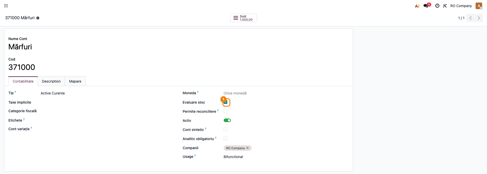
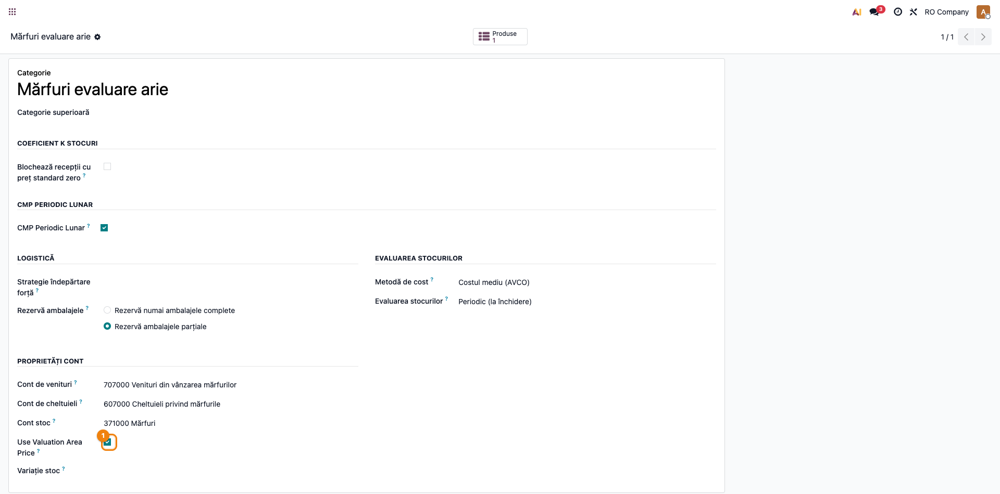
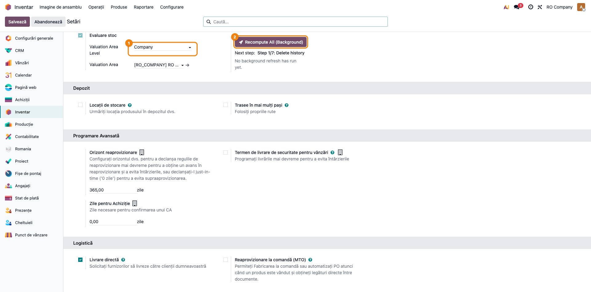
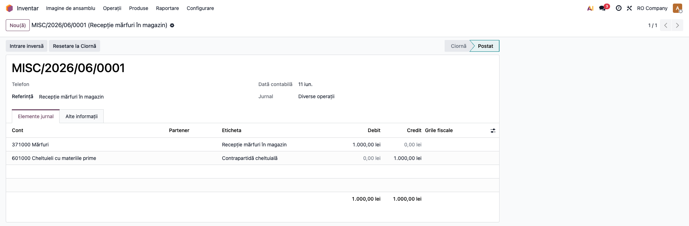
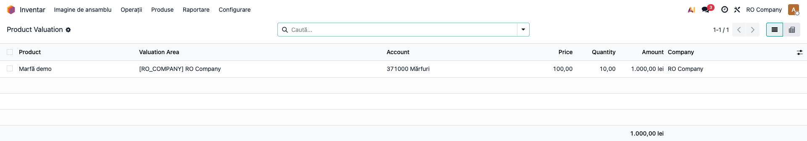
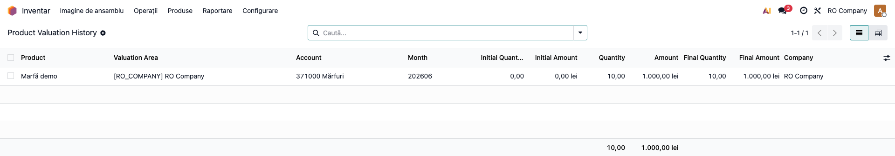
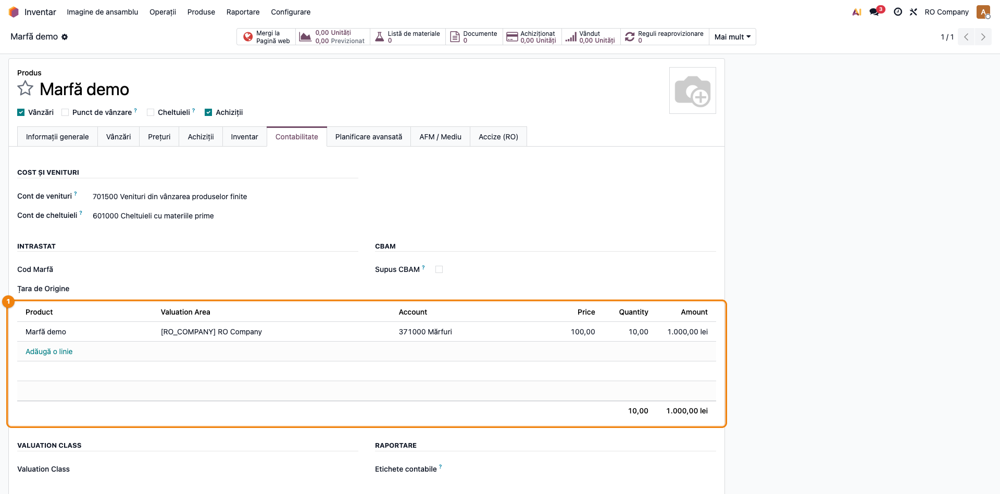

# Fișă Modul: Product Stock Valuation

**Modul:** `deltatech_stock_valuation`  
**Rol principal:** evaluare de stoc pe produs + arie de evaluare + cont contabil, bazată pe note contabile  
**Utilizatori principali:** contabil stocuri, controller, administrator Odoo

---

## 1. Scop

Modulul adaugă un strat de evaluare paralel cu mecanismul standard Odoo. În loc
să ia drept sursă mișcările de stoc sau straturile clasice, el reconstruiește
valoarea și cantitatea din `account.move.line` postate.

Rezultatul este urmărit în două modele:

- `product.valuation` — soldul curent;
- `product.valuation.history` — istoricul lunar.

Granularitatea actuală este:

- produs;
- arie de evaluare;
- cont contabil;
- companie.

## 2. Când este util

- când vrei reconciliere mai bună între stoc și contabilitate;
- când ai nevoie de raportare pe arii de evaluare;
- când există corecții contabile manuale și vrei ca evaluarea să urmărească exact
  notele postate;
- când modelul de cost folosit este **AVCO**.

## 3. Configurare

### 3.1 Condiții de bază

Modulul depinde de `deltatech_valuation_area`, deci compania trebuie să aibă
Valuation Area activă și o arie implicită configurată.

### 3.2 Setări companie

Meniu: `Inventar → Configurare → Setări`

Câmpuri relevante:

| Câmp | Rol |
|---|---|
| `Valuation Area Level` | nivelul de lucru: company / warehouse / location |
| `Valuation Area` | aria implicită a companiei |

Important: fluxul de **refresh** livrat în UI este funcțional doar când
`Valuation Area Level = company`.

### 3.3 Conturi de evaluare

Pe `account.account` există câmpul:

- **Stock Valuation** (`is_for_stock_valuation`)

Acest marcaj spune modulului ce conturi intră în calcul.

### 3.4 Categorii de produs

Pe categorie există opțiunea:

- **Use Valuation Area Price**

Când este activă, **ieșirile din locațiile interne** se valorizează la prețul
din `product.valuation` pentru aria și contul curent, nu la `standard_price`.
În Odoo 19 mecanismul funcționează din nou, ca post-procesare a valorizării
standard (`_set_value`): după ce Odoo calculează valoarea mișcării, modulul o
rescrie la prețul ariei de evaluare.

Reguli de aplicare:

- doar pentru categorii cu metoda **AVCO** — **FIFO** este blocat prin
  validare. La încercarea de activare pe categorie FIFO apare mesajul:

  > `Category '...': Use Valuation Area Price is not compatible with FIFO costing method. Please use AVCO.`

- produsele **valorizate pe lot** (`lot_valuated`) sunt excluse — pentru ele
  rămâne valorizarea per lot din core;
- dacă nu există evaluare utilizabilă pentru aria curentă (sau preț zero),
  se revine la **prețul standard**, cu un avertisment în log.

## 4. Flux operațional

### Pasul 1 — marcați conturile de evaluare

Marcați conturile contabile care trebuie urmărite cu **Stock Valuation**.

În practică, metoda `set_stock_valuation_at_company_level()` marchează automat
conturile de evaluare din categoriile de produs ce au cont de stoc configurat.

### Pasul 2 — generați sau corectați notele contabile

Sursa de adevăr este `account.move.line` în stare **posted**, cu:

- produs;
- cantitate;
- cont;
- arie de evaluare.

**Convenția cantității semnate** (pe notele de tip *entry* — notele de stoc):
cantitatea de pe linie este **semnată** — **pozitivă pe linia de debit**
(intrare), **negativă pe linia de credit** (ieșire). Este convenția folosită
istoric de notele generate de Odoo/OCA, validată pe baze de client, și
respectată automat de liniile generate de `deltatech_valuation_area` /
`deltatech_obyc`. La **înregistrarea manuală** a unei note de stoc, operatorul
introduce cantitatea **cu semn** (negativă pe credit). Pe facturi
(`in_/out_invoice`, `refund`, `receipt`) cantitatea rămâne pozitivă — sensul
este dedus din tipul documentului.

Evaluarea se actualizează **automat** nu doar la postare, ci și când o notă
postată este **trecută înapoi în draft**, **anulată**, **ștearsă** sau când i
se **schimbă data contabilă** — în acest ultim caz se recalculează atât luna
veche, cât și luna nouă.

### Pasul 3 — reconstruiți istoricul

Recalcularea completă este necesară după prima instalare, după import de date
sau după corecții retroactive masive (fluxul zilnic nu o cere — vezi mai sus).
Din **Inventar → Configurare → Setări**, secțiunea **Valuation**, consultantul
are la dispoziție:

**Recomandat — un singur clic:**

- **Recompute All (Background)** — repornește ciclul de la pasul 1 și lasă un
  cron să execute automat toți cei 7 pași. Cât rulează, apare indicatorul
  **Running…**, iar butonul devine **Stop Background Refresh** (pornirea dublă
  este blocată). Utilizatorul care a pornit ciclul primește o **notificare**
  (toast) după fiecare pas, cu pasul executat și durata, iar în setări se văd
  indicatorii **Next step** și **Last refresh progress** (ultimul pas rulat,
  momentul și durata). La final cron-ul se oprește singur.

**Manual (avansat / depanare):**

- **Execute Next Step** — execută un singur pas din cei 7;
- **Reset to Step 1** — repornește ciclul de la primul pas;
- **Recompute Product Valuation** — recalculează doar soldul curent din
  ultima lună de istoric;
- **Start Auto Refresh** / **Stop Auto Refresh** — pornește/oprește cron-ul
  (util pe Odoo.sh, unde execuția lungă în foreground nu este posibilă).
  Cron-ul rulează la 2 minute și se oprește singur după finalizarea ciclului.

Cei 7 pași:

1. ștergere istoric;
2. calcul mișcări lunare;
3. completare luni lipsă;
4. calcul sold final curent;
5. propagare solduri pe produse, în batch-uri;
6. ștergere linii goale;
7. recalcul `product.valuation`.

Pentru fluxul complet de utilizare, vezi și `readme/USAGE.md`.

### Pasul 4 — consultați rezultatul

Meniuri:

- `Product Valuation`
- `Product Valuation History`

Acestea sunt accesibile din zona de control/raportare a stocului și oferă listă,
formular și pivot.

## 5. Ce calculează efectiv

### 5.1 `product.valuation`

Reține soldul curent:

- `quantity`
- `amount`
- `price`

Prețul este determinat în principal ca:

- `amount_final / quantity_final`, dacă există stoc final;
- altfel `debit / quantity_in`, dacă există doar intrări în ultima lună;
- altfel **prețul anterior se păstrează**.

**Protecția prețului la cantități reziduale/zero:** cantitățile sub pragul de
rotunjire al unității de măsură sunt tratate ca zero, deci nu produc prețuri
aberante. În particular, ajustările **pur valorice** (notă cu sumă, fără
cantitate — ex. corecția de CMP periodic) modifică valoarea, dar **nu
modifică prețul**: prețul anterior se păstrează.

### 5.2 `product.valuation.history`

Reține pe lună:

- sold inițial;
- intrări / ieșiri;
- debit / credit;
- sold final.

Cantitățile sunt reconstruite din `account.move.line`, convertite în UoM-ul
produsului.

## 6. Reguli importante

| Situație | Comportament actual |
|---|---|
| documentul contabil nu este postat | nu intră în evaluare |
| linia nu are produs | nu intră în evaluare |
| contul nu este marcat `Stock Valuation` | nu intră în evaluare |
| notă de stoc (tip *entry*) introdusă manual | cantitatea se introduce **cu semn**: pozitivă pe debit (intrare), negativă pe credit (ieșire) |
| nota postată e trecută în draft / anulată / ștearsă | evaluarea și istoricul se recalculează automat |
| notei postate i se schimbă data contabilă | se recalculează automat atât luna veche, cât și luna nouă |
| ajustare pur valorică (sumă fără cantitate) | valoarea se actualizează, **prețul anterior se păstrează** |
| cantitate finală reziduală (sub rotunjirea UoM) | tratată ca zero la calculul prețului — fără prețuri aberante |
| nivelul ariei nu este `company` | butoanele de refresh nu sunt utile, iar refresh-ul returnează fără acțiune |
| categorie cu FIFO și `Use Valuation Area Price` | blocată prin validare |
| produs `lot_valuated` cu `Use Valuation Area Price` | exclus — rămâne valorizarea per lot din core |
| lipsă evaluare pentru aria curentă la ieșire | se revine la `standard_price`, cu warning în log |

## 7. Unde se vede în interfață

- produs / template — tabel `Product Valuations`
- cont contabil — bifa `Stock Valuation`
- categorie produs — `Use Valuation Area Price`
- **Inventar → Configurare → Setări**, secțiunea *Valuation* — `Valuation Area
  Level`, butonul **Recompute All (Background)** (cu starea *Running…* /
  **Stop Background Refresh**), indicatorii *Next step* și *Last refresh
  progress*, plus butoanele manuale de refresh și **Start/Stop Auto Refresh**
- meniuri dedicate:
  - `Product Valuation`
  - `Product Valuation History`

### Legături cu alte module

| Modul | Rol |
|---|---|
| `deltatech_valuation_area` | definește ariile de evaluare (dependență) |
| `deltatech_valuation_report` | **raport de verificare** (Enterprise, `account.report`): **Contabilitate → Raportare → Stock Valuation Check** — confruntă, pe fiecare cont de evaluare, soldul din balanță cu evaluarea pe produse și izolează diferența (liniile fără produs), cu drill-down pentru corecție |

## 8. Verificări utile pentru consultant

- [ ] compania are arie implicită și nivel corect de evaluare
- [ ] conturile de stoc relevante sunt marcate `Stock Valuation`
- [ ] liniile contabile postate au produs, cantitate și arie
- [ ] notele de stoc introduse manual respectă convenția semnului: cantitate pozitivă pe debit, negativă pe credit
- [ ] după de-postarea/anularea/ștergerea unei note sau schimbarea datei, evaluarea și istoricul reflectă modificarea (inclusiv luna veche și luna nouă)
- [ ] refresh-ul în fundal rulează complet: *Running…* dispare, *Last refresh progress* arată ultimul pas, iar notificările toast au sosit la fiecare pas
- [ ] soldul din `Product Valuation` corespunde ultimei luni din `Product Valuation History`
- [ ] o ajustare pur valorică (fără cantitate) nu a modificat prețul din `Product Valuation`
- [ ] pentru categoriile cu `Use Valuation Area Price`, ieșirile din locații interne sunt valorizate la prețul ariei (fallback la prețul standard doar când lipsește evaluarea)
- [ ] categoria nu folosește FIFO dacă e activ `Use Valuation Area Price`
- [ ] (dacă e instalat `deltatech_valuation_report`) raportul **Stock Valuation Check** nu arată diferențe neexplicate față de balanță

## 9. Limitări cunoscute

- modulul este declarat **Alpha** în manifest;
- direcția livrată este pentru **AVCO**, nu pentru **FIFO**;
- refresh-ul operațional complet este tratat doar pentru nivelul `company`;
- evaluarea depinde de calitatea datelor contabile, nu de o reconciliere automată
  cu toate scenariile logistice;
- când nu există evaluare per arie, ieșirea folosește fallback la `standard_price`.

## 10. Capturi

### Cont contabil cu bifa Stock Valuation

Contul de stoc 371 (Mărfuri) cu marcajul **Stock Valuation** activat — spune
modulului că acest cont intră în calculul evaluării.

### Categorie produs cu Use Valuation Area Price

Categorie cu metoda **AVCO** și opțiunea **Use Valuation Area Price** activă —
ieșirile din locațiile interne se valorizează la prețul ariei de evaluare.

### Setări Inventar — secțiunea Valuation

`Inventar → Configurare → Setări`, secțiunea **Valuation**: nivelul
**Company**, aria implicită și butonul **Recompute All (Background)**, cu
indicatorul *Next step*.

### Notă de stoc cu cantitate semnată

Notă de stoc postată (tip *entry*): debit **371** / credit **601**, cu
cantitatea semnată pe linii (pozitivă pe debit, negativă pe credit).

### Product Valuation — soldul curent

Lista `product.valuation`: produs / arie de evaluare / cont / preț / cantitate
/ valoare, filtrată pe compania curentă.

### Product Valuation History — istoricul lunar

Lista `product.valuation.history`: pe fiecare lună, sold inițial, intrări /
ieșiri, debit / credit și sold final.

### Template produs — tabelul Product Valuations

Pe formularul de `product.template`, tab-ul **Contabilitate** afișează tabelul
**Product Valuations** asociat produsului.

> Notă: captura cu refresh-ul în stare **Running…** (și notificarea toast după
> un pas) necesită un ciclu de cron pornit în fundal și nu poate fi generată
> determinist în testul de capturi — vezi secțiunea 4, pasul 3. Captura
> raportului **Stock Valuation Check** este livrată de modulul
> `deltatech_valuation_report` (vezi fișa acelui modul).
