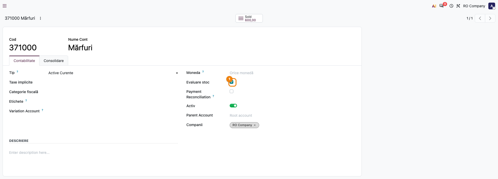
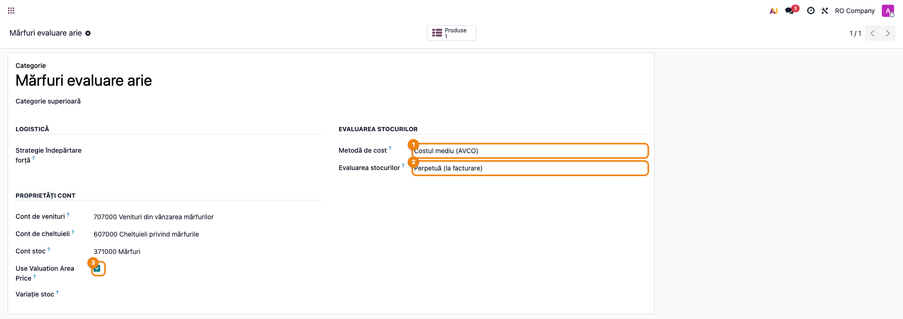
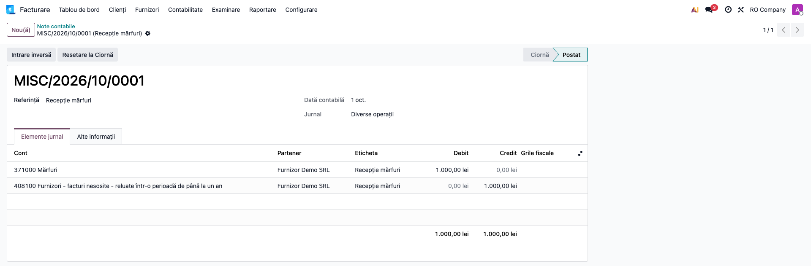
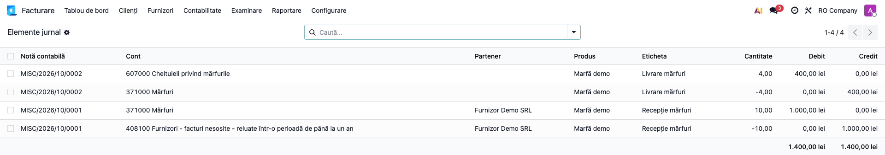
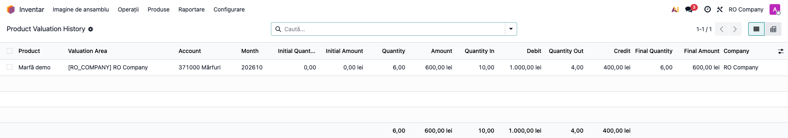
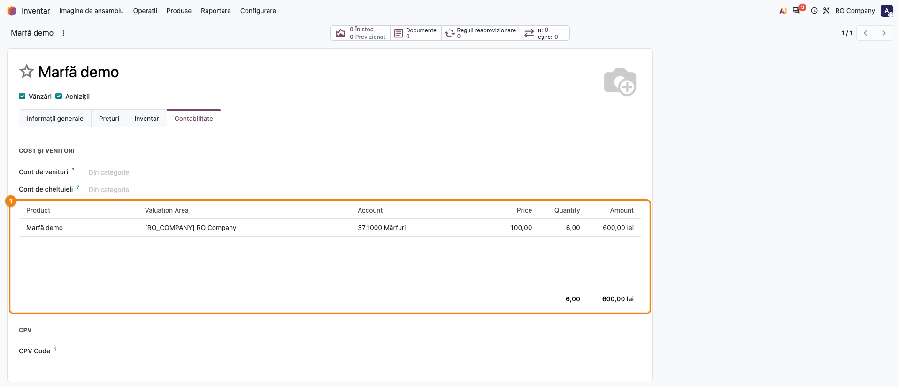

# Fișă Modul: Evaluarea stocului din notele contabile (produs × arie × cont)

**Modul:** `deltatech_stock_valuation`
**Utilizator principal:** contabil stocuri, controller, administrator Odoo (recalcularea)
**Prioritate:** 🟡 Medie (strat de control peste evaluarea standard; necesar la clienții cu arii de evaluare sau cu corecții contabile manuale pe stocuri)

> Fișă actualizată la 01.10.2026 pe codul versiunii 19.0.0.0.10 a modulului, cu
> `deltatech_valuation_area` 19.0.1.0.3 și `deltatech_obyc` 19.0.1.0.4, după auditul contabil
> din aceeași zi.

> ⚠️ **Pentru clienții din România, varianta recomandată este cu `deltatech_obyc`.** Fără OBYC,
> Odoo 19 trece marfa pe 371 abia la factură, deci la închiderea lunii conturile de stoc nu
> respectă OMFP 1802/2014 pct. 283 și 284 pentru recepțiile și livrările nefacturate, decât dacă
> se aplică procedura de închidere din secțiunea 6 („Închiderea lunii”).

> ⛔ **Baze cu mai multe companii:** nu salvați setările de evaluare și nu rulați recalcularea
> completă până la remedierea SV-002 și SV-003 din `readme/bugs.md`. Riscul privește integritatea
> datelor (linii contabile mutate pe aria altei companii, istoric șters și refăcut pe altă
> companie), nu performanța. Detalii în secțiunea 11.

---

## 1. Scop business

Modulul adaugă un strat de evaluare a stocului **paralel** cu mecanismul standard Odoo. În loc să
pornească de la mișcările de stoc, reconstruiește cantitatea și valoarea din **liniile contabile
postate** de pe conturile de stoc marcate pentru evaluare (de exemplu 371 Mărfuri). Rezultatul se
ține pe combinația **produs × arie de evaluare × cont contabil × companie**, în două tabele:

- **Product Valuation** (`product.valuation`) — soldul curent: preț, cantitate, valoare;
- **Product Valuation History** (`product.valuation.history`) — istoricul lunar: sold inițial,
  intrări, ieșiri, debit, credit, sold final.

Pentru că sursa este contabilitatea, evaluarea pe produse se poate pune lângă balanță cont cu
cont. Conceptul este cel din SAP Material Valuation (MBEW / MBEWH). Opțional, ieșirile din stoc se
pot valoriza la prețul calculat de modul pe aria de evaluare, în loc de prețul standard.

Este util când:

- vreți să confruntați stocul pe produse cu soldul conturilor de stoc;
- aveți nevoie de raportare pe arii de evaluare;
- există corecții contabile manuale pe conturile de stoc și evaluarea trebuie să le urmeze exact;
- metoda de cost folosită este **AVCO** (cost mediu ponderat).

Ce **nu** face modulul:

- nu ține loc de **fișă de magazie pe gestiuni**: evaluarea se face pe companie (nivelul
  Warehouse nu este implementat), deci nu separă stocul pe depozite sau pe gestionari;
- nu se folosește la evidența mărfurilor **la preț cu amănuntul**: acolo 371 conține și adaosul
  comercial (378) și TVA neexigibilă (4428), iar prețul calculat din 371 nu mai este un cost;
- nu calculează ajustări pentru depreciere (397) și nu generează note contabile.

## 2. Bază legală și context

Modulul nu generează declarații. Sprijină controlul concordanței dintre evidența
cantitativ-valorică a stocurilor și conturile de stoc din balanță, la închiderea lunii și la
inventariere.

**OMFP 1802/2014** (reglementările contabile conforme cu Directiva a IV-a):

- **pct. 96** — costul stocurilor fungibile se determină prin CMP, FIFO sau LIFO; media CMP se
  poate calcula după fiecare intrare sau periodic. Modulul calculează un **CMP după fiecare
  intrare** (valoarea finală / cantitatea finală) și acceptă doar AVCO (CMP) pe categorie;
- **pct. 283** — intrarea în stoc se înregistrează la data transferului riscurilor și
  beneficiilor; bunurile recepționate fără factură intră în activele cumpărătorului, iar bunurile
  livrate și nefacturate ies din evidență;
- **pct. 284** — (1) deținerea de bunuri fără înregistrare în contabilitate este interzisă;
  (2) lit. b: bunurile sosite fără factură se înregistrează ca intrări în gestiune și în
  contabilitate pe baza recepției; lit. c: bunurile livrate și nefacturate se înregistrează ca
  ieșiri atât în gestiune, cât și în contabilitate;
- **pct. 287** — metoda de cost aleasă se aplică cu consecvență de la un exercițiu la altul;
  schimbarea ei se motivează în notele explicative. Nu schimbați metoda categoriei în cursul
  exercițiului fără decizia contabilului;
- **pct. 289–291** — stocurile se țin prin inventar permanent sau intermitent. Modulul are sens
  doar la **inventarul permanent** (pct. 290: toate intrările și ieșirile trec prin contabilitate).
  Evaluarea **Periodic (la închidere)** din Odoo corespunde inventarului **intermitent**
  (pct. 291: intrările trec pe cheltuieli, ieșirile se stabilesc la inventariere), deci modulul
  nu primește date (excepție: cu `deltatech_obyc`, produsele cu clasă de evaluare primesc note și
  pe categoriile periodice, defectul OBYC-006 din `deltatech_obyc/readme/bugs.md`);
- **pct. 292** — stocurile nu se prezintă în bilanț peste valoarea realizabilă netă; ajustările
  pentru depreciere (Dr 6814 / Cr 397) rămân **separate** de evaluarea din modul, care arată
  costul.

**Funcțiunea conturilor implicate** (planul de conturi din OMFP 1802/2014):

- **371 Mărfuri** (activ) — în debit valoarea mărfurilor intrate, în credit valoarea celor
  ieșite; soldul debitor = stocul de mărfuri;
- **408 Furnizori - facturi nesosite** (pasiv) — în credit valoarea bunurilor recepționate fără
  factură; se debitează la sosirea facturii, pe seama 401;
- **4428 TVA neexigibilă** (bifuncțional) — TVA aferentă recepțiilor fără factură, până la
  primirea facturii;
- **607 Cheltuieli privind mărfurile** — costul mărfurilor vândute (descărcarea gestiunii);
- **418 Clienți - facturi de întocmit** (activ) — în debit valoarea livrărilor nefacturate,
  **inclusiv TVA aferentă** (în corespondență cu 701–708 și, la TVA la încasare, 4428); se
  creditează la întocmirea facturii (411);
- **707 Venituri din vânzarea mărfurilor** — venitul aferent livrărilor, inclusiv celor
  nefacturate la închiderea lunii.

**Codul fiscal (Legea 227/2015):**

- **art. 281 alin. (1)** și **art. 282 alin. (1)** — faptul generator și exigibilitatea TVA
  intervin la data livrării, deci TVA pentru marfa livrată și nefacturată în luna M devine exigibilă
  (4428 → 4427) și se declară în D300 pe luna M; **art. 319 alin. (16)** permite emiterea facturii până
  pe 15 a lunii următoare, dar nu mută exigibilitatea; 4428 rămâne doar la **TVA la încasare**
  (art. 282 alin. (3));
- **art. 291 alin. (4)** — cota aplicabilă este cea în vigoare la data faptului generator (de
  exemplu 21% pentru recepțiile de după 01.08.2025);
- **art. 304** — alin. (1): cazurile în care deducerea inițială a TVA se ajustează; aplicarea la
  bunurile lipsă la inventar se face potrivit normelor metodologice (HG 1/2016), **de verificat**;
  alin. (2) lit. a: nu se ajustează pentru bunurile distruse, pierdute sau furate, dovedite
  corespunzător.

**OMFP 2634/2015** (documentele financiar-contabile) — fișa de magazie este documentul de evidență
cantitativă pe gestiuni (codul formularului este **de verificat** în anexa ordinului). Modulul nu
o înlocuiește (secțiunea 1).

**Inventarierea** — Legea contabilității nr. 82/1991, art. 7, și normele de inventariere din
OMFP 2861/2009: termenele și procedura sunt **de verificat la sursă**; secțiunea 8 descrie doar
confruntarea din Odoo.

**Contextul de funcționare în Odoo:**

- **Odoo 19** a eliminat straturile de evaluare (`stock.valuation.layer`); evaluarea standard se
  calculează pe mișcarea de stoc. Modulul nu depinde de această schimbare, pentru că citește notele
  contabile.
- Pe conturile de stoc apar linii cu produs doar dacă produsele au **evaluare perpetuă** (pe
  categorie, „Evaluarea stocurilor" = **Perpetuă (la facturare)**). La evaluarea **Periodic (la
  închidere)**, modulul nu primește date din recepții, livrări sau facturi (cu excepția OBYC-006,
  mai sus).
- **Cine postează pe 371** depinde de configurare:
  - **cu `deltatech_obyc`** (recomandat): notele de stoc la validarea recepției (Dr 371 / Cr 408)
    și a livrării (Dr 607 / Cr 371), la data documentului de stoc. Factura de furnizor stinge 408
    (Dr 408 + Dr 4426 / Cr 401) și nu mai debitează 371, dar doar la prețul recepției: diferențele
    de preț dintre factură și recepție nu sunt tratate de OBYC și rămân pe 408 (secțiunea 8);
    factura de client trece venitul pe 707.
    Venitul pentru livrările nefacturate (418) rămâne manual (`deltatech_obyc`, OBYC-002);
  - **fără OBYC** (Odoo 19 standard, perpetuă la facturare): recepția și livrarea **nu** postează
    note; intrarea apare pe **factura de furnizor** (Dr 371 + 4426 / Cr 401, la data facturii),
    iar ieșirea pe **factura de client** (liniile de cost Dr 607 / Cr 371, la data facturii).
    Consecința la închiderea lunii: la marfa recepționată și nefacturată 371 este **subevaluat**
    și lipsește 408; la marfa livrată și nefacturată 371 este **supraevaluat** și lipsesc 607 și
    418. Asta nu respectă pct. 283 și 284 alin. (2) lit. b–c, iar modulul doar reflectă ce e în
    contabilitate. Corecția este procedura de închidere a lunii din secțiunea 6.
  Modulul citește ambele variante (vezi pasul 4).

## 3. Utilizatori și roluri

| Rol | Ce face |
|---|---|
| Contabil stocuri | marchează conturile de evaluare, verifică notele de stoc, înregistrează notele de închidere a lunii (fără OBYC), citește Product Valuation și Product Valuation History |
| Controller | confruntă evaluarea pe produse cu balanța și cu inventarul (secțiunea 8), inclusiv cu raportul Stock Valuation Check, dacă e instalat |
| Administrator de sistem | salvează setările de evaluare și pornește recalcularea completă — butoanele de recalculare cer grupul **Administrator de sistem** |

Roluri recomandate la testare: un utilizator **Administrator de sistem** cu drepturi de contabil
(pentru setări și recalculare) și un utilizator **contabil** fără drepturi de administrator, ca să
verificați că nu vede meniul **Setări**, deci nici recalcularea.

## 4. Conturi și date implicate

| Cont | Rol în flux |
|---|---|
| **371 Mărfuri** (sau orice cont de stoc din categoriile de produse) | cont de evaluare: bifa **Evaluare stoc** pe cont; singurele linii citite de modul |
| 408 Furnizori - facturi nesosite | contrapartida recepției fără factură: cu OBYC, automat (Cr); fără OBYC, nota manuală de închidere a lunii; fără efect asupra evaluării |
| 4428 TVA neexigibilă | TVA aferentă recepției fără factură (Dr 4428 / Cr 408), **manual** în ambele variante; fără efect asupra evaluării |
| 401 Furnizori / 4426 TVA deductibilă | factura de furnizor: fără OBYC, contrapartida intrării pe 371; cu OBYC, stingerea lui 408; fără efect asupra evaluării |
| 607 Cheltuieli privind mărfurile | contrapartida ieșirii, la livrare (cu OBYC) sau pe factura de client (fără OBYC); fără efect asupra evaluării |
| 418 Clienți - facturi de întocmit / 707 Venituri din vânzarea mărfurilor | venitul livrărilor nefacturate la închiderea lunii, manual în ambele variante; fără efect asupra evaluării |

Pentru celelalte conturi de stoc, contrapartida ieșirii (consumului) este:

| Cont de stoc | Contrapartida ieșirii |
|---|---|
| 301 Materii prime | 601 Cheltuieli cu materiile prime |
| 303 Materiale de natura obiectelor de inventar | 603 Cheltuieli privind materialele de natura obiectelor de inventar |
| 345 Produse finite | 711 Venituri aferente costurilor stocurilor de produse |
| 381 Ambalaje | 608 Cheltuieli privind ambalajele |
| 371 Mărfuri | 607 Cheltuieli privind mărfurile |

Toate exemplele din fișă sunt pe 371; pe celelalte conturi se aplică aceeași logică, cu
contrapartida din tabel.

Date minime pentru demo:

- compania „RO Company", în RON, cu planul de conturi RO și **zona de evaluare** activă;
- o categorie de produs cu metoda de cost **Costul mediu (AVCO)**, evaluare **Perpetuă (la
  facturare)** și cont de stoc 371;
- un produs stocabil în acea categorie;
- o notă de recepție (10 buc, 1.000 lei) și una de livrare (4 buc, 400 lei).

## 5. Configurare inițială

> Pe o bază cu **mai multe companii**, opriți-vă aici: salvarea setărilor (pasul 3) și
> recalcularea (pasul 6) pot modifica datele altei companii (SV-002, SV-003). Vezi secțiunea 11.

1. **Zona de evaluare** — în **Inventar → Configurare → Setări**, secțiunea **Evaluare**, bifați
   **Folosește zonă de evaluare** (vine din `deltatech_valuation_area`) și alegeți **Arie de
   evaluare** a companiei, sau lăsați câmpul gol: la salvare se creează automat aria companiei.
2. **Nivelul ariei** — în același bloc, la **Evaluare stoc**, setați **Valuation Area Level** =
   **Company**. Este singurul nivel pentru care recalcularea din interfață funcționează; la
   Warehouse sau Location, blocul cu butonul de recalculare nu se afișează.
3. **Salvați** setările. La salvare, modulul:
   - creează aria de evaluare a companiei, dacă lipsește;
   - bifează **Evaluare stoc** pe contul de stoc al fiecărei categorii de produs care are cont de
     stoc;
   - trece pe aria companiei liniile contabile existente de pe conturile marcate care au altă arie.
   Pe o bază fără niciun cont de evaluare, salvarea se încheie fără eroare.
4. **Conturile de evaluare** — verificați în **Contabilitate → Configurare → Contabilitate → Plan
   de Conturi** că fiecare cont de stoc relevant are bifa **Evaluare stoc**. Un cont nebifat nu
   intră în evaluare.
5. **Categoriile de produs** — în **Inventar → Configurare → Produse → Categorii de produse**,
   verificați metoda de cost (**Costul mediu (AVCO)**) și evaluarea (**Perpetuă (la facturare)**).
   Opțional, bifați **Use Valuation Area Price** (vezi pasul 2 din flux).
6. **Cu `deltatech_obyc`** — fiecare produs stocabil trebuie să aibă **Clasă de evaluare**. Un
   produs fără clasă revine la comportamentul standard Odoo (fără note la recepție și livrare).
   Atenție la regulile pentru ajustările de inventar: cheile `inventory_adjustment_plus` și
   `inventory_adjustment_minus` sunt inversate în cod (OBYC-005), deci configurați și testați
   regula după sensul real (un plus trebuie să posteze Dr 371).
7. **Fără OBYC** — în **Inventar → Configurare → Locații**, pe locațiile virtuale de tip
   inventar (ajustări de inventar, rebuturi), completați **Cont pierderi** (de exemplu 607 pentru
   mărfuri). Fără cont, ajustările și rebuturile nu postează note, iar 371 nu le reflectă
   (monografia în secțiunea 6).
8. **Recalcularea inițială** — după prima instalare sau după un import de date, rulați
   recalcularea completă (pasul 7 din flux).

## 6. Flux de utilizare

### Pasul 1 — Marcați contul de stoc pentru evaluare

**Contabilitate → Configurare → Contabilitate → Plan de Conturi** → deschideți contul 371000
Mărfuri. Bifa **Evaluare stoc** spune modulului că liniile acestui cont intră în calcul. După
salvarea setărilor (secțiunea 5, pasul 3), bifa e pusă automat pe conturile de stoc ale
categoriilor; o puteți pune și manual.



### Pasul 2 — Configurați categoria de produs

**Inventar → Configurare → Produse → Categorii de produse** → deschideți categoria. În blocul
**Evaluarea stocurilor** verificați **Metodă de cost** = **Costul mediu (AVCO)** și **Evaluarea
stocurilor** = **Perpetuă (la facturare)**. În blocul **Proprietăți cont**, la **Cont stoc** =
371000, bifați opțional **Use Valuation Area Price**.

Cu **Use Valuation Area Price** activ, **ieșirile din locațiile interne** se valorizează la prețul
din Product Valuation pentru aria și contul de stoc ale produsului, nu la prețul standard. După ce
Odoo calculează valoarea mișcării de stoc, modulul o rescrie la prețul ariei. Reguli:

- recomandat doar pentru **AVCO**: pe o categorie **FIFO** caseta nu se afișează, iar activarea ei
  prin import sau cod este blocată cu mesajul din secțiunea 9; pe o categorie cu **cost standard**
  nu este blocată, dar nu o folosiți;
- produsele **valorizate pe lot** sunt excluse și rămân pe valorizarea per lot din Odoo;
- dacă nu există evaluare pentru aria curentă sau prețul ei este zero, se folosește **prețul
  standard**, cu un avertisment în jurnalul serverului;
- corecțiile ulterioare de cantitate pe o mișcare deja valorizată sunt ajustate proporțional de
  Odoo, pornind de la valoarea la prețul ariei.



### Pasul 3 — Verificați setările de evaluare

**Inventar → Configurare → Setări**, secțiunea **Evaluare**. Găsiți pe ecran:

1. **Folosește zonă de evaluare** bifat și **Arie de evaluare** = aria companiei;
2. la **Evaluare stoc**: **Valuation Area Level** = **Company** și **Arie de evaluare**;
3. în dreapta, butonul **Recompute All (Background)**, rândul **Next step** (pasul cu care va
   începe următoarea recalculare) și starea ultimei rulări („No background refresh has run yet." pe
   o bază nouă).


### Pasul 4 — Postați notele de stoc

Liniile pe 371 vin din notele de stoc generate de `deltatech_obyc` la validarea recepțiilor și
livrărilor, din facturile de furnizor și de client (fără OBYC), din ajustările de inventar și
rebuturi (fără OBYC, pe locațiile cu **Cont pierderi**) sau din note introduse în afara fluxului de
stoc. Le găsiți în **Contabilitate → Contabilitate → Tranzacții → Note contabile** (fără
Enterprise, aplicația se numește **Facturare**). Modulul citește doar liniile care au **produs**,
sunt pe un **cont marcat** și aparțin unei note **postate**.

Nota de recepție de mai jos: Dr 371000 Mărfuri / Cr 408100 Furnizori - facturi nesosite,
1.000 lei, cu furnizorul pe linii (fără partener, soldul 408 nu se poate analiza pe furnizori la
închiderea lunii).



**Convenția cantității semnate** (pe notele de tip *entry*, adică notele de stoc): cantitatea este
**pozitivă pe linia de debit** (intrare) și **negativă pe linia de credit** (ieșire). Notele de
stoc generate de Odoo sau de `deltatech_obyc` o respectă automat (cantitatea și aria sunt
completate de `deltatech_valuation_area`). Pe facturi (furnizor,
client, rambursări, chitanțe) cantitatea rămâne pozitivă; sensul se deduce din tipul documentului.

**Note de stoc în afara fluxului** (corecții, preluare de solduri, notele de închidere a lunii):
formularul standard al notei contabile nu are coloanele **Produs** și **Cantitate** pe tab-ul
**Elemente jurnal**, deci liniile cu produs se încarcă prin import (fișier cu produs, unitate de
măsură și cantitate) sau prin integrare. Respectați semnul: cantitate pozitivă pe linia de debit,
negativă pe linia de credit.

Lista de mai jos arată liniile celor două note — recepția (10 buc) și livrarea (4 buc, Dr 607 /
Cr 371). Pe contul 371000 cantitatea este +10 la recepție și −4 la livrare. Coloana **Cantitate**
nu există în lista standard a liniilor contabile; captura folosește o listă pregătită pentru fișă.



Ce mai trebuie știut la note:

- **Aria de evaluare** este obligatorie pe orice linie cu produs stocabil (regula vine din
  `deltatech_valuation_area`); se completează automat cu aria companiei.
- **Unitatea de măsură** — cantitatea de pe linie se convertește în unitatea de măsură a
  produsului. O linie de 2 Dozens pe un produs gestionat în Units intră în evaluare ca 24 Units.
- **Sensul pe facturi**: factura și chitanța de furnizor = intrare; rambursarea de la furnizor =
  intrare cu minus; factura și chitanța de client = ieșire; rambursarea către client = ieșire cu
  minus.
- **Inversarea unei note de stoc** (butonul **Intrare inversă** de pe notă, apoi **Inversare** în fereastra de inversare) anulează efectul ei asupra evaluării,
  **cu și fără storno**: fără storno, `deltatech_valuation_area` (de la 19.0.1.0.3) inversează și
  semnul cantității odată cu partea; cu storno, linia rămâne pe aceeași parte, cu sumă negativă.
  Pentru notele inversate **înainte** de această versiune, pe o companie fără storno, inversul
  recepției dubla cantitatea (de exemplu 20 buc / 0 lei în loc de 0): verificați **Final
  Quantity** pe produs față de stocul din Inventar și corectați rândurile cu cantitate fără
  valoare.
- **Livrare cu OBYC vs. fără OBYC**: cu `deltatech_obyc`, ieșirea din 371 apare pe nota livrării, la
  data livrării, iar factura de client nu are linii de cost. Fără OBYC (Odoo 19 standard, evaluare
  perpetuă la facturare), ieșirea din 371 apare pe factura de client, la data facturii. În ambele
  cazuri ieșirea e numărată o singură dată.
- **Factura de furnizor cu OBYC**: de la `deltatech_obyc` 19.0.1.0.4, linia de produs a facturii
  este pe 408 (stinge recepția), nu pe 371. Facturile postate înainte de această versiune au
  debitat 371 a doua oară și au lăsat 408 deschis; la clienții care le au, confruntați 371 cu
  evaluarea și 408 cu recepțiile nefacturate (secțiunea 8) și corectați prin notă contabilă.

### Pasul 5 — Consultați soldul curent

**Inventar → Produse → Product Valuation**. Găsiți pe ecran, pe fiecare rând, produsul, aria de
evaluare (**Valuation Area**), contul (**Account**), prețul (**Price**), cantitatea
(**Quantity**) și valoarea (**Amount**). Verificați:

- după cele două note, **Quantity** = 6,00 (10 − 4), **Amount** = 600,00 lei (1.000 − 400) și
  **Price** = 100,00;
- totalul coloanei **Amount** pe contul 371 este egal cu soldul contului 371 în balanță (aici
  600,00 lei — vezi butonul **Sold** de pe formularul contului, captura 01). Egalitatea ține doar
  dacă toate liniile de pe 371 au produs și arie de evaluare și se compară aceeași companie;
  liniile fără produs apar în sold, dar nu în evaluare (secțiunea 8).

Evaluarea se actualizează **automat**, fără recalculare manuală, când o notă este postată,
**trecută înapoi în ciornă**, **anulată**, **ștearsă** sau când i se **schimbă data contabilă**; la
schimbarea datei se recalculează atât luna veche, cât și luna nouă. Lista are și vizualizare pivot.


### Pasul 6 — Consultați istoricul lunar

**Inventar → Produse → Product Valuation History**. Fiecare rând este o lună (**Month**, în format
AAAALL) pe produs × arie × cont. Coloanele **Quantity In**, **Debit**, **Quantity Out** și
**Credit** sunt ascunse implicit; afișați-le din meniul coloanelor opționale (pictograma din dreapta
antetului). Verificați pe rândul lunii:

- **Initial Quantity** / **Initial Amount** = soldul final al lunii anterioare (0 la prima lună);
- **Quantity In** = 10,00 și **Debit** = 1.000,00 lei (recepția);
- **Quantity Out** = 4,00 și **Credit** = 400,00 lei (livrarea);
- **Quantity** = 6,00 și **Amount** = 600,00 lei — mișcarea netă a lunii (intrări − ieșiri);
- **Final Quantity** = 6,00 și **Final Amount** = 600,00 lei, egale cu soldul din Product
  Valuation pentru ultima lună.



### Pasul 7 — Recalculați complet evaluarea (doar când e nevoie)

> Doar pe baze cu **o singură companie**, până la remedierea SV-003 (secțiunea 11).

Recalcularea completă este necesară după prima instalare, după un import de date sau după corecții
retroactive masive; fluxul zilnic nu o cere (pasul 5). Din **Inventar → Configurare → Setări**,
secțiunea **Evaluare**, apăsați **Recompute All (Background)** și confirmați mesajul.

- Ciclul repornește de la pasul 1 din 7, iar o acțiune planificată (la 2 minute) execută automat
  câte un pas la fiecare rulare și se oprește singură la final. Durata minimă este de circa 12–14
  minute; pasul 5 rulează în loturi de produse și poate cere mai multe rulări pe baze mari.
- Recalcularea se face pentru compania implicită a utilizatorului acțiunii planificate, nu pentru
  compania din care ați apăsat butonul (SV-003).
- Cât rulează, apare **Running…**, iar butonul devine **Stop Background Refresh**. O a doua pornire
  este blocată.
- Utilizatorul care a pornit ciclul primește o **notificare** după fiecare pas, cu pasul și durata,
  iar la final mesajul „Stock valuation refresh complete". În setări, **Next step** arată pasul
  următor, iar rândul de sub el arată ultimul pas rulat, momentul și durata.

Cei 7 pași: (1) ștergere istoric; (2) calcul mișcări lunare; (3) completare luni lipsă; (4) calcul
sold final pentru luna curentă; (5) propagarea soldurilor pe lunile anterioare, în loturi de
produse; (6) ștergere rânduri goale; (7) recalcul Product Valuation.

Butoanele manuale pe pași (**Execute Next Step**, **Reset to Step 1**, **Recompute Product
Valuation**) nu mai sunt afișate în setări. Pentru depanare punctuală, în **modul dezvoltator**,
meniul **Acțiune** oferă **Recompute Amount** pe înregistrările selectate din Product Valuation /
Product Valuation History și **Recompute Valuation** pe produsele selectate.

Starea **Running…** și notificările depind de acțiunea planificată pornită în fundal, așa că nu au
captură proprie; ecranul de pornire este captura 03.

### Pasul 8 — Vedeți evaluarea pe produs

Pe formularul produsului (**Inventar → Produse → Produse** → produsul), tab-ul **Contabilitate**
afișează, sub conturile de venituri și cheltuieli, tabelul evaluărilor produsului: variantă, arie,
cont, preț, cantitate, valoare. Cantitatea și valoarea nu se pot modifica; pe un rând cu cantitate
zero se pot corecta varianta, aria, contul și prețul. Cu **Adaugă o linie** se poate crea un rând
manual, dar recalcularea completă îl șterge; rămân doar rândurile care rezultă din note — nu îl
folosiți pentru corecții (SV-004).

În captură, butonul **În stoc** arată 0,00: notele din exemplu sunt introduse direct în
contabilitate, fără recepție și livrare în Inventar, deci nu există stoc fizic. Pe o bază reală, cu
OBYC, cantitatea din tabel coincide cu stocul fizic **doar pentru produsele care au clasă de
evaluare** și doar dacă nu există note manuale cu cantitate pe conturile de stoc; produsele fără
clasă nu postează note la recepție și livrare.



### Note de monografie și raportare

Modulul **nu generează note contabile**; citește notele postate de alte module sau introduse
manual. Exemplul din capturi (note introduse manual, echivalente celor generate de OBYC):

| Operațiune | Debit | Credit | Sumă | Cantitate pe linia 371 | Efect în evaluare |
|---|---|---|---|---|---|
| Recepție marfă (notă de stoc) | 371 Mărfuri | 408 Furnizori - facturi nesosite | 1.000,00 lei | +10 | intrare 10 buc / 1.000 lei |
| Livrare marfă (notă de stoc, cu OBYC) | 607 Cheltuieli privind mărfurile | 371 Mărfuri | 400,00 lei | −4 | ieșire 4 buc / 400 lei |
| **Sold** | | | | | **6 buc / 600 lei / preț 100,00** |

Doar liniile de pe 371 (contul marcat) contează; liniile de pe 408, 4428, 401, 4426, 418, 707 și
607 nu intră în evaluare, chiar dacă au produs și cantitate.

**TVA la recepția fără factură** (exemplul de mai sus, cota 21% după data faptului generator,
art. 291 alin. (4) CF). Nota Dr 4428 / Cr 408 nu este generată nici de Odoo, nici de
`deltatech_obyc`: o înregistrează **manual** contabilul, la recepție sau la închiderea lunii.

| Operațiune | Debit | Credit | Sumă |
|---|---|---|---|
| TVA aferentă recepției fără factură | 4428 TVA neexigibilă | 408 Furnizori - facturi nesosite | 210,00 lei |
| Sosirea facturii — stingerea lui 408 | 408 Furnizori - facturi nesosite | 401 Furnizori | 1.210,00 lei |
| Sosirea facturii — deducerea TVA la primirea facturii (art. 299 alin. (1) lit. a CF) | 4426 TVA deductibilă | 4428 TVA neexigibilă | 210,00 lei |

Tabelul de mai sus este **monografia generală, cu factura înregistrată manual pe 408**. Fluxurile
din Odoo postează factura altfel, ca mai jos.

Dacă nu s-a folosit 4428, monografia la sosirea facturii este: Dr 408 1.000,00 + Dr 4426 210,00 / Cr 401
1.210,00 lei. Cu `deltatech_obyc` 19.0.1.0.4, factura de furnizor postează **exact această a
doua variantă** (TVA direct pe 4426). Dacă s-a înregistrat și Dr 4428 / Cr 408, la data facturii
se **stornează** acea notă (Dr 4428 / Cr 408 cu −210,00 lei, adică Dr 408 / Cr 4428 210,00 lei);
**nu** se face și Dr 4426 / Cr 4428, care ar deduce TVA a doua oară și ar lăsa 408 cu sold
creditor de 210 lei.

Fără OBYC, aceeași intrare vine din factura de furnizor: Dr 371 1.000 + Dr 4426 210 / Cr 401
1.210 lei, la data facturii.

#### Închiderea lunii fără OBYC

Fără OBYC, la sfârșitul fiecărei luni contabilul înregistrează manual, pe documentele de stoc
validate în lună și nefacturate (OMFP pct. 283, 284 alin. (2) lit. b–c):

| Situație | Debit | Credit | Linia 371 | Când se anulează |
|---|---|---|---|---|
| Recepție nefacturată | 371 Mărfuri | 408 Furnizori - facturi nesosite | cu produs și cantitate pozitivă | stornată (inversată) la data facturii de furnizor, care debitează 371 |
| TVA aferentă (opțional) | 4428 TVA neexigibilă | 408 Furnizori - facturi nesosite | — | stornată la data facturii |
| Livrare nefacturată — costul | 607 Cheltuieli privind mărfurile | 371 Mărfuri | cu produs și cantitate negativă | stornată la data facturii de client, care creditează 371 |
| Livrare nefacturată — venitul și TVA | 418 Clienți - facturi de întocmit | 707 Venituri din vânzarea mărfurilor + 4428 TVA neexigibilă, apoi în aceeași lună Dr 4428 / Cr 4427 (la TVA la încasare rămâne pe 4428) | — | stornată la data facturii de client, care postează Dr 4111 / Cr 707 + Cr 4427 |

- Liniile de pe 371 se încarcă prin import, cu produs, unitate de măsură și cantitate semnată
  (pasul 4), altfel apar în sold, dar nu în evaluare.
- Stornarea se face **în roșu** (sume negative pe aceeași parte), la data facturii: verificați că
  e bifată **Contabilitate storno** pe companie (**Contabilitate → Configurare → Setări**; implicit
  la firmele RO, iar dezactivarea ei schimbă toate inversările companiei) și folosiți
  **Intrare inversă** pe nota de închidere. Fără storno, inversarea standard trece sumele pe partea
  opusă: pe 371, 408 și 4428 rezultatul e corect, dar pe 607 și 707 apar rulaje în oglindă (credit
  pe 607, debit pe 707) care umflă lunar cheltuielile și cifra de afaceri. Pe o companie fără
  storno, liniile 607 și 707 se anulează printr-o notă manuală cu sume negative pe aceeași parte.
  Efectul asupra evaluării (cantitatea) e corect în ambele variante (pasul 4).
- **TVA la livrările nefacturate.** Faptul generator și exigibilitatea intervin la livrare
  (art. 281 alin. (1), art. 282 alin. (1) CF), deci TVA se colectează în luna livrării. Conform
  funcțiunii contului 418 (corespondență cu 701–708 și 4428), nota trece prin 4428: Dr 418 / Cr 707
  + Cr 4428 și, tot în luna M, Dr 4428 / Cr 4427. Exemplu, cota 21%: livrare nefacturată de 1.000
  lei → Dr 418 1.210 / Cr 707 1.000 + Cr 4428 210, apoi Dr 4428 / Cr 4427 210. TVA rămâne pe 4428
  până la încasare doar la firmele cu **TVA la încasare** (art. 282 alin. (3)).
- **D300 în Odoo se calculează din grilele de taxă** de pe liniile contabile, nu din soldul
  conturilor. O notă manuală pe 418 / 4428 → 4427 fără grile nu apare în D300 pe luna M, iar
  factura din M+1 apare în D300 pe M+1: livrarea ar fi declarată cu o lună întârziere. Pe nota de
  închidere puneți grila bazei pe linia 707 și grila TVA pe linia care creditează 4427 (rândul livrărilor la cota
  aplicabilă); stornarea de la factură le poartă cu minus, deci livrarea iese net zero în D300 pe
  M+1. Alternativ, D300 se corectează manual pe M și pe M+1. Rândul exact din D300 și efectul în
  D394 (construită pe facturi) sunt **de verificat** cu contabilul clientului.
- Costul din nota de închidere (Dr 607 / Cr 371) e la CMP-ul de la livrare, iar liniile de cost
  ale facturii din M+1 sunt la CMP-ul de la data facturii. După stornare, 607 și 371 pot avea în
  M+1 o mică diferență față de nota de închidere; efectul e corect contabil, dar trebuie explicat
  la reconciliere.
- Cu OBYC, notele de stoc sunt automate, dar venitul pentru livrările nefacturate (Dr 418 /
  Cr 707 + Cr 4428, apoi Dr 4428 / Cr 4427, cu grilele de taxă) rămâne tot manual.

#### Ajustări de inventar și rebuturi fără OBYC

Fără OBYC, Odoo 19 postează note la validarea ajustărilor de inventar și a rebuturilor doar dacă
locația virtuală are **Cont pierderi** (`stock_account`, `stock.move._should_create_account_move`).
Contul se ia de pe locație, nu de pe categorie, deci este același pentru toate categoriile; pe o
bază cu mai multe conturi de stoc (301, 371 etc.), contrapartida corectă din secțiunea 4 cere
OBYC sau o corecție manuală.

| Operațiune | Debit | Credit | Cantitate pe linia 371 |
|---|---|---|---|
| Plus la inventar (marfă) | 371 Mărfuri | 607 Cheltuieli privind mărfurile (contul locației) | pozitivă |
| Minus la inventar (marfă) | 607 Cheltuieli privind mărfurile (contul locației) | 371 Mărfuri | negativă |
| Rebut / distrugere (marfă) | 607 Cheltuieli privind mărfurile (contul locației de rebut) | 371 Mărfuri | negativă |

Pentru lipsuri și rebuturi, ajustarea TVA deduse se face separat, manual (art. 304 alin. (1) CF
și normele de aplicare, de verificat), cu excepțiile din art. 304 alin. (2) lit. a (bunuri distruse, pierdute sau furate, dovedite).

#### Cum se calculează prețul din Product Valuation

La postarea, trecerea în ciornă, anularea sau ștergerea unei note:

- **Final Amount / Final Quantity** din ultima lună de istoric, dacă există stoc final;
- dacă stocul final este zero, dar în ultima lună au existat intrări: **Debit / Quantity In**;
- altfel se **păstrează prețul anterior**.

Excepție: după **Recompute All (Background)**, evaluarea curentă se reface din istoric, iar pe
rândurile cu stoc final zero prețul devine **0**. Cu **Use Valuation Area Price**, o ieșire pentru
un astfel de rând se valorizează la prețul standard. Prețul unui rând cu stoc zero poate deci
diferi după calea care a rulat ultima.

Prețul **Debit / Quantity In** poate fi distorsionat: **Debit** cuprinde și retururile de la
clienți (fără OBYC, factura de rambursare debitează 371, dar cantitatea intră la ieșiri, cu minus,
nu la intrări) și ajustările valorice din lună, care nu au cantitate. Nu folosiți prețul unui rând
cu stoc zero ca preț de evaluare fără să verificați luna.

Cantitățile sub pragul de rotunjire al unității de măsură sunt tratate ca zero, deci nu produc
prețuri aberante. O ajustare **pur valorică** (notă cu sumă, fără cantitate, de exemplu corecția de
CMP) modifică **valoarea și prețul mediu**, nu și cantitatea: pe 10 buc / 1.000 lei, o corecție de
+50 lei dă 10 buc / 1.050 lei / preț 105,00 (testul `test_value_only_adjustment_updates_price`).
Doar dacă stocul final este zero (și nu au existat intrări în lună) se păstrează prețul anterior,
iar valoarea rămâne ca sold fără cantitate; un astfel de sold se trece pe cheltuieli (secțiunea 8).

## 7. Legături cu alte module / declarații

| Modul | Rol |
|---|---|
| `stock_account` | dependență: conturile de stoc pe categorie, evaluarea perpetuă, valoarea mișcărilor de stoc, notele pe locațiile cu **Cont pierderi** |
| `deltatech_valuation_area` | dependență: ariile de evaluare, aria și cantitatea semnată pe liniile contabile, obligativitatea ariei pe produse stocabile, inversarea cantității la inversarea notelor fără storno (19.0.1.0.3) |
| `deltatech_obyc` (opțional, recomandat la clienții RO) | determinarea conturilor pe notele de stoc; costul mărfii vândute la livrare (Dr 607 / Cr 371); de la 19.0.1.0.4, factura de furnizor stinge 408 și factura de client pune venitul pe 707 |
| `deltatech_valuation_report` (suita bitshop_ent, Enterprise, opțional) | raportul **Contabilitate → Raportare → Stock Valuation Check**: confruntă, pe fiecare cont de evaluare, soldul din balanță cu evaluarea pe produse și izolează diferența (liniile fără produs), cu drill-down pentru corecție |

Modulul nu alimentează direct nicio declarație ANAF.

**Ce e automat:**

- recalcularea evaluării și a istoricului la postare, trecere în ciornă, anulare, ștergere,
  inversare sau schimbare de dată a unei note;
- conversia cantității în unitatea de măsură a produsului;
- marcarea conturilor de stoc din categorii, la salvarea setărilor;
- prețul de ieșire pe arie, pentru categoriile cu **Use Valuation Area Price**;
- recalcularea completă în fundal, după un singur clic.

**Ce rămâne manual:**

- semnul cantității pe notele de stoc introduse manual;
- fără OBYC, notele de închidere a lunii pentru recepțiile și livrările nefacturate (secțiunea 6);
- în ambele variante, TVA neexigibilă la recepțiile fără factură (Dr 4428 / Cr 408) și venitul
  livrărilor nefacturate (Dr 418 / Cr 707 + Cr 4428, apoi Dr 4428 / Cr 4427, cu grilele de taxă pentru D300);
- marcarea conturilor de stoc care nu apar pe nicio categorie;
- recalcularea completă după instalare, import sau corecții masive;
- confruntarea cu balanța și cu inventarul (secțiunea 8, manual sau cu Stock Valuation Check);
- ajustările pentru depreciere (397) și ajustarea TVA la lipsuri.

## 8. Verificări pentru consultant

### Configurare și flux

- [ ] compania are **Folosește zonă de evaluare** bifat, **Arie de evaluare** completată și **Valuation Area Level** = **Company**
- [ ] baza are **o singură companie**; dacă are mai multe, setările nu au fost salvate și recalcularea nu a fost rulată (SV-002, SV-003)
- [ ] conturile de stoc relevante (371 și celelalte din categorii) au bifa **Evaluare stoc**
- [ ] categoriile au **Costul mediu (AVCO)** și **Perpetuă (la facturare)**; pe o categorie FIFO caseta **Use Valuation Area Price** nu apare
- [ ] cu `deltatech_obyc`: toate produsele stocabile au **Clasă de evaluare**
- [ ] ⚠️ semnalare: dacă clientul lucrează **fără OBYC**, contabilul știe că 371 se mișcă abia la factură și aplică lunar procedura de închidere din secțiunea 6 (Dr 371 / Cr 408, Dr 607 / Cr 371, Dr 418 / Cr 707 + Cr 4428 și Dr 4428 / Cr 4427 cu grilele de taxă, stornate în roșu la factură); altfel conturile de stoc nu respectă OMFP pct. 283–284 la închiderea lunii
- [ ] fără OBYC: locațiile virtuale de ajustare de inventar și de rebut au **Cont pierderi** completat
- [ ] liniile postate pe conturile marcate au produs, cantitate și arie de evaluare
- [ ] notele de stoc importate în afara fluxului respectă semnul: cantitate pozitivă pe debit, negativă pe credit
- [ ] după recepția de 10 buc / 1.000 lei și livrarea de 4 buc / 400 lei, Product Valuation arată 6,00 / 600,00 lei / preț 100,00
- [ ] istoricul lunii arată Quantity In 10 / Debit 1.000, Quantity Out 4 / Credit 400 și Final 6 / 600
- [ ] o linie postată în altă unitate de măsură (de exemplu 2 Dozens pe un produs în Units) apare în evaluare convertită (24)
- [ ] după trecerea unei note în ciornă, anulare, ștergere sau schimbarea datei, evaluarea și istoricul se actualizează, inclusiv luna veche și luna nouă
- [ ] inversarea unei note de recepție (10 buc / 1.000 lei) aduce evaluarea la 0 buc / 0 lei, pe o companie cu storno și pe una fără storno
- [ ] o ajustare pur valorică de +50 lei peste 10 buc / 1.000 lei dă 10 buc / 1.050 lei / preț 105,00: se schimbă valoarea și prețul, nu cantitatea
- [ ] cu **Use Valuation Area Price**, o livrare din locație internă se valorizează la prețul din Product Valuation (prețul standard doar când evaluarea lipsește)
- [ ] cu `deltatech_obyc`, livrarea scade stocul la data livrării, iar factura de client nu mai scade a doua oară cantitatea
- [ ] cu `deltatech_obyc` 19.0.1.0.4: factura de furnizor după recepție stinge 408 și nu debitează 371; factura de client trece venitul pe 707, nu pe 371
- [ ] **Recompute All (Background)** rulează complet: **Running…** dispare, iar rândul de sub **Next step** arată ultimul pas și durata
- [ ] un utilizator fără grupul **Administrator de sistem** nu vede **Inventar → Configurare → Setări**, deci nici recalcularea

### Reconciliere la închiderea lunii și la inventariere

Rulați procedura pe aceeași companie și la aceeași dată, după postarea notelor de închidere:

1. [ ] **Valoare pe cont** — suma **Final Amount** din Product Valuation History, luând pentru
   fiecare produs **ultimul rând cu Month ≤ luna închiderii** (un produs fără mișcare în lună nu
   are rând în acea lună), pe fiecare cont de evaluare = soldul final al contului din balanță.
   Totalul **Amount** din Product Valuation e echivalent doar dacă nu există note postate după
   data închiderii. Diferența sunt liniile
   fără produs (sau fără arie) de pe cont: le izolează raportul **Contabilitate → Raportare →
   Stock Valuation Check**, dacă e instalat `deltatech_valuation_report`; altfel le căutați în
   **Elemente jurnal**, filtrate pe cont și fără produs.
2. [ ] **Cantitate pe produs** — **Final Quantity** pe produs = stocul din **Inventar** la aceeași
   dată (raportul de stoc la dată). Diferențele vin din notele manuale, din produsele fără clasă
   de evaluare (cu OBYC), din documentele nefacturate (fără OBYC) sau din inversările făcute
   înainte de `deltatech_valuation_area` 19.0.1.0.3.
3. [ ] **Fără valoare reziduală** — niciun rând cu cantitate 0 și valoare ≠ 0. Un astfel de sold se
   trece pe cheltuieli, doar valoric, cu produs și cantitate 0: soldul debitor prin Dr 607 /
   Cr 371; soldul creditor prin aceeași notă în roșu (sume negative), nu prin creditarea
   cheltuielii. Contrapartida se ia după contul de stoc (tabelul din secțiunea 4: 601, 603, 607,
   608, 711).
4. [ ] **Fără stoc negativ** — niciun rând cu cantitate negativă și niciun rând cu semne opuse
   între cantitate și valoare. Un stoc negativ arată o ieșire înregistrată înaintea intrării, deci
   evidența nu mai arată stocul în orice moment (pct. 290); dacă bunurile există fizic, dar intrarea
   lipsește, este situația interzisă de pct. 284 alin. (1).
5. [ ] **408 și 4428** — analiza pe partener a soldurilor 408 și 4428: fiecare sold corespunde unei
   recepții încă nefacturate; soldurile vechi indică facturi postate greșit (de exemplu cu OBYC
   înainte de 19.0.1.0.4), note de închidere nestornate sau, cu OBYC, **diferențe de preț**
   între factură și recepție (OBYC nu le tratează). Diferența de preț se trece pe stoc printr-o
   notă Dr 371 / Cr 408 (sau în roșu, dacă factura e mai mică), cu produs și cantitate 0, ca
   evaluarea să o preia; dacă produsul nu mai e în stoc, pe contul de cheltuială; dacă a fost
   vândut parțial, diferența se împarte proporțional între 371 și 607. Un **sold debitor** pe 408
   înseamnă o factură de furnizor postată înaintea recepției (cu OBYC, linia de produs merge pe
   408 și când marfa n-a sosit): pentru marfa cu riscurile transferate, dar nesosită, se
   reclasifică la sfârșitul lunii Dr 327 Mărfuri în curs de aprovizionare / Cr 408, nota fiind
   stornată la recepție.
6. [ ] **Inventarierea** — plusurile se evaluează la **valoarea justă** (OMFP pct. 75 alin. (1)
   lit. d); CMP-ul din Product Valuation la data inventarului se folosește doar dacă e o
   aproximare rezonabilă, cu decizia contabilului. Plusurile: Dr 371 / Cr 607; minusurile: Dr 607 / Cr 371, cu produs și cantitate
   (secțiunea 6, ajustări de inventar). Cu OBYC, verificați după primul inventar că un plus a
   postat Dr 371 (cheile `inventory_adjustment_plus` / `_minus` sunt inversate, OBYC-005). La
   lipsuri, ajustarea TVA deduse (art. 304 alin. (1) CF și normele, de verificat), cu excepțiile din
   art. 304 alin. (2) lit. a. Procedura și termenele inventarierii (Legea
   82/1991 art. 7, OMFP 2861/2009) sunt **de verificat la sursă**.
7. [ ] (dacă e instalat `deltatech_valuation_report`) **Stock Valuation Check** nu arată diferențe neexplicate față de balanță.

## 9. Mesaje de eroare frecvente

| Mesaj | Cauză | Remediere |
|---|---|---|
| `Valuation Area is required for stockable products. If the product is not stockable, you can leave it empty.` | o linie contabilă cu produs stocabil nu are arie de evaluare (de exemplu aria a fost golită manual) | completați aria pe linie sau lăsați-o să se completeze automat; verificați aria companiei în setări |
| `Category '...': Use Valuation Area Price is not compatible with FIFO costing method. Please use AVCO.` | **Use Valuation Area Price** activ pe o categorie FIFO (prin import sau schimbarea metodei) | treceți categoria pe AVCO sau dezactivați opțiunea; schimbarea metodei cere decizia contabilului (OMFP pct. 287) |
| `Only System Administrator can do this action!` | acțiunea de recalculare e apelată (prin cod sau integrare) de un utilizator fără grupul **Administrator de sistem**; din interfață, acesta nu vede Setări | rulați recalcularea cu un administrator |
| notificarea `A background recompute is already running.` | o recalculare în fundal este deja pornită | așteptați finalul sau apăsați **Stop Background Refresh** |
| butonul **Recompute All (Background)** lipsește din setări | **Valuation Area Level** nu este **Company** | treceți nivelul pe **Company**; celelalte niveluri nu au recalculare în interfață |
| avertisment în log: `nu există evaluare pentru produsul ... în aria ... — se folosește prețul standard` | ieșire cu **Use Valuation Area Price** pentru un produs fără evaluare (sau cu preț zero) în arie | rulați recalcularea sau verificați notele de intrare ale produsului |
| avertisment în log: `... linii contabile excluse din evaluare (UoM produs lipsă) ...` | la recalcularea completă, produse fără unitate de măsură pe șablon | completați unitatea de măsură a produselor și reluați recalcularea |
| evaluarea nu se schimbă după o recepție sau livrare | fără OBYC, recepția și livrarea nu postează note: evaluarea se schimbă abia la postarea facturii de furnizor / client; cu OBYC, produsul nu are clasă de evaluare; sau categoria are evaluare **Periodic (la închidere)**; sau contul nu e marcat **Evaluare stoc** | verificați factura aferentă și aplicați procedura de închidere a lunii (secțiunea 6); completați clasa de evaluare; treceți categoria pe **Perpetuă (la facturare)**; marcați contul |
| după inversarea unei recepții, produsul are cantitate dublă și valoare 0 | inversare făcută fără storno înainte de `deltatech_valuation_area` 19.0.1.0.3 | actualizați modulul; corectați rândul prin notă cu produs și cantitate (fără valoare) și reluați confruntarea cu stocul |

## 10. Capturi de ecran

Capturile sunt **generate automat** din `tests/test_screenshots.py` (mixinul `ScreenshotCase` din
`l10n_ro_doc_screenshots`, import defensiv), pe „RO Company", în RON, în limba română, pe planul de
conturi RO. Cele două note sunt introduse direct în contabilitate de test (fără recepție și livrare
în Inventar); evaluarea și istoricul nu sunt introduse de test, ci rezultă automat din postarea
notelor, ca în producție.

| # | Fișier | Ce arată |
|---|---|---|
| 1 | `01_cont_stock_valuation.png` | contul 371000 Mărfuri cu bifa **Evaluare stoc** (pasul 1) |
| 2 | `02_categorie_use_area_price.png` | categoria AVCO, **Perpetuă (la facturare)**, cu **Use Valuation Area Price** (pasul 2) |
| 3 | `03_setari_refresh.png` | setările Inventar, secțiunea **Evaluare**: nivel Company, arie, **Recompute All (Background)** (pasul 3) |
| 4 | `04_nota_receptie.png` | nota de recepție postată, Dr 371 / Cr 408, cu furnizorul pe linii (pasul 4) |
| 5 | `05_nota_cantitate_semnata.png` | liniile recepției și livrării, cu cantitatea semnată (pasul 4) |
| 6 | `06_product_valuation_list.png` | Product Valuation: 6,00 buc / 600,00 lei / preț 100,00 (pasul 5) |
| 7 | `07_valuation_history.png` | Product Valuation History cu intrări, ieșiri și sold final (pasul 6) |
| 8 | `08_template_valuations.png` | produsul, tab-ul **Contabilitate**, tabelul evaluărilor (pasul 8) |

Regenerare:

```bash
./odoo/odoo-bin -c odoo.conf -d test19 -i deltatech_stock_valuation,l10n_ro,l10n_ro_doc_screenshots \
    --test-tags=/deltatech_stock_valuation:TestStockValuationScreenshots --stop-after-init --http-port=8170
```

Captura 05 folosește o listă de linii contabile creată de test, cu coloana **Cantitate** (lista
standard a liniilor contabile nu o afișează). Pentru pasul 7 nu există captură a stării
**Running…**, pentru că depinde de acțiunea planificată pornită în fundal. Procedura de închidere a
lunii și reconcilierea din secțiunea 8 nu au capturi proprii: folosesc ecranele standard (note
contabile, balanță, raportul de stoc).

## 11. Observații pentru manual

- **Mai multe companii — avertisment ferm.** Până la remedierea SV-002 și SV-003 din
  `readme/bugs.md`, pe o bază cu mai multe companii **nu salvați setările de evaluare și nu rulați
  recalcularea completă**:
  - salvarea setărilor trece pe aria companiei curente liniile de pe conturile marcate **ale
    tuturor companiilor** (SV-002);
  - recalcularea în fundal rulează pentru compania implicită a utilizatorului acțiunii planificate,
    nu pentru compania din care ați apăsat butonul: istoricul altei companii este șters și refăcut,
    iar compania cerută rămâne neactualizată (SV-003);
  - rândurile noi create pentru altă companie decât cea curentă pot primi moneda companiei curente
    (SV-006).
  Este o problemă de integritate a datelor, nu de performanță; o copie de test nu o face sigură în
  producție.
- **OBYC la clienții RO.** Recomandați `deltatech_obyc`, cu limitele lui deschise: venitul
  livrărilor nefacturate (OBYC-002), cheile de ajustare de inventar inversate (OBYC-005), note și
  pe categoriile periodice (OBYC-006), diferențele de preț factură / recepție netratate. Dacă clientul rămâne fără OBYC, includeți
  în manual procedura lunară de închidere (secțiunea 6) și reconcilierea (secțiunea 8).
- Etichetele proprii ale modulului apar **în engleză** și în interfața în română (meniurile
  **Product Valuation** / **Product Valuation History**, **Valuation Area Level**, **Use Valuation
  Area Price**, butonul **Recompute All (Background)**, coloanele listelor): fișierul de traduceri
  conține deocamdată doar „Evaluare stoc". În manual, citați etichetele exact cum apar pe ecran.
- Păstrați explicația convenției de semn pe notele manuale și a diferenței OBYC / fără OBYC la
  livrare: sunt cele mai frecvente surse de diferențe față de balanță.
- Modulul este declarat **Alpha** în manifest și acceptă doar **AVCO**: cu FIFO rezultatele sunt
  incorecte, pentru că agregarea contabilă pierde straturile de cost.
- **Evaluarea este pe companie.** Recalcularea completă din interfață există doar pentru nivelul
  **Company**; evaluarea pe depozit este planificată (vezi `readme/ROADMAP.md`) și nu este încă
  disponibilă. Modulul nu înlocuiește fișa de magazie pe gestiuni.
- Transferurile interne între arii de evaluare diferite nu sunt tratate.
- Nu folosiți modulul la evidența la preț cu amănuntul (371 cu adaos și TVA neexigibilă).
- Evaluarea depinde de calitatea notelor contabile: o notă cu produs greșit sau fără produs pe un
  cont de stoc creează diferențe față de balanță, pe care modulul nu le corectează singur.
- Salvarea setărilor de evaluare trece pe aria companiei liniile existente de pe conturile marcate
  care au altă arie; pe o bază cu istoric mare, salvați setările în afara programului de lucru.
