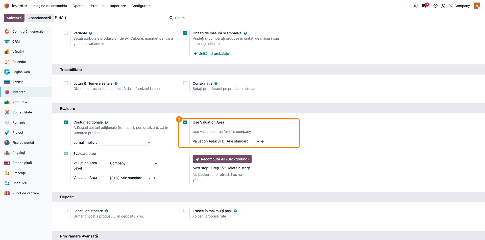
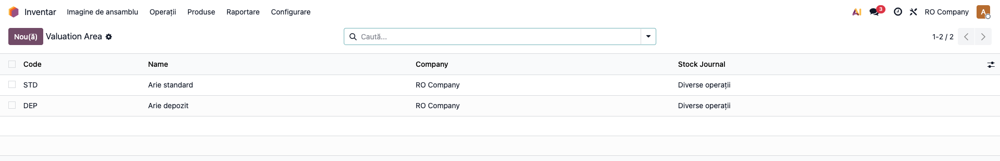
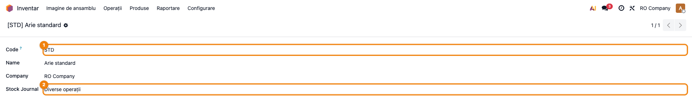
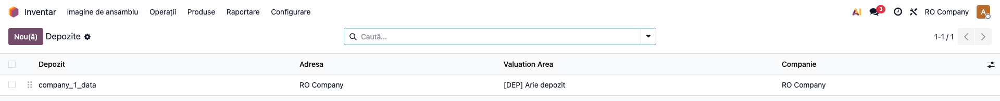
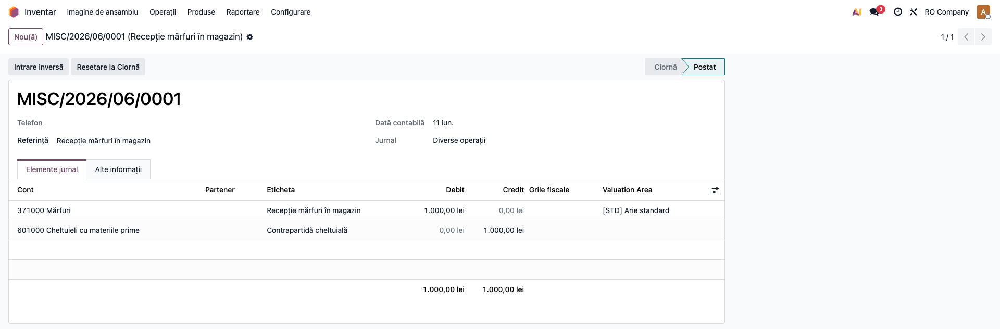

# Fișă Modul: Valuation Area

**Modul:** `deltatech_valuation_area`  
**Rol principal:** definirea ariei de evaluare folosite pe mișcări de stoc și pe linii contabile  
**Utilizatori principali:** contabil stocuri, administrator Odoo, manager depozit

---

## 1. Scop

Modulul introduce modelul `valuation.area` și permite evaluarea stocurilor pe o
arie explicită, nu doar la nivel generic de companie. Aria poate fi stabilită la
nivel de companie, depozit sau locație internă și este propagată pe
`account.move.line`.

În versiunea actuală, modulul este baza tehnică pentru:

- separarea contabilă a stocului pe arii;
- validarea existenței unei arii pentru liniile relevante;
- blocarea mutărilor interne între locații interne cu arii diferite;
- integrarea cu modulele `deltatech_stock_valuation`, `deltatech_obyc` și
  extensiile RO construite peste ele.

## 2. Ce configurează

### 2.1 Activare pe companie

Meniu: `Inventar → Configurare → Setări`

Setarea introdusă de modul:

- **Use Valuation Area**
- **Valuation Area** (aria implicită a companiei)

Dacă opțiunea nu este activă, logica de arie nu se aplică.

### 2.2 Definire arii

Meniu: `Inventar → Configurare → Evaluation Area`

Pe fiecare arie se configurează:

| Câmp | Rol |
|---|---|
| `Code` | cod scurt folosit în afișare și în reguli de contare |
| `Name` | denumirea ariei |
| `Company` | compania |
| `Stock Journal` | jurnalul de stoc asociat |

Numele afișat este calculat în formatul **`[CODE] Name`**.

### 2.3 Asociere la depozit și locație

Modulul adaugă câmpul `valuation_area_id` pe:

- `stock.warehouse`
- `stock.location`

Prioritatea de determinare este:

1. locația destinație internă;
2. locația sursă internă;
3. depozitul mișcării;
4. aria implicită a companiei.

## 3. Flux operațional

### Pasul 1 — activați aria pe companie

Consultați Setări Inventar și activați **Use Valuation Area**.

### Pasul 2 — creați aria implicită

Configurați cel puțin o arie pe companie și selectați-o ca fallback.

### Pasul 3 — detaliați pe depozite sau locații

Dacă aceeași companie are depozite sau locații interne tratate separat, completați
`valuation_area_id` direct pe depozit sau locație.

### Pasul 4 — folosiți fluxurile de stoc sau contabile

La generarea liniilor contabile din mișcările de stoc, modulul completează
automat pe liniile care au produs:

- **aria de evaluare** (determinată după prioritatea de mai sus);
- **cantitatea**, cu semn: **pozitivă pe linia de debit** (intrare în stoc),
  **negativă pe linia de credit** (ieșire din stoc);
- **unitatea de măsură** a produsului.

În Odoo 19 standard, liniile notelor contabile generate din stoc nu poartă
cantități — fără completarea automată, evaluarea pe arii ar pierde cantitățile
de pe notele de stoc. Pe notele de stoc generate automat, consultantul găsește
deci aria și cantitatea deja completate.

La **notele contabile manuale** cu produse stocabile, aria se calculează
automat din companie/depozit/locație (poate fi apoi modificată), iar
cantitatea se introduce manual **respectând convenția de semn** (pozitiv pe
debit, negativ pe credit).

Pentru documentele contabile cu produse stocabile, când compania folosește
Valuation Area, aria devine obligatorie; fără ea apare mesajul:

> `Valuation Area is required for stockable products. If the product is not stockable, you can leave it empty.`

## 4. Reguli importante

| Situație | Comportament actual |
|---|---|
| compania nu folosește Valuation Area | modulul nu impune aria |
| există doar arie pe companie | aceea este folosită ca fallback |
| depozitul are arie proprie | poate suprascrie fallback-ul companiei |
| locația internă are arie proprie | are prioritate maximă |
| mutare internă între două locații interne cu arii diferite | blocată |

Mesajul de blocare pentru mutări interne între arii diferite este:

> `Source and destination locations must have the same valuation area for internal moves.`

**Remediere:** organizați transferul printr-o locație de tranzit sau păstrați
sursa și destinația în aceeași arie. Suportul complet pentru transferuri între
arii este planificat (roadmap evaluare pe depozit).

## 5. Unde se vede în interfață

- `Inventar → Configurare → Evaluation Area`
- formularul de locație internă — câmp `Valuation Area`
- formularul de depozit — câmp `Valuation Area`
- linii contabile din nota contabilă — coloană `Valuation Area`
- Setări Inventar — activare și fallback la nivel de companie

## 6. Verificări utile pentru consultant

- [ ] compania are activă opțiunea **Use Valuation Area**
- [ ] există o arie implicită pe companie
- [ ] depozitele/locațiile critice au `valuation_area_id` completat
- [ ] mutările interne nu traversează două arii diferite direct
- [ ] liniile contabile de stoc păstrează aria corectă
- [ ] notele de stoc generate automat au cantitatea și UoM completate, cu semnul
      corect (pozitiv pe debit, negativ pe credit)
- [ ] notele manuale cu produse stocabile respectă convenția de semn la cantitate

## 7. Limitări cunoscute

- modulul este infrastructură; nu livrează singur rapoarte valorice finale;
- nu există în acest modul o politică avansată de validare pentru toate scenariile
  de configurare greșită pe arborele de locații;
- utilitatea maximă apare împreună cu `deltatech_stock_valuation` și/sau
  `deltatech_obyc`;
- descrierea modulului precizează explicit că direcția principală este compatibilă
  cu **AVCO**, nu cu **FIFO**.

## 8. Capturi

### Setări Inventar cu Use Valuation Area

Secțiunea **Evaluare** din `Inventar → Configurare → Setări`: bifa **Use Valuation
Area** și aria implicită a companiei ([STD] Arie standard).

### Lista ariilor de evaluare

`Inventar → Configurare → Evaluation Area` — coloanele Code / Name / Company /
Stock Journal.

### Formular arie de evaluare

Formularul unei arii cu `Code`, `Name`, `Company` și `Stock Journal`. Numele afișat
este `[CODE] Name`.

### Depozit cu Valuation Area

Lista depozitelor cu coloana **Valuation Area** — depozitul are aria proprie
([DEP] Arie depozit), care suprascrie fallback-ul companiei.

### Linia contabilă cu coloana Valuation Area

Notă de stoc postată: pe linia produsului (371 Mărfuri, debit 1.000) apare
coloana opțională **Valuation Area** completată cu [STD] Arie standard.

> Notă: câmpul **Valuation Area** există și pe formularul de locație internă și pe
> formularul de depozit (`groups="stock.group_stock_manager"`); aici aria
> depozitului este ilustrată prin lista de depozite, mai compactă pentru fișă.
