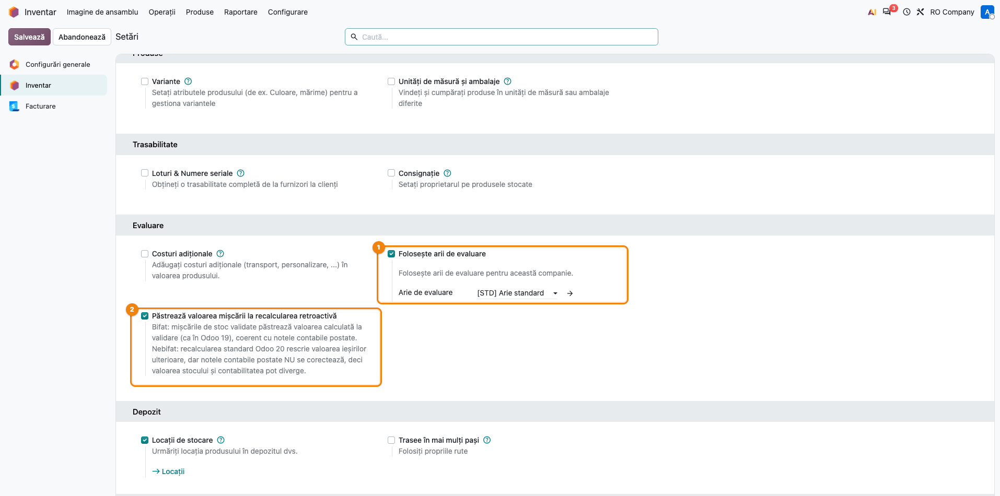
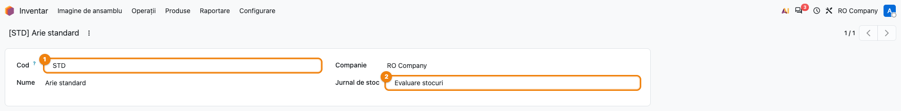
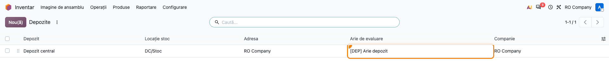
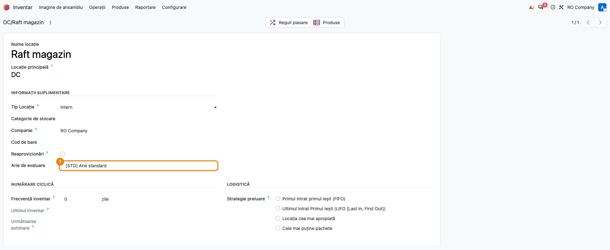
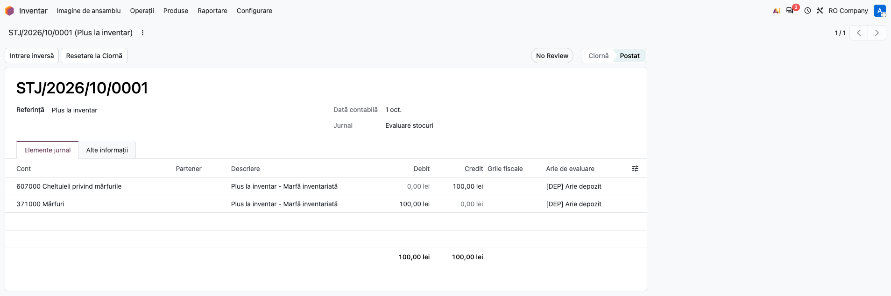
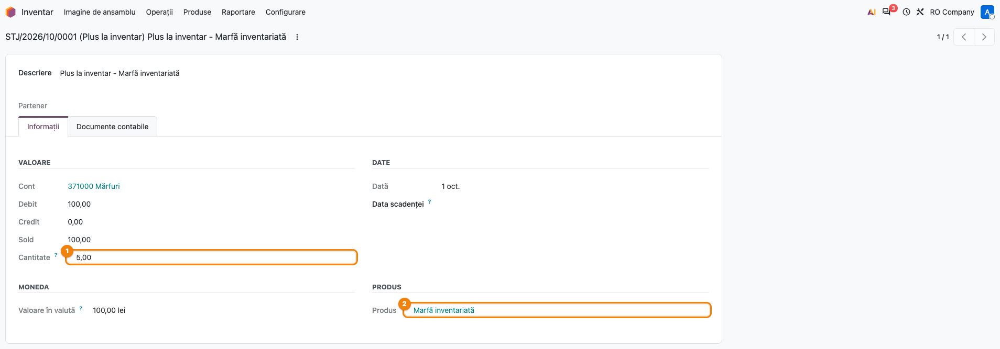
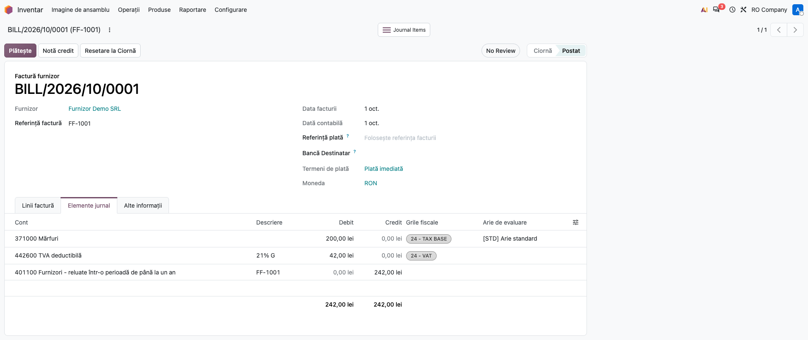
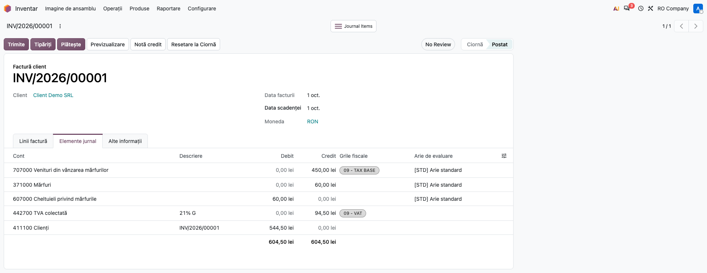

# Fișă Modul: Arii de evaluare a stocului (Valuation Area)

**Modul:** `deltatech_valuation_area`
**Utilizator principal:** contabil stocuri, administrator Odoo, manager depozit
**Prioritate:** 🟡 Medie (infrastructură: are efect complet împreună cu `deltatech_stock_valuation` și/sau `deltatech_obyc`)

> Fișă pentru **Odoo 20**, actualizată la 01.10.2026 (pornind de la fișa din 19.0): regulile de
> determinare a ariei au fost reverificate pe codul Odoo 20 (vezi limitările de la secțiunea 11),
> iar în Setări există o setare nouă, **Păstrează valoarea mișcării la recalcularea retroactivă**,
> care există doar în Odoo 20 (pasul 1). Etichetele de mai jos sunt cele din interfața RO.
>
> Revizuită tot la 01.10.2026, după auditul contabil: baza legală (secțiunea 2), decalajele
> recepție / livrare / factură, conturile de diferențe la inventar pe clase de stoc, tratamentul
> lipsurilor (secțiunea 6), reconcilierea lunară pe arie (secțiunea 8) și limitările transferurilor
> între arii (secțiunile 9 și 11). Din versiunea 20.0.1.0.5, inversarea unei note de stoc anulează
> corect și cantitatea, cu sau fără storno (vezi pasul 7).

---

## 1. Scop business

Modulul introduce **aria de evaluare** — o unitate de evidență a stocului sub nivelul companiei
(conceptul SAP *Valuation Area*): un depozit, o gestiune sau o locație care trebuie urmărită
separat valoric. Aria se stabilește pe companie (implicit), pe depozit sau pe locație internă și
se scrie automat pe liniile notelor contabile care au produs. Pe această etichetă se sprijină
modulele de evaluare pe arie (`deltatech_stock_valuation`, prețul mediu pe arie) și de determinare
a conturilor (`deltatech_obyc`, conturi și jurnal per arie). Folosit singur, modulul **etichetează**
liniile contabile; nu produce rapoarte valorice.

## 2. Bază legală și context

Evidența stocurilor pe locuri de depozitare (gestiuni), cantitativ și valoric, **este o cerință
legală**; modulul este instrumentul prin care Odoo o poate ține pe arii. Referințe din
**OMFP 1802/2014**:

- **pct. 289–290**: contabilitatea stocurilor se ține cantitativ și valoric (sau numai valoric);
  cu inventarul permanent se înregistrează toate intrările și ieșirile, astfel încât stocul să fie
  cunoscut în orice moment, cantitativ și valoric;
- **pct. 284**: deținerea de bunuri neînregistrate în contabilitate este interzisă; bunurile intrate
  se recepționează și se înregistrează la locurile de depozitare (alin. 2 lit. a), iar decalajele
  dintre recepție / livrare și factură se înregistrează ca atare (alin. 2 lit. b–c; vezi pasul 6);
- **pct. 283(1)**: intrarea stocurilor se înregistrează la data transferului riscurilor și
  beneficiilor;
- **pct. 95(2)**: activele constatate lipsă se scot din evidență la data constatării lipsei;
- **pct. 287(2) și (4)**: aceeași metodă de determinare a costului pentru toate stocurile de
  natură și utilizare similare; o diferență de localizare geografică **nu justifică** metode
  diferite. Pentru produse similare nu se combină deci FIFO pe o arie cu cost mediu pe alta.

De verificat la sursa primară (nu sunt detaliate în această fișă): Legea contabilității
nr. 82/1991; OMFP 2634/2015 privind documentele financiar-contabile (fișa de magazie, bonul de
predare-transfer-restituire); OMFP 2861/2009 privind inventarierea; Legea 22/1969 privind
gestionarii.

**Blocarea transferurilor între arii** (secțiunile 9 și 11) **nu este o cerință legală**: legea
permite transferul între gestiuni, cu notă la costul de ieșire (vezi „Note de monografie"). Este o
protecție tehnică temporară a produsului, până la suportul complet pentru transferuri între arii.

Context de metodă: modulul este proiectat pentru evaluarea la **cost mediu ponderat (AVCO)**.
Ariile agregă liniile contabile pe produs și arie, ceea ce nu păstrează straturile de cost cerute
de **FIFO**: produsele pe FIFO nu sunt suportate de evaluarea pe arii. Conform pct. 287(2) și
(4), metoda se alege pe natura stocului, nu pe arie.

## 3. Utilizatori și roluri

| Rol | Ce face | Drepturi necesare |
|---|---|---|
| Administrator Odoo | activează ariile pe companie și alege aria implicită | Administrare / Setări |
| Manager depozit | completează aria pe depozite și locații | Inventar / Administrator (câmpul e vizibil doar acestui grup) |
| Contabil-șef / administrator contabil | definește ariile și jurnalele lor de stoc | Contabilitate / **Administrator** (doar acest grup poate crea, modifica sau șterge arii; ceilalți utilizatori interni le pot doar citi) **+ Inventar / Administrator**, ca să vadă meniul **Configurare** din Inventar, unde se află ariile |
| Contabil stocuri | verifică aria pe notele de stoc și pe facturi | Contabilitate / Contabil; pentru lista **Elemente jurnal** e nevoie de cel puțin drept de citire în Contabilitate |

Pentru testare: un utilizator cu **Inventar / Administrator** + **Contabilitate / Administrator**
acoperă tot fluxul; pentru pasul 1 este nevoie și de drepturi de administrare (Setări). Atenție:
managerul de depozit vede meniul ariilor, dar fără Contabilitate / Administrator nu poate crea arii;
invers, contabilul-șef fără Inventar / Administrator are dreptul să creeze arii, dar nu vede meniul.

## 4. Conturi și date implicate

| Cont | Rol în demo |
|---|---|
| 371 Mărfuri | contul de stoc al produselor (linia care primește aria și cantitatea semnată) |
| 607 Cheltuieli privind mărfurile | contul de pierderi pus pe locația de ajustare a inventarului (contrapartida notei de stoc automate); corect **doar pentru mărfuri** (371) — pentru alte clase de stoc vezi „Note de monografie" |
| 4426 TVA deductibilă | TVA 21% pe factura de furnizor din pasul 8 |
| 401 Furnizori | contrapartida facturii de furnizor din pasul 8 |
| 707 / 4427 / 4111 | venitul, TVA colectată și clientul pe factura de client din pasul 9 |
| 408 / 418 / 4428 | recepții nefacturate, livrări nefacturate și TVA neexigibilă, la închiderea lunii (note manuale, pasul 6); în planul de conturi RO din Odoo 20, 4428 are analiticele 44281 (colectată) și 44282 (deductibilă), iar 408 analiticele 4081 / 4082 |
| 4282 / 461 / 7581 / 635 / 4426 | imputarea lipsurilor și ajustarea TVA dedusă (note manuale, „Note de monografie”) |

Datele minime pentru demo (sunt și cele din capturi):

- compania **RO Company**, plan de conturi RO, monedă RON;
- aria **[STD] Arie standard** (implicită pe companie), pe jurnalul de stoc al companiei
  (**Evaluare stocuri**);
- aria **[DEP] Arie depozit**, cu jurnal de stoc propriu (**Stoc depozit**), pusă pe depozitul
  **Depozit central** și pe locația lui de stoc **DC/Stoc**;
- o locație internă separată, **DC/Raft magazin**, cu aria **[STD]**;
- un produs stocabil dintr-o categorie cu evaluarea perpetuă (în interfață: **Perpetual (at
  invoicing)** — eticheta nu are traducere RO în Odoo 20), metoda de cost **Average Cost (AVCO)**
  și cont de stoc 371, pentru nota de stoc automată și pentru factura de furnizor;
- partenerii **Furnizor Demo SRL** și **Client Demo SRL**;
- setarea **Locații de stocare** activă (pentru meniul **Locații**).

## 5. Configurare inițială

1. **Inventar → Configurare → Setări**, secțiunea **Evaluare**: bifați **Folosește arii de
   evaluare** (pasul 1). Câmpul pentru aria implicită apare sub bifă, dar îl completați abia
   după ce creați ariile (pașii 2–3). Lăsați bifată (valoarea implicită) setarea **Păstrează
   valoarea mișcării la recalcularea retroactivă**, dacă nu ați decis altfel cu contabilul
   (vezi pasul 1).
2. **Inventar → Configurare → Gestiunea depozitului → Arii de evaluare** (meniul e vizibil doar
   pentru *Contabilitate / Administrator*, singurul grup care poate scrie ariile): creați ariile.
3. Reveniți în Setări și alegeți **Arie de evaluare** = aria implicită a companiei; **Salvează**.
4. **Inventar → Configurare → Gestiunea depozitului → Depozite**: completați **Arie de evaluare** pe depozitele evaluate
   separat (pasul 4).
5. **Inventar → Configurare → Gestiunea depozitului → Locații** (meniul apare doar cu setarea
   **Locații de stocare** activă): completați **Arie de evaluare** doar pe locațiile
   interne care au altă arie decât depozitul lor; celelalte iau aria depozitului (pasul 4).
6. Pentru ca stocul să genereze note contabile automate (pasul 6): categoria produsului cu
   evaluarea **Perpetual (at invoicing)** și, pe locația de ajustare a inventarului, contul de
   pierderi completat: **Inventar → Configurare → Gestiunea depozitului → Locații**, scoateți
   filtrul implicit **Intern**, deschideți locația de ajustare a inventarului (în baza demo
   „Inventory adjustment", tip **Pierdere la inventar**) și completați **Cont pierderi** = 607.
   Contul de pe locație e unul singur pentru toate produsele și pentru ambele sensuri: 607 e corect
   doar dacă la inventar se ajustează numai mărfuri (vezi „Note de monografie" pentru celelalte
   clase).

## 6. Flux de utilizare

### Pasul 1 — Activarea ariilor pe companie

**Inventar → Configurare → Setări**, secțiunea **Evaluare**. Bifați **Folosește arii de
evaluare** ①; sub bifă apare câmpul **Arie de evaluare** — aria implicită a companiei, folosită
când nici locația, nici depozitul nu au arie. Apăsați **Salvează**.

La prima configurare ariile nu există încă: lăsați câmpul gol, creați ariile (pașii 2–3) și
reveniți aici să alegeți aria implicită (vezi secțiunea 5, punctul 3).

Cât timp bifa nu e activă, modulul nu completează și nu cere aria nicăieri (cantitatea cu semn
și unitatea de măsură se scriu totuși pe notele de stoc, vezi pasul 6). Setarea e per companie:
celelalte companii din bază nu sunt afectate.

În același bloc apare setarea **Păstrează valoarea mișcării la recalcularea retroactivă** ②,
**bifată implicit** pe fiecare companie. Ea există doar în Odoo 20 și privește o schimbare a
versiunii: când o mișcare de stoc deja validată își schimbă poziția în timp (i se modifică data,
i se corectează cantitatea după validare sau o intrare este reevaluată după ce stocul a fost deja
descărcat), Odoo 20 reia valorizarea tuturor mișcărilor ulterioare ale produsului și **rescrie
valoarea ieșirilor** deja validate, dar **nu corectează notele contabile deja postate**.

| Setare | Efect |
|---|---|
| bifată (implicit) | mișcările validate își păstrează valoarea calculată la validare, ca în Odoo 19; valoarea stocului rămâne egală cu notele contabile postate |
| debifată | se aplică reluarea standard Odoo 20; valoarea ieșirilor se rescrie, iar valoarea stocului și contabilitatea pot ajunge să difere |

**Atenție:** modulul doar oferă setarea; ea are efect numai împreună cu `deltatech_stock_valuation`
(produsele din categoriile evaluate la prețul ariei) și cu `deltatech_obyc` (produsele cu clasă de
evaluare OBYC). Pentru celelalte produse, și când este instalat doar acest modul, Odoo 20 aplică
mereu reluarea standard, oricum ar fi setarea. Schimbați setarea doar cu acordul contabilului.



### Pasul 2 — Lista ariilor de evaluare

**Inventar → Configurare → Gestiunea depozitului → Arii de evaluare**. Lista arată, pentru fiecare arie, **Cod**,
**Nume**, **Companie** și **Jurnal de stoc**. Butonul **Nou(ă)** creează o arie nouă.


### Pasul 3 — Formularul ariei: cod și jurnal de stoc

Deschideți o arie din listă (sau creați una). Completați:

| Câmp | Rol |
|---|---|
| **Cod** ① | cod scurt, obligatoriu; apare în numele afișat `[COD] Nume` (regulile de conturi din `deltatech_obyc` se leagă de arie, nu de cod) |
| **Nume** | denumirea ariei, obligatorie |
| **Companie** | compania căreia îi aparține aria (implicit compania curentă) |
| **Jurnal de stoc** ② | jurnalul pe care se înregistrează notele de stoc ale ariei — **folosit doar dacă este instalat `deltatech_obyc`**; se pot alege doar jurnale de tip *Diverse* ale companiei ariei |

Numele afișat al ariei are forma **`[COD] Nume`** (ex. „[STD] Arie standard").

Despre **Jurnal de stoc**: cu `deltatech_obyc` instalat, mișcările produselor care au **clasă de
evaluare OBYC** dintr-o arie cu jurnal propriu primesc nota de stoc pe jurnalul ariei; restul
mișcărilor rămân pe jurnalul de stoc al companiei. Fără `deltatech_obyc`, câmpul este doar
informativ: notele de stoc merg mereu pe jurnalul de stoc al companiei (vezi pasul 6, unde aria
[DEP] are jurnalul „Stoc depozit", dar nota e pe „Evaluare stocuri").



### Pasul 4 — Aria pe depozit

**Inventar → Configurare → Gestiunea depozitului → Depozite**. Coloana **Arie de evaluare** (opțională, afișată implicit)
arată aria fiecărui depozit; o completați din formularul depozitului, câmpul **Arie de evaluare**
de lângă adresă. În captură, **Depozit central** are aria **[DEP] Arie depozit**, care înlocuiește
aria implicită a companiei pe mișcările depozitului.

Aria depozitului se aplică tuturor mișcărilor pe locațiile lui interne, inclusiv ajustărilor de
inventar și transferurilor create manual: depozitul se deduce din locație (de la versiunea
20.0.1.0.4; înainte, aceste mișcări cădeau pe aria implicită a companiei, VA-001). Aria pusă pe o
locație (pasul 5) are prioritate față de cea a depozitului. În demo, DC/Stoc are explicit aceeași
arie [DEP] ca depozitul.



### Pasul 5 — Aria pe locația internă

**Inventar → Configurare → Gestiunea depozitului → Locații** (meniul apare doar cu setarea
**Locații de stocare** activă), deschideți locația. În grupul **Informații suplimentare**,
câmpul **Arie de evaluare** ① (vizibil doar pentru Inventar / Administrator). Aria locației are
**prioritate maximă** și se ia doar pentru locațiile de tip **Intern**.

Aria **nu se moștenește** de la locația părinte: o locație internă fără arie proprie (inclusiv
sublocațiile, rafturile) ia aria depozitului ei, apoi pe cea a companiei. O mișcare între două
locații interne este refuzată la validare dacă ariile lor efective (proprie → depozit → companie)
diferă (secțiunea 9).



### Pasul 6 — Nota de stoc generată automat

Nota din captură se obține printr-o ajustare de inventar: **Inventar → Operații → Ajustări →
Inventariere fizică**, linia produsului pe **DC/Stoc**, **Cantitate numărată** = 5, apoi
**Aplică**. Ecranul ajustării este cel standard Odoo; modulul intervine abia pe nota contabilă
rezultată, pe care o deschideți din **Facturare → Examinare → Control → Elemente jurnal** (sau din
jurnalul **Evaluare stocuri**).

Notele contabile generate din mișcările de stoc primesc automat, pe fiecare linie cu produs:

- **aria de evaluare**, determinată în ordinea:
  1. locația destinație, dacă e internă și are arie;
  2. locația sursă, dacă e internă și are arie;
  3. depozitul mișcării (vezi atenționarea de la pasul 4);
  4. aria implicită a companiei;
- **cantitatea, cu semn**: pozitivă pe linia de debit, negativă pe linia de credit;
- **unitatea de măsură** a produsului.

Aria și cantitatea se pun pe **toate** liniile cu produs ale notei, inclusiv pe contrapartida
607, nu doar pe contul de stoc. Orice agregare pe arie se filtrează deci pe conturile de stoc
(`deltatech_stock_valuation` folosește conturile bifate **Evaluare stoc**).

În Odoo 20 standard liniile notelor de stoc nu poartă cantitate; fără completarea automată,
evaluarea pe arii ar pierde cantitățile. În Odoo 20 nota de stoc se generează automat doar pentru
produsele cu evaluare perpetuă și doar la mișcările spre/din locațiile cu cont propriu
(ajustarea de inventar — cont de pierderi, producția — cont de cost); recepțiile și livrările
obișnuite se înregistrează contabil prin facturi (pașii 8 și 9).

Semnul cantității se stabilește după partea liniei (debit/credit), nu după valoarea mișcării de
stoc. În Odoo 20 valoarea unei mișcări de ieșire este **negativă** (în Odoo 19 era pozitivă), dar
sumele de pe notă rămân pozitive, iar regula de semn a cantității este aceeași ca în Odoo 19.

**Decalajele recepție / livrare / factură.** Faptul că la recepțiile și livrările obișnuite contul
de stoc se mișcă abia la factură **este comportamentul aplicației, nu monografia legală.** Legea
(OMFP pct. 284(2) lit. b–c; pct. 283(2) enumeră explicit atât bunurile recepționate nefacturate,
cât și cele livrate nefacturate) cere:

| Decalaj | Notă cerută | Ce face Odoo 20 standard |
|---|---|---|
| bunuri sosite fără factură | Dr 371 = Cr 408; TVA prin 4428 (Dr 4428 = Cr 408) | nicio notă până la factură |
| mărfuri livrate nefacturate | descărcarea: Dr 607 = Cr 371; creanța: Dr 418 = Cr 707 + Cr 4428 și, **în luna livrării**, Dr 4428 = Cr 4427 (TVA exigibilă la livrare, Cod fiscal art. 281(1) și 282(1)); la firmele cu **TVA la încasare** (art. 282(3)) TVA rămâne pe 4428 până la încasare, fără trecerea pe 4427 | nicio notă până la factură |

Tabelul e scris pentru **mărfuri**; la produse finite descărcarea este Dr 711 = Cr 345, iar venitul
Dr 418 = Cr 701 (+ 4428), după tabelul pe clase de stoc din „Note de monografie”.

**Nota pe 418 se inversează pe 1 a lunii următoare** (butonul **Intrare inversă**, cu data
inversării = prima zi a lunii următoare), iar factura emisă în luna următoare se înregistrează
normal; astfel 418 și 4428 se închid, iar livrarea nu se dublează.

**D300 din Odoo se calculează din tag-urile de taxă, nu din soldul 4427** (raportul „VAT Report
D300” din `l10n_ro` folosește motorul `tax_tags`). O notă manuală pe 418 / 4428 → 4427 fără
tag-uri nu ajunge în decont, iar factura emisă luna următoare aduce livrarea în D300 abia la data
ei contabilă, cu o lună întârziere. Soluția recomandată: emiteți factura în aceeași lună cu
livrarea, ca nota pe 418 să nu mai fie necesară. Dacă factura se emite luna următoare:

1. puneți pe nota de închidere din luna livrării tag-urile rândului D300 (baza și TVA la cota
   livrării, 21% sau 11%);
2. inversarea notei pe 1 a lunii următoare copiază și tag-urile, cu suma de semn opus, deci luna
   facturii are efect net zero pentru livrare (inversare minus, factură plus) — dedus din codul
   Odoo 20 (tag-urile se copiază la inversare), **neverificat** pe o bază de test; verificați
   D300 din prima lună;
3. reconciliați lunar D300 cu soldul 4427.

La firmele cu TVA la încasare, tag-urile și rândul D300 pentru nota de închidere se stabilesc cu
contabilul (**de verificat**). La recepțiile nefacturate, nota pe 4428 fără tag este corectă: TVA
nu se deduce până la primirea facturii. Efectul asupra D394 este **de verificat** cu contabilul.

Cu `deltatech_obyc` și regulile configurate, pentru produsele cu clasă de evaluare OBYC,
recepția face Dr 371 = Cr 408 și livrarea descarcă gestiunea; TVA la recepțiile nefacturate
(Dr 4428 = Cr 408) și creanța pe 418 la livrările nefacturate rămân manuale și acolo (OBYC-002).
Fără OBYC, la **închiderea lunii** consultantul stabilește cu contabilul cum se înregistrează
recepțiile nefacturate și livrările nefacturate, apoi reconciliază soldul 371 pe arie cu stocul din
locațiile ariei (secțiunea 8).

Exemplul din captură: plus de 5 bucăți la inventar pe **DC/Stoc** — nota are aria **[DEP] Arie
depozit** pe ambele linii (aria locației destinație), cantitatea +5 pe linia de debit 371 și −5 pe
linia de credit 607. Coloana **Arie de evaluare** e opțională în lista liniilor: o afișați din
butonul de coloane opționale din capul tabelului. Cantitatea nu are coloană în lista liniilor
notei; o verificați la pasul 7.



### Pasul 7 — Cantitatea semnată pe linia notei de stoc

**Facturare** (sau **Contabilitate**, cu Enterprise) **→ Examinare → Control → Elemente jurnal**, deschideți
linia 371 a notei de la pasul 6. În grupul **Valoare**, câmpul **Cantitate** ① arată **5,00**
(pozitiv, linia e de debit); în grupul **Produs** ② apare produsul. Linia 607 a aceleiași note
are cantitatea **−5,00**. Câmpul e doar de citire. Meniul **Elemente jurnal** cere cel puțin drept
de citire în Contabilitate.

Această cantitate semnată este cea pe care `deltatech_stock_valuation` o agregă pe arie.

**Convenția semnului la inversare** (butonul **Intrare inversă** pe nota de stoc, apoi
**Inversare** în asistent). Odoo 20 copiază nota și schimbă semnul sumei pe fiecare linie; cu
storno, linia rămâne pe aceeași parte, cu sumă negativă. Cantitatea o copiază însă cu același semn,
de aceea modulul o corectează (de la versiunea 20.0.1.0.5):

| Compania | Linia inversă | Cantitatea pe linia inversă | Efect net |
|---|---|---|---|
| fără storno | trece pe partea opusă (ex. Cr 371 100,00) | semn inversat (−5), odată cu partea | cantitate 0, valoare 0 |
| cu storno (**Contabilitate storno**; în Odoo 20 activă automat pentru companiile cu țara fiscală România) | rămâne pe aceeași parte, cu sumă negativă (Dr 371 −100,00) | semn păstrat (+5); semnul sumei arată ieșirea | cantitate 0, valoare 0 |
| cu storno, linie de **valoare zero** (mișcare la cost 0) | rămâne pe aceeași parte, cu sumă 0 | semn inversat (−5): linia nu are semn de sumă care să anuleze intrarea | cantitate 0, valoare 0 |

Pe o companie cu storno, coloana **Cantitate** din **Elemente jurnal** arată +5 pe ambele linii
371 (nota inițială și cea inversă); netul de 0 rezultă din semnul sumei (cantitate × semnul
sumei). Verificați deci cantitatea netă în evaluarea pe arie din `deltatech_stock_valuation`
(**Inventar → Produse → Product Valuation**), nu prin însumarea coloanei Cantitate.

Cazul fără storno privește în practică firmele din alte țări (de exemplu Republica Moldova sau
Irlanda). Înainte de versiunea 20.0.1.0.5, pe o companie fără storno inversul unei intrări număra
încă o intrare (de exemplu 10 buc. la 0 lei în loc de 0), iar cu storno la fel pe liniile de valoare
zero (VA-007). Notele inversate înainte de actualizare pot avea deci cantitatea greșită:
verificați-le (secțiunea 8). Cantitatea unei note postate nu se modifică; corecția se face printr-o
notă manuală pe contul de stoc cu **Produs**, **Cantitate** și **Arie de evaluare** (coloanele
opționale de la pasul 9), stabilită cu contabilul — o astfel de notă de corecție, cu valoare zero,
nu a fost verificată pe o bază de test 20.0.



### Pasul 8 — Factura de furnizor pentru marfa recepționată

În demo, marfa (10 buc, cost 20 lei/buc) a fost recepționată întâi pe **DC/Raft magazin**
printr-o recepție manuală (**Inventar → Operații → Transferuri → Recepții**), fără comandă de
achiziție; factura vine la același preț, 20 lei/buc. Cu
evaluarea **Perpetual (at invoicing)**, recepția nu generează notă contabilă: în Odoo 20 marfa
intră valoric în 371 prin factura de furnizor.

**Facturare → Furnizori → Facturi**, factura postată, tab-ul **Elemente jurnal**. Pe linia
produsului, coloana opțională **Arie de evaluare** e completată automat: aria se ia din mișcarea
de stoc legată (recepția comenzii de achiziție, respectiv livrarea comenzii de vânzare pe facturile
de client), altfel din aria implicită a companiei. Liniile fără produs (TVA, furnizor) rămân fără
arie. În captură, factura nu e legată de recepție (nu există comandă de achiziție), deci primește
aria implicită **[STD] Arie standard** pe linia 371 — aceeași cu aria raftului pe care a intrat
marfa. Coloana nu există în tab-ul **Linii factură**, doar în **Elemente jurnal**.

**Atenție:** aria liniei se calculează la alegerea produsului și nu se mai recalculează. Dacă
factura (ciorna) e creată **înaintea** recepției comenzii de achiziție, linia primește aria
implicită, iar validarea ulterioară a recepției nu o schimbă. Verificați și, dacă e cazul,
corectați aria în tab-ul **Elemente jurnal** cât timp factura e ciornă.

**Demo-ul este o ilustrare strict tehnică, nu o monografie:** factura e fără comandă de achiziție
doar ca să arate aria implicită. În practică marfa intră prin recepția comenzii de achiziție, iar
aria vine din locația recepției (pe DC/Stoc ar fi [DEP]).

Dacă factura sosește înaintea mărfii: contul 327 „Mărfuri în curs de aprovizionare” se folosește
doar dacă riscurile și beneficiile au trecut deja la cumpărător (grupa 32; OMFP pct. 276(3) și
283(1)). În Odoo 20, cu evaluarea perpetuă la facturare, factura debitează direct 371; nota pe 327
nu iese din standard și se face manual, de contabil. Dacă riscurile **nu** au trecut, bunul nu intră
în stoc, iar factura se înregistrează ca avans facturat (Dr 409 + Dr 4426 = Cr 401; TVA exigibilă la
emiterea facturii, art. 282(2) lit. a Cod fiscal); nota se stabilește cu contabilul (**de
verificat**), Odoo nu o face. Modulul nu intervine în aceste înregistrări.

Aria de pe linia facturii se ia din **prima** mișcare de stoc legată. Dacă o linie de factură
acoperă mișcări din două arii (de exemplu o comandă recepționată parțial în două depozite), toată
linia primește aria primei mișcări (VA-005, deschis; vezi secțiunea 11).

Cât timp compania folosește ariile, linia cu produs **stocabil** **nu poate rămâne fără arie**:
golirea ei blochează salvarea cu mesajul de la secțiunea 9. Aria se completează însă pe **orice**
linie cu produs (inclusiv servicii și consumabile): dacă compania nu are arie implicită și linia
nu are o mișcare legată, chiar alegerea produsului pe linie e refuzată („Aria de evaluare nu este
definită") — pe facturi și pe orice linie contabilă cu produs, creată de alte documente (VA-006,
deschis). Setați deci mereu aria implicită a companiei.



### Pasul 9 — Factura de client: liniile de descărcare a costului

În demo, 3 buc au fost livrate întâi din **DC/Raft magazin** printr-o livrare manuală (**Inventar →
Operații → Transferuri → Livrări**), fără comandă de vânzare; livrarea nu generează notă (locația
client nu are cont propriu), descărcarea se face prin factură.

**Facturare → Clienți → Facturi**, factura postată, tab-ul **Elemente jurnal**. Pentru un produs
cu evaluare perpetuă, Odoo 20 adaugă la postare liniile de descărcare a costului: **Dr 607** (contul
de cheltuială al categoriei) / **Cr 371**, la costul produsului. Aceste linii primesc aria, ca și
linia de venit 707 (orice linie cu produs): aria livrării comenzii de vânzare legate sau, fără
comandă, aria implicită. În captură: 3 buc vândute cu 150 lei, descărcare la cost 3 × 20 = 60 lei,
aria **[STD]** pe liniile 707, 371 și 607.

**Atenție la cantitate:** pe liniile de descărcare cantitatea este cea facturată, **pozitivă pe
ambele linii** (+3 și pe 371, și pe 607); modulul pune semnul doar pe notele generate din
mișcările de stoc (pasul 6). Cantitatea nu are coloană în lista liniilor; o verificați deschizând
linia din **Elemente jurnal**, ca la pasul 7.



**Note contabile manuale.** De la versiunea 20.0.1.0.4, lista **Elemente jurnal** a unei note
contabile introduse manual are coloanele opționale **Produs**, **Cantitate**, **UM** și **Arie de
evaluare** (afișați-le din meniul coloanelor opționale); o corecție pe arie (de exemplu un sold
inițial) poate purta astfel produsul, cantitatea semnată și aria. Lista generală a elementelor de
jurnal are coloanele opționale **Cantitate** și **Arie de evaluare**.

### Note de monografie și raportare

Modulul **nu schimbă conturile** și nici sumele: notele rămân cele din Odoo standard (sau din
`deltatech_obyc`); modulul adaugă pe linii aria, cantitatea semnată și unitatea de măsură.

| Operațiune (demo) | Debit | Credit | Arie pe linii | Cantitate |
|---|---|---|---|---|
| Plus la inventar, 5 buc × 20 lei, pe DC/Stoc (pasul 6) | 371 Mărfuri 100,00 | 607 Cheltuieli privind mărfurile 100,00 | [DEP] pe ambele | +5 pe 371, −5 pe 607 |
| Lipsă la inventar (sens invers) | 607 | 371 | aria locației sursă | +q pe 607, −q pe 371 |
| Recepție 10 buc × 20 lei pe DC/Raft magazin (pasul 8) | — (fără notă, evaluare la facturare) | — | — | — |
| Factură de furnizor pentru marfa recepționată, 10 buc × 20 lei + TVA 21% (pasul 8) | 371 Mărfuri 200,00 și 4426 TVA deductibilă 42,00 | 401 Furnizori 242,00 | [STD] doar pe linia 371 | 10 (cantitatea facturată) |
| Livrare 3 buc din DC/Raft magazin (pasul 9) | — (fără notă, descărcare la facturare) | — | — | — |
| Factură de client, 3 buc × 150 lei + TVA 21% (pasul 9) | 4111 Clienți 544,50 | 707 Venituri din vânzarea mărfurilor 450,00 și 4427 TVA colectată 94,50 | [STD] pe linia 707 | 3 |
| Descărcarea gestiunii pe aceeași factură (pasul 9) | 607 Cheltuieli privind mărfurile 60,00 | 371 Mărfuri 60,00 | [STD] pe ambele | +3 pe ambele (nesemnată) |

Control demo: sold 371 = 100,00 + 200,00 − 60,00 = 240,00 lei = stocul de 12 buc × 20 lei (cost
mediu AVCO 20 lei/buc).

**Contul de diferențe la inventar pe clasa de stoc.** Contul 607 vine din contul de pierderi
configurat pe locația de ajustare (în Odoo 20 un singur câmp pe locație, **Cont pierderi**, folosit
pentru ambele sensuri și pentru toate produsele). Este corect **doar pentru mărfuri**. Pentru
celelalte clase:

| Stoc | Cont de stoc | Cont de cheltuieli / variația stocurilor (lipsuri și plusuri) |
|---|---|---|
| mărfuri | 371 | 607 |
| materii prime | 301 | 601 |
| materiale consumabile | 302 | 602 |
| obiecte de inventar | 303 | 603 |
| semifabricate | 341 | 711 (variația stocurilor) |
| produse finite | 345 | 711 (variația stocurilor) |
| produse reziduale | 346 | 711 (variația stocurilor) |
| ambalaje | 381 | 608 |

Soluții: conturi pe clasa de evaluare prin `deltatech_obyc` (cheile de inventar plus / minus;
inversarea lor, OBYC-005, este reparată în `deltatech_obyc` 20.0.1.0.5 — verificați totuși nota pe
o lipsă și pe un plus de test) sau locații de ajustare separate, câte una pe clasă de stoc, fiecare
cu contul ei.

**Plusurile la inventar** se evaluează legal la **valoarea justă** (OMFP pct. 75(1) lit. d). Odoo
le pune la costul mediu curent al produsului; dacă firma păstrează acest comportament, opțiunea
trebuie asumată și motivată în politica contabilă, iar altfel valoarea plusului se corectează.

**Lipsurile la inventar.** Nota de stoc acoperă doar scoaterea din gestiune (pct. 95(2)). Restul
se înregistrează separat; nici Odoo, nici modulul nu le generează:

| Situație | Notă | Bază |
|---|---|---|
| imputare la salariat (gestionar) | Dr 4282 = Cr 7581, **fără TVA** | suma imputată nu este operațiune în sfera TVA, deci fără TVA colectată: Norme Cod fiscal (HG 1/2016) pct. 78(6) lit. a |
| imputare la terți | Dr 461 = Cr 7581, **fără TVA** | idem |
| lipsă din alte cauze decât cele de la art. 304(2) Cod fiscal, **imputată sau nu**: ajustarea TVA dedusă | Dr 635 = Cr 4426 | Cod fiscal art. 304(1) lit. c; Norme pct. 78(6) lit. a |

Criteriul ajustării TVA este **cauza lipsei**, nu imputarea: o lipsă imputată gestionarului
cere și ea ajustarea deducerii, dacă nu intră în excepțiile de mai jos. Fără ajustarea deducerii
TVA: bunuri distruse, pierdute sau furate, dovedite (art. 304(2) lit. a); perisabilități în
limitele legale, pierderi tehnologice în normă, stocuri degradate cu dovada distrugerii (Norme
pct. 78(10) lit. d–f).

Ajustarea TVA la lipsuri se raportează în D300 din perioada constatării (Norme pct. 78(1)). D300 din
Odoo se calculează din tag-urile de taxă, deci nota manuală Dr 635 = Cr 4426 ajunge în decont doar
dacă linia de TVA poartă tag-ul rândului de ajustare; rândul D300 și tag-ul se stabilesc cu
contabilul (**de verificat**).

În **gestiunile la preț cu amănuntul**, lipsa se descarcă la prețul de vânzare: Dr 607 (cost) +
Dr 378 (adaos) + Dr 4428 (TVA neexigibilă) = Cr 371. Nici Odoo, nici modulul nu fac această
notă.

Impozit pe profit: lipsurile neimputabile și TVA aferentă sunt **nedeductibile** (Cod fiscal
art. 25(4) lit. c), cu excepțiile prevăzute acolo (calamități, bunuri asigurate, degradare cu
dovada distrugerii etc.); perisabilitățile sunt deductibile în limitele legii (art. 25(3) lit. d).
La imputare, cheltuiala e compensată de venitul din 7581.

**Transferul între gestiuni** în aceeași entitate (cerut de lege, dar **nesuportat încă între arii**,
secțiunea 11):

| Situație | Notă |
|---|---|
| gestiunea A → gestiunea B, aceeași entitate | Dr 371.Gestiune B = Cr 371.Gestiune A, la costul de ieșire din A |
| între subunități cu contabilitate proprie | prin 481 / 482 (decontări între unitate și subunități) |
| gestiuni la preț cu amănuntul | se reiau pe gestiune și adaosul (378) și TVA neexigibilă (4428) |

Documentele (bon de predare-transfer-restituire, aviz de însoțire) și obligațiile e-Transport
pentru transferurile între gestiuni sunt **de verificat** pe cazul firmei.

## 7. Legături cu alte module / declarații

| Modul | Rol |
|---|---|
| `stock_account` (Odoo) | generează notele de stoc pe care modulul le completează cu aria |
| `deltatech_stock_valuation` | calculează valoarea și prețul mediu **pe arie** din liniile etichetate; are nevoie de cantitatea semnată; respectă setarea **Păstrează valoarea mișcării la recalcularea retroactivă** pentru ieșirile evaluate la prețul ariei |
| `deltatech_obyc` | determină conturile pe arie + clasă de evaluare și pune nota de stoc pe **Jurnalul de stoc al ariei**; respectă aceeași setare pentru produsele cu clasă de evaluare |

**Declarații:** modulul nu generează declarații ANAF. D300 din Odoo se calculează din tag-urile de
taxă, deci notele manuale de închidere a lunii (livrări nefacturate, ajustarea TVA la lipsuri) ajung
în decont doar cu tag-uri (pasul 6 și „Note de monografie”). **D406 (SAF-T), secțiunea de stocuri**
(depusă la cerere) raportează stocurile pe depozit; aria poate sta la baza acestei defalcări, dar
structura cerută (corespondența arie ↔ depozit SAF-T) este **de verificat** la implementare.

**Ce e automat:** aria, cantitatea semnată și unitatea de măsură pe notele de stoc; aria pe
orice linie de factură/notă cu produs (inclusiv liniile de descărcare de pe factura de client);
blocarea liniilor cu produs stocabil fără arie.

**Ce rămâne manual:** definirea ariilor și a jurnalelor; decizia asupra setării **Păstrează
valoarea mișcării la recalcularea retroactivă**; completarea ariei pe fiecare depozit și
pe locațiile interne care au altă arie decât depozitul lor. Pe notele contabile manuale,
produsul, cantitatea, UM și aria se completează din coloanele opționale ale listei **Elemente
jurnal** (vezi pasul 9).

## 8. Verificări pentru consultant

- [ ] compania are bifat **Folosește arii de evaluare** și o **Arie de evaluare** implicită
- [ ] **Păstrează valoarea mișcării la recalcularea retroactivă** este bifată (implicit) sau debifarea ei e decisă și consemnată împreună cu contabilul
- [ ] fiecare arie are **Cod** și, dacă se folosește `deltatech_obyc`, **Jurnal de stoc** al aceleiași companii
- [ ] depozitele evaluate separat au aria completată; locațiile cu altă arie decât depozitul lor o au setată explicit
- [ ] pe o notă de stoc automată (ex. ajustare de inventar), coloana **Arie de evaluare** arată aria locației, pe toate liniile cu produs
- [ ] în **Elemente jurnal**, linia de debit a notei de stoc are **Cantitate** pozitivă, iar linia de credit cantitate negativă, egală în valoare absolută
- [ ] pe o factură de furnizor cu produs stocabil, tab-ul **Elemente jurnal** arată aria pe linia produsului (aria recepției legate sau, fără comandă, aria implicită)
- [ ] la o factură de furnizor creată înaintea recepției, aria de pe linie a fost verificată/corectată înainte de postare
- [ ] pe o factură de client cu produs perpetuu, liniile de descărcare 607/371 au aria completată (cantitatea lor este pozitivă pe ambele linii — comportament cunoscut)
- [ ] utilizatorul care definește ariile are **Contabilitate / Administrator**
- [ ] produsele evaluate pe arii sunt pe **cost mediu (AVCO)**, nu pe FIFO
- [ ] fără `deltatech_obyc`: notele de stoc sunt pe jurnalul de stoc al companiei, indiferent de jurnalul ariei (comportament așteptat)
- [ ] **reconcilierea lunară a soldului 371 pe arie** este făcută și consemnată (procedura de mai jos); o diferență indică un transfer între arii fără notă, o mișcare pe aria greșită (notele de inventar dinainte de 20.0.1.0.4, VA-001), o factură fără recepție sau cu mișcări din două arii (VA-005)
- [ ] agregările pe arie se fac doar pe conturile de stoc (bifa **Evaluare stoc**), nu pe 607 / 601 etc., care poartă și ele aria și cantitatea
- [ ] la închiderea lunii, recepțiile nefacturate (Dr 371 = Cr 408; TVA Dr 4428 = Cr 408) și livrările nefacturate (Dr 607 = Cr 371; Dr 418 = Cr 707 + Cr 4428, apoi Dr 4428 = Cr 4427 în luna livrării; la TVA la încasare TVA rămâne pe 4428) sunt înregistrate, iar nota pe 418 este inversată pe 1 a lunii următoare
- [ ] nota de închidere pe 418 / 4427 are tag-urile rândului D300 (D300 din Odoo se calculează din tag-uri); D300 se reconciliază lunar cu soldul 4427
- [ ] pe facturile ale căror linii acoperă mișcări din mai multe arii (recepții parțiale în depozite diferite), aria de pe linie corespunde realității; altfel notați diferența și stabiliți corecția cu contabilul (VA-005)
- [ ] contul de pe locația de ajustare a inventarului corespunde clasei de stoc ajustate (607 doar pentru mărfuri)
- [ ] lipsurile constatate la inventar au, pe lângă nota de stoc, imputarea (Dr 4282 / 461 = Cr 7581, fără TVA) și, unde e cazul, ajustarea TVA (Dr 635 = Cr 4426, art. 304 Cod fiscal), înregistrate manual
- [ ] o notă de stoc inversată are cantitatea netă 0 în **Product Valuation** (fără storno: linia inversă are cantitate de semn opus; cu storno: aceeași cantitate, sumă negativă; cu storno, pe o linie de valoare zero: cantitate de semn opus); notele inversate înainte de 20.0.1.0.5 se verifică separat (VA-007)
- [ ] nu există transferuri validate între gestiuni din arii diferite, nici directe (refuzate de la 20.0.1.0.4), nici prin locația de tranzit (vezi secțiunea 11)

**Procedura de reconciliere lunară a soldului 371 pe arie** (la închiderea lunii, pentru fiecare
cont de stoc folosit: 371, 301, 345 etc.):

1. **Soldul contabil pe arie.** **Facturare** (sau **Contabilitate**, cu Enterprise) **→ Examinare →
   Control → Elemente jurnal**. Căutați contul (ex. 371) și restrângeți la notele postate cu data
   până la ultima zi a lunii; afișați coloana opțională **Arie de evaluare** și grupați după ea
   (grupare personalizată pe câmpul **Arie de evaluare**). Notați soldul (Debit − Credit) pe
   fiecare arie. Liniile fără arie din acest grup (ex. solduri vechi, note manuale fără produs)
   sunt ele însele o diferență de explicat.
2. **Valoarea din evaluarea pe arie.** Cu `deltatech_stock_valuation`: **Inventar → Produse →
   Product Valuation History**, rândurile lunii pe contul de stoc, cu vizualizarea pivot pe
   **Valuation Area** (sau **Inventar → Produse → Product Valuation** pentru soldul curent).
   **Amount** pe fiecare arie trebuie să fie egal cu soldul de la punctul 1. Cantitatea netă
   (**Quantity**) se citește tot de aici, nu din coloana **Cantitate** din **Elemente jurnal**:
   pe facturile de client cantitatea liniilor de descărcare nu are semn (pasul 9), iar cu storno
   semnul ieșirii este pe sumă (pasul 7).
3. **Stocul fizic pe arie.** **Inventar → Raportare → Stock by Location** (meniul apare cu setarea
   **Locații de stocare**; eticheta nu are traducere RO în Odoo 20), grupat pe locație: însumați
   cantitățile locațiilor fiecărei arii și comparați-le cu **Quantity** de la punctul 2. Raportul
   arată stocul curent, deci rulați-l în ziua închiderii; stocul la o dată trecută **nu a fost
   verificat** pe 20.0.
4. **Diferențele** se explică și se corectează cu contabilul înainte de închiderea lunii (cauze
   tipice în prima bifă de mai sus); consemnați rezultatul reconcilierii pe fiecare arie.

## 9. Mesaje de eroare frecvente

| Mesaj | Cauză | Remediere |
|---|---|---|
| „Aria de evaluare este obligatorie pentru produsele stocabile. Dacă produsul nu este stocabil, o puteți lăsa necompletată." | pe o linie de notă/factură cu produs stocabil s-a golit **Arie de evaluare**, iar compania folosește ariile | completați aria pe linie |
| „Aria de evaluare nu este definită" | compania folosește ariile, dar nu are arie implicită, iar linia (sau mișcarea) nu găsește arie pe locație/depozit; apare chiar la alegerea oricărui produs (inclusiv serviciu) pe linia unei facturi | alegeți aria implicită în Setări (pasul 1) sau completați aria pe locație/depozit |
| „Locațiile sursă și destinație trebuie să aibă aceeași arie de evaluare pentru mișcările interne." | la validarea unei mișcări (sau a unei linii a ei, de exemplu la putaway pe o sublocație) între două locații interne ale căror arii efective (proprie → depozit → companie) diferă; cu sau fără `deltatech_obyc` (de la versiunea 20.0.1.0.4) | păstrați sursa și destinația în aceeași arie. **Nu ocoliți blocarea printr-o locație de tranzit:** mișcările spre/din tranzit nu sunt verificate, dar produc note doar cu `deltatech_obyc` și reguli pentru `internal_transfer_out` / `internal_transfer_in`, iar valoarea lor poate fi 0 (OBYC-009, deschis); fără ele valoarea rămâne pe aria sursă. Ruta prin tranzit **nu este o soluție validată** (secțiunea 11) |

## 10. Capturi de ecran

Capturile din `readme/screenshots/` sunt **generate automat** din `tests/test_screenshots.py`
(mixinul `ScreenshotCase` din `l10n_ro_doc_screenshots`, import defensiv), în **limba română**, pe
„RO Company", în RON, pe planul de conturi RO (`setup_country("ro")`), în ordinea pașilor:

1. `01_setari_use_valuation_area.png` — Setări Inventar, secțiunea Evaluare: bifa, aria implicită și setarea Păstrează valoarea mișcării la recalcularea retroactivă.
2. `02_valuation_area_list.png` — lista ariilor cu Cod / Nume / Companie / Jurnal de stoc.
3. `03_valuation_area_form.png` — formularul ariei [STD], cu Cod și Jurnal de stoc evidențiate.
4. `04_depozit_valuation_area.png` — lista depozitelor, coloana Arie de evaluare ([DEP]).
5. `05_locatie_valuation_area.png` — formularul locației DC/Raft magazin, câmpul Arie de evaluare.
6. `06_nota_stoc_automata.png` — nota de stoc automată la plus de inventar (Dr 371 / Cr 607, aria [DEP]).
7. `07_linie_stoc_cantitate.png` — formularul liniei 371 a notei automate: Cantitate 5,00 și Produs.
8. `08_factura_furnizor_valuation_area.png` — factura de furnizor pentru marfa recepționată (Dr 371 200 + 4426 42 / Cr 401 242), aria [STD] pe linia produsului.
9. `09_factura_client_descarcare.png` — factura de client cu liniile de descărcare (Dr 607 / Cr 371), aria [STD] pe liniile cu produs.

Regenerare:

```bash
.venv/bin/python odoo/odoo-bin -c odoo.conf -d <db> -i l10n_ro,deltatech_valuation_area,l10n_ro_doc_screenshots \
    --without-demo=all --test-tags=fise_screenshots --stop-after-init --http-port=8170
```

## 11. Observații pentru manual

- **Terminologie:** de la versiunea 20.0.1.0.4 interfața RO folosește peste tot „arie de evaluare"
  (meniul **Arii de evaluare**, bifa din Setări, mesajele de eroare); pe bazele existente,
  traducerile se reîncarcă la actualizarea modulului.
- **Transferurile interne directe între arii diferite sunt refuzate** la validare (de la versiunea
  20.0.1.0.4, cu sau fără `deltatech_obyc`). Înainte, fără `deltatech_obyc`, un astfel de transfer
  trecea fără eroare, iar valoarea rămânea pe aria sursă (verificat pe Odoo 20, la 01.10.2026);
  verificați transferurile vechi. Blocarea este o limitare tehnică a produsului, nu o cerință
  legală (secțiunea 2). **Consecința unui transfer trecut între arii:** stocul fizic ajunge în
  gestiunea B, dar valoarea și cantitatea pe arie rămân pe aria A (contrar OMFP pct. 290 și 284(1)).
- **Ruta prin tranzit (aria A → tranzit → aria B) nu este o ocolire validată și nu se
  recomandă.** Mișcările spre/din locația de tranzit nu sunt verificate de modul, dar produc note
  doar cu `deltatech_obyc` și reguli pentru `internal_transfer_out` / `internal_transfer_in`; fără
  ele, transferul nu generează nicio notă și valoarea rămâne pe aria sursă. Cu regulile definite,
  notele pot fi postate la valoare și cantitate 0 (OBYC-009, deschis, neverificat pe 20.0). **Până
  la suportul complet** (planificat, roadmap evaluare pe depozit), **nu faceți transferuri între
  gestiuni din arii diferite**; dacă au fost făcute, corecția pe arie se stabilește cu contabilul
  (Dr 371 aria B = Cr 371 aria A, la costul de ieșire) și se introduce ca notă manuală cu
  **Produs**, **Cantitate** și **Arie de evaluare** (coloanele opționale de la pasul 9).
- **Aria depozitului** se aplică, de la versiunea 20.0.1.0.4, tuturor mișcărilor pe locațiile lui
  interne. Înainte, ajustările de inventar și transferurile manuale cădeau pe aria implicită a
  companiei dacă locația de stoc nu avea arie proprie (VA-001); verificați notele de inventar
  anterioare pe bazele configurate doar pe depozit. Efect contabil: plusurile și lipsurile au ajuns
  pe aria greșită, deci compensarea lor și imputarea lipsurilor s-au făcut pe gestiunea, adică pe
  gestionarul, greșit.
- **Aria pe factură** se ia doar din prima mișcare de stoc legată de linie (VA-005, deschis): o
  linie acoperită de mișcări din două arii pune toată valoarea pe aria primei mișcări.
- **Aria pe liniile fără stoc** (VA-006, deschis): aria se pune pe orice linie cu produs, inclusiv
  servicii; fără arie implicită pe companie, facturile cu servicii sunt blocate. Setați mereu aria
  implicită.
- **Inversarea notelor de stoc** anulează, de la versiunea 20.0.1.0.5, și cantitatea, cu sau fără
  storno (pasul 7, VA-007); notele inversate înainte se verifică în reconcilierea pe arie.
- **Jurnalul de stoc al ariei** are efect doar cu `deltatech_obyc` și doar pentru produsele cu
  clasă de evaluare OBYC.
- Modulul este infrastructură: nu livrează singur rapoarte valorice; valoarea pe arie o calculează
  `deltatech_stock_valuation`.
- Metoda suportată este **AVCO**; produsele pe FIFO nu sunt compatibile cu evaluarea pe arii.
- **Păstrează valoarea mișcării la recalcularea retroactivă** există doar în Odoo 20 și are efect
  doar cu `deltatech_stock_valuation` sau `deltatech_obyc`. În manual, prezentați-o ca setare de
  contabil: bifată = valori stabile, egale cu notele postate (ca în Odoo 19); debifată = reluarea
  standard Odoo 20, cu risc de diferențe între valoarea stocului și contabilitate.
- Unele etichete din Odoo 20 standard sau din localizare nu au traducere RO (ex. evaluarea
  categoriei „Perpetual (at invoicing)", „Average Cost (AVCO)", butoanele „Journal Items” și „No
  Review” de pe documentele contabile, grilele fiscale „TAX BASE” / „VAT”); manualul le poate cita
  așa cum apar.
- Capturile documentelor contabile (pașii 6–9) sunt făcute din aplicația Inventar; în meniul
  Facturare ecranele sunt identice.
