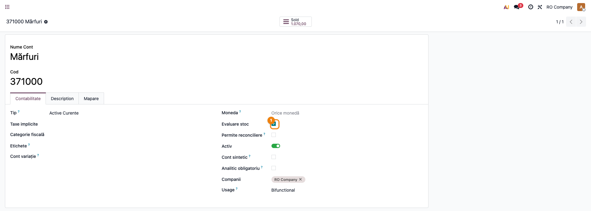
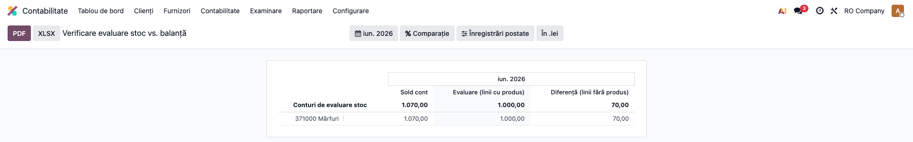
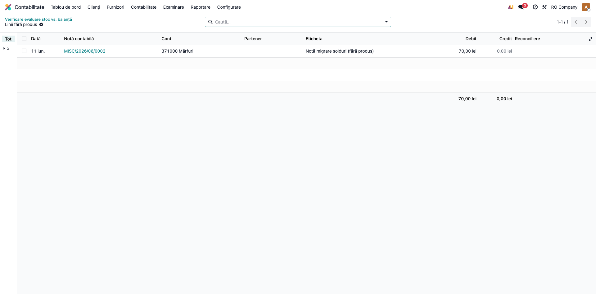

# Fișă Modul: Verificare evaluare stoc vs. balanță contabilă

**Modul:** `deltatech_valuation_report`
**Utilizator principal:** Consultant implementare, Contabil șef
**Prioritate:** 🟡 Medie (instrument de diagnostic — esențial la migrări și la închiderea lunii)

---

## 1. Scop business

Modulul adaugă un raport Enterprise (framework `account.report`) care verifică, pentru fiecare
cont de evaluare a stocului, dacă **evaluarea pe produs** (stratul `deltatech_stock_valuation`,
calculat din notele contabile) **închide cu soldul contului din balanță** — și, mai ales,
**explică diferența**: liniile contabile postate pe conturile de stoc **fără produs**, care nu
pot fi alocate niciunei evaluări. Transformă un avertisment ascuns în log într-un ecran
auditabil, cu acces direct la liniile vinovate.

## 2. Bază legală și context

Context operațional, ancorat în principiul concordanței dintre contabilitatea sintetică și
evidența analitică (OMFP 1802/2014 — organizarea contabilității stocurilor și inventarierea):
soldul conturilor de stoc din balanță trebuie să se regăsească integral în evidența analitică
pe produse. Evaluarea stocurilor din
`deltatech_stock_valuation` este construită pe principiul „contabilitatea este sursa de
adevăr" — suma evaluărilor pe produse trebuie să egaleze soldul conturilor de stoc (ex. 371,
301) din balanță. Orice diferență provine din linii contabile fără produs (ajustări manuale,
note de migrare, corecții) și trebuie fie completată cu produsul, fie mutată pe un cont care
nu participă la evaluare. Raportul susține verificările de la închiderea lunii și
reconcilierea după importuri/migrări de date.

## 3. Utilizatori și roluri

Consultant de implementare (la migrări), contabil șef (la închiderea lunii).

Roluri recomandate pentru testare:
- Administrator funcțional: instalează modulul și verifică meniul de raport
- Contabil/manager: rulează raportul și interpretează diferențele

## 4. Conturi și date implicate

Conturile de stoc marcate cu **Stock Valuation** (`is_for_stock_valuation`) — tipic 371
(mărfuri), 301 (materii prime), 345 (produse finite). Coloanele raportului:

- **Account Balance** — soldul complet al contului din liniile postate, până la data selectată;
- **Valuation (lines with product)** — totalul liniilor purtătoare de produs (prin definiție,
  ceea ce agregă evaluarea pe produs);
- **Difference (lines without product)** — liniile fără produs; explicația exactă a diferenței.

Date minime pentru demo:
- companie cu aria de evaluare configurată la nivel de companie (`deltatech_stock_valuation`)
- cel puțin un cont marcat Stock Valuation
- note contabile postate pe contul de stoc: unele cu produs și cantitate (semnată), una fără
  produs (ca să existe o diferență vizibilă)

## 5. Configurare inițială

1. Instalați modulul `deltatech_valuation_report` (atrage `account_reports` — necesită Odoo
   Enterprise — și `deltatech_stock_valuation`).
2. În **Inventar → Configurare → Setări**, secțiunea *Valuation*, bifați *Use Valuation Area*
   cu nivelul **Company** și salvați (aria se creează automat).
3. Verificați în **Contabilitate → Configurare → Plan de conturi** că conturile de stoc vizate
   au bifa **Stock Valuation**.
4. Postați câteva note pe contul de stoc (cu și fără produs) pentru un rezultat demonstrativ.

## 6. Flux de utilizare

### Pasul 1 — Marcarea conturilor de evaluare

Accesați **Contabilitate → Configurare → Plan de conturi**, deschideți contul de stoc
(371, 301, ...) și verificați pe formularul contului bifa **Stock Valuation**. Doar conturile
marcate apar în raport.



### Pasul 2 — Citirea raportului de verificare

Accesați **Contabilitate → Raportare → Stock Valuation Check**.

1. **Găsește pe ecran** — fiecare rând este un cont de stoc marcat pentru evaluare; coloanele
   arată **Account Balance** (soldul contului la data selectată), **Valuation (lines with
   product)** (totalul liniilor cu produs) și **Difference (lines without product)**. Filtrele
   native de perioadă și companie sunt în antet.
2. **Verifică** — pentru fiecare cont trebuie să fie adevărat: `Account Balance = Valuation +
   Difference`; în mod ideal **Difference = 0**. O diferență nenulă înseamnă linii postate fără
   produs pe acel cont — de investigat la Pasul 3 înainte de orice export.
3. **Treci mai departe** — după confirmarea datelor pe ecran, folosiți butoanele native de
   export **PDF** sau **XLSX** din antetul raportului, dacă aveți nevoie de documentul de
   închidere.



### Pasul 3 — Investigarea diferenței (drill-down)

Pe rândul contului cu diferență nenulă, deschideți meniul contextual (caret) și alegeți
**Lines without product**. Se deschide lista liniilor contabile postate pe acel cont **fără
produs**, până la data raportului — exact liniile care compun coloana *Difference*.



Pentru fiecare linie, remedierea este una dintre:
- completarea produsului (și a cantității, cu semn: pozitivă pe debit, negativă pe credit) pe
  nota respectivă — linia intră în evaluarea pe produs;
- mutarea liniei pe un cont care nu participă la evaluarea stocului, dacă nu reprezintă stoc.

După corecții, reîmprospătați raportul: *Difference* trebuie să scadă corespunzător.

### Note de monografie și raportare

Modulul **nu generează note contabile** — este un raport de citire. Semantica coloanelor:

- **Account Balance** = Σ (Dr − Cr) pe cont, note postate, până la data selectată;
- **Valuation** = Σ (Dr − Cr) pe liniile cu produs (== ce agregă `product.valuation`);
- **Difference** = Σ (Dr − Cr) pe liniile fără produs; identitatea
  `Balance = Valuation + Difference` este garantată prin construcție.

## 7. Legături cu alte module / declarații

| Modul / proces | Rol în flux | Tip legătură |
|---|---|---|
| `deltatech_stock_valuation` | stratul de evaluare pe produs care trebuie să închidă cu balanța | dependență (manifest) |
| `account_reports` (Enterprise) | framework-ul de raport (filtre, export PDF/XLSX) | dependență (manifest) |
| `deltatech_valuation_area` | ariile de evaluare pe liniile contabile | indirectă (prin `deltatech_stock_valuation`) |
| `deltatech_obyc` | notele de stoc generate pe matricea OBYC intră în soldul verificat | opțional |
| Balanța de verificare | soldul conturilor de stoc confruntat de raport | nativ |

Ce este automat: calculul celor trei coloane și drill-down-ul pe liniile fără produs.
Ce rămâne manual: corectarea liniilor fără produs (completare produs sau mutare pe alt cont)
și decizia de închidere.

## 8. Verificări pentru consultant

- [ ] Modulul se instalează fără erori pe baza demo (cu Odoo Enterprise).
- [ ] Meniul **Contabilitate → Raportare → Stock Valuation Check** este vizibil.
- [ ] Raportul listează exact conturile marcate **Stock Valuation**, nu altele.
- [ ] Pentru fiecare cont: `Account Balance = Valuation + Difference` (identitate exactă).
- [ ] O notă postată fără produs pe contul de stoc crește coloana *Difference* cu valoarea ei.
- [ ] Caret-ul **Lines without product** deschide doar liniile fără produs ale contului, în perioada raportului.
- [ ] După completarea produsului pe o linie vinovată, *Difference* scade corespunzător la reîmprospătare.
- [ ] Filtrul de dată funcționează: o notă postată după `date_to` nu apare în solduri.
- [ ] Exporturile PDF/XLSX native reproduc valorile de pe ecran.

## 9. Mesaje de eroare frecvente

| Mesaj | Cauză | Remediere |
|---|---|---|
| Raportul este gol | niciun cont nu are bifa **Stock Valuation** | marcați conturile de stoc în Planul de conturi |
| *Difference* mare după migrare | notele de migrare au fost postate fără produs | folosiți drill-down-ul și completați produsele sau mutați liniile |
| Meniul de raport lipsește | `account_reports` (Enterprise) nu este instalat | instalați Odoo Enterprise / modulul `account_reports` |
| Valorile diferă de evaluarea pe produs | evaluarea nu a fost recalculată după corecții | raportul citește direct notele contabile, deci se actualizează la reîncărcare; pentru stratul de evaluare pe produs rulați **Recompute All (Background)** din **Inventar → Configurare → Setări**, secțiunea *Valuation* |

## 10. Capturi de ecran

Capturile sunt **generate automat** din `tests/test_screenshots.py` (mixinul `ScreenshotCase`
din `l10n_ro_doc_screenshots`, import defensiv), în RO, pe planul de conturi RO. Fișierele
reale din `readme/screenshots/`, în ordinea pașilor din secțiunea 6:

1. `01_conturi_stoc.png` — formularul contului 371 cu bifa **Stock Valuation**
2. `02_raport_verificare.png` — raportul cu cele trei coloane și un cont cu diferență nenulă
3. `03_linii_fara_produs.png` — lista liniilor fără produs deschisă din caret

Comandă de regenerare:

```bash
gtimeout 580 uv run .venv/bin/python odoo/odoo-bin -c odoo.conf -d test19 \
  -u deltatech_valuation_report --test-tags=fise_screenshots --stop-after-init --http-port=8170
```

## 11. Observații pentru manual

- Mesajul-cheie pentru utilizator: identitatea `Balance = Valuation + Difference` e garantată —
  raportul nu „găsește erori", ci **localizează** liniile care nu pot intra în evaluarea pe
  produs, cu acces într-un click la ele.
- De subliniat fluxul „găsește → verifică → exportă": raportul se citește înainte de a fi
  exportat; exportul e doar documentul final.
- Context util pentru capitolul de migrare: după importul soldurilor, raportul e prima
  verificare de făcut — diferențele arată exact ce note de migrare au rămas fără produs.
- De menționat convenția cantității semnate (pozitivă pe debit, negativă pe credit) atunci
  când se corectează liniile manual — altfel cantitățile intră greșit în evaluare.
