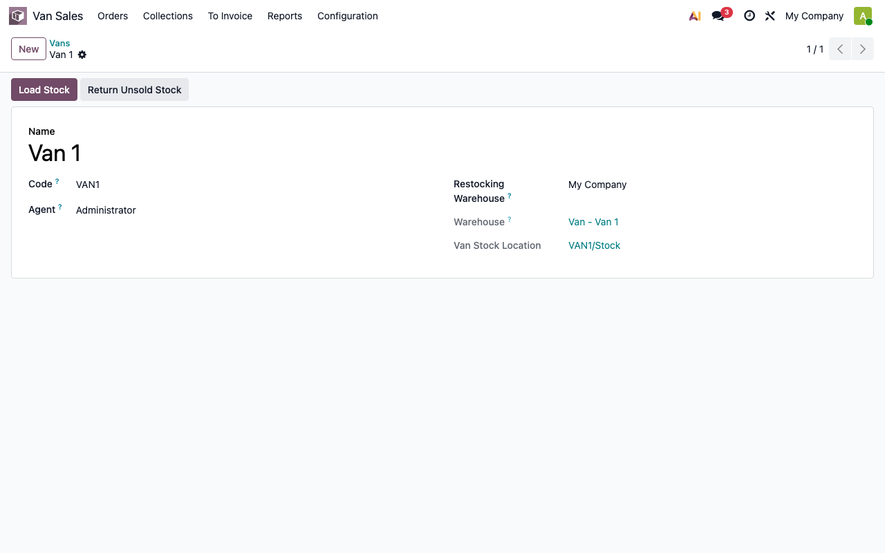
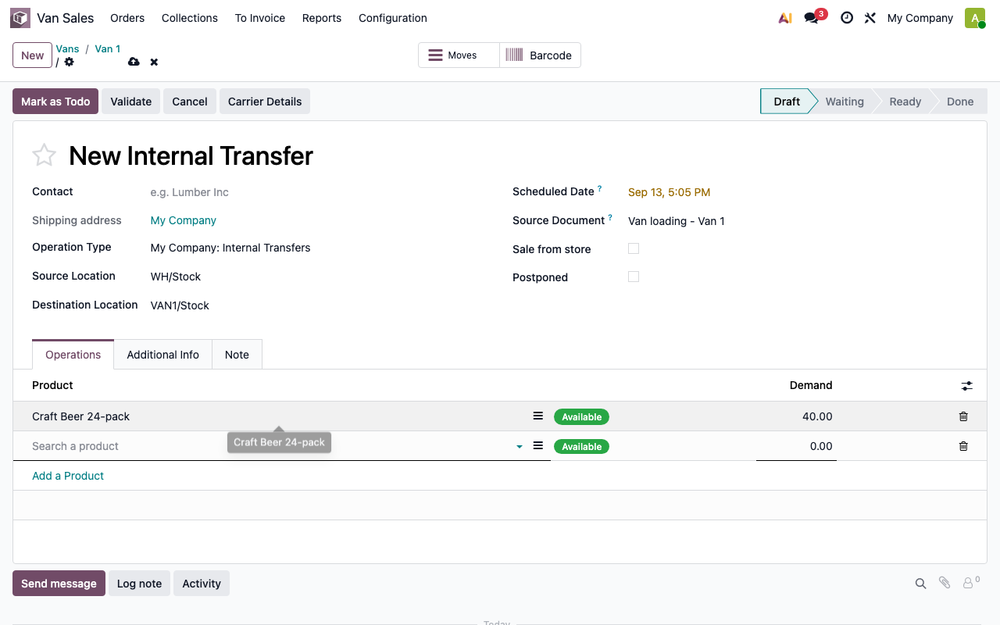
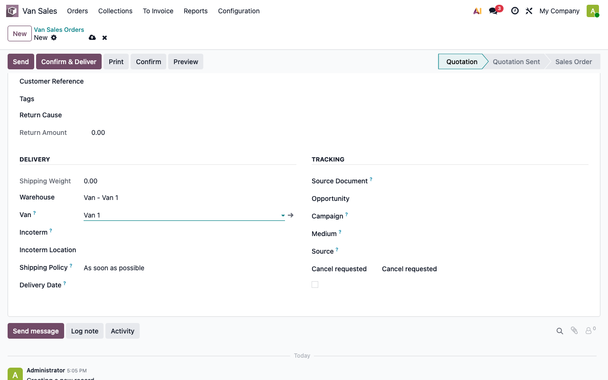
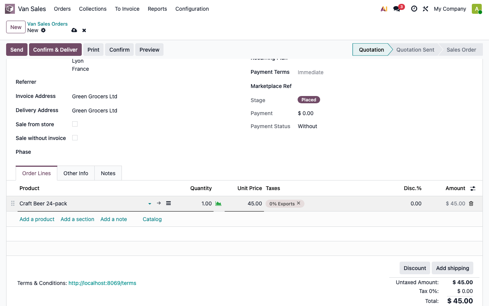
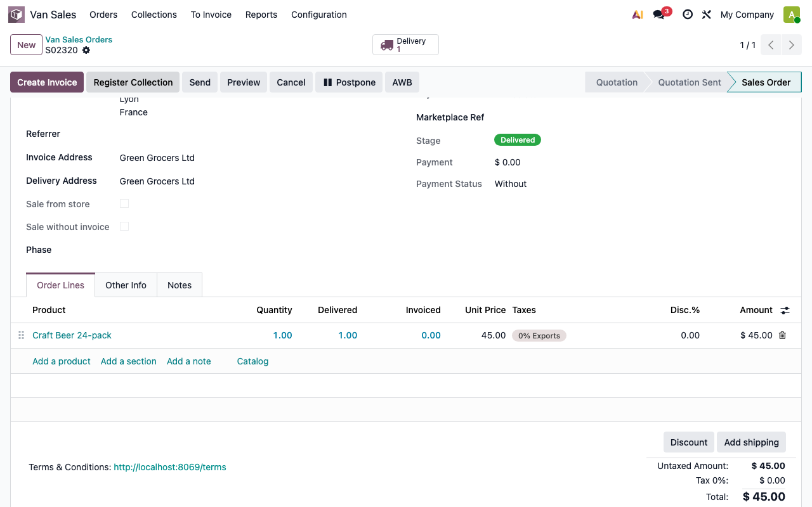
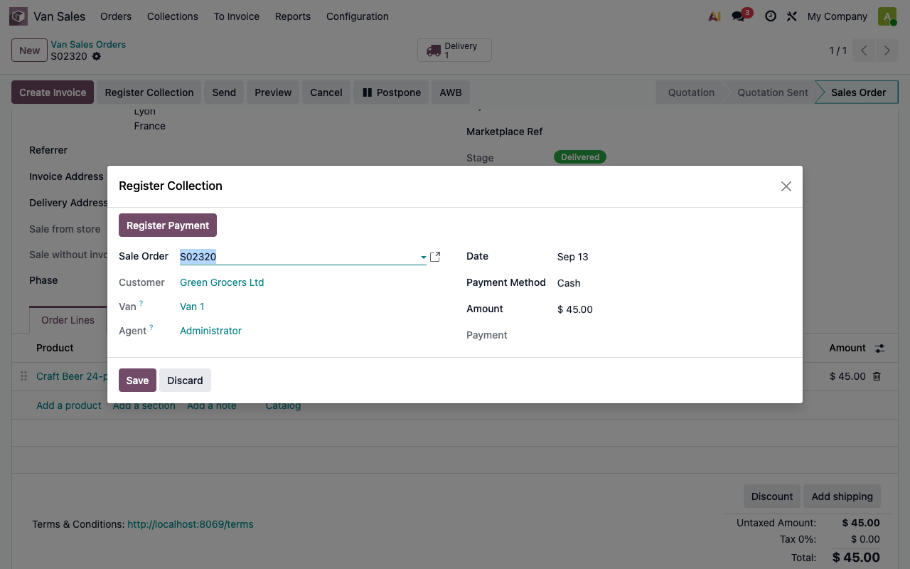
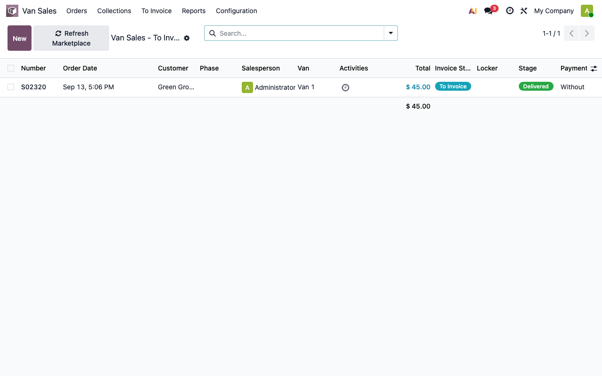
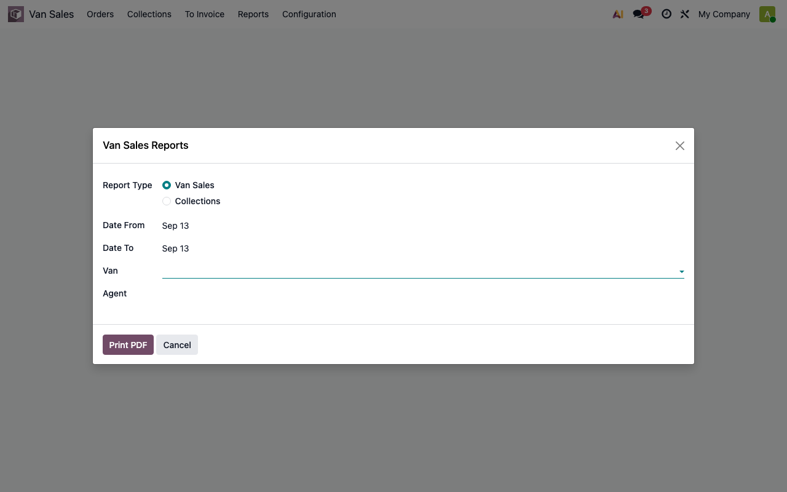

# Fișă Modul: Van Sales — vânzare mobilă din stocul dubei

**Modul:** `deltatech_van_sales`
**Utilizator principal:** Agent de vânzări pe teren (van-sales); contabil/office pentru facturarea în batch; manager comercial pentru configurare și reconciliere
**Prioritate:** 🟡 Medie (MVP nou, orientat pe distribuitori mici-mediu, alternativă mai simplă la un SFA complet gen HERMES/Transart)

---

## 1. Scop business

Modulul transformă orice depozit Odoo într-o flotă de dube: un agent încarcă marfă dimineața,
confirmă și livrează comenzi pe teren dintr-un singur click, încasează cash sau card pe loc, iar
seara returnează stocul nevândut. Facturarea propriu-zisă **nu** se face pe teren — rămâne un pas
deliberat de birou, făcut în batch, mai târziu, reconciliat automat cu încasările deja înregistrate.

Este un MVP asumat ca atare: nu concurează cu un SFA complet (rute/vizite planificate, GPS,
recunoaștere AI a rafturilor, promoții FMCG complexe) — acoperă doar nucleul operațional: livrare
instantă din stocul dubei + încasare pe loc + facturare centralizată. Vezi
`odoo-addons/l10n_ro_ent/readme/comparatii/COMPARE_TRANSART.md` pentru poziționarea față de HERMES
SFA (Transart), cel mai apropiat concurent de piață pe zona de distribuție.

## 2. Context de business

- **Fiecare dubă = propriul depozit Odoo** (`stock.warehouse`, tip livrare "ship-only"), creat
  automat la salvarea unei dube — reutilizează integral motorul nativ de stoc/rute/facturare din
  livrare, fără nicio logică de stoc scrisă manual.
- **Facturare separată de livrare**: livrarea golește fizic stocul dubei imediat; factura se emite
  mult mai târziu, la birou, în masă. Aceasta e o decizie deliberată de scop (nu o limitare tehnică)
  — diferă de Transart HERMES, care facturează instant pe teren.
- **Încasarea precede factura**: banii/cardul se încasează la livrare, înainte să existe vreo
  factură — se înregistrează ca o plată standard `account.payment`, neconciliată, care se
  potrivește automat cu factura de mai târziu prin reconcilierea contabilă standard Odoo.

## 3. Utilizatori și roluri

- **Agent de vânzări (Van Sales / Agent)** — vede și gestionează doar propria dubă, comenzile și
  încasările legate de ea (regulă pe `agent_id = user.id`). Implică grupul standard
  `sales_team.group_sale_salesman`.
- **Manager (Van Sales / Manager)** — vede toate dubele, toate comenzile/încasările; singurul care
  vede meniurile **Configurare > Dube** și **De facturat** (facturarea în batch, de birou).

Grupurile se acordă din **Setări → Utilizatori**. Pentru testare, folosiți cel puțin un utilizator
Agent (fără drept de Manager) ca să verificați izolarea pe dubă.

## 4. Date și obiecte implicate

- **`van.sales.van`** — dubă: nume, cod (reutilizat ca și cod de warehouse), agent, depozitul de
  restocare (`source_warehouse_id`), warehouse-ul și locația de stoc create automat.
- **`sale.order.van_id`** — câmpul nou de pe comandă; când e setat, comanda folosește warehouse-ul
  dubei și politica de livrare "cât mai curând posibil".
- **`van.sales.collection`** — încasare: comandă, dubă/agent (derivate), sumă, metodă de plată
  (cash/card), plata (`account.payment`) creată la apăsarea butonului.
- **Jurnale contabile**: încasarea caută automat primul jurnal de tip `cash` (pentru metoda Cash)
  sau `bank` (pentru Card) al companiei — trebuie să existe cel puțin un jurnal de fiecare tip
  folosit, altfel apare eroare explicită (vezi secțiunea 9).

Date minime pentru demo: o companie cu cel puțin un depozit principal, un produs cu stoc, un
partener client, un agent, o dubă configurată și încărcată cu stoc.

## 5. Configurare inițială

1. **Creați dube**: `Van Sales → Configuration → Vans → New`. Completați Nume, Cod, Agent,
   Depozitul de restocare. La salvare se creează automat warehouse-ul și locația proprii dubei.



2. **Încărcați stocul** din butonul **Load Stock** de pe dubă — se deschide un transfer intern
   precompletat (sursă = depozitul de restocare, destinație = locația dubei); adăugați produsele și
   cantitățile și validați ca orice transfer standard.



## 6. Flux de utilizare

**Pas 1 — agentul creează comanda și setează dubă**

Pe o comandă de vânzare nouă, agentul completează clientul și setează câmpul **Van**. Warehouse-ul
comenzii și politica de livrare se completează automat, iar butonul **Confirm & Deliver** apare în
antet.



Adaugă produsul/produsele dorite pe linia comenzii, ca pe orice comandă de vânzare standard.



**Pas 2 — confirmare și livrare instant**

La click pe **Confirm & Deliver**, comanda se confirmă și livrarea generată se validează imediat
din stocul dubei — fără factură. Comanda arată cantitatea livrată, fără nimic facturat încă.



**Pas 3 — încasare pe loc**

Butonul **Register Collection** deschide un dialog precompletat cu suma comenzii, dubă și agent;
alegeți metoda (Cash/Card) și apăsați **Register Payment** — se creează și postează o plată
standard, neconciliată încă.



**Pas 4 — retur stoc nevândut (seara)**

Butonul **Return Unsold Stock** de pe dubă creează un transfer invers, precompletat automat din
stocul curent (cantitățile reale rămase în locația dubei).

**Pas 5 — facturare în masă, la birou**

Meniul **Van Sales → To Invoice** (doar Manager) listează toate comenzile de tip van livrate și
nefacturate încă. Se facturează în masă, ca de obicei din Vânzări.



Reconcilierea facturii cu încasarea deja înregistrată se face prin fluxul standard de contabilitate
Odoo (nu e cod custom) — de obicei automat, dacă jurnalul/contul sunt corect configurate.

**Rapoarte**

Meniul **Van Sales → Reports** deschide un wizard cu două rapoarte PDF: **Van Sales** (comenzi pe
dubă, cu totaluri) și **Collections** (încasări pe agent, grupate pe metodă de plată).



## 7. Legături cu alte module

- **`sale_stock`** — livrarea și legătura comandă↔transfer sunt 100% native, fără suprascriere.
- **`account`** — încasarea creează un `account.payment` standard; reconcilierea cu factura e
  fluxul contabil obișnuit, nimic specific modulului.
- **`barcodes` / `deltatech_barcode_sale`** — dependință directă: scanarea de coduri de bare pe
  formularul de comandă (widget `barcode_handler`) e moștenită, nu reimplementată.
- **`deltatech_invoice_picking_automatically`** (alt modul, neinstalat implicit) — dacă e instalat
  și activat pe tipul de operațiune al dubei, ar factura automat la livrare, ceea ce **contrazice**
  decizia de scop a acestui MVP (facturare batch, nu instant) — nu se combină pe același tip de
  livrare.

## 8. Verificări pentru consultant

- [ ] Modulul se instalează fără erori pe o bază cu `sale_stock`, `account`, `barcodes` deja
      prezente.
- [ ] La crearea unei dube, se creează automat un `stock.warehouse` cu același cod și o locație de
      stoc — vizibile pe formularul dubei.
- [ ] Un utilizator Agent vede doar propria dubă și comenzile/încasările legate de ea; un utilizator
      Manager vede toate.
- [ ] Setarea câmpului **Van** pe o comandă completează automat warehouse-ul și politica de livrare.
- [ ] **Confirm & Deliver** confirmă comanda și validează livrarea într-un singur pas, fără să
      genereze vreo factură.
- [ ] Stocul din locația dubei scade exact cu cantitatea livrată (verificabil în Inventar).
- [ ] **Register Collection** creează un `account.payment` postat, neconciliat cu nicio factură.
- [ ] **Return Unsold Stock** fără stoc pe hand în dubă dă eroare explicită, nu creează un transfer
      gol.
- [ ] Meniul **To Invoice** arată doar comenzile cu `van_id` setat și `invoice_status = to invoice`.
- [ ] După facturarea de birou, reconcilierea automată/manuală leagă factura de plata deja
      înregistrată.
- [ ] Rapoartele PDF (Van Sales, Collections) se generează fără erori pentru un interval cu date.

## 9. Mesaje de eroare frecvente

| Mesaj / simptom | Cauză probabilă | Remediere |
|-----------------|-----------------|-----------|
| „The restocking warehouse … has no internal transfer operation type configured." | Depozitul de restocare al dubei nu are un tip de operațiune „Transfer intern" configurat | Configurați tipul de operațiune internă pe warehouse-ul respectiv (Inventar → Configurare → Tipuri de operațiuni) |
| „There is no stock on hand in the van … to return." | S-a apăsat **Return Unsold Stock** cu locația dubei goală | Normal dacă tot stocul a fost deja vândut/returnat — nu e o eroare de configurare |
| „This action is only available for van sales orders." | S-a încercat **Confirm & Deliver** pe o comandă fără câmpul **Van** setat | Setați dubă pe comandă înainte de confirmare |
| „The order … is already confirmed." | S-a apăsat **Confirm & Deliver** pe o comandă deja confirmată | Folosiți fluxul standard de livrare/facturare pentru pașii ulteriori |
| „No cash journal is configured for company …" / „No bank journal is configured…" | Compania nu are niciun jurnal de tip cash/bancă pentru metoda de plată aleasă la încasare | Configurați cel puțin un jurnal de tipul respectiv în Contabilitate |
| „A payment was already registered for this collection." | S-a apăsat a doua oară **Register Payment** pe aceeași încasare | Normal — o încasare produce o singură plată |

## 10. Capturi de ecran

Capturile (`readme/screenshots/`) au fost realizate manual, cu Playwright, pe o bază de test
(`test19`), în engleză (convenția `bitshop`), pe o dubă demo („Van 1") cu un produs de test
(„Craft Beer 24-pack") și un client demo („Green Grocers Ltd"):

1. `01_van_form.png` — formularul dubei, cu butoanele Load Stock / Return Unsold Stock.
2. `02_load_stock_transfer.png` — transferul intern precompletat de Load Stock.
3. `03_sale_order_van_field.png` — câmpul Van pe comandă (tab Other Info), warehouse și politică
   de livrare completate automat.
4. `04_sale_order_van_draft.png` — comanda cu linie de produs adăugată, înainte de confirmare.
5. `05_sale_order_confirmed.png` — comanda confirmată și livrată.
6. `06_register_collection.png` — dialogul de înregistrare a încasării.
7. `07_collections_list.png` — lista de încasări, grupată pe agent.
8. `08_to_invoice_list.png` — lista „De facturat" pentru birou.
9. `09_reports_wizard.png` — wizard-ul celor două rapoarte PDF.

Regenerare (manual, nu există încă un test automat de capturi pentru acest modul):

```bash
./odoo/odoo-bin -c odoo.conf -d test19 -i deltatech_van_sales --stop-after-init
./odoo/odoo-bin -c odoo.conf -d test19 --log-level=warn &
# apoi rulați un script Playwright care navighează fluxul de mai sus și salvează
# capturile în readme/screenshots/ (vezi istoricul acestei fișe pentru scriptul folosit)
```

## 11. Observații pentru manual

Insistați pe distincția livrare-vs-facturare: agentul NU vede niciun buton de facturare pe teren —
factura e strict un pas de birou, mai târziu. Explicați clar de ce (simplitate operațională, control
contabil centralizat), nu ca pe o limitare accidentală. Menționați diferența față de Transart HERMES
(care facturează instant pe teren) ca pe o alegere de scop MVP, nu ca pe un gap de acoperit automat
în viitor — orice cerere de facturare instantă pe teren e o schimbare de arhitectură, nu o
configurare. Subliniați că fiecare dubă e literalmente un depozit Odoo — utile de știut la
depanare (ex. rapoarte de stoc, valorizare) pentru că se comportă identic cu orice alt warehouse.
