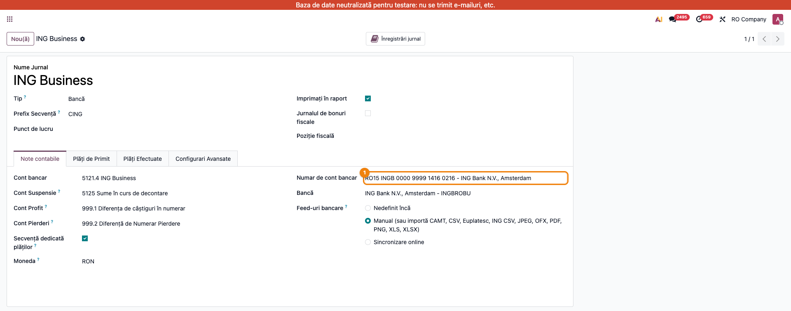
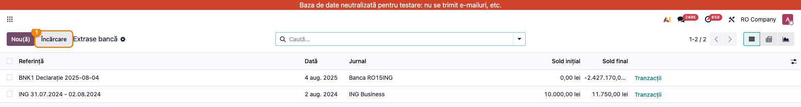
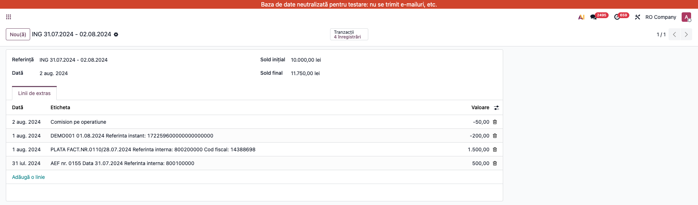

# Fișă Modul: Import extras ING Business (CSV „Istoric conturi")

**Modul:** `l10n_ro_account_bank_statement_import_ing_csv`
**Utilizator principal:** Contabil bancă/trezorerie
**Prioritate:** 🟡 Medie (zilnic/săptămânal la companiile cu cont ING Business)

---

## 1. Scop business

Companiile cu cont la **ING Bank România** pot exporta din ING Business istoricul de cont în
format CSV („Istoric conturi"). Fără acest modul, fișierul trebuia prelucrat manual și mapat
coloană cu coloană în asistentul de import. Modulul importă **fișierul original, exact cum e
exportat din ING Business**, direct ca extras de cont: sume în format românesc, solduri
calculate automat, numele contrapartidei, IBAN-ul și **CUI-ul contrapartidei** preluate pe
fiecare linie — date care pregătesc identificarea automată a partenerului la reconciliere.

## 2. Bază legală și context

Nu există un temei legal specific — este fluxul operațional standard de **preluare a extrasului
de cont bancar** în contabilitate (jurnal de bancă, cont 5121, conform OMFP 1802/2014).
Alternativa fără dezvoltare este exportul MT940 din ING Business (modulul OCA
`l10n_ro_account_bank_statement_import_mt940_ing`); CSV-ul are însă date mai bogate
(CUI contrapartidă, sold intermediar per linie).

## 3. Utilizatori și roluri

Contabil de bancă/trezorerie care preia extrasele din ING Business.

Roluri recomandate pentru testare:
- Administrator funcțional: instalează modulul și verifică jurnalul de bancă
- Utilizator operațional: exportă CSV-ul din ING Business și îl încarcă în Odoo
- Contabil/manager: reconciliază încasările/plățile și verifică soldurile

## 4. Conturi și date implicate

- **5121 Conturi la bănci în lei** — contul jurnalului de bancă ING;
- **4111 Clienți / 401 Furnizori** — se închid la reconcilierea încasărilor/plăților;
- **627 Cheltuieli cu serviciile bancare** — comisioanele ING (linii separate în extras);
- **581 Viramente interne** — transferuri între conturi proprii / borderouri curier.

Date minime pentru demo:
- companie românească cu localizarea contabilă instalată;
- un jurnal de tip **Bancă** în RON, cu IBAN-ul contului ING (sau fără — se setează la primul import);
- un fișier CSV „Istoric conturi" exportat din ING Business (mostră reală sau sintetică).

## 5. Configurare inițială

1. Instalați modulul `l10n_ro_account_bank_statement_import_ing_csv` pe baza demo.
2. Verificați jurnalul de bancă în **Contabilitate → Configurare → Jurnale**: tip *Bancă*,
   moneda RON. Dacă jurnalul are deja un cont bancar, IBAN-ul trebuie să fie cel din fișier;
   dacă nu are, se setează automat la primul import.
3. Verificați că utilizatorul de test are drepturi de contabilitate.

## 6. Flux de utilizare

### Pasul 1 — Exportul din ING Business și verificarea jurnalului

Exportați din ING Business istoricul contului în format **CSV** („Istoric conturi"). În Odoo,
verificați jurnalul de bancă ING în **Contabilitate → Configurare → Jurnale** — numărul de cont
al jurnalului trebuie să corespundă IBAN-ului din fișier (validare automată la import).



### Pasul 2 — Încărcarea fișierului original

Din **Contabilitate → Tablou de bord**, pe cardul jurnalului ING, deschideți meniul **⋮**
și alegeți **Extrase** (secțiunea *Vizualizare*) — se deschide lista **Extrase bancă**.
Apăsați butonul **Încărcare** și alegeți CSV-ul exportat — **nemodificat**. Modulul
recunoaște fișierul după antetul ING (`numar cont;data procesarii;...`); nu se mai deschide
asistentul de mapare.

> Alternativ, același import se poate porni din meniul **⋮** al cardului, linkul
> **Importă fișier** (secțiunea *Nou*), sau trăgând fișierul peste lista de tranzacții.



### Pasul 3 — Verificarea extrasului importat

După import se creează extrasul **ING <data de la> - <data până la>**, cu tranzacțiile în
ordine cronologică.

1. **Găsiți pe ecran**: fiecare linie are eticheta = detaliile tranzacției din fișier (sau
   tipul tranzacției la comisioane); soldul inițial și cel final ale extrasului sunt calculate
   din coloana „sold intermediar" a fișierului. Numele contrapartidei și IBAN-ul acesteia sunt
   preluate pe linie (nu apar în lista simplă de mai sus) și devin vizibile în widgetul de
   reconciliere bancară, la deschiderea liniei.
2. **Verificați**: soldul final al extrasului corespunde soldului din ING Business la data
   exportului; numărul de linii corespunde fișierului; încasările sunt pozitive, plățile și
   comisioanele negative.
3. **Treceți mai departe**: reconciliați liniile cu facturile (widgetul bancar propune
   automat potriviri; CUI-ul contrapartidei de pe linie va alimenta identificarea automată a
   partenerului în faza următoare), comisioanele pe **627**, transferurile proprii pe **581**.



### Note de monografie și raportare

La reconcilierea extrasului ING:

- încasare de la client: **Dr 5121 Bancă = Cr 4111 Clienți**;
- plată către furnizor: **Dr 401 Furnizori = Cr 5121 Bancă**;
- comision bancar: **Dr 627 Cheltuieli servicii bancare = Cr 5121 Bancă**
  (fără TVA — serviciu financiar scutit, art. 292 alin. (2) lit. a) Cod Fiscal);
- transfer între conturi proprii / încasare borderou curier: prin **581 Viramente interne**.

Modulul **nu postează** note contabile singur — creează liniile de extras; notele rezultă din
reconcilierea standard Odoo. Soldul extrasului (inițial/final) permite verificarea
completitudinii înainte de reconciliere.

> Protecție la duplicate: id-ul unic de import provine din „Referinta interna/instant" ING
> (fallback determinist pentru linii fără referință, ex. comisioane); reimportul aceluiași
> fișier este detectat și refuzat.

## 7. Legături cu alte module / declarații

| Modul / proces | Rol în flux | Tip legătură |
|---|---|---|
| `account_bank_statement_import` (Enterprise) | mecanismul standard de import extrase | dependență (manifest) |
| `account_bank_statement_import_csv` (Enterprise) | interceptorul de wizard peste care modulul are prioritate | dependență (manifest) |
| `l10n_ro` | localizarea RO (plan de conturi, companie RO) | dependență (manifest) |
| `l10n_ro_account_bank_statement_import_mt940_ing` (OCA) | alternativa MT940 pentru același cont | alternativă |
| `deltatech_account_bank_statement_import_gls` / `..._euplatesc` | borderourile curier/procesator ale căror transferuri sosesc în ING | complementar (opțional) |

Ce este automat: detecția fișierului, decodarea (BOM, `;`, sume românești), ordinea cronologică,
soldurile extrasului, validarea IBAN↔jurnal, preluarea numelui/IBAN-ului/CUI-ului contrapartidei,
protecția la duplicate.
Ce rămâne manual: reconcilierea liniilor (asistată de widgetul bancar și regulile de
reconciliere); identificarea automată a partenerului după CUI vine în faza următoare.

## 8. Verificări pentru consultant

- [ ] Modulul se instalează fără erori pe baza demo.
- [ ] Un CSV „Istoric conturi" original se importă fără nicio prelucrare manuală.
- [ ] La jurnal fără cont bancar, IBAN-ul din fișier se setează automat la primul import.
- [ ] La jurnal cu alt IBAN decât al fișierului, importul este refuzat cu mesaj clar.
- [ ] Extrasul are tranzacțiile în ordine cronologică și soldurile inițial/final corecte.
- [ ] Liniile au numele contrapartidei și IBAN-ul; comisioanele au eticheta tipului de tranzacție.
- [ ] Reimportul aceluiași fișier este refuzat (mesaj standard Odoo, în engleză:
      „You already have imported that file.").
- [ ] Un CSV care nu e format ING urmează fluxul vechi (asistentul de mapare), neschimbat.

## 9. Mesaje de eroare frecvente

| Mesaj / simptom | Cauză probabilă | Remediere |
|-----------------|-----------------|-----------|
| „The account of this statement (...) is not the same as the journal (...)" | Fișierul aparține altui cont decât cel al jurnalului | Importați pe jurnalul contului corect (un jurnal per IBAN) |
| „The ING CSV file does not contain any transaction." | Export gol (perioadă fără mișcări) sau fișier trunchiat | Verificați perioada exportului în ING Business |
| „You already have imported that file." | Extrasul a fost deja importat (referințe ING unice) | Nu e o eroare — liniile există deja; exportați doar perioada nouă |
| „You can't create a new statement line without a suspense account..." | Jurnalul nu are cont tranzitoriu (suspense) configurat | Setați contul tranzitoriu pe jurnal (Contabilitate → Configurare → Jurnale) |
| Fișierul deschide asistentul de mapare în loc de import direct | Antetul nu e cel din ING Business (alt export/altă bancă) | Folosiți exportul „Istoric conturi" (CSV) din ING Business |
| Soldul final diferă de ING Business | Export parțial (filtru de dată) sau tranzacții în altă monedă | Exportați întreaga perioadă lipsă, pe contul în RON |

## 10. Capturi de ecran

Capturile (`readme/screenshots/`) sunt **generate automat** din `tests/test_screenshots.py`
(mixinul `ScreenshotCase` din `l10n_ro_doc_screenshots`, import defensiv), în **limba română**,
pe compania „RO Company" în RON (`prepare_ro_company`):

1. `01_jurnal_banca.png` — jurnalul de bancă ING cu contul bancar setat.
2. `02_incarcare_extras.png` — lista Extrase bancă, cu butonul „Încărcare" evidențiat.
3. `03_extras_importat.png` — extrasul importat: solduri + tranzacții cu contrapartide.

Regenerare:

```bash
./odoo/odoo-bin -c odoo.conf -d <db> -i l10n_ro_account_bank_statement_import_ing_csv,l10n_ro_doc_screenshots \
    --test-tags=fise_screenshots --stop-after-init
```

## 11. Observații pentru manual

Păstrați accentul pe promisiunea fluxului: **CSV-ul din ING Business se încarcă exact cum e
exportat**. Subliniați verificarea soldului final față de ING Business înainte de reconciliere
și mențiunea că CUI-ul contrapartidei este deja preluat pe linie (fundația identificării
automate a partenerului).
