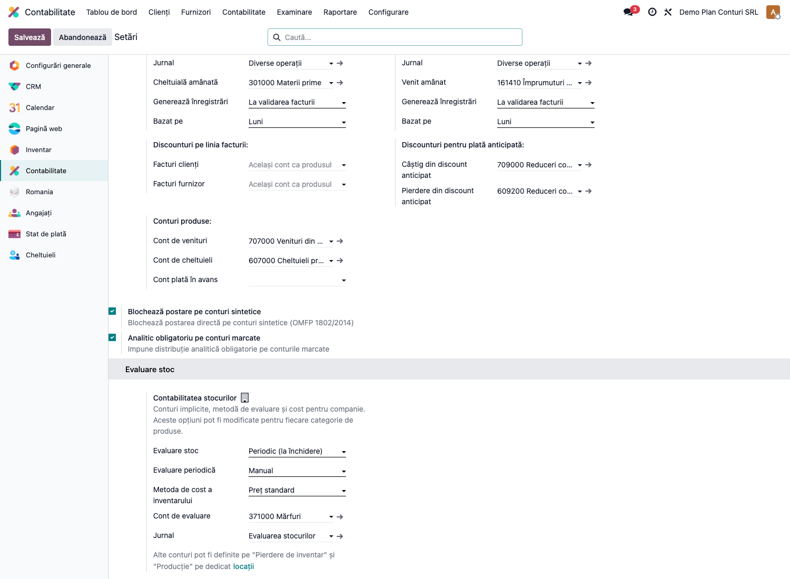
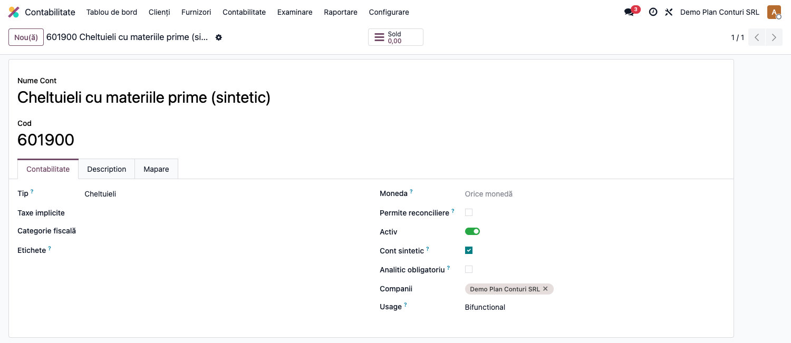
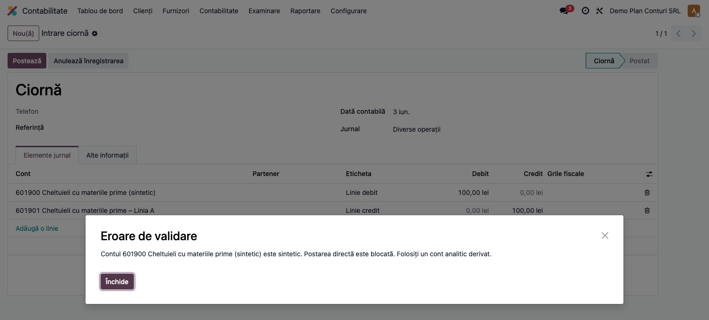
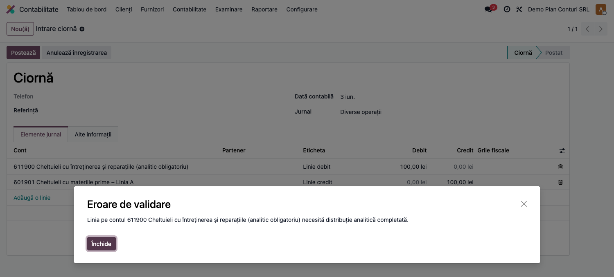
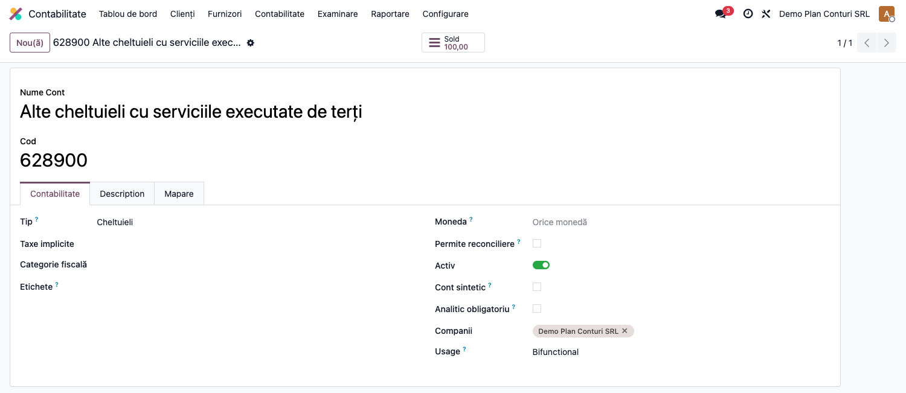

# Fișă Modul: Plan de Conturi Extins (controale sintetic / analitic / inactivare)

**Poziție plan:** FR-01
**Modul:** `l10n_ro_account_chart`
**FR:** FR-01
**Capitol manual:** Cap 2.3 — Administrarea planului de conturi
**Utilizator principal:** Contabil șef, Administrator financiar
**Prioritate:** 🔴 Ridicată (afectează postarea oricărei note contabile)

---

## 1. Scop business

Modulul completează localizarea contabilă RO cu trei controale operaționale peste
planul de conturi OMFP 1802/2014, ca să prevină erorile de lucru care duc la balanțe
greu de închis sau la raportări interne incorecte:

- **blochează postarea directă** pe conturile marcate ca sintetice (obligă folosirea
  unui cont analitic derivat);
- **cere distribuție analitică** pe conturile unde compania impune urmărire pe centre
  de cost;
- **blochează inactivarea/deprecarea** conturilor care au deja rulaj contabil.

Primele două controale se activează opt-in, per companie, din setările contabile;
al treilea este aplicat automat pentru orice companie cu țara fiscală România.

---

## 2. Bază legală și context

Planul de conturi se administrează conform **OMFP 1802/2014** (reglementările
contabile privind situațiile financiare anuale) și **Legii contabilității 82/1991**.
În practică, companiile folosesc conturi sintetice pentru structură și conturi
analitice pentru înregistrările operative.

Odoo standard permite postarea pe orice cont activ și nu impune analitic. Modulul
adaugă regulile de control specifice practicii românești, cu activare per companie.

> Implementarea face parte din suita RO destinată Odoo **Enterprise**.

---

## 3. Utilizatori și roluri

| Rol | Responsabilitate |
|-----|------------------|
| Contabil șef | Decide ce conturi sunt sintetice și unde analiticul este obligatoriu |
| Contabil | Lucrează în note contabile și primește mesajele de validare la postare |
| Administrator financiar | Activează opțiunile în setările contabile |

Roluri recomandate pentru testare:
- Administrator funcțional: instalează modulul și verifică opțiunile din Setări;
- Utilizator operațional (contabil): postează note și verifică blocajele;
- Contabil/manager: validează că regulile respectă politica internă de conturi.

---

## 4. Conturi și date implicate

Modulul nu introduce conturi noi; lucrează peste planul de conturi RO existent.
Conturile relevante pentru demonstrație (denumiri conform OMFP 1802/2014):

- **601900 / 601901** — un cont sintetic (601900, „Cheltuieli cu materiile prime") și
  un cont analitic pe același segment (601901), pentru testarea blocajului de postare
  pe sintetic;
- **611900** — cont de cheltuieli („Cheltuieli cu întreținerea și reparațiile") marcat
  cu „Analitic obligatoriu";
- **401** — cont de tip datorie/furnizor: deși poate fi sintetic, rămâne **permis**
  la postare (excepția pentru conturile de creanță/datorie reconciliabile).

Câmpuri adăugate pe formularul de cont (`account.account`):

| Câmp | Rol |
|------|-----|
| Cont sintetic | Marchează contul ca grupare; blochează postarea directă (detaliu în tooltip) |
| Analitic obligatoriu | Impune distribuție analitică pe liniile postate pe acest cont |

Date minime pentru demo:
- companie cu țara fiscală **România** și plan de conturi RO instalat;
- un jurnal de tip „Operațiuni diverse" (general) deschis;
- cel puțin un plan și un cont analitic, pentru testul cu analitic obligatoriu.

---

## 5. Configurare inițială

1. Instalați modulul `l10n_ro_account_chart` pe baza demo (companie RO).
2. La instalare, hook-ul de inițializare marchează automat ca **sintetice** conturile
   din planul RO care au cel puțin un cont „copil" — un cont al cărui cod începe cu
   codul contului și este mai lung (ex: 601900 e marcat sintetic dacă există 601901).
   Marcarea se aplică **tuturor** companiilor cu țara fiscală RO existente la instalare,
   nu doar companiei curente.
3. **Contabilitate → Configurare → Setări** — activați opțiunile RO:

   | Opțiune | Efect |
   |---------|-------|
   | Blochează postare pe conturi sintetice | Respinge la postare liniile pe conturi marcate sintetic |
   | Analitic obligatoriu pe conturi marcate | Cere distribuție analitică la postare pe conturile marcate |

4. **Contabilitate → Configurare → Plan de conturi** — pe conturile dorite, bifați
   manual „Cont sintetic" și/sau „Analitic obligatoriu", acolo unde marcarea automată
   nu acoperă politica internă.
5. Verificați că utilizatorul de test are grupurile contabile necesare.

---

## 6. Flux de utilizare

### Pasul 1 — Activarea opțiunilor pe companie

Meniu: **Contabilitate → Configurare → Setări**. În secțiunea de conturi implicite
apar cele două opțiuni RO; activați-le pentru compania curentă și salvați.



### Pasul 2 — Marcarea conturilor

Meniu: **Contabilitate → Configurare → Plan de conturi**. Deschideți un cont și
verificați câmpurile „Cont sintetic" și „Analitic obligatoriu". Conturile sintetice
cu copii au fost deja marcate automat la instalare.



### Pasul 3 — Postare pe cont sintetic (blocată)

Meniu: **Contabilitate → Contabilitate → Operațiuni diverse**. Creați o notă cu o
linie pe un cont sintetic (ex: 601900) și încercați să o postați. Sistemul respinge
postarea și cere folosirea unui cont analitic derivat.

> Excepție: conturile de tip creanță/datorie reconciliabile (`asset_receivable` /
> `liability_payable`, ex: 411 clienți, 401 furnizori) rămân permise chiar dacă sunt
> sintetice, pentru compatibilitate cu fluxurile standard de facturi și plăți.



### Pasul 4 — Postare fără analitic (blocată)

Pe o notă cu o linie pe un cont marcat „Analitic obligatoriu" (ex: 611900), lăsați
distribuția analitică necompletată și încercați postarea. Sistemul cere completarea
analiticului înainte de a permite postarea.



### Pasul 5 — Inactivare cont cu rulaj (blocată)

Meniu: **Contabilitate → Configurare → Plan de conturi**. Deschideți un cont care are
deja înregistrări contabile și încercați să îl dezactivați (debifare „Activ"). Sistemul
blochează operațiunea, ca să păstreze istoricul contabil coerent.

> Acest blocaj se aplică **automat** oricărei companii cu țara fiscală RO; nu depinde
> de opțiunile opt-in din Setări.



### Note de monografie și raportare

Modulul **nu generează note contabile proprii** și nu modifică liniile existente.
El acționează ca un set de **validări la postare** (`@api.constrains` pe `account.move`)
și o validare la dezactivarea contului (`write` pe `account.account`):

- postare pe cont sintetic (non-creanță/datorie) cu opțiunea activă → **respinsă**;
- postare pe cont cu „Analitic obligatoriu" fără `analytic_distribution` → **respinsă**;
- dezactivarea unui cont RO cu linii contabile → **respinsă** (mereu, pentru companii RO);
- companiile non-RO nu sunt afectate de niciuna dintre reguli.

Efectul în raportări este indirect: prin disciplinarea postării (analitic complet,
fără postări pe sintetice) balanțele analitice și situațiile financiare rămân coerente.

---

## 7. Legături cu alte module / declarații

| Modul / proces | Rol în flux | Tip legătură |
|---|---|---|
| `account` | conturi, note contabile și validări la postare | dependență (manifest) |
| `l10n_ro` | planul de conturi românesc de bază (OMFP 1802) | dependență (manifest) |
| `l10n_ro_account_fisa_cont` | fișa de cont folosește conturile și analiticele disciplinate aici | integrare prin convenție (nu automată) |
| `l10n_ro_stock_sheet` / rapoarte financiare | beneficiază de structurarea corectă a conturilor | integrare prin convenție (nu automată) |

Ce este automat: marcarea inițială a conturilor sintetice la instalare și validarea
la postare/inactivare conform regulilor configurate.
Ce rămâne manual: decizia contabilului șef privind conturile sintetice și politica de
analitic obligatoriu, plus activarea opțiunilor în Setări.

> Manifestul depinde **doar** de `account` și `l10n_ro`. Modulele de rapoarte/fișă de
> cont nu sunt dependențe; legătura este conceptuală (folosesc același plan de conturi).

---

## 8. Verificări pentru consultant

- [ ] Modulul se instalează fără erori pe o companie RO și marchează automat conturile sintetice cu copii.
- [ ] Cele două opțiuni RO apar în **Contabilitate → Configurare → Setări** și se salvează per companie.
- [ ] Câmpurile „Cont sintetic" și „Analitic obligatoriu" apar pe formularul de cont.
- [ ] Postarea pe cont sintetic (cu opțiunea activă) este blocată; pe contul 401/411 rămâne permisă.
- [ ] Postarea fără analitic pe cont marcat este blocată; cu analitic completat trece.
- [ ] Dezactivarea unui cont cu rulaj este blocată, indiferent de opțiunile din Setări.
- [ ] O companie non-RO nu este afectată de niciuna dintre reguli.

---

## 9. Mesaje de eroare frecvente

| Mesaj / simptom | Cauză probabilă | Remediere |
|---|---|---|
| „Contul … este sintetic. Postarea directă este blocată. Folosiți un cont analitic derivat." | Linia notei folosește un cont marcat sintetic, iar opțiunea de blocare e activă | Mutați înregistrarea pe contul analitic derivat (ex: 601901) |
| „Linia pe contul … necesită distribuție analitică completată." | Contul are „Analitic obligatoriu", iar linia nu are `analytic_distribution` | Completați distribuția analitică pe linia contabilă |
| „Contul … are înregistrări contabile și nu poate fi inactivat." | Se încearcă dezactivarea unui cont RO cu rulaj | Păstrați contul activ; nu există ștergere de istoric contabil |
| Opțiunile RO nu apar în Setări | Modulul nu este instalat sau utilizatorul nu are drepturi contabile | Verificați instalarea și grupurile contabile |
| Blocajele nu se aplică deși opțiunile sunt active | Compania nu are țara fiscală setată pe România | Setați țara fiscală RO pe companie |

---

## 10. Capturi de ecran

Capturile (`readme/screenshots/`) sunt **generate automat** din
`tests/test_screenshots.py` (mixinul `ScreenshotCase` din `l10n_ro_doc_screenshots`,
import defensiv), în **limba română**, pe planul de conturi RO:

1. `01_setari_companie.png` — Setări contabilitate cu cele două opțiuni RO activate.
2. `02_formular_cont.png` — Formular cont cu câmpurile sintetic și analitic obligatoriu.
3. `03_eroare_sintetic.png` — Mesaj de eroare la postare pe cont sintetic.
4. `04_eroare_analitic.png` — Mesaj de eroare la lipsa distribuției analitice.
5. `05_blocaj_inactivare.png` — Formularul unui cont cu rulaj (Sold 100,00); la încercarea de dezactivare apare mesajul de blocaj (vezi secțiunea 9).

Regenerare:

```bash
./odoo/odoo-bin -c odoo.conf -d <db> -i l10n_ro_account_chart,l10n_ro_doc_screenshots \
    --test-tags=fise_screenshots --stop-after-init
```

---

## 11. Observații pentru manual

În manualul final, păstrați explicația orientată pe activitatea utilizatorului: ce
problemă rezolvă fiecare control (sintetic / analitic / inactivare), cine decide
politica de conturi, ce se activează din Setări și ce se aplică automat. Subliniați
distincția dintre cele două controale opt-in și blocajul de inactivare aplicat
automat pentru companiile RO, precum și excepția pentru conturile de creanță/datorie.

### Limitări cunoscute

- Modulul nu versionează formal istoricul planului de conturi.
- Marcarea „Analitic obligatoriu" se face per cont; un wizard de aplicare în masă pe
  clase de conturi rămâne o îmbunătățire utilă.
- Modelul complet de centre de cost / puncte de lucru este tratat separat (FR-21).
