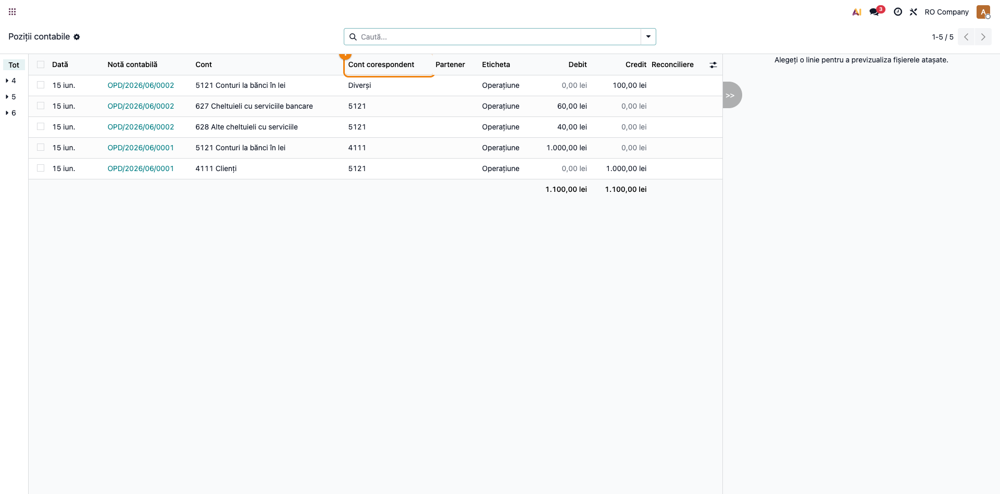
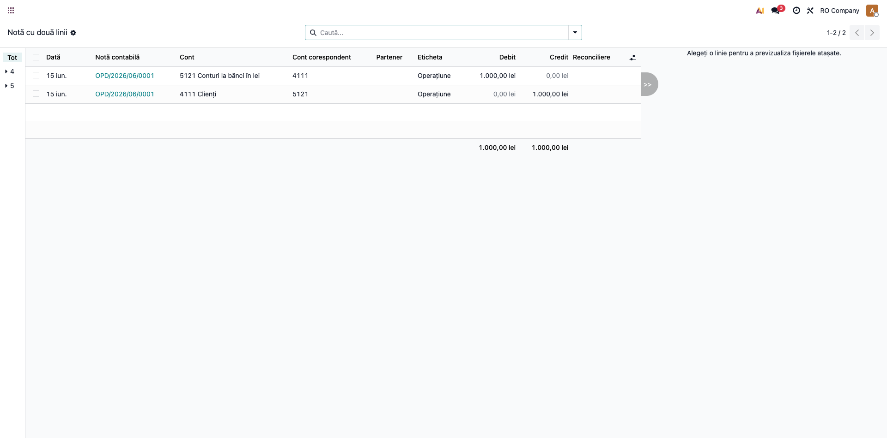
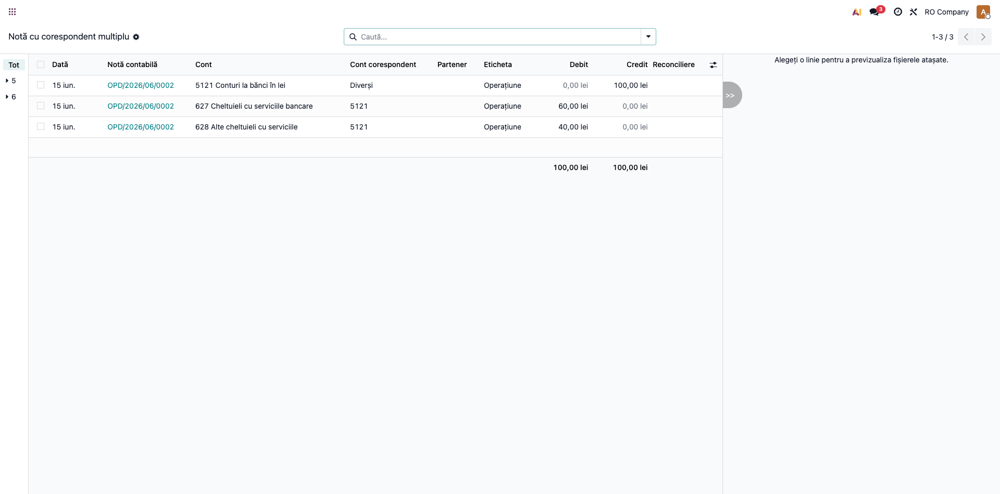

# Fișă Modul: Cont Corespondent pe Pozițiile Contabile

**Modul:** `l10n_ro_account_counterpart`
**Utilizator principal:** Contabil general, Contabil-șef (verificare monografie)
**Prioritate:** 🟡 Medie (suport pentru fișa de cont și registrul-jurnal, OMFP 1802)

---

## 1. Scop business

Modulul adaugă pe fiecare poziție contabilă (linie de notă) **contul corespondent** — contul de
pe partea opusă a articolului contabil. Este informația pe care un contabil român o caută instinctiv
când citește o fișă de cont sau Cartea Mare-Șah: „cu ce cont s-a făcut perechea". Modulul o calculează
și o stochează la nivel de linie, astfel încât poate fi folosită la grupare, filtrare și în rapoarte,
fără a mai deduce manual perechile debit-credit.

## 2. Bază legală și context

OMFP 1802/2014 — metoda de înregistrare „maestru-șah" și Cartea Mare-Șah (formularul A-14-1-22),
care cer afișarea contului corespondent pentru fiecare înregistrare. Modulul nu modifică note
contabile; doar derivă și expune contul corespondent.

## 3. Utilizatori și roluri

Contabil general (citește fișele de cont), Contabil-șef (verifică monografia).

Roluri recomandate pentru testare:
- Administrator funcțional: instalează modulul și verifică apariția coloanei.
- Contabil: deschide Pozițiile contabile și citește contul corespondent.

## 4. Conturi și date implicate

Nu există conturi „proprii" ale modulului — funcționează cu orice plan de conturi RO (OMFP 1802).
Pentru demonstrație sunt suficiente note contabile existente:
- o notă simplă cu două linii (ex. `Dr 5121 = Cr 4111`) → corespondentul fiecărei linii e contul celălalt;
- o notă cu mai multe conturi pe o parte (ex. o factură cu mai multe conturi de cheltuială) → linia
  comună afișează eticheta **„Diverși"**.

## 5. Configurare inițială

1. Instalați modulul `l10n_ro_account_counterpart` pe baza demo (companie cu plan de conturi RO).
2. Nu necesită nicio configurare — câmpurile se calculează automat la postarea/modificarea notelor.
3. Asigurați-vă că utilizatorul de test are acces la Contabilitate (grupul „Contabil").
4. Aveți câteva note contabile postate în perioada de test.

## 6. Flux de utilizare

> **Capturi:** capturile din această secțiune se generează automat cu skill-ul `fisa-screenshots`
> (test Playwright pe planul RO). Numele fișierelor sunt stabilite mai jos și în secțiunea 10; până
> la rularea generării, ele nu există încă în `readme/screenshots/`.

### Pasul 1 — Deschiderea Pozițiilor contabile

Accesați **Contabilitate → Contabilitate → Poziții contabile** (Journal Items). În lista de poziții
apare coloana **Cont corespondent**, lângă contul liniei.



### Pasul 2 — Citirea contului corespondent pe o notă cu două linii

Deschideți (sau filtrați) o notă contabilă simplă cu două linii. Pe linia de debit, coloana
**Cont corespondent** arată codul contului de credit, și invers. Astfel verificați rapid perechea
monografiei direct din listă, fără a deschide nota.



### Pasul 3 — Cazul „Diverși" (mai multe conturi pe partea opusă)

Pe o notă unde o linie are mai multe conturi corespondente (ex. o linie de bancă față de mai multe
conturi de cheltuială), coloana afișează eticheta **„Diverși"** în loc de un cod unic — semnal că
înregistrarea are corespondență „unul-la-mai-mulți".



### Note de monografie și raportare

Modulul **nu generează note contabile** — este pur informativ. Pentru o notă `Dr 5121 = Cr 4111`:
- linia 5121 (debit) → cont corespondent **4111**;
- linia 4111 (credit) → cont corespondent **5121**.

Câmpurile sunt stocate (`l10n_ro_counterpart_account_id` — contul unic; `l10n_ro_counterpart_code` —
codul sau „Diverși") și se recalculează automat la modificarea liniilor notei. Sunt complementare
coloanei „Cont Corespondent" afișată dinamic în Cartea Mare (`l10n_ro_journal_reports`).

## 7. Legături cu alte module / declarații

| Modul | Rol |
|---|---|
| `l10n_ro_journal_reports` | Afișează contul corespondent ca o coloană în Cartea Mare (la nivel de raport); acest modul îl persistă pe linie. |
| `account` (nativ) | Sursa pozițiilor contabile pe care se calculează corespondentul. |

**Ce e automat:** calculul și actualizarea contului corespondent pe fiecare linie.
**Ce rămâne manual:** nimic — nu necesită intervenție.

## 8. Verificări pentru consultant

- [ ] După instalare, coloana **Cont corespondent** apare în Poziții contabile (Journal Items).
- [ ] Pe o notă cu două linii, fiecare linie afișează codul contului celeilalte linii.
- [ ] Pe o linie cu mai multe conturi corespondente, se afișează **„Diverși"**.
- [ ] O linie de secțiune/notă (fără debit și fără credit) nu are cont corespondent.
- [ ] Câmpul poate fi folosit la grupare/filtrare în lista de poziții contabile.

## 9. Mesaje de eroare frecvente

| Mesaj | Cauză | Remediere |
|---|---|---|
| (Coloana nu apare) | Coloana opțională e ascunsă din selectorul de coloane | Activați „Cont corespondent" din meniul de coloane opționale al listei |
| Corespondent gol pe o linie cu sumă | Nota are o structură neobișnuită (o singură linie, sau linii fără pereche debit/credit) | Verificați echilibrul și structura notei contabile |

## 10. Capturi de ecran

Capturile se **generează automat** din `tests/test_screenshots.py` (mixinul `ScreenshotCase` din
`l10n_ro_doc_screenshots`), în RO, pe planul de conturi RO. La momentul redactării **nu există încă**
în `readme/screenshots/` — rulați skill-ul `fisa-screenshots` pentru a le produce. Lista planificată,
în ordinea fluxului din secțiunea 6:

1. `01_pozitii_corespondent.png` — lista Poziții contabile cu coloana Cont corespondent.
2. `02_corespondent_doua_linii.png` — notă cu două linii, corespondent reciproc.
3. `03_corespondent_diversi.png` — linie cu corespondent multiplu („Diverși").

Comandă de regenerare:
```bash
./odoo/odoo-bin -c odoo.conf -d test19 -u l10n_ro_account_counterpart \
  --test-tags=fise_screenshots --stop-after-init
```

## 11. Observații pentru manual

- Subliniați diferența față de `l10n_ro_journal_reports`: acolo corespondentul e o coloană în raport;
  aici e un câmp persistent pe linie, util la filtrare/grupare și în alte rapoarte.
- Explicați semnificația etichetei „Diverși" (corespondență unul-la-mai-mulți) — frecventă la note
  cu o linie de trezorerie/terț față de mai multe conturi de venit/cheltuială.
- Câmpul nu schimbă monografia; e doar un ajutor de citire/verificare.
