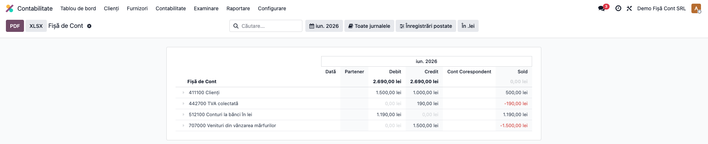
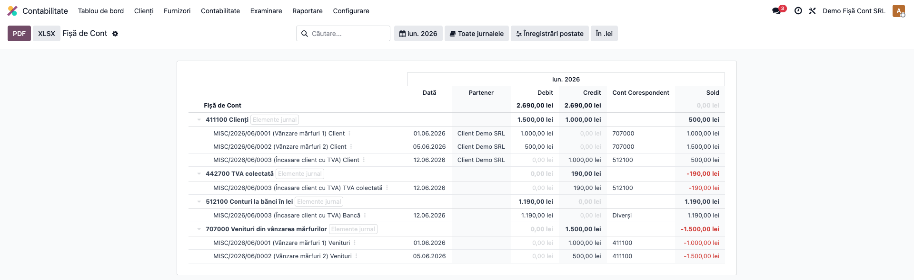
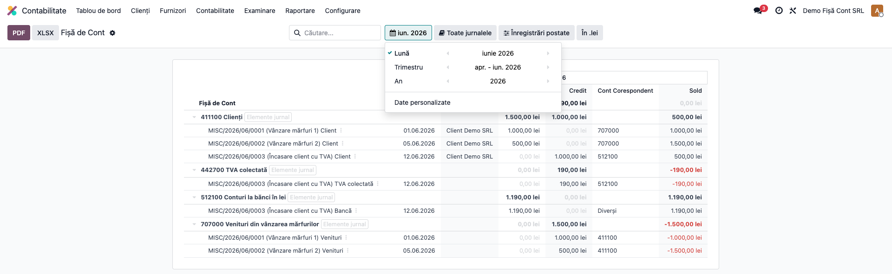

# Fișă Modul: Fișă de Cont

**Modul:** `l10n_ro_account_fisa_cont`
**Capitol manual:** Cap 2.1 — Fișă de Cont
**Utilizator principal:** Contabil
**Prioritate:** 🟢 Standard (raport obligatoriu lunar)

---

## 1. Scop business

**Fișa de Cont** (sau Fișa Contului) este un raport contabil obligatoriu conform
OMFP 1802/2014 care afișează pentru fiecare cont:
- Soldul inițial al perioadei
- Toate mișcările (debit/credit) cu **contul corespondent** pentru fiecare linie
- Soldul progresiv (running balance)
- Soldul final

Față de Grand Livre-ul standard Odoo, această fișă adaugă coloana **Cont Corespondent**
— specifică metodei românești „maestru-șah cu jurnale".

---

## 2. Bază legală

- **OMFP 1802/2014** — forma registrelor contabile obligatorii (Registrul Jurnal,
  Cartea Mare, Fișa de Cont)
- **Legea 82/1991** — obligativitatea ținerii registrelor contabile

---

## 3. Utilizatori și roluri

| Rol | Acțiune |
|-----|---------|
| Contabil | Deschidere raport, filtrare, export PDF/XLSX |
| Manager Contabilitate | Verificare rulaje și solduri pentru audit |
| Auditor | Verificare cont corespondent per tranzacție |

---

## 4. Configurare inițială

Nu necesită configurare. Raportul este disponibil automat pentru companiile cu
**Țara = România** (setată în Setări → Companie).

---

## 5. Flux de utilizare

### Pasul 1 — Deschiderea fișei de cont

Accesați **Contabilitate → Rapoarte → Registre → Fișă de Cont**. La deschidere, raportul afișează
**luna curentă** cu toate conturile care au rulaj, **pliate**, și coloanele Dată / Partener /
Debit / Credit / **Cont Corespondent** / **Sold**.



### Pasul 2 — Desfășurarea contului (sold rulant și cont corespondent)

Click pe `▶` din stânga unui cont pentru a afișa liniile individuale. Pentru fiecare linie se văd
**partenerul**, **contul corespondent** și **soldul rulant** (running balance). Prima linie a unui
cont este **Soldul Inițial** (tranzacții anterioare perioadei; câmpul corespondent rămâne gol).

| Coloană | Conținut |
|---------|----------|
| **Dată** | Data notei contabile |
| **Partener** | Partenerul de pe linia contabilă |
| **Cont Corespondent** | Contul care echilibrează linia în aceeași notă; **„Diverși"** dacă sunt mai multe |
| **Debit / Credit** | Sumele liniei |
| **Sold** | Sold progresiv acumulat (running balance) |



În captură, pe contul **411100 Clienți**, soldul rulant urcă 1.000 → 1.500 (două vânzări, corespondent
707000) și scade la 500 după încasarea cu TVA (corespondent 512100); pe linia de bancă a aceleiași
încasări apare **„Diverși"** (contul 512100 are două conturi corespondente: 411100 + 442700).
Pe o linie, caretul `▼` deschide direct nota contabilă (drill-down).

### Pasul 3 — Filtrarea perioadei și export

Din header alegeți perioada (**Lună / Trimestru / An / Date personalizate**) și, opțional, filtrați
în bara de căutare după **cod cont** (ex. `411`), denumire sau **partener**. Exportați cu butoanele
**PDF / XLSX**.



---

## 6. Export

Din header-ul raportului:

| Buton | Format | Conținut |
|-------|--------|----------|
| **PDF** | PDF landscape | Toate conturile desfăcute cu toate coloanele |
| **XLSX** | Excel | Aceeași structură, editabilă |

[SCREENSHOT: Butoanele PDF și XLSX în header-ul raportului]

---

## 7. Diferențe față de Grand Livre standard Odoo

| Caracteristică | Grand Livre Odoo | Fișă de Cont RO |
|----------------|:---:|:---:|
| Cont corespondent | ❌ (lipseşte) | ✅ |
| Sold progresiv per linie | ✅ | ✅ |
| Sold inițial | ✅ | ✅ |
| Export PDF/XLSX | ✅ | ✅ |
| Vizibil pentru | Toate țările | Doar România |

---

## 8. Legături cu alte module / declarații

| Modul / proces | Rol în flux |
|---|---|
| `account_reports` | infrastructura raportului și exporturile PDF/XLSX |
| `account` | liniile contabile și notele sursă |
| `l10n_ro_journal_reports` | rapoarte de registru și cont corespondent în Cartea Mare |
| `l10n_ro_account_chart` | reguli privind conturile sintetice și analitice |

Ce este automat: afișarea soldurilor, mișcărilor și contului corespondent.
Ce rămâne manual: interpretarea notelor cu mai multe linii și verificarea documentelor suport.

## 9. Mesaje de eroare frecvente

| Mesaj / simptom | Cauză probabilă | Remediere |
|---|---|---|
| Raportul nu este vizibil | Compania nu este România sau utilizatorul nu are acces la rapoarte | Verificați țara companiei și grupurile contabile |
| Nu apar mișcări în perioadă | Perioada selectată nu are linii postate | Schimbați perioada sau postați documentele |
| Cont corespondent = Diverși | Nota are mai mult de două linii | Deschideți nota contabilă pentru interpretare completă |
| Exportul nu conține liniile așteptate | Raportul nu este desfăcut sau filtrele sunt restrictive | Desfaceți conturile și verificați filtrele |

## 10. Capturi de ecran

Capturile din `readme/screenshots/` se obțin din `tests/test_screenshots.py` (mixinul `ScreenshotCase`
din `l10n_ro_doc_screenshots`, HttpCase + Playwright), pe companie RO, în lei, cu plan de conturi RO.

1. `01_fisa_pliat.png` — Fișa de cont la deschidere, conturi pliate.
2. `02_sold_rulant.png` — desfășurată: sold rulant, partener, cont corespondent 1:1 (707/512) și
   cazul „Diverși".
3. `03_filtru_perioada.png` — filtrul de perioadă (Lună/Trimestru/An) deschis peste raport.

Regenerare:
```
./odoo/odoo-bin -c odoo.conf -d <db> -i l10n_ro_account_fisa_cont,l10n_ro_doc_screenshots \
    --test-tags=fise_screenshots --stop-after-init --http-port=8987 --gevent-port=8988
```
