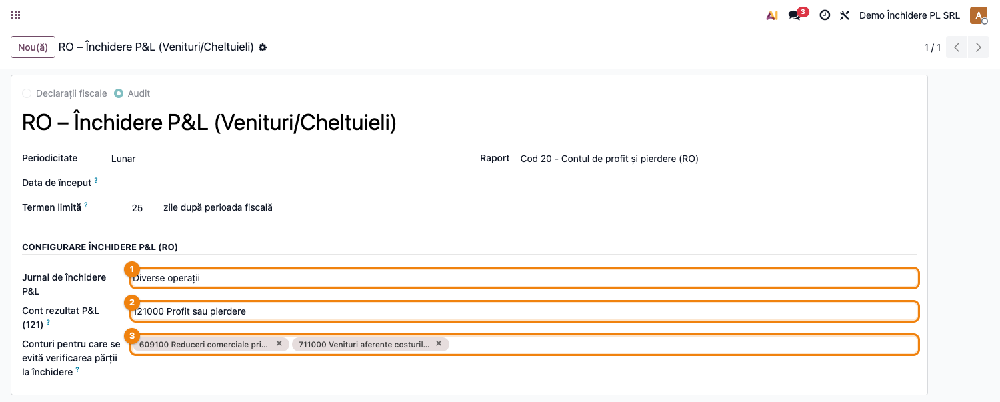
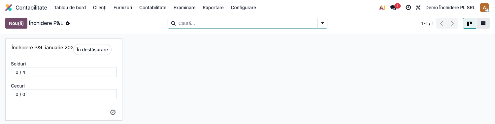
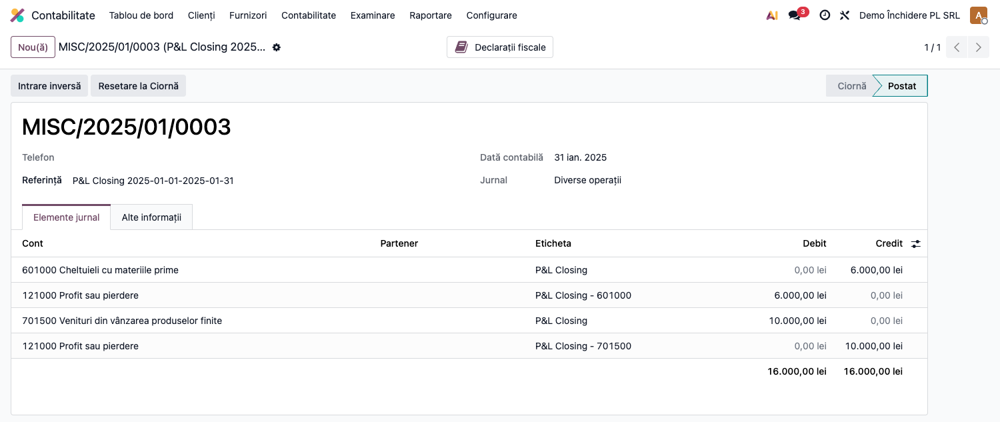

# Fișă Modul: Închidere Venituri/Cheltuieli prin 121

**Poziție plan:** B2.5
**Modul:** `l10n_ro_account_return_pl_closing`
**FR:** FR-27
**Capitol manual:** Cap 11.4
**Utilizator principal:** Contabil șef, Manager Contabilitate
**Prioritate:** 🔴 Ridicată

---

## 1. Scop business

Această fișă descrie utilizarea modulului `l10n_ro_account_return_pl_closing` pentru închiderea lunară a conturilor de venituri și cheltuieli în contul `121 – Profit și pierdere`.
Consultantul folosește documentul pentru reproducerea fluxului în baza demo și
pentru pregătirea capitolului Cap 11.4 din manualul utilizator.

## 2. Bază legală și context

OMFP 1802/2014 — la sfârșitul perioadei, conturile de venituri și cheltuieli se închid în contul de rezultat `121 – Profit și pierdere`.

În fluxul Odoo Enterprise, operațiunea este modelată ca `account.return` de tip audit:
`Review` generează nota contabilă de închidere, iar `Submit` finalizează return-ul.

## 3. Utilizatori și roluri

Contabil Șef

Roluri recomandate pentru testare:
- Administrator funcțional: instalează modulul și configurează tipul de return
- Contabil operațional: verifică soldurile conturilor 6xx/7xx și rulează închiderea
- Contabil șef: validează nota contabilă și finalizează return-ul

## 4. Conturi și date implicate

Conturi principale:
- `6xx` — conturi de cheltuieli, închise prin creditare
- `7xx` — conturi de venituri, închise prin debitare
- `121` — Profit și pierdere, linie corespondentă pentru rezultatul perioadei
- `609`, `709`, `711` — conturi opționale în bypass, deoarece pot avea sold pe ambele părți

Date minime pentru demo:
- companie românească cu localizarea contabilă instalată
- jurnal de tip `Diverse` pentru închiderea P&L
- cont `121 – Profit și pierdere` configurat
- note contabile postate în perioada de test pe conturi 6xx și 7xx
- opțional, rulaj pe `711` pentru verificarea tratamentului conturilor cu sold invers

## 5. Configurare inițială

1. Instalați modulul `l10n_ro_account_return_pl_closing` pe baza demo.
2. Verificați că este instalat `account_reports` Enterprise și localizarea contabilă RO.
3. Creați sau identificați un jurnal de tip `Diverse`, de exemplu `CL – Închidere Lunară P&L`.
4. Deschideți tipul de return `RO – P&L Closing (Income/Expense)`.
5. Completați câmpul **P&L Closing Journal** cu jurnalul de închidere.
6. Completați câmpul **P&L Result Account (121)** cu contul `121`.
7. Adăugați în **Bypass Closing Side Check Accounts** conturile speciale folosite de companie, de regulă `609`, `709`, `711`.

## 6. Flux de utilizare

### Pasul 1 — Accesare

Meniu: `Contabilitate → Contabilitate → Închidere → Run P&L Closing`.

### Pasul 2 — Pregătire perioadă

Verificați că toate documentele lunii sunt postate:
- facturi de vânzare și cumpărare
- note contabile manuale
- note de stoc, CMP, coeficient K, reevaluări valutare sau alte operațiuni care afectează conturile 6xx/7xx

Închiderea P&L trebuie rulat(ă) după operațiunile contabile care modifică veniturile sau cheltuielile perioadei.

### Pasul 3 — Creare return

Accesați **Contabilitate → Closing → Run P&L Closing Return** și creați un return nou.

Completați:
- tipul `RO – P&L Closing (Income/Expense)`
- perioada de la prima până la ultima zi a lunii
- compania pentru care se face închiderea

**Configurarea tipului de return** (jurnal de închidere + cont 121 + conturi bypass 609/711):

**Lista închiderilor P&L** (kanban) — fiecare return cu starea și verificările aferente:

### Pasul 4 — Verificare solduri

Rulați check-ul **Estimated Profit / Loss** și verificați rezultatul estimat:
- profit dacă veniturile sunt mai mari decât cheltuielile
- pierdere dacă cheltuielile sunt mai mari decât veniturile
- rezultat zero dacă veniturile și cheltuielile sunt egale

Deschideți check-ul **Review P&L Balances** și verificați liniile contabile postate pe conturile de venituri și cheltuieli.

### Pasul 5 — Generare notă contabilă

Apăsați **Mark as Reviewed** / **Validate**. Sistemul generează automat nota contabilă de închidere și o postează.

Monografie exemplu pentru profit:

| Cont | Debit | Credit | Explicație |
|------|-------|--------|------------|
| 701 | 10.000 | — | Închidere venituri |
| 601 | — | 6.000 | Închidere cheltuieli |
| 121 | — | 4.000 | Profit transferat în 121 |

Pentru pierdere, linia pe `121` este pe debit.

**Nota contabilă generată** — fiecare cont 6xx/7xx are linia proprie de închidere și o linie
corespondentă pe 121 (în exemplu: 601 creditat 6.000, 701 debitat 10.000 → profit 4.000 pe 121):

### Pasul 6 — Verificare rezultat

Deschideți nota prin **View Entry** și verificați:
- nota este postată
- total debit = total credit
- conturile 6xx sunt închise prin creditare
- conturile 7xx sunt închise prin debitare
- contul `121` reflectă rezultatul perioadei
- return-ul afișează valoarea **Profit / Loss**

### Pasul 7 — Finalizare

Apăsați **Submit** pentru finalizarea return-ului. Sistemul verifică existența notei postate și afișează rezultatul în chatter.

### Pasul 8 — Corectare și rerulare

Dacă apar documente suplimentare după generarea notei:
1. deschideți return-ul
2. apăsați **Reset**
3. postați documentele corective
4. reluați verificarea și generarea notei

Reset șterge nota de închidere generată pentru return-ul curent.

## 7. Legături cu alte module / declarații

| Modul / proces | Rol în flux |
|---|---|
| `account_reports` | infrastructură `account.return` și checks de închidere |
| `l10n_ro_period_close_enhanced` | checklist general de închidere perioadă |
| `l10n_ro_anaf_d300` | D300 trebuie finalizat înainte de închiderea completă a lunii |
| `l10n_ro_financial_statements` | soldul contului 121 intră în raportarea financiară |

Ce este automat: calculul rezultatului și nota de închidere 6xx/7xx în 121.
Ce rămâne manual: validarea ordinii operațiunilor lunare și rerularea după documente întârziate.

## 8. Verificări pentru consultant

- [ ] Modulul se instalează fără erori pe baza demo.
- [ ] Tipul de return `RO – P&L Closing (Income/Expense)` este vizibil.
- [ ] Jurnalul de închidere și contul `121` pot fi configurate pe tipul de return.
- [ ] Check-ul **Estimated Profit / Loss** afișează rezultatul așteptat.
- [ ] Check-ul **Review P&L Balances** listează liniile 6xx/7xx din perioada selectată.
- [ ] Nota de închidere este generată și postată la `Review` / `Validate`.
- [ ] Soldurile conturilor 6xx/7xx sunt zero după închidere pentru perioada testată.
- [ ] Conturile speciale `609`, `709`, `711` sunt documentate dacă firma le folosește.
- [ ] `Submit` finalizează return-ul și lasă urmă în chatter.
- [ ] `Reset` elimină nota generată și permite rerularea fluxului.

## 9. Mesaje de eroare frecvente

| Mesaj / simptom | Cauză probabilă | Remediere |
|-----------------|-----------------|-----------|
| Lipsește jurnalul de închidere | Câmpul **P&L Closing Journal** nu este configurat | Completați jurnalul pe tipul de return |
| Lipsește contul 121 | Câmpul **P&L Result Account (121)** nu este configurat | Completați contul `121` pe tipul de return |
| Nu există solduri de închis | Nu sunt linii postate pe conturi 6xx/7xx în perioada aleasă | Verificați perioada și documentele postate |
| Cont 711 rămâne neînchis | Contul are sold invers și nu este în bypass | Adăugați `711` în **Bypass Closing Side Check Accounts** |
| Nu se poate finaliza return-ul | Nota de închidere lipsește sau nu este postată | Rulați `Review` / `Validate` înainte de `Submit` |

## 10. Capturi de ecran

| # | Fișier | Conținut |
|---|--------|----------|
| 1 | `screenshots/01_config_tip_return.png` | Configurarea tipului de return: jurnal de închidere + cont 121 + conturi bypass (609/711) |
| 2 | `screenshots/02_inchidere_kanban.png` | Lista închiderilor P&L (kanban) cu starea și verificările |
| 3 | `screenshots/03_nota_inchidere.png` | Nota contabilă de închidere (6xx creditat, 7xx debitat, 121 rezultatul) |

> Notă: valoarea Profit / Loss apare pe cardul kanban după rularea completă a verificărilor
> (Review → Validate); rezultatul perioadei este vizibil direct în nota de închidere (captura 3).

## 11. Observații pentru manual

În manualul final, explicați clar ordinea operațiunilor: întâi se finalizează toate procesele care influențează veniturile și cheltuielile lunii, apoi se rulează închiderea P&L.
Pentru utilizatorul contabil este important să vadă diferența dintre verificarea estimată, generarea notei contabile și finalizarea return-ului.
