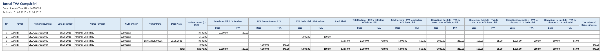
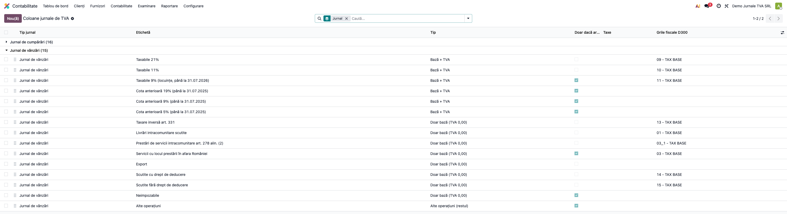
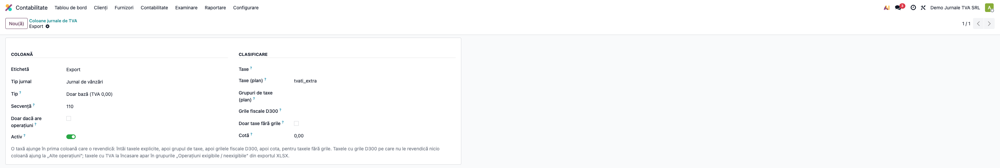
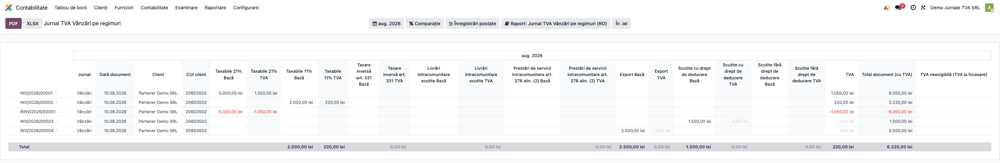
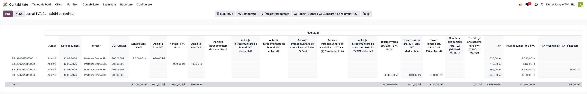
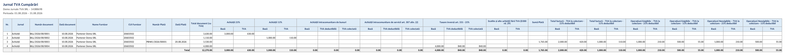
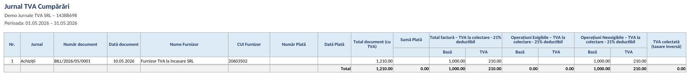
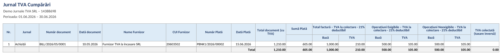
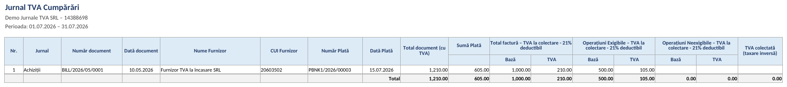

# Fișă Modul: Jurnale de TVA — Vânzări și Cumpărări (registre native account.report)

**Modul:** `l10n_ro_account_vat_journal`
**Utilizator principal:** Contabil TVA, Contabil clienți/furnizori
**Prioritate:** 🔴 Ridicată (registre obligatorii pentru fiecare perioadă fiscală de TVA)

---

## 1. Scop business

Modulul `l10n_ro_account_vat_journal` pune la dispoziție **Jurnalul de vânzări** și **Jurnalul de
cumpărări** ca rapoarte native Enterprise (`account.report`): câte un rând per document (factură,
factură storno, chitanță), cu **o pereche de coloane Bază + TVA pentru fiecare taxă folosită în
perioadă**, tratarea **TVA la încasare** și a achizițiilor cu **taxare inversă**. Jurnalele se exportă
în **XLSX** și **PDF** și sunt sursa de date din care se reconciliază D300 și D394.

Coloanele sunt construite **din taxele configurate**, nu dintr-un nomenclator fix de regimuri: fiecare
taxă folosită în perioadă devine o coloană, cu eticheta luată din descrierea taxei. Separarea pe
regimuri fiscale pe care o cer Normele (secțiunea 2) este deci corectă **doar dacă fiecare regim are
o taxă proprie, cu descriere clară și cu grilele fiscale corecte**.

Pentru contabilii care cer jurnalul în forma „tipizată", modulul are și **jurnalele pe regimuri**:
*Jurnal TVA Vânzări/Cumpărări pe regimuri (RO)*, cu **coloane fixe pe regim fiscal** — taxabile pe
cote, cote anterioare, taxare inversă, operațiuni intracomunitare, export, scutite cu și fără drept
de deducere, neimpozabile, autolichidare cu TVA deductibilă și colectată. Mai multe taxe cu aceeași
încadrare ajung în aceeași coloană. Coloanele se configurează (redenumire, ordine, ascundere,
reguli de clasificare) din **Contabilitate → Configurare → Contabilitate → Coloane jurnale de TVA
(RO)**. Cele două variante se folosesc în paralel; documentele, TVA la încasare și totalurile
`TVA`, `Total document (cu TVA)` și `TVA neexigibilă` sunt aceleași.

Consultantul folosește documentul pentru reproducerea fluxului în baza demo și pentru pregătirea
capitolului din manual dedicat registrelor de TVA.

## 2. Bază legală și context

- **Legea 227/2015 (Codul fiscal), art. 321** — evidența operațiunilor în scopuri de TVA. Conținutul
  jurnalelor e stabilit de **Normele metodologice, pct. 101** (HG 1/2016), date în aplicarea
  art. 321 alin. (4). Jurnalele se întocmesc pentru **perioada fiscală** de TVA — lunară sau
  trimestrială.
- **Pct. 101 alin. (2)** — jurnalele trebuie să permită stabilirea valorii fără TVA, **evidențiată
  distinct**: la vânzări, pentru livrările intracomunitare scutite, livrările/prestările scutite sau
  cu locul în afara României, livrările taxabile pe cote și serviciile intracomunitare
  (art. 278 alin. (2)); la cumpărări, pentru achizițiile intracomunitare, achizițiile pentru care
  cumpărătorul datorează taxa (art. 307 alin. (3)–(6)), achizițiile pe cote și serviciile
  intracomunitare (art. 307 alin. (2)); plus taxa colectată, taxa deductibilă totală și taxa dedusă,
  și pro-rata.
- **Pct. 101 alin. (8)** — persoana impozabilă **își poate stabili propriul model** de jurnal, cu
  condiția să conțină informațiile minime de mai sus și să permită întocmirea decontului (art. 323).
  Legea nu cere coloane goale pentru regimurile fără operațiuni; cere ca fiecare categorie să poată
  fi stabilită distinct atunci când există.
- **TVA la încasare** — art. 282 alin. (3)–(6) Cod fiscal. **Pct. 101 alin. (3) și (5)** (vânzări),
  **alin. (6) și (7)** (cumpărări): factura se înscrie în jurnalul perioadei de emitere și se
  **preia în fiecare jurnal următor**, cu valoarea integrală, până devine integral exigibilă
  (la cumpărări, cu excepția facturilor prescrise, scoase din evidență); pentru fiecare
  încasare/plată se arată documentul, suma din perioadă, baza și TVA-ul exigibile și soldul
  neexigibil. Alin. (4) privește bonurile fiscale, înscrise după rapoartele Z.
- **Taxare inversă (autolichidare)** — coloana „TVA colectată (taxare inversă)" acoperă **orice**
  achiziție cu autotaxare (4426 = 4427 pe aceeași taxă): taxarea inversă internă (**art. 331**),
  achizițiile intracomunitare de bunuri (**art. 308 alin. (1)** + **art. 326 alin. (2)**) și
  serviciile intracomunitare (**art. 307 alin. (2)**). Nu se emite autofactură, deci taxa apare o
  singură dată, în jurnalul de cumpărări.
- **Conversie valutară** — art. 290 alin. (2) Cod fiscal reglementează cursul de conversie a bazei.
  Regula „tot registrul exprimat în lei" pe care o aplică modulul e o cerință de coerență internă a
  jurnalului (altfel nu se poate totaliza pe coloană), nu un text distinct din Codul fiscal.

### Cum acoperă modulul cerințele pct. 101

| Categorie cerută | Ce produce modulul | Condiție |
|---|---|---|
| Operațiuni taxabile, pe cote | câte o pereche Bază / TVA pentru fiecare taxă folosită (21%, 11%, cotele istorice); pentru taxele cu TVA la încasare, perechile pe cotă sunt în grupurile „Operațiuni exigibile / neexigibile" din XLSX | taxa are grile fiscale pe liniile de bază și de TVA |
| Scutite cu drept de deducere / export / livrări intracomunitare / locul în afara RO | o pereche Bază / TVA pentru fiecare taxă de 0% folosită, cu TVA 0,00 | fiecare regim are o taxă **proprie**, cu descriere clară |
| Scutite fără drept de deducere / neimpozabile | la fel, o pereche Bază / TVA 0,00 pe taxă | taxă proprie, separată de cele de mai sus |
| Taxare inversă (art. 331), la furnizor | perechea Bază / TVA 0,00 a taxei de taxare inversă | taxă proprie de 0% cu mențiunea legală |
| Achiziții intracomunitare de bunuri (lit. b) pct. 1) | coloanele taxei + coloana „TVA colectată (taxare inversă)" | taxă proprie cu autolichidare (factor −100% pe 4427) |
| Achiziții cu taxa datorată de cumpărător — art. 307 alin. (3)–(6), inclusiv art. 331 (lit. b) pct. 2) | la fel | taxă proprie cu autolichidare, separată de cea pentru AIC |
| Servicii intracomunitare — art. 307 alin. (2) (lit. b) pct. 4) | la fel | taxă proprie cu autolichidare, separată de cele de mai sus |
| TVA la încasare — lit. a)–e) din alin. (3) / (6) | **XLSX:** număr și dată încasare/plată, valoarea integrală cu TVA, baza și TVA-ul întregii facturi **pe fiecare cotă** („Total factură – <taxa>" — lit. c)), suma încasată/plătită, bază/TVA exigibile și bază/TVA neexigibile **pe fiecare cotă** („Operațiuni exigibile – <taxa>", „Operațiuni neexigibile – <taxa>"); **ecran:** TVA-ul exigibil în coloana `TVA` și soldul neexigibil total. Taxele cu TVA la încasare nu au coloane printre coloanele taxelor, ca partea exigibilă să nu apară de două ori | taxa are exigibilitate „la plată" |
| Taxă deductibilă totală vs. taxă dedusă | **neacoperit** — jurnalul arată doar TVA-ul dedus (partea nededusă nu are grilă) | — |
| Pro-rata | **neacoperit** | — |
| Operațiuni fără nicio taxă pe linie | **nu apar** în jurnal | puneți o taxă de 0% pe linie |

În **jurnalele pe regimuri**, categoriile de mai sus au coloane fixe, iar clasificarea nu depinde de
denumirea taxei: o taxă ajunge în prima coloană care o revendică — întâi taxele alese explicit pe
coloană, apoi grupul de taxe, apoi grilele D300, apoi cota (pentru cotele istorice fără grile).
Grila singură nu ar ajunge: grila 14 amestecă exportul cu alte scutiri, grila 15 scutitele fără
drept de deducere cu neimpozabilele, iar grila 29 (cumpărări) scutitele cu neimpozabilele. Taxele
cu grile D300 pe care nu le revendică nicio coloană ajung în „Alte operațiuni", deci nu dispar.
Taxele **fără** grile care nu sunt prinse de grup sau de cotă (de regulă taxe care nu sunt TVA —
taxa verde, garanția SGR) nu apar în coloanele de regim; o taxă de TVA fără grile trebuie
completată cu grilele ei.

## 3. Utilizatori și roluri

Contabil TVA, Contabil clienți/furnizori.

Roluri recomandate pentru testare:
- Administrator funcțional: instalează modulul și verifică meniurile nou apărute;
- Utilizator operațional: rulează jurnalele pentru fiecare perioadă fiscală și le exportă;
- Contabil/manager: validează totalurile pe cote și reconcilierea cu D300/D394.

## 4. Conturi și date implicate

- **4427** — TVA colectată (jurnalul de vânzări; pe cumpărări, partea colectată a autolichidării);
- **4426** — TVA deductibilă (jurnalul de cumpărări);
- **4428** — TVA neexigibilă (TVA la încasare, până la încasare/plată).

Date minime pentru demo:
- companie românească cu localizarea contabilă RO instalată (plan de conturi RO);
- jurnale de vânzări și cumpărări configurate;
- facturi client și furnizor **postate** în perioada de test, pe mai multe cote (21% și 11%), un
  storno, o factură de furnizor cu TVA la încasare plătită parțial și o achiziție cu taxare inversă.

## 5. Configurare inițială

1. Instalați modulul `l10n_ro_account_vat_journal` pe baza demo (trage automat `l10n_ro`,
   `account_reports` și `l10n_ro_anaf_base`).
2. Verificați că în **Contabilitate → Raportare → Taxe și fiscalitate** apar cele două intrări noi:
   *Jurnal TVA Cumpărări (RO)* și *Jurnal TVA Vânzări (RO)*.
3. **Verificați taxele — de ele depinde conținutul jurnalului:**
   - fiecare regim din tabelul de la secțiunea 2 are o taxă proprie (nu o taxă generică de 0%
     folosită pentru mai multe regimuri);
   - descrierea taxei e clară, în română — ea devine antetul coloanei;
   - taxa are grilele fiscale (etichetele D300) pe liniile de bază și de TVA, **inclusiv cotele
     istorice 19% / 9% / 5%**, dacă mai sunt folosite (de exemplu la stornarea facturilor vechi).
4. Postați un set de facturi client și furnizor pe perioada de test, pe cote diferite.
5. Verificați că utilizatorul de test are cel puțin grupul **Contabilitate / Doar citire**
   (`account.group_account_readonly`).
6. Pentru jurnalele pe regimuri: verificați lista din **Contabilitate → Configurare → Contabilitate → Coloane
   jurnale de TVA (RO)** (necesită grupul *Administrator contabilitate*). Lista vine precompletată;
   ajustați-o doar dacă clientul are taxe proprii sau grile vechi (ex. etichete „09a" moștenite).
   Configurarea nu se suprascrie la actualizarea modulului.

## 6. Flux de utilizare

### Pasul 1 — Deschiderea Jurnalului de cumpărări

Accesați **Contabilitate → Raportare → Taxe și fiscalitate → Jurnal TVA Cumpărări (RO)**. Raportul
afișează câte un rând per document de achiziție: jurnalul, data, furnizorul și codul fiscal, câte o
pereche de coloane **Bază / TVA pentru fiecare taxă** folosită în perioadă, coloana **TVA** (TVA-ul
exigibil/deductibil al rândului), **Total document (cu TVA)**, **TVA colectată (taxare inversă)**,
**TVA neexigibilă (TVA la încasare)** și un rând de **Total**.

**Găsiți pe ecran:**
- fiecare rând este un document de achiziție; perechile de coloane pe taxă descompun documentul (cu
  excepția TVA la încasare, vezi mai jos);
- `TVA` cumulează TVA-ul exigibil/deductibil al rândului;
- `Total document (cu TVA)` este totalul facturii, cu TVA, **în lei** — și pentru o achiziție în
  valută; la o factură cu TVA la încasare plătită de mai multe ori în perioadă, totalul se repetă pe
  fiecare rând de plată, dar pe rândul de Total documentul se adună o singură dată;
- `TVA colectată (taxare inversă)` arată TVA-ul autolichidat, pe același rând cu cel deductibil din
  coloana `TVA`;
- `TVA neexigibilă (TVA la încasare)` arată soldul încă neexigibil al facturilor cu TVA la încasare.

**Verificați** înainte de a continua:
- perioada selectată este perioada fiscală de raportat;
- pe facturile obișnuite și pe cele cu taxare inversă, suma coloanelor TVA pe taxe = coloana `TVA`
  (rândurile cu TVA la încasare fac excepție, vezi mai jos);
- taxele cu TVA la încasare **nu au coloane pe cotă**: pe rândul unei plăți din perioadă, partea
  exigibilă apare în coloana `TVA`, iar restul în `TVA neexigibilă`; o factură preluată fără plată în
  perioadă are completată doar coloana `TVA neexigibilă`. Pe rândurile cu TVA la încasare, suma
  coloanelor pe taxe nu e deci egală cu `TVA` — defalcarea pe bază/TVA exigibile e în XLSX;
- taxele fără TVA (0%, scutiri, export) au perechea Bază / TVA, cu TVA 0,00 pe rândurile cu bază;
- o factură cu TVA la încasare neplătită integral **la sfârșitul perioadei raportate** apare în
  jurnal, chiar dacă între timp a fost plătită.


În captură: factura 0003 are TVA la încasare pe două cote (21% și 11%) și a fost plătită pe jumătate
— 265 lei TVA exigibil în coloana `TVA`, 265 lei neexigibili, fără coloane pe cotă (defalcarea
210 + 55 e în XLSX, captura 05); factura 0004 este o achiziție cu taxare
inversă — 840 lei deductibil în `TVA` și 840 lei colectat în coloana dedicată, iar totalul
documentului este baza (4.000 lei), pentru că factura furnizorului nu conține TVA.

> Butonul **Comparație** ascunde coloanele pe taxe: cu o comparație activă rămân doar coloanele de
> total. Pentru citirea pe cote, lăsați comparația dezactivată.

### Pasul 2 — Jurnalul de vânzări

Accesați **Contabilitate → Raportare → Taxe și fiscalitate → Jurnal TVA Vânzări (RO)**. Structura
este simetrică jurnalului de cumpărări, pe documentele de vânzare, inclusiv coloana `TVA neexigibilă`
pentru facturile de vânzare cu TVA la încasare neîncasate integral.

**Verificați:**
- stornourile apar cu **bază, TVA și total negative**, pe rândul propriu;
- totalul coloanei `TVA` se reconciliază cu rulajul contului **4427**, cu excepția autolichidărilor:
  dacă în perioadă există achiziții cu taxare inversă, partea lor din 4427 apare pe jurnalul de
  cumpărări — reconcilierea completă e `4427 = Total „TVA" vânzări + Total „TVA colectată (taxare
  inversă)" cumpărări`;
- totalul coloanei `TVA neexigibilă` reține soldul rămas după ultima încasare a fiecărei facturi, nu
  suma tuturor rândurilor ei.


În captură, factura 00003 este o livrare scutită cu drept de deducere: coloana taxei de 0% are baza
(1.500 lei) și TVA 0,00 — antetul „TVA colectat 0% …" vine din descrierea taxei din planul RO, iar
perechea Bază / TVA arată clar că suma e bază, nu TVA.

### Pasul 3 — Selectarea perioadei

Folosiți selectorul de perioadă din antetul raportului. Implicit raportul propune **luna trecută**;
plătitorii cu perioadă fiscală trimestrială aleg trimestrul.

**Verificați:** intervalul afișat în antet este exact perioada pentru care depuneți D300/D394.


### Pasul 4 — Export în XLSX

După ce ați citit și confirmat datele pe ecran, apăsați butonul **XLSX** din antetul raportului.
Exportul are aceleași coloane pe taxe și **Total document (cu TVA)**, iar acolo unde există
operațiuni cu TVA la încasare adaugă **Număr / Dată plată (încasare)**, **Sumă plată** și, pentru
fiecare taxă cu TVA la încasare, câte o pereche **Total factură – <taxa>**, **Operațiuni
exigibile – <taxa>** și **Operațiuni neexigibile – <taxa>** (bază, TVA) — deci exigibilul și soldul sunt defalcate pe cote; pe jurnalul de
cumpărări se adaugă și coloana **TVA colectată (taxare inversă)**. Pentru TVA la încasare, XLSX-ul
are toate informațiile de la pct. 101 alin. (3) / (6) lit. a)–e). „Total factură" (lit. c) arată
baza și TVA-ul întregii facturi pe fiecare rând al ei; pe rândul **Total** fiecare factură se adună
o singură dată.

**Verificați în fișier:**
- rândul **Total** are valori calculate în fiecare coloană (inclusiv la deschiderea într-un
  vizualizator care nu recalculează formulele);
- totalul coloanelor „Operațiuni neexigibile – <taxa>" este soldul rămas per factură, nu suma
  rândurilor;
- „Total factură – <taxa>" are aceeași valoare pe toate rândurile unei facturi, iar la total
  fiecare factură se adună o dată; pentru o factură fără plăți în perioadele anterioare, „Total
  factură" = **suma** „Operațiunilor exigibile" de pe toate rândurile ei din perioadă +
  „Operațiunile neexigibile" de pe ultimul ei rând;
- totalul coloanelor „Total factură" e informativ: include și facturile reportate din perioadele
  anterioare, deci nu se compară cu D300;
- totalurile pe taxe coincid cu cele citite pe ecran; suma coloanelor TVA pe taxe plus TVA-ul din
  „Operațiuni exigibile" este egală cu totalul coloanei `TVA` de pe ecran (exportul nu are o coloană
  `TVA` separată);
- o factură cu TVA la încasare apare cu partea exigibilă **o singură dată**, în „Operațiuni
  exigibile – <taxa>", câte o pereche pe fiecare cotă, nu și într-o coloană a taxei.




Capturile XLSX arată pagina exact cum se tipărește: titlul cu firma, CUI și perioada, capul de
tabel, sumele cu separatori, rândul Total. La tipărire foaia e în peisaj, încadrată pe lățime (A4,
respectiv A3 pentru jurnalele foarte late), cu capul de tabel repetat pe fiecare pagină; în Excel,
antetul rămâne vizibil la derulare și capul de tabel are filtre.

### Pasul 5 — Configurarea coloanelor jurnalelor pe regimuri

Accesați **Contabilitate → Configurare → Contabilitate → Coloane jurnale de TVA (RO)**. Lista e
grupată pe jurnal;
fiecare rând e o coloană, cu tipul ei (**Bază + TVA**, **Doar bază (TVA 0,00)**, **Autolichidare**
— bază, TVA deductibilă și TVA colectată —, **Alte operațiuni**), bifa **Doar dacă are
operațiuni** și grilele D300 după care clasifică. Mutați rândurile ca să schimbați ordinea în jurnal.



Deschideți o coloană ca să vedeți sau să schimbați regulile. Exemplul de mai jos e coloana
**Export**: o clasifică taxa din planul de conturi `tvati_extra` („Taxe (plan)"). Câmpurile, în
ordinea în care se aplică: **Taxe** (alese explicit, au prioritate), **Taxe (plan)**, **Grupuri de
taxe (plan)**, **Grile fiscale D300** (se pot adăuga și grile vechi), **Cotă** (doar pentru taxele procentuale fără grile). Bifa **Doar taxe fără grile** restrânge regula de
grup la taxele fără grile — așa sunt livrate cotele anterioare, al căror grup (ex. 9%) conține și
taxe cu grile. Debifați **Activ** ca să scoateți coloana din jurnal;
**Doar dacă are operațiuni** o afișează doar în perioadele în care are sume — așa sunt livrate
cotele anterioare 19% / 9% / 5%.

Pentru taxele proprii ale clientului folosiți câmpul **Taxe** (selecție din listă). Câmpurile
„(plan)" și **Grile fiscale D300** sunt text exact, separat prin virgulă, ca în exemplele
precompletate: identificatorii din planul de conturi (ex. `tvati_extra`, `tax_group_tva_21`) și
numele grilelor în forma din listă (ex. `24 - TAX BASE`). O valoare scrisă greșit nu dă eroare —
pur și simplu nu clasifică nimic, iar taxa ajunge în „Alte operațiuni" (dacă are grile D300;
altfel nu apare în coloanele de regim, vezi secțiunea 2).



### Pasul 6 — Jurnalul de vânzări pe regimuri

Accesați **Contabilitate → Raportare → Taxe și fiscalitate → Jurnal TVA Vânzări pe regimuri (RO)**
(sau alegeți varianta din butonul *Raport:* al jurnalului de vânzări).

**Găsiți pe ecran:**
- coloanele de identificare și totalurile sunt aceleași ca la jurnalul standard;
- între ele, perechile Bază / TVA pe regim: **Taxabile 21%**, **Taxabile 11%**, **Taxare inversă
  art. 331**, **Livrări intracomunitare scutite**, **Prestări de servicii intracomunitare art. 278
  alin. (2)**, **Export**, **Scutite cu / fără drept de deducere**; coloanele doar cu bază au TVA 0,00
  pe rândurile cu sume;
- coloanele marcate „doar dacă are operațiuni" (cote anterioare, 9% locuințe, servicii cu locul în
  afara României, neimpozabile, alte operațiuni) apar numai în perioadele în care au sume.

**Verificați:**
- toate taxele de 21% ale clientului, oricum s-ar numi, sunt în **Taxabile 21%**;
- exportul (livrări de bunuri) e separat de celelalte scutiri cu drept de deducere;
- suma coloanelor TVA pe regimuri = coloana `TVA` (cu excepția TVA la încasare, ca la jurnalul
  standard);
- coloana **Alte operațiuni** e goală — dacă are sume, o taxă a clientului nu e clasificată: adăugați
  taxa sau grila ei pe coloana potrivită (pasul 5).



În captură: factura 00001 și stornoul ei se anulează pe **Taxabile 21%**; 00002 e pe **Taxabile
11%**; 00003 (1.500 lei) pe **Scutite cu drept de deducere**; 00004 (2.500 lei) pe **Export**.

### Pasul 7 — Jurnalul de cumpărări pe regimuri

Accesați **Contabilitate → Raportare → Taxe și fiscalitate → Jurnal TVA Cumpărări pe regimuri (RO)**.

**Găsiți pe ecran:**
- coloanele afișate mereu: **Achiziții 21%** / **Achiziții 11%** (bază și TVA deductibilă),
  autolichidarea pentru **achiziții intracomunitare de bunuri**, **achiziții intracomunitare de
  servicii art. 307 alin. (2)** și **taxare inversă art. 331 - 21%** — fiecare cu **Bază**, **TVA
  deductibilă** și **TVA colectată** —, și **Scutite și alte achiziții fără TVA (D300 rd. 29)**;
- coloanele care apar doar în perioadele cu operațiuni: cotele anterioare, **alte achiziții cu
  taxare inversă (D300 rd. 7)** (import, servicii de la prestatori din afara UE), taxare inversă
  art. 331 pe 11% și pe cote anterioare, achiziții intracomunitare scutite, neimpozabile, alte
  operațiuni.

**Verificați:**
- la fiecare autolichidare, TVA deductibilă = TVA colectată (cu excepția deducerii limitate);
- la taxele cu deducere limitată (ex. 50%), coloana TVA arată doar partea dedusă, ca D300 rd. 24;
- importul și serviciile de la prestatori din afara UE nu apar la „intracomunitare".



În captură: factura 0004 (taxare inversă art. 331) are bază 4.000, TVA deductibilă 840 și TVA
colectată 840; factura 0003, cu TVA la încasare, nu are coloană pe regim — ca în jurnalul standard,
TVA-ul ei exigibil apare în `TVA`, iar defalcarea pe cote în XLSX. Jurnalul pe regimuri nu are
coloana globală „TVA colectată (taxare inversă)": TVA-ul colectat e în fiecare coloană de
autolichidare, iar o coloană globală l-ar număra de două ori.

### Pasul 8 — Export XLSX al jurnalelor pe regimuri

Apăsați **XLSX** din antetul jurnalului pe regimuri, după verificarea de la pașii 6–7. Exportul are
aceleași coloane pe regim (autolichidarea cu **Bază / TVA deductibilă / TVA colectată**) și aceleași
grupuri pentru TVA la încasare ca exportul standard.

**Verificați în fișier:** totalurile pe regim coincid cu cele de pe ecran; rândul Total are valori în
toate coloanele.



Jurnalul pe regimuri e lat (autolichidarea are trei coloane, iar TVA la încasare câte patru pe cotă),
de aceea se tipărește pe A3. Descrierile taxelor din antete vin din planul de conturi RO.

### Pasul 9 — Factură cu TVA la încasare plătită în altă lună

Factura cu TVA la încasare se înregistrează într-o lună și se plătește (sau se încasează) în alta. Normele pct. 101 alin. (6)–(7) la cumpărări, respectiv alin. (3)
și (5) la vânzări, cer ca factura să rămână în jurnalul lunii în care a fost înregistrată, cu valoarea
integrală, să fie preluată în fiecare jurnal următor cât timp nu e integral exigibilă, iar în luna
plății să apară partea care devine exigibilă.

Deschideți jurnalul de cumpărări (sau de vânzări) pentru fiecare lună, pe rând, și exportați XLSX-ul.
Exemplul de mai jos urmărește o achiziție de 1.000 lei + TVA 210 lei, înregistrată pe 10.05.2026 și
plătită în două tranșe egale de 605 lei, pe 15.06 și 15.07.2026. Notele contabile pe care le reflectă
jurnalul:
- la înregistrare: **Dr 6xx 1.000 + Dr 4428 210 = Cr 401 1.210** (TVA-ul stă pe 4428, neexigibil);
- la fiecare plată: **Dr 401 = Cr 5121 605** și nota de exigibilizare generată de Odoo
  **Dr 4426 = Cr 4428 105** — rulajul debitor 4426 e 105 în iunie și 105 în iulie. Nota de
  exigibilizare are și liniile de bază (500 debit = 500 credit), din care jurnalul ia coloana
  „Operațiuni exigibile – Bază"; cu `l10n_ro_caba` ele stau pe contul tehnic 442830, fără el pe un
  cont de cheltuială sau venit (rulaj debit = credit). În balanța Odoo, 4428 apare pe analiticele
  44282 (cumpărări) și 44281 (vânzări).

Antetul grupurilor („TVA la colectare - 21% deductibil") vine din descrierea taxei în planul de conturi
RO: e taxa de achiziție cu TVA la încasare, nu TVA colectată.

**Luna înregistrării (mai).**
- *Găsiți:* rândul facturii, cu **Total document (cu TVA)** 1.210 lei și, la **Total factură**,
  baza 1.000 și TVA-ul 210; fără număr de plată.
- *Verificați:* **Operațiuni exigibile** e goală; **Operațiuni neexigibile** are toată factura
  (1.000 / 210). Pe ecran, coloana `TVA` e 0, iar `TVA neexigibilă` e 210. Factura apare și dacă
  deschideți raportul după ce a fost plătită — soldul se calculează la sfârșitul lunii raportate;
  captura de mai jos e generată chiar după ambele plăți.



**Luna primei plăți (iunie).**
- *Găsiți:* același rând, acum cu **Număr / Dată plată** și **Sumă plată** 605 lei.
- *Verificați:* **Operațiuni exigibile** = 500 / 105 (partea plătită, dedusă în iunie);
  **Operațiuni neexigibile** = 500 / 105 (restul). Exigibil + neexigibil = factura întreagă. Pe
  ecran: `TVA` 105, `TVA neexigibilă` 105.



**Luna ultimei plăți (iulie).**
- *Găsiți:* factura, preluată din nou, cu a doua plată de 605 lei.
- *Verificați:* **Operațiuni exigibile** = 500 / 105; **Operațiuni neexigibile** e goală pe rândul facturii
  și 0,00 pe rândul Total — factura e integral exigibilă și nu mai apare în jurnalul lunii următoare. Pe ecran: `TVA` 105,
  `TVA neexigibilă` 0.



Dacă factura rămâne neplătită, ea apare în fiecare lună, cu **Operațiuni neexigibile** egale cu
soldul rămas, până la plată. Suma TVA-ului exigibil din toate lunile este egală cu TVA-ul facturii.

> Pentru facturile **în valută** plătite la alt curs decât cel al facturii, TVA-ul exigibil trebuie
> determinat la cursul facturii (art. 290 alin. (2) Cod fiscal, Norme pct. 35 alin. (2)). Nota de
> exigibilizare generată de Odoo folosește cursul plății, deci **Operațiuni exigibile** (preluate din
> notă) și **Operațiuni neexigibile** (calculate din totalul facturii în lei, minus plățile deja
> făcute) nu mai însumează exact TVA-ul facturii. Corectura se face în contabilitate, nu în jurnal:
> nota de corecție (4426/4428 la cumpărări, 4427/4428 la vânzări) trebuie să poarte grilele fiscale
> de bază și de TVA ale taxei — fără ele nu ajunge nici în jurnal, nici în D300.

### Note de monografie și raportare

- Jurnalele nu generează note contabile proprii — sunt **registre de raportare** peste notele deja
  postate. Notele de referință pe care le reflectă:
  - vânzare cu TVA: **Dr 4111 = Cr 70x + Cr 4427**;
  - achiziție cu TVA deductibilă: **Dr 3xx/6xx + Dr 4426 = Cr 401**;
  - TVA la încasare (până la încasare/plată): TVA stă pe **4428** și se transferă pe 4427/4426 la
    încasare/plată;
  - taxare inversă (art. 331, AIC): **Dr 4426 = Cr 4427** simultan, fără afectarea trezoreriei.
- Pe **jurnalele pe regimuri** nu există coloana globală „TVA colectată (taxare inversă)":
  **rulajul creditor 4427 = Total „TVA" vânzări + suma coloanelor „TVA colectată" din cumpărări**
  (coloanele de autolichidare și „Alte operațiuni").
- Pe toate jurnalele: totalul coloanei `TVA` din jurnalul de cumpărări corespunde **rulajului
  debitor** al contului
  **4426** pe perioadă, fără nota de închidere a TVA, **dacă toate sumele de pe 4426 provin din
  documente cu grile fiscale** (nu din note manuale, TVA plătit în vamă pe DVI sau taxe fără grile).
- Pe **jurnalele standard**: **rulajul creditor 4427 = Total „TVA" jurnal vânzări + Total „TVA
  colectată (taxare inversă)" jurnal cumpărări** — autolichidările colectează pe 4427, dar apar doar pe jurnalul de cumpărări.
  Egalitatea ține pe planul RO, unde stornourile se înregistrează în roșu (contabilitate storno
  activă implicit).
- La taxele cu deducere parțială (ex. 50% nedeductibil), partea nededusă merge pe cheltuieli și nu
  are grilă fiscală: jurnalul arată doar TVA-ul dedus.

## 7. Legături cu alte module / declarații

| Modul / proces | Rol în flux | Tip legătură |
|---|---|---|
| `l10n_ro` | plan de conturi RO (4426/4427/4428) și taxe RO | dependență (manifest) |
| `account_reports` | framework-ul `account.report` (Enterprise) | dependență (manifest) |
| `l10n_ro_anaf_base` | mixin handler ANAF (export, antet) | dependență (manifest) |
| `l10n_ro_anaf_d300` | decontul de TVA reconciliat cu jurnalele | reconciliere (date) |
| `l10n_ro_anaf_d394` | adaugă butonul de export fișier D394 direct pe aceste rapoarte | integrare opțională |
| `l10n_ro.vat.journal.column` (în modul) | nomenclatorul și regulile coloanelor jurnalelor pe regimuri | configurare |
| `l10n_ro_caba` | setează contul tehnic 442830 pentru liniile de bază ale notelor de exigibilizare la TVA la încasare | recomandat |
| `l10n_ro_reverse_charge_331` | `21% R331` (achiziție) e recunoscută ca autolichidare, cu TVA colectată pe coloana dedicată; `0% R331` (vânzare) apare ca propria coloană de bază | integrare prin convenție |

Ce este automat: construcția jurnalelor pe taxe și pe regimuri, clasificarea taxelor pe coloanele
de regim, tratarea TVA la încasare și a taxării inverse, exportul XLSX/PDF.

Ce rămâne manual: configurarea taxelor pe regimuri (secțiunea 5), clasificarea taxelor proprii ale
clientului pe coloanele jurnalelor pe regimuri (dacă ajung în „Alte operațiuni"), alegerea perioadei, verificarea
totalurilor față de balanță, evidența taxei nededuse și a pro-ratei, și depunerea declarațiilor
(D300/D394 se generează din modulele dedicate, dacă sunt instalate).

## 8. Verificări pentru consultant

- [ ] Modulul se instalează fără erori (trage `l10n_ro`, `account_reports`, `l10n_ro_anaf_base`).
- [ ] În **Contabilitate → Raportare → Taxe și fiscalitate** apar *Jurnal TVA Cumpărări (RO)* și
      *Jurnal TVA Vânzări (RO)*.
- [ ] Fiecare regim folosit de client (cote, scutiri, export, livrări intracomunitare, taxare
      inversă) are o taxă proprie, cu descriere în română și cu grile fiscale.
- [ ] Coloanele de Bază + TVA se generează pentru fiecare taxă folosită în perioadă.
- [ ] Pe facturile obișnuite și pe cele cu taxare inversă, suma coloanelor TVA pe taxe = coloana `TVA`.
- [ ] Taxele cu TVA la încasare nu au coloane printre coloanele taxelor; în XLSX, exigibilul și
      neexigibilul sunt defalcate pe fiecare cotă („Operațiuni exigibile / neexigibile – <taxa>"),
      iar exigibilul apare o singură dată.
- [ ] Taxele fără TVA (0%, scutiri, export) au perechea Bază / TVA, cu TVA 0,00.
- [ ] O notă de credit cu TVA la încasare, compensată cu factura, are neexigibilul zero pe ultimul rând.
- [ ] `Total document (cu TVA)` = totalul facturii cu TVA, în lei; la totalul raportului, fiecare
      document se adună o singură dată.
- [ ] Totalul `TVA` al jurnalului de cumpărări = rulajul debitor 4426 (fără nota de închidere, dacă
      toate sumele de pe 4426 vin din documente cu grile fiscale). Cel
      de vânzări = rulajul creditor 4427 **doar** dacă nu există autolichidări în perioadă — altfel
      `4427 = Total TVA vânzări + Total TVA colectată (taxare inversă) cumpărări`.
- [ ] Stornourile apar cu bază, TVA și total **negative**.
- [ ] O factură cu TVA la încasare neplătită integral apare în jurnalul perioadei, cu restul
      neexigibil în coloana dedicată — și la rularea retroactivă, după ce a fost plătită.
- [ ] În XLSX, factura cu TVA la încasare are plata, operațiunile exigibile și neexigibile.
- [ ] O achiziție cu taxare inversă arată și TVA colectată, pe ecran și în XLSX, fără rând în
      jurnalul de vânzări.
- [ ] Rândul Total din XLSX are valori în toate coloanele, iar antetele sunt în română.
- [ ] O factură cu TVA la încasare înregistrată într-o lună și plătită în alta apare în luna
      înregistrării cu toată factura neexigibilă (și la redeschiderea raportului după plată), în luna
      plății cu partea plătită exigibilă, și se reportează până la plata integrală.
- [ ] În **Contabilitate → Raportare → Taxe și fiscalitate** apar și *Jurnal TVA Vânzări / Cumpărări
      pe regimuri (RO)*, iar lista *Coloane jurnale de TVA (RO)* e precompletată.
- [ ] În jurnalele pe regimuri, coloana „Alte operațiuni" e goală (toate taxele cu grile D300 sunt
      clasificate).
- [ ] Pe jurnalele pe regimuri: rulaj creditor 4427 = Total TVA vânzări + suma coloanelor „TVA
      colectată" din cumpărări; exportul XLSX nu are o coloană globală de TVA colectată.
- [ ] Taxele de 21% cu denumiri diferite ajung în aceeași coloană; exportul e separat de alte scutiri.
- [ ] Autolichidarea are Bază, TVA deductibilă și TVA colectată; TVA nedeductibil 50% apare doar cu
      partea dedusă.
- [ ] Cotele anterioare 19% / 9% / 5% apar doar în perioadele în care au operațiuni.
- [ ] O coloană arhivată dispare din jurnal; una cu „Doar dacă are operațiuni" debifat apare și goală.

## 9. Mesaje de eroare frecvente

| Mesaj / simptom | Cauză probabilă | Remediere |
|-----------------|-----------------|-----------|
| Meniurile *Jurnal TVA Vânzări/Cumpărări (RO)* nu apar | Modulul nu e instalat sau utilizatorul nu are drepturi contabile | Instalați modulul și acordați grupul *Contabilitate / Doar citire* |
| Raportul e gol pe perioada aleasă | Nu există documente postate în interval sau perioada e greșită | Verificați că facturile sunt **postate** și că intervalul din antet e corect |
| Nu apare coloana unei cote | Nu există documente cu acea taxă în perioadă | Comportament normal: coloanele apar doar pentru taxele folosite |
| Coloana unei taxe apare, dar e goală, iar `TVA` arată 0 | Taxa nu are grile fiscale pe liniile de bază sau de TVA (frecvent la cotele istorice) | Completați grilele fiscale pe taxă; documentele deja postate își păstrează grilele vechi |
| Două coloane cu același antet | Două taxe cu aceeași descriere | Dați fiecărei taxe o descriere distinctă |
| O factură lipsește complet din jurnal | Liniile ei nu au nicio taxă | Puneți pe linii taxa regimului (ex. neimpozabil 0%) |
| Coloanele pe taxe dispar | Butonul **Comparație** e activ | Dezactivați comparația |
| Taxa cu TVA la încasare nu are coloană printre coloanele taxelor | Comportament intenționat: partea exigibilă ar apărea de două ori (coloana taxei și „Operațiuni exigibile") | Citiți-o pe cotă în „Operațiuni exigibile / neexigibile – <taxa>" (XLSX) sau total în coloana `TVA` (ecran) |
| Totalul jurnalului nu se potrivește cu balanța | Documente nepostate, perioadă diferită, sau sume pe 4426 / 4427 fără grile fiscale (note manuale, DVI, taxe fără grile) | Reconciliați perioada și identificați notele fără grile fiscale pe conturile de TVA |
| Rulajul 4427 nu se potrivește cu totalul jurnalului de vânzări | Există autolichidări în perioadă — TVA-ul lor colectat apare pe jurnalul de cumpărări | Adunați și coloana „TVA colectată (taxare inversă)" din jurnalul de cumpărări standard, respectiv coloanele „TVA colectată" din jurnalul de cumpărări pe regimuri |
| Butonul de export D394 lipsește | Modulul `l10n_ro_anaf_d394` nu e instalat | Butonul apare doar cu modulul de declarație instalat |
| Rest mic (câțiva lei) pe `TVA neexigibilă` la o factură în valută plătită integral | Nota de exigibilizare e făcută la cursul plății, nu la cursul facturii (art. 290 alin. (2) Cod fiscal) — TVA-ul dedus/colectat și baza din D300 diferă | Corectați nota de exigibilizare cu grilele fiscale ale taxei (vezi nota din Pasul 9); verificați soldul real pe 4428 |
| În jurnalul pe regimuri, coloana „Alte operațiuni" are sume | O taxă cu grile D300 nu e revendicată de nicio coloană (taxă proprie a clientului, grile vechi) | Adăugați taxa în câmpul **Taxe** al coloanei potrivite sau grila ei în **Grile fiscale D300** |
| În jurnalul pe regimuri lipsește o coloană | Coloana e arhivată sau are „Doar dacă are operațiuni" și perioada n-are sume | Verificați coloana în *Coloane jurnale de TVA (RO)* |
| Meniul *Coloane jurnale de TVA (RO)* nu apare | Utilizatorul nu e *Administrator contabilitate* | Acordați grupul, sau configurați cu un administrator |
| Antete în engleză pe o interfață în română | Traducerile nu au fost reîncărcate | Actualizați modulul (`-u l10n_ro_account_vat_journal`) |

## 10. Capturi de ecran

Capturile (`readme/screenshots/`) sunt **generate automat** din `tests/test_screenshots.py`
(mixinul `ScreenshotCase` din `l10n_ro_doc_screenshots`, import defensiv), în **limba română**, pe
planul de conturi RO, cu documente datate în luna anterioară (perioada implicită a rapoartelor).
Excepție: capturile 11–13 folosesc o factură separată, datată fix în mai–iulie 2026, ca să nu schimbe
celelalte capturi:

1. `01_jurnal_cumparari.png` — Jurnalul de cumpărări: coloane pe taxe, factura cu TVA la încasare
   plătită pe jumătate (fără coloană pe cotă, exigibilul în `TVA`), achiziția cu taxare inversă și
   rândul de total.
2. `02_jurnal_vanzari.png` — Jurnalul de vânzări, cu storno în negativ și o livrare scutită (Bază /
   TVA 0,00).
3. `03_filtru_perioada.png` — selectorul de perioadă, deschis.
4. `04_export_xlsx.png` — jurnalul de vânzări exportat în XLSX, cu totaluri calculate și taxa de 0%
   pe Bază / TVA 0.
5. `05_export_xlsx_cumparari.png` — jurnalul de cumpărări exportat în XLSX: plată, operațiuni
   exigibile/neexigibile pe cota taxei cu TVA la încasare (exigibilul o singură dată) și TVA
   colectată (taxare inversă).
6. `06_coloane_configurare.png` — lista coloanelor jurnalelor pe regimuri, cu grupul vânzărilor
   deschis.
7. `07_coloana_formular.png` — formularul coloanei „Export", cu regulile de clasificare.
8. `08_jurnal_vanzari_regimuri.png` — jurnalul de vânzări pe regimuri: 21%, 11%, storno, livrare
   scutită și export.
9. `09_jurnal_cumparari_regimuri.png` — jurnalul de cumpărări pe regimuri: 21%, 11% și taxarea
   inversă art. 331 cu bază, TVA deductibilă și TVA colectată.
10. `10_export_xlsx_cumparari_regimuri.png` — jurnalul de cumpărări pe regimuri exportat în XLSX
    (pagina A3).
11. `11_caba_luna_inregistrare.png` — TVA la încasare, luna înregistrării: factura întreagă
    neexigibilă.
12. `12_caba_luna_plata.png` — luna primei plăți: jumătate exigibilă, jumătate neexigibilă.
13. `13_caba_luna_stingere.png` — luna ultimei plăți: restul exigibil, neexigibilul stins.

Regenerare:

```bash
./odoo/odoo-bin -c odoo.conf -d <db> -i l10n_ro_account_vat_journal,l10n_ro_doc_screenshots \
    --test-tags=fise_screenshots --stop-after-init
```

## 11. Observații pentru manual

În manualul final, păstrați explicația orientată pe activitatea utilizatorului: jurnalele de TVA sunt
registre obligatorii pentru fiecare perioadă fiscală, se citesc pe taxe înainte de export și sunt
sursa reconciliată de D300 și D394. Subliniați sub-fluxul „găsește pe ecran → verifică totalurile pe
taxe și față de balanță → exportă", nu exportul ca prim gest.

Subliniați și regula care decide calitatea jurnalului: **coloanele reflectă taxele**. Un client care
folosește o singură taxă generică de 0% pentru export, scutiri și neimpozabile va avea un jurnal în
care aceste regimuri nu se pot separa — corecția se face în configurarea taxelor, nu în raport.

Pentru jurnalele pe regimuri, păstrați ideea că **coloanele sunt fixe, iar taxele se clasifică în
ele**: operatorul nu mai trebuie să știe cum se numește fiecare taxă. Verificarea esențială înaintea
oricărui export e coloana „Alte operațiuni" — dacă e goală, toate taxele cu grile D300 sunt
încadrate.
