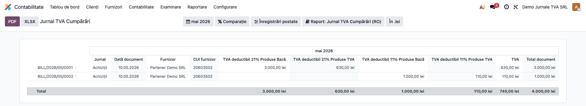
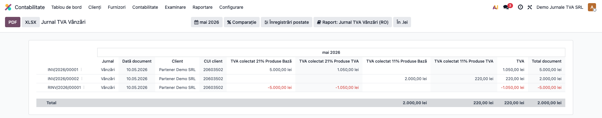
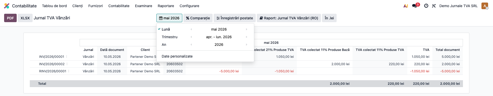
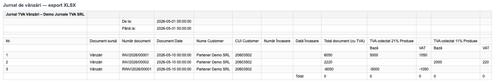

# Fișă Modul: Jurnale de TVA — Vânzări și Cumpărări (registre native account.report)

**Modul:** `l10n_ro_account_vat_journal`
**Utilizator principal:** Contabil TVA, Contabil clienți/furnizori
**Prioritate:** 🔴 Ridicată (registre lunare obligatorii pentru TVA)

---

## 1. Scop business

Modulul `l10n_ro_account_vat_journal` pune la dispoziție **Jurnalul de vânzări** și **Jurnalul de
cumpărări** ca rapoarte native Enterprise (`account.report`), în forma cerută de inspectorii ANAF:
câte un rând per document (factură, factură storno, chitanță), cu **coloane dinamice de Bază + TVA
pe fiecare cotă** (21% / 11% și cotele istorice 19% / 9% / 5%), tratarea **TVA la încasare** și a
operațiunilor cu **taxare inversă** (art. 331). Jurnalele se exportă în **XLSX** (layout tipizat) și
**PDF**. Sunt sursa de date reconciliată de declarațiile D300 și D394.

Consultantul folosește documentul pentru reproducerea fluxului în baza demo și pentru pregătirea
capitolului din manual dedicat registrelor de TVA.

## 2. Bază legală și context

- **Legea 227/2015 (Codul fiscal), art. 321** — evidența operațiunilor în scopuri de TVA; jurnalul de
  vânzări și jurnalul de cumpărări sunt registrele lunare obligatorii pe care le verifică inspecția
  fiscală.
- **Taxare inversă** — art. 331 Cod fiscal (operațiuni interne cu taxare inversă).
- **TVA la încasare** — art. 282 alin. (3)–(6) Cod fiscal (exigibilitatea TVA la încasarea facturii).

Jurnalele constituie sursa de date reconciliată de **D300** (decont TVA) și **D394** (declarația
informativă). Modulul este de sine stătător; instalarea suplimentară a `l10n_ro_anaf_d394` adaugă un
buton de **export fișier D394** direct pe aceste rapoarte.

## 3. Utilizatori și roluri

Contabil TVA, Contabil clienți/furnizori.

Roluri recomandate pentru testare:
- Administrator funcțional: instalează modulul și verifică meniurile nou apărute;
- Utilizator operațional: rulează lunar jurnalele și le exportă;
- Contabil/manager: validează totalurile pe cote și reconcilierea cu D300/D394.

## 4. Conturi și date implicate

- **4427** — TVA colectată (jurnalul de vânzări);
- **4426** — TVA deductibilă (jurnalul de cumpărări);
- **4428** — TVA neexigibilă (TVA la încasare, până la încasare/plată).

Date minime pentru demo:
- companie românească cu localizarea contabilă RO instalată (plan de conturi RO);
- jurnale de vânzări și cumpărări configurate;
- facturi client și furnizor **postate** în perioada de test, pe mai multe cote (21% și 11%), plus
  cel puțin un storno și, opțional, o operațiune cu TVA la încasare.

## 5. Configurare inițială

1. Instalați modulul `l10n_ro_account_vat_journal` pe baza demo (trage automat `l10n_ro`,
   `account_reports` și `l10n_ro_anaf_base`).
2. Verificați că în **Contabilitate → Raportare → Taxe** apar cele două intrări noi:
   *Jurnal TVA Cumpărări (RO)* și *Jurnal TVA Vânzări (RO)*.
3. Asigurați-vă că taxele RO (21% / 11%) sunt configurate pe companie și au tag-urile de raport.
4. Postați un set de facturi client și furnizor pe perioada de test, pe cote diferite.
5. Verificați că utilizatorul de test are cel puțin grupul **Contabilitate / Doar citire**
   (`account.group_account_readonly`).

## 6. Flux de utilizare

### Pasul 1 — Deschiderea Jurnalului de cumpărări

Accesați **Contabilitate → Raportare → Taxe → Jurnal TVA Cumpărări (RO)**. Raportul afișează câte un
rând per document achiziție, cu jurnalul, data, furnizorul și codul fiscal, **coloanele Bază + TVA
generate dinamic pentru fiecare cotă** prezentă în perioadă, plus coloanele de TVA total și total
document, și un rând de **Total** la final.

**Găsiți pe ecran:** fiecare rând este un document de achiziție; perechile de coloane pe cotă (ex.
`Bază 21%` / `TVA 21%`, `Bază 11%` / `TVA 11%`) descompun documentul pe cote; coloana `VAT` cumulează
TVA-ul, iar `Document Total` arată totalul documentului.

**Verificați** înainte de a continua: perioada selectată este luna de raportat; suma coloanelor de
TVA pe cote = coloana `VAT`; rândul de Total corespunde rulajului contului **4426** pe perioadă.



### Pasul 2 — Jurnalul de vânzări

Accesați **Contabilitate → Raportare → Taxe → Jurnal TVA Vânzări (RO)**. Structura este simetrică
jurnalului de cumpărări, pe documentele de vânzare; rândul de Total se reconciliază cu rulajul
contului **4427**.

**Verificați:** totalul TVA colectată din rândul de Total = rulajul creditor al contului 4427 pe
perioadă; stornourile apar cu **bază și TVA negative** (nu pe rând separat de „roșu").



### Pasul 3 — Selectarea perioadei

Folosiți selectorul de perioadă din antetul raportului. Implicit raportul propune **luna trecută**
(`previous_month`), pentru că declarația se depune pentru luna închisă. Alegeți luna/intervalul dorit.

**Verificați:** intervalul afișat în antet este exact perioada pentru care depuneți D300/D394.



### Pasul 4 — Export în XLSX

După ce ați citit și confirmat datele pe ecran, apăsați butonul **XLSX** din antetul raportului.
Se descarcă jurnalul în layout tipizat, cu aceleași coloane pe cote și coloanele de **TVA la încasare**
(bază/TVA eligibilă vs. neeligibilă) acolo unde există operațiuni cu exigibilitate la încasare.



### Note de monografie și raportare

- Jurnalele nu generează note contabile proprii — sunt **registre de raportare** peste notele deja
  postate. Notele de referință pe care le reflectă:
  - vânzare cu TVA: **Dr 4111 = Cr 70x + Cr 4427**;
  - achiziție cu TVA deductibilă: **Dr 3xx/6xx + Dr 4426 = Cr 401**;
  - TVA la încasare (până la încasare/plată): TVA stă pe **4428**, se transferă pe 4427/4426 la
    momentul încasării/plății;
  - taxare inversă (art. 331): **Dr 4426 = Cr 4427** simultan, fără afectarea trezoreriei.
- Rândurile de Total ale jurnalelor se reconciliază cu rulajele conturilor **4427** (vânzări) și
  **4426** (cumpărări) și constituie baza pentru **D300** și **D394**.

## 7. Legături cu alte module / declarații

| Modul / proces | Rol în flux | Tip legătură |
|---|---|---|
| `l10n_ro` | plan de conturi RO (4426/4427/4428) și taxe RO | dependență (manifest) |
| `account_reports` | framework-ul `account.report` (Enterprise) | dependență (manifest) |
| `l10n_ro_anaf_base` | mixin handler ANAF (export, antet) | dependență (manifest) |
| `l10n_ro_anaf_d300` | decontul de TVA reconciliat cu jurnalele | reconciliere (date) |
| `l10n_ro_anaf_d394` | adaugă butonul de export fișier D394 direct pe aceste rapoarte | integrare opțională |

Ce este automat: construcția jurnalelor pe cote, tratarea TVA la încasare și a taxării inverse,
exportul XLSX/PDF.
Ce rămâne manual: alegerea perioadei, verificarea totalurilor față de balanță și depunerea efectivă a
declarațiilor (D300/D394 se generează din modulele dedicate, dacă sunt instalate).

## 8. Verificări pentru consultant

- [ ] Modulul se instalează fără erori pe baza demo (trage `l10n_ro`, `account_reports`, `l10n_ro_anaf_base`).
- [ ] În **Contabilitate → Raportare → Taxe** apar *Jurnal TVA Cumpărări (RO)* și *Jurnal TVA Vânzări (RO)*.
- [ ] Coloanele de Bază + TVA se generează dinamic pentru fiecare cotă din perioadă (21% / 11%).
- [ ] Suma coloanelor de TVA pe cote = coloana `VAT` pe fiecare rând.
- [ ] Rândul de Total al jurnalului de vânzări = rulaj cont 4427; cel de cumpărări = rulaj cont 4426.
- [ ] Stornourile apar cu bază și TVA **negative**.
- [ ] Operațiunile cu TVA la încasare apar corect (bază/TVA eligibilă vs. neeligibilă) în XLSX.
- [ ] Exportul XLSX se descarcă și conține datele citite pe ecran.

## 9. Mesaje de eroare frecvente

| Mesaj / simptom | Cauză probabilă | Remediere |
|-----------------|-----------------|-----------|
| Meniurile *Jurnal TVA Vânzări/Cumpărări (RO)* nu apar | Modulul nu e instalat sau utilizatorul nu are drepturi contabile | Instalați modulul și acordați grupul *Contabilitate / Doar citire* |
| Raportul e gol pe perioada aleasă | Nu există documente postate în interval sau perioada e greșită | Verificați că facturile sunt **postate** și că intervalul din antet e corect |
| Nu apar coloane pentru o cotă | Nu există documente pe acea cotă în perioadă sau taxa nu are tag-urile de raport | Coloanele sunt dinamice — apar doar dacă există operațiuni; verificați configurarea taxei |
| Totalul jurnalului nu se potrivește cu balanța | Documente nepostate, perioadă diferită sau operațiuni fără TVA exigibil | Reconciliați perioada și verificați rulajul conturilor 4426/4427 |
| Butonul de export D394 lipsește | Modulul `l10n_ro_anaf_d394` nu e instalat | Butonul de export D394 apare doar cu modulul de declarație instalat |

## 10. Capturi de ecran

Capturile (`readme/screenshots/`) sunt **generate automat** din `tests/test_screenshots.py`
(mixinul `ScreenshotCase` din `l10n_ro_doc_screenshots`, import defensiv), în **limba română**, pe
planul de conturi RO:

1. `01_jurnal_cumparari.png` — Jurnalul de cumpărări cu coloane pe cote, TVA total și rând de total.
2. `02_jurnal_vanzari.png` — Jurnalul de vânzări, cu storno în negativ.
3. `03_filtru_perioada.png` — selectorul de perioadă (implicit luna trecută).
4. `04_export_xlsx.png` — jurnalul exportat în XLSX, cu coloane pe cote și TVA la încasare.

Regenerare:

```bash
./odoo/odoo-bin -c odoo.conf -d <db> -i l10n_ro_account_vat_journal,l10n_ro_doc_screenshots \
    --test-tags=fise_screenshots --stop-after-init
```

## 11. Observații pentru manual

În manualul final, păstrați explicația orientată pe activitatea utilizatorului: jurnalele de TVA sunt
registre lunare obligatorii, se citesc pe cote înainte de export și sunt sursa reconciliată de D300 și
D394. Subliniați sub-fluxul „găsește pe ecran → verifică totalurile pe cote și față de balanță →
exportă", nu exportul ca prim gest.
