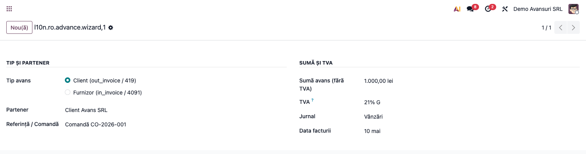
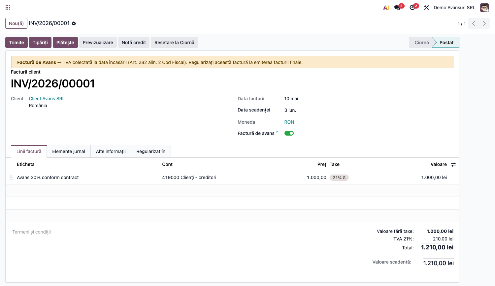
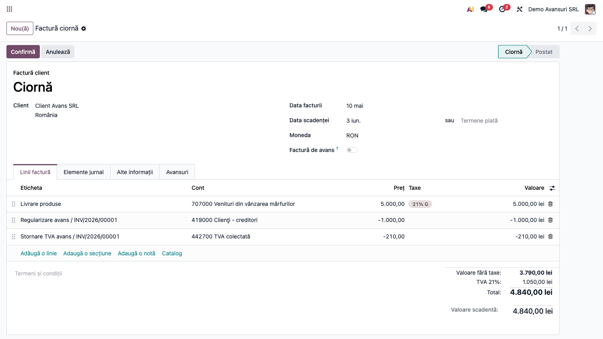
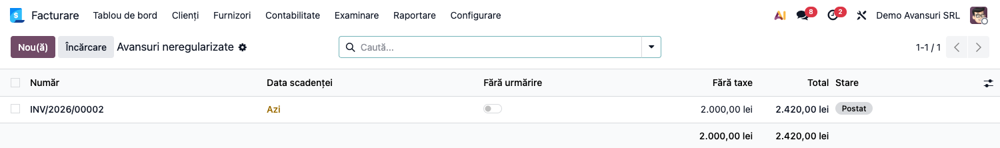

# Fișă Modul: Avansuri Clienți/Furnizori cu TVA (4091/4092/419)

**Poziție plan:** B5.1
**Modul:** `l10n_ro_advance_invoice`
**FR:** FR-34
**Capitol manual:** Cap 9.2
**Utilizator principal:** Contabil clienți/furnizori, Contabil TVA
**Prioritate:** 🔴 Ridicată (frecvent în practică)

---

## 1. Scop business

Această fișă descrie utilizarea modulului `l10n_ro_advance_invoice` pentru scenariul **Avansuri Clienți/Furnizori cu TVA (4091/4092/419)**.
Consultantul folosește documentul pentru reproducerea fluxului în baza demo și
pentru pregătirea capitolului Cap 9.2 din manualul utilizator.

## 2. Bază legală și context

Codul Fiscal art. 282 — TVA la încasarea avansului

## 3. Utilizatori și roluri

Contabil, Operator Facturare

Roluri recomandate pentru testare:
- Administrator funcțional: instalează modulul și verifică meniurile
- Utilizator operațional: rulează fluxul zilnic sau lunar
- Contabil/manager: validează rezultatele contabile și rapoartele

## 4. Conturi și date implicate

4091 (avansuri acordate furnizorilor), 419 (clienți-creditori / avansuri primite),
4427 (TVA colectată) și 4426 (TVA deductibilă).

> Notă: modulul caută contul de avans după prefixul `419` (client) și `4091` (furnizor).
> Avansurile pentru imobilizări (4092) nu sunt tratate separat.

Date minime pentru demo:
- companie românească cu localizarea contabilă instalată
- perioadă contabilă deschisă
- jurnale și conturi configurate conform scenariului
- documente de test postate, acolo unde fluxul pornește din contabilitate, stocuri, HR sau vânzări

## 5. Configurare inițială

1. Instalați modulul `l10n_ro_advance_invoice` pe baza demo.
2. Verificați dependențele cerute de manifest și meniurile nou apărute.
3. Configurați conturile, jurnalele, produsele, partenerii sau parametrii specifici fluxului.
4. Pregătiți un set minim de documente postate pentru perioada de test.
5. Verificați că utilizatorul de test are grupurile de acces necesare.

## 6. Flux de utilizare

### Pasul 1 — Emiterea facturii de avans (wizard)

Accesați **Facturare → Clienți → Factură avans** (în Enterprise, meniul rădăcină apare ca
„Contabilitate") și completați wizardul „Emitere factură avans cu TVA": tip (Client → 419 /
Furnizor → 4091), partener, sumă (fără TVA), TVA, jurnal și dată.

> La schimbarea tipului de avans, jurnalul și TVA se precompletează automat cu jurnalul și
> taxa implicită a companiei (cota standard 21%); le puteți modifica manual.



La **Creează factură avans** se generează o factură marcată ca avans, cu linia pe contul 419
(client) sau 4091 (furnizor) și TVA colectată/deductibilă. Postați-o.



Bannerul amintește baza legală (Art. 282 alin. 2 Cod Fiscal — TVA exigibilă la încasarea avansului).

### Pasul 2 — Regularizarea pe factura finală

La emiterea facturii finale, selectați avansurile în tabul **Avansuri** și aplicați-le. Modulul
adaugă automat liniile de regularizare prin **linii negative** (nu storno în roșu — `is_storno`
rămâne `False`): o linie negativă pe contul de avans (419/4091) și o linie negativă pe TVA
(4427/4426), astfel încât totalul de plată scade cu avansul deja facturat.



### Pasul 3 — Monitorizarea avansurilor neregularizate

Meniul **Facturare → Clienți → Avansuri neregularizate** deschide o listă filtrată (acțiune
`act_window` pe `account.move`, nu un raport contabil) cu facturile de avans postate care nu au
fost încă legate de o factură finală — soldul conturilor 419/4091 de urmărit la închidere.



### Note de monografie și raportare

- Factură avans **client**: **Dr 4111 = Cr 419 + Cr 4427**;
- Factură avans **furnizor**: **Dr 4091 + Dr 4426 = Cr 401**;
- regularizare la factura finală: linii negative pe contul de avans (419/4091) și pe TVA
  (4427/4426) — regularizare normală, nu storno în roșu;
- facturile de avans rămân marcate cu flag-ul `l10n_ro_is_advance`, care poate fi folosit ca
  filtru pentru raportarea avansurilor în **D394** (TipDoc=5);
- TVA aferentă avansurilor intră în **D300** prin tag-urile taxelor.

> Maparea efectivă în D394/D300 nu este realizată automat de acest modul (manifestul depinde
> doar de `account` și `l10n_ro`); ea se realizează prin modulele de declarații dacă sunt instalate.

## 7. Legături cu alte module / declarații

| Modul / proces | Rol în flux | Tip legătură |
|---|---|---|
| `account` | facturi de avans, regularizări și note contabile | dependență (manifest) |
| `l10n_ro` | plan de conturi RO (419/4091/4426/4427) | dependență (manifest) |
| `sale` / `purchase` | documente comerciale care pot genera avansuri | opțional |
| `l10n_ro_anaf_d394` | raportarea avansurilor (TipDoc=5) prin filtrul `l10n_ro_is_advance` | integrare prin convenție (nu automată) |
| `l10n_ro_anaf_d300` | TVA colectată/deductibilă aferentă avansurilor, prin tag-urile taxelor | integrare prin convenție (nu automată) |

Ce este automat: facturarea avansului și regularizarea pe factura finală.
Ce rămâne manual: verificarea conturilor 4091/419, alegerea cotei TVA și corelarea cu declarațiile
TVA (D300/D394 nu sunt alimentate automat de acest modul).

## 8. Verificări pentru consultant

- [ ] Modulul se instalează fără erori pe baza demo.
- [ ] Meniurile și acțiunile sunt vizibile pentru rolul de utilizator potrivit.
- [ ] Fluxul poate fi reprodus de la cap la coadă cu date fictive românești.
- [ ] Rezultatul contabil sau operațional corespunde descrierii din plan.
- [ ] Mesajele de eroare sunt clare pentru un utilizator non-tehnic.
- [ ] Exporturile sau rapoartele se descarcă și conțin datele testate.

## 9. Mesaje de eroare frecvente

| Mesaj / simptom | Cauză probabilă | Remediere |
|-----------------|-----------------|-----------|
| „Nu s-a găsit contul 419/4091 în planul de conturi al companiei… Verificați că modulul l10n_ro este instalat." | Planul de conturi RO nu este instalat sau compania nu este românească | Instalați localizarea `l10n_ro` și selectați planul de conturi RO pe companie |
| „Factura trebuie să fie în stare Ciornă pentru a aplica avansuri." | Ați apăsat aplicarea avansurilor pe o factură deja postată | Aplicați avansurile înainte de postare (pe ciornă) |
| „Suma avansurilor … depășește valoarea facturii finale …" | Avansurile selectate totalizează mai mult decât factura finală | Selectați doar avansurile care se încadrează în valoarea facturii |
| „Nu s-a găsit contul de avans (419/4091) pe factura …" | Factura de avans nu are linie pe contul de avans (creată manual, fără wizard) | Recreați avansul prin wizard sau corectați contul liniei de avans |
| TVA nu se precompletează în wizard | Compania nu are taxă implicită de vânzare/cumpărare setată | Setați taxa implicită în Setări contabile sau alegeți manual TVA în wizard |

## 10. Capturi de ecran

Capturile (`readme/screenshots/`) sunt **generate automat** din `tests/test_screenshots.py`
(mixinul `ScreenshotCase` din `l10n_ro_doc_screenshots`, import defensiv), în **limba română**,
pe planul de conturi RO (`setup_country("ro")` → conturile 419/4091/4092):

1. `01_wizard_avans.png` — wizardul de emitere avans, completat.
2. `02_factura_avans.png` — factura de avans (linia pe contul 419 + TVA colectată 21%).
3. `03_regularizare.png` — factura finală cu avansul regularizat (linii negative 419 + storno TVA).
4. `04_raport_avansuri.png` — raportul „Avansuri neregularizate".

Regenerare:

```bash
./odoo/odoo-bin -c odoo.conf -d <db> -i l10n_ro_advance_invoice,l10n_ro_doc_screenshots \
    --test-tags=fise_screenshots --stop-after-init
```

## 11. Observații pentru manual

În manualul final, păstrați explicația orientată pe activitatea utilizatorului:
ce problemă rezolvă modulul, când se rulează, ce date trebuie pregătite și cum se verifică rezultatul.
