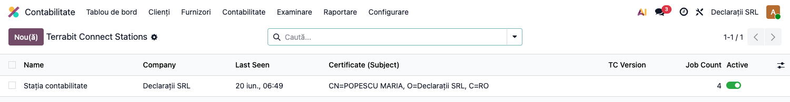
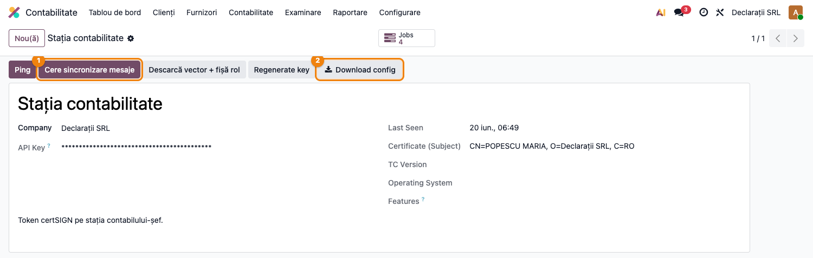
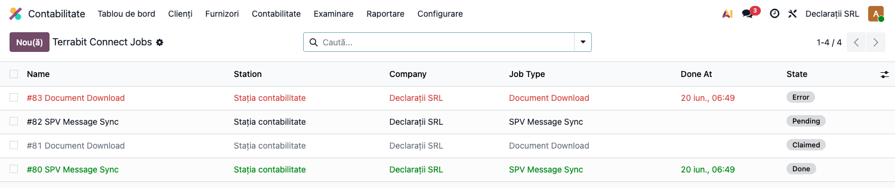

# Fișă Modul: Terrabit Connect (punte locală, model cloud)

**Modul:** `l10n_ro_anaf_agent`
**FR:** FR-53
**Utilizator principal:** Administrator funcțional / consultant la implementare; contabil șef (monitorizare)
**Prioritate:** 🟡 Medie (infrastructură — devine critică doar la instalările cloud care comunică cu ANAF)

---

## 1. Scop business

Modulul este fundația pentru **modelul cloud** de comunicare cu ANAF: serviciile SPV cu
certificat (mTLS) nu pot fi apelate direct dintr-un Odoo găzduit în cloud, pentru că
certificatul calificat stă pe **tokenul fizic de la stația contabilului**. Soluția: o
aplicație **Terrabit Connect (TC)** instalată lângă token, care **inițiază ea toate
conexiunile** outbound către Odoo (autentificată cu o cheie API) — Odoo nu se conectează
niciodată la stație.

Modulul ține registrul instanțelor TC, coada de joburi pe care TC le preia și API-ul
apelat de TC (poll / result / messages / heartbeat). Modulele consumatoare —
`l10n_ro_anaf_messages` (mesaje SPV) și `l10n_ro_anaf_submission` (depuneri) — creează
joburi aici și prelucrează rezultatele.

## 2. Bază legală și context

Context operațional, fără temei fiscal propriu: serviciile ANAF cu autentificare prin
certificat digital calificat (Spațiul Privat Virtual) cer cheia privată de pe tokenul fizic,
care nu poate părăsi stația de lucru. Arhitectura TC-cloud păstrează certificatul la
contabil și aduce rezultatele în Odoo, fără a expune Odoo către internet suplimentar
(TC se autentifică cu cheie API, conexiunile sunt doar de la TC către Odoo).

## 3. Utilizatori și roluri

Administratorul funcțional înrolează instanțele TC la implementare; contabilul șef
monitorizează starea (ultima conectare, joburi în eroare).

Roluri recomandate pentru testare:
- Administrator funcțional: creează înregistrarea TC, descarcă configurația, instalează TC
  la stație;
- Contabil/manager (grup `account.group_account_manager`): meniurile Terrabit Connect /
  Joburi TC sunt vizibile doar pentru acest grup;
- Utilizator operațional: nu interacționează direct — folosește modulele consumatoare.

## 4. Conturi și date implicate

Modulul **nu generează note contabile** și nu atinge conturi — este infrastructură de
comunicație (înregistrări TC, joburi).

Date minime pentru demo:
- companie românească cu CUI valid;
- o înregistrare TC (cheia API se generează automat la creare);
- pentru demo fără TC real, joburile pot fi create din butonul „Cere sincronizare mesaje",
  iar stările pot fi simulate — nu e nevoie de conexiune la ANAF.

## 5. Configurare inițială

1. Instalați modulul `l10n_ro_anaf_agent` (aduce automat `l10n_ro_anaf_base`).
2. Deschideți **Contabilitate → Raportare → Declarații ANAF → Terrabit Connect** și
   creați o înregistrare: nume (ex. „Stația contabilitate"), compania.
   **Cheia API** se generează automat.
3. Apăsați **Descarcă config TC** — obțineți un `agent.conf` pre-completat (URL-ul
   instanței Odoo + cheia API).
4. Descărcați installerul Terrabit Connect de pe
   [GitHub Releases](https://github.com/dhongu/terrabit-anaf-agent/releases) pentru
   sistemul de operare al stației (Windows / macOS / Linux).
5. Instalați TC la stația cu tokenul fizic și puneți `agent.conf` în
   `~/.terrabit-anaf-agent/` (sau importați-l din Setări → Importă agent.conf).
   La pornire, TC trimite **heartbeat**: în Odoo se completează „Văzut ultima dată" și
   subiectul certificatului detectat pe token.

## 6. Flux de utilizare

### Pasul 1 — Registrul Terrabit Connect

Accesați **Contabilitate → Raportare → Declarații ANAF → Terrabit Connect**. **Găsiți pe
ecran**: fiecare rând este o instanță TC înrolată, cu compania, subiectul certificatului
raportat la heartbeat și momentul ultimei conectări. **Verificați**: instanța stației
active are „Văzut ultima dată" recent (minute, nu zile) — altfel TC de la stație e oprit
sau cheia e greșită.



### Pasul 2 — Fișa TC: cheia API și configurația

Deschideți înregistrarea TC. **Găsiți pe ecran**: cheia API (secretul cu care TC se
autentifică — mascată în interfață; se livrează TC doar prin `agent.conf`), subiectul
certificatului, nota și butonul inteligent **Joburi** (numără joburile instanței).
Acțiunile din antet:
- **Cere sincronizare mesaje** — pune în coadă un job `sync_messages` (mesajele SPV pe
  ultimele 30 de zile);
- **Regenerează cheia** — invalidează cheia veche (cu confirmare; TC de la stație
  trebuie reconfigurat cu noua cheie);
- **Descarcă config TC** — `agent.conf` pre-completat.



### Pasul 3 — Coada de joburi

Accesați **Declarații ANAF → Joburi TC** (sau butonul **Joburi** de pe fișa TC).
**Găsiți pe ecran**: fiecare job are tipul (`sync_messages` / `download` / `submit`),
parametrii (JSON), starea și momentele de preluare/finalizare. Ciclul de viață:
**În așteptare** (creat de Odoo) → **Preluat** (TC l-a ridicat la poll) →
**Finalizat** / **Eroare** (cu rezultatul sau eroarea atașată).

**Verificați**: joburile nu rămân În așteptare la nesfârșit (TC oprit) și nu se
acumulează Erori (certificat expirat, SPV indisponibil — textul erorii spune cauza).
Rezultatele joburilor finalizate sunt prelucrate automat de modulul consumator (ex.
mesajele SPV apar în „Mesaje SPV ANAF").



### Note de monografie și raportare

Modulul **nu generează note contabile** (niciun Dr/Cr) — este strict infrastructură.
Efectele vizibile contabil apar în modulele consumatoare: mesajele SPV (recipise) în
`l10n_ro_anaf_messages`, depunerile în `l10n_ro_anaf_submission`.

## 7. Legături cu alte module / declarații

| Modul / proces | Rol în flux | Tip legătură |
|---|---|---|
| `l10n_ro_anaf_base` | meniul „Declarații ANAF" + infrastructura comună | dependență (manifest) |
| `l10n_ro_anaf_messages` | creează joburi `sync_messages` și ingestează mesajele din rezultat | consumator |
| `l10n_ro_anaf_submission` | poate folosi joburi pentru depuneri în modelul cloud | consumator |
| Terrabit Connect (aplicație desktop) | apelează API-ul: poll / result / messages / heartbeat | client API (cheie `X-Station-Key`) |

Ce este automat: generarea cheii API, heartbeat-ul (last_seen + certificat), preluarea și
prelucrarea rezultatelor joburilor.
Ce rămâne manual: înrolarea TC, instalarea aplicației la stație, regenerarea cheii la
nevoie, supravegherea joburilor în eroare.

## 8. Verificări pentru consultant

- [ ] Modulul se instalează fără erori pe baza demo.
- [ ] Meniurile **Terrabit Connect** și **Joburi TC** apar sub Declarații ANAF, doar pentru
      grupul Contabil șef.
- [ ] La crearea unei înregistrări TC, cheia API se generează automat.
- [ ] **Descarcă config TC** livrează un `agent.conf` cu URL-ul instanței și cheia.
- [ ] **Regenerează cheia** cere confirmare și schimbă cheia (cea veche nu mai e acceptată).
- [ ] **Cere sincronizare mesaje** creează un job `sync_messages` În așteptare.
- [ ] Butonul inteligent **Joburi** filtrează joburile instanței TC curente.
- [ ] Un heartbeat (real sau simulat) actualizează „Văzut ultima dată" și subiectul certificatului.

## 9. Mesaje de eroare frecvente

| Mesaj / simptom | Cauză probabilă | Remediere |
|-----------------|-----------------|-----------|
| „Văzut ultima dată" vechi / gol | TC oprit la stație sau cheia API greșită | Porniți TC; verificați `agent.conf` (după regenerarea cheii trebuie redescărcat) |
| Joburi blocate În așteptare | TC nu face poll (oprit / fără rețea) | Verificați serviciul TC la stație |
| Joburi în Eroare cu mesaj SPV | Certificat expirat, token scos, SPV indisponibil | Citiți eroarea jobului; verificați tokenul și certificatul la stație |
| TC primește 401 la apeluri | Cheie API regenerată în Odoo, TC are cheia veche | Redescărcați config-ul și reconfigurați TC |
| Mesajele SPV nu apar deși joburile sunt Finalizate | Modulul consumator lipsește | Instalați `l10n_ro_anaf_messages` |

## 10. Capturi de ecran

Capturile (`readme/screenshots/`) sunt **generate automat** din `tests/test_screenshots.py`,
în **limba română**; înregistrarea TC și joburile demo sunt create direct în baza de test,
fără TC real sau conexiune la ANAF:

1. `01_lista_agenti.png` — registrul TC, cu ultima conectare și certificatul.
2. `02_agent_form.png` — fișa TC: cheia API și acțiunile din antet.
3. `03_joburi.png` — coada de joburi, cu stările În așteptare / Preluat / Finalizat / Eroare.

Regenerare:

```bash
./odoo/odoo-bin -c odoo.conf -d <db> -i l10n_ro_anaf_agent,l10n_ro_doc_screenshots \
    --test-tags=fise_screenshots --stop-after-init
```

## 11. Observații pentru manual

Explicați arhitectura în termeni de încredere: certificatul nu părăsește stația
contabilului, iar Odoo din cloud nu primește niciodată conexiuni de la internet pentru
asta — TC sună „acasă". Pentru consultant, cele două puncte de diagnostic sunt
„Văzut ultima dată" (TC trăiește?) și coada de joburi (munca circulă?). Restul —
mesaje, depuneri — se urmărește în modulele consumatoare.
