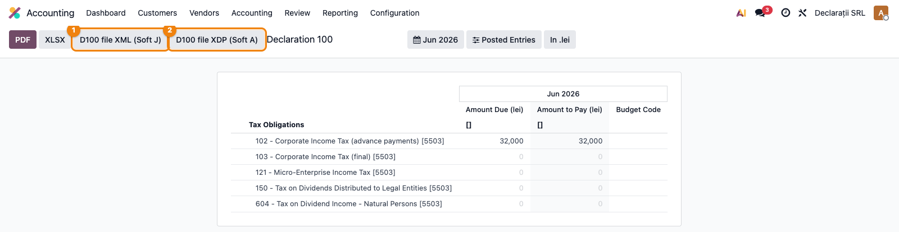

# Fișă Modul: D100 — Obligații fiscale curente

**Poziție plan:** C5
**Modul:** `l10n_ro_anaf_d100`
**FR:** FR-30 / FR-32
**Capitol manual:** Cap 4.6
**Utilizator principal:** Responsabil fiscal, Contabil șef
**Prioritate:** 🟡 Medie

---

## 1. Scop business

Modulul pregătește exportul D100 pentru obligații fiscale curente, inclusiv impozit pe profit sau micro, după caz.

## 2. Bază legală și context

D100 se depune pentru obligații fiscale declarate periodic. În manual, se documentează legătura cu calculul de impozit pe profit/micro și verificarea sumelor înainte de export.

## 3. Utilizatori și roluri

- Contabil fiscal: completează și exportă declarația.
- Contabil șef: validează suma de plată.
- Administrator: verifică datele companiei și baza ANAF.

## 4. Date implicate

- perioadă fiscală;
- obligații fiscale calculate;
- date declarant;
- coduri obligații ANAF.

## 5. Configurare inițială

1. Instalați `l10n_ro_anaf_d100`.
2. Verificați `l10n_ro_anaf_base`.
3. Pregătiți calculul de impozit sau obligația fiscală în modulul operațional.
4. Verificați codurile și perioada de raportare.

## 6. Flux de utilizare

### Pasul 1 — Deschiderea declarației

Meniu: **Contabilitate → Raportare → Declarații ANAF → Declarație 100**. Raportul afișează, pe coloanele
**Suma datorată** / **Suma de plată** și **Cod bugetar**, obligațiile fiscale ale perioadei selectate
(impozit pe profit, impozit micro, impozit pe dividende etc.), fiecare cu codul ANAF aferent.



### Pasul 2 — Verificarea sumelor

Selectați perioada (lună/trimestru). Sumele se calculează automat din soldurile conturilor de obligații
fiscale (ex. linia **102 — Impozit pe profit** din conturile 4411/691). Comparați cu calculul fiscal suport.

### Pasul 3 — Export ANAF

Apăsați **D100 file XML (Soft J)** ① pentru fișierul XML sau **D100 file XDP (Soft A)** ② pentru PDF-ul
inteligent, gata de încărcat în aplicațiile ANAF.

## 7. Legături cu alte module / declarații

| Modul / proces | Rol în flux |
|---|---|
| `l10n_ro_anaf_base` | infrastructură comună ANAF |
| `l10n_ro_micro_tax` | sursă pentru obligații micro, unde este cazul |
| `l10n_ro_profit_tax` | sursă pentru impozitul pe profit |
| `account` | note contabile și solduri fiscale |

Ce este automat: pregătirea obligațiilor fiscale curente pentru declarare.
Ce rămâne manual: validarea sumelor fiscale și a termenelor de plată.

## 8. Verificări pentru consultant

- [ ] Datele companiei sunt preluate corect.
- [ ] Obligația fiscală are suma așteptată.
- [ ] Exportul se generează.
- [ ] Declarația se poate arhiva împreună cu calculul suport.

## 9. Mesaje frecvente

| Simptom | Cauză probabilă | Remediere |
|---------|-----------------|-----------|
| Sumă lipsă | Nu există calcul suport | Rulați calculul fiscal înainte de export |
| Export incomplet | Cod obligație sau perioadă necompletate | Verificați câmpurile declarației |

## 10. Capturi de ecran

Capturile (`readme/screenshots/`) sunt **generate automat** din `tests/test_screenshots.py`
(mixinul `ScreenshotCase` din `l10n_ro_doc_screenshots`, import defensiv), în **limba română**,
pe planul de conturi RO:

1. `01_raport_d100.png` — Raportul Declarație 100 cu obligațiile fiscale și butoanele de export XML/XDP.

Regenerare:

```bash
./odoo/odoo-bin -c odoo.conf -d <db> -i l10n_ro_anaf_d100,l10n_ro_doc_screenshots \
    --test-tags=fise_screenshots --stop-after-init
```
