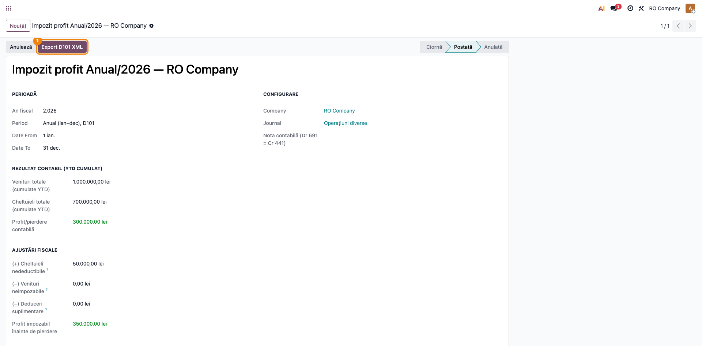
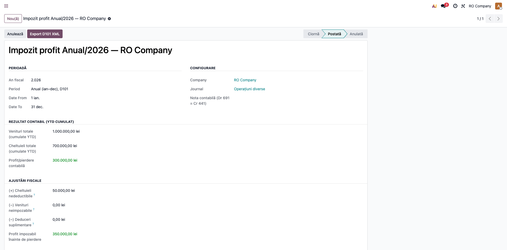

# Fișă Modul: Declarația 101 — Impozit pe Profit Anual (export XML)

**Modul:** `l10n_ro_anaf_d101`
**Utilizator principal:** Contabil-șef, Contabil impozit pe profit
**Prioritate:** 🔴 Ridicată (declarație anuală obligatorie)

---

## 1. Scop business

Modulul generează fișierul **XML al Declarației 101** (impozit pe profit anual) pentru depunerea la
ANAF, pornind de la calculul de impozit pe profit deja existent în `l10n_ro_profit_tax`. Contabilul
nu reintroduce date: alege înregistrarea de calcul anual, apasă un buton și obține XML-ul validat
împotriva schemei oficiale ANAF, gata de import în DUKIntegrator.

## 2. Bază legală și context

Legea 227/2015 (Codul fiscal), Titlul II — impozit pe profit; structura XML conform **OPANAF
206/11.02.2025** (declarație 101, schema v3). Termen de depunere: 25 a celei de-a treia/șasea luni
de la închiderea exercițiului (regula generală pentru plătitorii de impozit pe profit).

## 3. Utilizatori și roluri

Contabil-șef / contabil impozit pe profit.

Roluri recomandate pentru testare:
- Administrator funcțional: instalează modulul, verifică butonul de export.
- Contabil: rulează calculul anual și exportă XML-ul.

## 4. Conturi și date implicate

Modulul nu generează note — citește calculul din `l10n.ro.profit.tax.compute` (cont 691 „Cheltuieli
cu impozitul pe profit" / 441 „Impozitul pe profit", folosite de modulul de calcul). Date minime
pentru demo:
- companie RO cu CUI valid, adresă fiscală completă, cod CAEN și județ (necesare pentru validarea ANAF);
- o înregistrare de calcul impozit pe profit cu perioada **Anual**, postată.

## 5. Configurare inițială

1. Instalați `l10n_ro_anaf_d101` (atrage `l10n_ro_profit_tax` și `l10n_ro_anaf_base`).
2. Completați datele companiei: CUI, adresă, **cod CAEN**, județ și contactul de declarație.
3. Selectați **Tipul de impozit D101** pe înregistrarea de calcul (implicit 103 — PJ române).
4. Aveți o înregistrare de calcul impozit pe profit anuală, **postată**.

## 6. Flux de utilizare

> **Capturi:** se generează cu `fisa-screenshots` (vezi secțiunea 10); încă nu există în `readme/screenshots/`.

### Pasul 1 — Calculul anual de impozit pe profit

Deschideți înregistrarea de calcul impozit pe profit (`l10n.ro.profit.tax.compute`) pentru perioada
**Anual**, verificați valorile (venituri, cheltuieli, ajustări, pierdere dedusă, impozit) și
**postați-o**. Exportul D101 este disponibil doar pe perioada Anual și doar după postare.



### Pasul 2 — Verificarea indicatorilor înainte de export

În corpul înregistrării, verificați pe ecran că: profitul impozabil, baza impozabilă și impozitul
calculat corespund balanței; pierderea dedusă respectă limita de 70%; tipul de impozit (cod obligație)
e corect. Acestea devin indicatorii P1–P53 ai declarației.



### Pasul 3 — Exportul XML D101

Apăsați butonul **Export D101 XML**. Sistemul construiește elementul `declaratie101` (schema v3),
calculează numărul de evidență a plății și scadența, **validează XML-ul împotriva XSD-ului oficial**
și oferă fișierul spre descărcare. Importați-l în **DUKIntegrator** pentru depunere. Exemplu de
fișier generat (pentru venituri 1.000.000, cheltuieli 700.000, cheltuieli nedeductibile 50.000 lei):

```xml
<declaratie101 xmlns="mfp:anaf:dgti:d101:declaratie:v3" an="2026" an_i="2026" luna="12" luna_i="1"
               cod_obligatie="103" data_i="01.01.2026" data_s="31.12.2026" scadenta="251826"
               cod_bug="20470101" nr_evid="11103011226251826000042" totalPlata_A="3868000"
               cif="14399840" caen="6201" denumire="RO Company"
               P1="1000000" P2="700000" P3="300000" P7="300000" P10="300000"
               P22="300000" P34="50000" P35="350000" P40="350000"
               P411="56000" P41="56000" P48="56000" P52="56000"/>
```

### Note de monografie și raportare

Modulul **nu generează note contabile** — nota `Dr 691 = Cr 441` aparține modulului de calcul
(`l10n_ro_profit_tax`). D101 mapează valorile calculate pe indicatorii P1–P53:

```xml
<declaratie101 an="2026" cod_obligatie="103" cif="..." den="..."
               P1="..." P2="..." P35="..." P40="..." P411="..." P48="..." P52="...">
</declaratie101>
```

> **Limitare:** exportul automat acoperă scenariul de **profit**. Pentru exerciții cu pierdere
> fiscală (indicatori care ar deveni negativi), declarația se completează manual.

## 7. Legături cu alte module / declarații

| Modul | Rol |
|---|---|
| `l10n_ro_profit_tax` | Sursa calculului (venituri, cheltuieli, ajustări, pierdere, impozit). |
| `l10n_ro_anaf_base` | Infrastructura ANAF: date declarant, validare companie, validare XSD, profile versionate. |
| `l10n_ro_anaf_d100` | Declarația trimestrială D100 (plăți anticipate), complementară D101 anual. |

**Ce e automat:** maparea pe indicatori, nr. de evidență, scadența, validarea XSD, fișierul XML.
**Ce rămâne manual:** verificarea calculului anual și a datelor companiei; scenariul de pierdere.

## 8. Verificări pentru consultant

- [ ] Exportul D101 e disponibil doar pe o înregistrare cu perioada **Anual** și **postată**.
- [ ] O înregistrare în ciornă sau trimestrială nu permite exportul (mesaj clar).
- [ ] XML-ul generat trece validarea XSD (fără excepție la export).
- [ ] Indicatorii P (profit impozabil, bază, impozit) corespund calculului din `l10n_ro_profit_tax`.
- [ ] Fișierul descărcat se importă fără erori în DUKIntegrator.

## 9. Mesaje de eroare frecvente

| Mesaj | Cauză | Remediere |
|---|---|---|
| „The D101 return is annual…" | Export încercat pe o perioadă trimestrială | Selectați înregistrarea anuală |
| „Compute and post the profit tax…" | Înregistrare în ciornă | Postați calculul de impozit pe profit |
| Eroare validare companie (CUI/CAEN/județ) | Date fiscale incomplete | Completați CUI, adresă, CAEN, județ pe companie |
| „…indicators would be negative…" | Exercițiu cu pierdere fiscală | Completați D101 manual pentru scenariul de pierdere |

## 10. Capturi de ecran

Se **generează automat** din `tests/test_screenshots.py` (mixin `ScreenshotCase`), în RO, pe planul RO.
La momentul redactării **nu există încă** — rulați `fisa-screenshots`. Lista planificată:

1. `01_calcul_anual.png` — calcul impozit profit, perioada Anual, postat (cu butonul Export D101 XML).
2. `02_indicatori.png` — formularul complet cu indicatorii de calcul (bază, impozit, deduceri).

Fișierul XML rezultat este redat ca **extras de cod** în pasul 3 al fluxului (nu ca imagine).

```bash
./odoo/odoo-bin -c odoo.conf -d test19 -u l10n_ro_anaf_d101 \
  --test-tags=fise_screenshots --stop-after-init
```

## 11. Observații pentru manual

- Subliniați că D101 reutilizează calculul din `l10n_ro_profit_tax` — nu se reintroduc date.
- Menționați validarea XSD la export (garanție că fișierul e acceptat de ANAF/DUKIntegrator).
- Documentați explicit limitarea pe scenariul de pierdere (completare manuală).
- Explicați codurile de obligație (102/103/104/105) și când se aleg.
