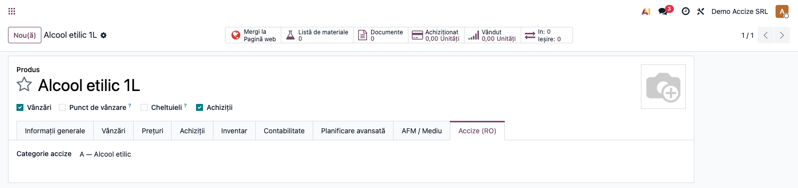
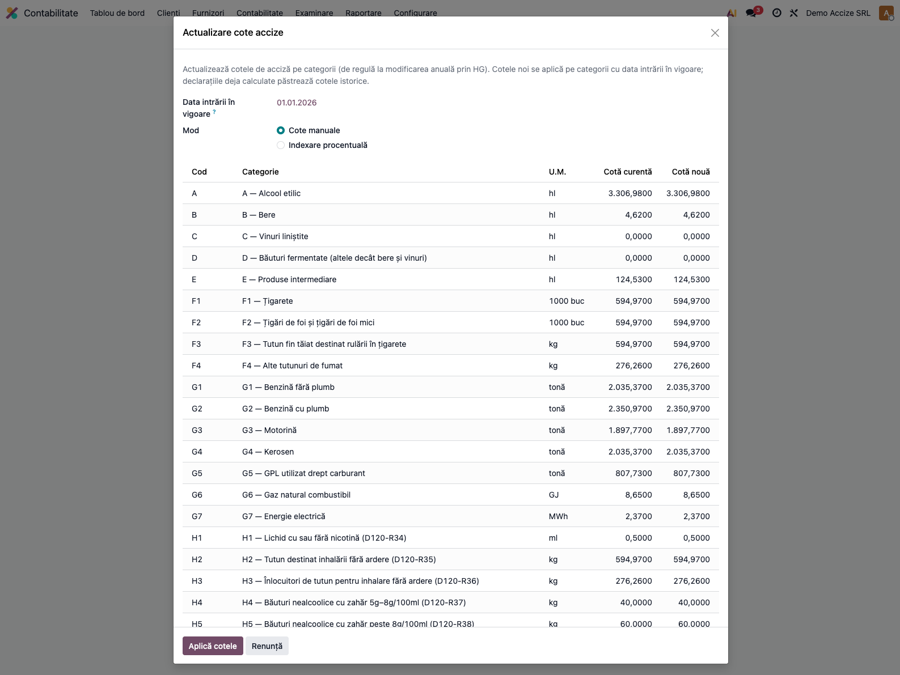
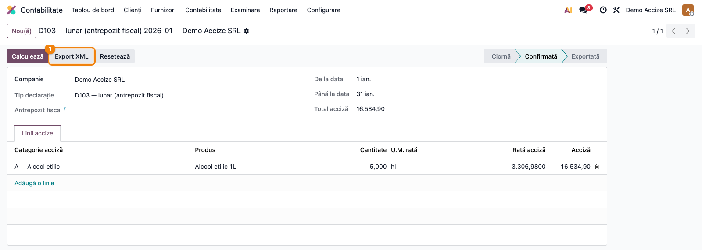

# Fișă Modul: D103 — Decont lunar privind accizele (antrepozit fiscal)

**Modul:** `l10n_ro_anaf_d103` (peste infrastructura `l10n_ro_excise`)
**FR:** FR-42
**Capitol manual:** Cap 14.1
**Utilizator principal:** Responsabil accize, Contabil
**Prioritate:** 🔴 Ridicată (obligație lunară pentru antrepozitarii autorizați)

---

## 1. Scop business

Modulul `l10n_ro_anaf_d103` adaugă **exportul XML al Decontului lunar D103** peste infrastructura de
**accize** din `l10n_ro_excise` (categoriile de produse accizabile cu cotele legale, marcarea
produselor, calculul accizei `cantitate × cotă` din facturile postate și modelul de declarație).
D103 este decontul depus lunar de **antrepozitarii fiscali autorizați**.

D103 este decontul **lunar** al antrepozitului fiscal — distinct de D120 (decontul anual, tratat de
modulul separat `l10n_ro_anaf_d120`, care extinde aceeași declarație). Pe o declarație de tip D103,
butonul **Export XML** generează fișierul în formatul D103 (`D103_<CUI>_<AAAALL>.xml`).

## 2. Bază legală și context

Codul Fiscal **Titlul VIII** (accize și alte taxe speciale), art. 336–439 — accize armonizate (alcool,
bere, vinuri, produse intermediare, tutun, produse energetice, energie electrică). Decontul **D103** se
depune **lunar** de antrepozitarii fiscali autorizați, cu accizele datorate pe categorii de produse
accizabile pentru luna de raportare. Termenul de depunere este **data de 25 a lunii următoare** lunii
de raportare. Cotele de acciză se actualizează periodic prin **HG de indexare** (de regulă cu aplicare
de la 1 ianuarie / 1 iulie).

> Cotele din `data/excise_category_data.xml` sunt valorile de referință (2025). Verificați și
> actualizați-le anual conform HG de indexare, folosind wizardul „Actualizare cote (HG)" (vezi 5.2).

## 3. Utilizatori și roluri

- **Responsabil accize** — întocmește decontul lunar și exportă XML-ul.
- **Contabil** — marchează produsele accizabile, verifică liniile și totalul.
- **Manager Contabilitate** — aprobă și arhivează depunerea.

Roluri recomandate pentru testare:
- Administrator funcțional: instalează modulul, verifică meniurile și categoriile de accize;
- Utilizator operațional: marchează un produs, reproduce un decont D103 lunar;
- Contabil/manager: validează totalul accizei și exportul XML.

## 4. Conturi și date implicate

D103 este o **declarație de raportare** — modulul **nu generează note contabile proprii**. Acciza
datorată se înregistrează prin documentele operaționale (de regulă în contul **446** „Alte impozite,
taxe și vărsăminte asimilate", analitic accize), nu prin decont. Decontul citește liniile pe
**categorie de acciză**: cantitatea × cota → acciza datorată.

Date minime pentru demo:
- compania RO cu **CUI, CAEN și adresă** completate (cerute la export);
- categorii de accize configurate (`l10n_ro_excise` — A Alcool etilic, B Bere, G3 Motorină etc.);
- cel puțin un **produs marcat** cu o categorie de acciză;
- facturi postate cu produse accizabile (pentru calcul automat) sau linii introduse manual.

## 5. Configurare inițială

1. Instalați `l10n_ro_anaf_d103` (instalează automat infrastructura `l10n_ro_excise`).
2. Verificați **categoriile de accize** și cotele în vigoare în
   **Contabilitate → Raportare → Accize → Categorii produse accizabile**.
3. Completați **CUI, CAEN și adresa companiei** — cerute la generarea XML.
4. Configurați, dacă e cazul, **antrepozitele fiscale**
   (Contabilitate → Raportare → Accize → Antrepozite fiscale).

### 5.1 Marcarea produselor accizabile

Pe fișa produsului (**Vânzări/Inventar → Produse → Produs**), în tab-ul **Accize (RO)**, setați
**Categoria de acciză** (ex. `A — Alcool etilic`). Cota se preia automat din categoria selectată;
tab-ul este vizibil pentru utilizatorii cu drepturi contabile.



### 5.2 Actualizarea cotelor (HG)

Când apare o HG de indexare, folosiți wizardul **Contabilitate → Raportare → Accize →
Actualizare cote (HG)**:

1. Setați **Data intrării în vigoare** (de regulă 1 ianuarie / 1 iulie conform HG).
2. Alegeți modul: **cote manuale** (editați cota nouă per categorie) sau **indexare procentuală**
   (aplică +X% pe cota curentă, pentru toate categoriile).
3. Apăsați **Aplică cotele** — noile cote se setează pe categorii; declarațiile deja calculate
   păstrează cotele istorice (snapshot pe linie).



## 6. Flux de utilizare

### Pasul 1 — Întocmirea decontului lunar D103

Meniu: **Contabilitate → Raportare → Accize → Declarații accize**. Creați o declarație cu **tipul
D103 — lunar (antrepozit fiscal)**, perioada lunii de raportare (de la prima până la ultima zi a
lunii) și, opțional, **antrepozitul fiscal**. Populați liniile pe una din cele două căi
**alternative**:

- **Automat** — apăsați **Calculează**: modulul **reconstruiește** liniile din facturile postate
  (clienți) cu produse accizabile din perioadă (⚠️ șterge liniile existente) și trece declarația în
  starea **Confirmată**;
- **Manual** — completați liniile direct în tab-ul „Linii accize", apoi confirmați. **Nu** mai apăsați
  Calculează după completarea manuală, altfel liniile introduse se pierd.

**Găsește pe ecran → verifică → continuă:**
1. **Găsește** — în tab-ul „Linii accize", fiecare rând are: categoria, produsul, cantitatea, U.M.
   cotei, cota și acciza calculată. În antet, **Total acciză** însumează liniile.
2. **Verifică** — perioada e luna corectă; categoriile corespund produselor; cantitățile sunt în
   unitatea fiscală corectă; cotele sunt cele în vigoare pentru lună; totalul corespunde sumei
   liniilor.
3. **Continuă** — abia după ce liniile sunt corecte, treceți la export.



### Pasul 2 — Export XML ANAF

Pe o declarație **confirmată**, apăsați **Export XML**. Pentru tipul D103, modulul randează
template-ul XML D103 (`D103_<CUI>_<AAAALL>.xml`); după export declarația trece în starea
**Exportată**. Arhivați fișierul și dovada depunerii pe portalul ANAF.

Structura XML generată (extras ilustrativ — antet + o linie + total):

```xml
<?xml version="1.0" encoding="UTF-8"?>
<declaratie>
  <tip>D103</tip>
  <antet>
    <cif>20603502</cif>
    <denumire>Demo Accize SRL</denumire>
    <luna>1</luna>
    <an>2026</an>
  </antet>
  <produse>
    <produs>
      <categorie>A</categorie>
      <denumire>Alcool etilic</denumire>
      <cantitate>5.000</cantitate>
      <um>hl</um>
      <acciza>16534.90</acciza>
    </produs>
  </produse>
  <totalAcciza>16534.90</totalAcciza>
</declaratie>
```

> Antetul preia CUI-ul companiei fără prefixul „RO", denumirea, luna și anul din perioada declarației.
> Fiecare `<produs>` reprezintă o categorie de acciză, iar `<totalAcciza>` este suma liniilor.

### Note de monografie și raportare

- D103 **nu generează note contabile proprii** — este o declarație de raportare; acciza datorată se
  înregistrează la momentul exigibilității (de regulă în contul **446**), prin documentele curente.
- Liniile decontului sunt agregate per **categorie de acciză** (cantitate × cotă), din facturile
  postate de tip „Factură client" / „Notă de credit client" (storno cu semn negativ) din perioadă.
- Constrângere: nu pot exista două declarații cu aceeași companie, tip și perioadă (cheie unică).

## 7. Legături cu alte module / declarații

| Modul / proces | Rol în flux |
|---|---|
| `l10n_ro_excise` | infrastructura de accize: categorii, marcare produse, cote, model declarație (dependență) |
| `account` | facturile postate care alimentează liniile decontului |
| `l10n_ro_anaf_base` | infrastructură comună ANAF (validare companie, profil declarație) |
| `l10n_ro_anaf_d120` | modul-soră peste aceeași infrastructură, pentru **D120** (decontul anual) — vezi fișa lui |

Ce este automat: agregarea liniilor din facturi (Calculează), calculul accizei și totalul, generarea
XML-ului D103.
Ce rămâne manual: marcarea produselor, verificarea cotelor în vigoare, actualizarea cotelor la HG și
depunerea pe portalul ANAF.

## 8. Verificări pentru consultant

- [ ] Produsul accizabil are categoria setată în tab-ul **Accize (RO)**.
- [ ] Wizardul „Actualizare cote (HG)" aplică noile cote pe categorii cu data intrării în vigoare.
- [ ] Declarația de tip **D103** afișează butonul **Export XML** (în starea Confirmată/Exportată).
- [ ] Perioada declarației acoperă **o lună** (prima – ultima zi).
- [ ] Liniile au categorie, cantitate, U.M., cotă și acciza calculată corect.
- [ ] Pentru categoriile pe **alcool pur** (A — alcool etilic, E — produse intermediare), cantitatea
      a fost adusă manual la unitatea fiscală (hl alcool pur, în funcție de concentrație) — modulul
      calculează acciza ca `cantitate × cotă`, fără conversia automată a concentrației.
- [ ] Totalul accizei din antet corespunde sumei liniilor.
- [ ] XML-ul exportat conține `<tip>D103</tip>`, antetul cu CUI/lună/an și `<totalAcciza>`.
- [ ] Numele fișierului are forma `D103_<CUI>_<AAAALL>.xml`.

## 9. Mesaje de eroare frecvente

| Simptom | Cauză probabilă | Remediere |
|---------|-----------------|-----------|
| Butonul Export XML nu apare | Declarația este în Ciornă | Apăsați **Calculează** (sau confirmați) |
| „Declarația exportată nu poate fi recalculată." | Ați apăsat Calculează pe o declarație deja Exportată | Resetați la Ciornă doar dacă e permis, altfel creați o declarație nouă |
| Export gol / fără linii | Nu există facturi postate cu produse accizabile în perioadă | Marcați produsele, postați facturile sau adăugați linii manual |
| Liniile dispar după Calculează | Ați completat manual și apoi ați apăsat Calculează (care șterge liniile) | Folosiți o singură cale: automat **sau** manual |
| „Există deja o declarație … pentru aceeași companie, perioadă și tip." | Duplicat pe (companie, tip, perioadă) | Editați declarația existentă, nu creați alta identică |

## 10. Capturi de ecran

Capturile (`readme/screenshots/`) sunt **generate automat** din `tests/test_screenshots.py`
(mixinul `ScreenshotCase` din `l10n_ro_doc_screenshots`, import defensiv), în **limba română**,
pe planul de conturi RO:

1. `01_produs_acciza.png` — produs cu tab **Accize (RO)** și categorie de acciză selectată.
2. `02_wizard_cote.png` — wizardul **Actualizare cote (HG)** (cote manuale / indexare procentuală).
3. `03_declaratie_d103.png` — declarația **D103** (confirmată) cu liniile pe categorii și butonul
   Export XML.

Regenerare:

```bash
./odoo/odoo-bin -c odoo.conf -d <db> -i l10n_ro_anaf_d103,l10n_ro_doc_screenshots \
    --test-tags=fise_screenshots --stop-after-init
```

## 11. Observații pentru manual

În manualul final, păstrați separarea clară între **D103** (decont **lunar**, antrepozit fiscal —
acest modul) și **D120** (decont **anual** — modulul `l10n_ro_anaf_d120`). Subliniați fluxul
operatorului: marcarea produselor → actualizarea cotelor la HG → întocmirea decontului lunar
(Calculează sau manual) → verificarea liniilor pe ecran → Export XML → depunere ANAF. Reamintiți
verificarea datelor de identificare ale companiei (CUI/CAEN/adresă) și a cotelor în vigoare pentru
luna de raportare.
