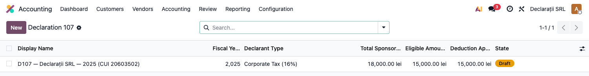
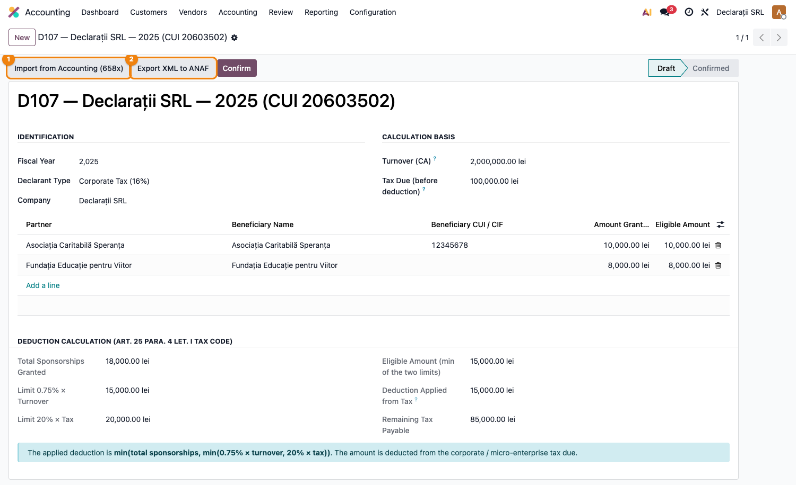

# Fișă Modul: Declarația 107 — Sponsorizări

**Modul:** `l10n_ro_anaf_d107`
**Capitol manual:** Cap 4.3 — Declarația 107 — Sponsorizări
**Utilizator principal:** Contabil, Responsabil Fiscal
**Prioritate:** 🟢 Standard (termen anual)

---

## 1. Scop business

Contribuabilii plătitori de impozit pe profit sau impozit micro care au acordat
**sponsorizări sau burse private** trebuie să depună anual **Declarația 107**.

Modulul:
1. Preia automat sponsorizările din contabilitate (conturile 658x)
2. Calculează scăzământul conform formulei legale
3. Generează XML-ul validat pentru depunere în SPV ANAF

---

## 2. Bază legală

- **Codul Fiscal art. 25 alin. (4) lit. i** — deductibilitatea sponsorizărilor
- **Codul Fiscal art. 56** — impozit micro: scăzământ din impozit pentru sponsorizări
- **Formula scăzământ:**
  `scăzământ = min(total sponsorizări, min(0,75% × CA ; 20% × impozit datorat))`
- **Termen depunere:** anual, odată cu declarația de impozit (D101/D300 micro)

---

## 3. Utilizatori și roluri

| Rol | Acțiune |
|-----|---------|
| Contabil | Import date, verificare, calcul scăzământ |
| Responsabil Fiscal | Export XML și depunere în SPV |

---

## 4. Configurare inițială

Sponsorizările trebuie înregistrate în contabilitate pe **conturile 658x** (Alte cheltuieli
de exploatare) cu partenerul beneficiar (ONG, asociație, fundație etc.).

Verificare: **Contabilitate → Configurare → Planul de Conturi → 658** → verificați că există
contul 6582 (Despăgubiri, amenzi și penalități) sau un analitic dedicat sponsorizărilor.

---

## 5. Flux de utilizare

### Pasul 1 — Accesare

**Contabilitate → Declarații ANAF → Declarație 107 (Sponsorizări)**



### Pasul 2 — Creare declarație nouă

Click **Nou** și completați:

| Câmp | Exemplu |
|------|---------|
| **An fiscal** | `2025` |
| **Cifra de afaceri** | `5.000.000 RON` (din balanță) |
| **Impozit datorat** | `80.000 RON` (din D101/D300 micro) |

### Pasul 3 — Import din contabilitate

Click **Importă din contabilitate** → sistemul preia automat:
- Toate înregistrările din conturile 658x pe parcursul anului fiscal
- Grupate pe parteneri beneficiari (ONG-uri, instituții etc.)
- Cu suma totală acordată per partener



Butonul **Importă din contabilitate (658x)** ① preia automat sponsorizările; **Export XML ANAF** ②
generează fișierul pentru Soft J.

### Pasul 4 — Verificare și calcul automat scăzământ

Sistemul calculează automat:

| Indicator | Formula | Exemplu |
|-----------|---------|---------|
| **Limita 1** | 0,75% × CA | 0,75% × 5.000.000 = **37.500 RON** |
| **Limita 2** | 20% × impozit | 20% × 80.000 = **16.000 RON** |
| **Scăzământ maxim** | min(limita 1, limita 2) | min(37.500, 16.000) = **16.000 RON** |
| **Total sponsorizări** | Din 658x | Ex: 12.000 RON |
| **Scăzământ efectiv** | min(total, max) | min(12.000, 16.000) = **12.000 RON** |
| **Suma nedeductibilă** | Total − scăzământ | 12.000 − 12.000 = **0 RON** |

Secțiunea **Calcul scăzământ** din formular (vezi captura de la Pasul 3) afișează aceste valori.

### Pasul 5 — Export XML

Click **Exportă XML** → sistemul:
1. Validează datele față de schema XSD ANAF
2. Generează fișierul `D107_2025_RXXXXXXX.xml`
3. Descarcă fișierul pentru depunere prin Soft J ANAF

### Pasul 6 — Confirmare

Click **Confirmă** → declarația se blochează, nu mai poate fi modificată.

---

## 6. Legături cu alte module / declarații

| Modul / declarație | Rol în flux |
|---|---|
| `l10n_ro_anaf_base` | infrastructură comună pentru declarații ANAF |
| `l10n_ro_profit_tax` | calcul impozit pe profit și limită sponsorizări |
| `l10n_ro_micro_tax` | calcul impozit micro și scăzământ sponsorizări |
| D100/D101 | sursa valorii impozitului datorat pentru limită |
| D205 | raportări anuale distincte pentru venituri cu reținere la sursă, unde este cazul |

Ce este automat: importul liniilor din contabilitate și calculul scăzământului.
Ce rămâne manual: verificarea CA, impozitului datorat și depunerea dacă nu există submission local.

## 7. Ce trebuie verificat înainte de export

- [ ] Toate sponsorizările din 2025 sunt înregistrate în 658x (nu în alte conturi)
- [ ] Partenerii beneficiari au CUI corect (verificați în fișa partenerului)
- [ ] Cifra de afaceri introdusă corespunde cu contul 704+706+707+708 din balanță
- [ ] Impozitul datorat corespunde cu D101 sau D300 micro din același an

---

## 8. Mesaje de eroare frecvente

| Mesaj | Cauză | Remediere |
|-------|-------|-----------|
| „CUI partener lipsă" | ONG-ul nu are CUI completat | Completați CUI-ul pe fișa partenerului |
| „Validare XSD eșuată" | Câmp lipsă sau format incorect | Verificați câmpul indicat în eroare |
| „Nicio sponsorizare importată" | Contul 658x nu are rulaj | Verificați că înregistrările sunt postate și pe contul corect |
| „Scăzământ = 0" | Normal dacă impozitul datorat = 0 | Firma nu datorează impozit → scăzământul este 0 |

---

## 9. Capturi de ecran

Capturile (`readme/screenshots/`) sunt **generate automat** din `tests/test_screenshots.py`
(mixinul `ScreenshotCase` din `l10n_ro_doc_screenshots`, import defensiv), în **limba română**,
pe planul de conturi RO:

1. `01_lista_d107.png` — Lista declarațiilor D107.
2. `02_formular_d107.png` — Formularul cu sponsorizările, calculul scăzământului și butoanele de acțiune.

Regenerare:

```bash
./odoo/odoo-bin -c odoo.conf -d <db> -i l10n_ro_anaf_d107,l10n_ro_doc_screenshots \
    --test-tags=fise_screenshots --stop-after-init
```
