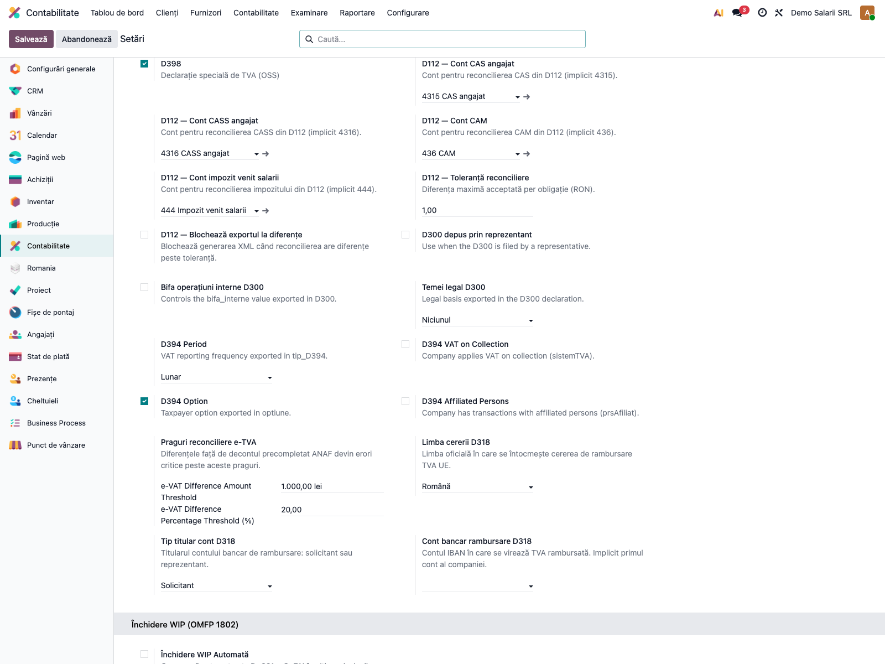
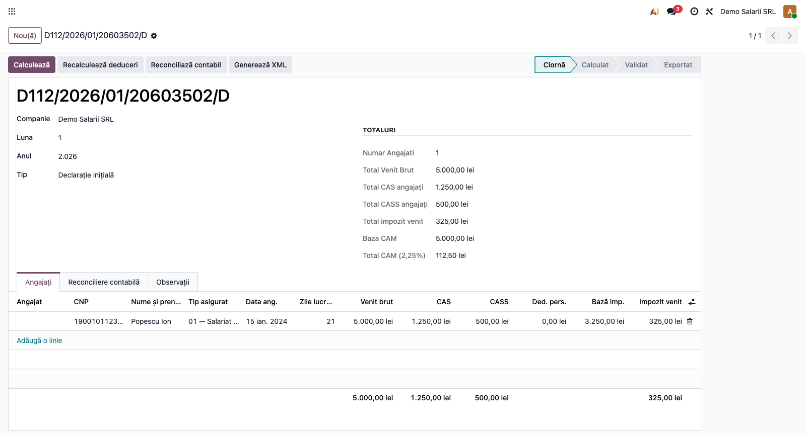
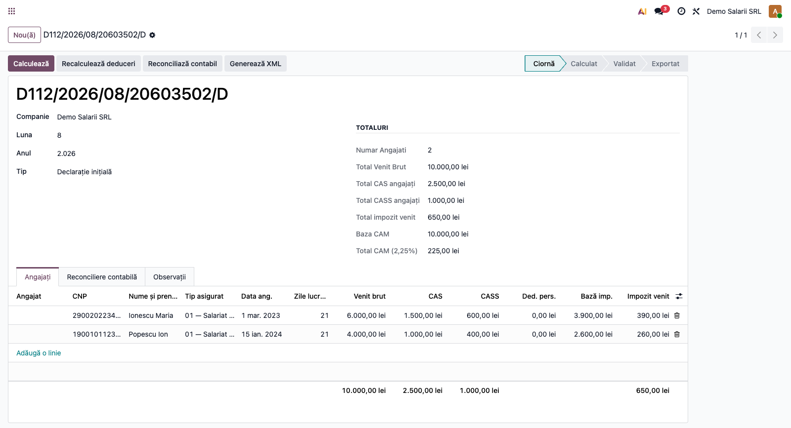
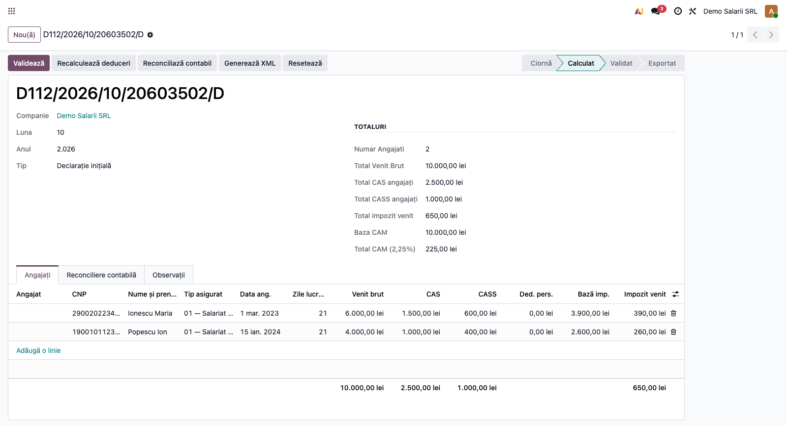
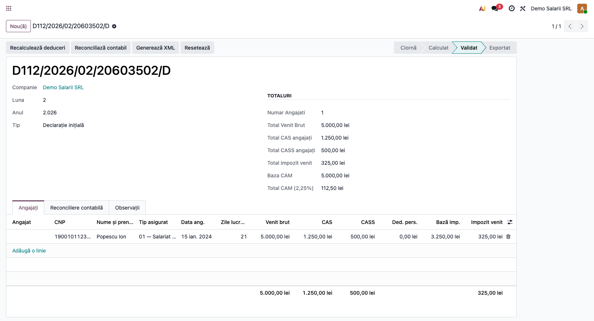
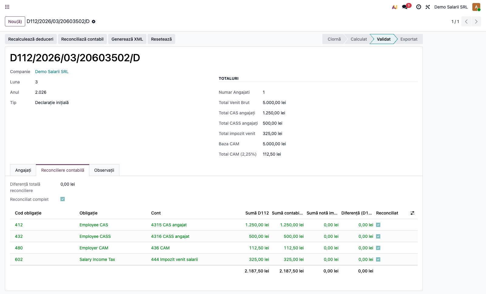
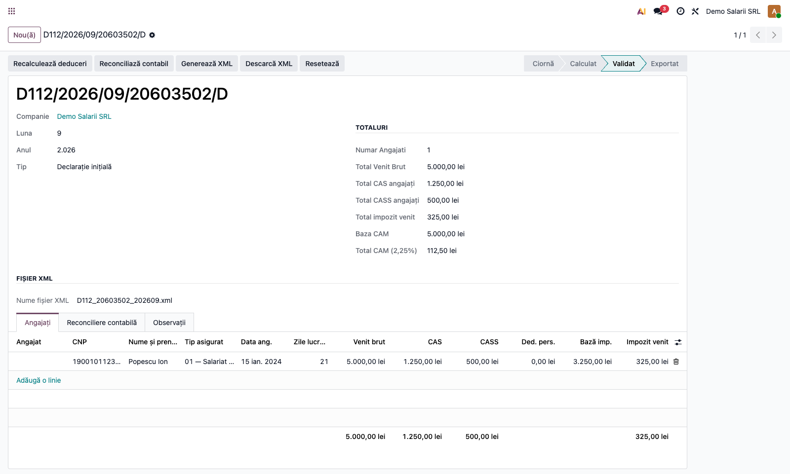
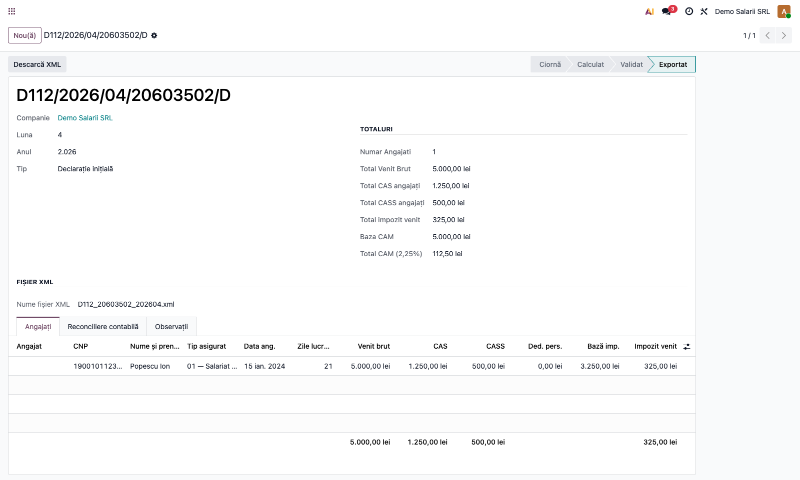

# Fișă Modul: Declarația D112 — obligații salariale

**Poziție plan:** C8.1
**Modul:** `l10n_ro_anaf_d112`
**FR:** FR-44
**Capitol manual:** Cap 4.9 — Declarația D112
**Utilizator principal:** Contabil salarii, Responsabil fiscal
**Prioritate:** 🔴 Ridicată (declarație lunară obligatorie, impact HR direct)

---

## 1. Scop business

Modulul pregătește declarația lunară **D112** — obligațiile privind contribuțiile sociale
(CAS, CASS, CAM), impozitul pe veniturile din salarii și evidența nominală a persoanelor
asigurate — și produce fișierul **XML conform structurii oficiale ANAF**, validat contra schemei.

Consultantul poate demonstra:

- crearea declarației pe lună și companie, cu state machine ciornă → calculat → validat → exportat;
- preluarea automată a valorilor din `hr.payslip` (când payroll este instalat) sau completarea manuală;
- **reconcilierea contabilă** a totalurilor declarației cu rulajul conturilor de salarii și cu nota
  contabilă importată din sisteme externe;
- generarea și validarea XML-ului D112, apoi descărcarea pentru depunere.

Modulul nu înlocuiește motorul de salarizare și nu depune automat declarația în SPV.

---

## 2. Bază legală și context

- **Codul Fiscal — Legea nr. 227/2015**: Titlul IV (contribuții sociale — CAS, CASS, CAM) și
  Titlul V (impozit pe veniturile din salarii).
- **Ordinul ANAF pentru formularul D112** și specificațiile XML (`declaratieUnica`, versiunea curentă).
- **OMFP 1802/2014**: conturile de evidență a obligațiilor salariale (431x, 436, 444).
- **Termen operațional uzual:** depunere lunară până la data de 25 a lunii următoare.

---

## 3. Utilizatori și roluri

| Rol | Acțiune |
|-----|---------|
| Contabil salarii | Creează declarația, verifică liniile nominale și totalurile |
| Responsabil fiscal | Generează XML-ul și coordonează depunerea |
| Contabil-șef | Verifică reconcilierea cu contabilitatea și aprobă varianta finală |
| HR / Payroll | Menține datele angajaților, CNP și statele de plată sursă |

Roluri Odoo recomandate la testare: `account.group_account_user` (citire) și
`account.group_account_manager` (creare/validare/reset).

---

## 4. Conturi și date implicate

Conturi de obligații salariale urmărite la reconciliere (OMFP 1802):

| Cont | Obligație D112 | Cod obligație XML |
|------|----------------|-------------------|
| 4315 | CAS reținut de la angajați | 412 |
| 4316 | CASS reținut de la angajați | 432 |
| 436  | CAM (contribuția asiguratorie pentru muncă) | 480 |
| 444  | Impozit pe veniturile din salarii | 602 |
| 431x* | CAS suplimentar angajator — condiții deosebite (+4%) | 481 |
| 431x* | CAS suplimentar angajator — condiții speciale (+8%) | 482 |

\* CAS-ul suplimentar al **angajatorului** se evidențiază pe un analitic 431x **distinct** de 4315
(care reflectă CAS-ul reținut de la angajați), nu pe același cont.

Tichetele de masă (câmpul *Tichete de masă* de pe linia nominală) intră în **baza CASS** și în
**baza de impozit**, dar sunt **scutite de CAS și CAM** — baza CAS și fondul pentru CAM nu le includ.

Date minime pentru demo:

- companie românească cu localizarea contabilă RO instalată și **cod CAEN** valid;
- persoană responsabilă declarații ANAF configurată (nume/prenume/funcție/CNP/e-mail/telefon);
- 1-2 angajați de test cu CNP valid și state de plată finalizate în luna selectată;
- opțional: notă de salarii contabilizată (din `l10n_ro_payroll_import`) pentru reconciliere.

---

## 5. Configurare inițială

### 5.1 Instalare și dependențe

| Modul | Rol |
|------|-----|
| `l10n_ro_anaf_d112` | declarația D112 |
| `l10n_ro_anaf_base` | infrastructură ANAF comună (date companie, declarant, validare XSD) |
| `l10n_ro_reports` | tabloul de declarații (`account.return`) și raportul de previzualizare |
| `hr` | date angajați |
| `hr_payroll` / `hr.payslip` | sursa automată pentru calcul, dacă payroll există |
| `l10n_ro_payroll_import` | opțional, pentru reconciliere cu nota contabilă de salarii |

Dacă payroll nu este instalat, butonul **Calculează** nu aduce state de plată și liniile se
completează manual.

> **Notă CAEN:** codul CAEN al companiei (`l10n_ro_caen_code`) este obligatoriu în XML și provine din
> stack-ul de localizare RO (OCA `l10n_ro_config`). Modulul nu îl declară explicit ca dependență
> (consistent cu celelalte module ANAF), dar câmpul trebuie să existe și să fie completat cu un cod
> valid pe instanțele unde se generează D112.

### 5.2 Date companie și declarant ANAF

**Setări → Contabilitate → Declarații ANAF → Persoana responsabilă**

| Câmp | Unde se verifică | Obligatoriu la export |
|------|------------------|-----------------------|
| CUI | Companie | Da |
| **Cod CAEN** (`l10n_ro_caen_code`) | Contact companie | **Da** — cod valid din nomenclatorul ANAF; altfel exportul eșuează la validarea XSD |
| Stradă, Localitate, Cod poștal, Țară | Contact companie | Da |
| Județ (derivă casa de sănătate `casaAng`) | Contact companie | Da |
| Persoană responsabilă declarații | Setări ANAF | Da |
| Funcție declarant | Fișa persoanei de contact | Da |
| CNP/CUI declarant | Setări ANAF / contact | Da |
| E-mail și telefon declarant | Fișa persoanei de contact | Da |

### 5.3 Conturi de reconciliere D112

**Setări → Contabilitate → Declarații ANAF** (secțiunea D112)

Configurați conturile pentru reconcilierea cu contabilitatea (CAS, CASS, CAM, impozit), **toleranța**
acceptată (implicit 1 RON) și, opțional, **blocarea exportului** când reconcilierea prezintă diferențe
peste toleranță. Dacă un cont nu este setat, modulul îl caută automat după codul standard
(4315/4316/436/444) în planul companiei.



### 5.4 Date salariale minime

| Obiect | Cerință minimă |
|--------|----------------|
| Angajat | nume și CNP complet; dată angajare pe contract |
| Stat de plată | stare `done` sau `paid` în luna declarată |
| Linii payslip | coduri `GROSS`, `CAS`, `CASS`, `INCOMETAX`; opțional `BASIC`, `WORK100` |

---

## 6. Flux de utilizare

### Pasul 1 — Crearea declarației

Accesați **Contabilitate → Raportare → Declarația D112**, apăsați **Nou** și completați antetul.

> **Raport de previzualizare:** meniul **Contabilitate → Raportare → D112 — Obligații Preview**
> afișează obligațiile lunii proiectate live din statele de plată *fără* a crea o declarație;
> are butoanele „Generează ciornă D112" și export XML direct — util pentru o verificare rapidă
> înainte de a materializa declarația formală.

| Câmp | Exemplu | Observație |
|------|---------|------------|
| Companie | `SC Demo SRL` | obligatoriu înainte de calcul |
| Luna / Anul | `1` / `2026` | perioada fiscală (luna 1..12) |
| Tip | `Declarație inițială` | sau `Rectificativă` |
| Declarație inițială rectificată | `D112/2026/01/.../D` | doar pentru rectificativă |



### Pasul 2 — Calculare date nominale

Apăsați **Calculează**. Dacă există `hr.payslip`, sistemul preia pentru fiecare stat de plată al
lunii: brutul, CAS, CASS, impozitul, zilele lucrate, salariul de bază și data angajării. Fără payroll,
declarația rămâne în **Calculat** și liniile se completează manual în tabul **Angajați**.

| Angajat | CNP | Tip asigurat | Zile | Brut | CAS | CASS | Impozit |
|---------|-----|--------------|------|------|-----|------|---------|
| Popescu Ion | `1900101123457` | `01 — Salariat CIM` | 21 | 4.000 | 1.000 | 400 | 260 |
| Ionescu Maria | `2900202234567` | `01 — Salariat CIM` | 21 | 6.000 | 1.500 | 600 | 390 |

(Captura ilustrează o declarație cu doi angajați.)



### Pasul 3 — Verificare totaluri

În secțiunea **Totaluri** verificați: număr angajați, total venit brut, total CAS/CASS/impozit,
baza CAM (= total brut) și **Total CAM = 2,25% × baza**. Pe fiecare linie, **Baza impozit**
(`brut + tichete − sumă neimpozabilă − cas − cass − deducere personală − alte deduceri`) și
**Net** (`brut − cas − cass − impozit`) se calculează automat.



### Pasul 4 — Validare

Apăsați **Validează**. Validări **blocante**: CNP lipsă sau cu cifră de control greșită, CNP duplicat
în declarație, venit brut negativ, lipsa datei de angajare (sau dată ulterioară perioadei), zile lucrate
în afara intervalului `1..zile_lună`, ore normă diferite de 6/7/8, lună în afara `1..12`, declarație
duplicată (companie/perioadă/tip). **Avertismente** (în chatter, neblocante): CAS ≠ 25% din bază sau
CASS ≠ 10% din bază.



### Pasul 5 — Reconciliere contabilă

Apăsați **Reconciliază contabil**. Modulul compară, pe fiecare obligație, **suma din D112** cu
**rulajul net (credit − debit) al conturilor 4315/4316/436/444** din lună și cu **nota de salarii
importată** (`l10n_ro_payroll_import`), dacă există. Tabul **Reconciliere contabilă** afișează
diferențele; liniile reconciliate (în limita toleranței) apar verde, cele cu diferență — roșu.



Dacă pe companie este activată politica strictă, exportul XML este **blocat** până la eliminarea
diferențelor peste toleranță.

### Pasul 6 — Generare și validare XML

Apăsați **Generează XML**. Sistemul verifică datele companiei/declarantului, construiește XML-ul
`declaratieUnica`, îl **validează contra schemei oficiale ANAF (XSD)** — exportul eșuează dacă
datele nu sunt conforme — îl atașează pe declarație și numește fișierul `D112_<CUI>_<AAAALL>.xml`.

> **Namespace dependent de perioadă:** perioade ≤ decembrie 2025 folosesc namespace-ul `v6`
> (`mfp:anaf:dgti:declaratie_unica:declaratie:v6`); perioade ≥ ianuarie 2026 folosesc `v7`.
> Validatorul oficial DUK respinge o variantă greșită, chiar dacă XSD-ul trece.

| Secțiune XML | Conținut |
|--------------|----------|
| `angajator` | date firmă (CIF, CAEN, casă de sănătate, datorează CAM) |
| `angajatorA` | linii obligații de plată (impozit 602, CAS 412, CASS 432, CAM 480; CAS suplimentar angajator 481/482 la condiții deosebite/speciale) |
| `angajatorB` | număr asigurați și fond total de salarii |
| `angajatorC1` | totaluri baze CAS per condiție de muncă (normale/deosebite/speciale) și CAS angajator datorat |
| `angajatorC4` | baza CAM la nivel de angajator și contribuția calculată (2,25%) |
| `asigurat → asiguratA` | date contract (tip, norma, ore lucrate, zile lucrate) + baze și contribuții per angajat |
| `asigurat → asiguratE1` | venituri din salarii la funcția de bază |
| `asigurat → asiguratE3` | date detaliate privind impozitul pe venit |



### Pasul 7 — Descărcare și blocare document

Apăsați **Descarcă XML**. Fișierul se descarcă, declarația trece în **Exportat**, liniile nu mai pot
fi modificate și declarația nu mai poate fi resetată în ciornă. Pentru corecții se creează o
**rectificativă** nouă (Tip = Rectificativă, legată de declarația inițială exportată).



### Note de monografie și raportare

- D112 **nu generează note contabile** — citește datele salariale și obligațiile deja înregistrate în
  contabilitate prin nota de salarii (lunar, uzual): **Dr 641 = Cr 421** (salarii), **Cr 4315** (CAS),
  **Cr 4316** (CASS), **Cr 444** (impozit), iar CAM **Dr 646 = Cr 436**.
- Reconcilierea verifică egalitatea: *total obligație D112* ≈ *rulaj credit cont aferent în lună* ≈
  *total din nota de salarii importată*.
- Sumele din XML sunt exprimate în **RON întregi** (rotunjire), conform cerinței ANAF.
- **Tichete de masă:** suportă impozit 10% și CASS 10%, dar sunt scutite de CAS și CAM — modulul le
  include în baza CASS și de impozit, dar le exclude din baza CAS și din fondul pentru CAM.
- **CAS suplimentar angajator** (condiții deosebite +4% / speciale +8%) se raportează ca obligații
  distincte cu codurile 481/482; nota contabilă aferentă este **Dr 6451 = Cr 431x** (analitic distinct
  de 4315-ul reținerilor de la angajați).

---

## 7. Legături cu alte module / declarații

| Modul / proces | Rol în flux |
|---|---|
| `l10n_ro_anaf_base` | date companie, declarant, profil declarație și validare XSD |
| `l10n_ro_reports` | tabloul de declarații (`account.return`) și raportul de previzualizare obligații |
| `hr` | fișa angajatului și identificarea persoanei |
| `hr_payroll` / `hr.payslip` | sursa automată a liniilor salariale |
| `l10n_ro_payroll_import` | nota contabilă de salarii pentru reconciliere |
| `account` | rulajul conturilor 421, 4315, 4316, 436, 444 |
| `l10n_ro_config` (OCA) | furnizează codul CAEN al companiei (obligatoriu în XML) |
| `l10n_ro_anaf_submission` | flux viitor de depunere electronică, dacă va exista |

Ce este automat: preluarea din payslip-uri, calculul totalurilor, reconcilierea cu contabilitatea,
generarea și validarea XSD a XML-ului, blocarea editării după export.

Ce rămâne manual: controlul semantic complet al datelor de payroll, justificarea diferențelor de
reconciliere acceptate, verificarea finală în utilitarele ANAF și depunerea în SPV.

---

## 8. Verificări pentru consultant

- [ ] Modulul se instalează fără erori pe baza demo.
- [ ] Compania are CAEN valid, județ și persoană responsabilă ANAF configurate.
- [ ] Declarația se creează și calculează (din payslip sau manual) cu 1-2 angajați de test.
- [ ] Totalurile (CAS/CASS/impozit/CAM) corespund liniilor nominale.
- [ ] Reconcilierea marchează liniile ca reconciliate când contabilitatea = D112.
- [ ] Cu politica strictă activă, o diferență blochează generarea XML.
- [ ] XML-ul se generează, trece validarea XSD și se descarcă cu nume corect.
- [ ] Namespace-ul XML corespunde perioadei: `v6` pentru luni ≤ dec 2025, `v7` de la ian 2026.
- [ ] XML-ul trece validatorul oficial ANAF **DUKIntegrator** fără erori `E:` pentru angajați normali.
- [ ] După export declarația se blochează; rectificativa se poate crea legată de inițială.

---

## 9. Mesaje de eroare frecvente

| Mesaj | Cauză | Remediere |
|-------|-------|-----------|
| `Există deja o declarație D112 pentru această companie, perioadă și tip.` | declarație duplicată | păstrați una pe tip `D` sau creați rectificativă `R` |
| `Luna trebuie să fie între 1 și 12.` | lună greșită | corectați perioada |
| `Angajatul '...' nu are CNP completat.` | angajat fără identificator | completați CNP-ul și recalculați |
| `Reconcilierea D112 vs. contabilitate are diferențe peste toleranță` | politică strictă + diferențe | corectați nota contabilă / liniile D112 sau ajustați toleranța |
| `The generated XML is not valid according to the ANAF schema` | date neconforme (ex. CAEN invalid, CNP greșit) | corectați datele semnalate și regenerați |
| `Declarația exportată nu poate fi resetată. Creați o rectificativă.` | reset după export | creați o declarație rectificativă |
| `Liniile unei declarații exportate nu pot fi modificate. Creați o rectificativă.` | editare după export | lucrați pe un document rectificativ nou |
| DUK: `eroare regula: S9: cisAsig este obligatoriu` | angajat fără casă de sănătate derivată (județ firmă lipsă) | completați județul pe adresa firmei; `casaSn` se deduce din `casaAng` |
| DUK: `eroare namespace` | XML generat cu `v6` depus pe o perioadă 2026 (sau invers) | versiunea XML se selectează automat după perioadă; verificați că perioada declarației e corectă |

---

## 10. Capturi de ecran

Capturile (`readme/screenshots/`) sunt **generate automat** din `tests/test_screenshots.py`
(mixinul `ScreenshotCase` din `l10n_ro_doc_screenshots`, import defensiv), în **limba română**, pe
planul de conturi RO:

1. `01_d112_ciorna.png` — formular D112 în starea Ciornă.
2. `02_d112_angajati.png` — tabul Angajați completat.
3. `03_d112_totaluri.png` — secțiunea Totaluri cu CAM calculat.
4. `04_d112_validat.png` — declarația în starea Validat.
5. `05_setari_reconciliere.png` — secțiunea de setări D112 (conturi, toleranță, politică strictă).
6. `06_d112_reconciliere.png` — tabul Reconciliere contabilă (D112 vs. contabilitate vs. notă import).
7. `07_d112_xml.png` — fișierul XML generat și numele fișierului.
8. `08_d112_exportat.png` — declarația în starea Exportat.
9. `10_scenariu_salariu_minim.png` … `13_scenariu_rectificativa.png` — capturi pentru fișele per scenariu.
10. `14_angajat_date.png` — fișa angajatului (Loc de muncă, data de început a contractului).
11. `15_angajat_cnp.png` — fila REGES a angajatului: **CNP** și datele preluate la importul nominal.

### Date sursă din fișa angajatului

Importul nominal preia din `hr.employee`: **CNP-ul** (`l10n_ro_cnp`, fila *REGES*) și **data
angajării** (din versiunea de contract, vizibilă pe fișa angajatului). Asigurați-vă că aceste
câmpuri sunt completate înainte de a rula *Calculează* pe declarație.

### Fișe per scenariu

Pentru scenarii de business specifice există fișe dedicate în [`fise/`](fise/README.md):
salariu minim (deduceri automate), contract part-time, pensionar activ și declarație rectificativă.

Regenerare:

```bash
./odoo/odoo-bin -c odoo.conf -d <db> \
    -i l10n_ro_anaf_d112,l10n_ro_config,l10n_ro_doc_screenshots \
    --test-tags=fise_screenshots --stop-after-init
```

(`l10n_ro_config` furnizează codul CAEN necesar la generarea XML; `l10n_ro_doc_screenshots` este
tooling-ul de capturi.)

---

## 11. Observații pentru manual

În manualul final, păstrați explicația orientată pe activitatea utilizatorului: ce obligație fiscală
acoperă D112, când se rulează (lunar, până în 25), ce date de payroll și ce conturi trebuie pregătite,
cum se interpretează reconcilierea cu contabilitatea și cum se corectează prin rectificativă. Subliniați
că validarea XSD și reconcilierea reduc riscul de respingere la depunere, dar depunerea în SPV rămâne
un pas manual.
