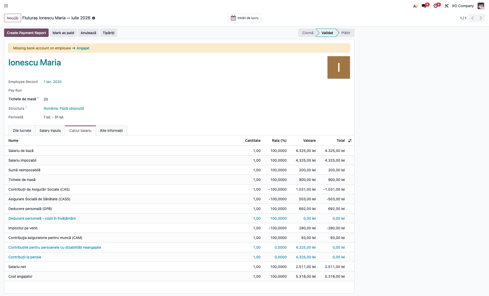
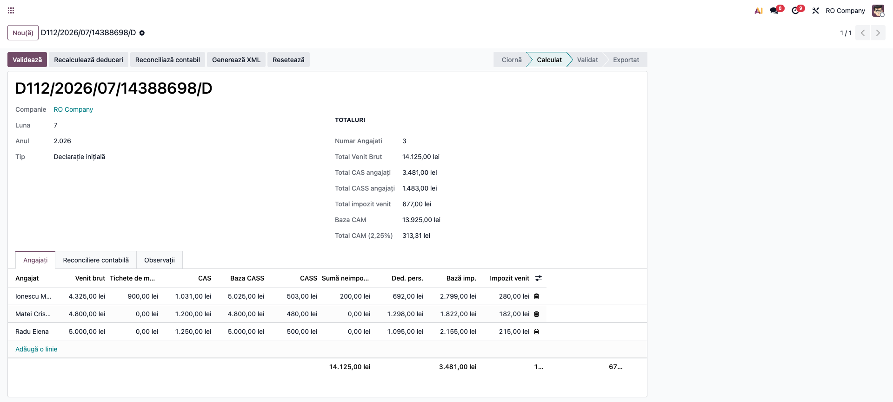

# Fișă Modul: Punte D112 — salarizare Odoo (tichete, sumă neimpozabilă, deduceri)

**Modul:** `l10n_ro_anaf_d112_payroll`
**Utilizator principal:** Contabil salarii, Inspector resurse umane
**Prioritate:** 🔴 Ridicată (declarația D112 lunară)

---

## 1. Scop business

Evită completarea manuală a evidenței nominale din D112: declarația se alimentează direct din fluturașii validați ai
lunii. Pe lângă brut, CAS, CASS și impozit, puntea transferă tichetele de masă, suma neimpozabilă la salariul minim
și deducerile personale (de bază, tineri, copii), astfel încât baza impozabilă din declarație să coincidă cu cea de pe
fluturaș.

## 2. Bază legală și context

Declarația 112 (structura ANAF 2026): `asiguratA` (tipul de asigurat 51 și `A_13S` pentru suma neimpozabilă la
salariul minim), `asiguratE1`/`asiguratE3` (venituri, deduceri art. 77, baza impozabilă) și `E3_10` din `E3_60`
(contravaloarea tichetelor de masă acordate; structura cere `E3_8 ≥ E3_60 ≥ E3_10`). Calculele de pe fluturaș sunt cele
din `l10n_ro_hr_payroll_enhancement` (Cod fiscal art. 77, 78). Suma neimpozabilă la salariul minim este reglementată de OUG 89/2025
(nomenclatorul ANAF o declară cu tipul de asigurat 51) și de Ordinul comun 605/95/928/2.314/2026; baza CAM exclude suma
neimpozabilă, la fel ca bazele CAS, CASS și a impozitului.

## 3. Utilizatori și roluri

Inspector salarizare (validează fluturașii), Contabil salarii (calculează și verifică declarația).

## 4. Conturi și date implicate

Puntea nu generează note contabile. Date minime: fluturași validați pe structura **România: Plată obișnuită**
(`l10n_ro_hr_payroll_enhancement`) și compania cu datele declarantului completate în D112.

## 5. Configurare inițială

1. Instalați `l10n_ro_anaf_d112`, `l10n_ro_hr_payroll_enhancement` și puntea (se instalează automat când D112 și salarizarea
   coexistă).
2. Completați pe fiecare angajat **CNP-ul** (câmpul `l10n_ro_cnp`, altfel `ssnid`) și data de angajare din contract; fără ele
   validarea declarației și generarea XML se blochează.
3. Configurați parametrii în **Stat de plată → Configurare → Salariu → Regulă Parametri** (vezi fișa `l10n_ro_hr_payroll_enhancement`).

## 6. Flux de utilizare

### Pasul 1 — Fluturașul validat

**Stat de plată → Fluturași de salariu → Fluturași de salariu**: validați fluturașii lunii. Exemplu: Ionescu Maria, brut 4.325, 20 tichete ×
45 lei, o persoană în întreținere — suma neimpozabilă 200, CAS 1.031, CASS 503, deducere 692, impozit 280, net 2.511.



### Pasul 2 — Calculul declarației D112

**Contabilitate → Raportare → Declarația D112 → Nou** (luna 7, anul 2026, *Declarație inițială*) și **Calculează**. Fila
**Angajați** se completează cu câte o linie pe fluturaș. Activați din butonul de coloane *Tichete de masă*, *Sumă
neimpozabilă* și *Baza CASS*.

Verificați pe ecran, pentru fiecare angajat: *Venit brut* = brutul fluturașului; *Tichete de masă* = valoarea tichetelor;
*Sumă neimpozabilă* = linia de pe fluturaș; *CAS* și *CASS* egale cu fluturașul; *Ded. pers.* = suma deducerilor (de bază +
tineri + copii); *Bază impozabilă* = 4.325 + 900 − 200 − 1.031 − 503 − 692 = 2.799 la Ionescu Maria (fluturașul nu are o linie dedicată
bazei impozabile). Verificați și totalul **CAM**: baza CAM este suma (brut − suma neimpozabilă), fără tichete, iar CAM =
2,25% din ea (la Ionescu Maria 4.125 × 2,25% = 93). Abia după aceea validați declarația.



### Pasul 3 — Verificarea în fișierul XML

După **Generează XML**, pentru Ionescu Maria apar (extras):

```xml
<asiguratA A_1="51" A_11="5025" A_12="503" A_13="4125" A_13S="200" A_13C="4325"/>
<asiguratE1 E1_1="5225" E1_2="1534" E1_3="1" E1_4="692" E1_41="692" E1_6="2799" E1_7="280"/>
<asiguratE3 E3_8="5225" E3_9="1534" E3_10="900" E3_60="900" E3_14="2799" E3_15="280" E3_16="2511"/>
```

Pe linia din listă *Tip asigurat* rămâne 01; în XML `A_1` ia valoarea 51 pentru că s-a aplicat suma neimpozabilă; baza CAS (`A_13`) este 4.125, baza CASS (`A_11`) 5.025;
tichetele de masă apar în `E3_10`/`E3_60` și în `E3_8`/`E1_1` (brut + tichete), iar baza CAM `A_5` = brut − suma neimpozabilă
(4.125).

## 7. Legături cu alte module / declarații

| Modul | Rol |
|---|---|
| `l10n_ro_anaf_d112` | Declarația de bază; punctele de extensie pentru evidența nominală. |
| `l10n_ro_hr_payroll_enhancement` | Sursa regulilor `TICHETE`, `NEIMPOZ`, `DPB`, `DPBTIN`, `DPBCOP` (nu e dependență). |
| `hr_payroll` | Fluturașii și liniile de zile lucrate. |

**Ce e automat:** importul liniilor, bazele CAS/CASS, tichetele, suma neimpozabilă, deducerile, zilele din fluturaș.
**Scutirea art. 60** (handicap, cercetare-dezvoltare) se transferă din fluturaș: linia primește *Scutire impozit (art. 60)*, iar
XML-ul are `asigScu` 1/3, `E3_23`/`E3_24` (sau `E3_27`/`E3_28`) = baza impozabilă și impozitul teoretic (10%), `E3_15` = 0, obligația
602 cu `A_scutit` și `angajatorF1`, ca în SAGA. **Ce rămâne manual:** alte deduceri (cotizație sindicală, pensii facultative)
se introduc pe fluturaș, nu direct în D112 (câmpul *Alte deduceri* din D112 nu se recalculează pe liniile importate);
configurarea filei *Reconciliere contabilă* a declarației.

**Reimport:** *Calculează* nu actualizează liniile deja importate. După corectarea unui fluturaș, ștergeți linia lui din fila
Angajați și apăsați din nou *Calculează*; liniile fluturașilor anulați se șterg manual.

## 8. Verificări pentru consultant

- [ ] Fiecare fluturaș validat al lunii are o linie în fila Angajați.
- [ ] Baza impozabilă și impozitul de pe linie coincid cu fluturașul.
- [ ] La angajatul cu suma neimpozabilă, în XML `A_1` = 51, `A_13S` = suma, `A_13` = brut − suma.
- [ ] Baza CASS (`A_11`) = brut + tichete − suma neimpozabilă.
- [ ] Tichetele apar în `E3_10` și `E3_60`, iar `E3_8` ≥ `E3_60`.
- [ ] Persoane în întreținere (`E1_3`) și deduceri (`E1_41`, `E1_421`, `E1_422`) corespund fluturașului.
- [ ] Total CAM = 2,25% × Σ(brut − suma neimpozabilă) și coincide cu suma CAM de pe fluturași.
- [ ] La angajații scutiți (art. 60): `asigScu` = 1/3, `E3_23`/`E3_24` (sau `E3_27`/`E3_28`) = baza și 10% din ea, `E3_15` = 0; în obligația 602 `A_scutit` = Σ impozit scutit și există `angajatorF1`.

## 9. Mesaje de eroare frecvente

| Mesaj | Cauză | Remediere |
|---|---|---|
| Nicio linie după Calculează | Fluturașii nu sunt în stare Validat/Plătit sau sunt în altă lună | Validați fluturașii și verificați perioada |
| Tichete, sumă neimpozabilă sau deduceri 0 | Structura salarială nu are regulile `l10n_ro_hr_payroll_enhancement` | Folosiți structura România: Plată obișnuită |
| Eroare la validare: zile lucrate în afara intervalului 1..NZL | Zilele din fluturaș depășesc zilele lucrătoare ale lunii | Corectați zilele pe fluturaș, ștergeți linia și recalculați |
| Employee … has no CNP filled in / CNP invalid / fără dată de angajare | Lipsesc datele angajatului | Completați CNP-ul și data de angajare pe angajat/contract |

## 10. Capturi de ecran

Capturile sunt **generate automat** din `tests/test_screenshots.py` (mixin `ScreenshotCase`, import defensiv), în
română, în RON, pe cazurile din iulie 2026:

1. `01_fluturas_validat.png` — fluturașul validat cu tichete și sumă neimpozabilă.
2. `02_d112_calculat.png` — declarația D112 calculată, cu coloanele din salarizare.

```bash
./odoo/odoo-bin -c odoo.conf -d test19 -i l10n_ro_hr_payroll_enhancement,l10n_ro_anaf_d112_payroll,l10n_ro_doc_screenshots \
  --test-tags=fise_screenshots --stop-after-init
```

## 11. Observații pentru manual

- Puntea transferă doar ce calculează fluturașul; nu verifică legislația. Valorile sumei neimpozabile se confirmă cu
  contabilul (vezi fișa `l10n_ro_hr_payroll_enhancement`).
- Scutirea art. 60 se declară ca în SAGA (XML D112 09/2026 verificat de DUKIntegrator): `E3_23`/`E3_27` = baza impozabilă, `E3_24`/`E3_28` =
  impozitul teoretic; validatorul nu verifică semnificația acestor câmpuri, deci alinierea la SAGA este referința.
- Declarația `l10n_ro_anaf_d112` folosește pentru liniile cu calcul automat aceeași grilă pe tranșe ca fluturașul.
