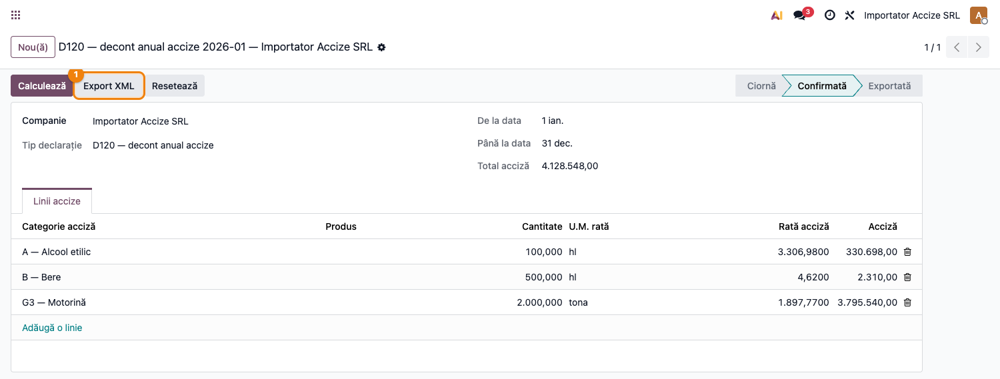

# Fișă Modul: D120 — Decont anual privind accizele

**Poziție plan:** C6
**Modul:** `l10n_ro_anaf_d120`
**FR:** FR-21
**Capitol manual:** Cap 4.6
**Utilizator principal:** Responsabil fiscal accize, Contabil șef
**Prioritate:** 🟡 Medie (firme cu produse accizabile)

---

## 1. Scop business

Modulul adaugă **exportul XML ANAF al Decontului anual privind accizele (D120)** peste declarația de
accize din `l10n_ro_excise`. D120 este decontul **anual** depus de plătitorii de accize
(antrepozitari autorizați, importatori, destinatari înregistrați, utilizatori industriali) pentru
produsele accizabile (alcool, bere, produse energetice, tutun etc.), distinct de **D103** (decontul
lunar al antrepozitului fiscal).

Practic, modulul nu adaugă un ecran nou: pe o declarație de accize de tip **D120**, butonul
**Export XML** generează fișierul în formatul ANAF D120 (namespace `mfp:anaf:dgti:d120:declaratie:v5`),
în loc de template-ul D103.

## 2. Bază legală și context

Codul Fiscal Titlul VIII (accize și alte taxe speciale). Decontul **D120** se depune **anual** de către
plătitorii de accize (termen **25 martie** a anului următor celui de raportare), cu
accizele datorate pe categorii de produse accizabile — **armonizate** (alcool, bere, tutun, produse
energetice, energie electrică) și **nearmonizate** (introduse prin Legea 296/2023: lichide cu/fără
nicotină, băuturi zaharoase, înlocuitori de tutun). În XML perioada este codificată prin atributul
`an` (anul de raportare) și `luna="12"` (marcaj fix pentru decontul anual). Structura XML implementată
corespunde versiunii **v5 (13.05.2025)** din specificația ANAF (`static/xsd/d120_13052025.xsd`).

## 3. Utilizatori și roluri

- **Responsabil accize / fiscal** — întocmește decontul și exportă XML-ul.
- **Contabil șef** — validează cantitățile și accizele datorate.
- **Administrator** — verifică categoriile de accize, cotele și antrepozitele fiscale.

Roluri recomandate pentru testare:
- Administrator funcțional: instalează modulul și verifică tipul de declarație D120;
- Utilizator operațional: reproduce o declarație anuală cu câteva categorii de accize;
- Contabil/manager: validează totalul accizei și exportul XML.

## 4. Conturi și date implicate

D120 este o **declarație de raportare** (nu generează note contabile proprii). Citește liniile
declarației de accize: per **categorie de acciză**, cantitatea × cota → acciza datorată.

Date minime pentru demo:
- compania RO cu **CUI, CAEN și adresă** completate (cerute la export);
- categorii de accize configurate (`l10n_ro_excise` — ex. A Alcool etilic, B Bere, G3 Motorină);
- o declarație de accize de tip **D120** pe anul de raportare (1 ianuarie – 31 decembrie), cu linii
  pe categorii.

## 5. Configurare inițială

1. Instalați `l10n_ro_anaf_d120` (depinde de `l10n_ro_excise` și `l10n_ro_anaf_base`).
2. Verificați **categoriile de accize** și cotele în vigoare (`l10n_ro_excise`).
3. Completați **CUI, CAEN și adresa companiei** — cerute la generarea XML.
4. Configurați, dacă e cazul, antrepozitele fiscale.

## 6. Flux de utilizare

### Pasul 1 — Întocmirea decontului D120

Meniu: **Contabilitate → Raportare → Accize → Declarații accize**. Creați o declarație cu **tipul
D120 — decont anual**, perioada anului de raportare (1 ianuarie – 31 decembrie) și liniile pe
categorii de accize. Aveți două căi, **alternative**, de a popula liniile:

- **Automat** — apăsați **Calculează**: modulul **reconstruiește** liniile din facturile postate cu
  produse accizabile (⚠️ șterge liniile existente) și trece declarația în starea **Confirmată**;
- **Manual** — completați liniile direct în tab-ul „Linii accize", apoi confirmați. **Nu** mai apăsați
  Calculează după completarea manuală, altfel liniile introduse se pierd.

**Găsește pe ecran → verifică → continuă:**
1. **Găsește** — în tabul „Linii accize", fiecare rând are: categoria de acciză, cantitatea, unitatea
   cotei (`rate_uom`), cota (`rate`) și acciza calculată (`excise_amount`). În antet, câmpul
   **Total acciză** însumează liniile.
2. **Verifică** — categoriile corespund produselor raportate; cantitățile sunt în unitatea fiscală
   corectă (hl/grad Plato pentru bere, hl alcool pur, tone, kg, ml etc.); cotele sunt cele în vigoare;
   perioada selectată acoperă **anul întreg**.
3. **Continuă** — abia după ce liniile sunt corecte, treceți la export.



### Pasul 2 — Export XML ANAF

Pe o declarație **confirmată**, apăsați **Export XML** (buton evidențiat în captura de mai sus).
Pentru tipul D120, modulul generează fișierul în formatul ANAF D120 (`D120_<CUI>_<AAAA>12.xml`),
**validat față de schema XSD** v5 înainte de descărcare; după export declarația trece în starea
**Exportată**. Arhivați fișierul și dovada depunerii (prin DUKIntegrator).

Structura XML generată (extras ilustrativ — antet companie + câteva rânduri + totaluri):

```xml
<?xml version="1.0" encoding="UTF-8"?>
<declaratie120 xmlns="mfp:anaf:dgti:d120:declaratie:v5"
               an="2026" luna="12" d_rec="0"
               den="Importator Accize SRL" cui="20603502" caen="..."
               adresa="..." totalPlata_A="...">
  <accize R0_C1="500.000"  R0_C2="hl/1 grad Plato" R0_C3="..."
          R9_C1="100.000"  R9_C2="hl alcool pur"   R9_C3="..."
          R20_C1="2000.000" R20_C2="tona"           R20_C3="..."
          R33_C3="..."   <!-- Total I — accize armonizate -->
          R40_C3="0"     <!-- Total II — accize nearmonizate -->
          R41_C3="..."/> <!-- Total general I + II -->
</declaratie120>
```

> Pentru fiecare rând: `_C1` = cantitatea, `_C2` = unitatea de măsură fiscală, `_C3` = acciza datorată
> (lei, întreg). Rândurile sumare R33 (Total I), R40 (Total II) și R41 (Total general) sunt calculate
> automat din liniile declarației.

### Note de monografie și raportare

- D120 **nu generează note contabile proprii** — este o declarație de raportare; acciza datorată se
  înregistrează la momentul exigibilității prin documentele curente (achiziție/import/producție), nu
  prin decont.
- Maparea categoriilor de accize pe rândurile D120 este automată: B→R0, C→R3, D→R6, E→R8, A→R9,
  F1–F4→R12–R15, G1–G7→R17–R30, H1–H6→R34–R39.
- Totalurile R33 (armonizate), R40 (nearmonizate) și R41 (general) se calculează din sumarele
  liniilor și se înscriu în XML.

## 7. Legături cu alte module / declarații

| Modul / proces | Rol în flux |
|---|---|
| `l10n_ro_excise` | declarația de accize, categoriile și cotele (model de bază extins) |
| `l10n_ro_anaf_base` | infrastructură comună ANAF (validare companie, profil declarație, XSD) |
| D103 | decontul lunar al antrepozitului fiscal (același model, alt tip și template) |

Ce este automat: maparea categoriilor de accize pe rândurile XML D120 (R0, R9, R20 etc.) și totalurile
(R33/R40/R41).
Ce rămâne manual: verificarea cantităților, a cotelor în vigoare, a încadrării produselor și depunerea
prin DUKIntegrator.

## 8. Verificări pentru consultant

- [ ] Declarația de tip **D120** afișează butonul **Export XML** (în starea Confirmată/Exportată).
- [ ] Perioada declarației acoperă **anul de raportare** (1 ianuarie – 31 decembrie).
- [ ] Liniile au categorie, cantitate, unitate, cotă și acciza calculată corect.
- [ ] Totalul accizei din antet corespunde sumei liniilor.
- [ ] XML-ul exportat conține elementul `declaratie120` și atributele `an` + `luna="12"`.
- [ ] XML-ul trece validarea XSD (CUI, CAEN și adresă completate pe companie).
- [ ] Numele fișierului are forma `D120_<CUI>_<AAAA>12.xml`.

## 9. Mesaje de eroare frecvente

| Simptom | Cauză probabilă | Remediere |
|---------|-----------------|-----------|
| Butonul Export XML nu apare | Declarația este în Ciornă | Apăsați **Calculează** pentru a o confirma |
| Export gol / fără linii | Nu există linii pe categorii de accize | Adăugați linii sau rulați Calculează pe facturi accizabile |
| Eroare validare XSD | Date companie incomplete (CUI/CAEN/adresă) | Completați datele de identificare ale companiei |

## 10. Capturi de ecran

Capturile (`readme/screenshots/`) sunt **generate automat** din `tests/test_screenshots.py`
(mixinul `ScreenshotCase` din `l10n_ro_doc_screenshots`, import defensiv), în **limba română**,
pe planul de conturi RO:

1. `01_declaratie_d120.png` — Decontul de accize D120 (confirmat) cu liniile pe categorii și butonul
   Export XML evidențiat.

Regenerare:

```bash
./odoo/odoo-bin -c odoo.conf -d <db> -i l10n_ro_anaf_d120,l10n_ro_doc_screenshots \
    --test-tags=fise_screenshots --stop-after-init
```

## 11. Observații pentru manual

În manualul final, păstrați explicația orientată pe activitatea utilizatorului: D120 este **decontul
anual de accize**, distinct de declarația lunară D103. Subliniați că modulul doar generează exportul
XML conform XSD v5 peste declarația de accize existentă, că perioada este anuală (`luna="12"` în XML)
și că depunerea efectivă se face prin DUKIntegrator. Reamintiți verificarea datelor de identificare
ale companiei (CUI/CAEN/adresă), fără de care validarea XSD eșuează.
