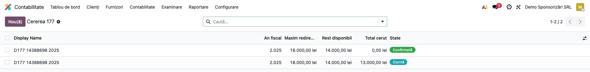
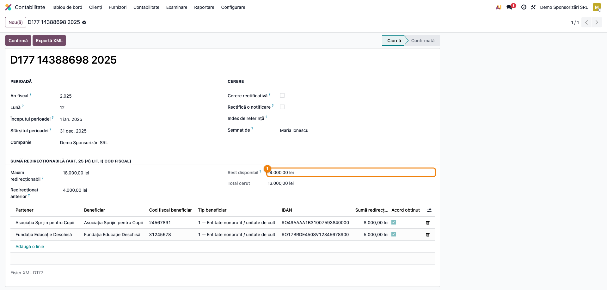
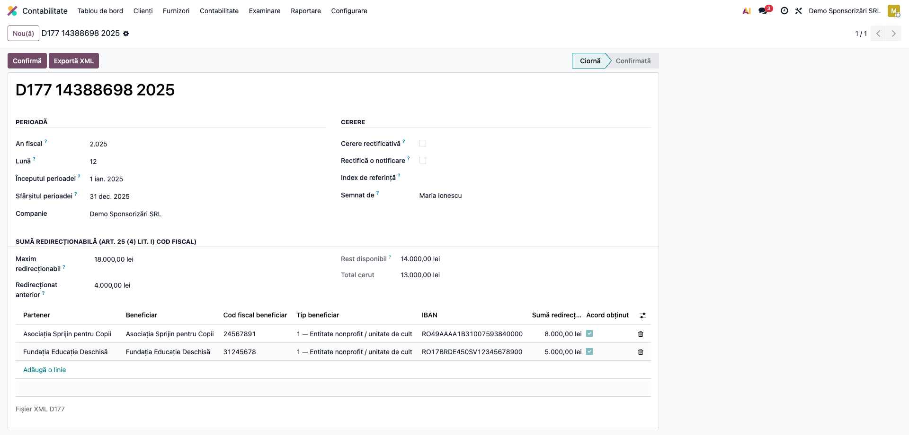
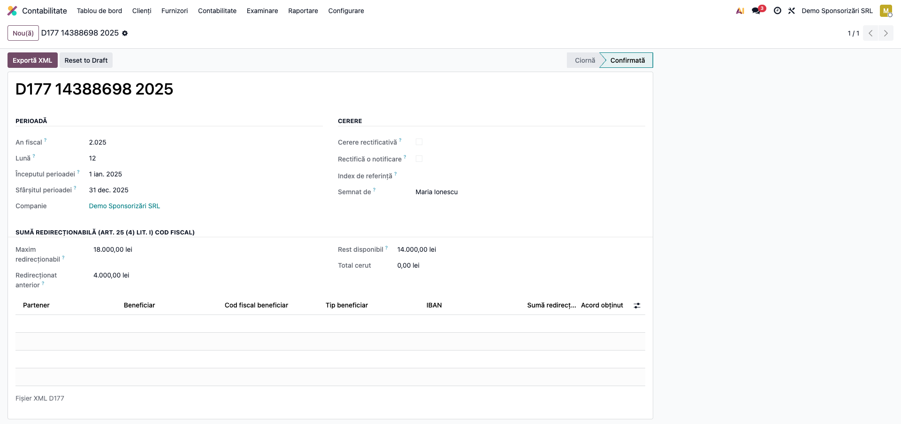

# Fișă Modul: Cererea 177 — Redirecționarea Impozitului către Beneficiari

**Modul:** `l10n_ro_anaf_d177`
**FR:** FR-76
**Utilizator principal:** Contabil-șef, responsabil cu sponsorizările
**Prioritate:** 🟡 Medie (opțională, dar cu termen fix și plafon strict)

---

## 1. Scop business

O firmă care a acordat sponsorizări poate cere ca o parte din impozitul **datorat** să fie virată
direct beneficiarilor, în locul plății integrale la buget. Cererea se face prin formularul **177**.

Se confundă ușor cu **D107**, dar rolurile sunt diferite:

| | D107 (FR-46) | **D177** (acest modul) |
|---|---|---|
| Ce face | **raportează** sponsorizările acordate | **cere** virarea impozitului către beneficiari |
| Tip | declarație informativă | cerere |
| Ce conține | beneficiarii și sumele sponsorizate | beneficiarii, **IBAN-ul** și suma cerută |

Se depun **separat**, cu termene proprii.

## 2. Bază legală și context

**Codul fiscal, art. 25 alin. (4) lit. i)** — sponsorizările și limita lor de deducere; formularul
177 aprobat prin ordin ANAF, cu schema XML oficială `d177_20260309.xsd`.

Suma cerută nu poate depăși **plafonul rămas de redirecționat**: creditul fiscal de sponsorizare
minus ce s-a redirecționat prin cereri anterioare.

## 3. Utilizatori și roluri

Contabil-șef (decide redirecționarea și semnează cererea).

Roluri recomandate: **Contabil** (`account.group_account_manager`) pentru flux; **Utilizator
contabil** pentru consultare.

## 4. Conturi și date implicate

Modulul **nu generează note contabile** — este o cerere administrativă către ANAF.

Date minime pentru demo:
- companie românească cu localizarea instalată;
- beneficiari de sponsorizare ca parteneri, **cu IBAN completat** în conturile bancare;
- plafonul de redirecționare din creditul fiscal de sponsorizare al exercițiului.

## 5. Configurare inițială

1. Instalați `l10n_ro_anaf_d177`; apare în **Contabilitate → Raportare → Declarații ANAF**.
2. Verificați că beneficiarii au **IBAN** pe fișa de partener — fără el virarea nu se poate face.
3. Aveți la îndemână plafonul de redirecționare și suma deja redirecționată prin cereri anterioare.

## 6. Flux de utilizare

### Pasul 1 — Deschiderea cererilor

**Contabilitate → Raportare → Declarații ANAF → D177 Redirecționare impozit**.



### Pasul 2 — Antetul: anul și plafonul

Creați o cerere, alegeți **anul fiscal** al cărui impozit se redirecționează și completați plafonul.



**Ce găsiți pe ecran:** *Maxim redirecționabil*, *Redirecționat anterior* și **Rest disponibil**,
calculat automat ca diferență.

**Ce verificați:** plafonul corespunde creditului fiscal de sponsorizare al exercițiului; suma deja
redirecționată include toate cererile anterioare ale aceluiași an.

### Pasul 3 — Beneficiarii și IBAN-urile

În tabul *Beneficiari*, adăugați câte un rând per entitate. Alegerea partenerului completează
automat denumirea, codul fiscal și **IBAN-ul** din conturile lui bancare.



| Câmp | Ce conține |
|---|---|
| Beneficiar | partenerul; completează restul câmpurilor |
| Tip beneficiar | entitate nonprofit / UNICEF / bursă privată / întreprindere socială / alt caz legal |
| IBAN | contul în care ANAF virează suma — **obligatoriu** |
| Sumă redirecționată | cât se cere pentru acest beneficiar |
| Acord obținut | confirmarea beneficiarului |

**Ce verificați înainte de a continua:** totalul cerut **nu depășește restul disponibil**; fiecare
beneficiar are IBAN și acord.

### Pasul 4 — Confirmarea și exportul XML

Apăsați **Confirmă**, apoi **Exportă XML**. Fișierul respectă schema oficială `d177_20260309.xsd`.



> **Plafonul este o limită legală, nu o recomandare.** Dacă totalul cerut depășește restul
> disponibil, exportul se **blochează** — nu se produce un fișier pe care ANAF l-ar respinge.

### Note de monografie și raportare

Modulul **nu produce note contabile**. Impozitul rămâne datorat integral în evidența contabilă;
ANAF virează partea cerută către beneficiari în locul plății la buget. Reflectarea în contul de
impozit se face la plată, nu la depunerea cererii.

## 7. Legături cu alte module / declarații

| Modul / proces | Rol în flux | Tip legătură |
|---|---|---|
| `l10n_ro_anaf_base` | meniul de declarații ANAF | dependență |
| `l10n_ro_anaf_d107` (FR-46) | raportarea sponsorizărilor acordate — **declarația pereche** | corelație manuală |
| `l10n_ro_profit_tax` (FR-30) | creditul fiscal de sponsorizare, din care rezultă plafonul | corelație manuală |
| `l10n_ro_anaf_submission` | depunerea electronică prin SPV | complementar |

**Ce este automat:** completarea datelor beneficiarului din partener (inclusiv IBAN), calculul
restului disponibil, blocarea exportului peste plafon, XML-ul validat cu schema.

**Ce rămâne manual:** introducerea beneficiarilor (nu se preiau din D107), completarea plafonului
(nu vine din calculul de impozit), și urmărirea virării efective către beneficiari.

## 8. Verificări pentru consultant

- [ ] Modulul apare în **Contabilitate → Raportare → Declarații ANAF**.
- [ ] Alegerea partenerului completează denumirea, codul fiscal și IBAN-ul.
- [ ] *Rest disponibil* = plafon − redirecționat anterior.
- [ ] Un total cerut peste restul disponibil **blochează** exportul.
- [ ] Un beneficiar fără IBAN sau fără cod fiscal blochează confirmarea.
- [ ] Un beneficiar cu suma zero blochează confirmarea.
- [ ] XML-ul validează contra `d177_20260309.xsd`.
- [ ] Interfața este în limba română.

## 9. Mesaje de eroare frecvente

| Mesaj / simptom | Cauză probabilă | Remediere |
|---|---|---|
| „Beneficiarul „X" are nevoie de cod fiscal, denumire și IBAN." | Partener incomplet | Completați IBAN-ul pe fișa partenerului, apoi reselectați-l |
| „Beneficiarul „X" are nevoie de o sumă redirecționată." | Rând cu suma zero | Completați suma sau ștergeți rândul |
| „Doar o cerere în ciornă poate fi confirmată." | Cererea e deja confirmată | Readuceți-o în ciornă dacă mai aveți de modificat |
| Exportul se oprește fără fișier | Total peste restul disponibil | Reduceți sumele sau verificați plafonul |

## 10. Capturi de ecran

Capturile (`readme/screenshots/`) sunt **generate automat** din `tests/test_screenshots.py`
(mixinul `ScreenshotCase` din `l10n_ro_doc_screenshots`, import defensiv), în **limba română**:

1. `01_lista.png` — lista cererilor D177.
2. `02_antet.png` — antetul: anul, plafonul și restul disponibil.
3. `03_beneficiari.png` — beneficiarii, cu IBAN, sumă și acord.
4. `04_confirmata.png` — cererea confirmată, cu XML-ul generat.

Regenerare:

```bash
./odoo/odoo-bin -c odoo.conf -d <db> -i l10n_ro_anaf_d177,l10n_ro_doc_screenshots \
    --test-tags=fise_screenshots --stop-after-init
```

## 11. Observații pentru manual

1. **D177 nu e D107.** Prima cere virarea impozitului, a doua raportează sponsorizările. Se depun
   separat; confuzia dintre ele e cea mai frecventă la primul contact.
2. **Fără IBAN nu există virare.** Câmpul pare un detaliu administrativ, dar e chiar mecanismul
   cererii: ANAF virează în contul indicat.
3. **Plafonul blochează, nu avertizează.** Dacă totalul depășește restul disponibil, exportul se
   oprește — comportament intenționat.
