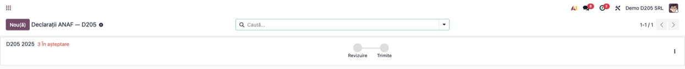
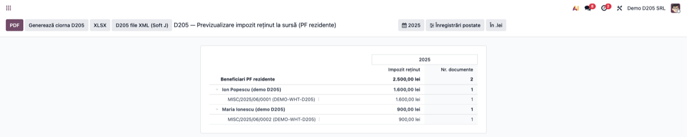
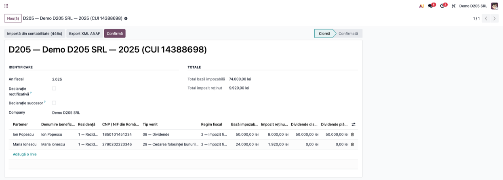
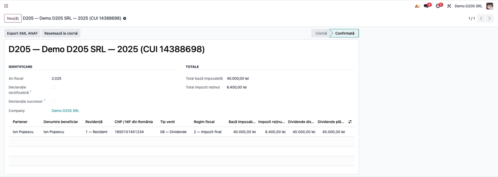
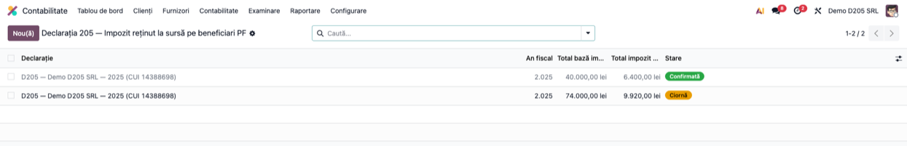

# Fișă Modul: Declarația D205 — Impozit reținut la sursă, beneficiari persoane fizice

**Modul:** `l10n_ro_anaf_d205`
**FR:** FR-26
**Utilizator principal:** Contabil declarații, Contabil șef
**Prioritate:** 🟡 Medie (anual; obligatorie pentru orice societate care plătește dividende asociaților persoane fizice)

---

## 1. Scop business

Declarația **205** este informativă: repartizează pe **beneficiari persoane fizice** impozitul
**reținut la sursă** în cursul anului — cel mai des pe **dividendele plătite asociaților**, dar și pe
dobânzi, premii, chirii sau venituri din activități independente cu reținere. Modulul are **trei
straturi care lucrează împreună**, consecvent cu celelalte declarații ANAF:

1. un **pas în „Declarații ANAF"** (framework-ul `account.return`) care ghidează operatorul prin pașii
   de generare, cu **termen-limită** și **checklist**;
2. un **raport de previzualizare** (în stil contabil Enterprise) peste conturile **446x**, cu defalcare
   **partener → document** și buton **„Generează ciorna D205"**;
3. **declarația persistentă** (pe beneficiari), care aplică regulile validatorului ANAF și exportă
   fișierul **XML** validat cu schema oficială.

## 2. Bază legală și context

- **Art. 132 alin. (2) Cod fiscal** (Legea 227/2015, Titlul IV) — plătitorii de venituri cu regim de
  reținere la sursă depun, pe fiecare beneficiar, declarația privind impozitul calculat și reținut, până
  în **ultima zi a lunii februarie a anului următor**. Veniturile declarate în D112 (salarii, pensii,
  drepturi de proprietate intelectuală, arendă) nu intră în D205.
- **Art. 97 Cod fiscal** — impozitul pe veniturile din investiții; dividendele plătite din 2026 se
  impozitează cu 16%. Impozitul reținut se declară și se plătește lunar prin D100; D205 îl repartizează
  anual pe beneficiari.
- **OPANAF nr. 102/2025** — modelul și structura formularului; XML-ul respectă schema
  **`d205_2025_v3.xsd`** și structura ANAF modificată la 12.02.2026.

> **Rezidenți și nerezidenți.** D205 este în principal declarația beneficiarilor **rezidenți**.
> Structura admite nerezidenți (*Rezident/Nerezident* = 2) numai la codurile 04, 16, 18, 25–30; la
> **08 dividende, 09 dobânzi, 11 lichidare, 12 premii** validatorul cere rezident (regula R32).
> Veniturile nerezidenților, persoane fizice sau juridice, se declară în general în **D207**
> (art. 231 Cod fiscal, modulul `l10n_ro_anaf_d207`).

## 3. Utilizatori și roluri

Contabil declarații / Contabil șef.

Rol recomandat pentru testare: utilizator cu drepturi de contabilitate. Punctele de intrare:
- **Contabilitate → Raportare → Declarații → Declarații ANAF** (cockpit-ul `account.return`);
- **Contabilitate → Raportare → Declarații ANAF → Declarație 205** (lista declarațiilor persistente).

## 4. Conturi și date implicate

- **446x** „Alte impozite, taxe și vărsăminte asimilate" — sursa raportului de previzualizare și a
  importului: impozitul reținut, pe sold creditor, pentru **persoane fizice rezidente**
  (`is_company = False`, fără țară sau cu țara România, fără bifa de nerezident **Impozit la sursă
  (WHT)** din `l10n_ro_partner_screening`);
- per beneficiar: **denumire**, **CNP/NIF din România** (`cifR`), **rezidență**, **tip venit** (codurile
  oficiale 04, 08, 09, 11, 12, 16, 18, 25–30), **regim fiscal** (0 / 2 impozit final / 3 neimpozabil
  prin convenție), **bază** și **impozit**; la nerezidenți, **statul de rezidență** și **CIF-ul din
  străinătate**;
- câmpuri pe cod: **dividende distribuite / plătite** (08), **câștig / pierdere** (25, în locul bazei
  și impozitului), **venit în natură / garanția chiriei** (29).

**Date demo incluse:** la instalarea cu date demo, modulul creează doi beneficiari PF rezidenți
(„Ion Popescu", „Maria Ionescu", cu CNP) și **note contabile cu impozit pe dividende reținut pe 446x**
în anul anterior, astfel încât raportul de previzualizare și generarea ciornei sunt imediat funcționale.

## 5. Configurare inițială

1. Instalați modulul `l10n_ro_anaf_d205` (dependențe: `account`, `l10n_ro`, `l10n_ro_anaf_base`,
   `l10n_ro_partner_screening`, `l10n_ro_reports`). Necesită **Odoo Enterprise** (rapoarte contabile +
   `account.return`).
2. Completați **CNP-ul** asociaților și al celorlalți beneficiari persoane fizice în câmpul de cod
   fiscal al partenerului; importul îl preia în `cifR`.
3. Lăsați bifa **Impozit la sursă (WHT)** doar pe partenerii **nerezidenți** (se sugerează automat
   pentru o țară diferită de România) — ei se declară în D207 și nu sunt preluați în D205.
4. Asigurați-vă că impozitul reținut este înregistrat pe conturile **446x**, cu beneficiarul ca
   partener pe linie.

## 6. Flux de utilizare

### Pasul 1 — Pasul D205 din „Declarații ANAF" (termen + checklist)

**Contabilitate → Raportare → Declarații → Declarații ANAF**. Pentru anul fiscal expirat se generează
(automat prin cron sau manual cu **Nou**) o intrare **D205** cu **termen 28/29 februarie** și un set de
pași de bifat:

- **Generează ciorna D205 din 446x** — deschide raportul de previzualizare (Pasul 2);
- **Beneficiari fără CNP/NIF din România (cifR)** — semnalează liniile fără CNP/NIF;
- **Atașează D205 (XML semnat / recipisă ANAF)** — încărcarea dovezii de depunere.



### Pasul 2 — Raportul de previzualizare 446x și generarea ciornei

Din pasul de mai sus (sau direct), se deschide **raportul de previzualizare D205**: impozitul reținut pe
**446x** pentru PF rezidente, grupat **pe partener**, cu **drill-down în documente** (notele contabile).
După verificarea sumelor, apăsați **„Generează ciorna D205"** din antetul raportului — se creează (sau se
reactualizează) **ciorna anului fiscal** și se deschide formularul ei.



### Pasul 3 — Completarea beneficiarilor

În formularul declarației, verificați pentru fiecare beneficiar **CNP/NIF (cifR)**, **tipul de venit**,
**baza impozabilă** și câmpurile specifice codului. Totalurile (bază, impozit) se calculează automat;
**regimul fiscal** se propune după cod (2 — impozit final; 0 la codul 25; la 26 și 27 se poate alege 3).

> La generare, modulul preia **impozitul reținut** (soldul creditor 446x) pe beneficiar, cu
> **Rezidență = 1**, **baza impozabilă = 0** și **tip venit = „16 — Alte surse"**. Schimbați tipul pe
> natura reală (pentru asociați, **08 — Dividende**, cu dividendele distribuite și plătite) și
> completați baza.
>
> Un beneficiar **nerezident** se adaugă manual, cu **Rezidență = 2**, **statul de rezidență** și,
> opțional, **CIF-ul din străinătate** — numai la codurile admise de structură.



### Pasul 4 — Confirmarea

Apăsați **„Confirmă"**. Modulul aplică regulile validatorului ANAF și afișează toate problemele odată:
CNP/NIF lipsă, nerezident la un cod rezervat rezidenților, nerezident fără stat de rezidență, regim
fiscal nepermis pentru cod, același CNP/NIF de două ori la același cod de venit. Declarația trece în
starea **Confirmată** (câmpurile devin readonly); se poate reveni la ciornă cu „Resetează la ciornă".



### Pasul 5 — Exportul XML pentru ANAF

Apăsați **„Export XML ANAF"** (din formular) sau butonul de export din raport. Modulul grupează
beneficiarii pe **tip de venit** (`sect_II`), calculează suma de control `totalPlata_A` după formula
ANAF (numărul de beneficiari plus toate totalurile), validează structura cu **XSD-ul ANAF** și descarcă
fișierul (nume standardizat `D205_<CUI>_<an>12.xml`). Fișierul trece validarea **DUKIntegrator**
(verificat pe dividende, dobânzi, chirii, aur de investiții și un nerezident la codul 16).

### Pasul 6 — Închiderea pasului în checklist

Reveniți la pasul D205 din **Declarații ANAF**, **atașați** fișierul semnat / recipisa și marcați pașii
ca **revizuiți**; declarația poate fi trecută pe **Trimis**.



### Note de monografie și raportare

- Modulul **nu generează note contabile** — este o declarație informativă; impozitul reținut este deja
  înregistrat (446x) la momentul plății.
- Raportul și importul preiau doar **persoane fizice rezidente** cu sold creditor pe 446x în perioada
  selectată; firmele și nerezidenții (bifa WHT sau țară străină) rămân pe dinafară.
- `Rezid` = 1 pentru rezidenți (fără `Stat_R` și `cifS`), 2 pentru nerezidenți (cu `Stat_R` obligatoriu).
- La codul 25 se declară câștigul și pierderea, nu baza și impozitul; la 08, dividendele distribuite și
  plătite; la 29, venitul în natură și garanția chiriei.

## 7. Legături cu alte module / declarații

| Modul / proces | Rol în flux | Tip legătură |
|---|---|---|
| `account` | sursa impozitului reținut (446x) | dependență (manifest) |
| `account_reports` (via `l10n_ro_reports`) | raportul de previzualizare + cockpitul `account.return` | dependență (manifest) |
| `l10n_ro_reports` | tipul de return RO, țara, integrarea cu Declarații ANAF | dependență (manifest) |
| `l10n_ro_anaf_base` | profilul declarației, validarea XSD, numele standardizat al fișierului, butoanele de export | dependență (manifest) |
| `l10n_ro_partner_screening` | bifa **Impozit la sursă (WHT)**, care marchează nerezidenții excluși din D205 | dependență (manifest) |
| `l10n_ro_anaf_d207` | declarația pentru beneficiarii **nerezidenți** | modul-pereche |
| `l10n_ro_dividends` | dividendele către asociați (cod 08). **Atenție:** nota de plată pune impozitul pe 446 într-o singură linie, fără partener, așa că importul D205 nu îl preia — beneficiarii de dividende se adaugă manual până la corecția modulului | flux în amonte |

Ce este automat: pasul cu termen în Declarații ANAF, raportul de previzualizare cu drill-down, preluarea
beneficiarilor rezidenți din 446x la „Generează ciorna", rezidența și regimul fiscal propuse, calculul
totalurilor și al sumei de control, regulile validatorului, validarea XSD și numele fișierului.
Ce rămâne manual: tipul de venit real și baza, câmpurile specifice codului, beneficiarii nerezidenți,
confirmarea, exportul și atașarea dovezii de depunere în SPV.

## 8. Verificări pentru consultant

- [ ] Modulul se instalează fără erori (necesită `l10n_ro_anaf_base`, `l10n_ro_partner_screening`,
      `l10n_ro_reports`).
- [ ] În **Declarații ANAF** apare un pas **D205** cu termen **28/29 februarie** și 3 verificări.
- [ ] Raportul de previzualizare arată impozitul pe 446x pentru PF rezidente, grupat pe partener, cu
      drill-down în documente; un partener străin sau cu bifa WHT nu apare.
- [ ] Butonul **„Generează ciorna D205"** creează/actualizează ciorna anului și deschide formularul.
- [ ] Liniile importate au **Rezidență = 1** și **Regim fiscal = 2**; totalurile reflectă suma liniilor.
- [ ] Verificarea „Beneficiari fără CNP/NIF" devine **anomalie** dacă lipsește `cifR` și **revizuită**
      după completare.
- [ ] Un nerezident pe codul 08 este refuzat la confirmare; pe codul 16, cu stat de rezidență, este admis.
- [ ] Confirmarea fără beneficiari este blocată; a doua confirmare este blocată.
- [ ] Exportul XML produce `declaratie205`, `sect_II` per tip de venit și `benef` per beneficiar, și
      trece validarea DUKIntegrator.
- [ ] Numele fișierului respectă formatul `D205_<CUI>_<an>12.xml`.

## 9. Mesaje de eroare frecvente

| Mesaj / simptom | Cauză probabilă | Remediere |
|-----------------|-----------------|-----------|
| „Nu s-au găsit conturi 446x în planul de conturi." | Planul de conturi nu conține 446x | Verificați planul de conturi RO |
| „Nu s-au găsit înregistrări de impozit reținut la sursă pe conturile 446x pentru PF rezidente …" | Niciun beneficiar PF rezident cu sold creditor pe 446x în anul ales | Verificați partenerul de pe liniile 446x și bifa WHT |
| „Nu există o declarație D205 pentru anul fiscal selectat…" (la export din raport) | Nu a fost încă generată ciorna | Apăsați „Generează ciorna D205" |
| „Adăugați cel puțin un beneficiar înainte de confirmare." | Declarație fără linii | Generați sau adăugați manual beneficiari |
| „…: lipsește CNP-ul/NIF-ul din România (cifR)." | Beneficiar fără CNP/NIF | Completați CNP-ul pe partener sau pe linie |
| „…: tipul de venit 08 se declară numai pentru rezidenți…" | Nerezident pe un cod rezervat rezidenților | Declarați-l în D207 sau corectați rezidența |
| „…: regimul fiscal … nu este admis pentru tipul de venit …" | Regim fiscal schimbat manual greșit | 0 la codul 25, 2 sau 3 la 26/27, 2 în rest |
| „…: același CNP/NIF apare de două ori la tipul de venit …" | Două linii pentru același beneficiar și cod | Comasați liniile |
| Eroare de validare XSD la export | Date incomplete/invalide față de schema ANAF | Corectați câmpurile semnalate |

## 10. Capturi de ecran

Capturile (`static/description/`) sunt **generate automat** din `tests/test_screenshots.py`
(mixinul `ScreenshotCase` din `l10n_ro_doc_screenshots`, import defensiv), în **limba română**,
pe planul de conturi RO (`setup_country("ro")`), cu datele demo de mai sus:

1. `01_return_checklist.png` — cardul D205 din cockpitul Declarații (termen + „3 în așteptare", workflow Revizuire → Trimite).
2. `02_raport_preview_446x.png` — raportul de previzualizare 446x, partener → document (drill-down).
3. `03_declaratie_d205.png` — formularul cu beneficiari PF rezidenți (dividende și chirie) și totaluri.
4. `04_declaratie_confirmata.png` — declarația în starea Confirmată.
5. `05_lista_d205.png` — lista declarațiilor D205.

Regenerare:

```bash
./odoo/odoo-bin -c odoo.conf -d <db> -i l10n_ro_anaf_d205,l10n_ro_doc_screenshots \
    --test-tags=fise_screenshots --stop-after-init
```

## 11. Observații pentru manual

În manualul final, păstrați explicația orientată pe activitatea utilizatorului: când se depune D205
(anual, termen ultima zi din februarie, pentru impozitul reținut la sursă pe beneficiari persoane
fizice — în primul rând dividendele către asociați), cum se parcurg pașii din **Declarații ANAF**, cum
se folosește **raportul de previzualizare** pentru a verifica și **genera ciorna**, cum se completează
beneficiarii (CNP, tip de venit, bază, câmpurile pe cod) și cum se obține fișierul XML validat pentru SPV.
Subliniați delimitarea: **rezidenții în D205, nerezidenții în D207** (cu excepțiile admise de structura
D205) și că impozitul trebuie deja reflectat pe 446x.
