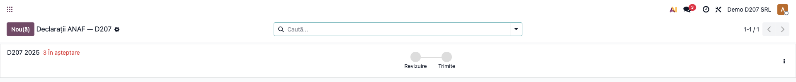
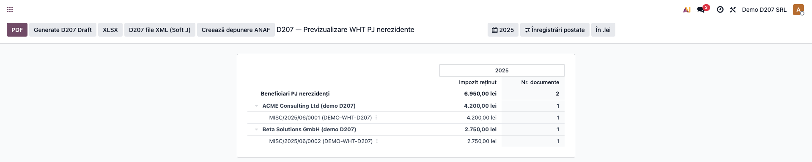
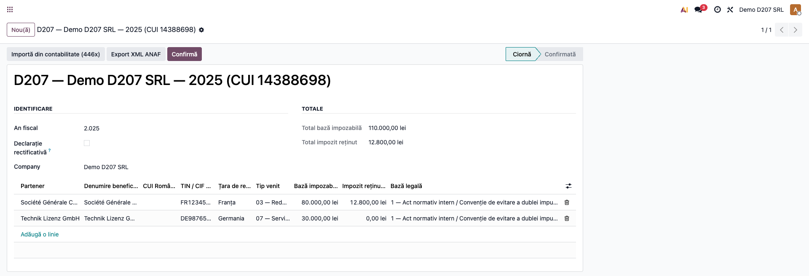
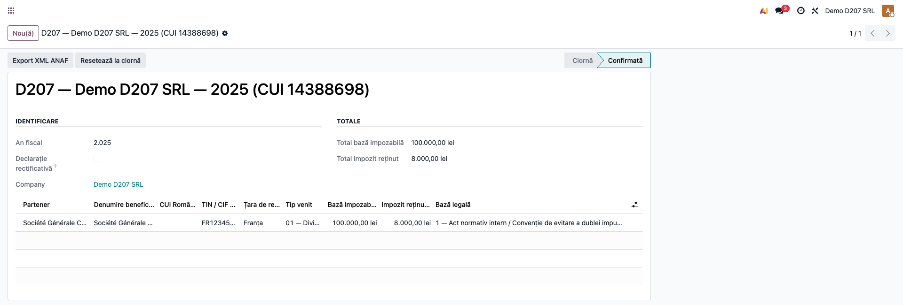
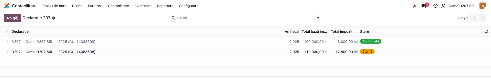

# Fișă Modul: Declarația D207 — Impozit la sursă PJ nerezidente

**Modul:** `l10n_ro_anaf_d207`
**FR:** FR-26
**Utilizator principal:** Contabil declarații, Contabil șef
**Prioritate:** 🟡 Medie (anual, pentru plăți către persoane juridice nerezidente cu reținere la sursă)

---

## 1. Scop business

Declarația **207** este informativă, privind **impozitul reținut la sursă** pe veniturile plătite
**persoanelor juridice nerezidente** (dividende, dobânzi, redevențe, comisioane, servicii, jocuri de
noroc etc.). Modulul gestionează **scutirile** (prin convenție de evitare a dublei impuneri — CEDI) și
**impozitul suportat de plătitor**, și oferă **trei straturi care lucrează împreună**, pentru o
experiență consecventă cu celelalte declarații ANAF:

1. un **pas în „Declarații ANAF"** (framework-ul `account.return`) care ghidează operatorul prin pașii
   de generare, cu **termen-limită** și **checklist**;
2. un **raport de previzualizare** (în stil contabil Enterprise) peste conturile **446x**, cu defalcare
   **partener → document** și buton **„Generează ciorna D207"**;
3. **declarația persistentă** (pe beneficiari) care validează structura față de **schema XSD ANAF** și
   exportă fișierul **XML** gata de depus.

> Modulul-pereche **D205** acoperă persoanele **fizice** nerezidente; D207 acoperă persoanele
> **juridice** nerezidente.

## 2. Bază legală și context

Codul fiscal (Legea 227/2015) — **impozitul pe veniturile obținute din România de nerezidenți**
(reținere la sursă, art. 221–226). Cotele reduse sau scutirile pot rezulta din **Convențiile de
evitare a dublei impuneri (CEDI)**, cu prezentarea certificatului de rezidență fiscală. Declarația 207
se depune **anual**, cu termen **ultima zi a lunii februarie a anului următor**, iar XML-ul respectă
schema oficială **`d207_20025020.xsd`**.

## 3. Utilizatori și roluri

Contabil declarații / Contabil șef.

Rol recomandat pentru testare: utilizator cu drepturi de contabilitate. Punctele de intrare:
- **Contabilitate → Raportare → Declarații → Declarații ANAF** (cockpit-ul `account.return`);
- **Contabilitate → Raportare → Declarații ANAF → Declarație 207** (lista declarațiilor persistente).

## 4. Conturi și date implicate

- **446x** „Alte impozite, taxe și vărsăminte asimilate" — sursa raportului de previzualizare și a
  importului (impozitul reținut, pe sold creditor, pentru parteneri **PJ** cu **WHT aplicabil** și
  `is_company = True`);
- per beneficiar: **denumire**, **CUI România** (`cifR`) sau **TIN străin** (`cifS`), **țara de
  rezidență**, **tip venit** (01–25), **bază**, **impozit reținut**, **impozit suportat de plătitor**
  (`imps1`), **baza legală** (CEDI / declarație proprie) și marcajul **„scutit"**.

**Date demo incluse:** la instalarea cu date demo, modulul creează două persoane juridice nerezidente
(ex. „ACME Consulting Ltd"/UK, „Beta Solutions GmbH"/DE) și **note contabile cu impozit reținut pe
446x** în anul anterior, astfel încât raportul de previzualizare și generarea ciornei să fie imediat
funcționale. Deoarece partenerii demo au doar **TIN străin** (ajunge în `cifS`), **identificatorul
român (`cifR`) rămâne de completat** — exact situația reală pe care o semnalează checklist-ul.

## 5. Configurare inițială

1. Instalați modulul `l10n_ro_anaf_d207` (dependențe: `account`, `l10n_ro`, `l10n_ro_anaf_base`,
   `l10n_ro_partner_screening`, `l10n_ro_reports`). Necesită **Odoo Enterprise** (rapoarte contabile +
   `account.return`).
2. Marcați partenerii PJ nerezidenți cu **WHT aplicabil** (din `l10n_ro_partner_screening`).
3. Asigurați-vă că impozitul reținut este înregistrat pe conturile **446x** (sursa raportului și a
   importului).

## 6. Flux de utilizare

### Pasul 1 — Pasul D207 din „Declarații ANAF" (termen + checklist)

**Contabilitate → Raportare → Declarații → Declarații ANAF**. Pentru anul fiscal expirat se generează
(automat prin cron sau manual cu **Nou**) o intrare **D207** cu **termen 28/29 februarie** și un set de
pași de bifat:

- **Generează ciorna D207 din 446x** — deschide raportul de previzualizare (Pasul 2);
- **Beneficiari fără NIF România (cifR)** — semnalează liniile cărora le lipsește identificatorul;
- **Atașează D207 (XML semnat / recipisă ANAF)** — încărcarea dovezii de depunere.



### Pasul 2 — Raportul de previzualizare 446x și generarea ciornei

Din pasul de mai sus (sau direct), se deschide **raportul de previzualizare D207**: impozitul reținut pe
**446x** pentru PJ nerezidente, grupat **pe partener**, cu **drill-down în documente** (notele
contabile). După verificarea sumelor, apăsați butonul **„Generează ciorna D207"** din antetul
raportului — se creează (sau se reactualizează) **ciorna anului fiscal** și se deschide formularul ei.



### Pasul 3 — Completarea beneficiarilor

În formularul declarației, completați pentru fiecare beneficiar **CUI/identificator (cifR)** / TIN
(cifS), **țara**, **tipul de venit**, **baza impozabilă**, **baza legală (CEDI)** și eventualele
**scutiri** / **impozitul suportat de plătitor**. Totalurile se calculează automat.

> La generare, modulul preia **impozitul reținut** (soldul creditor 446x) și partenerii eligibili, dar
> setează implicit **baza impozabilă = 0** și **tip venit = „15"**; completați manual baza, tipul de
> venit, baza legală (CEDI), scutirile și **identificatorul român (cifR)** înainte de export.



### Pasul 4 — Confirmarea

Apăsați **„Confirmă"** (necesită cel puțin un beneficiar). Declarația trece în starea **Confirmată**.
Se poate reveni la ciornă cu „Resetează la ciornă".



### Pasul 5 — Exportul XML pentru ANAF

Apăsați **„Export XML ANAF"** (din formular) sau butonul de export din raport. Modulul grupează
beneficiarii pe **tip de venit** (`sect_II`, cu totaluri de scutiri și impozit suportat), validează față
de **XSD-ul ANAF** și descarcă fișierul XML (nume standardizat `D207_<CUI>_<an>12.xml`), gata de
încărcat în Soft J / SPV.

### Pasul 6 — Închiderea pasului în checklist

Reveniți la pasul D207 din **Declarații ANAF**, **atașați** fișierul semnat / recipisa și marcați pașii
ca **revizuiți**; declarația poate fi trecută pe **Trimis**.



### Note de monografie și raportare

- Modulul **nu generează note contabile** — este o declarație informativă; impozitul reținut este deja
  înregistrat (446x) la momentul plății.
- Raportul și importul preiau doar parteneri **PJ** (`is_company = True`) cu **WHT aplicabil** și sold
  creditor pe 446x, în perioada selectată.
- Beneficiarii se grupează pe **tip de venit** în XML (`sect_II`); fiecare beneficiar are codul țării de
  rezidență și baza legală (`Act_N`: CEDI / declarație proprie).
- Exportul **validează XML-ul față de XSD**; scutirile (CEDI) se contorizează separat în `sect_II`.

## 7. Legături cu alte module / declarații

| Modul / proces | Rol în flux | Tip legătură |
|---|---|---|
| `account` | sursa impozitului reținut (446x) | dependență (manifest) |
| `account_reports` (via `l10n_ro_reports`) | raportul de previzualizare + cockpitul `account.return` | dependență (manifest) |
| `l10n_ro_reports` | tipul de return RO, țara, integrarea cu Declarații ANAF | dependență (manifest) |
| `l10n_ro_anaf_base` | profilul declarației, validarea XSD, numele standardizat al fișierului, butoanele de export | dependență (manifest) |
| `l10n_ro_partner_screening` | flag-ul **WHT aplicabil** pe partener (filtrare beneficiari) | dependență (manifest) |
| `l10n_ro_anaf_d205` | declarația echivalentă pentru persoane **fizice** nerezidente | modul-pereche |

Ce este automat: pasul cu termen în Declarații ANAF, raportul de previzualizare cu drill-down, preluarea
beneficiarilor PJ din 446x la „Generează ciorna", calculul totalurilor, gruparea pe tip de venit (cu
scutiri/impozit suportat), validarea XSD și numele fișierului.
Ce rămâne manual: marcarea WHT pe parteneri, completarea **CUI/TIN**, tipul de venit, baza legală (CEDI),
scutirile, confirmarea, exportul și atașarea dovezii de depunere în SPV.

## 8. Verificări pentru consultant

- [ ] Modulul se instalează fără erori (necesită `l10n_ro_anaf_base`, `l10n_ro_partner_screening`,
      `l10n_ro_reports`).
- [ ] În **Declarații ANAF** apare un pas **D207** cu termen **28/29 februarie** și 3 verificări.
- [ ] Raportul de previzualizare arată impozitul pe 446x grupat pe partener, cu drill-down în documente.
- [ ] Butonul **„Generează ciorna D207"** creează/actualizează ciorna anului și deschide formularul.
- [ ] Generarea preia beneficiarii PJ nerezidenți cu WHT și impozit pe 446x; totalurile reflectă suma liniilor.
- [ ] Verificarea „Beneficiari fără NIF" devine **anomalie** dacă lipsește `cifR` și **revizuită** după completare.
- [ ] Confirmarea fără beneficiari este blocată; a doua confirmare este blocată.
- [ ] Export XML produce tag-ul `declaratie207`, `sect_II` per tip de venit și `benef` per beneficiar.
- [ ] Scutirile (CEDI) și impozitul suportat de plătitor se reflectă în totalurile `sect_II`.
- [ ] Numele fișierului respectă formatul `D207_<CUI>_<an>12.xml`.

## 9. Mesaje de eroare frecvente

| Mesaj / simptom | Cauză probabilă | Remediere |
|-----------------|-----------------|-----------|
| „Nu s-au găsit conturi 446x în planul de conturi." | Planul de conturi nu conține 446x | Verificați planul de conturi RO |
| „Nu s-au găsit înregistrări WHT pe conturile 446x … pentru PJ nerezidente …" | Niciun partener PJ cu WHT și sold creditor pe 446x în anul ales | Marcați WHT pe parteneri și verificați înregistrările |
| „Nu există o declarație D207 pentru anul fiscal selectat…" (la export din raport) | Nu a fost încă generată ciorna | Apăsați „Generează ciorna D207" |
| „Adăugați cel puțin un beneficiar înainte de confirmare." | Declarație fără linii | Generați sau adăugați manual beneficiari |
| „Nu există beneficiari de exportat." | Export cerut pe declarație goală | Generați sau adăugați beneficiari înainte de export |
| Eroare de validare XSD la export | Date incomplete/invalide față de schema ANAF | Corectați câmpurile semnalate (țară, tip venit, sume) |

## 10. Capturi de ecran

Capturile (`readme/screenshots/`) sunt **generate automat** din `tests/test_screenshots.py`
(mixinul `ScreenshotCase` din `l10n_ro_doc_screenshots`, import defensiv), în **limba română**,
pe planul de conturi RO (`setup_country("ro")`), cu datele demo de mai sus:

1. `01_return_checklist.png` — cardul D207 din cockpitul Declarații (termen + „3 în așteptare", workflow Revizuire → Trimite).
2. `02_raport_preview_446x.png` — raportul de previzualizare 446x, partener → document (drill-down).
3. `03_declaratie_d207.png` — formularul cu beneficiari PJ și totaluri.
4. `04_declaratie_confirmata.png` — declarația în starea Confirmată.
5. `05_lista_d207.png` — lista declarațiilor D207.

Regenerare:

```bash
./odoo/odoo-bin -c odoo.conf -d <db> -i l10n_ro_anaf_d207,l10n_ro_doc_screenshots \
    --test-tags=fise_screenshots --stop-after-init
```

## 11. Observații pentru manual

În manualul final, păstrați explicația orientată pe activitatea utilizatorului: când se depune D207
(anual, termen ultima zi din februarie, pentru reținerile la sursă de la PJ nerezidente), cum se parcurg
pașii din **Declarații ANAF**, cum se folosește **raportul de previzualizare** pentru a verifica și
**genera ciorna**, cum se tratează **scutirile prin CEDI** (certificat de rezidență fiscală) și impozitul
suportat de plătitor, și cum se obține fișierul XML validat pentru SPV. Subliniați diferența față de
**D205** (persoane fizice nerezidente) și că impozitul trebuie deja reflectat pe 446x.
