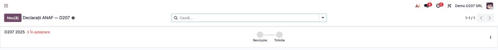
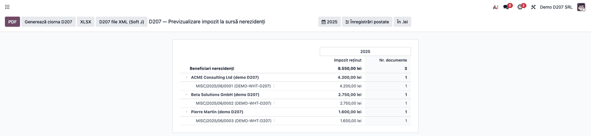
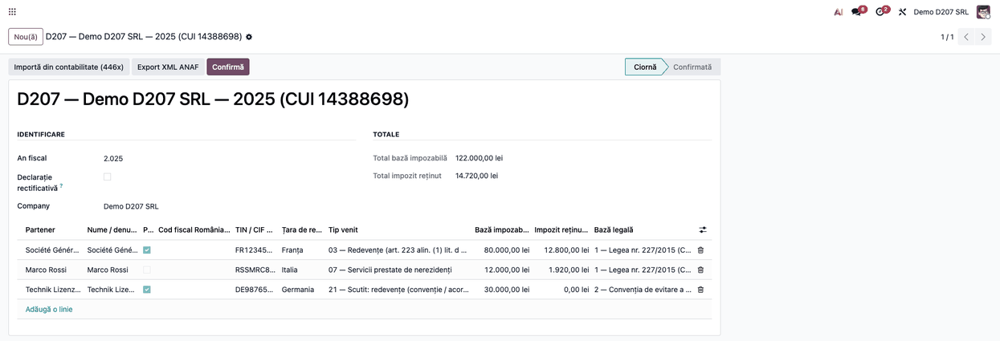
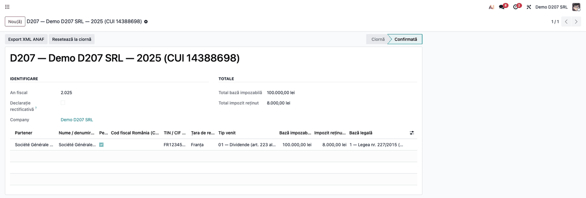
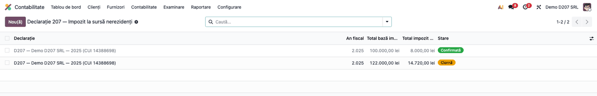

# Fișă Modul: Declarația D207 — Impozit la sursă nerezidenți (PF și PJ)

**Modul:** `l10n_ro_anaf_d207`
**FR:** FR-26
**Utilizator principal:** Contabil declarații, Contabil șef
**Prioritate:** 🟡 Medie (anual, pentru plăți către nerezidenți — persoane fizice și juridice — cu reținere la sursă)

---

## 1. Scop business

Declarația **207** este informativă, privind **impozitul reținut la sursă** pe veniturile plătite
**nerezidenților, persoane fizice și juridice** (dividende, dobânzi, redevențe, comisioane, servicii,
premii etc.). Modulul gestionează **scutirile** (prin convenție de evitare a dublei impuneri — CEDI) și
**impozitul suportat de plătitor**, și oferă **trei straturi care lucrează împreună**, pentru o
experiență consecventă cu celelalte declarații ANAF:

1. un **pas în „Declarații ANAF"** (framework-ul `account.return`) care ghidează operatorul prin pașii
   de generare, cu **termen-limită** și **checklist**;
2. un **raport de previzualizare** (în stil contabil Enterprise) peste conturile **446x**, cu defalcare
   **partener → document** și buton **„Generează ciorna D207"**;
3. **declarația persistentă** (pe beneficiari) care validează structura față de **schema XSD ANAF** și
   exportă fișierul **XML** gata de depus.

> Modulul-pereche **D205** acoperă beneficiarii **persoane fizice rezidente**; D207 acoperă toți
> **nerezidenții**, persoane fizice și juridice (art. 231 Cod fiscal). Structura D207 nu are un câmp de
> tip beneficiar: persoana fizică se declară cu numele și prenumele, statul de rezidență, CNP/NIF-ul din
> România (dacă are) și codul fiscal din statul de rezidență.

## 2. Bază legală și context

Codul fiscal (Legea 227/2015), Titlul VI — **impozitul pe veniturile obținute din România de
nerezidenți**: veniturile impozabile (art. 223), reținerea la sursă și cotele (art. 224), veniturile
scutite (art. 229), declararea pe beneficiari (art. 231). Cotele reduse sau scutirile pot rezulta din
**Convențiile de evitare a dublei impuneri (CEDI)**, cu prezentarea certificatului de rezidență fiscală
(art. 230). Declarația 207
se depune **anual**, cu termen **ultima zi a lunii februarie a anului următor**, iar XML-ul respectă
schema oficială **`d207_20025020.xsd`**.

## 3. Utilizatori și roluri

Contabil declarații / Contabil șef.

Rol recomandat pentru testare: utilizator cu drepturi de contabilitate. Punctele de intrare:
- **Contabilitate → Raportare → Declarații → Declarații ANAF** (cockpit-ul `account.return`);
- **Contabilitate → Raportare → Declarații ANAF → Declarație 207** (lista declarațiilor persistente).

## 4. Conturi și date implicate

- **446x** „Alte impozite, taxe și vărsăminte asimilate" — sursa raportului de previzualizare și a
  importului (impozitul reținut, pe sold creditor, pentru partenerii **nerezidenți**: cu **WHT
  aplicabil** sau cu o **țară diferită de România**, persoane fizice și juridice);
- per beneficiar: **nume / denumire**, **cod fiscal din România** (`cifR` — CUI sau CNP/NIF, opțional,
  verificat cu cifra de control) și/sau **cod fiscal din statul de rezidență** (`cifS`), **țara de
  rezidență**, **tip venit** (nomenclatorul D207; 12–21 = venituri scutite), **bază** (sau venitul brut
  scutit), **impozit reținut**, **impozit suportat de plătitor** (`imps1`) și **baza legală** (Codul
  fiscal / CEDI).

**Date demo incluse:** la instalarea cu date demo, modulul creează doi nerezidenți persoane juridice
(„ACME Consulting Ltd"/UK, „Beta Solutions GmbH"/DE), o persoană fizică nerezidentă („Pierre
Martin"/FR) și **note contabile cu impozit reținut pe 446x** în anul anterior, astfel încât raportul de
previzualizare și generarea ciornei să fie imediat funcționale. Partenerii demo au doar **cod fiscal
străin** (ajunge în `cifS`); `cifR` se completează doar dacă beneficiarul are un CUI sau CNP/NIF
românesc.

## 5. Configurare inițială

1. Instalați modulul `l10n_ro_anaf_d207` (dependențe: `account`, `l10n_ro`, `l10n_ro_anaf_base`,
   `l10n_ro_partner_screening`, `l10n_ro_reports`). Necesită **Odoo Enterprise** (rapoarte contabile +
   `account.return`).
2. Pe partenerii nerezidenți (persoane fizice și juridice) completați **țara de rezidență** (obligatorie)
   și verificați bifa **WHT aplicabil** (din `l10n_ro_partner_screening`, propusă automat la o țară
   străină). Persoanele fizice cu țara România și fără bifă sunt rezidente și merg în D205.
3. Asigurați-vă că impozitul reținut este înregistrat pe conturile **446x** (sursa raportului și a
   importului).

## 6. Flux de utilizare

### Pasul 1 — Pasul D207 din „Declarații ANAF" (termen + checklist)

**Contabilitate → Raportare → Declarații → Declarații ANAF**. Pentru anul fiscal expirat se generează
(automat prin cron sau manual cu **Nou**) o intrare **D207** cu **termen 28/29 februarie** și un set de
pași de bifat:

- **Generează ciorna D207 din 446x** — deschide raportul de previzualizare (Pasul 2);
- **Beneficiari fără cod fiscal** — semnalează liniile fără niciun cod fiscal (nici românesc, nici
  din statul de rezidență);
- **Atașează D207 (XML semnat / recipisă ANAF)** — încărcarea dovezii de depunere.



### Pasul 2 — Raportul de previzualizare 446x și generarea ciornei

Din pasul de mai sus (sau direct), se deschide **raportul de previzualizare D207**: impozitul reținut pe
**446x** pentru nerezidenți (persoane fizice și juridice), grupat **pe partener**, cu **drill-down în documente** (notele
contabile). După verificarea sumelor, apăsați butonul **„Generează ciorna D207"** din antetul
raportului — se creează (sau se reactualizează) **ciorna anului fiscal** și se deschide formularul ei.



### Pasul 3 — Completarea beneficiarilor

În formularul declarației, verificați pentru fiecare beneficiar **codul fiscal din România (cifR)**
și/sau **codul din statul de rezidență (cifS)**, **țara**, **tipul de venit**, **baza impozabilă**,
**baza legală (Codul fiscal / CEDI)** și **impozitul suportat de plătitor**. Coloana **Persoană
juridică** arată dacă beneficiarul e firmă sau persoană fizică. Totalurile se calculează automat.

> La generare, modulul preia **impozitul reținut** (soldul creditor 446x) și partenerii nerezidenți, cu
> **baza impozabilă = 0** și **tip venit = „07" (servicii prestate de nerezidenți)**; completați baza și
> corectați tipul de venit (dividende, dobânzi, redevențe etc.). La codurile **12–21** (venituri scutite)
> linia se marchează automat **scutită**, baza se raportează ca venit brut scutit, iar impozitul trebuie
> să fie 0.



### Pasul 4 — Confirmarea

Apăsați **„Confirmă"** (necesită cel puțin un beneficiar). Confirmarea verifică regulile validatorului
ANAF și afișează toate problemele odată: țara România pe un nerezident, cod fiscal românesc invalid,
impozit pe un venit scutit, același beneficiar de două ori pe același cod de venit. Declarația trece în
starea **Confirmată**.
Se poate reveni la ciornă cu „Resetează la ciornă".



### Pasul 5 — Exportul XML pentru ANAF

Apăsați **„Export XML ANAF"** (din formular) sau butonul de export din raport. Modulul grupează
beneficiarii pe **tip de venit** (`sect_II`: baza veniturilor scutite în `Tscutit`, a celor
impozabile în `Tbaza`, impozitul reținut și cel suportat), reverifică regulile de beneficiar, validează față
de **XSD-ul ANAF** și descarcă fișierul XML (nume standardizat `D207_<CUI>_<an>12.xml`), gata de
încărcat în Soft J / SPV.

### Pasul 6 — Închiderea pasului în checklist

Reveniți la pasul D207 din **Declarații ANAF**, **atașați** fișierul semnat / recipisa și marcați pașii
ca **revizuiți**; declarația poate fi trecută pe **Trimis**.



### Note de monografie și raportare

- Modulul **nu generează note contabile** — este o declarație informativă; impozitul reținut este deja
  înregistrat (446x) la momentul plății.
- Raportul și importul preiau partenerii **nerezidenți** — cu **WHT aplicabil** sau cu o **țară
  diferită de România**, persoane fizice și juridice — cu sold creditor pe 446x, în perioada selectată.
  La persoanele fizice e exact complementul importului D205.
- Beneficiarii se grupează pe **tip de venit** în XML (`sect_II`); fiecare beneficiar are codul țării de
  rezidență și baza legală (`Act_N`: 1 — Codul fiscal, 2 — CEDI).
- Exportul **validează XML-ul față de XSD**; suma de control `totalPlata_A` adună toate totalurile
  secțiunii II, ca în validatorul ANAF. XML-urile generate trec validarea DUKIntegrator.

## 7. Legături cu alte module / declarații

| Modul / proces | Rol în flux | Tip legătură |
|---|---|---|
| `account` | sursa impozitului reținut (446x) | dependență (manifest) |
| `account_reports` (via `l10n_ro_reports`) | raportul de previzualizare + cockpitul `account.return` | dependență (manifest) |
| `l10n_ro_reports` | tipul de return RO, țara, integrarea cu Declarații ANAF | dependență (manifest) |
| `l10n_ro_anaf_base` | profilul declarației, validarea XSD, numele standardizat al fișierului, butoanele de export | dependență (manifest) |
| `l10n_ro_partner_screening` | flag-ul **WHT aplicabil** pe partener (identificarea nerezidenților, cu țara) | dependență (manifest) |
| `l10n_ro_anaf_d205` | declarația pentru beneficiarii persoane **fizice rezidente** (complementul D207) | modul-pereche |

Ce este automat: pasul cu termen în Declarații ANAF, raportul de previzualizare cu drill-down, preluarea
beneficiarilor nerezidenți (PF și PJ) din 446x la „Generează ciorna", separarea codului fiscal în
`cifR`/`cifS`, calculul totalurilor, gruparea pe tip de venit (cu
scutiri/impozit suportat), validarea XSD și numele fișierului.
Ce rămâne manual: țara și bifa WHT pe parteneri, verificarea codurilor fiscale, baza, tipul de venit,
baza legală (CEDI), confirmarea, exportul și atașarea dovezii de depunere în SPV.

## 8. Verificări pentru consultant

- [ ] Modulul se instalează fără erori (necesită `l10n_ro_anaf_base`, `l10n_ro_partner_screening`,
      `l10n_ro_reports`).
- [ ] În **Declarații ANAF** apare un pas **D207** cu termen **28/29 februarie** și 3 verificări.
- [ ] Raportul de previzualizare arată impozitul pe 446x grupat pe partener, cu drill-down în documente.
- [ ] Butonul **„Generează ciorna D207"** creează/actualizează ciorna anului și deschide formularul.
- [ ] Generarea preia nerezidenții cu impozit pe 446x — și **persoanele fizice** nerezidente, nu doar firmele;
      o persoană fizică cu țara România și fără bifa WHT **nu** apare (merge în D205).
- [ ] Un NIF/CNP românesc valid ajunge în `cifR`, un cod fiscal străin în `cifS`.
- [ ] Verificarea „Beneficiari fără cod fiscal" devine **anomalie** pe o linie fără `cifR` și fără `cifS`.
- [ ] Confirmarea e blocată pe o linie cu cod 12–21 și impozit nenul, ori cu țara România.
- [ ] Confirmarea fără beneficiari este blocată; a doua confirmare este blocată.
- [ ] Export XML produce tag-ul `declaratie207`, `sect_II` per tip de venit și `benef` per beneficiar.
- [ ] Pe un cod scutit (12–21) baza apare în `Tscutit`, iar `Tbaza` e 0; impozitul suportat apare în `Timps`.
- [ ] XML-ul exportat trece validarea DUKIntegrator (`java -jar DUKIntegrator.jar -v D207 <xml> <err.txt>`).
- [ ] Numele fișierului respectă formatul `D207_<CUI>_<an>12.xml`.

## 9. Mesaje de eroare frecvente

| Mesaj / simptom | Cauză probabilă | Remediere |
|-----------------|-----------------|-----------|
| „Nu s-au găsit conturi 446x în planul de conturi." | Planul de conturi nu conține 446x | Verificați planul de conturi RO |
| „Nu s-au găsit înregistrări de impozit reținut la sursă pe conturile 446x pentru nerezidenți …" | Niciun partener nerezident (bifă WHT sau țară străină) cu sold creditor pe 446x în anul ales | Completați țara / bifa WHT pe parteneri și verificați înregistrările |
| „Completați țara de rezidență pe acești parteneri nerezidenți înainte de import: …" | Partener cu bifa WHT, dar fără țară | Completați țara pe partenerii numiți |
| „…: un nerezident nu poate avea România ca țară de rezidență." | Linie cu țara România | Corectați țara sau mutați beneficiarul în D205 |
| „…: codul fiscal românesc … nu este un CUI sau CNP/NIF valid." | Cifra de control greșită; validatorul ANAF ar respinge fișierul | Corectați codul sau mutați-l în câmpul codului străin |
| „…: tipul de venit … este scutit, deci impozitul reținut trebuie să fie 0." | Cod 12–21 cu impozit | Alegeți codul impozabil corespunzător sau puneți impozitul 0 |
| „…: același beneficiar apare de două ori pentru tipul de venit …" | Două linii pe același beneficiar și cod | Comasați liniile |
| „Nu există o declarație D207 pentru anul fiscal selectat…" (la export din raport) | Nu a fost încă generată ciorna | Apăsați „Generează ciorna D207" |
| „Adăugați cel puțin un beneficiar înainte de confirmare." | Declarație fără linii | Generați sau adăugați manual beneficiari |
| „Nu există beneficiari de exportat." | Export cerut pe declarație goală | Generați sau adăugați beneficiari înainte de export |
| Eroare de validare XSD la export | Date incomplete/invalide față de schema ANAF | Corectați câmpurile semnalate (țară, tip venit, sume) |

## 10. Capturi de ecran

Capturile (`static/description/`) sunt **generate automat** din `tests/test_screenshots.py`
(mixinul `ScreenshotCase` din `l10n_ro_doc_screenshots`, import defensiv), în **limba română**,
pe planul de conturi RO (`setup_country("ro")`), cu datele demo de mai sus:

1. `01_return_checklist.png` — cardul D207 din cockpitul Declarații (termen + „3 în așteptare", workflow Revizuire → Trimite).
2. `02_raport_preview_446x.png` — raportul de previzualizare 446x, partener → document (drill-down).
3. `03_declaratie_d207.png` — formularul cu beneficiari persoane juridice și o persoană fizică, cu totaluri.
4. `04_declaratie_confirmata.png` — declarația în starea Confirmată.
5. `05_lista_d207.png` — lista declarațiilor D207.

Regenerare:

```bash
./odoo/odoo-bin -c odoo.conf -d <db> -i l10n_ro_anaf_d207,l10n_ro_doc_screenshots \
    --test-tags=fise_screenshots --stop-after-init
```

## 11. Observații pentru manual

În manualul final, păstrați explicația orientată pe activitatea utilizatorului: când se depune D207
(anual, termen ultima zi din februarie, pentru reținerile la sursă de la nerezidenți, persoane fizice și
juridice), cum se parcurg
pașii din **Declarații ANAF**, cum se folosește **raportul de previzualizare** pentru a verifica și
**genera ciorna**, cum se tratează **scutirile prin CEDI** (certificat de rezidență fiscală) și impozitul
suportat de plătitor, și cum se obține fișierul XML validat pentru SPV. Subliniați diferența față de
**D205** (persoane fizice rezidente) și că impozitul trebuie deja reflectat pe 446x.
