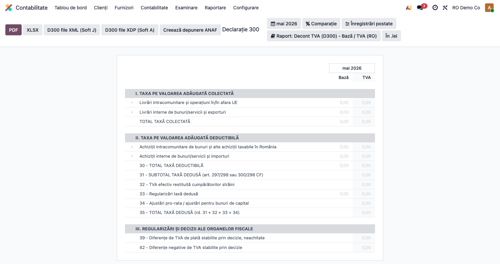
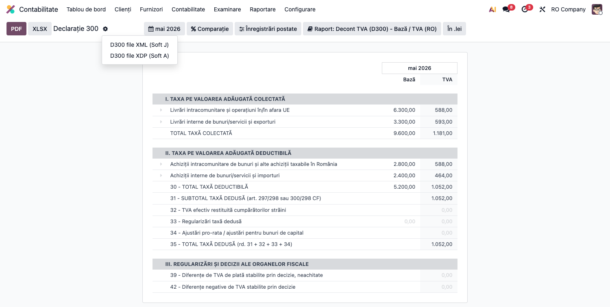
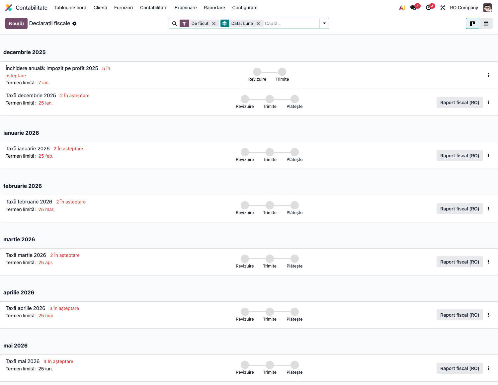
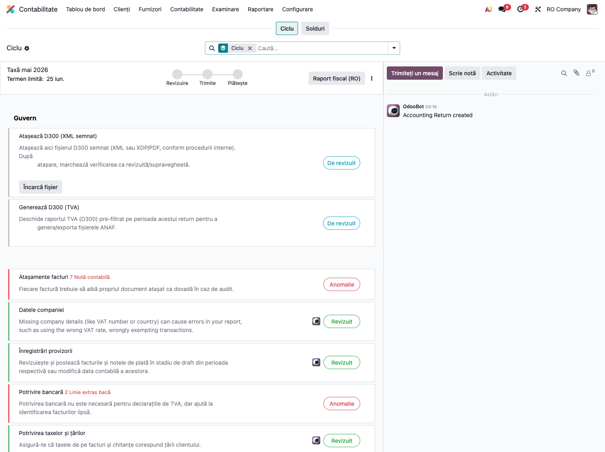

# Fișă Modul: D300 — Decont TVA și închidere TVA

**Poziție plan:** C2
**Modul:** `l10n_ro_anaf_d300`
**FR:** FR-27
**Capitol manual:** Cap 4.4
**Utilizator principal:** Contabil TVA, Contabil șef
**Prioritate:** Ridicată

---

## 1. Scop business

Modulul pregătește decontul periodic de TVA D300 pentru companiile din România, folosind raportul de taxe Odoo Enterprise și exportând fișierele cerute pentru validare/depunere: XML Soft J și XDP pentru formularul inteligent ANAF.

Fișa trebuie prezentată consultantului ca parte din fluxul lunar de închidere TVA: verificare jurnale TVA, verificare solduri 4426/4427/4423/4424, generare D300, arhivare fișier și blocare perioadă prin `tax_lock_date`.

## 2. Bază legală și context

D300 este decontul de taxă pe valoarea adăugată depus de persoanele impozabile înregistrate în scopuri de TVA. Modulul se bazează pe structura ANAF 2026 și pe maparea rândurilor raportului de taxe Odoo către rubricile formularului.

În implementarea curentă, D300 este un raport fiscal, nu un motor complet de închidere contabilă. Calculul sumelor vine din tax tags și tax report lines; regularizarea contabilă 4426/4427 către 4423/4424 trebuie tratată explicit în procesul de închidere sau într-un modul complementar.

## 3. Utilizatori și roluri

- Contabil TVA: verifică documentele perioadei și generează D300.
- Contabil șef: validează totalurile, soldul TVA și decizia de plată/rambursare/reportare.
- Administrator localizare: verifică taxele, tax tags și datele companiei.
- Auditor/consultant: verifică trasabilitatea dintre jurnal TVA, balanță și declarație.

## 4. Date implicate

- facturi și note contabile postate în perioada fiscală;
- taxe RO configurate cu tax tags pentru raportul de taxe;
- raportul de taxe Odoo pentru România;
- conturi 4426, 4427, 4423, 4424 și, după caz, 4428;
- date companie: CUI, județ, adresă, reprezentant/delegat;
- atașamente exportate: XML, XDP, recipisă dacă depunerea se face separat.

## 5. Configurare inițială

1. Instalați `l10n_ro_anaf_d300`, `l10n_ro_anaf_base`, `account_reports` și localizarea RO.
2. Verificați că raportul de taxe RO este disponibil pentru companie.
3. Verificați taxele de vânzare/cumpărare: fiecare cotă trebuie să alimenteze rândul D300 corect prin tax tags.
4. Completați datele companiei: CUI, județ, oraș, adresă și date reprezentant.
5. Pregătiți un set demo cu minimum:
   - factură vânzare 21%;
   - factură cumpărare 21%;
   - document cu cotă redusă 11%;
   - storno;
   - taxare inversă, dacă se testează scenarii IC/RC.

## 6. Flux de utilizare

### Pasul 1 — Accesare și verificare raport

Meniu: `Contabilitate → Raportare → Declarații ANAF → D300`.

Raportul afișează rândurile declarației pe **două coloane — Bază și TVA** (similar formularului
oficial ANAF), grupate pe secțiuni (I. TVA colectată, II. TVA deductibilă, III. Regularizări): rd. 9 —
livrări 21%, rd. 10 — 11%, rd. 1/5 — operațiuni intra-UE, rd. 12 — taxare inversă, rd. 14 — scutite,
totalurile și butoanele de export. Raportul clasic pe o singură coloană rămâne disponibil din meniul
standard `Contabilitate → Raportare → Raport TVA`:



1. Închideți operarea lunii: toate facturile și notele TVA trebuie să fie postate.
2. Deschideți raportul de taxe/D300 din meniul ANAF.
3. Selectați perioada fiscală: lună sau trimestru, după vectorul fiscal al companiei.
4. Verificați rândurile raportului și totalurile pe cote.
5. Reconciliați totalurile cu:
   - jurnalul TVA vânzări;
   - jurnalul TVA cumpărări;
   - balanța conturilor 4426/4427/4423/4424.

### Pasul 2 — Generare fișiere ANAF (XML Soft J / XDP)

Exporturile ANAF se găsesc în meniul **rotiță (⚙)** din bara raportului:



6. Apăsați rotița ⚙ și alegeți **„D300 file XML (Soft J)"** pentru validare în DUKIntegrator.
   Înainte de generare, modulul validează datele companiei (CUI, județ, adresă, reprezentant) și,
   pentru XML, structura față de schema XSD; o eroare oprește exportul cu mesaj explicit.
7. Alegeți **„D300 file XDP (Soft A)"** dacă se folosește formularul PDF inteligent ANAF.
8. Atașați fișierul validat și recipisa în dosarul lunii.

### Pasul 3 — Fluxul „Returns" (declarații fiscale și checklist)

Butonul **„Declarații" (Returns)** din raport deschide tabloul declarațiilor fiscale, grupate pe
perioade, cu termenele și etapele (Revizuire → Trimite → Plătește):



Deschiderea declarației perioadei afișează **checklist-ul** ei. Modulul D300 adaugă două verificări
dedicate — „Generează D300 (TVA)" (deschide raportul pre-filtrat pe perioada return-ului) și
„Atașează D300 (XML semnat)" (încarcă fișierul depus) — alături de controalele standard:



9. Parcurgeți checklist-ul: generați D300, validați/atașați fișierul semnat, marcați verificările ca
   revizuite și avansați declarația prin etape până la depunere.

## 7. Monografie și controale contabile

| Situație | Control contabil |
|---|---|
| TVA colectată mai mare decât TVA deductibilă | sold de plată; trebuie corelat cu 4423 |
| TVA deductibilă mai mare decât TVA colectată | sold negativ; se decide reportare sau rambursare |
| Taxe cu exigibilitate la plată/încasare | verificați 4428 și înregistrările CABA înainte de D300 |
| Taxare inversă | verificați simetria 4426/4427 și rândurile D300 aferente |
| TVA parțial/nedeductibil | D300 trebuie să includă în deducere doar partea deductibilă |

Regularizarea lunară recomandată se documentează separat în fluxul de închidere:

```text
TVA de plată:
Dr 4427 = Cr 4426
Dr 4427 = Cr 4423

TVA de recuperat:
Dr 4427 = Cr 4426
Dr 4424 = Cr 4426
```

Notarea exactă depinde de soldurile lunii și de politica modulului de închidere instalat.

## 8. Scenarii de test pentru consultant

| ID | Scenariu | Rezultat așteptat |
|---|---|---|
| D300-01 | Facturi vânzare/cumpărare 21% în aceeași lună | rândurile de TVA colectată/deductibilă sunt populate |
| D300-02 | Factură cu cotă redusă 11% | suma apare pe rândul aferent cotei reduse |
| D300-03 | Storno vânzare | valorile se raportează cu semnul corect |
| D300-04 | Taxare inversă | 4426 și 4427 sunt simetrice, fără TVA de plată artificială |
| D300-05 | TVA parțial deductibilă | doar partea deductibilă intră în deducere |
| D300-06 | Date companie incomplete | exportul semnalează problema înainte de depunere |
| D300-07 | Perioadă fără operațiuni | raportul se poate genera fără linii fiscale semnificative |
| D300-08 | Generare XML Soft J (rotița ⚙) | fișierul XML se generează și trece validarea XSD; cu date companie incomplete → eroare blocantă cu mesaj |
| D300-09 | Generare XDP Soft A | fișierul XDP se generează pentru formularul inteligent ANAF |
| D300-10 | Apăsare buton „Declarații" (Returns) | se deschide tabloul declarațiilor pe perioade; checklist-ul perioadei afișează „Generează D300 (TVA)" și „Atașează D300 (XML semnat)" |
| D300-11 | Atașare D300 semnat în checklist | fișierul semnat se atașează la declarație, verificarea se marchează revizuită, declarația avansează prin etape |

## 9. Legături cu alte module / declarații

| Modul / declarație | Rol în flux |
|---|---|
| `l10n_ro_anaf_base` | infrastructură comună pentru declarații ANAF și metadate companie |
| `l10n_ro_anaf_d394` (Tax Sale/Purchase Report) | sursă de reconciliere pentru jurnalul TVA vânzări/cumpărări |
| `l10n_ro_vat_regularization` | flux complementar pentru regularizarea TVA la închidere |
| `l10n_ro_vat_refund` | workflow pentru sold negativ D300: reportare sau rambursare |
| `l10n_ro_vat_deductibility` | trebuie să alimenteze D300 doar cu TVA deductibilă |
| `l10n_ro_period_close_enhanced` | checklist de închidere perioadă și atașare dovadă D300 |
| D394 | raport de detaliu pentru operațiunile interne care explică totalurile TVA |
| e-TVA / SAF-T | reconciliere ulterioară cu datele precompletate sau raportate terților |

Ce este automat: export XML/XDP și preluare valori din raportul de taxe.
Ce rămâne de verificat manual: regularizarea contabilă 4426/4427/4423/4424, recipisa și depunerea dacă nu există infrastructură de submission.

## 10. Verificări pentru consultant

- [ ] Rândurile D300 se populează din taxele perioadei.
- [ ] Totalurile corespund jurnalelor TVA și balanței.
- [ ] XML Soft J se generează și poate fi validat.
- [ ] XDP se deschide în formularul ANAF.
- [ ] Datele companiei sunt completate corect.
- [ ] Perioada închisă nu mai permite modificări fără procedură de corecție.
- [ ] Fluxul de rambursare/reportare este clar dacă soldul este negativ.

## 11. Mesaje de eroare frecvente

| Simptom | Cauză probabilă | Remediere |
|---|---|---|
| Rânduri D300 goale | Tax tags lipsă sau documente nepostate | Verificați taxele și postați documentele |
| Export respins | CUI/județ/date companie incomplete | Completați datele companiei și delegatul |
| Diferență față de balanță | Note manuale fără tax tags sau perioadă greșită | Verificați liniile contabile și data fiscală |
| TVA la încasare incorectă | 4428/CABA nereconciliat | Verificați plățile și înregistrările cash basis |
| TVA deductibilă prea mare | TVA nedeductibilă tratată ca 4426 | Verificați regimul de deductibilitate al taxei |

## 12. Capturi de ecran

Capturile (`readme/screenshots/`) sunt **generate automat** din `tests/test_screenshots.py`
(mixinul `ScreenshotCase`), în **limba română**, folosind **datele demo ale localizării**
(compania `base.demo_company_ro`):

1. `01_raport_d300.png` — raportul D300 pe **două coloane (Bază / TVA)**: secțiunile TVA colectată,
   TVA deductibilă și regularizări, cu comerț intra-UE, livrări interne (rd. 9 — 21%, rd. 10 — 11%),
   taxare inversă și totalurile pe bază și TVA.
2. `02_export_xml.png` — meniul rotiță (⚙) cu exporturile ANAF: „D300 file XML (Soft J)" și
   „D300 file XDP (Soft A)".
3. `03_return_dashboard.png` — tabloul „Declarații fiscale" (fluxul Returns), grupat pe perioade.
4. `04_return_checks.png` — checklist-ul declarației perioadei, cu pașii D300 („Generează D300",
   „Atașează D300 semnat").

Regenerare (cu date demo):

```bash
./odoo/odoo-bin -c odoo.conf -d <db> -i l10n_ro_anaf_d300 \
    --without-demo=False --test-tags=fise_screenshots --stop-after-init
```

> Notă: facturile demo (`l10n_ro_anaf_base/demo/`) sunt datate în **luna trecută** — exact
> perioada implicită a raportului de taxe — deci D300 se afișează populat fără seeding manual.
> De adăugat ulterior: corelare cu jurnalul TVA, balanță 4426/4427/4423/4424, atașament
> XML/XDP + recipisă.
