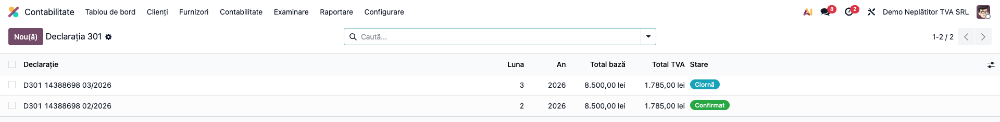
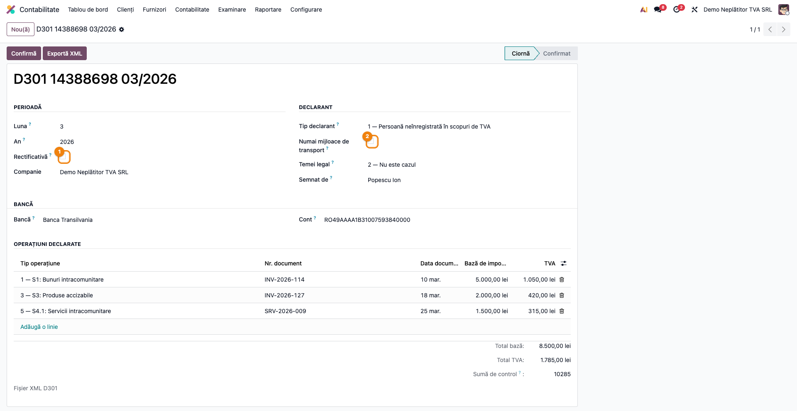
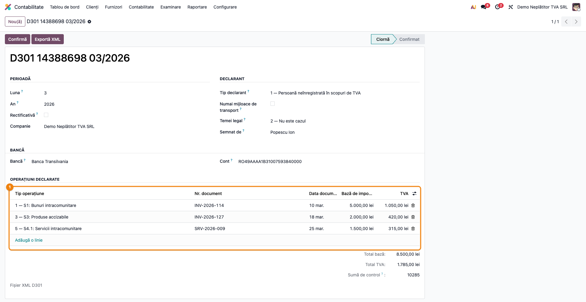
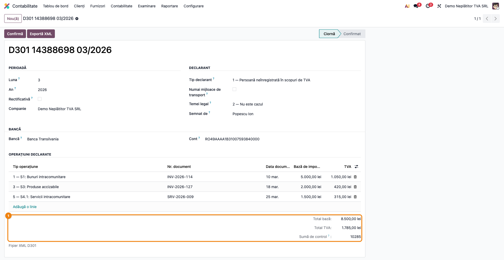
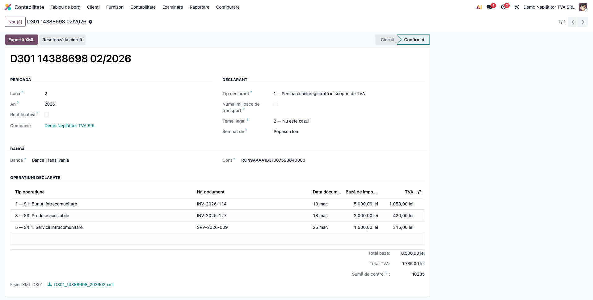

# Fișă Modul: Declarația 301 — Decontul Special de TVA

**Modul:** `l10n_ro_anaf_d301`
**Utilizator principal:** Contabil care deservește firme neînregistrate normal în scopuri de TVA
**Prioritate:** 🟡 Medie (numai pentru anumite categorii de plătitori, în lunile cu operațiuni)

---

## 1. Scop business

O firmă care **nu este înregistrată normal în scopuri de TVA** poate totuși să datoreze taxa: când
cumpără bunuri dintr-un alt stat membru, când achiziționează un mijloc de transport nou, când
primește servicii intracomunitare pentru care ea este obligată la plata TVA. În aceste cazuri nu
depune D300 — depune **decontul special de TVA, formularul 301**.

Modulul construiește declarația din operațiunile introduse una câte una (document, dată, valută,
curs), le agregă automat pe cele cinci secțiuni ale formularului, calculează suma de control și
numărul de evidență a plății, și exportă XML-ul acceptat de ANAF.

## 2. Bază legală și context

Formularul **301 — „Decont special de taxă pe valoarea adăugată"**, cu structura XML oficială
(`d301_20200130.xsd`) și validatorul ANAF J1.2.5. Secțiunile formularului urmăresc articolele din
Codul fiscal:

| Secțiune | Conținut |
|---|---|
| S1 | Achiziții intracomunitare de bunuri taxabile, altele decât mijloace de transport noi și produse accizabile |
| S2 | Achiziții intracomunitare de **mijloace de transport noi** |
| S3 | Achiziții intracomunitare de produse accizabile |
| S4 | Operațiuni prevăzute la art. 307 alin. (2), (3), (5) și (6) din Codul fiscal |
| S4.1 | Achiziții de servicii intracomunitare pentru care beneficiarul este obligat la plata TVA conform art. 307 |

Declarația **nu se depune lunar necondiționat**: se depune pentru fiecare lună în care au avut loc
operațiuni din cele cinci secțiuni, până la **data de 25 a lunii următoare** — termen pe care modulul
îl folosește și la calculul numărului de evidență a plății.

> **Temeiul legal art. 105 alin. (6) lit. a) din Legea nr. 207/2015** (Codul de procedură fiscală) se
> poate invoca **numai pe o declarație rectificativă**. Pe o declarație inițială, ANAF respinge
> fișierul — este regula R5b a validatorului.

## 3. Utilizatori și roluri

Contabilul firmei neplătitoare de TVA, respectiv contabilul de la firma de contabilitate care o
deservește.

Roluri recomandate pentru testare: **Contabil** (`account.group_account_user`) — modulul este vizibil
din acest grup; **Contabil-șef** (`account.group_account_manager`) pentru fluxul complet.

## 4. Conturi și date implicate

Modulul **nu generează note contabile** — construiește o declarație din date introduse, nu din
registrul contabil. TVA-ul datorat se înregistrează separat, prin notele proprii ale firmei. Pentru o
firmă neînregistrată în scopuri de TVA, taxa **nu este deductibilă**: intră în costul bunului sau în
cheltuială, cu contrapartida **4427** „TVA colectată". Furnizorul intracomunitar nu facturează TVA,
deci contul de furnizor (401) **nu** se atinge cu taxa datorată.

Date minime pentru demo:
- companie românească cu **CUI** completat și adresă;
- contact de declarație ANAF sau un semnatar introdus pe declarație;
- **banca și numărul de cont** ale firmei — ambele sunt obligatorii în schema ANAF;
- cel puțin o achiziție intracomunitară, cu numărul și data documentului.

## 5. Configurare inițială

1. Instalați `l10n_ro_anaf_d301`; apare în **Contabilitate → Raportare → Declarații ANAF**.
2. Verificați datele de identificare ale companiei (CUI, adresă, telefon, e-mail) — intră în antetul
   XML-ului.
3. Pregătiți **denumirea băncii și numărul de cont** — fără ele exportul se oprește.
4. Stabiliți dacă firma este neînregistrată în scopuri de TVA sau înregistrată conform art. 153^1 —
   valoarea se alege pe fiecare declarație, la *Tip declarant*.

## 6. Flux de utilizare

### Pasul 1 — Deschiderea listei de deconturi speciale

**Contabilitate → Raportare → Declarații ANAF → Decont special de TVA (D301)**.

Lista arată, pentru fiecare declarație, perioada, totalul bazei și al TVA-ului și starea (ciornă sau
confirmată).



### Pasul 2 — Antetul: perioada, declarantul și banca

Creați o declarație și completați **luna** (ca cifră, 1–12) și **anul** perioadei de raportare. În grupul *Declarant*
alegeți tipul declarantului și, dacă e cazul, bifați *Numai mijloace de transport*. În grupul *Bancă*
completați denumirea băncii și contul.



**Ce verificați:** perioada este luna raportată, nu luna curentă; *Temeiul legal* rămâne „Nu este
cazul" pe o declarație inițială; banca și contul sunt completate.

### Pasul 3 — Operațiunile declarate

În secțiunea *Operațiuni declarate* adăugați câte un rând pentru fiecare operațiune. **Tipul
operațiunii decide secțiunea** în care intră suma — este singura alegere care contează pentru
încadrarea în formular.



| Câmp | Ce conține |
|---|---|
| Tip operațiune | secțiunea formularului: S1, S2 (mijloace de transport noi), S3, S4 sau S4.1. Eticheta din listă e scurtă; descrierea completă a fiecărei secțiuni apare dacă treceți cu mouse-ul peste antetul coloanei |
| Nr. document / Dată document | identificarea documentului de achiziție |
| Bază de impozitare / TVA | sumele în lei |
| Sumă în valută, Valută, Curs de schimb | coloane ascunse implicit, pentru achizițiile în valută |

Coloanele de valută sunt **ascunse implicit**: le afișați din butonul de configurare a coloanelor
(pictograma din dreapta antetului listei).

**Ce verificați înainte de a continua:** fiecare rând are număr și dată de document; o operațiune în
valută are și cursul completat; pentru achizițiile în lei, coloanele de valută pot rămâne goale —
declarația le raportează automat ca RON la curs 1.

### Pasul 4 — Citirea totalurilor pe secțiuni

Sub lista de operațiuni, subsolul arată **Total bază**, **Total TVA** și **Suma de control**.

**Găsiți pe ecran:** totalurile se recalculează la fiecare rând adăugat; suma de control este partea
întreagă a totalului bazelor și al TVA-ului de pe toate cele cinci secțiuni.

**Verificați:** totalul bazei corespunde sumei documentelor introduse; suma de control nu este zero
când există operațiuni; dacă ați bifat *Numai mijloace de transport*, există cel puțin o operațiune
de tipul 2 — altfel ANAF respinge fișierul.



### Pasul 5 — Confirmarea și exportul XML

Abia după ce totalurile sunt confirmate pe ecran, apăsați **Confirmă**, apoi **Exportă XML**.
Fișierul este validat contra schemei oficiale înainte de a fi atașat. Exportul e tehnic posibil și din
ciornă, dar declarația se confirmă întâi — confirmarea e gestul care oprește modificările ulterioare.



XML-ul rezultat are forma:

```xml
<?xml version='1.0' encoding='UTF-8'?>
<declaratie301 xmlns="mfp:anaf:dgti:d301:declaratie:v1" luna="3" an="2026" d_rec="0"
               mijl_trans="0" temei="2" pers_inreg="1" cif="20603502" denumire="SC TEST SRL"
               banca="Banca Transilvania" cont="RO49AAAA1B31007593840000"
               nr_evid="10301010326250426000036"
               baza1="5000.00" tva1="1050.00" baza2="0.00" tva2="0.00"
               baza3="2000.00" tva3="420.00" baza4="0.00" tva4="0.00"
               baza5="0.00" tva5="0.00" totalPlata_A="8470"
               nume_declarant="Popescu" prenume_declarant="Ion" functia_declarant="accountant">
  <sectiune tip_operatie="1" nr_doc="INV-2026-114" data_doc="10.03.2026"
            val_valuta="1000.00" tip_valuta="EUR" curs_valutar="5.0000"
            baza="5000.00" tva="1050.00"/>
  <sectiune tip_operatie="3" nr_doc="INV-2026-127" data_doc="18.03.2026"
            val_valuta="2000.00" tip_valuta="RON" curs_valutar="1.0000"
            baza="2000.00" tva="420.00"/>
</declaratie301>
```
Gărzile opresc exportul înainte de a produce un fișier pe care ANAF l-ar respinge:

| Situație | Ce se întâmplă |
|---|---|
| Companie fără CUI | export blocat |
| Bancă sau cont necompletat | export blocat |
| Declarație fără nicio operațiune | export blocat |
| Bifa „numai mijloace de transport" fără o operațiune de tip 2 | export blocat |
| Sumă în valută fără curs de schimb | export blocat |
| Temei legal art. 105 (6) a) pe o declarație inițială | respins la salvare |

### Note de monografie și raportare

Modulul **nu produce note contabile**. TVA-ul datorat pentru operațiunile declarate se înregistrează
separat, prin notele firmei:

| Moment | Notă | Explicație |
|---|---|---|
| La achiziție | **Dr 3xx/6xx = Cr 4427** | taxa nedeductibilă intră în costul bunului sau în cheltuială |
| La sfârșitul perioadei | **Dr 4427 = Cr 4423** | regularizarea TVA de plată |
| La plată | **Dr 4423 = Cr 5121** | achitarea către buget |

Declarația raportează sumele, nu le contabilizează.

## 7. Legături cu alte module / declarații

| Modul / proces | Rol în flux | Tip legătură |
|---|---|---|
| `account`, `l10n_ro` | contabilitatea și localizarea românească | dependență |
| `l10n_ro_anaf_base` | meniul de declarații ANAF, datele companiei și ale declarantului | dependență |
| `l10n_ro_anaf_d390` | declarația recapitulativă, pentru aceleași achiziții intracomunitare | corelație manuală |
| `l10n_ro_anaf_submission` | depunerea electronică prin SPV | complementar |
| `l10n_ro_anaf_duk` | validarea cu DUKIntegrator înainte de depunere | complementar |

**Ce este automat:** agregarea pe secțiuni, suma de control, numărul de evidență a plății, gărzile de
corelație și validarea XML-ului contra schemei.

**Ce rămâne manual:** introducerea operațiunilor (nu se preiau din facturi), banca și contul,
semnatarul dacă diferă de contactul de declarație, și înregistrările contabile aferente.

## 8. Verificări pentru consultant

- [ ] Modulul apare în **Contabilitate → Raportare → Declarații ANAF**.
- [ ] O declarație fără bancă sau cont **nu** se poate exporta.
- [ ] O declarație fără nicio operațiune **nu** se poate exporta.
- [ ] Totalurile pe secțiuni corespund sumei operațiunilor de fiecare tip.
- [ ] Suma de control este partea întreagă a totalului baze + TVA.
- [ ] Numărul de evidență a plății are 23 de cifre.
- [ ] Bifa „numai mijloace de transport" fără o operațiune de tip 2 **blochează** exportul.
- [ ] *Temeiul legal art. 105 (6) a)* nu se poate salva pe o declarație inițială.
- [ ] O operațiune în valută fără curs **blochează** exportul.
- [ ] Sumele negative sunt respinse.
- [ ] XML-ul generat trece validatorul ANAF cu „Validare fara erori".
- [ ] Interfața este în limba română.

## 9. Mesaje de eroare frecvente

| Mesaj / simptom | Cauză probabilă | Remediere |
|---|---|---|
| „Denumirea băncii și numărul de cont sunt obligatorii pentru ANAF." | Bancă sau cont necompletat | Completați ambele câmpuri din grupul *Bancă* |
| „Decontul special de TVA necesită cel puțin o operațiune." | Declarație goală | Adăugați operațiunile din perioada raportată |
| „Declarația depusă pentru mijloace de transport noi trebuie să conțină cel puțin o operațiune de tipul 2 (secțiunea S2)." | Bifa de transport cu operațiuni de alt tip | Încadrați operațiunea în S2 sau debifați |
| „Temeiul legal al art. 105 alin. (6) lit. a) poate fi invocat numai pe o declarație rectificativă." | Temei ales pe o declarație inițială | Bifați *Rectificativă* sau lăsați „Nu este cazul" |
| „Operațiunea „…" are o sumă în valută, dar nu are curs de schimb." | Curs necompletat | Completați cursul de schimb al zilei documentului |
| „Sumele declarate nu pot fi negative." | Bază sau TVA negativ | Corectați suma |
| „Doar o declarație în ciornă poate fi confirmată." | Declarația e deja confirmată | Readuceți-o în ciornă dacă mai aveți de corectat |

## 10. Capturi de ecran

Capturile (`readme/screenshots/`) sunt **generate automat** din `tests/test_screenshots.py`
(mixinul `ScreenshotCase` din `l10n_ro_doc_screenshots`, import defensiv), în **limba română**, pe
planul de conturi RO:

1. `01_lista.png` — lista deconturilor speciale D301.
2. `02_antet.png` — antetul: perioada, declarantul și banca.
3. `03_operatiuni.png` — operațiunile declarate, cu tipul care decide secțiunea.
4. `04_totaluri.png` — totalurile pe secțiuni și suma de control.
5. `05_confirmata.png` — declarația confirmată, cu XML-ul generat.

Regenerare:

```bash
./odoo/odoo-bin -c odoo.conf -d <db> -i l10n_ro_anaf_d301,l10n_ro_doc_screenshots \
    --test-tags=fise_screenshots --stop-after-init
```

## 11. Observații pentru manual

Trei idei de păstrat:

1. **Tipul operațiunii este singura încadrare care contează.** Secțiunea nu se alege separat: suma
   intră automat acolo unde o trimite tipul. Confuzia frecventă este că mijloacele de transport noi
   ar fi ultima secțiune — de fapt sunt **secțiunea 2**, iar S4.1 este a serviciilor intracomunitare.
2. **Temeiul legal este pentru rectificative.** Pe o declarație inițială, ANAF îl respinge — nu e o
   bifă pe care o poți lăsa „pentru siguranță".
3. **Banca și contul nu sunt opționale.** Schema le cere obligatoriu, deși pe formularul tipărit par
   informații secundare.
