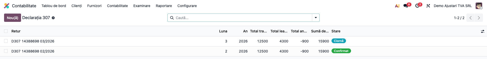
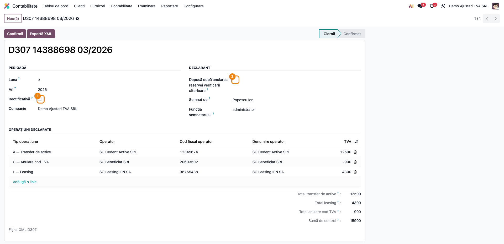
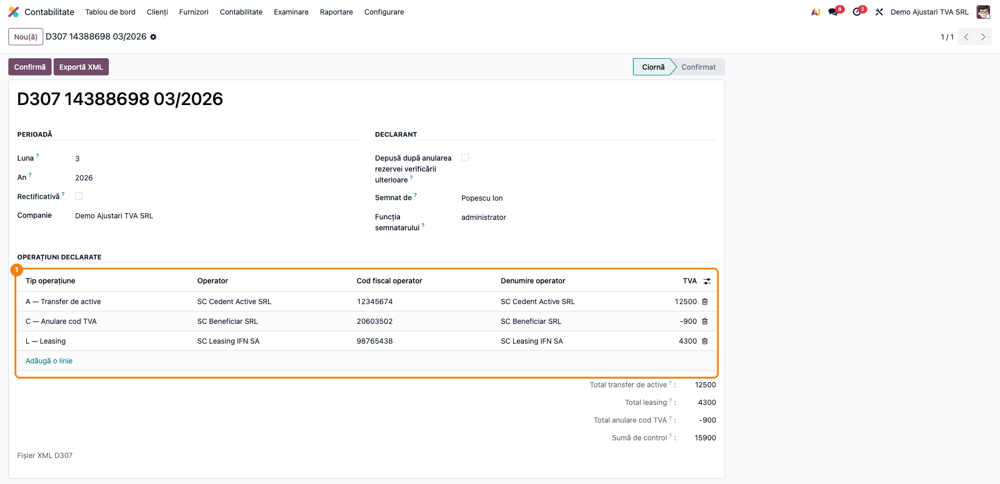
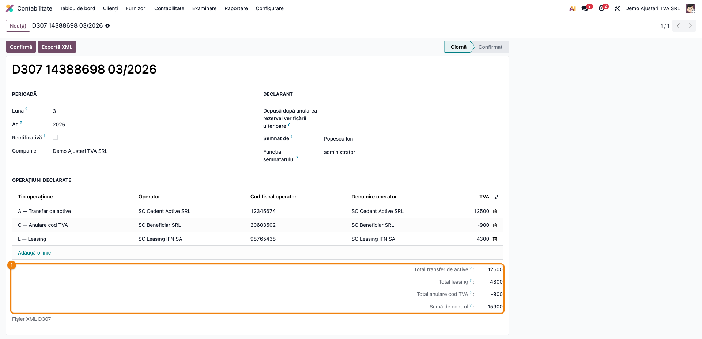
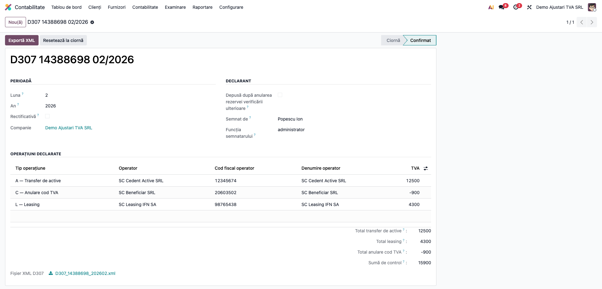

# Fișă Modul: Declarația 307 — Ajustările de TVA

**Modul:** `l10n_ro_anaf_d307`
**Utilizator principal:** Contabil-șef, responsabil cu declarațiile ANAF
**Prioritate:** 🟡 Medie (se depune doar în lunile cu operațiuni care impun ajustarea taxei)

---

## 1. Scop business

Când o firmă transferă active, când se închide un contract de leasing prin transferul
proprietății, sau când i se anulează codul de înregistrare în scopuri de TVA, taxa dedusă
anterior trebuie **ajustată**. Sumele rezultate nu se raportează în decontul obișnuit: se
declară separat, prin **formularul 307**.

Modulul construiește declarația din operațiunile introduse una câte una, fiecare cu
operatorul implicat și TVA-ul aferent, agregă automat totalurile pe cele trei tipuri și
exportă XML-ul acceptat de ANAF.

## 2. Bază legală și context

Formularul **307 — „Declarație privind sumele rezultate din ajustarea/corecția
ajustărilor/regularizarea taxei pe valoarea adăugată"**, aprobat prin **OPANAF 793/2016**,
cu structura XML publicată la 07.11.2017 și schema `d307_20171205.xsd`.

Cele trei situații care obligă la depunere sunt chiar tipurile de operațiune din formular:

| Tip | Situația |
|---|---|
| **A** | transferul de active |
| **L** | transferul dreptului de proprietate asupra activelor corporale fixe achiziționate printr-un contract de leasing |
| **C** | anularea codului de înregistrare în scopuri de TVA conform art. 316 alin. (11) lit. a)–e), g) sau h) din Codul fiscal |

> Când declarația se depune **după anularea rezervei verificării ulterioare**, ANAF cere
> obligatoriu temeiul legal al corectării: art. 105 alin. (6) lit. a) din Legea nr. 207/2015
> (îndeplinirea sau neîndeplinirea unei condiții prevăzute de lege) sau lit. b) (hotărâre
> judecătorească definitivă).

## 3. Utilizatori și roluri

Contabilul-șef, care decide ajustarea și semnează declarația.

Roluri recomandate pentru testare: **Contabil** (`account.group_account_user`) pentru
consultare; **Contabil-șef** (`account.group_account_manager`) pentru fluxul complet.

## 4. Conturi și date implicate

Modulul **nu generează note contabile** — raportează sumele deja ajustate în contabilitate.
Ajustarea propriu-zisă se înregistrează separat, de regulă prin **4426** „TVA deductibilă"
(în roșu, la ajustarea în minus) în corespondență cu contul de cheltuială sau cu contul
activului, după caz.

Date minime pentru demo:
- companie românească cu **CUI** completat și adresă;
- semnatarul declarației și funcția lui;
- partenerii implicați (cedent, finanțator, beneficiar), cu codul fiscal completat.

## 5. Configurare inițială

1. Instalați `l10n_ro_anaf_d307`; apare în **Contabilitate → Raportare → Declarații ANAF**.
2. Verificați datele de identificare ale companiei (CUI, adresă, telefon, e-mail) — intră în
   antetul XML-ului.
3. Asigurați-vă că partenerii implicați au codul fiscal completat: se preia automat pe linie.

## 6. Flux de utilizare

### Pasul 1 — Deschiderea listei de declarații

**Contabilitate → Raportare → Declarații ANAF → D307 Ajustări de TVA**.

Lista arată perioada, totalurile pe cele trei tipuri, suma de control și starea.



### Pasul 2 — Antetul: perioada și tipul declarației

Creați o declarație și completați **luna** (ca cifră, 1–12) și **anul** perioadei de
raportare. Bifați *Rectificativă* dacă o corectați pe una depusă, respectiv *Depusă după
anularea rezervei verificării ulterioare* — caz în care câmpul *Temei legal* devine
obligatoriu și apare pe formular.



**Ce verificați:** perioada este luna în care s-a făcut ajustarea; semnatarul și funcția
sunt completate — intră ca atare în XML.

### Pasul 3 — Operațiunile declarate

În secțiunea *Operațiuni declarate* adăugați câte un rând pentru fiecare operațiune.
**Tipul operațiunii decide în ce total intră suma.**



| Câmp | Ce conține |
|---|---|
| Tip operațiune | A (transfer de active), L (leasing) sau C (anulare cod TVA) |
| Operator | partenerul implicat; completează automat codul fiscal și denumirea |
| Cod fiscal operator / Denumire operator | atributele ANAF `codO` și `denO` |
| TVA | suma rezultată din ajustare, în lei întregi — **poate fi negativă** |

**Ce verificați înainte de a continua:** fiecare operator apare **o singură dată pe același
tip de operațiune** — dacă are mai multe ajustări de același fel, sumele se cumulează pe o
linie; ajustările în minus se trec cu semnul minus, nu pe o linie separată.

### Pasul 4 — Citirea totalurilor

Sub lista de operațiuni, subsolul arată totalurile pe cele trei tipuri și suma de control.

**Găsiți pe ecran:** *Total transfer de active* (atributul `tvaA`), *Total leasing* (`tvaL`),
*Total anulare cod TVA* (`tvaC`) și *Suma de control* (`totalPlata_A`).

**Verificați:** fiecare total corespunde sumei liniilor de tipul respectiv; suma de control
este suma tuturor, inclusiv a ajustărilor negative.



### Pasul 5 — Confirmarea și exportul XML

După ce totalurile sunt confirmate pe ecran, apăsați **Confirmă**, apoi **Exportă XML**.
Fișierul e validat contra schemei oficiale înainte de a fi atașat.



XML-ul rezultat are forma:

```xml
<?xml version='1.0' encoding='UTF-8'?>
<declaratie307 xmlns="mfp:anaf:dgti:d307:declaratie:v1" luna="3" an="2026" d_rec="0"
               d_anulare="0" nume_declar="Popescu" prenume_declar="Ion"
               functie_declar="administrator" cif="20603502" den="SC TEST SRL"
               adresa="Str. Libertatii 10 Cluj-Napoca"
               tvaA="12500" tvaL="4300" tvaC="-900" totalPlata_A="15900">
  <operatie tip="A" codO="20603503" denO="SC Cedent SRL" tva="12500"/>
  <operatie tip="L" codO="20603504" denO="SC Leasing IFN SA" tva="4300"/>
  <operatie tip="C" codO="20603505" denO="SC Beneficiar SRL" tva="-900"/>
</declaratie307>
```

Gărzile opresc exportul înainte de a produce un fișier pe care ANAF l-ar respinge:

| Situație | Ce se întâmplă |
|---|---|
| Companie fără CUI | export blocat |
| Declarație fără nicio operațiune | export blocat |
| Același operator de două ori pe același tip | export blocat |
| Bifa „după anularea rezervei" fără temei legal | respins la salvare |
| Perioadă anterioară anului 2016 | respins la salvare |

### Note de monografie și raportare

Modulul **nu produce note contabile**. Ajustarea taxei se înregistrează separat, prin notele
firmei, înainte de a o declara: declarația raportează sumele, nu le generează.

## 7. Legături cu alte module / declarații

| Modul / proces | Rol în flux | Tip legătură |
|---|---|---|
| `account`, `l10n_ro` | contabilitatea și localizarea românească | dependență |
| `l10n_ro_anaf_base` | meniul de declarații ANAF, datele companiei și ale declarantului | dependență |
| `l10n_ro_anaf_d300` | decontul de TVA al perioadei, unde ajustarea își are corespondentul contabil | corelație manuală |
| `l10n_ro_anaf_submission` | depunerea electronică prin SPV | complementar |
| `l10n_ro_anaf_duk` | validarea cu DUKIntegrator înainte de depunere | complementar |

**Ce este automat:** agregarea pe cele trei tipuri, suma de control, preluarea codului fiscal
de pe partener, gărzile de corelație și validarea XML-ului contra schemei.

**Ce rămâne manual:** introducerea operațiunilor și a sumelor ajustate (nu se deduc automat
din mișcările de active), și înregistrările contabile aferente.

## 8. Verificări pentru consultant

- [ ] Modulul apare în **Contabilitate → Raportare → Declarații ANAF**.
- [ ] Alegerea partenerului completează codul fiscal și denumirea operatorului.
- [ ] Totalurile pe tip corespund sumei liniilor de tipul respectiv.
- [ ] Suma de control include și ajustările negative.
- [ ] Un TVA negativ se poate declara (validatorul îl acceptă din 24.11.2017).
- [ ] Același operator de două ori pe același tip **blochează** exportul.
- [ ] Bifa „după anularea rezervei" fără temei legal **nu** se poate salva.
- [ ] O perioadă anterioară anului 2016 **nu** se poate salva.
- [ ] O declarație fără operațiuni **nu** se poate exporta.
- [ ] XML-ul generat trece validatorul ANAF cu „Validare fara erori".
- [ ] Interfața este în limba română.

## 9. Mesaje de eroare frecvente

| Mesaj / simptom | Cauză probabilă | Remediere |
|---|---|---|
| „Declarația necesită cel puțin o operațiune." | Declarație goală | Adăugați operațiunile ajustate în perioadă |
| „Operatorul „…" apare de mai multe ori pentru tipul de operațiune „…"" | Două linii pentru același partener și același tip | Cumulați sumele pe o singură linie |
| „Declarația depusă după anularea rezervei verificării ulterioare trebuie să precizeze temeiul legal al corectării." | Bifa fără temei | Alegeți temeiul: lit. a) sau lit. b) |
| „Declarația 307 acoperă doar perioade începând cu anul 2016." | An anterior | Corectați anul perioadei |
| „Luna trebuie să fie între 1 și 12." | Lună invalidă | Corectați luna |
| „Doar o declarație în ciornă poate fi confirmată." | Declarația e deja confirmată | Readuceți-o în ciornă dacă mai aveți de corectat |

## 10. Capturi de ecran

Capturile (`readme/screenshots/`) sunt **generate automat** din `tests/test_screenshots.py`
(mixinul `ScreenshotCase` din `l10n_ro_doc_screenshots`, import defensiv), în **limba
română**, pe planul de conturi RO:

1. `01_lista.png` — lista declarațiilor D307.
2. `02_antet.png` — antetul: perioada și tipul declarației.
3. `03_operatiuni.png` — operațiunile declarate, cu tipul care decide totalul.
4. `04_totaluri.png` — totalurile pe tipuri și suma de control.
5. `05_confirmata.png` — declarația confirmată, cu XML-ul generat.

Regenerare:

```bash
./odoo/odoo-bin -c odoo.conf -d <db> -i l10n_ro_anaf_d307,l10n_ro_doc_screenshots \
    --test-tags=fise_screenshots --stop-after-init
```

## 11. Observații pentru manual

Trei idei de păstrat:

1. **TVA-ul poate fi negativ.** Ajustarea în minus se trece cu semnul minus pe aceeași
   linie, nu pe una separată; validatorul acceptă sume negative din 24.11.2017.
2. **Un operator, o linie pe tip.** Dacă același partener are mai multe ajustări de același
   fel, sumele se cumulează — altfel ANAF respinge declarația.
3. **Temeiul legal apare doar când e cerut.** Se completează numai pe declarațiile depuse
   după anularea rezervei verificării ulterioare; în rest, atributul nici nu se scrie în XML.
