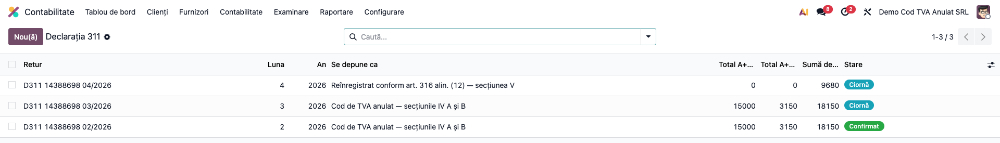
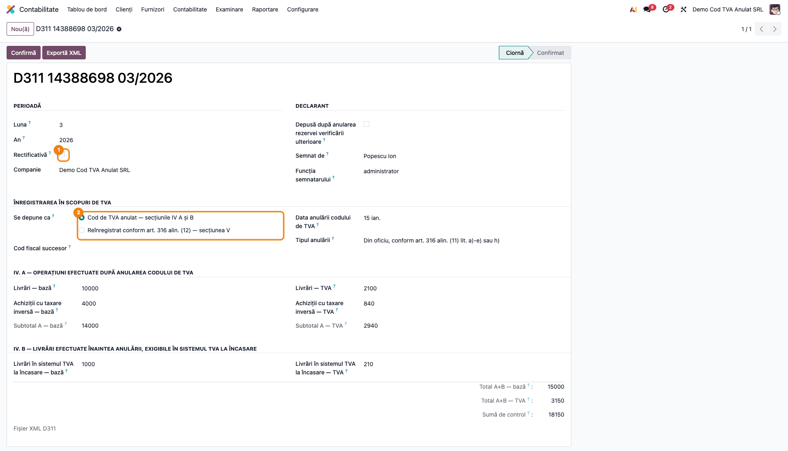
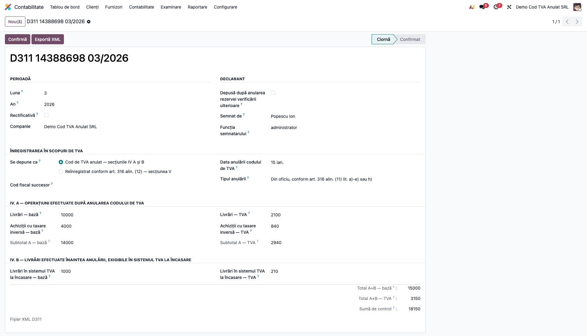
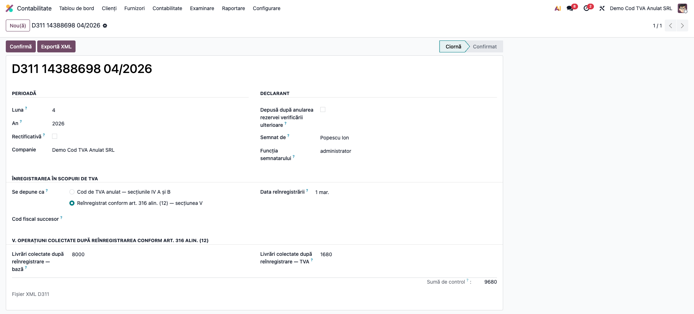
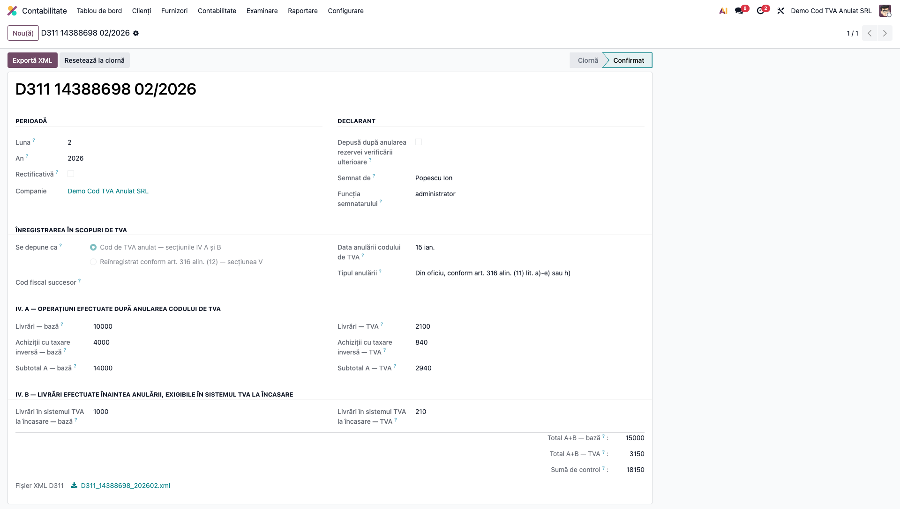

# Fișă Modul: Declarația 311 — TVA la Cod Anulat

**Modul:** `l10n_ro_anaf_d311`
**Utilizator principal:** Contabil-șef, responsabil cu declarațiile ANAF
**Prioritate:** 🔴 Ridicată (singura cale de a declara taxa colectată fără cod valabil de TVA)

---

## 1. Scop business

Când unei firme i se anulează codul de înregistrare în scopuri de TVA, ea **continuă să
datoreze taxa** pentru operațiunile efectuate în perioada fără cod valabil — dar nu o mai
poate declara prin decontul obișnuit, fiindcă nu mai are cod. Pentru asta există
**formularul 311**.

Acelaşi formular acoperă și situația inversă: firma **reînregistrată** ulterior, care
colectează acum taxa pentru operațiuni din perioada anulării, pentru care nu a colectat-o
atunci.

## 2. Bază legală și context

Formularul **311 — „Declarație privind taxa pe valoarea adăugată colectată, datorată de
către persoanele impozabile al căror cod de înregistrare în scopuri de TVA a fost anulat
conform art. 316 alin. (11) lit. a)–e), lit. g) sau lit. h) din Codul fiscal"**, cu structura
XML publicată la 29.01.2021 și schema `d311_20210129.xsd`.

Declarația are **două situații, care se exclud reciproc**:

| Situație | Cine depune | Secțiunea completată |
|---|---|---|
| Cod anulat | persoana al cărei cod a fost anulat, pentru perioada fără cod valabil | IV (A și B) |
| Reînregistrat | persoana reînregistrată conform art. 316 alin. (12), care colectează retroactiv | V |

> Exact una dintre datele **Data anulării** / **Data reînregistrării** se completează:
> validatorul respinge declarația dacă sunt amândouă completate sau amândouă goale.

## 3. Utilizatori și roluri

Contabilul-șef al firmei cu codul anulat, sau contabilul de la firma care o deservește.

Roluri recomandate pentru testare: **Contabil** (`account.group_account_user`) pentru
consultare; **Contabil-șef** (`account.group_account_manager`) pentru fluxul complet.

## 4. Conturi și date implicate

Modulul **nu generează note contabile** — raportează taxa deja colectată în contabilitate.
Colectarea se înregistrează separat, prin **4427** „TVA colectată", iar la plată prin
**4423 = 5121**.

Date minime pentru demo:
- companie românească cu **CUI** completat și adresă;
- semnatarul declarației și funcția lui;
- data anulării (sau a reînregistrării) codului de TVA;
- sumele colectate în perioada raportată.

## 5. Configurare inițială

1. Instalați `l10n_ro_anaf_d311`; apare în **Contabilitate → Raportare → Declarații ANAF**.
2. Verificați datele de identificare ale companiei (CUI, adresă, telefon, e-mail) — intră în
   antetul XML-ului.
3. Pregătiți data deciziei de anulare a codului de TVA, respectiv a reînregistrării.

## 6. Flux de utilizare

### Pasul 1 — Deschiderea listei de declarații

**Contabilitate → Raportare → Declarații ANAF → D311 TVA după anularea codului**.



### Pasul 2 — Antetul și alegerea situației

Creați o declarație, completați **luna** (ca cifră, 1–12) și **anul**, apoi alegeți la
*Se depune ca* una dintre cele două situații. **Alegerea decide ce rubrici se deschid**:
restul formularului rămâne ascuns, fiindcă ANAF respinge declarația dacă se completează
amândouă secțiunile.



**Ce verificați:** perioada e luna raportată; pentru codul anulat sunt completate *Data
anulării* și *Tipul anulării* — din oficiu (art. 316 alin. (11) lit. a)–e) sau h)) ori la
cerere (lit. g), pentru cei care au aplicat sistemul TVA la încasare).

### Pasul 3 — Secțiunea IV: operațiunile din perioada fără cod valabil

Completați rubricile secțiunii A — livrările (rd. 01) și achizițiile pentru care sunteți
persoana obligată la plata taxei (rd. 02) — iar în secțiunea B livrările efectuate
**înaintea** anulării, a căror exigibilitate intervine în perioada fără cod, în sistemul TVA
la încasare (rd. 04).

Subtotalul și totalul se calculează singure, după formulele formularului.



| Rând | Ce conține | Atribut ANAF |
|---|---|---|
| 01 | Livrări de bunuri și/sau prestări de servicii | `OB_11` / `OB_12` |
| 02 | Achiziții pentru care sunteți persoana obligată la plata taxei | `OB_21` / `OB_22` |
| 03 | Subtotal A (= 01 + 02) | `OB_31` / `OB_32` |
| 04 | Livrări de dinainte de anulare, exigibile în sistemul TVA la încasare | `OB_41` / `OB_42` |
| 05 | Total A+B (= 03 + 04) | `OB_51` / `OB_52` |

### Pasul 4 — Secțiunea V: persoana reînregistrată

Dacă ați ales *Reînregistrat conform art. 316 alin. (12)*, formularul arată în schimb o
singură pereche de rubrici: operațiunile efectuate în perioada în care codul era anulat,
pentru care **nu a fost colectată taxa atunci** — indiferent dacă au fost sau nu emise
facturi.



**Ce verificați:** *Data reînregistrării* e completată, iar rubricile secțiunii IV sunt
goale — cele două secțiuni nu pot coexista.

### Pasul 5 — Confirmarea și exportul XML

După ce suma de control e confirmată pe ecran, apăsați **Confirmă**, apoi **Exportă XML**.



XML-ul rezultat are forma:

```xml
<?xml version='1.0' encoding='UTF-8'?>
<declaratie311 xmlns="mfp:anaf:dgti:d311:declaratie:v1" luna="3" an="2026" d_rec="0"
               d_anulare="0" nume_declar="Popescu" prenume_declar="Ion"
               functie_declar="administrator" cui="20603502" den="SC TEST SRL"
               adresa="Str. Libertatii 10 Cluj-Napoca"
               Data_A="15.01.2026" d_anul1="1" d_anul2="0"
               OB_11="10000" OB_12="2100" OB_21="4000" OB_22="840"
               OB_31="14000" OB_32="2940" OB_41="1000" OB_42="210"
               OB_51="15000" OB_52="3150" totalPlata_A="18150"/>
```

Gărzile opresc exportul înainte de a produce un fișier pe care ANAF l-ar respinge:

| Situație | Ce se întâmplă |
|---|---|
| Companie fără CUI | export blocat |
| Lipsește data anulării / a reînregistrării, după caz | export blocat |
| Rubrici completate în ambele secțiuni | export blocat |
| Declarație inițială cu suma de control zero | export blocat |
| Bifa „după anularea rezervei" fără temei legal | respins la salvare |
| Perioadă anterioară anului 2016 | respins la salvare |

### Note de monografie și raportare

Modulul **nu produce note contabile**. Taxa colectată se înregistrează separat, prin notele
firmei — `Dr 4111/6xx = Cr 4427` la colectare, apoi `Dr 4423 = Cr 5121` la plată.

## 7. Legături cu alte module / declarații

| Modul / proces | Rol în flux | Tip legătură |
|---|---|---|
| `account`, `l10n_ro` | contabilitatea și localizarea românească | dependență |
| `l10n_ro_anaf_base` | meniul de declarații ANAF, datele companiei și ale declarantului | dependență |
| `l10n_ro_anaf_d307` | ajustările de TVA, inclusiv cele datorate anulării codului | corelație manuală |
| `l10n_ro_anaf_submission` | depunerea electronică prin SPV | complementar |
| `l10n_ro_anaf_duk` | validarea cu DUKIntegrator înainte de depunere | complementar |

**Ce este automat:** subtotalurile și totalul, suma de control, perechea complementară de
bife a temeiului anulării, gărzile de corelație și validarea XML-ului contra schemei.

**Ce rămâne manual:** sumele colectate (nu se deduc din facturi — în perioada fără cod
valabil firma nu emite facturi cu TVA în mod obișnuit) și înregistrările contabile aferente.

## 8. Verificări pentru consultant

- [ ] Modulul apare în **Contabilitate → Raportare → Declarații ANAF**.
- [ ] Alegerea situației ascunde rubricile secțiunii care nu se aplică.
- [ ] Subtotalul rd. 03 este suma rândurilor 01 și 02.
- [ ] Totalul rd. 05 este suma rândurilor 03 și 04.
- [ ] Suma de control acoperă ambele secțiuni.
- [ ] Bifele temeiului anulării ies complementare în XML (una 1, cealaltă 0).
- [ ] O declarație cu ambele date completate **nu** se poate exporta.
- [ ] O declarație inițială cu totalul zero **nu** se poate exporta; una rectificativă, da.
- [ ] Bifa „după anularea rezervei" fără temei legal **nu** se poate salva.
- [ ] XML-ul generat trece validatorul ANAF cu „Validare fara erori".
- [ ] Interfața este în limba română.

## 9. Mesaje de eroare frecvente

| Mesaj / simptom | Cauză probabilă | Remediere |
|---|---|---|
| „Data anulării codului de TVA este obligatorie." | Situația „cod anulat" fără dată | Completați data din decizia de anulare |
| „Temeiul anulării este obligatoriu." | Lipsește alegerea din oficiu / la cerere | Alegeți temeiul anulării |
| „Data reînregistrării conform art. 316 alin. (12) este obligatorie." | Situația „reînregistrat" fără dată | Completați data reînregistrării |
| „Secțiunea V este rezervată persoanelor reînregistrate…" | Rubrici completate în ambele secțiuni | Goliți rubricile secțiunii care nu se aplică |
| „O declarație inițială trebuie să declare o sumă nenulă." | Declarație inițială pe zero | Completați sumele sau bifați *Rectificativă* |
| „Declarația 311 acoperă doar perioade începând cu anul 2016." | An anterior | Corectați anul perioadei |
| „Doar o declarație în ciornă poate fi confirmată." | Declarația e deja confirmată | Readuceți-o în ciornă dacă mai aveți de corectat |

## 10. Capturi de ecran

Capturile (`readme/screenshots/`) sunt **generate automat** din `tests/test_screenshots.py`
(mixinul `ScreenshotCase` din `l10n_ro_doc_screenshots`, import defensiv), în **limba
română**, pe planul de conturi RO:

1. `01_lista.png` — lista declarațiilor D311.
2. `02_antet.png` — antetul și alegerea situației.
3. `03_sectiunea_iv.png` — secțiunea IV, cu subtotalul și totalul calculate.
4. `04_sectiunea_v.png` — secțiunea V, pentru persoana reînregistrată.
5. `05_confirmata.png` — declarația confirmată, cu XML-ul generat.

Regenerare:

```bash
./odoo/odoo-bin -c odoo.conf -d <db> -i l10n_ro_anaf_d311,l10n_ro_doc_screenshots \
    --test-tags=fise_screenshots --stop-after-init
```

## 11. Observații pentru manual

Trei idei de păstrat:

1. **Cele două situații se exclud.** Nu e o preferință de completare: ANAF respinge
   declarația în care apar amândouă datele sau rubrici din ambele secțiuni.
2. **Bifele temeiului anulării sunt complementare.** Formularul are două căsuțe, dar una
   singură poate fi bifată — modulul le scrie automat, din alegerea făcută.
3. **Schema publicată de ANAF e greșită aici.** Ea cere data anulării obligatoriu, ceea ce ar
   face imposibilă secțiunea V descrisă tot de ea; modulul folosește o schemă corectată,
   după validator. Detaliile sunt în `readme/CONTEXT.md`.
