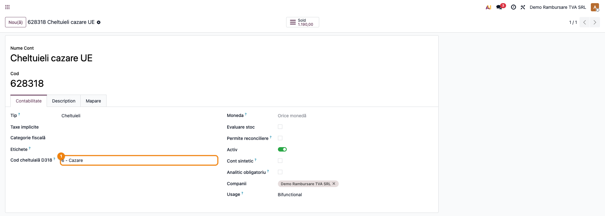
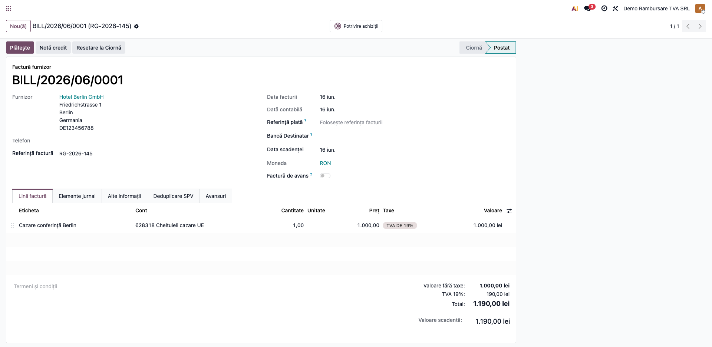
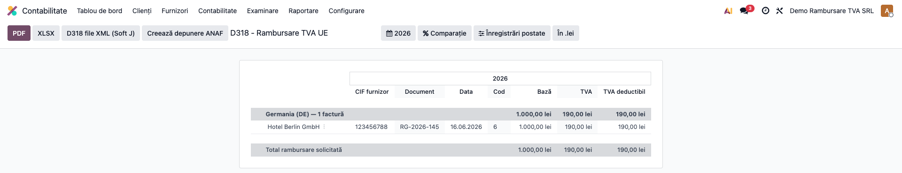

# Fișă Modul: D318 — Rambursare TVA UE

**Poziție plan:** C7
**Modul:** `l10n_ro_anaf_d318`
**FR:** FR-35 / FR-55
**Capitol manual:** Cap 4.7
**Utilizator principal:** Contabil TVA, Responsabil fiscal
**Prioritate:** 🟡 Medie

---

## 1. Scop business

Modulul pregătește și exportă Declarația 318 — cererea de rambursare a TVA achitată în alt stat
membru UE de către o persoană impozabilă stabilită în România (combustibil, cazare, transport,
participare la târguri etc.), conform procedurii din Directiva 2008/9/CE.

Modulul listează facturile de achiziție de la furnizori din alte state membre care poartă **TVA
local** (achitat în statul respectiv, nu prin taxare inversă), le grupează pe statul de rambursare,
le atribuie codul de cheltuială ANAF (1–10) și generează fișierul XML validat XSD, gata de depus.

## 2. Bază legală și context

- Directiva 2008/9/CE — procedura de rambursare a TVA către persoane impozabile stabilite în alt
  stat membru.
- Formularul ANAF D318, depus prin SPV; schema XML `mfp:anaf:dgti:d318:declaratie:v1`.
- Termen: 30 septembrie a anului următor; sumă minimă 50 EUR (cerere anuală) / 400 EUR (trimestrială).

## 3. Utilizatori și roluri

- Contabil TVA: mapează conturile de cheltuieli pe codurile D318 și verifică facturile eligibile.
- Responsabil fiscal: validează cererea și suma solicitată.
- Contabil șef: aprobă cererea înainte de depunere.

## 4. Date implicate

- facturi furnizori din alte state membre UE, cu TVA local;
- statul de rambursare (țara furnizorului);
- codul de cheltuială D318 (1–10) de pe contul contabil;
- baza, TVA și TVA deductibil per factură;
- contul bancar de rambursare (IBAN/BIC) și limba cererii (configurare companie).

> **TVA deductibil** în context D318 = partea de TVA **recuperabilă conform regulilor statului de
> rambursare** (Directiva 2008/9/CE), NU TVA deductibil intern RO (cont 4426). De aceea nu se
> corelează direct cu deducerea din D300 — D318 vizează TVA achitată și nededusă în România.

> **Monedă:** sumele per factură se raportează în moneda documentului (atributele `currency_ta/va/dva`
> din XML). Totalul rambursării din antet (`amount`) și suma de control sunt exprimate în **EUR**
> (moneda de rambursare), convertind TVA deductibil al fiecărei facturi la cursul de la data facturii.

## 5. Configurare inițială

1. Instalați `l10n_ro_anaf_d318` (depinde de `l10n_ro_anaf_base`).
2. **Setări → Contabilitate → Declarații ANAF România**: alegeți limba cererii D318, tipul
   titularului de cont (solicitant/reprezentant) și contul bancar de rambursare (IBAN/BIC). Dacă nu
   este selectat, se folosește primul cont bancar al companiei.
3. Pe conturile de cheltuieli care pot face obiectul rambursării, setați **Cod cheltuială D318**
   (1–10) — vezi captura `01_cont_cod_d318.png`. Liniile fără cod mapat primesc implicit codul „10 —
   Altele".



## 6. Flux de utilizare

### Pasul 1 — Înregistrarea facturilor UE

Înregistrați facturile de achiziție de la furnizori din alte state membre, cu TVA local, pe conturile
de cheltuieli mapate. Furnizorul trebuie să aibă **țara** și, ideal, **codul de TVA** completate.



### Pasul 2 — Deschiderea raportului D318

Meniu: `Contabilitate → Raportare → Declarații (legal) → D318 - Rambursare TVA UE`.

Raportul afișează facturile eligibile **grupate pe statul de rambursare**, cu CIF furnizor, document,
dată, codul de cheltuială și sumele (bază / TVA / TVA deductibil), plus totalul rambursării solicitate.
Selectați perioada (implicit anul curent).



### Pasul 3 — Verificare

Confirmați că toate facturile UE eligibile apar, că au codul de cheltuială corect și că suma
solicitată corespunde documentelor justificative (vezi secțiunea 8).

### Pasul 4 — Export XML

Apăsați **„D318 file XML (Soft J)"**. Modulul generează câte un fișier XML **per stat de rambursare**
(schema D318 acceptă un singur stat per fișier); dacă perioada conține mai multe state, fișierele se
livrează împreună într-o arhivă ZIP. XML-ul este validat intern față de schema XSD oficială ANAF
înainte de descărcare.

Structura fișierului generat (extras):

```xml
<D318 xmlns="mfp:anaf:dgti:d318:declaratie:v1" an="2026" lunaInceput="1" lunaSfarsit="12"
      annual="1" cui="20603502" refundingCountryCode="DE" currency="EUR"
      iban="RO49AAAA1B31007593840000" bic="BTRLRO22" sumaControl="190" amount="190.00" ...>
  <Applicant firstName="Demo Rambursare TVA SRL" street="..." emailaddress="office@example.ro"/>
  <BusinessDescription textualDescription="Cerere de rambursare TVA UE" language="RO"/>
  <PurchaseInformation sequenceNumber="1" referenceNumber="RG-2026-145" issuingDate="15.03.2026"
                       taxableAmount="1000.00" vatAmount="190.00" deductibleVATAmount="190.00">
    <EuSupplier firstName="Hotel Berlin GmbH" street="Friedrichstrasse 1"
                vatIdentificationNumber="123456788" countryCode="DE"/>
    <GoodsDescriptionP code="6"/>
  </PurchaseInformation>
</D318>
```

### Pasul 5 — Depunere

Încărcați fișierul XML pe SPV ANAF, secțiunea „Declarații și formulare" → D318. Arhivați documentele
justificative (facturile UE) conform cerințelor statului de rambursare.

## 7. Legături cu alte module / declarații

| Modul / proces | Rol în flux |
|---|---|
| `l10n_ro_anaf_base` | infrastructură comună declarații ANAF (date companie, validare XSD, profil declarație) |
| `l10n_ro_vat_deductibility` *(opțional, dacă e instalat)* | pro-rata și partea deductibilă (când deductibilitatea nu e integrală) |
| `account` | facturile de achiziție și conturile de cheltuieli cu cod D318 |
| D300 | corelare cu decontul intern de TVA |

Ce este automat: identificarea facturilor UE cu TVA local, gruparea pe stat, calculul sumelor și
generarea XML-ului validat XSD.
Ce rămâne manual: maparea conturilor pe coduri D318, verificarea eligibilității și a documentelor
justificative, ajustarea pro-rata (dacă e cazul).

## 8. Verificări pentru consultant

- [ ] Facturile UE eligibile apar în raport, grupate pe statul de rambursare corect.
- [ ] Codul de cheltuială D318 (1–10) este corect pe fiecare linie/cont.
- [ ] Suma solicitată (TVA deductibil) corespunde documentelor justificative.
- [ ] Contul bancar de rambursare (IBAN/BIC) este configurat.
- [ ] Exportul XML se generează și trece validarea XSD.

## 9. Mesaje frecvente

| Simptom | Cauză probabilă | Remediere |
|---------|-----------------|-----------|
| Factura nu apare în raport | TVA net zero (taxare inversă) sau furnizor fără țară UE | Verificați că factura poartă TVA local și că furnizorul are țara UE setată |
| Eroare „nu există cont bancar pentru rambursare" | IBAN/BIC neconfigurat | Adăugați un cont bancar companiei sau selectați-l în Setări |
| Eroare la validarea XSD | date de companie/furnizor incomplete | Completați CUI, adresa companiei și codul de TVA al furnizorului |
| TVA diferită de cea așteptată | regim de deductibilitate greșit | Verificați pro-rata și taxele de pe factură |

## 10. Capturi de ecran

| Fișier | Conținut |
|---|---|
| `01_cont_cod_d318.png` | Codul de cheltuială D318 pe contul contabil (configurare) |
| `02_factura_ue.png` | Factură de achiziție de la furnizor UE, cu TVA local |
| `03_raport_d318.png` | Raportul D318, grupat pe statul de rambursare, cu total și buton de export XML |

> Limitări cunoscute (Beta): pro-rata se aplică din amonte (modul de deductibilitate sau manual),
> implicit deductibilitate integrală; scenariul de notă de credit (in_refund) reduce totalurile, dar
> sumele per linie se raportează în valoare absolută conform pattern-ului XSD. Validarea live a
> formatului acceptat de SPV rămâne de confirmat în producție.
