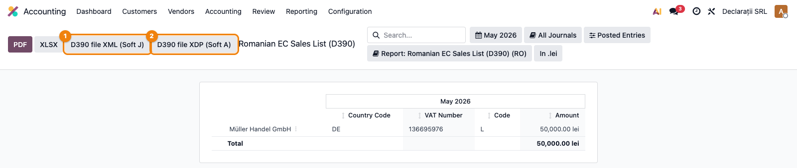

# Fișă Modul: D390 — Declarație recapitulativă UE

**Poziție plan:** C3
**Modul:** `l10n_ro_anaf_d390`
**FR:** FR-28
**Capitol manual:** Cap 4.5
**Utilizator principal:** Contabil TVA, Responsabil fiscal
**Prioritate:** 🟡 Medie

---

## 1. Scop business

Modulul generează declarația D390 pentru livrări, achiziții și servicii intracomunitare raportabile.

## 2. Bază legală și context

D390 se folosește pentru operațiunile intracomunitare cu parteneri validați în VIES. Declarația trebuie corelată cu taxele UE și cu jurnalul TVA.

## 3. Utilizatori și roluri

- Contabil TVA: pregătește declarația.
- Contabil șef: validează totalurile.
- Operator parteneri: verifică codurile TVA intracomunitare.

## 4. Date implicate

- parteneri UE cu cod TVA valid;
- facturi intracomunitare postate;
- taxe UE pentru achiziții/livrări/servicii;
- perioada fiscală.

## 5. Configurare inițială

1. Instalați `l10n_ro_anaf_d390`.
2. Verificați datele companiei în baza ANAF.
3. Creați parteneri UE cu cod TVA.
4. Postați documente demo cu taxe intracomunitare.

## 6. Flux de utilizare

### Pasul 1 — Deschiderea declarației

Meniu: **Contabilitate → Raportare → Declarații ANAF → Declarație 390**. Raportul listează partenerii
UE cu operațiuni intracomunitare în perioada selectată: **cod țară**, **număr de TVA**, **cod operațiune**
(L = livrări bunuri, A = achiziții bunuri, P = servicii, T = triunghiulare) și **suma**.



### Pasul 2 — Verificare și export

Selectați luna de raportare, verificați partenerii și tipurile de operațiuni, comparați totalurile cu
jurnalul TVA. Apăsați **D390 file XML (Soft J)** ① sau **D390 file XDP (Soft A)** ② pentru export ANAF.

## 7. Legături cu alte module / declarații

| Modul / proces | Rol în flux |
|---|---|
| `l10n_ro_anaf_base` | infrastructură comună declarații ANAF |
| `account` | facturi intracomunitare și taxe reverse charge |
| `l10n_ro_anaf_d394` (Tax Sale/Purchase Report) | reconciliere jurnal TVA |
| D300/D394 | corelare fără dublarea operațiunilor |

Ce este automat: identificarea operațiunilor intracomunitare raportabile.
Ce rămâne manual: verificarea codurilor TVA UE și a încadrării corecte.

## 8. Verificări pentru consultant

- [ ] Partenerii UE apar cu cod TVA.
- [ ] Operațiunile sunt încadrate corect.
- [ ] Totalurile corespund facturilor postate.
- [ ] XML-ul se generează fără erori.

## 9. Mesaje frecvente

| Simptom | Cauză probabilă | Remediere |
|---------|-----------------|-----------|
| Partener lipsă | Cod TVA necompletat sau țară incorectă | Corectați partenerul |
| Operațiune lipsă | Taxă UE neconfigurată | Verificați taxele și pozițiile fiscale |

## 10. Capturi de ecran

Capturile (`readme/screenshots/`) sunt **generate automat** din `tests/test_screenshots.py`
(mixinul `ScreenshotCase` din `l10n_ro_doc_screenshots`, import defensiv), în **limba română**,
pe planul de conturi RO:

1. `01_raport_d390.png` — Raportul Declarație 390 cu partenerii intracomunitari și butoanele de export XML/XDP.

Regenerare:

```bash
./odoo/odoo-bin -c odoo.conf -d <db> -i l10n_ro_anaf_d390,l10n_ro_doc_screenshots \
    --test-tags=fise_screenshots --stop-after-init
```
