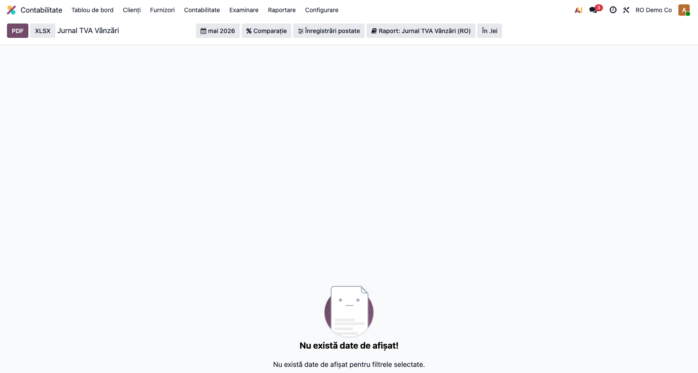
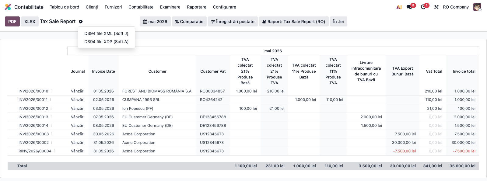

# Fișă Modul: D394 — Declarație informativă TVA + Jurnale TVA

**Poziție plan:** C4
**Modul:** `l10n_ro_anaf_d394`
**FR:** FR-28
**Capitol manual:** Cap 4.5
**Utilizator principal:** Contabil TVA, Operator facturare
**Prioritate:** 🔴 Ridicată (declarație lunară/trimestrială obligatorie)

---

## 1. Scop business

Modulul construiește **Jurnalul TVA Vânzări (RO)** și **Jurnalul TVA Cumpărări (RO)** din facturile
postate și, pe baza lor, generează **Declarația informativă D394** pentru operațiunile naționale
relevante TVA. Consultantul prezintă D394 nu ca un simplu export XML, ci ca un raport de **detaliu și
control**: arată documentele și partenerii care stau în spatele totalurilor de TVA declarate.

Fluxul este strâns legat de D300 — D394 explică, pe parteneri și documente, totalurile TVA care intră
în decontul de TVA. Datele se preiau automat din facturile înregistrate, fără seeding manual, ceea ce
asigură corelația contabilitate ↔ raportare fiscală.

## 2. Bază legală și context

D394 raportează **livrările/prestările și achizițiile efectuate pe teritoriul național** de
persoanele înregistrate în scopuri de TVA, în funcție de statutul TVA al partenerului, tipul
documentului și regimul operațiunii. Modulul urmărește modelul și conținutul formularului 394 stabilit
prin ordinul ANAF în vigoare, cu modificările ulterioare, inclusiv cotele **21%** (standard) și **11%**
(redusă) aplicabile în prezent.

> Notă consultant: verificați numărul ordinului ANAF în vigoare la data depunerii — modelul
> formularului 394 este actualizat periodic.

Operațiunile intracomunitare și import/export **nu** se includ în D394 atunci când aparțin altor
declarații (D390 pentru intracomunitar, DVI pentru import).

## 3. Utilizatori și roluri

- **Contabil TVA** — pregătește și verifică declarația, corelează cu D300.
- **Operator facturare** — corectează datele partenerilor, ale documentelor și seriile de facturi.
- **Contabil șef** — validează totalurile și reconcilierea cu D300.
- **Consultant implementare** — configurează taxele, tax tags-urile și opțiunile declarației.

Roluri recomandate pentru testare:
- Administrator funcțional: instalează modulul și verifică meniurile;
- Utilizator operațional (Contabil): rulează rapoartele și exportul lunar/trimestrial;
- Contabil/manager: validează totalurile și reconcilierea cu D300.

## 4. Conturi și date implicate

Conturi RO relevante: **4427** (TVA colectată), **4426** (TVA deductibilă), **4428** (TVA neexigibilă
— pentru TVA la încasare). Identificarea operațiunilor se face prin **tax tags**, nu prin conturi
direct, așa că nu există o monografie proprie a modulului — declarația citește notele deja postate.

Date minime pentru demo:
- companie românească cu localizarea contabilă RO instalată și CUI/CAEN/adresă completate;
- perioadă contabilă deschisă, cu facturi emise și primite **postate**;
- parteneri RO cu CUI/CIF valid; persoane fizice fără CUI, cu nume/adresă completă;
- cote TVA 21%/11% și taxe de taxare inversă configurate cu tax tags-urile RO;
- opțional, facturi sub regim TVA la încasare (CABA) cu plăți în perioadă.

> Capturile fișei se generează pe **datele demo ale localizării RO** (compania `base.demo_company_ro`),
> ale cărei facturi sunt datate în luna trecută — exact perioada implicită a rapoartelor.

## 5. Configurare inițială

1. Instalați `l10n_ro_anaf_d394` pe baza demo (depinde de `l10n_ro`, `account_reports`,
   `l10n_ro_anaf_base`).
2. Verificați taxele TVA și **tax tags**-urile aferente (cotele 21%/11% și taxarea inversă).
3. Completați datele companiei: **CUI, CAEN, adresă, telefon/e-mail** — cerute la generarea XML/XDP.
4. Configurați opțiunile D394 în **Setări → Contabilitate** (blocul declarațiilor ANAF):
   - **Perioadă D394** (`tip_D394`): L / T / S / A, după periodicitatea TVA a firmei;
   - **TVA la încasare** (`sistemTVA`): bifați dacă firma aplică sistemul TVA la încasare;
   - **Opțiune** (`optiune`) și **Persoane afiliate** (`prsAfiliat`), după caz.
   (`op_efectuate` se calculează automat: 1 dacă există operațiuni, 0 pentru declarație nulă.)
5. Verificați partenerii: companii RO cu CUI valid; persoane fizice fără CUI, cu nume/adresă completă;
   parteneri neînregistrați în scopuri de TVA.
6. Pregătiți documente demo cu: vânzare către companie RO, achiziție de la companie RO, vânzare către
   persoană fizică, factură storno, taxare inversă pe vânzare (livrare „0% R" → V) și pe achiziție
   (autotaxare → C).
7. Verificați că utilizatorul de test are grupul de acces contabil necesar.

## 6. Flux de utilizare

### Pasul 1 — Verificarea jurnalului TVA Vânzări

**Meniu:** `Contabilitate → Raportare → Declarații ANAF → Declarație 394` (deschide direct raportul de
vânzări). Cele două jurnale sunt disponibile și sub `Contabilitate → Raportare → Taxe`, ca
**Jurnal TVA Vânzări (RO)** și **Jurnal TVA Cumpărări (RO)**. Perioada implicită este **luna trecută**
(luna închisă care se declară).

*Găsește pe ecran:* fiecare rând este o tranzacție grupată pe partener și cotă; coloanele afișează
**Jurnal, Dată document, Client, CUI client**, coloanele pe cotă (bază/TVA), **TVA** și
**Total document**. Partenerii RO cu CUI, persoanele fizice și partenerii UE apar separat, conform
clasificării D394.

*Verifică* (înainte de a continua): toate documentele perioadei sunt **postate**; CUI-urile
partenerilor RO sunt prezente și valide; totalurile pe cotă (21% / 11%) corespund jurnalului de
vânzări; perioada selectată este luna corectă; persoanele fizice nu generează erori de identificare.



### Pasul 2 — Verificarea jurnalului TVA Cumpărări

**Meniu:** `Contabilitate → Raportare → Taxe → Jurnal TVA Cumpărări (RO)` (sau din acțiunea raportului
de cumpărări). Raportul listează achizițiile pe furnizori.

*Găsește pe ecran:* coloanele **Jurnal, Dată document, Furnizor, CUI furnizor**, coloanele pe cotă
(bază/TVA), **TVA** și **Total document**; furnizorii cu CUI, achizițiile cu **taxare inversă**
(autotaxare) și achizițiile intracomunitare apar cu baza și TVA deductibilă pe cotă.

*Verifică:* TVA deductibilă pe cotă corespunde jurnalului de cumpărări; achizițiile cu taxare inversă
apar cu codul de operațiune corect (tip **C**), chiar dacă TVA-ul net este 0; achizițiile
intracomunitare sunt informative și nu se dublează cu D390.


### Pasul 3 — Reconcilierea cu D300

Înainte de export, corelați totalurile:
- vânzările cu jurnalul TVA vânzări și TVA colectată din D300 (rd. 17);
- cumpărările cu jurnalul TVA cumpărări și TVA deductibilă din D300 (rd. 27).

La generarea **D300** (modulul `l10n_ro_anaf_d300`), jurnalele TVA sunt reconciliate **automat** cu
declarația: dacă TVA colectată (rd. 17), deductibilă (rd. 27) sau un rând individual diferă, se înscrie
un **avertisment în jurnalul aplicației** (log), inclusiv eventualele taxe folosite fără tag de
raportare. Reconcilierea este informativă și **nu** blochează generarea. Corectați partenerii invalizi
sau documentele încadrate greșit și regenerați.

### Pasul 4 — Generarea fișierelor ANAF (XML Soft J / XDP / XLSX)

Exporturile ANAF se află în **meniul rotiță (⚙)** din bara raportului. La generare, modulul validează
datele companiei/partenerilor și, pentru XML, structura față de **schema XSD D394**.

*Găsește pe ecran:* deschideți meniul rotiță (⚙) — apar opțiunile „D394 file XML (Soft J)" și
„D394 file XDP (Soft A)". Exportul **XLSX** de detaliu se află în bara de sus a raportului.

*Verifică:* datele companiei (CUI, CAEN, adresă, telefon/e-mail) și ale reprezentantului sunt complete
— altfel validarea ridică o eroare blocantă; perioada este cea declarată.

*Treci mai departe (export):*
- **„D394 file XML (Soft J)"** — pentru validare în DUKIntegrator;
- **„D394 file XDP (Soft A)"** — pentru formularul PDF inteligent ANAF;
- **Export XLSX** (bara de sus) — pentru analiză și reconciliere internă. În XLSX, coloanele pe cotă
  sunt ordonate determinist (cotă descrescătoare), identic cu raportul afișat.

Arhivați exportul împreună cu raportul de verificare.



> Spre deosebire de D300, D394 este o **declarație informativă** și nu se integrează în fluxul
> „Returns" (nu are checklist `account.return` propriu).

### Clasificări de urmărit la verificare

| Zonă D394 | Ce verifică consultantul |
|---|---|
| Parteneri cu CUI/CIF RO (Cartuș C / op1, `tip_partener=1`) | CUI valid, țară România, regim TVA corect |
| Parteneri fără CUI (Cartuș D / op2, `tip_partener=2`) | nume/adresă (localitate, județ pentru RO) pentru persoane fizice |
| Livrare cu taxare inversă → **V** | vânzare „0% R", fără TVA colectată, cotă 0 |
| Achiziție cu taxare inversă → **C** | achiziție autotaxată, cu TVA autotaxată și cod NC |
| TVA la încasare (CABA) | sume exigibile/neexigibile și plăți în perioadă |
| Serii facturi (`seriiFacturi`) | plajă min/max **numerică** per serie; stornările cu serie proprie apar separat |
| Achiziții intracomunitare (info) | `tvaDedAI` pe cotă, parteneri UE/non-UE (informativ, nu în op1/op2) |
| Stornări/anulări | serie/număr și semn corect |
| Parteneri inactivi fiscal | perioada activă → Cartuș C; perioada de inactivitate → Cartuș D |

### Note de monografie și raportare

- Modulul **nu generează note contabile proprii** — citește notele deja postate prin **tax tags**.
- TVA colectată/deductibilă raportată în D394 trebuie să fie reconciliabilă cu **D300** (rd. 17 / 27).
- Taxarea inversă apare pe cotă 0, dar **trebuie inclusă** (V la livrări, C la achiziții) — nu trebuie
  omisă și nici nu dublează TVA.
- TVA la încasare (CABA): se raportează exigibilitatea la momentul plății; sumele neexigibile provin
  din facturile neplătite.

## 7. Legături cu alte module / declarații

| Modul / declarație | Rol în flux | Tip legătură |
|---|---|---|
| `l10n_ro` | plan de conturi RO și localizare | dependență (manifest) |
| `account_reports` | framework pentru jurnalele de vânzări/cumpărări | dependență (manifest) |
| `l10n_ro_anaf_base` | infrastructură comună ANAF (validare XSD, butoane XML/XDP, date companie) | dependență (manifest) |
| `l10n_ro_anaf_d300` | D394 explică totalurile interne din D300; la generarea D300 jurnalele TVA sunt reconciliate automat (rd. 17/27 + rând-cu-rând), cu avertisment la neconcordanță | integrare automată |
| `l10n_ro_anaf_d390` | operațiunile intracomunitare se verifică separat, nu se dublează în D394 | corelare |
| `l10n_ro_advance_invoice` | marchează facturile de avans și regularizările relevante (TipDoc=5) | integrare prin convenție |
| `l10n_ro_vat_on_payment` / CABA | afectează exigibilitatea și raportarea pe perioadă | corelare |
| `l10n_ro_anaf_d394_pos` | (auto-install cu POS) aduce bonurile fiscale POS în op2 / op1 | extensie |

**Ce este automat:** preluarea datelor din facturile postate, clasificarea pe tipuri de partener și
operațiuni, generarea XML/XDP/XLSX, reconcilierea cu D300 la generarea acesteia.
**Ce rămâne manual:** corectitudinea datelor partenerilor, documentele speciale (storno, taxare
inversă), plaja de serii facturi și verificarea operațiunilor excluse din D394.

## 8. Verificări pentru consultant

- [ ] Modulul se instalează fără erori și meniul **Declarație 394** apare sub Declarații ANAF.
- [ ] Documentele perioadei sunt postate; facturile apar în jurnalele de vânzări/cumpărări.
- [ ] Partenerii au identificatori fiscali corecți (CUI pentru companii; nume/adresă pentru persoane fizice).
- [ ] Vânzarea către partener RO cu CUI apare în Cartuș C (op1); persoana fizică în Cartuș D (op2), fără eroare.
- [ ] Totalurile pe cote TVA (21%/11%) sunt coerente cu jurnalele TVA.
- [ ] Totalurile TVA sunt reconciliabile cu D300 (verificare automată la generarea D300; controlați logul pentru avertismente).
- [ ] Stornările și documentele negative au seria/numărul și semnul corecte.
- [ ] Taxarea inversă apare ca V (livrări) / C (achiziții) și nu dublează TVA.
- [ ] „D394 file XML (Soft J)" se generează și trece validarea XSD; cu date companie/partener incomplete → eroare blocantă.
- [ ] „D394 file XDP (Soft A)" se generează pentru formularul inteligent ANAF.
- [ ] Exportul XLSX de detaliu se descarcă cu coloanele pe cotă ordonate determinist.

## 9. Mesaje de eroare frecvente

| Mesaj / simptom | Cauză probabilă | Remediere |
|---|---|---|
| Eroare blocantă la export (date companie incomplete) | CUI/CAEN/adresă/telefon/e-mail lipsă pe companie | Completați datele companiei în Setări și regenerați |
| Partener invalid | CUI/CNP/adresă lipsă sau greșită | Corectați partenerul și regenerați raportul |
| Totaluri diferite de D300 | Taxe sau documente încadrate diferit | Avertismentul de reconciliere de la generarea D300 indică rândul (ex. rd. 9) sau taxa nemapată; verificați tax tags și perioada pe elementul semnalat |
| Factură lipsă din raport | Document nepostat sau jurnal exclus | Postați documentul și verificați tipul jurnalului |
| Taxare inversă absentă | Taxă RC configurată greșit (fără tax tags) | Verificați repartition lines și codurile fiscale |
| Persoană fizică respinsă | Date de adresă insuficiente | Completați localitate, județ/sector și adresă |
| Rapoartele apar goale („No data to display!") | Perioada selectată nu conține documente postate | Selectați luna/trimestrul cu facturi postate (implicit luna trecută) |

## 10. Capturi de ecran

Capturile (`readme/screenshots/`) sunt **generate automat** din `tests/test_screenshots.py` (mixinul
`ScreenshotCase` din `l10n_ro_doc_screenshots`, import defensiv), cu interfața Odoo în **limba română**,
folosind **datele demo ale localizării RO** (compania `base.demo_company_ro`, facturi datate în luna
trecută). Titlurile și coloanele apar în română („Jurnal TVA Vânzări (RO)", „Jurnal", „Furnizor"/
„Client", „TVA", „Total document").

> ⚠️ Capturile pot fi regenerate **doar pe o bază inițializată cu datele demo ale localizării RO**
> (care conține `base.demo_company_ro`). Pe o bază fără acest demo, rapoartele apar goale.

1. `01_raport_vanzari.png` — raportul de vânzări (parteneri RO cu CUI, persoane fizice, UE).
2. `02_raport_cumparari.png` — raportul de cumpărări (furnizori cu CUI, taxare inversă, UE).
3. `03_export_xml.png` — meniul rotiță (⚙) cu exporturile ANAF: „D394 file XML (Soft J)" și
   „D394 file XDP (Soft A)".

Regenerare (cu date demo):

```bash
./odoo/odoo-bin -c odoo.conf -d <db> -i l10n_ro_anaf_d394,l10n_ro_doc_screenshots \
    --without-demo=False --test-tags=fise_screenshots --stop-after-init
```

> Notă: rapoartele D394 au perioada implicită „luna trecută" (`previous_month`), iar facturile demo
> sunt datate în luna anterioară → pe baza cu demo l10n_ro rapoartele se afișează populate by default.

## 11. Observații pentru manual

În manualul final, păstrați explicația orientată pe activitatea utilizatorului: D394 este o
**declarație informativă lunară/trimestrială** care detaliază, pe parteneri și documente, operațiunile
naționale relevante TVA. Subliniați fluxul „verifică jurnalele → reconciliază cu D300 → exportă", rolul
clasificării Cartuș C / Cartuș D (parteneri cu/fără CUI) și tratarea taxării inverse (V/C). Menționați
că modulul nu generează note contabile proprii, ci citește notele deja postate prin tax tags.
