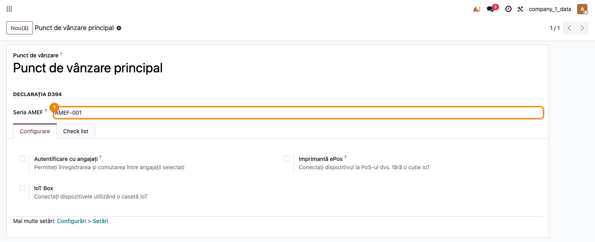

# Fișă Modul: D394 POS — Bonuri fiscale POS în D394

**Poziție plan:** C4-POS
**Modul:** `l10n_ro_anaf_d394_pos`
**FR:** FR-47 (legat de FR-28 / D394)
**Capitol manual:** Cap 4.5 / Cap retail POS
**Utilizator principal:** Contabil TVA, Responsabil magazin/POS
**Prioritate:** Medie

---

## 1. Scop business

Modulul-punte aduce bonurile fiscale emise prin Point of Sale în declarația informativă D394.
Consultantul trebuie să prezinte modulul ca legătura dintre vânzarea cu amănuntul (POS) și
raportarea D394: bonurile anonime intră în secțiunea `op2` (operațiuni cu persoane neînregistrate),
iar bonurile cu CUI identificat intră în `op1`.

Se instalează automat (`auto_install`) când sunt prezente atât `l10n_ro_anaf_d394`, cât și
`point_of_sale`. Fără POS instalat, D394 funcționează identic, fără acest modul.

## 2. Bază legală și context

Operatorii care vând cu amănuntul către populație emit bon fiscal prin aparatul de marcat
electronic fiscal (AMEF) — OUG 28/1999. Aceste vânzări se raportează în D394 agregat, pe cote,
cu numărul de bonuri (`nrBF`) și numărul de aparate fiscale (`nrAMEF`).

În Odoo, POS-ul nu produce documente `out_receipt`: comenzile nefacturate se agregă în nota
contabilă a sesiunii, iar comenzile facturate produc `out_invoice` (care intră deja în op1 prin
fluxul normal de facturi). Modulul citește direct `pos.order` pentru a evita dubla numărare.

## 3. Utilizatori și roluri

- Contabil TVA: verifică totalurile POS din D394 (op2/op1) și `nrAMEF`.
- Responsabil magazin/POS: configurează punctele de vânzare și, opțional, seria AMEF.
- Contabil șef: validează că vânzările POS nu sunt nici omise, nici dublate.
- Consultant implementare: configurează jurnalele POS, seria AMEF și scenariile de test.

## 4. Date implicate

- comenzi POS (`pos.order`) finalizate (`paid`/`done`), nefacturate;
- sesiuni POS (`pos.session`) și nota lor contabilă agregată;
- configurația POS (`pos.config`): jurnal și, opțional, seria AMEF;
- partenerul comenzii (cu sau fără CUI);
- cotele de TVA pe liniile bonului;
- retururile POS (`is_refund`).

## 5. Configurare inițială

1. Instalați `point_of_sale`; modulul `l10n_ro_anaf_d394_pos` se instalează automat alături de D394.
2. Configurați punctele de vânzare (`pos.config`) cu jurnalul POS corect.
3. (Opțional, recomandat) completați **Seria AMEF** pe fiecare configurație POS
   (`Point of Sale → Configurație → Declarația D394 → Seria AMEF`):
   - dacă este completată, `nrAMEF` numără serii distincte de aparat fiscal;
   - dacă este goală, `nrAMEF` folosește jurnalul POS ca aproximare.
4. Pregătiți date demo: o sesiune POS cu un bon anonim, un bon cu client cu CUI și un retur.

## 6. Flux de utilizare

### Pasul 1 — Accesare

Bonurile POS se reflectă automat în raportul D394 (`Contabilitate → Raportare → Declarații ANAF
→ D394`), la export XDP/XML, pentru perioada selectată.

1. Finalizați și plătiți comenzile POS din perioadă; închideți sesiunile.
2. Deschideți D394 și selectați perioada.
3. Verificați secțiunea `op2` (bonuri anonime): `nrBF`, `nrAMEF`, baza/TVA pe cote.
4. Verificați `op1` pentru bonurile cu CUI.
5. Exportați D394; bonurile POS sunt incluse fără dublarea notei de sesiune.

## 7. Reguli funcționale

| Situație | Tratament în D394 |
|---|---|
| Bon POS anonim (fără client) | `op2`, tip „L"; `nrBF` +1; baza/TVA pe cotă |
| Bon POS cu client fără CUI | `op2` (PF) |
| Bon POS cu client cu CUI | `op1`, tip „L"; alimentează și info `nr_BF_i1`/`incasari_i1` |
| Comandă POS facturată (`out_invoice`) | exclusă din POS — intră în op1 prin fluxul de facturi |
| Retur POS (`is_refund`) | semn negativ pe baza/TVA; numărat ca bon |
| Bon cu cote mixte (ex. 21% + 11%) | un singur `nrBF`, baza/TVA pe fiecare cotă |
| Nota contabilă de sesiune POS | exclusă din colectarea D394 (anti-dublare), dar rămâne în jurnalul TVA normal |

## 8. Scenarii de test pentru consultant

| ID | Scenariu | Rezultat așteptat |
|---|---|---|
| POS-01 | Bon anonim 21% | apare în op2, `nrBF=1`, `nrAMEF=1`, baza/TVA corecte |
| POS-02 | Bon cu cote mixte 21% + 11% | un singur bon (`nrBF=1`), ambele cote completate |
| POS-03 | Bon cu client cu CUI | apare în op1; `nr_BF_i1` și `incasari_i1` completate |
| POS-04 | Retur POS al unui bon | baza/TVA se compensează; `nrBF` numără și returul |
| POS-05 | Două POS cu serii AMEF diferite | `nrAMEF=2` (pe serie de aparat) |
| POS-06 | Sesiune închisă | nota de sesiune nu dublează vânzările POS în D394 |

## 9. Legături cu alte module / declarații

| Modul / declarație | Rol în flux |
|---|---|
| `l10n_ro_anaf_d394` | declarația țintă; modulul extinde mixinul de export D394 |
| `point_of_sale` | sursa bonurilor fiscale (`pos.order`, `pos.session`, `pos.config`) |
| `l10n_ro_anaf_d394` (Tax Sale Report) | jurnalul TVA normal păstrează vânzările POS (nu sunt excluse de aici) |

Ce este automat: colectarea bonurilor POS în op1/op2, `nrBF`/`nrAMEF`, retururile, dedup nota de sesiune.
Ce rămâne de verificat manual: seria AMEF pe configurații, comenzile facturate în altă perioadă,
eventualele tranzacții în valută.

## 10. Verificări pentru consultant

- [ ] Bonurile anonime apar în op2 cu baza/TVA pe cotele corecte.
- [ ] `nrAMEF` reflectă aparatele fiscale (serie sau jurnal), nu numărul de bonuri.
- [ ] Bonurile cu CUI apar în op1 și în info `nr_BF_i1`/`incasari_i1`.
- [ ] Retururile reduc corect baza/TVA.
- [ ] Vânzările POS nu sunt dublate prin nota de sesiune.
- [ ] Comenzile facturate din POS nu apar de două ori (o dată ca factură, o dată ca bon).

## 11. Mesaje de eroare frecvente

| Simptom | Cauză probabilă | Remediere |
|---|---|---|
| Vânzări POS dublate în D394 | nota de sesiune și bonurile numărate de două ori | verificați că modulul este instalat (dedup nota de sesiune) |
| `nrAMEF` prea mare/mic | serie AMEF necompletată sau jurnale multiple | completați seria AMEF pe configurațiile POS |
| Bon POS absent din D394 | comandă nefinalizată sau facturată | finalizați comanda; dacă e facturată, apare prin factură |
| Retur necompensat | comandă de retur nefinalizată | finalizați și plătiți returul |

## 12. Capturi de ecran

### Configurație POS — câmpul Seria AMEF

**Point of Sale → Configurație → (deschideți un punct de vânzare)** — secțiunea **Declarația D394** adăugată de modul: câmpul **Seria AMEF** identifică aparatul de marcat electronic fiscal pentru raportarea `nrAMEF` în D394.
