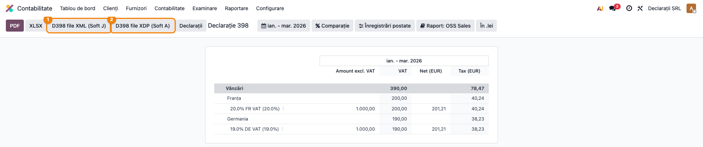

# Fișă Modul: D398 — OSS One Stop Shop (TVA vânzări B2C UE)

**Poziție plan:** C8
**Modul:** `l10n_ro_anaf_d398`
**FR:** FR-22
**Capitol manual:** Cap 4.8
**Utilizator principal:** Contabil TVA, Responsabil e-commerce
**Prioritate:** 🟡 Medie (relevant pentru firmele cu vânzări B2C transfrontaliere în UE)

---

## 1. Scop business

Modulul pregătește declarația specială de TVA **D398** pentru vânzările B2C către alte state membre UE
raportate prin regimul **OSS (One Stop Shop)**. Extinde raportul OSS standard din Enterprise cu
**exportul în format ANAF** (XML Soft J / XDP Soft A) și cu coloanele de control **în EUR**.

Consultantul trebuie să sublinieze că D398 **nu schimbă contabilitatea curentă în RON** — modulul doar
adaugă conversia de raportare în EUR pentru declarația OSS, peste raportul OSS deja existent.

## 2. Bază legală și context

Regimul OSS raportează TVA datorată în **alte state membre** pentru vânzări transfrontaliere B2C
(consumatori finali, fără cod TVA valid). Declarația se depune **trimestrial**, iar valorile se exprimă
în **EUR**. Conversia pentru D398 se face la **cursul Băncii Centrale Europene (BCE/ECB)** din ultima zi
a perioadei de raportare — nu la cursul BNR.

> Notă consultant: verificați structura XML D398 în vigoare la data depunerii. Structura efectiv
> implementată corespunde versiunii **v1.0.11 (28.04.2025)** din specificația ANAF
> (`static/pdf/D398_v1.0.11_28042025.pdf`); PDF-ul v1.0.10 din `readme/` rămâne doar material de
> referință.

Pentru România, modulul extinde `l10n_eu_oss_reports` și adaugă exportul XML/XDP ANAF, plus coloanele de
verificare în EUR.

## 3. Utilizatori și roluri

- **Contabil TVA** — verifică tranzacțiile OSS și exportă declarația D398.
- **Responsabil e-commerce** — verifică țara clientului și regimul B2C.
- **Contabil șef** — validează totalurile pe stat membru de consum.
- **Administrator** — verifică taxele OSS, pozițiile fiscale și disponibilitatea cursului BCE/ECB.

Roluri recomandate pentru testare:
- Administrator funcțional: instalează modulul și verifică meniul Declarație 398;
- Utilizator operațional (Contabil): rulează raportul trimestrial și exportul;
- Contabil/manager: validează totalurile EUR pe stat membru.

## 4. Conturi și date implicate

D398 este o **declarație de raportare**, nu generează note contabile proprii — citește facturile B2C UE
deja postate sub poziția fiscală OSS. Conturile de TVA OSS sunt cele create de localizarea UE OSS
(`l10n_eu_oss`), pe stat membru și cotă; contabilitatea rămâne în RON, iar declararea se face în EUR.

Date minime pentru demo:
- comenzi/facturi **B2C intra-UE** postate, cu poziția fiscală OSS aplicată;
- parteneri UE **fără cod TVA valid** (consumatori finali), cu țara completată;
- taxe OSS pe stat membru și cotă TVA (cotele statului de consum, nu RO);
- **curs BCE/ECB** pentru data de raportare (ultima zi a trimestrului);
- CUI și adresa companiei completate (cerute la export).

## 5. Configurare inițială

1. Instalați `l10n_ro_anaf_d398` (depinde de `l10n_ro`, `account_reports`, `l10n_eu_oss_reports`,
   `l10n_ro_anaf_base`).
2. Configurați **pozițiile fiscale OSS** pentru statele membre UE și taxele OSS aferente.
3. Verificați tax tags-urile taxelor OSS.
4. Completați **CUI și adresa companiei** — cerute la generarea XML/XDP.
5. Asigurați disponibilitatea **cursului BCE/ECB** pentru data de raportare (modulul îl preia din
   feed-ul BCE pentru ultima zi a trimestrului).
6. Pregătiți tranzacții demo **B2C UE fără cod TVA client**, în trimestrul de raportare.

## 6. Flux de utilizare

### Pasul 1 — Deschiderea raportului OSS (Declarație 398)

**Meniu:** `Contabilitate → Raportare → Declarații ANAF → Declarație 398`. Modulul extinde raportul
standard OSS (One Stop Shop) cu butoanele de export ANAF **„D398 file XML (Soft J)"** ① și
**„D398 file XDP (Soft A)"** ②, plus coloanele **Net (EUR)** și **Tax (EUR)** (conversie la cursul BCE).

*Găsește pe ecran:* în bara de filtre, **trimestrul de raportare** (ex. `ian. - mar. 2026`) și moneda
de afișare („În .lei"); în corpul raportului, liniile sunt grupate pe **stat membru de consum**
(ex. Franța, Germania) și pe **cotă TVA** (ex. „20.0% FR VAT", „19.0% DE VAT"). Coloanele sunt:
**Amount excl. VAT** (baza fără TVA, RON), **VAT** (TVA, RON) și coloanele adăugate de modul
**Net (EUR)** / **Tax (EUR)** (aceleași valori la cursul BCE).

> Notă: anteturile native „Amount excl. VAT" / „VAT" provin din raportul OSS standard Enterprise și
> apar în engleză (nu există traducere RO upstream); coloanele EUR adăugate de modul folosesc
> etichetele „Net (EUR)" / „Tax (EUR)".



> Raportul afișează linii doar dacă există **facturi B2C intra-UE cu poziția fiscală OSS** în trimestrul
> selectat. Dacă perioada nu conține astfel de tranzacții, corpul rămâne gol (empty-state), însă
> butoanele de export și structura coloanelor rămân vizibile.

### Pasul 2 — Verificarea raportului pe ecran (înainte de export)

Înainte de a exporta, **citiți și validați raportul pe ecran** — nu apăsați export pe un raport
necontrolat.

*Găsește pe ecran:*
1. Sus, selectați **trimestrul de raportare** (ex. `ian. - mar. 2026`) și confirmați moneda de afișare.
2. Pentru fiecare rând citiți: **Amount excl. VAT** / **VAT** (baza și TVA în RON) și
   **Net (EUR)** / **Tax (EUR)** (aceleași valori la cursul BCE al ultimei zile din trimestru —
   valorile raportate efectiv în D398).

*Verifică (înainte de a continua):*
- pe **liniile de detaliu (cotă)**, coloanele `Net (EUR)` / `Tax (EUR)` **nu sunt goale** și sunt
  proporționale cu valorile RON (raport curs BCE plauzibil); pe subtotalurile pe stat membru coloana
  `Net (EUR)` apare goală prin design (oglindă a raportului OSS standard, unde baza nu se totalizează
  pe stat);
- apare **câte un grup pentru fiecare stat membru** cu vânzări B2C — niciun stat lipsă, niciunul în plus;
- **totalul pe fiecare stat membru** corespunde vânzărilor B2C intra-UE din trimestru (reconciliat cu
  raportul de vânzări / e-commerce);
- cotele de TVA afișate sunt cele ale **statului de consum**, nu cotele RO.

### Pasul 3 — Generarea fișierelor ANAF (XML Soft J / XDP)

*Treci mai departe (export):* doar după ce datele sunt confirmate pe ecran, generați fișierul din
butoanele raportului:
- **„D398 file XML (Soft J)"** ① — fișierul XML de încărcat/validat în aplicația ANAF;
- **„D398 file XDP (Soft A)"** ② — formularul PDF inteligent (Soft A);
- opțional **PDF** / **XLSX** din bara de sus, pentru arhivă și control intern.

Arhivați exportul și dovada depunerii.

### Note de monografie și raportare

- Modulul **nu generează note contabile** — contabilitatea TVA OSS rămâne cea produsă de `l10n_eu_oss`.
- Valoarea declarată în D398 este în **EUR**, convertită la **cursul BCE** al ultimei zile din trimestru
  (diferit de cursul BNR folosit în contabilitatea curentă).
- D398 este o declarație separată de **decontul intern de TVA (D300)**, dar se reconciliază ca proces.
- **Pragul de 10.000 EUR** (vânzări transfrontaliere B2C) este un control de business — modulul nu
  avertizează automat la depășire; verificarea rămâne manuală.

## 7. Legături cu alte module / declarații

| Modul / declarație | Rol în flux | Tip legătură |
|---|---|---|
| `l10n_eu_oss` | poziții fiscale și taxe OSS pe state membre | dependență (lanț) |
| `l10n_eu_oss_reports` | raportul OSS Enterprise pe care se bazează D398 | dependență (manifest) |
| `account_reports` | framework de raportare contabilă | dependență (manifest) |
| `l10n_ro_anaf_base` | infrastructură comună ANAF (validare, butoane XML/XDP, date companie) | dependență (manifest) |
| `account` / cursuri valutare | fallback pentru conversia EUR dacă feed-ul BCE nu e disponibil | corelare |
| `l10n_ro_anaf_d300` | D398 este separat de decontul intern de TVA, dar se reconciliază ca proces TVA | corelare |
| e-commerce / `sale` | sursa operațională pentru tranzacțiile B2C UE | sursă date |

**Ce este automat:** coloanele EUR, conversia la cursul BCE/ECB, gruparea pe stat membru și cotă,
exportul XML/XDP.
**Ce rămâne manual / gap:** verificarea pragului de 10.000 EUR, reconcilierea cu vânzările e-commerce și
depunerea în portalul ANAF (dacă nu există infrastructură de submission locală).

## 8. Verificări pentru consultant

**Pe ecran, înainte de export (pașii 1–2):**

- [ ] Modulul se instalează și meniul **Declarație 398** apare sub Declarații ANAF.
- [ ] Trimestrul de raportare și moneda de afișare sunt selectate corect.
- [ ] Tranzacțiile B2C UE sunt identificate corect (apar ca rânduri în raport); clienții B2B cu VAT valid nu intră.
- [ ] Taxele OSS sunt aplicate pe statul membru de consum (cotele afișate sunt ale statului de consum, nu RO).
- [ ] Coloanele `Net (EUR)` / `Tax (EUR)` sunt populate și proporționale cu valorile RON (curs BCE plauzibil).
- [ ] Există câte un grup pentru fiecare stat membru cu vânzări B2C — niciunul lipsă, niciunul în plus.
- [ ] Totalurile pe stat membru și cotă corespund vânzărilor B2C din trimestru (reconciliate cu e-commerce/vânzări).

**La export și după (pasul 3):**

- [ ] Fișierele **„D398 file XML (Soft J)"** și **„D398 file XDP (Soft A)"** se generează fără eroare.
- [ ] Datele companiei (CUI, adresă) sunt complete — altfel exportul este respins.
- [ ] Pragul de 10.000 EUR este verificat manual până la implementarea avertizării automate.
- [ ] Exportul și dovada depunerii sunt arhivate.

## 9. Mesaje de eroare frecvente

| Simptom | Cauză probabilă | Remediere |
|---|---|---|
| Țară lipsă | Client fără țară UE validă | Corectați partenerul (țara de consum) |
| Tranzacția nu apare în raport | Poziție fiscală OSS neaplicată sau client B2B cu VAT | Verificați poziția fiscală OSS și statutul VAT al clientului |
| Coloanele EUR sunt goale | Curs BCE indisponibil pentru data perioadei | Verificați data perioadei și disponibilitatea cursului EUR/BCE |
| Totaluri EUR neașteptate | Conversie la cursul BNR în loc de BCE | Asigurați folosirea cursului BCE/ECB pentru D398 |
| Export respins | Date companie incomplete (CUI/adresă) | Completați CUI și adresa companiei și regenerați |

## 10. Capturi de ecran

Captura (`readme/screenshots/`) este **generată automat** din `tests/test_screenshots.py` (mixinul
`ScreenshotCase` din `l10n_ro_doc_screenshots`, import defensiv), cu interfața Odoo în **limba română**,
pe planul de conturi RO:

1. `01_raport_d398.png` — raportul OSS (Declarație 398) populat: vânzări B2C către Franța („20.0% FR
   VAT") și Germania („19.0% DE VAT"), cu coloanele **Amount excl. VAT** / **VAT** (RON) și
   **Net (EUR)** / **Tax (EUR)**, plus butoanele de export D398 (XML Soft J / XDP Soft A) evidențiate.

> Notă: testul de capturi seedează determinist facturi B2C UE sub regimul OSS (parteneri fără cod TVA
> din DE/FR), datate în **trimestrul anterior** (perioada implicită a raportului), și fixează cursul
> BCE (request-ul extern către ECB e blocat în teste). Astfel raportul apare populat la fiecare rulare.

Regenerare:

```bash
./odoo/odoo-bin -c odoo.conf -d <db> -i l10n_ro_anaf_d398,l10n_ro_doc_screenshots \
    --test-tags=fise_screenshots --stop-after-init
```

## 11. Observații pentru manual

În manualul final, păstrați mesajul-cheie: D398 raportează **trimestrial, în EUR**, TVA datorată în alte
state membre pentru vânzări B2C UE, peste raportul OSS standard. Subliniați fluxul „verifică raportul
(coloanele EUR, totaluri pe stat membru) → exportă XML/XDP", folosirea **cursului BCE** (nu BNR),
diferența față de contabilitatea curentă în RON și faptul că pragul de 10.000 EUR și depunerea pe portal
rămân deocamdată sarcini manuale.
