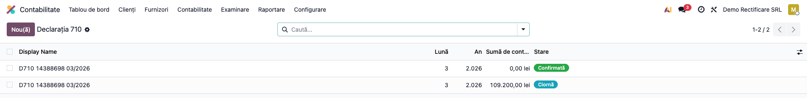
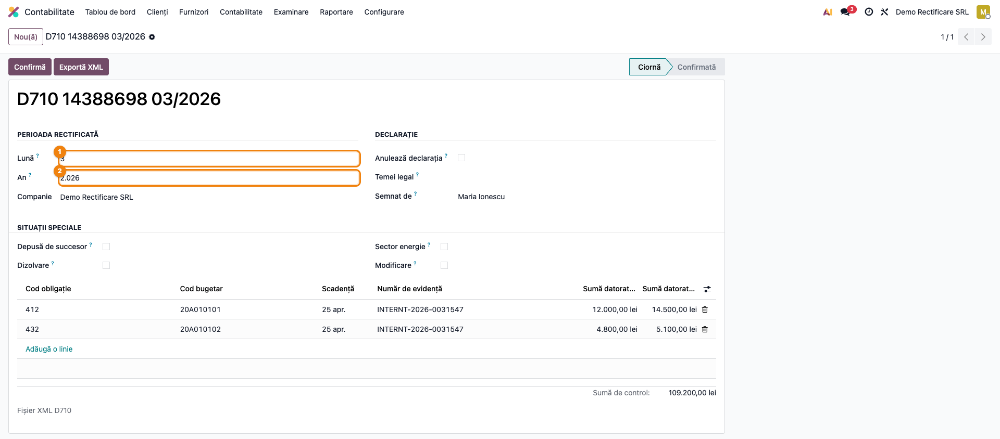
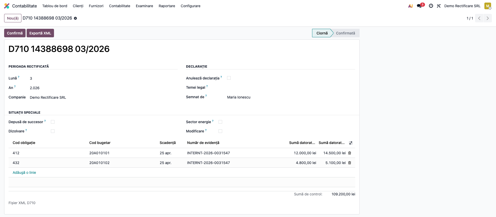
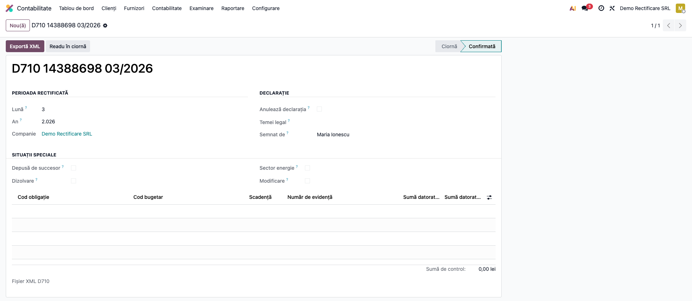

# Fișă Modul: Declarația 710 — Rectificarea Obligațiilor de Plată

**Modul:** `l10n_ro_anaf_d710`
**FR:** FR-66
**Utilizator principal:** Contabil-șef, responsabil cu declarațiile ANAF
**Prioritate:** 🔴 Ridicată (singura cale de corectare a unui D100 depus)

---

## 1. Scop business

Când o declarație de obligații de plată deja depusă se dovedește greșită — impozit calculat eronat,
bază recalculată, notă contabilă corectată ulterior — suma nu se poate îndrepta prin redepunerea
declarației. **D100 se corectează exclusiv prin formularul 710.**

Spre deosebire de D300 și D394, care se rectifică prin redepunere integrală marcată ca rectificativă,
D710 declară pentru fiecare obligație **atât suma inițială, cât și cea corectată**, iar ANAF operează
diferența.

## 2. Bază legală și context

Formularul **710 — „Declarație rectificativă"**, aprobat prin ordin ANAF, cu schema XML oficială
`d710_20012025.xsd`. Se folosește pentru obligațiile declarate prin **D100**, dar și prin alte
declarații care declară creanțe fiscale (D112 etc.) pentru care legislația nu prevede o rectificativă
proprie.

> **Numărul de evidență** al declarației rectificate este cheia întregului mecanism: fără el ANAF nu
> poate lega rectificativa de declarația originală. Se preia de pe **recipisa depunerii inițiale**.

## 3. Utilizatori și roluri

Contabil-șef (decide rectificarea și semnează), responsabil cu depunerile ANAF.

Roluri recomandate pentru testare: **Contabil** (`account.group_account_manager`) pentru fluxul
complet; **Utilizator contabil** pentru consultare.

## 4. Conturi și date implicate

Modulul **nu generează note contabile** — corectează o declarație, nu contabilitatea. Corecțiile
contabile, dacă sunt necesare, se fac separat prin note proprii.

Date minime pentru demo:
- companie românească cu localizarea instalată;
- o declarație **D100 depusă anterior**, cu recipisa ei — de acolo vine numărul de evidență;
- codurile bugetare și de obligație ale creanțelor rectificate (de exemplu 412 pentru CAS).

## 5. Configurare inițială

1. Instalați `l10n_ro_anaf_d710`; apare în **Contabilitate → Raportare → Declarații ANAF**.
2. Verificați datele de identificare ale companiei (CUI, adresă, contact) — intră în antetul XML.
3. Pregătiți **numărul de evidență** de pe recipisa declarației care se rectifică.

## 6. Flux de utilizare

### Pasul 1 — Deschiderea listei de declarații rectificative

**Contabilitate → Raportare → Declarații ANAF → D710 Declarație rectificativă**.



### Pasul 2 — Antetul: perioada rectificată și situațiile speciale

Creați o declarație și completați **luna și anul perioadei rectificate** — nu perioada curentă, ci
cea a declarației greșite. În grupul *Situații speciale* bifați, dacă e cazul: anulare, depusă de
succesor (caz în care CUI-ul succesorului devine obligatoriu), dizolvare, sector energie, modificare.



**Ce verificați:** perioada este cea a declarației rectificate; *Temeiul rectificării* explică de ce
se corectează — corectarea sumelor declarate sau urmarea unei inspecții fiscale.

### Pasul 3 — Obligațiile: perechea inițial / corectat

În tabul *Obligații*, adăugați câte un rând per creanță fiscală rectificată. Fiecare rând poartă
**ambele valori** — cea declarată inițial și cea corectă:



| Câmp | Ce conține |
|---|---|
| Cod obligație / Cod bugetar | codul ANAF al creanței (de exemplu 412 pentru CAS) |
| **Număr de evidență** | numărul de pe recipisa declarației rectificate |
| Sumă datorată (inițială / corectată) | ce s-a declarat vs. ce se declară acum |
| Dedus, Plătit, Rest, Reducere, Sponsorizări | aceleași perechi, unde e cazul |

**Ce verificați înainte de a continua:** fiecare rând are numărul de evidență completat; sumele
corectate diferă de cele inițiale cel puțin la o obligație — altfel declarația nu are obiect.

### Pasul 4 — Confirmarea și exportul XML

Apăsați **Confirmă**, apoi **Exportă XML**. Fișierul respectă schema oficială
`d710_20012025.xsd`.



Gărzile de corelație opresc exportul înainte de a produce un fișier pe care ANAF l-ar respinge:

| Situație | Ce se întâmplă |
|---|---|
| Declarație depusă de succesor, fără CUI-ul succesorului | export blocat |
| Obligație fără număr de evidență | export blocat |
| Declarație fără nicio linie | export blocat |
| Sume negative | respinse la validare |

### Note de monografie și raportare

Modulul **nu produce note contabile**. Rectificarea privește declarația, nu evidența contabilă:
dacă și contabilitatea era greșită, corectați-o separat, prin note proprii, înainte de a declara
sumele corecte.

## 7. Legături cu alte module / declarații

| Modul / proces | Rol în flux | Tip legătură |
|---|---|---|
| `l10n_ro_anaf_base` | meniul de declarații ANAF, structura comună | dependență |
| `l10n_ro_anaf_d100` | declarația rectificată — sursa sumelor inițiale | corelație manuală |
| `l10n_ro_anaf_submission` | depunerea electronică prin SPV | complementar |
| `l10n_ro_anaf_duk` | validarea cu DUKIntegrator înainte de depunere | complementar |

**Ce este automat:** structura declarației, gărzile de corelație, exportul XML validat cu schema.

**Ce rămâne manual:** introducerea obligațiilor și a sumelor inițiale (nu se preiau automat din
D100), numărul de evidență de pe recipisă, și corecțiile contabile aferente.

## 8. Verificări pentru consultant

- [ ] Modulul apare în **Contabilitate → Raportare → Declarații ANAF**.
- [ ] Perioada rectificată se poate seta diferit de perioada curentă.
- [ ] O declarație marcată „depusă de succesor" fără CUI-ul succesorului **nu** se poate exporta.
- [ ] O obligație fără număr de evidență **blochează** exportul.
- [ ] O declarație fără nicio linie **nu** se poate exporta.
- [ ] Sumele negative sunt respinse.
- [ ] XML-ul generat validează contra `d710_20012025.xsd`.
- [ ] Interfața este în limba română.

## 9. Mesaje de eroare frecvente

| Mesaj / simptom | Cauză probabilă | Remediere |
|---|---|---|
| „O declarație depusă de succesor are nevoie de codul fiscal al succesorului." | Bifa de succesor fără CUI | Completați CUI-ul succesorului sau debifați |
| „Doar o declarație în ciornă poate fi confirmată." | Declarația e deja confirmată | Readuceți-o în ciornă dacă mai aveți de corectat |
| „Sumele ANAF nu pot fi negative." | Valoare negativă pe o obligație | Corectați suma; rectificarea declară valoarea corectă, nu diferența |
| „Luna trebuie să fie între 1 și 12." | Perioadă invalidă | Corectați luna perioadei rectificate |
| „Numele persoanei care semnează declarația este obligatoriu." | Semnatar necompletat | Completați semnatarul |

## 10. Capturi de ecran

Capturile (`readme/screenshots/`) sunt **generate automat** din `tests/test_screenshots.py`
(mixinul `ScreenshotCase` din `l10n_ro_doc_screenshots`, import defensiv), în **limba română**:

1. `01_lista.png` — lista declarațiilor D710.
2. `02_antet.png` — antetul: perioada rectificată și situațiile speciale.
3. `03_obligatii.png` — obligațiile, cu perechea inițial / corectat.
4. `04_confirmata.png` — declarația confirmată, cu XML-ul generat.

Regenerare:

```bash
./odoo/odoo-bin -c odoo.conf -d <db> -i l10n_ro_anaf_d710,l10n_ro_doc_screenshots \
    --test-tags=fise_screenshots --stop-after-init
```

## 11. Observații pentru manual

Trei idei de păstrat:

1. **D710 declară suma corectă, nu diferența.** Este cea mai frecventă confuzie: contabilul e tentat
   să treacă diferența de corectat. ANAF calculează singur diferența.
2. **Fără numărul de evidență, rectificativa e orfană.** Se ia de pe recipisa depunerii inițiale;
   fără el ANAF nu o poate lega de declarația corectată.
3. **Rectificarea nu atinge contabilitatea.** Dacă și nota contabilă era greșită, se corectează
   separat — modulul nu o face.
