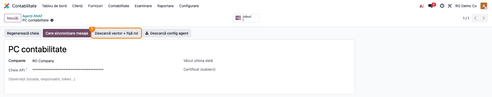
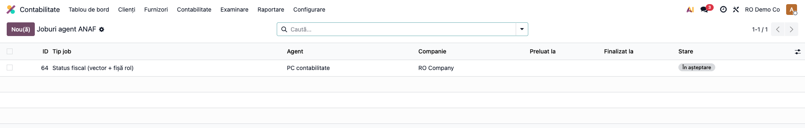
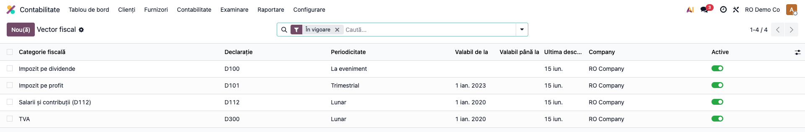
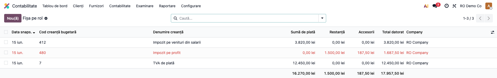

# Fișă Modul: Vector fiscal și Fișa pe rol din SPV ANAF

**Modul:** `l10n_ro_anaf_fiscal_status`
**FR:** FR-64
**Utilizator principal:** Contabil declarații, Contabil șef
**Prioritate:** 🟡 Medie (fundație pentru calendarul fiscal și alertele de risc; diferențiator pe piață)

---

## 1. Scop business

Modulul aduce în Odoo două imagini fiscale pe care altfel contabilul le verifică manual pe portalul
ANAF, una câte una:

- **Vectorul fiscal** — *„ce trebuie să depun și când?"*: setul de obligații declarative active ale
  firmei (la ce impozite/taxe e înregistrată și cu ce periodicitate — TVA lunar/trimestrial, impozit
  pe profit vs. micro, salarii → D112, accize, dividende, nerezidenți).
- **Fișa pe rol** — *„ce am de plătit?"*: situația soldurilor la ANAF (sume de plată, restanțe și
  accesorii) pe fiecare cod de creanță bugetară.

Datele se descarcă din **Spațiul Privat Virtual (SPV)** și se păstrează ca evidență cu istoric:
vectorul reflectă starea curentă (obligațiile ieșite din vigoare se arhivează automat), iar fișa pe
rol se salvează ca **fotografie zilnică** (snapshot), astfel încât evoluția restanțelor să fie
urmăribilă în timp. Aceste date alimentează ulterior calendarul real de declarații (FR-60) și
auditul de corelare a declarațiilor (FR-65).

Serviciul ANAF folosit (SPVWS2) **nu acceptă OAuth2**, ci cere certificat digital pe token fizic
(mTLS). De aceea Odoo nu apelează ANAF direct, ci prin **Terrabit Connect** — același serviciu care
deservește și mesajele SPV — instalat lângă tokenul fizic.

## 2. Bază legală și context

Context operațional, nu o singură normă:

- **Vectorul fiscal** este evidența ANAF a obligațiilor declarative ale contribuabilului; se
  modifică prin **Declarația 700** (declarația de mențiuni — intrare/ieșire din scopul de TVA,
  trecere micro↔profit etc.). Vectorul descărcat reflectă starea înregistrată la ANAF la momentul
  cererii.
- **Fișa pe rol** (situația obligațiilor de plată) este pusă la dispoziție de ANAF prin SPV; este
  documentul pe baza căruia se urmăresc sumele de plată, restanțele și accesoriile pe tipuri de
  creanță bugetară.
- **SPV** este canalul oficial de comunicare electronică ANAF–contribuabil; accesul la fișa pe rol
  și la vectorul fiscal necesită autentificare cu certificat client (mTLS), nu OAuth2 Bearer.

> ⚠️ Codurile exacte de cerere SPVWS2 și formatul răspunsului ANAF pentru vector/fișă pe rol se
> confirmă pe un cont SPV real. În implementarea curentă (Beta) transportul e gata, iar
> interpretarea răspunsului este izolată într-o metodă testată cu date-exemplu.

## 3. Utilizatori și roluri

Contabil declarații (urmărește obligațiile din vector și termenele), contabil șef (urmărește
restanțele și accesoriile din fișa pe rol).

Roluri recomandate pentru testare:
- Administrator funcțional: instalează modulul, configurează agentul ANAF și verifică meniurile;
- Contabil (`account.group_account_user`): **citește** vectorul și fișa pe rol (acces doar-citire);
- Manager contabilitate (`account.group_account_manager`): declanșează descărcarea, editează maparea
  vector→declarație și gestionează snapshoturile.

## 4. Conturi și date implicate

Modulul **nu generează note contabile** și nu atinge conturi — este o evidență informativă
descărcată din SPV. Sumele din fișa pe rol (de plată / restanțe / accesorii) corespund însă, ca
sens, soldurilor conturilor de datorii fiscale din contabilitate (clasa **44** — ex. 4423 TVA de
plată, 444 impozit pe venituri din salarii, 4411 impozit pe profit, 446 alte impozite), iar
reconcilierea fișei pe rol cu aceste solduri este obiectul auditului FR-65.

Date minime pentru demo:
- companie românească cu CUI valid, înrolată în SPV;
- un **Agent ANAF** definit în Odoo (cheie API generată automat);
- pentru demo fără ANAF real, descărcarea se simulează cu un răspuns-exemplu (payload) prin metoda
  de aplicare a statusului fiscal, exact ca în testele modulului — nu este nevoie de conexiune la ANAF.

## 5. Configurare inițială

1. Instalați modulul `l10n_ro_anaf_fiscal_status` (instalează automat `l10n_ro_anaf_base`,
   `l10n_ro_anaf_agent` și `l10n_ro_anaf_messages`).
2. Configurați **Terrabit Connect** (URL + token) în **Setări → Contabilitate**, blocul *Mesaje SPV
   ANAF (Terrabit Connect)* — aceeași configurare folosită de modulul de mesaje SPV.
3. Definiți cel puțin un **Agent ANAF**: **Contabilitate → Raportare → Declarații ANAF → ANAF Agents**,
   buton **Nou**, dați un nume (ex. „PC contabilitate") și salvați; cheia API se generează automat.
4. Opțional, activați cron-ul **„ANAF SPV: download fiscal status (vector + ledger)"** (dezactivat
   implicit) din **Setări → Tehnic → Automatizare → Acțiuni programate** — rulează zilnic și pune în
   coadă câte un job de descărcare pentru fiecare agent activ.



## 6. Flux de utilizare

### Pasul 1 — Declanșarea descărcării din SPV

Deschideți agentul din **Contabilitate → Raportare → Declarații ANAF → ANAF Agents** și apăsați
**Descarcă vector + fișă rol** din antet. Odoo creează în coadă un **job** de tip *Fiscal Status*
(stare *Pending*), pe care Terrabit Connect îl preia, îl execută cu certificatul de pe token și
întoarce rezultatul. Procesarea rezultatului populează automat cele două evidențe (vectorul și fișa
pe rol). În topologia cu cron, jobul se creează singur zilnic, fără intervenția operatorului.



### Pasul 2 — Citirea vectorului fiscal

Accesați **Contabilitate → Raportare → Declarații ANAF → Vector fiscal**.

**Găsiți pe ecran**: fiecare rând este o obligație declarativă activă a companiei — coloana
**Categorie fiscală** (TVA, Impozit pe profit, Salarii și contribuții, …), **Declarație** (D300,
D112, D101… mapate automat din categorie), **Periodicitate** (lunar/trimestrial/anual) și
**Valabil de la / până la**. Lista afișează implicit doar obligațiile în vigoare (filtrul *În
vigoare*); obligațiile arhivate (ieșite din vector) sunt vizibile dezactivând filtrul.

**Verificați** înainte de a merge mai departe: există un rând pentru fiecare impozit la care firma
e efectiv înregistrată; periodicitatea TVA corespunde realității (lunar vs. trimestrial);
declarația mapată este cea așteptată (ex. firma plătitoare de TVA are linia *TVA · D300 · Lunar*);
nicio obligație stinsă nu mai apare ca activă.



### Pasul 3 — Citirea fișei pe rol

Accesați **Contabilitate → Raportare → Declarații ANAF → Fișa pe rol**.

**Găsiți pe ecran**: fiecare rând este o creanță bugetară la o anumită **dată snapshot** —
coloanele **Cod creanță bugetară**, **Denumire creanță**, **Sumă de plată**, **Restanță**,
**Accesorii** și **Total datorat** (sumă calculată). Rândurile cu restanță sunt evidențiate în
roșu. Gruparea implicită este pe data snapshot, astfel încât fotografiile zilnice succesive să fie
ușor de comparat.

**Verificați** înainte de a raporta: data snapshot este cea așteptată (cea mai recentă descărcare);
totalurile pe coloane (afișate în subsolul listei) corespund situației de la ANAF; sumele de
restanță și accesorii se reconciliază, ca ordin de mărime, cu soldurile conturilor de datorii
fiscale din balanță (clasa 44); documentul-sursă ANAF este atașat pe linie pentru audit.



### Note de monografie și raportare

Modulul **nu generează note contabile** (niciun Dr/Cr): vectorul și fișa pe rol sunt strict
informative. Valoarea contabilă apare indirect — fișa pe rol este referința externă (ANAF) față de
care se reconciliază soldurile conturilor de datorii fiscale (clasa 44) în cadrul auditului de
corelare (FR-65). Snapshoturile sunt **append-only**: re-rularea în aceeași zi nu duplică liniile,
iar o dată nouă adaugă o fotografie nouă, păstrând istoricul.

## 7. Legături cu alte module / declarații

| Modul / proces | Rol în flux | Tip legătură |
|---|---|---|
| `l10n_ro_anaf_base` | meniul „Declarații ANAF" + infrastructura comună | dependență (manifest) |
| `l10n_ro_anaf_agent` | agentul mTLS + coada de joburi (`job_type="fiscal_status"`) | dependență (manifest) |
| `l10n_ro_anaf_messages` | clientul SPV refolosit (`make_spv_request`) + configurarea agentului | dependență (manifest) |
| Declarațiile ANAF (D300/D112/D101…) | ținta mapării din vector (ce trebuie depus) | complementar (mapare categorie→declarație) |
| FR-60 — Plata obligațiilor către buget | consumă fișa pe rol pentru remindere și reconciliere plăți | consumator (planificat) |
| FR-65 — Audit corelare declarații | reconciliază fișa pe rol cu soldurile contabile | consumator (planificat) |

Ce este automat: maparea categorie→declarație, arhivarea obligațiilor ieșite din vector,
deduplicarea snapshoturilor pe dată, cron-ul zilnic (dacă e activat), procesarea rezultatului
jobului.
Ce rămâne manual: activarea cron-ului, declanșarea pe agent, eventuala corecție a mapării
vector→declarație și interpretarea restanțelor.

## 8. Verificări pentru consultant

- [ ] Modulul se instalează fără erori pe baza demo (împreună cu dependențele ANAF).
- [ ] Meniurile **Vector fiscal** și **Fișa pe rol** apar în *Contabilitate → Raportare → Declarații ANAF*.
- [ ] Butonul **Descarcă vector + fișă rol** apare în antetul formularului de Agent ANAF.
- [ ] Apăsarea butonului creează un job de tip *Fiscal Status* în stare *Pending*.
- [ ] Aplicarea unui răspuns-exemplu populează vectorul cu obligațiile active și maparea corectă
      (ex. *TVA → D300*, *Salarii → D112*).
- [ ] O a doua aplicare a aceluiași răspuns **nu duplică** obligațiile din vector.
- [ ] O obligație care dispare din noul vector trece pe **arhivată** (`activ = nu`), cu *Valabil
      până la* completat la data snapshotului.
- [ ] Fișa pe rol creează câte o linie per cod de creanță, cu **Total datorat** = sumă de plată +
      restanță + accesorii.
- [ ] Re-rularea în aceeași zi **nu adaugă** linii noi în fișa pe rol; o dată nouă adaugă un snapshot
      nou (istoricul se păstrează).
- [ ] Grupul *Contabil* are acces **doar-citire**; managerul de contabilitate poate edita.
- [ ] Cron-ul „ANAF SPV: download fiscal status (vector + ledger)" există și e **dezactivat** implicit.

## 9. Mesaje de eroare frecvente

| Mesaj / simptom | Cauză probabilă | Remediere |
|-----------------|-----------------|-----------|
| Descărcarea nu aduce nimic, fără eroare | URL-ul agentului gol sau tokenul lipsă în Setări → Contabilitate | Completați URL + token (configurarea din modulul de mesaje SPV) |
| „Cannot reach the Terrabit ANAF Agent…" | Terrabit Connect nu rulează sau tokenul nu e conectat | Porniți agentul lângă token; verificați URL-ul |
| Agentul răspunde 401 / „unauthorized" | Secretul partajat din Odoo diferă de cel al agentului | Aliniați tokenul cu `TERRABIT_AGENT_TOKEN` din configurarea agentului |
| Jobul *Fiscal Status* rămâne *Pending* | Niciun agent nu preia joburile (agentul oprit / nepornit) | Verificați că agentul rulează și face *poll*; verificați cheia API |
| Jobul trece pe *Error* după execuție | Răspunsul ANAF neparsabil sau format necunoscut | Citiți textul erorii de pe job; confirmați formatul răspunsului SPV |
| Vectorul nu se actualizează | Răspuns fără secțiunea `vector` sau categorii fără `tax_category` | Verificați conținutul răspunsului SPV (sau payload-ul de test) |

## 10. Capturi de ecran

Capturile (`readme/screenshots/`) sunt **generate automat** din `tests/test_screenshots.py`
(mixinul `ScreenshotCase` din `l10n_ro_doc_screenshots`, import defensiv), în **limba română**, pe
planul de conturi RO, pe „RO Company" în RON; vectorul și fișa pe rol se populează prin aplicarea
unui răspuns-exemplu (payload), fără conexiune la ANAF:

1. `01_agent_form.png` — formularul Agentului ANAF cu butonul „Descarcă vector + fișă rol".
2. `02_joburi_fiscal_status.png` — coada de joburi ANAF, cu jobul *Status fiscal (vector + fișă rol)*.
3. `03_vector_fiscal.png` — vectorul fiscal: obligațiile active și maparea către declarații.
4. `04_fisa_rol.png` — fișa pe rol: sume de plată, restanțe și accesorii per creanță bugetară.

Regenerare:

```bash
./odoo/odoo-bin -c odoo.conf -d <db> -i l10n_ro_anaf_fiscal_status,l10n_ro_doc_screenshots \
    --test-tags=fise_screenshots --stop-after-init
```

## 11. Observații pentru manual

Păstrați perspectiva utilizatorului: modulul răspunde la două întrebări pe care contabilul le pune
zilnic în perioada de declarare — *„ce trebuie să depun și când?"* (vectorul) și *„ce am de
plătit?"* (fișa pe rol) — fără drum pe portalul ANAF. Explicați clar:
- de ce e nevoie de Terrabit Connect (certificatul stă pe token fizic, nu în Odoo);
- diferența dintre cele două evidențe (vectorul e descriptiv și cvasi-static, fișa pe rol e
  dinamică și se salvează ca istoric zilnic);
- că maparea vector→declarație este punctul de plecare al calendarului fiscal (FR-60), iar fișa pe
  rol este referința pentru reconcilierea cu contabilitatea (FR-65);
- statutul Beta: transportul e funcțional, dar formatul exact al răspunsului ANAF se validează pe un
  cont SPV real.
