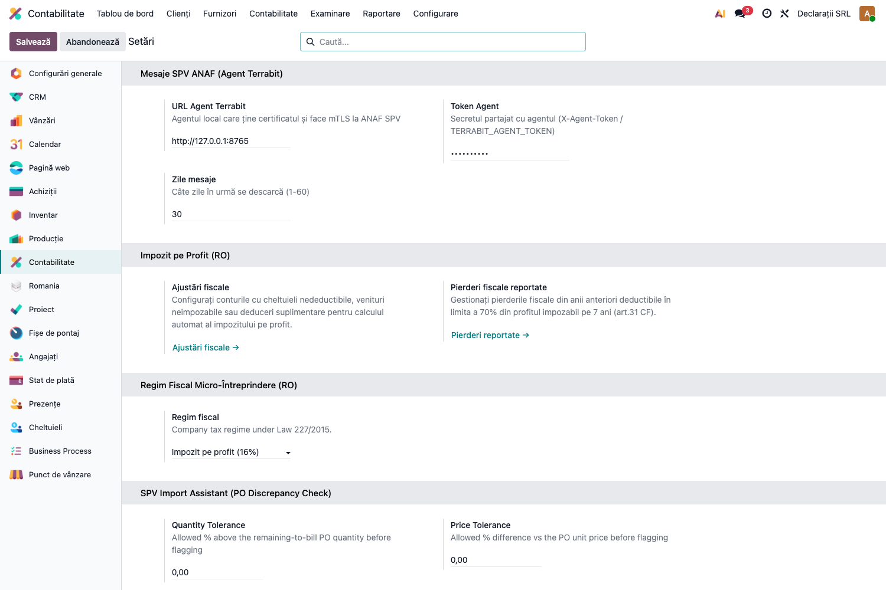
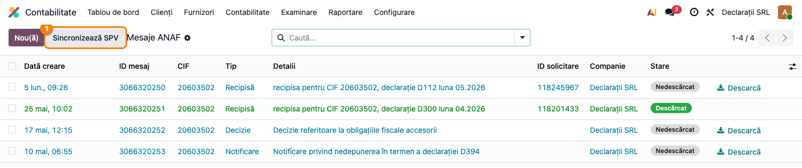
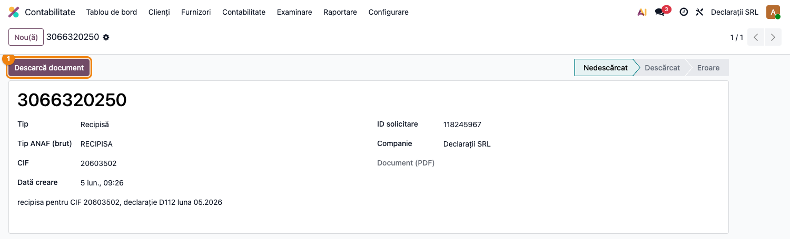
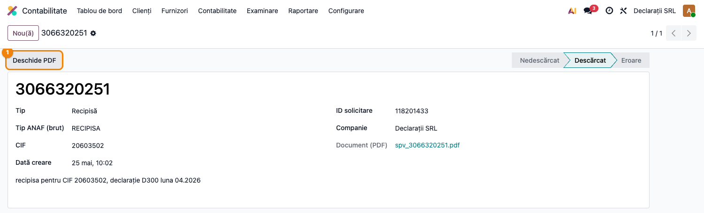

# Fișă Modul: Mesaje SPV ANAF (recipise declarații, decizii, notificări)

**Modul:** `l10n_ro_anaf_messages`
**FR:** FR-53
**Utilizator principal:** Contabil declarații, Contabil șef
**Prioritate:** 🟡 Medie (canal de confirmare a depunerilor; critic doar în perioada de declarare)

---

## 1. Scop business

Modulul aduce în Odoo **mesajele generale din Spațiul Privat Virtual (SPV) ANAF** — în primul
rând **recipisele declarațiilor fiscale**, dar și decizii, somații și notificări — astfel încât
contabilul să nu mai intre manual pe portalul ANAF ca să verifice dacă o declarație depusă a fost
acceptată. Mesajele e-Factura nu trec pe aici (rămân în modulul dedicat `l10n_ro_message_spv`).

Serviciul ANAF folosit (SPVWS2: `listaMesaje`, `descarcare`) **nu acceptă OAuth2**, ci cere
certificat digital pe token fizic (mTLS). De aceea Odoo nu apelează ANAF direct, ci prin
**Terrabit Connect** — un serviciu mic instalat lângă tokenul fizic, care ține certificatul și
face puntea către ANAF.

## 2. Bază legală și context

Context operațional: SPV este canalul oficial de comunicare ANAF–contribuabil (OUG 41/2016 privind
comunicarea prin mijloace electronice; depunerea declarațiilor prin mediu electronic conform
Codului de procedură fiscală). Recipisa din SPV este dovada acceptării unei declarații depuse;
deciziile și somațiile comunicate prin SPV produc efecte juridice de la comunicare, deci este
important ca ele să fie văzute la timp.

## 3. Utilizatori și roluri

Contabil declarații (urmărește recipisele), contabil șef (decizii/somații).

Roluri recomandate pentru testare:
- Administrator funcțional: instalează modulul, configurează agentul și verifică meniurile;
- Utilizator operațional (grup „Contabil" — `account.group_account_user`): rulează sincronizarea
  și descarcă documentele;
- Contabil/manager: verifică încadrarea pe tipuri și urmărirea recipiselor.

## 4. Conturi și date implicate

Modulul **nu generează note contabile** și nu atinge conturi — este un canal informativ
(mesaje + PDF-uri atașate).

Date minime pentru demo:
- companie românească cu CUI valid înrolat în SPV;
- Terrabit Connect instalat și pornit lângă tokenul fizic (on-prem: `http://127.0.0.1:8765`),
  cu secretul partajat configurat;
- pentru demo fără agent real, mesajele pot fi inserate prin mecanismul de ingestie folosit de
  testele modulului (nu este nevoie de conexiune la ANAF pentru capturi).

## 5. Configurare inițială

1. Instalați modulul `l10n_ro_anaf_messages` (instalează automat `l10n_ro_anaf_base` și
   `l10n_ro_anaf_agent`).
2. Deschideți **Setări → Contabilitate** și găsiți blocul **Mesaje SPV ANAF (Terrabit Connect)**.
3. Completați **URL Terrabit Connect** (implicit `http://127.0.0.1:8765` pentru topologia on-prem),
   **Token Agent** (secretul partajat cu agentul — antetul `X-Agent-Token`) și **Zile mesaje**
   (câte zile în urmă se interoghează, 1–60).
4. Salvați. Pentru topologia cloud (agentul rulează la client și împinge mesajele în Odoo),
   configurarea joburilor se face în modulul `l10n_ro_anaf_agent`; punctul de ingestie e același.
5. Opțional, activați cron-ul **„ANAF SPV: download general messages"** (dezactivat implicit) din
   **Setări → Tehnic → Automatizare → Acțiuni programate** — rulează zilnic și sincronizează doar
   companiile care au tokenul de agent configurat.



## 6. Flux de utilizare

### Pasul 1 — Sincronizarea mesajelor din SPV

Accesați **Contabilitate → Raportare → Declarații ANAF → Mesaje SPV ANAF** și apăsați butonul
**Sincronizează SPV** din antetul listei. Odoo cere agentului lista mesajelor pe ultimele N zile
(parametrul „Zile mesaje") și creează câte o înregistrare pentru fiecare mesaj nou; mesajele
deja existente nu se duplică (sincronizarea este idempotentă).

În listă, **găsiți pe ecran**: fiecare rând este un mesaj SPV, cu data creării la ANAF, ID-ul
mesajului, CIF-ul, **tipul clasificat automat** (Recipisă / Decizie / Somație / Declarație /
Notificare / Eroare / Altele), detaliile transmise de ANAF și starea de descărcare (insignă:
gri = Nedescărcat, verde = Descărcat, roșu = Eroare).

**Verificați** înainte de a merge mai departe: CIF-ul din coloana CIF este al companiei curente;
pentru fiecare declarație depusă recent există un mesaj de tip **Recipisă** cu numărul de
înregistrare în coloana „Request ID"; nu există rânduri în stare de eroare.



### Pasul 2 — Consultarea unui mesaj (recipisă)

Deschideți un mesaj din listă. Formularul arată ID-ul mesajului, tipul (cu valoarea brută ANAF
alături), CIF-ul, data, ID-ul solicitării și detaliile complete.



### Pasul 3 — Descărcarea documentului (PDF)

Apăsați **Descarcă document** (în formular sau direct din listă, butonul **Descarcă** de pe rând).
Odoo cere agentului documentul asociat (`descarcare?id=`) și îl atașează ca PDF; starea trece în
**Descărcat**, iar butonul **Deschide PDF** descarcă fișierul local. Dacă ANAF întoarce o eroare,
starea devine **Eroare** și textul erorii apare în câmpul roșu din subsolul formularului.



### Note de monografie și raportare

Modulul **nu generează note contabile** (niciun Dr/Cr): mesajele și PDF-urile sunt strict
informative. Recipisele confirmă declarațiile depuse prin `l10n_ro_anaf_submission`; corelarea
se face vizual, prin **Request ID** (numărul de înregistrare al depunerii).

## 7. Legături cu alte module / declarații

| Modul / proces | Rol în flux | Tip legătură |
|---|---|---|
| `l10n_ro_anaf_base` | meniul „Declarații ANAF" + infrastructura comună | dependență (manifest) |
| `l10n_ro_anaf_agent` | agentul mTLS care ține certificatul și proxează apelurile SPV | dependență (manifest) |
| `l10n_ro_anaf_submission` | depunerea declarațiilor ale căror recipise sosesc aici | complementar (corelare prin Request ID) |
| `l10n_ro_message_spv` (core) | mesajele e-Factura — canal separat, nu trece pe aici | delimitare |

Ce este automat: clasificarea pe tipuri, deduplicarea la sincronizare, cron-ul zilnic (dacă e activat).
Ce rămâne manual: activarea cron-ului, descărcarea PDF-urilor, corelarea recipisei cu depunerea
și acțiunile de răspuns la decizii/somații.

## 8. Verificări pentru consultant

- [ ] Modulul se instalează fără erori pe baza demo.
- [ ] Blocul **Mesaje SPV ANAF (Terrabit Connect)** apare în Setări → Contabilitate, cu URL, token și zile.
- [ ] Meniul **Contabilitate → Raportare → Declarații ANAF → Mesaje SPV ANAF** e vizibil pentru grupul Contabil.
- [ ] Butonul **Sincronizează SPV** apare în antetul listei și rulează fără eroare cu agentul configurat.
- [ ] Rularea sincronizării de două ori nu duplică mesajele (același ID per companie).
- [ ] Tipurile sunt clasificate corect (o recipisă apare ca „Recipisă", nu „Altele").
- [ ] **Descarcă document** atașează un PDF, iar **Deschide PDF** îl descarcă.
- [ ] Un răspuns de eroare de la ANAF pune mesajul în starea **Eroare**, cu textul erorii vizibil.
- [ ] Cron-ul „ANAF SPV: download general messages" există și e **dezactivat** implicit.

## 9. Mesaje de eroare frecvente

| Mesaj / simptom | Cauză probabilă | Remediere |
|-----------------|-----------------|-----------|
| „Descărcați mai întâi documentul." la Deschide PDF | Mesajul nu are încă atașament | Apăsați întâi **Descarcă document** |
| Sincronizarea nu aduce nimic, fără eroare | URL-ul agentului gol sau tokenul lipsă (compania e sărită) | Completați URL + token în Setări → Contabilitate |
| Mesaje în stare **Eroare** după descărcare | ANAF a întors un răspuns de eroare (JSON cu câmpul „eroare") pentru acel ID | Citiți textul erorii din formular; reîncercați mai târziu sau verificați înrolarea SPV |
| Agentul răspunde 401 / „unauthorized" | Secretul partajat din Odoo diferă de cel al agentului | Aliniați `Token Agent` cu `TERRABIT_AGENT_TOKEN` din configurarea agentului |
| Cron-ul nu rulează | Acțiunea programată e dezactivată implicit | Activați-o din Setări → Tehnic → Acțiuni programate |

## 10. Capturi de ecran

Capturile (`readme/screenshots/`) sunt **generate automat** din `tests/test_screenshots.py`
(mixinul `ScreenshotCase` din `l10n_ro_doc_screenshots`, import defensiv), în **limba română**,
pe planul de conturi RO; mesajele demo sunt inserate prin mecanismul de ingestie al modulului,
fără conexiune la ANAF:

1. `01_setari_agent.png` — blocul de setări ANAF SPV Messages (URL agent, token, zile).
2. `02_lista_mesaje.png` — lista mesajelor cu tipuri clasificate și insigne de stare.
3. `03_mesaj_recipisa.png` — formularul unui mesaj de tip recipisă.
4. `04_mesaj_descarcat.png` — mesaj descărcat, cu atașament PDF și butonul Deschide PDF.

Regenerare:

```bash
./odoo/odoo-bin -c odoo.conf -d <db> -i l10n_ro_anaf_messages,l10n_ro_doc_screenshots \
    --test-tags=fise_screenshots --stop-after-init
```

## 11. Observații pentru manual

Păstrați perspectiva utilizatorului: modulul răspunde la întrebarea „mi-a acceptat ANAF
declarația?" fără drum pe portal. Explicați clar topologia (de ce e nevoie de Terrabit Connect —
certificatul stă pe token fizic, nu în Odoo) și diferența față de mesajele e-Factura, care au
canalul lor separat. Subliniați corelarea recipisă ↔ depunere prin Request ID.
