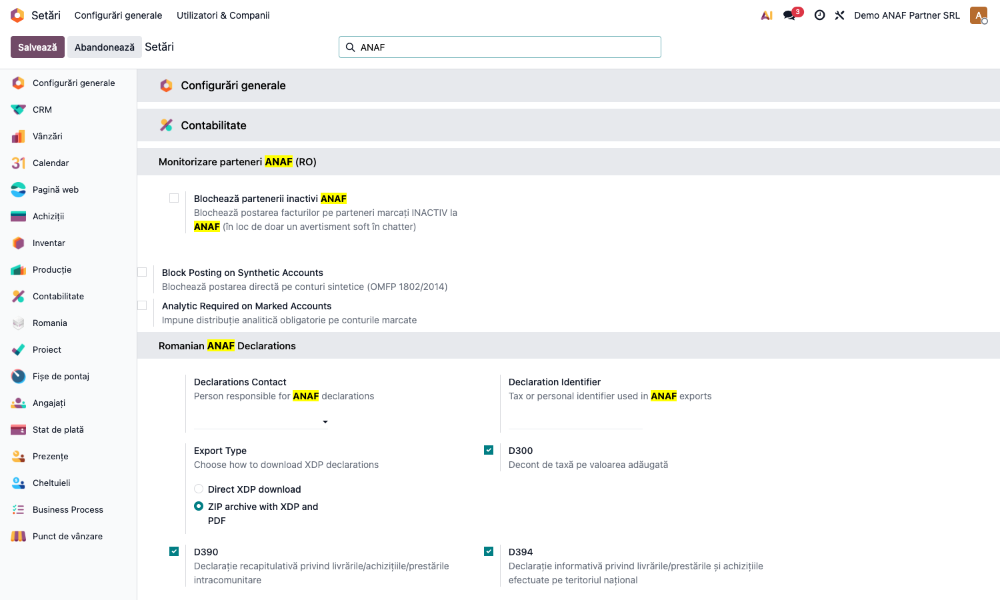

# Fișă Modul: Preluare Date Firme din ANAF

**Poziție plan:** B5.2
**Modul:** `l10n_ro_anaf_partner`
**FR:** FR-23
**Capitol manual:** Cap 9.3
**Utilizator principal:** Contabil, Operator facturare
**Prioritate:** 🟢 Standard

---

## 1. Scop business

Această fișă descrie utilizarea modulului `l10n_ro_anaf_partner` pentru scenariul **Preluare Date Firme din ANAF**.
Consultantul folosește documentul pentru reproducerea fluxului în baza demo și
pentru pregătirea capitolului Cap 9.3 din manualul utilizator.

## 2. Bază legală și context

API public ANAF `webservicesp.anaf.ro/PlatitorTvaRest`

## 3. Utilizatori și roluri

Oricine creează parteneri

Roluri recomandate pentru testare:
- Administrator funcțional: instalează modulul și verifică meniurile
- Utilizator operațional: rulează fluxul zilnic sau lunar
- Contabil/manager: validează rezultatele contabile și rapoartele

## 4. Conturi și date implicate

Modulul **nu generează note contabile** — este un strat de date despre partener. Câmpuri implicate:
`res.partner` (CUI/`l10n_ro_vat_number`, denumire, adresă, status plătitor TVA, `l10n_ro_is_inactive_anaf`),
istoricul de stare ANAF (`l10n_ro_active_anaf_line_ids`) și logul de modificări
(`l10n_ro_anaf_change_log_ids`); pe companie, flag-ul `l10n_ro_anaf_block_inactive` (FR-23).

Date minime pentru demo:
- companie românească cu localizarea RO instalată;
- un partener companie cu CUI valid (pentru preluarea datelor din ANAF);
- conectivitate la webservice-ul ANAF (pentru sincronizarea reală a datelor);
- pentru testarea blocajului FR-23: o factură ciornă pe un partener marcat inactiv.

## 5. Configurare inițială

1. Instalați modulul `l10n_ro_anaf_partner` (dependențe: `l10n_ro_fiscal_validation`, `l10n_ro_anaf_base`, `account`).
2. Verificați că utilizatorul de test are **grupul de acces RO** (altfel fila ANAF și meniul Log Modificări nu sunt vizibile).
3. Opțional, activați blocajul **Blochează partenerii inactivi ANAF** (FR-23) din Setări → Configurări generale → Monitorizare parteneri ANAF (RO).
4. Opțional, activați cronul lunar **„RO: Reverificare parteneri VIES"** din Setări tehnice → Programări (dezactivat implicit).

## 6. Flux de utilizare

### Pasul 1 — Preluarea datelor partenerului din ANAF după CUI

Deschideți **Contacte → Parteneri**, creați un partener nou (**Nou**) sau alegeți unul existent.
Completați **CUI-ul** și folosiți acțiunea de preluare date ANAF: modulul completează automat
denumirea, adresa și statusul de plătitor TVA și marchează partenerul ca **inactiv** dacă figurează
radiat în baza de date ANAF. Modulul nu generează note contabile — este un strat de date despre
partener.

### Pasul 2 — Fila ANAF a partenerului: status și istoricul de stare

Pe fișa partenerului, fila **ANAF** afișează statusul ANAF al contribuabilului și **istoricul de stare
activă/inactivă** preluat de la ANAF (act de autorizare, stare partener, datele de început/sfârșit,
publicare și radiere). Când partenerul figurează radiat, în antetul fișei apare badge-ul roșu
**INACTIV ANAF**.


### Pasul 3 — Log global al modificărilor ANAF (valori vechi → noi)

Meniu **Contabilitate → Raportare → Log Modificări ANAF** — lista globală a tuturor evenimentelor
detectate la sincronizare, cu coloanele **Câmp**, **Valoare veche** și **Valoare nouă** (adresă, status
TVA, inactivitate). Lista se deschide **filtrată implicit pe „Inactiv ANAF"**; eliminați sau schimbați
filtrul pentru a vedea toate modificările.


### Pasul 4 — Blocaj opt-in postare pe partener inactiv + reverificare VIES (FR-23)

Implicit, postarea unei facturi pe un partener marcat **INACTIV la ANAF** doar afișează un avertisment
soft în chatter. Pentru a o **bloca efectiv**, activați în **Setări → Configurări generale**, secțiunea
**Monitorizare parteneri ANAF (RO)** (folosiți caseta de căutare cu „ANAF"), opțiunea **Blochează
partenerii inactivi ANAF** ①.



Tot pe linie de conformitate, un **cron lunar** (opțional, dezactivat implicit) reverifică periodic
statusul **VIES** al partenerilor cu TVA intracomunitar și semnalează în chatter partenerii al căror
număr a devenit invalid (vezi **Setări tehnice → Programări → „RO: Reverificare parteneri VIES"**).

## 7. Legături cu alte module / declarații

| Modul / proces | Rol în flux |
|---|---|
| `res.partner` | actualizarea datelor partenerului |
| `l10n_ro_fiscal_validation` | validări fiscale suplimentare, dacă este instalat |
| `l10n_ro_partner_screening` | screening risc fiscal și conformitate |
| ANAF webservice | sursa datelor publice despre contribuabili |

Ce este automat: preluarea denumirii, adresei și statusului TVA după CUI.
Ce rămâne manual: validarea datelor importate înainte de folosirea partenerului în documente.

## 8. Verificări pentru consultant

- [ ] Modulul se instalează fără erori pe baza demo.
- [ ] Introducerea unui CUI valid preia automat denumirea, adresa și statusul TVA.
- [ ] Un partener radiat la ANAF afișează badge-ul roșu **INACTIV ANAF** în antetul fișei.
- [ ] Fila **ANAF** a partenerului arată statusul și istoricul de stare activă/inactivă.
- [ ] Logul global **Contabilitate → Raportare → Log Modificări ANAF** listează modificările cu valori vechi/noi, filtrat implicit pe „Inactiv ANAF".
- [ ] Cu opțiunea **Blochează partenerii inactivi ANAF** activă, postarea unei facturi pe un partener inactiv este oprită cu mesaj clar; dezactivată, rămâne doar avertismentul soft în chatter.

## 9. Mesaje de eroare frecvente

| Mesaj / simptom | Cauză probabilă | Remediere |
|-----------------|-----------------|-----------|
| Postare blocată: partener INACTIV la ANAF | Opțiunea **Blochează partenerii inactivi ANAF** e activă și partenerul e radiat | Reverificați statusul la ANAF; dacă a fost reactivat, resincronizați; altfel evitați tranzacția |
| Preluarea datelor după CUI nu returnează nimic | CUI invalid sau webservice ANAF indisponibil | Verificați CUI-ul și reîncercați; ANAF poate fi temporar indisponibil |
| Fila ANAF / meniul Log Modificări nu sunt vizibile | Lipsesc drepturile RO (grupul de meniuri RO) | Acordați utilizatorului grupul de acces RO și reîncărcați aplicațiile |

## 10. Capturi de ecran

Capturile (`readme/screenshots/`) sunt **generate automat** din `tests/test_screenshots.py`
(mixinul `ScreenshotCase` din `l10n_ro_doc_screenshots`, import defensiv), în **limba română**:

1. `01_partener_tab_anaf.png` — fișa partenerului, fila ANAF cu badge-ul INACTIV ANAF și istoricul de stare.
2. `02_log_modificari_anaf.png` — logul global al modificărilor ANAF (Câmp / Valoare veche / Valoare nouă), filtrat pe „Inactiv ANAF".
3. `03_setare_blocaj_inactiv.png` — setarea de blocaj opt-in postare pe partener inactiv ANAF (FR-23).

Regenerare:

```bash
./odoo/odoo-bin -c odoo.conf -d <db> -u l10n_ro_anaf_partner -i l10n_ro_doc_screenshots \
    --test-tags=fise_screenshots --stop-after-init
```

## 11. Observații pentru manual

În manualul final, păstrați explicația orientată pe activitatea utilizatorului:
ce problemă rezolvă modulul, când se rulează, ce date trebuie pregătite și cum se verifică rezultatul.
