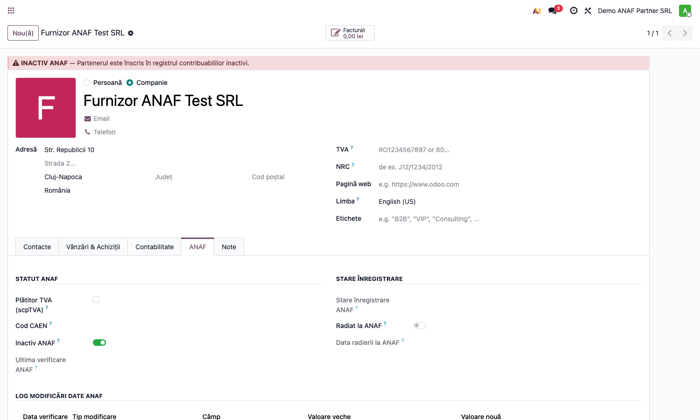
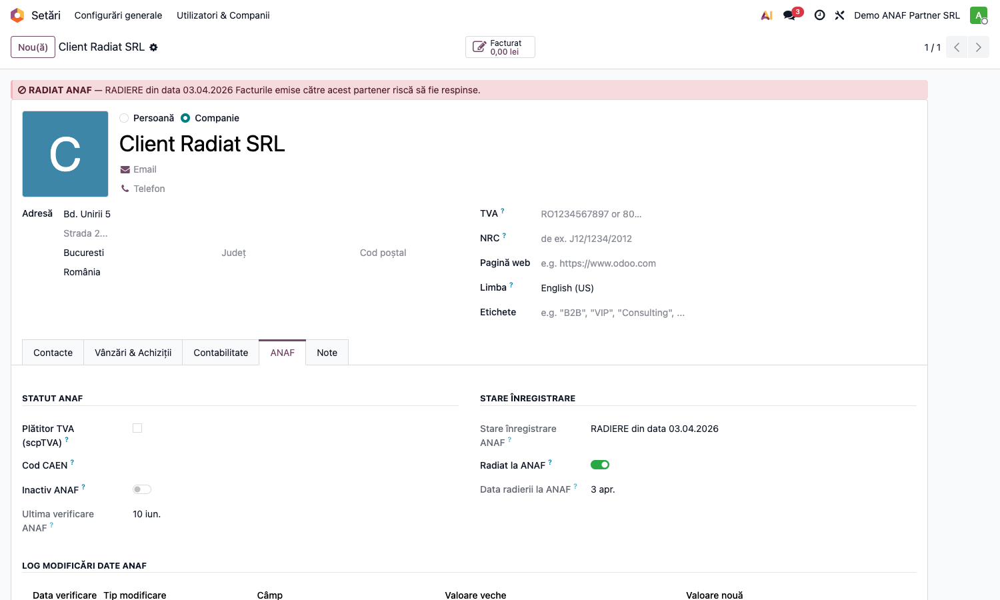
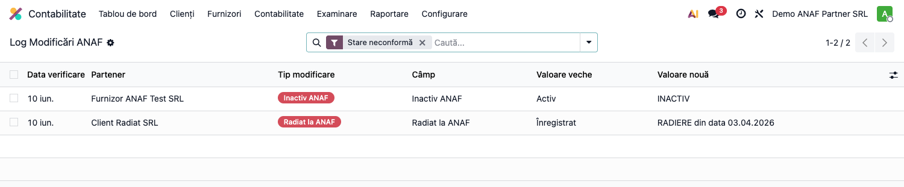
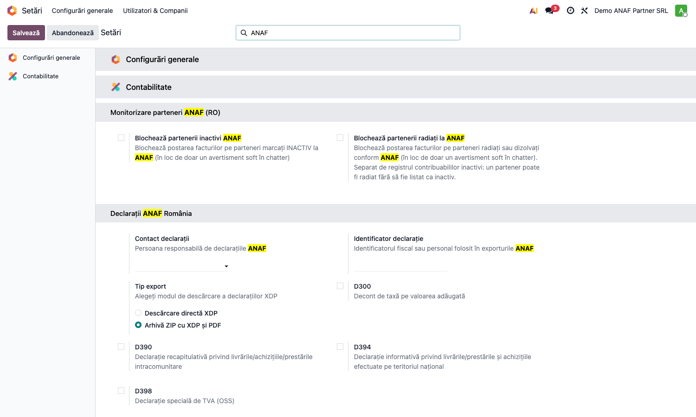

# Fișă Modul: Preluare Date Firme din ANAF

**Poziție plan:** B5.2
**Modul:** `l10n_ro_anaf_partner`
**FR:** FR-23
**Capitol manual:** Cap 9.3
**Utilizator principal:** Contabil, Operator facturare
**Prioritate:** 🟢 Standard

---

## 1. Scop business

Această fișă descrie utilizarea modulului `l10n_ro_anaf_partner` pentru scenariul **Preluare Date Firme din ANAF**.
Consultantul folosește documentul pentru reproducerea fluxului în baza demo și
pentru pregătirea capitolului Cap 9.3 din manualul utilizator.

## 2. Bază legală și context

API public ANAF `webservicesp.anaf.ro/PlatitorTvaRest`

**Două stări distincte, care nu coincid.** ANAF publică separat:

| Stare | Ce înseamnă | Sursa în răspunsul ANAF |
|---|---|---|
| **Contribuabil inactiv** | Firma e înscrisă în registrul contribuabililor inactivi | `stare_inactiv.statusInactivi` |
| **Radiat / dizolvat** | Firma nu mai există ca entitate facturabilă | `date_generale.stare_inregistrare`, `stare_inactiv.dataRadiere` |

O firmă poate fi **radiată fără să fie listată ca inactivă**. Verificarea pe un singur
câmp lasă deci o gaură: partenerul trece drept bun, factura se emite și e respinsă la
transmitere. Modulul urmărește ambele stări, independent una de alta.

## 3. Utilizatori și roluri

Oricine creează parteneri

Roluri recomandate pentru testare:
- Administrator funcțional: instalează modulul și verifică meniurile
- Utilizator operațional: rulează fluxul zilnic sau lunar
- Contabil/manager: validează rezultatele contabile și rapoartele

## 4. Conturi și date implicate

Modulul **nu generează note contabile** — este un strat de date despre partener. Câmpuri implicate
pe `res.partner`: CUI (`l10n_ro_vat_number`), denumire, adresă, status plătitor TVA,
`l10n_ro_is_inactive_anaf`, iar pentru starea de înregistrare
`l10n_ro_anaf_registration_state`, `l10n_ro_anaf_radiation_date` și
`l10n_ro_is_struck_off_anaf`. Logul de modificări e în `l10n_ro_anaf_change_log_ids`.
Pe companie, cele două flag-uri de blocare: `l10n_ro_anaf_block_inactive` (FR-23) și
`l10n_ro_anaf_block_struck_off`.

Date minime pentru demo:
- companie românească cu localizarea RO instalată;
- un partener companie cu CUI valid (pentru preluarea datelor din ANAF);
- conectivitate la webservice-ul ANAF (pentru sincronizarea reală a datelor);
- pentru testarea blocajelor: o factură ciornă pe un partener marcat inactiv și una pe un partener radiat.

## 5. Configurare inițială

1. Instalați modulul `l10n_ro_anaf_partner` (dependențe: `l10n_ro_anaf_base`, `account` — fără module OCA).
2. Verificați că utilizatorul de test are **grupul de acces RO** (altfel fila ANAF și meniul Log Modificări nu sunt vizibile).
3. Opțional, activați blocajele din **Setări → Configurări generale → Monitorizare parteneri ANAF (RO)**:
   **Blochează partenerii inactivi ANAF** și/sau **Blochează partenerii radiați la ANAF**.
   Cele două sunt **independente** — activarea unuia nu îl activează pe celălalt.
4. Opțional, activați cronul lunar **„RO: Reverificare parteneri VIES"** din Setări tehnice → Programări (dezactivat implicit).
5. Opțional, dacă întâlniți o stare de înregistrare neacoperită, completați parametrul de sistem
   `l10n_ro_anaf_partner.struck_off_keywords` (implicit `RADIERE,RADIAT,DIZOLVARE`).

## 6. Flux de utilizare

### Pasul 1 — Preluarea datelor partenerului din ANAF după CUI

Deschideți **Contacte → Parteneri**, creați un partener nou (**Nou**) sau alegeți unul existent.
Completați **CUI-ul** și folosiți acțiunea de preluare date ANAF: modulul completează automat
denumirea, adresa și statusul de plătitor TVA și marchează starea neconformă — inactivare
sau radiere. Modulul nu generează note contabile — este un strat de date despre partener.

### Pasul 2 — Fila ANAF a partenerului: status, stare de înregistrare, istoric

Pe fișa partenerului, fila **ANAF** afișează statutul ANAF în stânga (plătitor TVA, cod CAEN,
Inactiv ANAF, ultima verificare) și **starea de înregistrare** în dreapta (starea întoarsă de
ANAF, indicatorul Radiat la ANAF, data radierii). Când partenerul figurează în registrul
contribuabililor inactivi, în antetul fișei apare banda roșie **INACTIV ANAF**.



### Pasul 3 — Partener radiat: banda de avertizare și starea de înregistrare

Când ANAF raportează partenerul ca **radiat sau dizolvat**, în antet apare banda roșie
**RADIAT ANAF**, cu starea exactă întoarsă de ANAF și avertismentul că facturile emise riscă
să fie respinse.

Captura de mai jos e chiar cazul care contează: **Radiat la ANAF** este activ, iar
**Inactiv ANAF** este oprit. Partenerul nu figurează în registrul contribuabililor inactivi —
verificat doar pe acel câmp, ar fi trecut drept client în regulă.



### Pasul 4 — Log global al modificărilor ANAF (valori vechi → noi)

Meniu **Contabilitate → Raportare → Log Modificări ANAF** — lista globală a tuturor evenimentelor
detectate la sincronizare, cu coloanele **Câmp**, **Valoare veche** și **Valoare nouă** (adresă, status
TVA, inactivare, radiere).


Lista se deschide **filtrată implicit pe „Stare neconformă"**, care cuprinde **ambele** stări —
inactivare și radiere. Filtrele separate **Inactiv ANAF** și **Radiat la ANAF** rămân
disponibile pentru a le privi individual; eliminați filtrul pentru a vedea toate modificările.



### Pasul 5 — Blocaje opt-in la postare + reverificare VIES (FR-23)

Implicit, postarea unei facturi pe un partener cu stare neconformă doar afișează un avertisment
soft în chatter. Pentru a o **bloca efectiv**, activați în **Setări → Configurări generale**,
secțiunea **Monitorizare parteneri ANAF (RO)** (folosiți caseta de căutare cu „ANAF"), bifele
corespunzătoare ①:

| Bifă | Blochează postarea pe |
|---|---|
| **Blochează partenerii inactivi ANAF** | parteneri din registrul contribuabililor inactivi |
| **Blochează partenerii radiați la ANAF** | parteneri radiați sau dizolvați |



Cele două sunt **deliberat independente**: activarea blocajului pe inactivi nu blochează și
partenerii radiați, ca activarea uneia să nu schimbe tăcut comportamentul celeilalte la
clienții care rulează deja cu una dintre ele.

Tot pe linie de conformitate, un **cron lunar** (opțional, dezactivat implicit) reverifică periodic
statusul **VIES** al partenerilor cu TVA intracomunitar și semnalează în chatter partenerii al căror
număr a devenit invalid (vezi **Setări tehnice → Programări → „RO: Reverificare parteneri VIES"**).

## 7. Legături cu alte module / declarații

| Modul / proces | Rol în flux |
|---|---|
| `res.partner` | actualizarea datelor partenerului |
| ANAF webservice TVA (v9) | sincronizarea datelor partenerilor (client propriu) |
| `l10n_ro_partner_screening` | screening risc fiscal și conformitate |
| ANAF webservice | sursa datelor publice despre contribuabili |

Ce este automat: preluarea denumirii, adresei și statusului TVA după CUI; marcarea stării
neconforme (inactivare, radiere) și logarea tranziției.
Ce rămâne manual: validarea datelor importate înainte de folosirea partenerului în documente;
decizia de a bloca sau doar avertiza.

## 8. Verificări pentru consultant

- [ ] Modulul se instalează fără erori pe baza demo.
- [ ] Introducerea unui CUI valid preia automat denumirea, adresa și statusul TVA.
- [ ] Fila **ANAF** a partenerului este vizibilă pentru un partener **companie** din **România** și arată statutul, starea de înregistrare și istoricul.
- [ ] Un partener din registrul contribuabililor inactivi afișează banda roșie **INACTIV ANAF**.
- [ ] Un partener radiat afișează banda roșie **RADIAT ANAF**, cu starea exactă întoarsă de ANAF.
- [ ] Un partener **radiat dar neinactiv** este totuși semnalat (verificarea nu se bazează doar pe registrul inactivilor).
- [ ] Un partener în **TRANSFER** *nu* este marcat ca radiat.
- [ ] Logul global **Contabilitate → Raportare → Log Modificări ANAF** listează modificările cu valori vechi/noi, filtrat implicit pe „Stare neconformă", și cuprinde ambele stări.
- [ ] Cu **Blochează partenerii inactivi ANAF** activ, postarea pe un partener inactiv este oprită cu mesaj clar; dezactivat, rămâne avertismentul soft.
- [ ] Cu **Blochează partenerii radiați la ANAF** activ, postarea pe un partener radiat este oprită; dezactivat, rămâne avertismentul soft.
- [ ] Activarea unui blocaj **nu** îl activează pe celălalt.

## 9. Mesaje de eroare frecvente

| Mesaj / simptom | Cauză probabilă | Remediere |
|-----------------|-----------------|-----------|
| Postare blocată: partener INACTIV la ANAF | Bifa **Blochează partenerii inactivi ANAF** e activă și partenerul e în registrul inactivilor | Reverificați statusul la ANAF; dacă a fost reactivat, resincronizați; altfel evitați tranzacția |
| Postare blocată: partener RADIAT la ANAF | Bifa **Blochează partenerii radiați la ANAF** e activă și ANAF raportează radiere/dizolvare | Verificați starea la ANAF; dacă partenerul chiar e radiat, tranzacția nu trebuie facturată către el |
| Partener radiat, dar nesemnalat | Starea întoarsă de ANAF nu e acoperită de lista de cuvinte-cheie | Adăugați starea în parametrul `l10n_ro_anaf_partner.struck_off_keywords` |
| Preluarea datelor după CUI nu returnează nimic | CUI invalid sau webservice ANAF indisponibil | Verificați CUI-ul și reîncercați; ANAF poate fi temporar indisponibil |
| Fila ANAF / meniul Log Modificări nu sunt vizibile | Lipsesc drepturile RO, sau partenerul nu e companie din România | Acordați grupul de acces RO și reîncărcați aplicațiile; verificați **Companie** și **Țara = România** pe partener |

## 10. Capturi de ecran

Capturile (`readme/screenshots/`) sunt **generate automat** din `tests/test_screenshots.py`
(mixinul `ScreenshotCase` din `l10n_ro_doc_screenshots`, import defensiv), în **limba română**:

1. `01_partener_tab_anaf.png` — fișa partenerului, fila ANAF cu banda INACTIV ANAF, statutul și istoricul.
2. `02_log_modificari_anaf.png` — logul global al modificărilor ANAF (Câmp / Valoare veche / Valoare nouă).
3. `03_setari_blocaje_anaf.png` — cele două blocaje opt-in la postare: partener inactiv (FR-23) și partener radiat.
4. `04_partener_radiat.png` — partener radiat la ANAF: banda RADIAT ANAF și starea de înregistrare, cu **Inactiv ANAF oprit**.
5. `05_log_stari_neconforme.png` — logul filtrat pe „Stare neconformă", cu ambele stări în listă.

Regenerare:

```bash
./odoo/odoo-bin -c odoo.conf -d <db> -u l10n_ro_anaf_partner -i l10n_ro_doc_screenshots \
    --test-tags=fise_screenshots --stop-after-init
```

> Capturile se rescriu la fiecare rulare de teste cu eticheta `fise_screenshots`. Dacă
> textul din interfață apare în engleză, reîncărcați traducerile modulului
> (`_update_translations(["ro_RO"])`) înainte de regenerare.

## 11. Observații pentru manual

În manualul final, păstrați explicația orientată pe activitatea utilizatorului:
ce problemă rezolvă modulul, când se rulează, ce date trebuie pregătite și cum se verifică rezultatul.

Pentru capitolul Cap 9.3, insistați pe distincția dintre **inactivare** și **radiere**: e
contraintuitivă, iar utilizatorul care crede că „inactiv" acoperă tot ratează exact cazul în
care factura e respinsă la transmitere.
