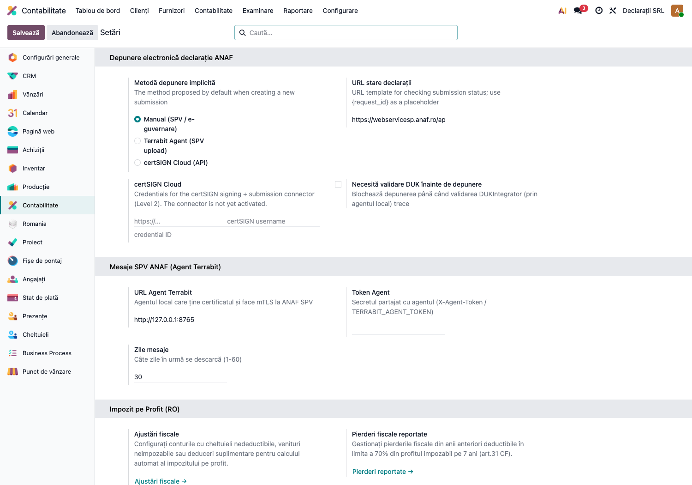
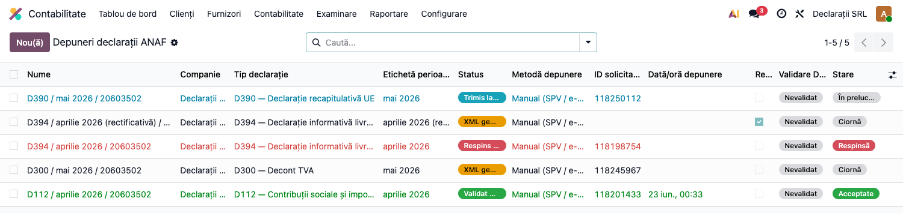
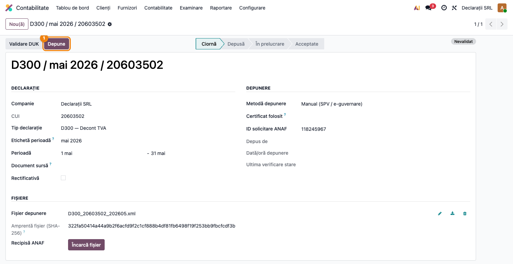
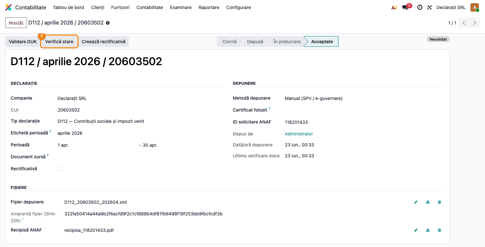
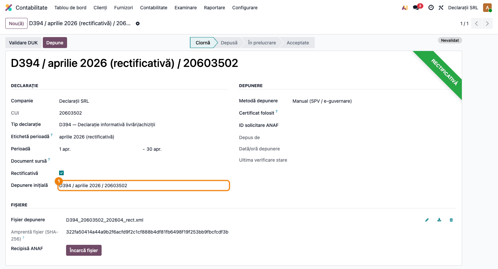

# Fișă Modul: Depunerea electronică a declarațiilor ANAF (registru + recipisă)

**Modul:** `l10n_ro_anaf_submission`
**FR:** FR-53
**Utilizator principal:** Contabil declarații, Contabil șef
**Prioritate:** 🔴 Ridicată (fiecare declarație lunară trece prin depunere; dovada e recipisa)

---

## 1. Scop business

Modulul adaugă **registrul de depuneri** pentru declarațiile fiscale generate în Odoo
(D112, D300, D394, D406/SAF-T etc.): o înregistrare de depunere păstrează fișierul depus, amprenta
SHA-256, ID-ul solicitării ANAF, starea, eventualele erori, **recipisa** și pista de audit (cine și
când a depus). Modulul **nu generează declarații** — acelea vin din modulele dedicate
(`l10n_ro_anaf_d300`, `l10n_ro_anaf_d112`, ...) sau pot fi **încărcate manual** dacă au fost
făcute în alt sistem; aici se răspunde la întrebarea „a ajuns la ANAF și a fost acceptată?".

Registrul adună toate declarațiile la un loc, cu statusul fiecăreia de-a lungul întregului ciclu:
**ciornă → XML generat → (validat DUK) → trimis la ANAF → validat ANAF**.

Sunt suportate trei metode de depunere:
- **Manual (SPV / e-guvernare)** — contabilul depune fișierul în SPV cu certificatul calificat,
  introduce ID-ul solicitării în Odoo, iar sistemul verifică starea și păstrează recipisa;
- **Agent Terrabit (upload SPV)** — depunere automată prin agentul local Terrabit de pe stația
  contabilului: Odoo pune un job de upload în coada agentului, care transmite la SPV și raportează
  înapoi ID-ul solicitării și starea;
- **certSIGN Cloud (API)** — conector de semnare + transmitere directă; configurarea există, dar
  conectorul e momentan neactivat (necesită API-ul comercial certSIGN).

> **Validarea oficială DUK** (validatorul ANAF, prin modulul complementar `l10n_ro_anaf_duk`):
> dacă e instalat, fiecare depunere capătă butonul **Validare DUK** și un **status unificat** care
> arată dintr-o privire unde se află declarația în ciclul de viață. Vezi secțiunea 7.

## 2. Bază legală și context

Depunerea declarațiilor fiscale prin mijloace electronice de transmitere la distanță este regula
generală (Codul de procedură fiscală; portalul e-guvernare.ro / SPV — OUG 41/2016). Recipisa
emisă de ANAF (cu index de încărcare) este dovada depunerii; verificarea stării se face public,
după ID-ul solicitării, fără certificat.

## 3. Utilizatori și roluri

Contabil declarații (depune și urmărește), contabil șef (verifică recipisele la închidere).

Roluri recomandate pentru testare:
- Administrator funcțional: instalează modulul, alege metoda de depunere implicită;
- Utilizator operațional (grup „Contabil" — `account.group_account_user`): creează depuneri,
  apasă Depune / Verifică stare;
- Contabil/manager: confirmă recipisele și rectificativele.

## 4. Conturi și date implicate

Modulul **nu generează note contabile** și nu atinge conturi — păstrează fișiere, stări și
pista de audit a depunerilor.

Date minime pentru demo:
- companie românească cu CUI valid;
- un fișier de declarație generat (XML/PDF) dintr-un modul Dxxx **sau** un fișier făcut în alt
  sistem, încărcat manual;
- pentru metoda Agent Terrabit: agentul local pornit și înregistrat pe stația contabilului;
- pentru metoda manuală nu e nevoie de nicio conexiune — doar de ID-ul solicitării primit la
  încărcarea în SPV.

## 5. Configurare inițială

1. Instalați modulul `l10n_ro_anaf_submission` (aduce automat `l10n_ro_anaf_base`).
2. Deschideți **Setări → Contabilitate**, blocul **Depunere electronică declarații ANAF**.
3. Alegeți **Metodă depunere implicită**: Manual (SPV / e-guvernare), Agent Terrabit sau
   certSIGN Cloud.
4. Verificați **URL stare declarații ANAF** (endpoint-ul public de verificare — precompletat;
   valoarea completă continuă cu `…/StareDeclaratie?id={request_id}`, unde `{request_id}` se
   înlocuiește automat cu ID-ul solicitării).
5. Opțional, activați cron-ul **„ANAF: check status of pending submissions"** (dezactivat
   implicit, rulează la 6 ore) din **Setări → Tehnic → Acțiuni programate** — verifică automat
   depunerile aflate în lucru.



## 6. Flux de utilizare

### Pasul 1 — Registrul depunerilor

Accesați **Contabilitate → Raportare → Declarații ANAF → Depuneri electronice**. Fiecare rând
este o depunere: declarația (tip + perioadă), CUI-ul, metoda, ID-ul solicitării ANAF și starea.

**Găsiți pe ecran**: coloana de stare urmărește ciclul de viață — **Ciornă** (pregătită, încă
nedepusă), **Depusă**, **În prelucrare**, **Acceptată** (recipisă primită), **Respinsă**,
**Eroare**. Dacă e instalat modulul DUK, apare în plus un **status unificat** care înglobează și
validarea DUK (vezi secțiunea 7). **Verificați**: pentru luna închisă, fiecare declarație generată
are o depunere în starea Acceptată; nu rămân depuneri blocate în Depusă/În prelucrare mai vechi de
câteva zile.



### Pasul 2 — Depunerea manuală (SPV) și înregistrarea ID-ului

Creați o depunere (sau deschideți-o pe cea creată de modulul declarației prin butonul „Create ANAF
submission" din raport). Pentru o declarație **făcută în alt sistem**, creați manual înregistrarea
și atașați fișierul la **Fișier depunere** (amprenta SHA-256 se calculează automat). Alegeți metoda
**Manual (SPV / e-guvernare)**, încărcați fișierul în SPV cu certificatul calificat și introduceți
în Odoo **ID solicitare ANAF** primit la încărcare. Apăsați **Depune**: starea trece în **Depusă**,
iar pista de audit reține utilizatorul și momentul (câmpurile „Depus de" / „Data depunerii");
evenimentul se consemnează și în jurnalul de mesaje al înregistrării.

> Fără ID-ul solicitării, butonul **Depune** refuză depunerea manuală — completați-l întâi.
> La metoda **Agent Terrabit**, **Depune** pune un job de upload în coada agentului, fără a cere
> ID-ul în prealabil (acesta vine înapoi de la agent odată cu starea).



### Pasul 3 — Verificarea stării și recipisa

Apăsați **Verifică stare**: la metoda manuală, Odoo interoghează endpoint-ul public ANAF după
ID-ul solicitării și actualizează starea (Depusă → În prelucrare → Acceptată/Respinsă), reținând
momentul ultimei verificări. La metoda **Agent Terrabit**, starea e împinsă automat de agent pe
măsură ce jobul de upload progresează. La metoda manuală, atașați recipisa descărcată din SPV și
apăsați **Marchează acceptată**.

> Butonul **Marchează acceptată** e vizibil doar după ce recipisa e atașată și câtă vreme
> depunerea nu e încă în starea Acceptată — după acceptare dispare din antet.

**Verificați** pe formular înainte de a închide subiectul: starea e **Acceptată**, recipisa e
atașată la **Recipisă ANAF**, iar amprenta SHA-256 a fișierului depus e completată (dovada că
fișierul arhivat e cel transmis).



### Pasul 4 — Declarația rectificativă

Dacă declarația trebuie corectată, apăsați **Creează rectificativă** pe depunerea inițială:
se creează o nouă depunere marcată **Rectificativă**, legată de originală (butonul inteligent
„Rectificative" numără corecțiile). Atașați fișierul rectificativ și reluați pașii 2–3.



### Note de monografie și raportare

Modulul **nu generează note contabile** (niciun Dr/Cr) — este registru de depuneri și dovezi.
Recipisele pot sosi și prin canalul de mesaje SPV (`l10n_ro_anaf_messages`); corelarea se face
prin **ID solicitare ANAF**.

## 7. Legături cu alte module / declarații

| Modul / proces | Rol în flux | Tip legătură |
|---|---|---|
| `l10n_ro_anaf_base` | meniul „Declarații ANAF" + infrastructura comună | dependență (manifest) |
| `l10n_ro_anaf_d100`/`d112`/`d300`/`d394`/`d406`/... | generează fișierele declarațiilor de depus (buton „Create ANAF submission") | sursa depunerilor |
| `l10n_ro_anaf_duk` | adaugă **Validare DUK** (validatorul oficial ANAF, prin agent) + **statusul unificat** pe registru | complementar (extinde depunerea) |
| `l10n_ro_anaf_agent` | agentul local Terrabit (upload SPV, validare DUK, mesaje SPV) | infrastructură pentru metoda „Agent" și DUK |
| `l10n_ro_anaf_messages` | recipisele și notificările SPV sosesc ca mesaje | complementar (corelare prin ID solicitare) |

**Validarea DUK (când `l10n_ro_anaf_duk` e instalat).** Pe formular apare butonul **Validare DUK**:
fișierul XML e trimis spre validatorul oficial ANAF (DUKIntegrator), rulat local de agentul
Terrabit; rezultatul (valid/invalid + PDF-ul oficial + erorile) se aplică pe depunere. În listă
apare o coloană **Status** unificată care combină starea de depunere cu validarea DUK:
Ciornă → XML generat → **Validat DUK** → Trimis la ANAF → Validat ANAF. Opțional, prin bifa de pe
companie, validarea DUK poate fi **obligatorie înainte de depunere**.

Ce este automat: amprenta SHA-256, verificarea stării (buton sau cron), împingerea stării de la
agent (metoda Agent), validarea DUK + PDF-ul oficial, legătura rectificativă → originală.
Ce rămâne manual: încărcarea în SPV și introducerea ID-ului (la metoda manuală), atașarea
recipisei + **Marchează acceptată** (la metoda manuală), activarea cron-ului.

## 8. Verificări pentru consultant

- [ ] Modulul se instalează fără erori pe baza demo.
- [ ] Blocul **Depunere electronică declarații ANAF** apare în Setări → Contabilitate, cu metoda implicită radio.
- [ ] Meniul **Contabilitate → Raportare → Declarații ANAF → Depuneri electronice** e vizibil pentru grupul Contabil.
- [ ] Se poate crea o depunere nouă și **încărca un fișier XML făcut în alt sistem** (metoda Manual).
- [ ] **Depune** fără fișier atașat dă eroare clară; cu metoda manuală fără ID solicitare, la fel.
- [ ] După **Depune** (manual), starea e **Depusă**, iar „Depus de"/„Data depunerii" sunt completate.
- [ ] **Verifică stare** actualizează starea și momentul ultimei verificări.
- [ ] **Marchează acceptată** cere recipisa atașată și trece starea în **Acceptată**.
- [ ] **Creează rectificativă** leagă noua depunere de originală (contorul „Rectificative" crește).
- [ ] Cron-ul „ANAF: check status of pending submissions" există și e **dezactivat** implicit.
- [ ] (Cu DUK instalat) **Validare DUK** rulează și aduce starea DUK + PDF; coloana **Status** reflectă progresul.

## 9. Mesaje de eroare frecvente

| Mesaj / simptom | Cauză probabilă | Remediere |
|-----------------|-----------------|-----------|
| „Atașați mai întâi fișierul de depunere." | S-a apăsat Depune fără fișier | Atașați XML-ul/PDF-ul declarației la Fișier depunere |
| „Pentru depunerea manuală introduceți ID-ul solicitării ANAF…" | Metoda manuală fără ID solicitare completat | Încărcați fișierul în SPV, notați ID-ul primit și completați-l, apoi Depune |
| „Doar declarațiile în ciornă, eroare sau respinse pot fi depuse." | Re-depunere pe o înregistrare deja depusă/acceptată | Folosiți **Creează rectificativă** pentru corecții |
| Starea rămâne În prelucrare mult timp | ANAF încă procesează sau ID-ul solicitării e greșit | Verificați ID-ul; reîncercați Verifică stare mai târziu |
| „Conectorul certSIGN Cloud nu este încă activat…" | Metoda certSIGN selectată, dar conectorul e stub | Folosiți metoda Manual sau Agent Terrabit până la activarea API-ului certSIGN |
| „Nu există un agent ANAF activ înregistrat…" (metoda Agent / DUK) | Agentul Terrabit nu e instalat/înregistrat pe stație | Instalați și înregistrați agentul Terrabit pe stația contabilului |
| „DUKIntegrator validates XML files…" la Validare DUK | Fișierul atașat nu e `.xml` | Pentru validarea DUK încărcați XML-ul, nu un ZIP/PDF |

## 10. Capturi de ecran

Capturile (`readme/screenshots/`) sunt **generate automat** din `tests/test_screenshots.py`
(mixinul `ScreenshotCase` din `l10n_ro_doc_screenshots`, import defensiv), în **limba română**,
pe planul de conturi RO; depunerile demo sunt create direct în baza de test, fără conexiune la ANAF:

1. `01_setari_depunere.png` — blocul de setări (metodă implicită, URL stare).
2. `02_lista_depuneri.png` — registrul depunerilor, cu stările ciclului de viață.
3. `03_depunere_manuala.png` — depunere manuală pregătită (fișier + ID solicitare), butonul Depune.
4. `04_depunere_acceptata.png` — depunere acceptată, cu recipisă atașată și pista de audit.
5. `05_rectificativa.png` — depunere rectificativă legată de depunerea inițială.

Regenerare:

```bash
./odoo/odoo-bin -c odoo.conf -d <db> -u l10n_ro_anaf_submission,l10n_ro_doc_screenshots \
    --test-tags=fise_screenshots --stop-after-init
```

## 11. Observații pentru manual

Păstrați distincția dintre **generarea** declarației (modulele Dxxx) și **depunerea** ei (acest
modul): manualul trebuie să arate clar unde se termină una și unde începe cealaltă. Subliniați că
registrul adună **toate** declarațiile la un loc — inclusiv cele făcute în alt sistem și încărcate
manual — cu statusul complet de la ciornă la validat ANAF. Insistați pe disciplină operațională:
nicio declarație „depusă" fără ID de solicitare și recipisă arhivate. Menționați că validarea DUK
și statusul unificat apar doar cu modulul `l10n_ro_anaf_duk` instalat, iar metoda certSIGN apare în
configurare, dar se activează doar când API-ul comercial devine disponibil.
