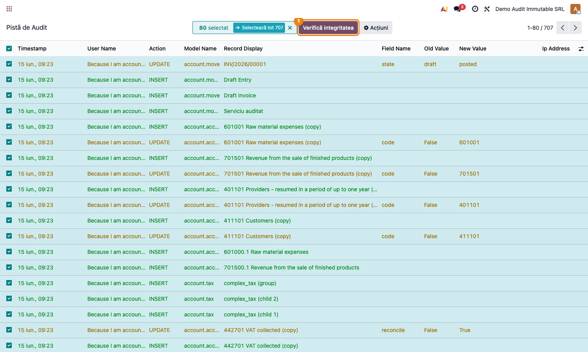
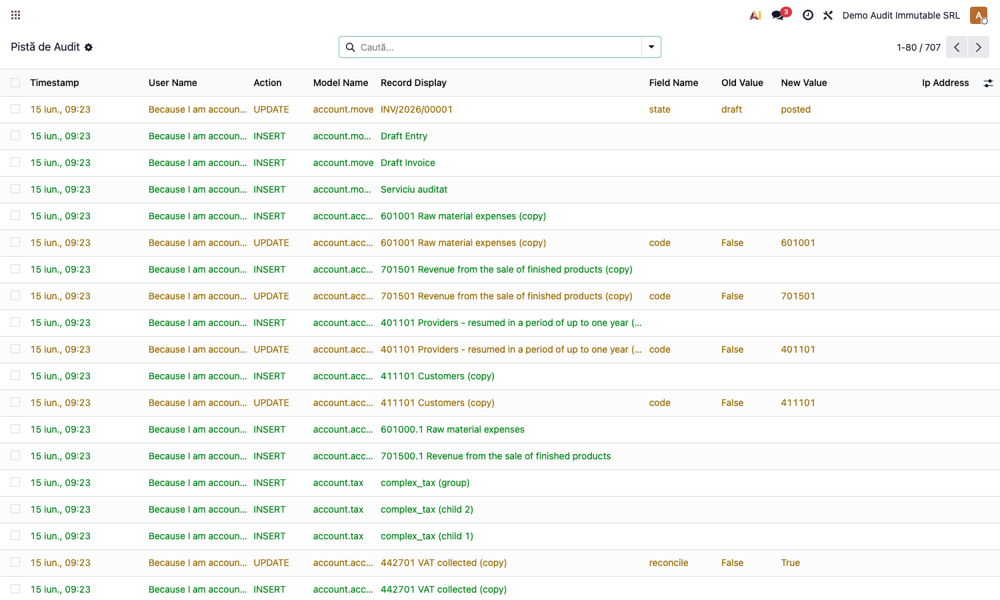

# Fișă Modul: Pistă de Audit Imuabilă

**Poziție plan:** B8.5
**Modul:** `l10n_ro_audit_immutable`
**FR:** FR-14
**Capitol manual:** Cap 13.1
**Utilizator principal:** Auditor intern, Manager Contabilitate
**Prioritate:** 🟡 Medie (critică pentru companii cu audit extern)

---

## 1. Scop business

Această fișă descrie utilizarea modulului `l10n_ro_audit_immutable` pentru scenariul **Pistă de Audit Imuabilă**.
Consultantul folosește documentul pentru reproducerea fluxului în baza demo și
pentru pregătirea capitolului Cap 13.1 din manualul utilizator.

## 2. Bază legală și context

Legea 82/1991 art. 25 — obligativitatea pistei de audit; GDPR art. 5(1)(f)

## 3. Utilizatori și roluri

Auditor Intern, Administrator IT

Roluri recomandate pentru testare:
- Administrator funcțional: instalează modulul și verifică meniurile
- Utilizator operațional: rulează fluxul zilnic sau lunar
- Contabil/manager: validează rezultatele contabile și rapoartele

## 4. Conturi și date implicate

—

Date minime pentru demo:
- companie românească cu localizarea contabilă instalată
- perioadă contabilă deschisă
- jurnale și conturi configurate conform scenariului
- documente de test postate, acolo unde fluxul pornește din contabilitate, stocuri, HR sau vânzări

## 5. Configurare inițială

1. Instalați modulul `l10n_ro_audit_immutable` pe baza demo.
2. Verificați dependențele cerute de manifest și meniurile nou apărute.
3. Configurați conturile, jurnalele, produsele, partenerii sau parametrii specifici fluxului.
4. Pregătiți un set minim de documente postate pentru perioada de test.
5. Verificați că utilizatorul de test are grupurile de acces necesare.

## 6. Flux de utilizare

### Pasul 1 — Accesare

Accesați **Contabilitate → Audit → Pistă de Audit** pentru verificarea evenimentelor sau deschideți o notă contabilă postată pentru testarea trasabilității.

### Pasul 2 — Completare date

Completați câmpurile obligatorii: companie, perioadă, jurnal, conturi, parteneri sau documente sursă, după caz.

### Pasul 3 — Calcul / import / generare

Rulați acțiunea principală a modulului. Pentru această fișă trebuie documentate:

- Log automat create/write/unlink pe note contabile și linii
- imuabilitate ORM + trigger PostgreSQL
- grupul group_audit_reader
- view read-only cu codificare culori
- capturare IP utilizator

### Pasul 4 — Verificare rezultat

Comparați rezultatul generat cu documentele sursă și cu monografia contabilă așteptată.
Verificați totalurile, starea documentului și eventualele mesaje de avertizare.

### Pasul 5 — Confirmare / postare

Confirmați documentul sau postați nota contabilă, după caz. Notați ce câmpuri devin readonly și ce linkuri apar către documentele generate.

### Pasul 6 — Export / raportare

Dacă modulul oferă export PDF, XLSX sau XML, generați fișierul și verificați că include datele de test relevante.

### Pasul 7 — Verificarea integrității pistei de audit (hash chain)

Fiecare înregistrare din pistă primește la creare un **hash SHA-256 înlănțuit** (`secure_hash`), care
include hash-ul intrării precedente. Astfel, orice modificare frauduloasă a unei intrări (chiar dacă
s-ar ocoli trigger-ul PostgreSQL la nivel de bază de date) rupe lanțul și devine detectabilă.

În lista **Pistă de Audit**, apăsați butonul **Verifică integritatea** ① din antet.

**Găsește → verifică → confirmă:**
1. **Găsește pe ecran** — butonul „Verifică integritatea" din antetul listei.
2. **Verifică** — sistemul reparcurge tot lanțul de hash-uri și afișează o notificare:
   - **verde** („Integritatea pistei de audit verificată: N intrări, lanț de hash inviolat") = pista
     este intactă;
   - **roșie** („INTEGRITATE RUPTĂ … prima intrare coruptă: #ID") = o intrare a fost modificată
     retroactiv; intrarea raportată este prima afectată, cele de dinaintea ei rămân de încredere.
3. **Confirmă** — pentru un dosar de audit extern, rulați verificarea înainte de a preda pista și
   păstrați rezultatul (verde) ca dovadă a inviolabilității.

## 7. Legături cu alte module / declarații

| Modul / proces | Rol în flux |
|---|---|
| `account` | note contabile și modificări auditate |
| `mail` / chatter | istoric operațional și justificări |
| `l10n_ro_sod_matrix` | control acces și segregare atribuții |
| Audit extern | raportare evenimente și trasabilitate |

Ce este automat: înregistrarea evenimentelor sensibile în pista de audit.
Ce rămâne manual: analiza evenimentelor și justificarea excepțiilor.

## 8. Verificări pentru consultant

- [ ] Modulul se instalează fără erori pe baza demo.
- [ ] Meniurile și acțiunile sunt vizibile pentru rolul de utilizator potrivit.
- [ ] Fluxul poate fi reprodus de la cap la coadă cu date fictive românești.
- [ ] Rezultatul contabil sau operațional corespunde descrierii din plan.
- [ ] Mesajele de eroare sunt clare pentru un utilizator non-tehnic.
- [ ] Exporturile sau rapoartele se descarcă și conțin datele testate.
- [ ] Butonul „Verifică integritatea" pe o pistă intactă întoarce notificarea verde (lanț inviolat).
- [ ] După o modificare frauduloasă (test), verificarea semnalează prima intrare coruptă (notificare roșie).

## 9. Mesaje de eroare frecvente

| Mesaj / simptom | Cauză probabilă | Remediere |
|-----------------|-----------------|-----------|
| Meniul nu este vizibil | Utilizatorul nu are grupurile necesare | Verificați drepturile de acces și reîncărcați aplicațiile |
| Nu se generează linii | Lipsesc documente postate în perioada aleasă | Creați și postați datele de test necesare |
| Cont lipsă sau jurnal lipsă | Configurarea contabilă este incompletă | Completați conturile și jurnalele în setările modulului |
| Perioada este blocată | Data documentului este într-o perioadă închisă | Folosiți o perioadă deschisă sau ajustați lock date-ul în demo |

## 10. Capturi de ecran

**Lista pistei de audit — înregistrări INSERT (verde) pe modele financiare cheie ①:**

| # | Fișier | Conținut |
|---|--------|----------|
| 1 | `screenshots/01_pista_audit_lista.png` | Pistă audit ① — INSERT pe account.move/line/tax cu timestamp, user, model, câmp, valoare veche/nouă |
| 2 | `screenshots/02_verificare_integritate.png` | Butonul „Verifică integritatea" ① + notificarea de rezultat (lanț de hash inviolat) |
