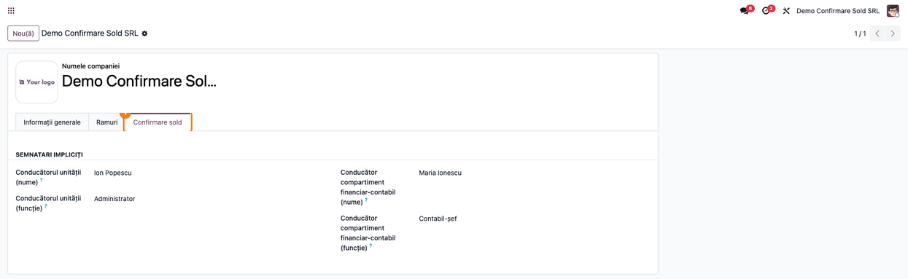
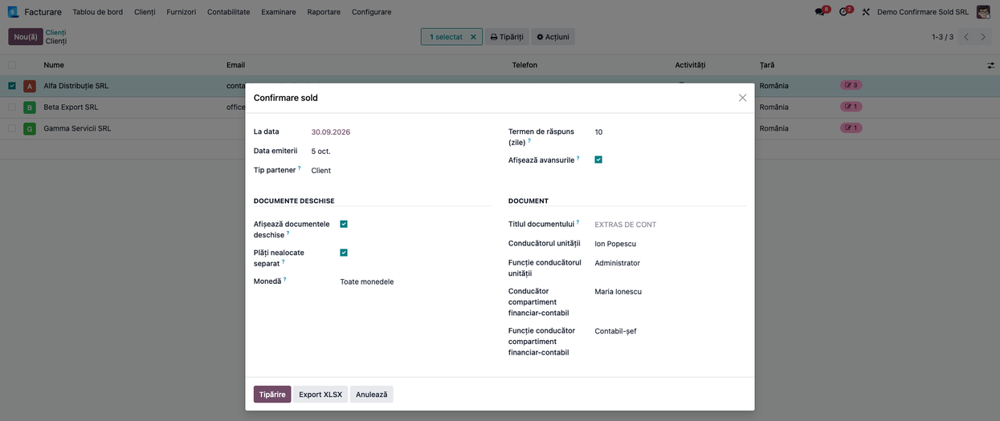
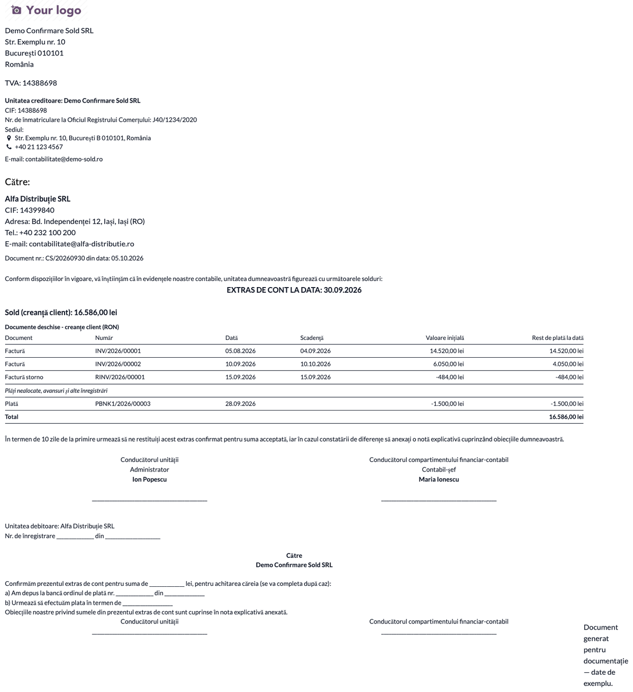
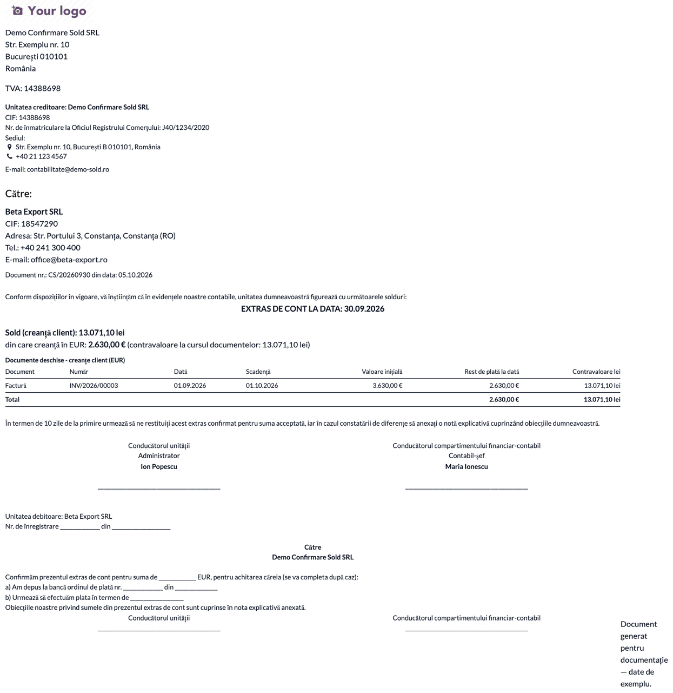
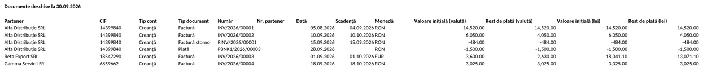
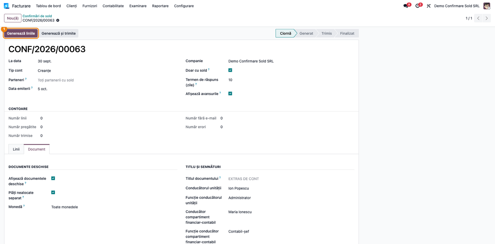
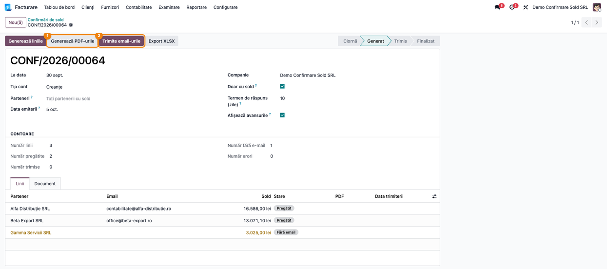
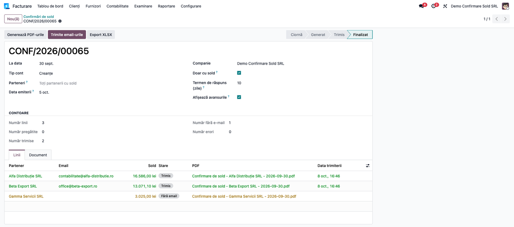

# Fișă Modul: Confirmarea soldurilor cu partenerii (Extras de cont)

**Modul:** `l10n_ro_balance_confirmation`
**Utilizator principal:** Contabil (clienți / furnizori), Contabil-șef
**Prioritate:** 🔴 Ridicată (confirmarea soldurilor cu terții face parte din inventarierea anuală a creanțelor și datoriilor)

---

## 1. Scop business

Modulul produce **extrasul de cont / confirmarea de sold** pe care unitatea îl trimite
partenerilor pentru a-și confirma reciproc soldurile la o dată. Documentul cuprinde:
- soldul creanței (client) sau al datoriei (furnizor) la data confirmării;
- **documentele deschise la acea dată**, cu restul de plată calculat la dată, nu azi;
- defalcarea pe monede, pentru partenerii cu documente în valută;
- semnăturile conducerii, cu nume și funcție;
- formularul de răspuns, pe care partenerul îl completează și îl returnează.

Se lucrează în două feluri:
- **tipărire la cerere**, pentru unul sau mai mulți parteneri aleși;
- **campanie pe email**: un document numerotat care generează câte o linie per partener, atașează
  PDF-ul și îl trimite, urmărind starea fiecărui partener (pregătit / fără email / trimis / eroare).

## 2. Bază legală și context

- **Extrasul de cont** este formular financiar-contabil din nomenclatorul aprobat prin
  **OMFP 2634/2015**. Îl semnează conducătorul unității și conducătorul compartimentului
  financiar-contabil, iar partenerul îl returnează confirmat sau cu obiecții. Ordinul permite
  entității să adapteze modelul grafic, cu păstrarea conținutului minim.
- La **clienți** extrasul îl emite unitatea creditoare (noi). La **furnizori** modulul emite același
  document ca **solicitare de confirmare a datoriei**: antetul arată atunci „Unitatea debitoare”
  pentru companie și „Unitatea creditoare” pentru partener.
- **Inventarierea creanțelor și datoriilor** (**OMFP 2861/2009**) se face prin confirmarea
  soldurilor cu terții, pe bază de extrase de cont. Data de referință este data inventarierii, de
  regulă data închiderii exercițiului. Soldurile neconfirmate și cele în litigiu se urmăresc
  separat.
- **Creanțele și datoriile în valută** se evaluează la sfârșitul fiecărei luni la cursul BNR
  (**OMFP 1802/2014, pct. 325**). Pe document, suma de confirmat este cea **în valută**. Suma în lei
  apare cu titlu informativ, ca **contravaloare la cursul documentelor**. Reevaluarea lunară se
  înregistrează global pe cont, nu pe partener, deci nu se regăsește în această sumă.

## 3. Utilizatori și roluri

- **Contabil clienți / furnizori** — tipărește confirmările la cerere și rulează campania pe email.
- **Contabil-șef** — stabilește semnatarii impliciți și controlează răspunsurile.

Drepturi necesare:
- **Campania pe email** (meniul „Confirmări de sold”) și **tipărirea la cerere** (dialogul
  „Confirmare sold”) — grupurile „Trimitere confirmări de sold” și „Poate tipări confirmare sold”.
  Le primesc automat:
  - cu **Contabilitate** (Enterprise): rolurile **Contabil** și **Administrator**;
  - doar cu **Facturare** (Community): rolul **Administrator**.
- Utilizatorii cu rolul **Facturare** simplu nu văd nici meniul campaniei, nici opțiunea din meniul
  Tipăriți. Dacă trebuie, grupurile de mai sus se bifează manual pe utilizator, în modul
  dezvoltator.

Roluri recomandate la testare: un administrator (configurează compania) și un contabil fără drept
de administrator (verifică accesul la tipărire și la campanie).

## 4. Conturi și date implicate

- **Clienți** (tip partener „Client”) — conturile **411x** și **413x** (în planul RO: 4111).
- **Furnizori** (tip partener „Furnizor”) — conturile **401x**, **403x** și **404x** (4011, 4012,
  4031, 4032, 4041, 4042).
- **Nu intră** în sold, deși unele au tipul creanță/datorie în planul RO:
  - **425** (avansuri personal), **461** (debitori diverși), **4424** (TVA de recuperat);
  - **421** (salarii), **4551** (asociați), **462** (creditori diverși), **463**, **44231**;
  - **4118** (clienți incerți sau în litigiu), **418** (facturi de întocmit), **408** (facturi
    nesosite).
  Clienții din 4118 nu primesc confirmare din modul; soldurile lor se urmăresc separat, ca litigii.
- **419 Clienți-creditori** și **409 Furnizori-debitori** — avansurile, afișate pe rânduri
  separate când e bifată opțiunea „Afișează avansurile”.
- Facturile, facturile storno, încasările și plățile postate până la data confirmării, cu
  reconcilierile lor.

Date minime pentru demo (cele din capturi, la 30.09.2026):

| Partener | Documente | Sold la 30.09.2026 |
|---|---|---|
| Alfa Distribuție SRL | factură 14.520 lei (05.08), încasată pe 03.10; factură 6.050 lei (10.09), încasată 2.000 pe 20.09; storno −484 lei (15.09); încasare nealocată 1.500 lei (28.09) | 16.586,00 lei |
| Beta Export SRL | factură 3.630 EUR (01.09), încasată 1.000 EUR pe 25.09; curs 4,97 lei/EUR | 2.630,00 EUR = 13.071,10 lei |
| Gamma Servicii SRL (fără email) | factură 3.025 lei (18.09) | 3.025,00 lei |

## 5. Configurare inițială

1. Instalați modulul `l10n_ro_balance_confirmation` pe o companie cu planul de conturi românesc.
2. Pe fișa companiei completați semnatarii impliciți (Pasul 1).
3. Verificați că partenerii care primesc campania pe email au adresa de email completată.
4. Verificați că utilizatorii care lucrează cu modulul au rolul potrivit (vezi secțiunea 3).
5. Verificați că există un server de email de ieșire configurat (**Setări → Tehnic → Servere de
   email de ieșire**; meniul Tehnic apare în modul dezvoltator). Dacă trimiterea eșuează, linia
   campaniei trece în „Eroare”, cu mesajul serverului.

## 6. Flux de utilizare

### Pasul 1 — Semnatarii impliciți pe companie

Accesați **Setări → Utilizatori și companii → Companii**, deschideți compania și alegeți fila
**„Confirmare sold”**. Completați numele și funcția pentru **conducătorul unității** (ex. Ion Popescu,
Administrator) și pentru **conducătorul compartimentului financiar-contabil** (ex. Maria Ionescu,
Contabil-șef). Valorile se preiau automat la fiecare tipărire și campanie, unde pot fi modificate.



### Pasul 2 — Tipărirea la cerere: parametrii documentului

Accesați **Facturare → Clienți → Clienți**, bifați unul sau mai mulți parteneri și alegeți din meniul **Tipăriți** opțiunea **„Confirmare sold”**. În dialog:
- **La data** — data confirmării (de regulă data inventarierii);
- **Data emiterii**, **Tip partener** (client / furnizor / ambele) și **Termen de răspuns (zile)**;
- **Afișează avansurile** — rândurile 419 / 409;
- **Documente deschise**:
  - **Afișează documentele deschise** — tabelul de sub sold;
  - **Plăți nealocate separat** — încasările și plățile nealocate apar într-un sub-tabel separat;
  - **Monedă** — toate monedele, doar moneda companiei sau o anumită monedă;
- **Document** — titlul (implicit „EXTRAS DE CONT”) și semnatarii, preluați de pe companie.

Apăsați **Tipărire** pentru PDF (un extras per partener) sau **Export XLSX** pentru tabelul
documentelor deschise ale tuturor partenerilor bifați.



### Pasul 3 — Citirea extrasului de cont

Înainte de a trimite documentul, **citiți-l pe ecran sau în PDF**:
1. **Găsiți** — rândul **„Sold (creanță client)”**, sub titlul „EXTRAS DE CONT LA DATA: …”, și
   tabelul **„Documente deschise”**. Pe fiecare rând: tipul și numărul documentului, data,
   scadența, valoarea inițială și **restul de plată la dată**. Sub facturi, rândul cursiv
   „Plăți nealocate, avansuri și alte înregistrări” separă încasările nealocate.
2. **Verificați** pe exemplul din captură:
   - factura INV/2026/00001 de 14.520 lei, încasată abia pe 03.10, apare **integral**;
   - la INV/2026/00002 restul este 4.050 lei, adică s-a scăzut doar încasarea de 2.000 lei din
     20.09;
   - storno-ul de −484 lei și încasarea nealocată de −1.500 lei apar cu minus;
   - **Totalul tabelului (16.586,00 lei) este egal cu soldul** de deasupra;
   - sub tabel apar semnăturile cu numele și funcția din Pasul 1, iar în formularul de răspuns
     „Unitatea debitoare” este partenerul.
3. **Treceți mai departe** — abia după aceste verificări tipăriți sau trimiteți documentul.



### Pasul 4 — Partener cu documente în valută

Pentru un partener cu documente în EUR, documentul arată:
- sub sold, rândul **„din care creanță în EUR: 2.630,00 € (contravaloare la cursul documentelor:
  13.071,10 lei)”**;
- o secțiune **„Documente deschise - creanțe client (EUR)”** cu sumele în euro și coloana
  **„Contravaloare lei”**.

**Verificați:**
- 3.630 € − 1.000 € încasați pe 25.09 = 2.630 €;
- contravaloarea în lei este a restului, **la cursul facturii** (4,97 lei/EUR în demo), nu la cursul
  BNR de la 30.09. Dacă la 30.09 s-a înregistrat reevaluarea lunară, diferența de curs apare global
  în balanța contului 4111, nu pe partener;
- în formularul de răspuns moneda de confirmat este **EUR**.

Dacă un partener are documente în mai multe monede, câmpul de monedă din formularul de răspuns
rămâne de completat de partener. Cu filtrul **Monedă = O anumită monedă**, documentul conține doar
documentele în acea valută.



### Pasul 5 — Exportul XLSX al documentelor deschise

Din același dialog, butonul **Export XLSX** descarcă un tabel cu câte un rând per document deschis,
pentru toți partenerii bifați. Coloanele sunt: partener, CIF, tip cont, tip document, număr, număr
partener, dată, scadență, monedă, valoare inițială și rest de plată (în valută și în lei).
Fișierul ajută la urmărirea răspunsurilor și la situația soldurilor neconfirmate. Separatorii de
mii și de zecimale urmează setările regionale ale programului cu care se deschide fișierul.
**Verificați** că suma coloanei „Rest de plată (lei)” pe fiecare partener este egală cu soldul din
extrasul lui de cont.



### Pasul 6 — Campania pe email: opțiunile documentului

Accesați **Facturare → Clienți → Confirmări de sold** și apăsați **Nou(ă)**. Completați:
- **La data** și **Tip cont** (creanțe / datorii / ambele);
- opțional **Parteneri** — lăsați gol („Toți partenerii cu sold”) pentru toți partenerii cu sold la
  dată;
- **Doar cu sold**, ca să omiteți partenerii cu sold zero.

În fila **Document** setați aceleași opțiuni ca la tipărire: documente deschise, monedă, titlu și
semnatari. Apăsați **Generează liniile** (sau **Generează și trimite**, pentru toți pașii deodată).



### Pasul 7 — Liniile campaniei

După generare, fila **Linii** are câte un rând per partener, cu **soldul la dată** și starea:
**Pregătit** (are email) sau **Fără email**. Contoarele de deasupra sumarizează campania.

**Verificați:**
- soldurile corespund extraselor din pașii 3–4. Soldul liniei e în lei (la Beta 13.071,10 lei);
  suma de confirmat în valută (2.630 €) se vede pe PDF;
- partenerii fără email sunt marcați. După **Generează PDF-urile**, extrasul lor se descarcă din
  coloana **PDF** a liniei și se trimite pe altă cale.

Apăsați apoi **Generează PDF-urile** și **Trimite email-urile**.



### Pasul 8 — Campania trimisă

După trimitere, fiecare linie are:
- starea **Trimis**;
- PDF-ul atașat („Confirmare de sold - <partener> - <dată>.pdf”);
- **data trimiterii**.

Campania trece în **Finalizat** când toți partenerii cu email au primit documentul. O linie cu
**Eroare** păstrează mesajul serverului de email. După corectare (serverul de email, adresa
partenerului sau emailul completat ulterior pe un partener „Fără email”), apăsați din nou
**Trimite email-urile**: se trimit liniile cu eroare și cele al căror partener are acum email. **Export XLSX** din
campanie descarcă documentele deschise ale tuturor partenerilor din campanie.



### Note de monografie și raportare

Modulul **nu generează note contabile**. Citește înregistrările existente la data confirmării:
- factură client: `Dr 4111 = Cr 70x + Cr 4427` → rând pozitiv în tabel;
- factură storno: `Dr 4111 = Cr 70x + Cr 4427`, cu minus → rând negativ;
- încasare: `Dr 5121 = Cr 4111` → scade restul facturii doar dacă e reconciliată cu ea și ambele
  documente sunt datate până la data confirmării; nereconciliată, apare ca rând negativ la
  „Plăți nealocate”;
- încasare în valută: `Dr 5124 = Cr 4111`, la cursul zilei încasării. La reconcilierea cu factura,
  diferența de curs se înregistrează `Dr 665 = Cr 4111` (pierdere) sau `Dr 4111 = Cr 765`
  (câștig). Restul facturii rămâne în lei la cursul facturii;
- avans de la client: factura de avans `Dr 4111 = Cr 419 + Cr 4427`, apoi încasarea
  `Dr 5121 = Cr 4111` → rândul separat „Avansuri primite (419)” arată avansul **fără TVA** și nu
  intră în soldul 4111;
- factură furnizor: `Dr 6xx/3xx + Dr 4426 = Cr 4011` → la tipul partener „Furnizor”, sumele apar
  pozitive ca datorie.

Regula de control: **soldul confirmat = suma resturilor de plată din tabel**, pe fiecare monedă.

## 7. Legături cu alte module / declarații

| Modul | Rol |
|---|---|
| `account` | facturi, plăți și reconcilieri; sursa soldurilor și a resturilor de plată |
| `l10n_ro` | planul de conturi românesc (4111, 401, 409, 419) |
| `mail` | șablonul de email bilingv și trimiterea campaniei |
| `l10n_ro_inventory_register` | registrul-inventar, unde se reflectă soldurile inventariate |

**Ce e automat:**
- soldul și restul de plată la dată, inclusiv pentru facturile plătite ulterior;
- gruparea pe monede și contravaloarea în lei;
- semnatarii preluați de pe companie;
- limba documentului (română pentru partenerii din România);
- generarea liniilor, a PDF-urilor și trimiterea pe email cu urmărirea stării.

Reevaluarea valutară lunară (`l10n_ro_currency_revaluation`) se înregistrează global pe cont, fără
partener. Prin urmare, nu modifică soldul în lei din extrasul de cont, care rămâne la cursul
documentelor.

**Ce rămâne manual:**
- configurarea semnatarilor și a adreselor de email;
- trimiterea extrasului către partenerii fără email;
- urmărirea răspunsurilor și a soldurilor neconfirmate sau în litigiu;
- regularizarea diferențelor constatate.

## 8. Verificări pentru consultant

- [ ] Fila „Confirmare sold” pe companie păstrează numele și funcțiile semnatarilor.
- [ ] Dialogul „Confirmare sold” apare în meniul **Tipăriți** din lista de clienți pentru un utilizator cu rolul Contabil (Enterprise) sau Administrator facturare (Community) și preia semnatarii de pe companie.
- [ ] Un sold pe 461 al aceluiași partener nu apare în extras și nu modifică soldul.
- [ ] O factură achitată **după** data confirmării apare integral în tabel.
- [ ] O încasare parțială **înainte** de dată reduce restul de plată; una **după** dată nu.
- [ ] Factura storno și încasarea nealocată apar cu minus; încasarea apare la „Plăți nealocate”.
- [ ] **Totalul tabelului = soldul** afișat, pe fiecare monedă.
- [ ] La un partener cu documente în EUR: suma în EUR, contravaloarea în lei și moneda EUR pe rândul de confirmare.
- [ ] Filtrul „Monedă” restrânge documentul la moneda aleasă.
- [ ] Titlul modificat apare pe document; gol, apare „EXTRAS DE CONT”.
- [ ] Un partener din România cu limba engleză pe fișă primește totuși documentul în română.
- [ ] Exportul XLSX are câte un rând per document deschis, iar resturile în lei însumează soldul.
- [ ] Campania generează câte o linie per partener cu sold; partenerii fără email sunt marcați „Fără email”.
- [ ] După trimitere, liniile au starea „Trimis”, PDF atașat și data trimiterii.
- [ ] Cu serverul de email oprit, linia trece în „Eroare” (nu „Trimis”), cu mesajul serverului.
- [ ] Un partener „Fără email” căruia i se completează adresa primește extrasul la o nouă apăsare pe „Trimite email-urile”.

## 9. Mesaje de eroare frecvente

| Mesaj / Simptom | Cauză | Remediere |
|---|---|---|
| „Nu a fost selectat niciun partener pentru confirmarea de sold.” | Dialogul a fost deschis fără parteneri bifați | Bifați partenerii în listă, apoi deschideți „Confirmare sold” |
| „Niciun partener nu este pregătit să primească confirmarea pe email.” | Nicio linie nu are email sau toate sunt deja trimise | Completați emailul partenerilor și regenerați liniile |
| „Selectați moneda documentelor de confirmat.” | Monedă = „O anumită monedă”, fără moneda aleasă | Alegeți moneda în câmpul „Moneda documentelor” |
| „Generați mai întâi liniile.” | Export XLSX pe o campanie fără linii | Apăsați „Generează liniile” |
| „Confirmare sold” lipsește din meniul Tipăriți | Utilizatorul nu are rolul potrivit | Acordați rolul sau grupurile pe utilizator (secțiunea 3) |
| Soldul diferă de fișa partenerului pe 461 / 462 / 425 | Pe extras intră doar conturile comerciale (411/413, 401/403/404) | Normal: celelalte conturi nu se confirmă prin extrasul de cont |
| Linie în starea „Eroare”, cu mesajul serverului de email | Server de email neconfigurat sau adresă invalidă | Verificați serverul și adresa, apoi „Trimite email-urile” |
| Soldul în lei diferă de balanța 4111 după reevaluare | Reevaluarea lunară e înregistrată global, fără partener | Normal: extrasul arată contravaloarea la cursul documentelor; suma confirmată e cea în valută |
| Soldul diferă de fișa partenerului de azi | Documentul arată soldul la data confirmării, nu azi | Comparați cu fișa partenerului filtrată până la aceeași dată |

## 10. Capturi de ecran

Capturile din `static/description/` se generează automat din `tests/test_screenshots.py`, cu
mixinul `ScreenshotCase` din `l10n_ro_doc_screenshots` (HttpCase + Playwright, import defensiv).
Rulează în română, pe o companie cu planul de conturi românesc. Extrasele de cont sunt randarea HTML
a raportului PDF. Exportul XLSX e randat ca pagină tipărită.

Lista capturilor (în ordinea fluxului):
1. `01_companie_semnatari.png` — fila „Confirmare sold” pe companie, cu semnatarii impliciți
2. `02_wizard_tiparire.png` — dialogul „Confirmare sold” cu parametrii documentului
3. `03_extras_cont_pdf.png` — extrasul de cont: sold, documente deschise, semnături, formular de răspuns
4. `04_extras_cont_valuta_pdf.png` — extrasul unui client cu factură în EUR
5. `05_export_xlsx.png` — exportul XLSX al documentelor deschise
6. `06_campanie_optiuni.png` — campanie nouă, fila „Document”
7. `07_campanie_linii.png` — liniile generate, cu soldul la dată și starea
8. `08_campanie_trimisa.png` — campania trimisă: stări, PDF atașat, data trimiterii

Regenerare:
```
./odoo/odoo-bin -c odoo.conf -d test19 -i l10n_ro_balance_confirmation,l10n_ro_doc_screenshots \
    --test-tags=fise_screenshots --stop-after-init
```

## 11. Observații pentru manual

- Subliniați că documentul arată situația **la data confirmării**: o factură plătită ulterior
  apare integral, iar o plată de după dată nu se scade. Diferențele față de fișa partenerului de azi
  sunt normale.
- Regula de control pentru operator: **totalul tabelului este egal cu soldul**. Dacă nu e egal,
  documentul nu se trimite.
- La valută, partenerul confirmă suma **în valută**. Contravaloarea în lei e informativă, la cursul
  documentelor, fără reevaluarea lunară.
- Avansurile 419/409 sunt conturi distincte de 4111/401: apar pe rânduri separate, nu „din care”.
- Răspunsurile partenerilor (confirmat / neconfirmat / cu obiecții) se urmăresc în afara
  modulului. Semnarea electronică a răspunsului este propusă în ROADMAP (E1).
- Pentru inventarierea anuală, campania se rulează la data închiderii exercițiului, iar exportul
  XLSX servește ca bază pentru situația soldurilor neconfirmate.
