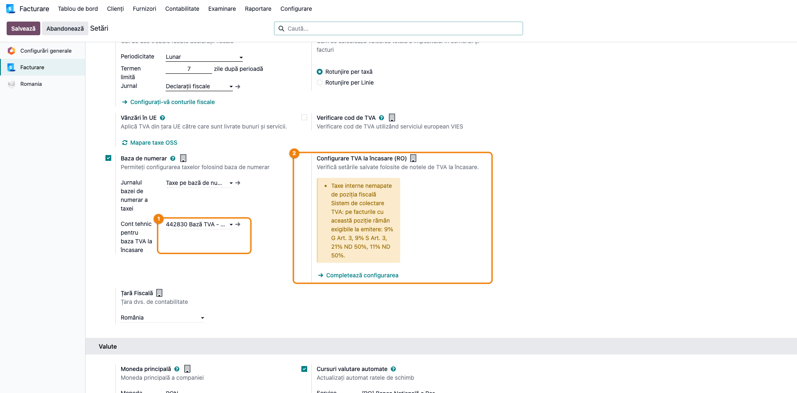
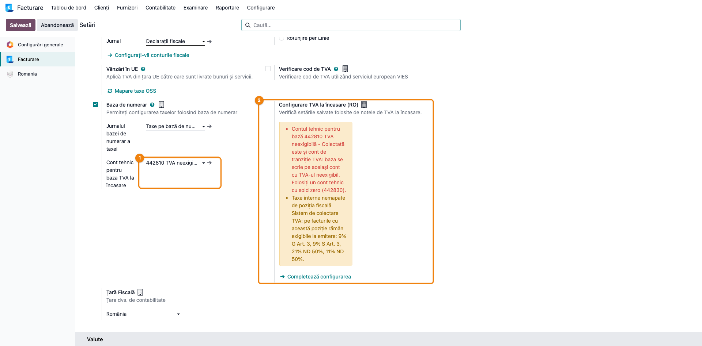
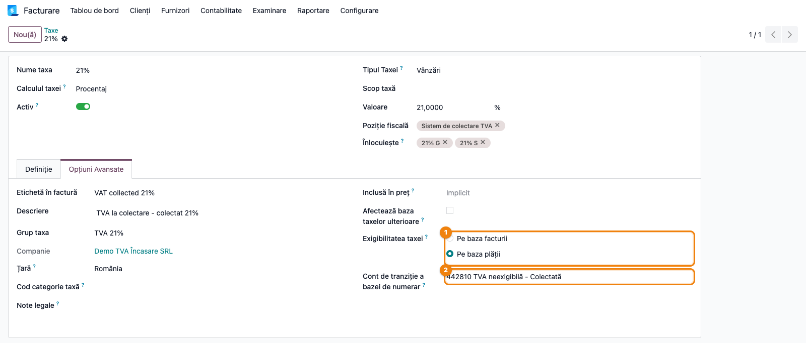
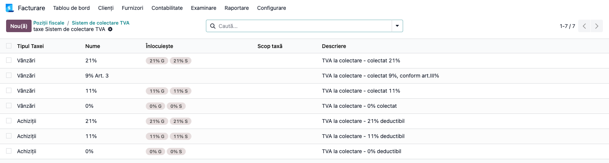
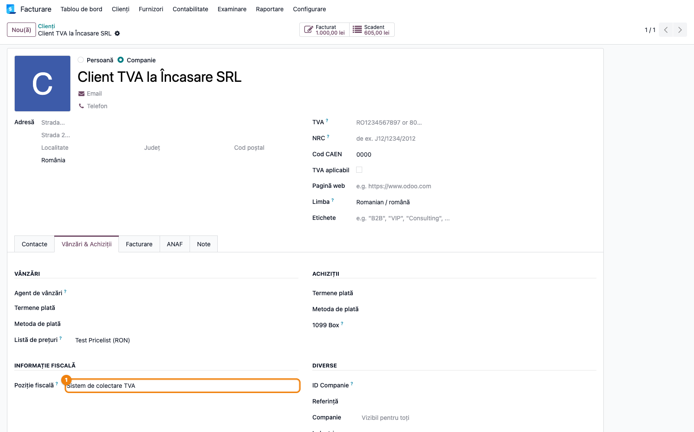
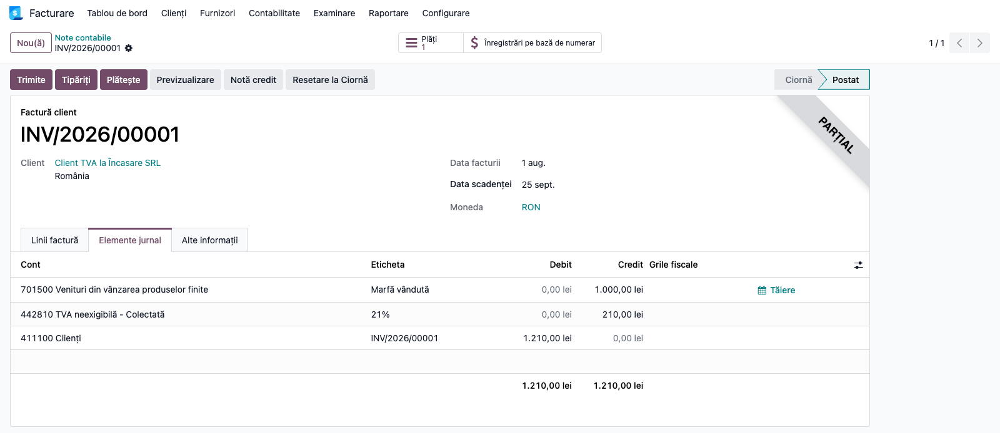
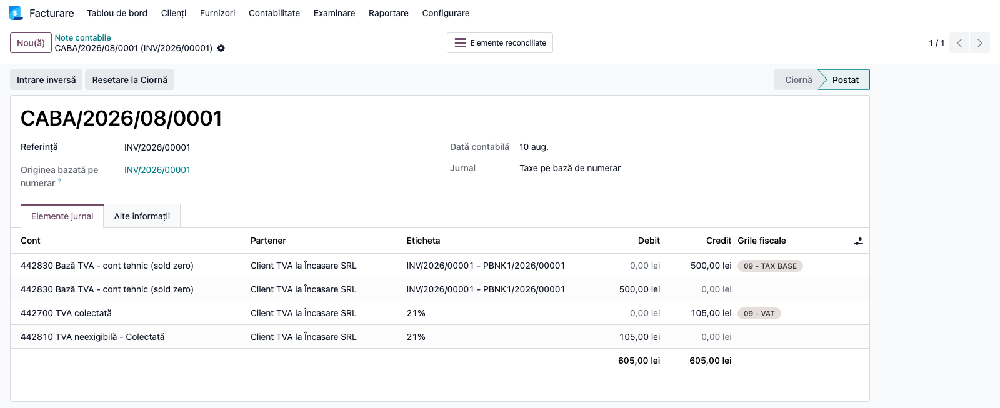
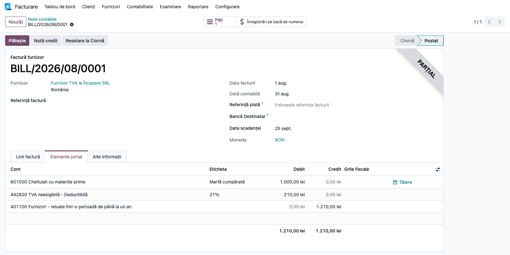
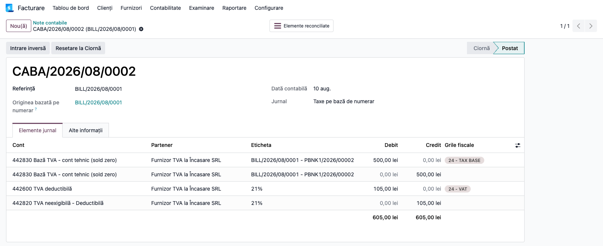
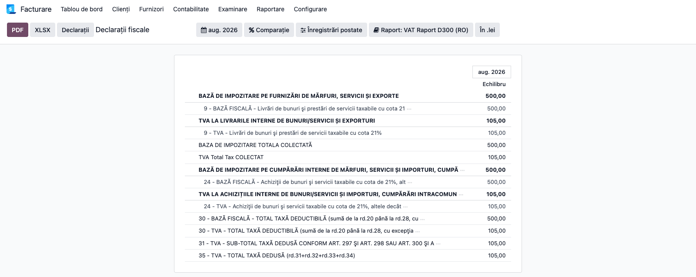

# Fișă Modul: TVA la încasare (CABA)

**Modul:** `l10n_ro_caba`
**Capitol manual:** Cap 3.6 — TVA la Încasare (4428)
**Utilizator principal:** Contabil, Manager Contabilitate
**Prioritate:** 🔴 Ridicată
**FR:** FR-16
**Poziție plan:** D3

---

## 1. Scop business

Firmele care aplică sistemul de TVA la încasare (sau care cumpără de la furnizori înregistrați în
acest sistem) nu declară TVA-ul la emiterea facturii, ci la încasarea ori plata ei. Până atunci,
TVA-ul stă în contul **4428 „TVA neexigibilă"**: 44281 pentru TVA colectată, 44282 pentru TVA
deductibilă.

Odoo are mecanismul nativ pentru asta, numit **CABA** — de la ***Ca**sh **Ba**sis*, „bază de
numerar": taxa e exigibilă la plată, nu la facturare. CABA e și codul jurnalului în care Odoo
înregistrează, la fiecare încasare sau plată, nota care mută TVA-ul din 4428 în 4427 / 4426.

Planul de conturi RO din Odoo aduce deja taxele la încasare (`TVA la colectare ...`), poziția
fiscală **Sistem de colectare TVA** și jurnalul CABA. Lasă însă nesetate câteva lucruri, iar
setările sunt împrăștiate și prost traduse. Modulul:

- setează automat, la instalare și la încărcarea planului RO, ce a rămas gol: bifa **Baza de
  numerar**, **jurnalul CABA** și **contul tehnic pentru baza impozabilă 442830**;
- nu suprascrie nicio valoare deja aleasă de contabil;
- adaugă în **Setări → Contabilitate → Taxe** o verificare a configurării, cu buton de completare;
- redenumește câmpul „Cont de primire fiscală de bază" (traducere greșită din nucleu) în
  **„Cont tehnic pentru baza TVA la încasare"**, cu explicație.

Modulul **nu depinde** de OCA `l10n_ro_vat_on_payment`. Acela verifică partenerii în lista ANAF
și pune singur poziția fiscală pe factură; se poate instala în paralel. Fără el, poziția fiscală
se pune manual pe partener (vezi pasul 2).

---

## 2. Noțiuni și abrevieri

| Termen | Ce înseamnă |
|---|---|
| **TVA la încasare** | Sistemul din art. 282 alin. (3)–(8) Cod fiscal: TVA-ul devine exigibil la încasarea facturii, nu la emiterea ei. Pentru cumpărător, deducerea se amână până la plată. |
| **CABA** | De la *Cash Basis* („bază de numerar"): mecanismul Odoo pentru taxele exigibile la plată. Tot CABA se numește jurnalul în care Odoo pune notele de exigibilitate. |
| **Exigibilitate** | Momentul în care statul poate pretinde TVA-ul și trebuie declarat în D300. În Odoo, câmpul **Exigibilitatea taxei**: *Pe baza facturii* (obișnuit) sau *Pe baza plății* (la încasare). |
| **TVA neexigibilă (4428)** | TVA facturată, dar încă nedeclarabilă. **44281** — colectată (la vânzare), **44282** — deductibilă (la cumpărare). Se golește la fiecare încasare sau plată. |
| **Cont de tranziție a bazei de numerar** | Contul de pe taxa la încasare în care stă TVA-ul până la plată: 44281 sau 44282. |
| **Cont tehnic pentru bază (442830)** | Contul pe care nota CABA scrie baza impozabilă, o dată pe debit și o dată pe credit, doar pentru rândurile de bază din D300. Are mereu sold zero. |
| **Nota CABA** / **nota de exigibilitate** | Nota creată automat la reconcilierea unei încasări sau plăți cu factura: mută TVA-ul proporțional din 4428 în 4427 / 4426. |
| **Poziție fiscală** | Regula Odoo care înlocuiește pe factură o taxă cu alta. **Sistem de colectare TVA** înlocuiește TVA-ul obișnuit cu cel la încasare. |
| **Plată parțială** | Încasarea unei părți din factură. TVA-ul exigibil e proporțional: suma × cotă / (100 + cotă), ex. 605 × 21/121 = 105. |
| **D300** | Decontul de TVA depus la ANAF. |
| **D406 (SAF-T)** | Fișierul standard de control fiscal: registrul jurnal și balanța, cu toate conturile, inclusiv 442830. |
| **ANAF** | Agenția Națională de Administrare Fiscală; publică lista contribuabililor în sistemul TVA la încasare. |
| **FR-16** | Cerința din catalogul suitei `l10n_ro_ent` pentru TVA la încasare. |

---

## 3. Bază legală

- **Codul fiscal art. 282 alin. (3)–(8)** — sistemul de TVA la încasare; exigibilitatea la data
  încasării, fiecare încasare incluzând proporțional și taxa aferentă. Plafonul de aplicare:
  5.000.000 lei în perioada 1 martie – 31 decembrie 2026 și 5.500.000 lei din 1 ianuarie 2027
  (OUG 8/2026).
- **Codul fiscal art. 297 alin. (2)–(3)** — deducerea amânată la plată, când furnizorul sau firma
  proprie aplică sistemul.
- **Codul fiscal art. 282 alin. (6)** — operațiunile excluse (regulile generale de exigibilitate).
- **Codul fiscal art. 319 alin. (20) lit. p)** — mențiunea „TVA la încasare" pe factură.
- **Normele metodologice (HG 1/2016), titlul VII, pct. 26** — momentul încasării (data din extras),
  compensarea și cesiunea de creanță, alegerea liniilor încasate la plăți parțiale.
- **OMFP 1802/2014** — funcțiunea contului 4428 „TVA neexigibilă" (bifuncțional).

---

## 4. Utilizatori și roluri

| Rol | Acțiune |
|-----|---------|
| Manager Contabilitate | Verifică și completează configurarea din Setări; decide contul tehnic pentru bază |
| Contabil | Pune poziția fiscală pe partenerii în sistem; emite facturi, înregistrează încasări și plăți |
| Consultant implementare | Verifică maparea taxelor și notele CABA la punerea în funcțiune |

Configurarea cere grupul **Contabilitate / Administrator** (`account.group_account_manager`).

---

## 5. Configurare inițială

### 5.1 Verificarea din Setări

Meniu: **Contabilitate → Configurare → Setări**, secțiunea **Taxe**.

Blocul nativ **Baza de numerar** conține jurnalul și contul tehnic. Imediat sub el, modulul
adaugă blocul **Configurare TVA la încasare (RO)**, vizibil doar pe companiile cu țara fiscală
România:

- verde — configurarea e completă;
- galben, cu lista problemelor — ce lipsește sau e greșit (vezi secțiunea 8);
- butonul **Completează configurarea** setează doar câmpurile goale.

Verificarea citește valorile **salvate** pe companie: după o modificare, salvați și reveniți.



Cu o greșeală de configurare, de exemplu contul tehnic pus pe 44281, verificarea o arată cu roșu:



| Câmp (interfață) | Câmp tehnic | Valoare recomandată |
|---|---|---|
| Baza de numerar | `tax_exigibility` | bifat |
| Jurnalul bazei de numerar a taxei | `tax_cash_basis_journal_id` | jurnalul **CABA** „Taxe pe bază de numerar" |
| Cont tehnic pentru baza TVA la încasare | `account_cash_basis_base_account_id` | **442830 Bază TVA - cont tehnic (sold zero)** |

### 5.2 Contul tehnic pentru bază: de ce 442830 și nu 473

La fiecare încasare, nota CABA conține pe lângă TVA și **baza impozabilă**, de două ori, o dată pe
debit și o dată pe credit, cu aceeași sumă. Liniile există doar ca să ducă baza în rândurile de
bază din D300; soldul lor e mereu zero. Contul pe care se scriu e câmpul de mai sus. Dacă e gol,
Odoo le scrie pe contul de venit/cheltuială al facturii (707, 607, 371...), care capătă rulaje
debit = credit fără nicio legătură cu activitatea.

Opinia expertului contabil (Pacioli) a comparat cele două variante folosite până acum în casă:
**473** „Decontări din operații în curs de clarificare" și un analitic al lui 4428 (**442830**).
Niciuna nu se potrivește perfect cu funcțiunea contului, pentru că baza impozabilă nu e nici TVA,
nici o sumă de clarificat. Varianta care face mai puțin rău e **442830**:

| Criteriu | 473 | 442830 (analitic 4428) |
|---|---|---|
| Funcțiunea contului (OMFP 1802/2014) | 473 ține sume „în curs de clarificare", care cer cercetări suplimentare. Liniile de bază nu au nimic de clarificat: contul e folosit în afara funcțiunii. | 4428 ține TVA-ul neexigibil. Baza nu e TVA, dar ține de același regim fiscal. |
| La control | Rulaje mari pe 473 atrag cereri de justificare: 473 înseamnă „ceva neclarificat". | Rulajul unui analitic „bază TVA, cont tehnic" lângă 44281/44282 se explică singur. |
| Balanță și SAF-T (D406) | Liniile tehnice se amestecă cu sumele reale în curs de clarificare de pe 473. | Crește rulajul sinteticului 4428, dar TVA-ul real rămâne izolat pe 44281/44282, unde se face reconcilierea. |
| Alte module care folosesc același câmp | Aceeași problemă și pentru DVI și TVA nedeductibil. | Aceeași convenție ca OCA (`l10n_ro_nondeductible_vat`), deci o singură regulă în toate modulele. |

Conturile în afara bilanțului (clasa 8) nu sunt o opțiune: Odoo nu permite amestecarea lor cu
conturi bilanțiere în aceeași notă.

Ce **nu** trebuie pus acolo: **44281** sau **44282**. Acelea sunt conturile de tranziție ale
taxelor, cu TVA-ul real neexigibil; baza s-ar amesteca cu TVA-ul pe același cont. Verificarea din
Setări marchează acest caz cu roșu.

Modulul folosește 442830 dacă există deja (de exemplu creat după convenția OCA) și îl creează doar
dacă lipsește, ca **Datorii curente**, nereconciliabil. La implementare, verificați ca 442830 să
fie mapat pe contul standard 4428 în nomenclatorul SAF-T (D406).

### 5.3 Taxele și poziția fiscală

Meniu: **Contabilitate → Configurare → Taxe**. Planul RO aduce taxele la încasare:

| Taxă | Tip | Exigibilitatea taxei | Cont de tranziție a bazei de numerar |
|---|---|---|---|
| TVA la colectare - colectat 21% / 11% / ... | Vânzări | Pe baza plății | 44281 |
| TVA la colectare - 21% deductibil / 11% / ... | Achiziții | Pe baza plății | 44282 |

Exigibilitatea și contul de tranziție sunt în fila **Opțiuni Avansate** a taxei.

Meniu: **Contabilitate → Configurare → Poziții fiscale → Sistem de colectare TVA**. Poziția
înlocuiește pe factură taxele obișnuite cu cele la încasare (TVA colectat 21% → TVA la colectare
21% etc.). Nu se aplică automat (e fără „Detectare automată").



Taxele pe care le înlocuiește poziția se văd din butonul **Taxe** al poziției fiscale, în coloana
**Înlocuiește**:



---

## 6. Flux de utilizare

### Pasul 1 — Accesare și verificare

**Contabilitate → Configurare → Setări**, secțiunea **Taxe**. Dacă verificarea nu e verde, apăsați
**Completează configurarea**, apoi rezolvați manual ce a rămas în listă.

### Pasul 2 — Poziția fiscală pe parteneri

**Contabilitate → Clienți → Clienți** (sau **Contabilitate → Furnizori → Furnizori**), fila
**Vânzări & Achiziții**, grupul **Informație fiscală**, câmpul **Poziție fiscală** = **Sistem de
colectare TVA**:

- **firma proprie aplică TVA la încasare** — pe toți clienții și furnizorii interni (vânzările și
  achizițiile ei sunt toate la încasare, cu excepțiile de la secțiunea 7);
- **doar furnizorul aplică TVA la încasare** — pe acel furnizor.



Cu OCA `l10n_ro_vat_on_payment` instalat, poziția se pune singură pe factură, după lista ANAF la
data facturii.

### Pasul 3 — Factura de vânzare

Factura: 1.000 lei + TVA 21% = 1.210 lei, cu poziția **Sistem de colectare TVA**. Taxa de pe linie
devine **TVA la colectare - colectat 21%**. Pe factură trebuie să apară mențiunea „TVA la
încasare" (art. 319 alin. (20) lit. p)).

| Cont | Debit | Credit |
|---|---:|---:|
| 4111 Clienți | 1.210 | |
| 707 Venituri din vânzarea mărfurilor | | 1.000 |
| 44281 TVA neexigibilă colectată | | 210 |

În fila **Elemente jurnal**, TVA-ul apare pe 44281, nu pe 4427. Contul de venit depinde de produs
(în captură, 701 al produsului de test):


### Pasul 4 — Încasare parțială

Încasare 605 lei (extras bancar sau **Înregistrare plată** pe factură, apoi reconciliere). La
reconciliere, Odoo creează în jurnalul **CABA** nota de exigibilitate, proporțional:
605 × 21/121 = 105 lei TVA, bază 500 lei.

| Notă | Cont | Debit | Credit |
|---|---|---:|---:|
| Încasare | 5121 / 4111 | 605 | 605 |
| CABA — TVA | 44281 / 4427 | 105 | 105 |
| CABA — bază (tehnic) | 442830 / 442830 | 500 | 500 |

La încasarea restului se repetă aceleași note; la final, 44281 are sold zero pentru factură.

Nota se deschide din butonul **Înregistrări pe bază de numerar** de pe factură:



### Pasul 5 — Achiziția

Factură de la un furnizor cu **Sistem de colectare TVA**: 1.000 lei + 210 TVA.

| Moment | Cont | Debit | Credit |
|---|---|---:|---:|
| Factura | 371 (sau 607 / 6xx) | 1.000 | |
| | 44282 TVA neexigibilă deductibilă | 210 | |
| | 401 Furnizori | | 1.210 |
| Plată 605 | 401 / 5121 | 605 | 605 |
| CABA — deducere | 4426 / 44282 | 105 | 105 |
| CABA — bază (tehnic) | 442830 / 442830 | 500 | 500 |





### Pasul 6 — Verificarea în D300

Baza și TVA-ul intră în decontul **perioadei încasării sau plății**, pe **rândurile generale** de
livrări / achiziții taxabile cu cota respectivă, proporțional cu suma încasată. Nu există rânduri
principale separate pentru TVA la încasare; decontul are doar câmpuri informative pentru TVA
neexigibilă. Din exemplu, în luna încasării și a plății: rândul 9 (livrări 21%) — bază 500, TVA 105;
rândul 24 (achiziții 21%) — bază 500, TVA 105.

Meniu: **Contabilitate → Raportare → Declarații fiscale**, raportul **VAT Raport D300 (RO)**, luna
încasării (în captură, cu liniile goale ascunse):



---

## 7. Legături cu alte module / declarații

| Modul / declarație | Legătură |
|---|---|
| D300 (`l10n_ro_anaf_d300`) | Rândurile de bază și TVA se alimentează din grilele de pe nota CABA, în luna încasării. |
| `l10n_ro_vat_on_payment_lock` | Blochează desfacerea reconcilierii dacă nota CABA e într-o perioadă deja declarată. |
| OCA `l10n_ro_vat_on_payment` | Opțional: lista ANAF și poziția fiscală automată pe factură. |
| OCA `l10n_ro_dvi`, `l10n_ro_nondeductible_vat` | Folosesc același cont tehnic pentru liniile lor de bază. |
| SAF-T (D406) | 442830 apare în balanță și în registrul jurnal cu rulaje egale; trebuie mapat pe 4428. |
| Jurnale TVA (`l10n_ro_account_vat_journal`) | Raportează TVA-ul la încasare în luna încasării. |

**Operațiuni excluse** (art. 282 alin. (6)): pe ele se aplică regulile generale chiar dacă firma e
în sistem, deci nu primesc taxa la încasare:

- taxarea inversă (art. 307 alin. (2)–(6) și art. 331);
- operațiunile scutite de TVA;
- regimurile speciale din art. 311–313 (agenții de turism, second-hand, artă, aur de investiții);
- livrările către persoane afiliate;
- pe achiziții: importul, achizițiile intracomunitare și taxarea inversă nu amână deducerea
  (art. 297 alin. (3)) — TVA-ul din DVI nu trece prin 44282.

Poziția fiscală mapează doar taxele interne taxabile, deci aceste operațiuni rămân pe regulile
generale dacă au taxele lor proprii. Livrările către persoane afiliate nu se pot deosebi după taxă:
pentru acești clienți nu puneți poziția fiscală.

**Ieșirea din sistem:** facturile emise înainte rămân la încasare, oricând s-ar încasa (art. 282
alin. (7) lit. b)). Soldul 4428 nu se reclasifică automat.

**Facturi neîncasate:** nu există un termen după care TVA-ul devine exigibil automat; soldul rămâne
pe 4428 până la încasare, compensare sau cesiune, ori până la o ajustare după art. 287.

---

## 8. Mesaje de eroare frecvente

Mesajele apar în blocul de verificare din Setări.

| Mesaj | Cauză | Remediere |
|---|---|---|
| Baza de numerar nu e activată | Bifa **Baza de numerar** e debifată | Bifați-o sau **Completează configurarea** |
| Nu e setat jurnalul bazei de numerar | Jurnalul CABA lipsește din setări | Alegeți jurnalul CABA sau **Completează configurarea** |
| Taxe la încasare fără cont de tranziție | O taxă „Pe baza plății" nu are cont 4428 | Completați contul în fila **Opțiuni Avansate** a taxei |
| Contul tehnic pentru bază este și cont de tranziție | Pe câmp e pus 44281 / 44282 | Puneți 442830 |
| Nu e setat contul tehnic pentru bază | Câmpul e gol, baza rulează pe 7xx / 6xx | **Completează configurarea** (setează 442830) |
| Contul tehnic pentru bază este un cont de venituri/cheltuieli | Pe câmp e un cont de clasa 6 / 7 | Puneți 442830 |
| Taxe interne nemapate de poziția fiscală | Taxe taxabile fără echivalent la încasare | Pe factură rămân exigibile la emitere. Planul RO nu mapează 9% art. 3 și TVA nedeductibil 50%; dacă le folosiți în sistem, creați taxa la încasare și legați-o de poziție |

---

## 9. Capturi de ecran

Generate reproductibil de `tests/test_screenshots.py` (companie RO, plan RO, date de test):

| # | Fișier | Ce arată |
|---|---|---|
| 1 | `01_setari_caba.png` | Setări → Taxe: Baza de numerar, jurnalul CABA, contul tehnic 442830 și verificarea RO |
| 2 | `02_setari_caba_eroare.png` | Verificarea cu contul tehnic pus greșit pe 44281 |
| 3 | `03_taxa_tva_incasare.png` | Taxa la încasare 21%, fila Opțiuni Avansate |
| 4 | `04_pozitie_fiscala.png` | Taxele poziției Sistem de colectare TVA și ce înlocuiesc |
| 5 | `05_partener_pozitie_fiscala.png` | Partenerul cu poziția fiscală |
| 6 | `06_factura_vanzare.png` | Factura de vânzare, elemente jurnal (44281) |
| 7 | `07_nota_caba_vanzare.png` | Nota CABA după încasarea parțială |
| 8 | `08_factura_achizitie.png` | Factura de achiziție, elemente jurnal (44282) |
| 9 | `09_nota_caba_achizitie.png` | Nota CABA după plata parțială |
| 10 | `10_d300_luna_incasarii.png` | D300 în luna încasării: rândurile 9 și 24 |

Regenerare:

```bash
./odoo/odoo-bin -c odoo.conf -d <db> -i l10n_ro_caba,l10n_ro_doc_screenshots,account_reports \
    --test-tags=/l10n_ro_caba:TestL10nRoCabaScreenshots --stop-after-init
```
