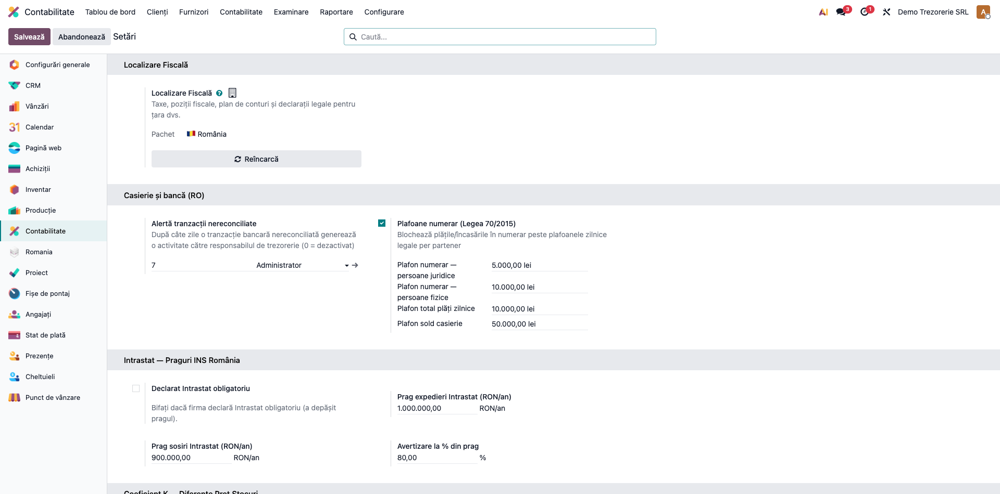
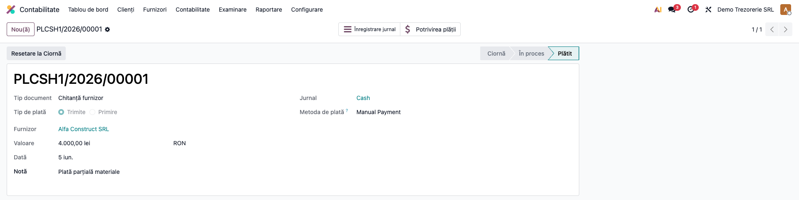
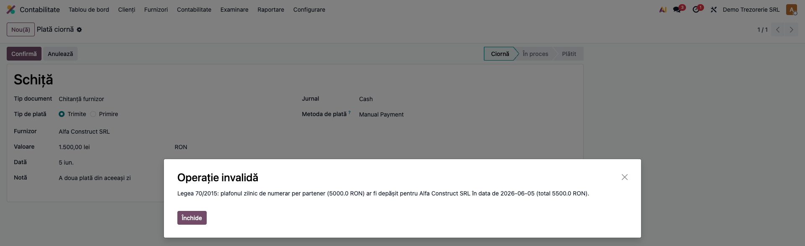
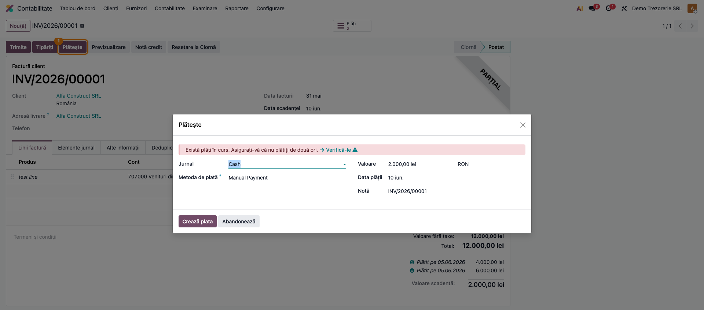
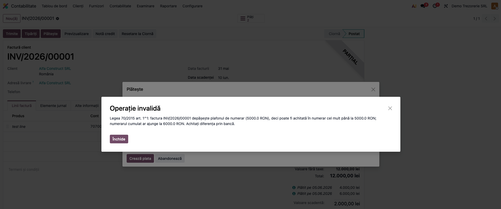
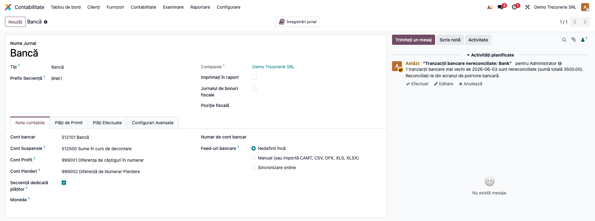

# Fișă Modul: Plafoane de numerar și alerte de trezorerie

**Modul:** `l10n_ro_cash_bank_enhanced`
**Utilizator principal:** Casier, Contabil trezorerie, Contabil-șef
**Prioritate:** 🔴 Ridicată (conformitate Legea 70/2015 — amenzi de 25% din suma peste plafon)
**FR:** FR-28 — Casierie și bancă
**Poziție plan:** Trezorerie (clasa 5)
**Capitol manual:** Cap. 8.4 — Casierie

---

## 1. Scop business

Modulul adaugă două controale de conformitate pe trezorerie, pe care Odoo nu le are nativ:

- **Plafoanele de numerar din Legea 70/2015** — la validarea plăților și încasărilor în numerar,
  sistemul **blochează** depășirea plafoanelor zilnice legale per partener (5.000 RON pentru
  persoane juridice, 10.000 RON pentru persoane fizice), a plafonului total de plăți în numerar
  către persoane juridice (10.000 RON/zi) și **fragmentarea** plății în numerar a unei facturi
  peste plafon. Suplimentar, un control zilnic **alertează** responsabilul de trezorerie când
  soldul casieriei depășește plafonul legal de 50.000 RON.
- **Alerta de tranzacții bancare nereconciliate** — tranzacțiile din extrasul de cont rămase
  nereconciliate după un număr configurabil de zile generează automat o activitate către
  responsabilul de trezorerie, pe jurnalul de bancă, astfel încât situația financiară să nu fie
  denaturată de încasări/plăți „în suspans".

## 2. Bază legală și context

- **Legea 70/2015** pentru întărirea disciplinei financiare privind operațiunile de încasări și
  plăți în numerar (actualizată prin Legea 296/2023 și OUG 115/2023):
  - încasări/plăți de la/către **persoane juridice**: plafon **5.000 RON**/persoană/zi;
  - **plăți** către persoane juridice: suplimentar, plafon **total de 10.000 RON/zi**;
  - încasări/plăți de la/către **persoane fizice**: plafon **10.000 RON**/persoană/zi;
  - **art. 1¹** — fragmentarea este interzisă: o factură cu valoare peste plafon se poate achita
    în numerar **cel mult până la plafon**; diferența se achită obligatoriu prin bancă;
  - **art. 4¹** — soldul casieriei la sfârșitul zilei: maximum **50.000 RON**; excedentul se
    depune la bancă în două zile lucrătoare;
  - sancțiune: amendă de **25% din suma care depășește plafonul**, minimum 500 RON.
- Excepție legală (configurabilă în modul prin ajustarea plafoanelor): magazinele de tip
  **cash and carry** au plafon de 10.000 RON.
- Suspansul bancar: tranzacțiile nereconciliate stau pe contul tranzitoriu al jurnalului de
  bancă (suspense) și nu se regăsesc în solduri de clienți/furnizori — de aici nevoia de alertă.

## 3. Utilizatori și roluri

Casierul (operează încasări/plăți în numerar și vede blocajele), contabilul de trezorerie
(primește alertele și reconciliază banca), contabilul-șef (configurează plafoanele și
responsabilul).

Roluri recomandate pentru testare:
- Administrator funcțional: instalează modulul, configurează plafoanele și responsabilul.
- Utilizator operațional (casier): încearcă plăți în numerar sub și peste plafon.
- Contabil trezorerie: verifică activitățile primite pe jurnalele de bancă/casă.

## 4. Conturi și date implicate

- **Conturi de casă (clasa 5):** **5311** (casa în lei) — contul implicit al jurnalului de casă;
  pe el se calculează soldul comparat cu plafonul de 50.000 RON.
- **Cont tranzitoriu bancă (suspense):** 512x.8 / contul de așteptare al jurnalului de bancă —
  acolo „stau" tranzacțiile nereconciliate care declanșează alerta.
- **Contrapartide uzuale ale operațiunilor controlate:** 4111 (încasări clienți), 401 (plăți
  furnizori), 70x + 4427 (vânzare cu numerar).
- Date minime pentru demo:
  - companie românească cu plan de conturi RO;
  - un **jurnal de casă** cu cont implicit 5311 și un **jurnal de bancă**;
  - un partener **persoană juridică** și unul **persoană fizică**;
  - o factură de client cu valoare peste 5.000 RON (pentru anti-fragmentare);
  - un utilizator desemnat **responsabil de trezorerie**.

## 5. Configurare inițială

1. Instalați modulul `l10n_ro_cash_bank_enhanced` (necesită Enterprise — `account_accountant`).
2. Deschideți **Contabilitate → Configurare → Setări**, secțiunea **Casierie și bancă (RO)**.
3. La **Alertă tranzacții nereconciliate** setați numărul de zile (implicit 7; 0 dezactivează)
   și alegeți **Responsabilul de trezorerie**.
4. La **Plafoane numerar (Legea 70/2015)** verificați că bifa de impunere este activă și că
   plafoanele precompletate corespund: 5.000 / 10.000 / 10.000 / 50.000 RON. Ajustați-le doar
   pentru cazuri speciale (ex. cash and carry).
5. Verificați în **Setări → Tehnic → Automatizare → Acțiuni programate** că cele două cron-uri
   („România: Alertă tranzacții bancare nereconciliate" și „România: Alertă sold casierie peste
   plafon") sunt active, cu rulare zilnică.

## 6. Flux de utilizare

### Pasul 1 — Configurarea plafoanelor și a responsabilului

Accesați **Contabilitate → Configurare → Setări → Casierie și bancă (RO)**. Completați zilele
pentru alertă, responsabilul de trezorerie și verificați plafoanele de numerar.



### Pasul 2 — Plată în numerar sub plafon (caz normal)

Accesați **Contabilitate → Furnizori → Plăți** și creați o plată pe **jurnalul de casă** către o
persoană juridică, cu sumă sub 5.000 RON (de ex. 4.000 RON). Plata se validează normal cu
**Confirmă** — controlul nu intervine cât timp totalul zilei pe partener rămâne în plafon.



### Pasul 3 — Blocarea depășirii plafonului zilnic per partener

Creați în aceeași zi o a doua plată în numerar către **același partener**, care ar duce totalul
zilei peste 5.000 RON (de ex. încă 1.500 RON). La **Confirmă**, sistemul blochează validarea cu
un mesaj care indică plafonul, partenerul, data și totalul care s-ar atinge.

Același control se aplică și încasărilor în numerar de la persoane juridice (5.000 RON),
operațiunilor cu persoane fizice (10.000 RON) și totalului plăților în numerar către persoane
juridice (10.000 RON/zi, indiferent de partener). Sumele în valută se convertesc la moneda
companiei la data plății.



### Pasul 4 — Anti-fragmentare: factură peste plafon plătită parțial în numerar

Deschideți o factură de client cu valoare peste plafon (în exemplu, 12.000 RON), care are deja
plăți înregistrate: 4.000 RON în numerar și 6.000 RON prin bancă (restul de plată: 2.000 RON).
Apăsați butonul **Plătește** — se deschide wizardul de plată cu restul facturii, pe jurnalul
de casă.



### Pasul 5 — Blocarea fragmentării (numerar cumulat pe factură peste plafon)

În wizard apăsați **Crează plata** pentru restul de 2.000 RON în numerar. Deși plafonul zilnic
per partener este respectat (2.000 ≤ 5.000), numerarul **cumulat pe factură** ar ajunge la
6.000 RON, peste plafonul de 5.000 RON — sistemul blochează operațiunea cu mesajul regulii
art. 1¹: „factura … depășește plafonul de numerar …; numerarul cumulat ar ajunge la 6.000 RON.
Achitați diferența prin bancă."

Regula se aplică **oricărei** plăți în numerar care ar duce cumulul cash pe factura respectivă
peste plafon — nu doar „celei de-a doua": și o primă plată cash de 6.000 RON pe această factură
ar fi fost blocată.



**Note de monografie și raportare** (modulul **controlează**, nu generează, notele de trezorerie):
- Încasare în numerar: `Dr 5311 = Cr 4111 / 419 / 461 …` — supusă plafonului per partener/zi.
- Plată în numerar: `Dr 401 / 542 = Cr 5311` (sau o cheltuială achitată direct,
  ex. `Dr 604 = Cr 5311`) — supusă plafonului per partener/zi și plafonului total zilnic
  către persoane juridice.
- Plata unei facturi peste plafon: numerar cel mult până la plafon (`Dr 401 = Cr 5311`),
  diferența prin bancă (`Dr 401 = Cr 5121`).
- Blocajele apar **înainte de postare** — nu se creează note contabile invalide care să trebuiască
  stornate.

### Pasul 6 — Alertele de trezorerie pe jurnale (nereconciliate și sold casierie)

Cron-urile zilnice creează **activități** pe jurnalele afectate, asignate responsabilului de
trezorerie:
- pe **jurnalul de bancă** — când există tranzacții din extras nereconciliate mai vechi decât
  pragul setat: activitatea indică numărul de tranzacții și suma totală; la rulările următoare
  activitatea se **actualizează** (nu se duplică), iar după reconciliere se marchează ca
  finalizată;
- pe **jurnalul de casă** — când soldul contabil al casei depășește 50.000 RON: activitatea
  indică soldul și obligația de depunere a excedentului la bancă în două zile lucrătoare.

Activitățile se văd pe formularul jurnalului (clopoțelul de activități), în meniul de activități
al utilizatorului responsabil și pe tabloul de bord Contabilitate.



## 7. Legături cu alte module / declarații

| Modul | Rol |
|---|---|
| `account_accountant` (Enterprise) | reconcilierea bancară automată (motorul nativ); modulul alertează doar ce rămâne nereconciliat |
| `account_online_synchronization` / `account_bank_statement_extract` (Enterprise) | importul tranzacțiilor bancare (sincronizare PSD2 / OCR pe PDF) — sursa liniilor de extras monitorizate |
| `l10n_ro_cash_register` (OCA) | registrul de casă operațional (zilnic, numerotat) — complementar; plafoanele de aici se aplică plăților/încasărilor indiferent de el |
| `l10n_ro_cash_register_report` | Registrul de casă ca raport Enterprise — verificarea soldului zilnic raportat la plafonul de 50.000 RON |
| `l10n_ro` | plan de conturi și localizare RO; controalele se activează doar pentru companii cu țară fiscală România |

**Ce e automat:** blocarea la validare a plăților/încasărilor în numerar peste plafoane (inclusiv
cumulul pe zi, pe partener comercial și pe factură), conversia valutelor la moneda companiei,
alertele zilnice pe jurnale (nereconciliate + sold casierie), actualizarea alertelor fără
duplicare. **Ce rămâne manual:** reconcilierea efectivă a tranzacțiilor semnalate, depunerea la
bancă a excedentului de numerar, marcarea activităților ca finalizate, ajustarea plafoanelor
pentru excepțiile legale (cash and carry).

## 8. Verificări pentru consultant

- [ ] Secțiunea **Casierie și bancă (RO)** apare în Contabilitate → Configurare → Setări, cu
      plafoanele implicite 5.000 / 10.000 / 10.000 / 50.000 RON.
- [ ] O plată în numerar de 4.000 RON către o persoană juridică se validează normal.
- [ ] A doua plată în numerar către același partener, în aceeași zi, care duce totalul peste
      5.000 RON, este **blocată** cu mesaj explicit (plafon, partener, dată, total).
- [ ] O încasare în numerar de la o persoană fizică peste 10.000 RON/zi este blocată.
- [ ] Două plăți a câte 5.000 RON către doi parteneri PJ diferiți trec; a treia plată către PJ în
      aceeași zi (totalul peste 10.000 RON) este blocată.
- [ ] Pe o factură de 12.000 RON: plată numerar 4.000 RON OK; a doua plată numerar 2.000 RON în
      altă zi este **blocată** (anti-fragmentare); restul prin bancă trece și închide factura.
- [ ] O factură sub plafon (ex. 4.500 RON) se poate achita **integral** în numerar.
- [ ] Plățile pe jurnalul de **bancă** nu sunt afectate de plafoane.
- [ ] Cu bifa de impunere dezactivată, controalele de plafon nu mai blochează.
- [ ] După rularea cron-ului, jurnalul de bancă cu tranzacții nereconciliate mai vechi decât
      pragul are **o singură** activitate către responsabil (a doua rulare nu o duplică).
- [ ] Cu sold de casă peste 50.000 RON, cron-ul de sold creează activitatea de alertă; sub
      plafon, nu.

## 9. Mesaje de eroare frecvente

| Mesaj / Simptom | Cauză | Remediere |
|---|---|---|
| „Legea 70/2015: plafonul zilnic de numerar per partener … ar fi depășit" | Totalul operațiunilor în numerar din zi cu partenerul depășește plafonul (5.000 PJ / 10.000 PF) | Încasați/plătiți diferența prin bancă sau în altă zi (atenție la anti-fragmentare pe aceeași factură) |
| „Legea 70/2015: plafonul total zilnic al plăților în numerar către persoane juridice … ar fi depășit" | Suma tuturor plăților în numerar către PJ din zi depășește 10.000 RON | Plătiți prin bancă sau reprogramați plata |
| „Legea 70/2015 art. 1^1: factura … depășește plafonul de numerar" | Numerarul cumulat pe factură ar depăși plafonul — plată fragmentată | Achitați diferența facturii prin bancă |
| Nu se creează alerte deși există tranzacții vechi nereconciliate | Responsabilul de trezorerie nu e setat, pragul de zile e 0 sau cron-ul e inactiv | Setați responsabilul și zilele în Setări; activați cron-ul |
| Alertă de sold casierie deși casa „pare" mică | Mișcări de casă nepostate/greșit datate; soldul se calculează din notele **postate** pe contul casei | Verificați soldul în Registrul de casă; corectați datele operațiunilor |
| Blocaj la plăți care nu sunt „de casă" | Jurnalul folosit are tip „Numerar" deși operațiunea e bancară | Folosiți jurnalul de bancă pentru operațiuni prin bancă |

## 10. Capturi de ecran

Capturile din `readme/screenshots/` se generează automat din `tests/test_screenshots.py`
(mixinul `ScreenshotCase` din `l10n_ro_doc_screenshots`, HttpCase + Playwright, import defensiv),
în limba română, pe companie cu plan de conturi RO.

Lista capturilor (în ordinea fluxului):
1. `01_setari.png` — setările „Casierie și bancă (RO)": zile alertă, responsabil, plafoane
2. `02_plata_numerar.png` — plată în numerar sub plafon, validată
3. `03_eroare_plafon.png` — blocarea depășirii plafonului zilnic per partener
4. `04_factura_inregistrare_plata.png` — wizardul „Plătește" pe factură peste plafon, rest pe casă
5. `05_eroare_fragmentare.png` — blocarea plății fragmentate (art. 1¹)
6. `06_activitate_jurnal.png` — activitatea de alertă pe jurnalul de bancă (tranzacții nereconciliate)

Regenerare:
```
./odoo/odoo-bin -c odoo.conf -d test19 -u l10n_ro_cash_bank_enhanced \
    --test-tags=fise_screenshots --stop-after-init
```

## 11. Observații pentru manual

- Subliniați că plafoanele se aplică **cumulat pe zi și pe partener comercial** (compania-mamă cu
  toate contactele ei), nu per document — două chitanțe „mici" către același partener se adună.
- Regula anti-fragmentare se judecă **pe factură**, indiferent de zile: numerar cel mult până la
  plafon, restul obligatoriu prin bancă. Modelul corect de prezentat clientului: „factura mare se
  achită cash maximum 5.000, diferența prin OP".
- Alerta de sold casierie este **informativă** (legea cere depunerea excedentului, nu interzice
  încasarea); blocarea efectivă a închiderii de zi rămâne în registrul de casă operațional.
- Plafoanele sunt configurabile tocmai pentru excepțiile legale (cash and carry — 10.000 RON);
  documentați în manual cine are dreptul să le modifice.
