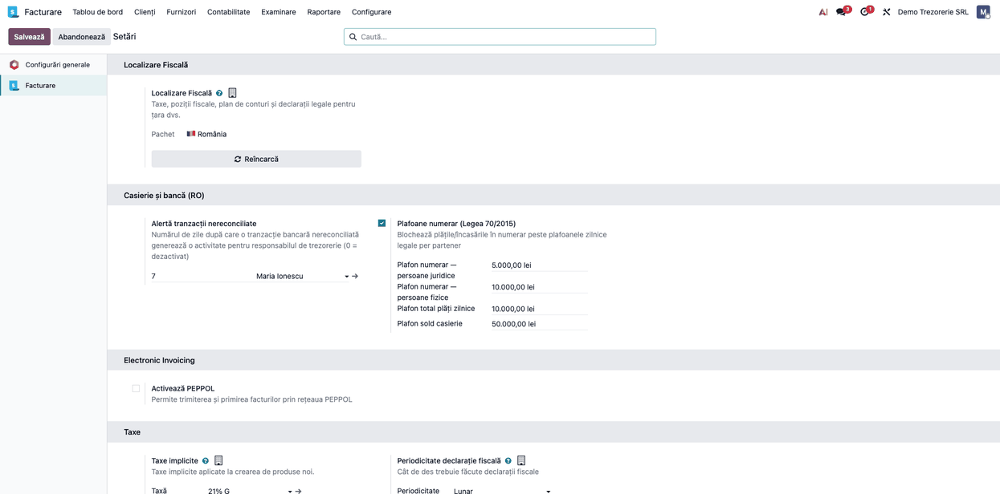
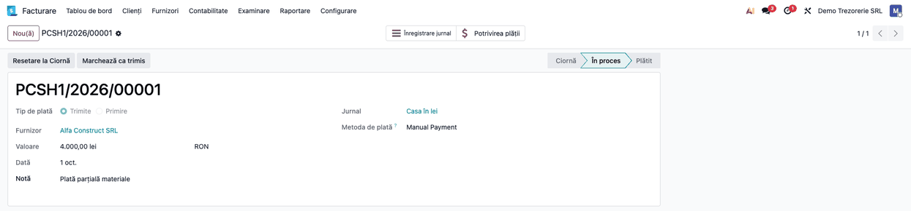
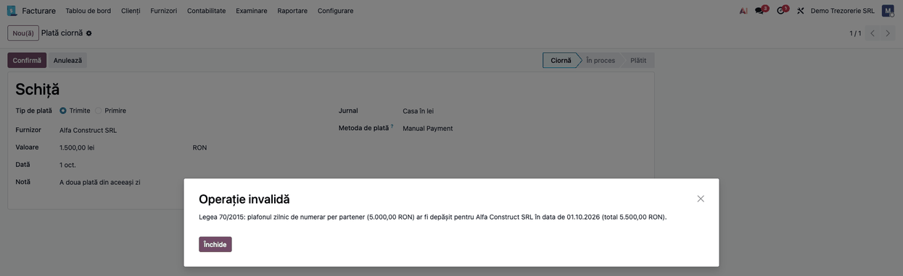
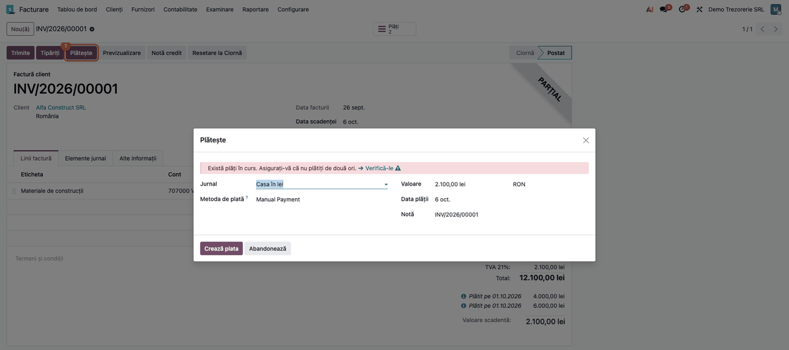
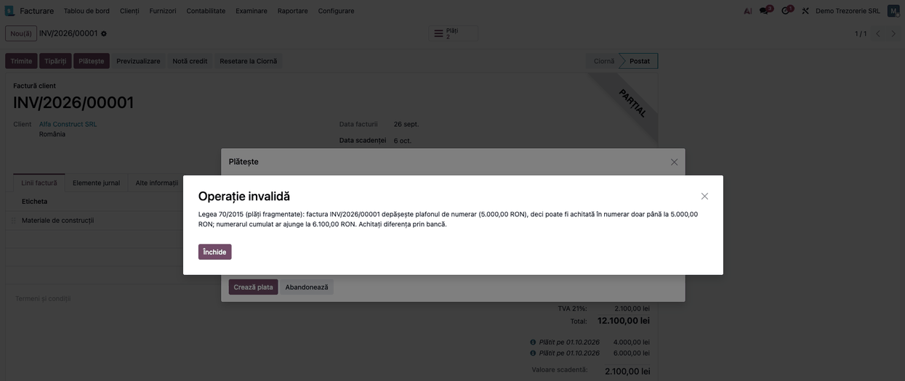
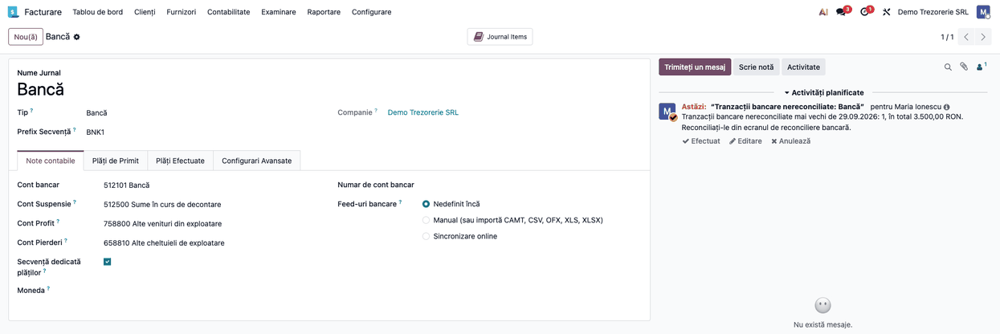
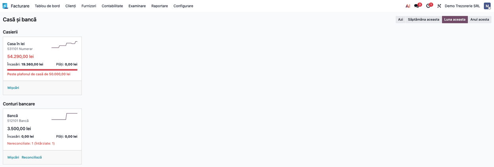
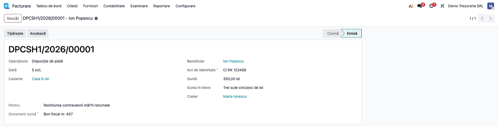
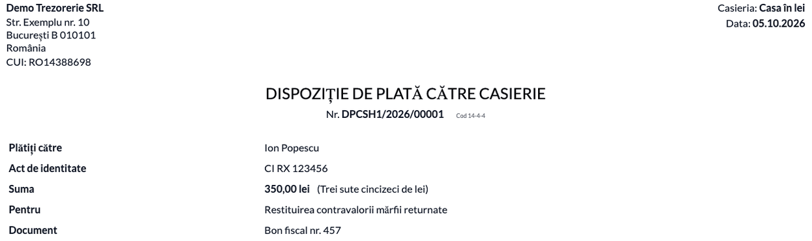

# Fișă Modul: Plafoane de numerar, alerte și tabloul casă și bancă

**Modul:** `l10n_ro_cash_bank_enhanced`
**Utilizator principal:** Casier, Contabil trezorerie, Contabil-șef
**Prioritate:** 🔴 Ridicată (conformitate Legea 70/2015 — amenzi de 25% din suma peste plafon)
**FR:** FR-28 — Casierie și bancă
**Poziție plan:** Trezorerie (clasa 5)
**Capitol manual:** Cap. 8.4 — Casierie

---

## 1. Scop business

Modulul adaugă controale și documente de trezorerie pe care Odoo nu le are nativ:

- **Plafoanele de numerar din Legea 70/2015** — la validarea plăților și încasărilor în numerar,
  sistemul **blochează** depășirea plafoanelor zilnice legale per partener (5.000 RON pentru
  persoane juridice, 10.000 RON pentru persoane fizice), a plafonului total de plăți în numerar
  către persoane juridice (10.000 RON/zi) și **fragmentarea** plății în numerar a unei facturi
  peste plafon. Suplimentar, un control zilnic **alertează** responsabilul de trezorerie când
  soldul casieriei depășește plafonul legal de 50.000 RON.
- **Alerta de tranzacții bancare nereconciliate** — tranzacțiile din extrasul de cont rămase
  nereconciliate după un număr configurabil de zile generează automat o activitate către
  responsabilul de trezorerie, pe jurnalul de bancă, astfel încât situația financiară să nu fie
  denaturată de încasări/plăți „în suspans".
- **Tabloul „Casă și bancă"** — un card pe fiecare casierie și cont bancar, cu soldul din
  balanță, încasările și plățile din perioadă, evoluția soldului pe 30 de zile, gradul de ocupare
  a plafonului de casă și extrasele nereconciliate; de pe card se deschid mișcările contului și
  reconcilierea bancară.
- **Dispoziția de plată / de încasare către casierie (cod 14-4-4)** — documentul justificativ al
  unei mișcări de numerar fără chitanță (restituirea contravalorii unei mărfi returnate, avans de
  trezorerie, plată către o persoană fizică), numerotat pe casierie și sens, cu suma în litere.

## 2. Bază legală și context

- **Legea 70/2015** pentru întărirea disciplinei financiare privind operațiunile de încasări și
  plăți în numerar, în forma modificată prin Legea 296/2023 și ordonanțele de urgență ulterioare:
  - **art. 3 alin. (1) lit. a) și c)** — încasări/plăți de la/către **persoane juridice**: plafon
    **5.000 RON**/persoană/zi; la **plăți**, suplimentar, plafon **total de 10.000 RON/zi**;
  - **art. 4 alin. (1)** — încasări/plăți de la/către **persoane fizice**: plafon **10.000 RON**/persoană/zi;
  - **art. 3 alin. (2)–(3)** și **art. 4 alin. (2)** — fragmentarea este interzisă: o factură cu valoare peste plafon se poate achita
    în numerar **cel mult până la plafon**; diferența se achită obligatoriu prin bancă;
  - **art. 4²** (introdus prin Legea 296/2023) — soldul casieriei la sfârșitul zilei: maximum **50.000 RON**; excedentul se
    depune la bancă în două zile lucrătoare (se admite depășirea doar cu sumele pentru plata
    salariilor și a altor drepturi de personal);
  - sancțiune: amendă de **25% din suma care depășește plafonul**.
- Excepție legală (configurabilă în modul prin ajustarea plafoanelor): magazinele de tip
  **cash and carry** au plafon de 10.000 RON (art. 3 alin. (1) lit. b)).
- Suspansul bancar: tranzacțiile nereconciliate stau pe contul tranzitoriu al jurnalului de
  bancă (suspense) și nu se regăsesc în solduri de clienți/furnizori — de aici nevoia de alertă.

## 3. Utilizatori și roluri

Casierul (operează încasări/plăți în numerar și vede blocajele), contabilul de trezorerie
(primește alertele și reconciliază banca), contabilul-șef (configurează plafoanele și
responsabilul).

Roluri recomandate pentru testare:
- Administrator funcțional: instalează modulul, configurează plafoanele și responsabilul.
- Utilizator operațional (casier): încearcă plăți în numerar sub și peste plafon.
- Contabil trezorerie: verifică activitățile primite pe jurnalele de bancă/casă.

## 4. Conturi și date implicate

- **Conturi de casă (clasa 5):** **5311** (casa în lei) — contul implicit al jurnalului de casă;
  pe el se calculează soldul comparat cu plafonul de 50.000 RON.
- **Cont de așteptare bancă (suspense):** **5125** „Sume în curs de decontare" — contul de suspensie
  al jurnalului de bancă în planul RO; acolo „stau" tranzacțiile nereconciliate care declanșează
  alerta.
- **Avansuri de trezorerie:** **542**; **diferențe de casă** la inventariere: 7588 (plus) / 6588
  (minus), setate ca „Cont profit" / „Cont pierderi" pe jurnale.
- **Contrapartide uzuale ale operațiunilor controlate:** 4111 (încasări clienți), 401 (plăți
  furnizori), 70x + 4427 (vânzare cu numerar).
- Date minime pentru demo:
  - companie românească cu plan de conturi RO;
  - un **jurnal de casă** cu cont implicit 5311 și un **jurnal de bancă**;
  - un partener **persoană juridică** și unul **persoană fizică**;
  - o factură de client cu valoare peste 5.000 RON (pentru anti-fragmentare);
  - un utilizator desemnat **responsabil de trezorerie**.

## 5. Configurare inițială

1. Instalați modulul `l10n_ro_cash_bank_enhanced` (necesită Enterprise — `account_accountant`).
2. Deschideți **Contabilitate → Configurare → Setări**, secțiunea **Casierie și bancă (RO)**.
   Fără aplicația Contabilitate instalată, aceleași meniuri apar sub **Facturare** (capturile din
   fișă sunt făcute așa).
3. La **Alertă tranzacții nereconciliate** setați numărul de zile (implicit 7; 0 dezactivează)
   și alegeți **Responsabilul de trezorerie**.
4. La **Plafoane numerar (Legea 70/2015)** verificați că bifa de impunere este activă și că
   plafoanele precompletate corespund: 5.000 / 10.000 / 10.000 / 50.000 RON. Ajustați-le doar
   pentru cazuri speciale (ex. cash and carry).
5. Verificați în **Setări → Tehnic → Automatizare → Acțiuni programate** că cele două cron-uri
   („România: Alertă tranzacții bancare nereconciliate" și „România: Alertă sold casierie peste
   plafon") sunt active, cu rulare zilnică.

## 6. Flux de utilizare

### Pasul 1 — Configurarea plafoanelor și a responsabilului

Accesați **Contabilitate → Configurare → Setări → Casierie și bancă (RO)**. Completați zilele
pentru alertă, responsabilul de trezorerie și verificați plafoanele de numerar.



### Pasul 2 — Plată în numerar sub plafon (caz normal)

Accesați **Contabilitate → Furnizori → Plăți** și creați o plată pe **jurnalul de casă** către o
persoană juridică, cu sumă sub 5.000 RON (de ex. 4.000 RON). Plata se validează normal cu
**Confirmă** — controlul nu intervine cât timp totalul zilei pe partener rămâne în plafon.



### Pasul 3 — Blocarea depășirii plafonului zilnic per partener

Creați în aceeași zi o a doua plată în numerar către **același partener**, care ar duce totalul
zilei peste 5.000 RON (de ex. încă 1.500 RON). La **Confirmă**, sistemul blochează validarea cu
un mesaj care indică plafonul, partenerul, data și totalul care s-ar atinge.

Același control se aplică și încasărilor în numerar de la persoane juridice (5.000 RON),
operațiunilor cu persoane fizice (10.000 RON) și totalului plăților în numerar către persoane
juridice (10.000 RON/zi, indiferent de partener). Sumele în valută se convertesc la moneda
companiei la data plății.



### Pasul 4 — Anti-fragmentare: factură peste plafon plătită parțial în numerar

Deschideți o factură de client cu valoare peste plafon (în exemplu, 10.000 RON + TVA 21% =
12.100 RON), care are deja plăți înregistrate: 4.000 RON în numerar și 6.000 RON prin bancă
(restul de plată: 2.100 RON).
Apăsați butonul **Plătește** — se deschide wizardul de plată cu restul facturii, pe jurnalul
de casă.



### Pasul 5 — Blocarea fragmentării (numerar cumulat pe factură peste plafon)

În wizard apăsați **Crează plata** pentru restul de 2.100 RON în numerar. Deși plafonul zilnic
per partener este respectat (2.100 ≤ 5.000), numerarul **cumulat pe factură** ar ajunge la
6.100 RON, peste plafonul de 5.000 RON — sistemul blochează operațiunea cu mesajul
„Legea 70/2015 (plăți fragmentate): factura … depășește plafonul de numerar (5.000,00 RON), deci
poate fi achitată în numerar doar până la 5.000,00 RON; numerarul cumulat ar ajunge la
6.100,00 RON. Achitați diferența prin bancă."

Regula se aplică **oricărei** plăți în numerar care ar duce cumulul cash pe factura respectivă
peste plafon — nu doar „celei de-a doua": și o primă plată cash de 6.000 RON pe această factură
ar fi fost blocată.



**Note de monografie și raportare** (modulul **controlează**, nu generează, notele de trezorerie):
- Încasare în numerar: `Dr 5311 = Cr 4111 / 419 / 461 …` — supusă plafonului per partener/zi.
- Plată în numerar: `Dr 401 / 542 = Cr 5311` (sau o cheltuială achitată direct,
  ex. `Dr 604 + Dr 4426 = Cr 5311` la un furnizor plătitor de TVA) — supusă plafonului per partener/zi și plafonului total zilnic
  către persoane juridice.
- Plata unei facturi peste plafon: numerar cel mult până la plafon (`Dr 401 = Cr 5311`),
  diferența prin bancă (`Dr 401 = Cr 5121`).
- Blocajele apar **înainte de postare** — nu se creează note contabile invalide care să trebuiască
  stornate.
- În Odoo 19, o plată în numerar confirmată („În proces") **nu mișcă încă 5311**: contul casei se
  mișcă la înregistrarea operațiunii în extrasul de casă (registrul de casă) și la reconcilierea
  ei cu plata. Plafoanele se verifică totuși la confirmarea plății.

### Pasul 6 — Alertele de trezorerie pe jurnale (nereconciliate și sold casierie)

Cron-urile zilnice creează **activități** pe jurnalele afectate, asignate responsabilului de
trezorerie:
- pe **jurnalul de bancă** — când există tranzacții din extras nereconciliate mai vechi decât
  pragul setat: activitatea indică numărul de tranzacții și suma totală; la rulările următoare
  activitatea se **actualizează** (nu se duplică), iar după reconciliere se marchează ca
  finalizată;
- pe **jurnalul de casă** — când soldul contabil al casei depășește 50.000 RON: activitatea
  indică soldul și obligația de depunere a excedentului la bancă în două zile lucrătoare.

Activitățile se văd pe formularul jurnalului (clopoțelul de activități), în meniul de activități
al utilizatorului responsabil și pe tabloul de bord Contabilitate.



### Pasul 7 — Tabloul „Casă și bancă"

Accesați **Contabilitate → Contabilitate → Casă și bancă**. Tabloul are două secțiuni,
**Casierii** și **Conturi bancare**, cu câte un card pe fiecare jurnal care are cont implicit.

1. **Alegeți perioada** din butoanele din dreapta sus: Azi / Săptămâna aceasta / Luna aceasta /
   Anul acesta (implicit luna curentă).
2. **Găsiți pe card**:
   - **soldul** cu cifre mari — soldul contabil al contului jurnalului (ex. 5311, 5121) la data de
     azi, din notele **postate**; perioada schimbă doar încasările și plățile;
   - **Încasări** / **Plăți** — rulajul debitor/creditor al contului în perioada aleasă;
   - linia din dreapta sus — evoluția soldului la sfârșitul fiecăreia dintre ultimele 30 de zile;
   - la conturile în valută, sub sold, soldul în moneda contului;
   - la **casierii**, bara plafonului: verde sub plafonul de 50.000 RON, roșie (cu soldul roșu și
     mesajul „Peste plafonul de casă de …") peste plafon;
   - la **conturi bancare**, numărul de **tranzacții nereconciliate** și, între paranteze, câte
     sunt mai vechi decât pragul de alertă din Setări.
3. **Verificați**: soldul casieriei coincide cu soldul contului 5311 din balanță la aceeași dată;
   o casierie cu bara roșie are excedent de depus la bancă în două zile lucrătoare; un cont bancar
   cu tranzacții întârziate are și activitatea de alertă din pasul 6.
4. **Treceți mai departe** din subsolul cardului: **Mișcări** deschide liniile contabile ale
   contului din perioada aleasă; **Reconciliază** (doar la conturile bancare cu tranzacții
   nereconciliate) deschide reconcilierea bancară a jurnalului.

Tabloul doar citește contabilitatea: nu creează și nu modifică note contabile. O plată în numerar
doar confirmată (pasul 2) nu apare pe tablou până nu e înregistrată în extrasul de casă: tabloul
arată contul 5311, nu lista plăților.



În exemplu, soldul casei vine din trei rapoarte Z (`Dr 5311 = Cr 707 + Cr 4427`) și un avans de
trezorerie (`Dr 542 = Cr 5311`): 54.290 lei, peste plafonul de 50.000 lei.

### Pasul 8 — Dispoziția de plată către casierie (14-4-4)

Accesați **Contabilitate → Contabilitate → Dispoziții de casă** (în grupul **Tranzacții**) și
apăsați **Nou**. Completați:
- **Operațiunea**: Dispoziție de plată (ieșire de numerar) sau de încasare;
- **Casieria** (jurnalul de casă), **data**, **beneficiarul** și **actul de identitate** prezentat
  la casierie (se reține doar pe dispoziție, nu în fișa partenerului);
- **suma**, **motivul** și **documentul sursă** (ex. bonul fiscal al mărfii returnate).

La **Confirmă**, dispoziția devine **Emisă** și primește numărul din secvența casieriei, pe sens (de ex.
DPCSH1/2026/00001), cu resetare anuală.



**Tipăriți** dispoziția: documentul are antetul firmei, casieria, data, numărul, beneficiarul cu
actul de identitate, suma în cifre și în litere, motivul și documentul sursă. Verificați că suma în
litere corespunde sumei în cifre înainte de a o înmâna casierului.



Dispoziția este **documentul justificativ** al ieșirii de numerar; nu generează notă contabilă și
nu verifică plafoanele din Legea 70/2015 (acestea se verifică pe plăți). Nota se face separat, la
plata efectivă din casă:
- retur pe **bon fiscal**, fără factură (cazul din exemplu): stornarea vânzării direct din casă,
  `5311 = 707 + 4427` în roșu;
- retur cu **factură de stornare**: `4111 = 707 + 4427` în roșu, apoi restituirea `Dr 4111 = Cr 5311`;
- avans de trezorerie: `Dr 542 = Cr 5311`.

## 7. Legături cu alte module / declarații

| Modul | Rol |
|---|---|
| `account_accountant` (Enterprise) | reconcilierea bancară automată (motorul nativ); modulul alertează doar ce rămâne nereconciliat; butonul **Reconciliază** al tabloului deschide reconcilierea ei |
| `account_online_synchronization` / `account_bank_statement_extract` (Enterprise) | importul tranzacțiilor bancare (sincronizare PSD2 / OCR pe PDF) — sursa liniilor de extras monitorizate |
| `l10n_ro_cash_register` (OCA) | registrul de casă operațional (zilnic, numerotat) — complementar; plafoanele de aici se aplică plăților/încasărilor indiferent de el |
| `l10n_ro_cash_register_report` | Registrul de casă ca raport Enterprise — verificarea soldului zilnic raportat la plafonul de 50.000 RON |
| `l10n_ro` | plan de conturi și localizare RO; controalele se activează doar pentru companii cu țară fiscală România |

**Ce e automat:** blocarea la validare a plăților/încasărilor în numerar peste plafoane (inclusiv
cumulul pe zi, pe partener comercial și pe factură), conversia valutelor la moneda companiei,
alertele zilnice pe jurnale (nereconciliate + sold casierie), actualizarea alertelor fără
duplicare, cifrele tabloului (citite la deschidere din notele postate). **Ce rămâne manual:** reconcilierea efectivă a tranzacțiilor semnalate, depunerea la
bancă a excedentului de numerar, marcarea activităților ca finalizate, ajustarea plafoanelor
pentru excepțiile legale (cash and carry).

## 8. Verificări pentru consultant

- [ ] Secțiunea **Casierie și bancă (RO)** apare în Contabilitate → Configurare → Setări, cu
      plafoanele implicite 5.000 / 10.000 / 10.000 / 50.000 RON.
- [ ] O plată în numerar de 4.000 RON către o persoană juridică se validează normal.
- [ ] A doua plată în numerar către același partener, în aceeași zi, care duce totalul peste
      5.000 RON, este **blocată** cu mesaj explicit (plafon, partener, dată, total).
- [ ] O încasare în numerar de la o persoană fizică peste 10.000 RON/zi este blocată.
- [ ] Două plăți a câte 5.000 RON către doi parteneri PJ diferiți trec; a treia plată către PJ în
      aceeași zi (totalul peste 10.000 RON) este blocată.
- [ ] Pe o factură de 12.100 RON: plată numerar 4.000 RON OK, plată prin bancă 6.000 RON OK; restul
      de 2.100 RON în numerar este **blocat** (anti-fragmentare), prin bancă trece și închide factura.
- [ ] O factură sub plafon (ex. 4.500 RON) se poate achita **integral** în numerar.
- [ ] Plățile pe jurnalul de **bancă** nu sunt afectate de plafoane.
- [ ] Cu bifa de impunere dezactivată, controalele de plafon nu mai blochează.
- [ ] După rularea cron-ului, jurnalul de bancă cu tranzacții nereconciliate mai vechi decât
      pragul are **o singură** activitate către responsabil (a doua rulare nu o duplică).
- [ ] Cu sold de casă peste 50.000 RON, cron-ul de sold creează activitatea de alertă; sub
      plafon, nu.
- [ ] În **Contabilitate → Contabilitate → Casă și bancă**, soldul fiecărei casierii este egal cu
      soldul contului ei din balanță la data de azi.
- [ ] Schimbarea perioadei (Azi / Săptămâna / Luna / Anul) schimbă **Încasări** și **Plăți**, dar
      soldul rămâne cel de la data curentă.
- [ ] O casierie cu sold peste 50.000 RON are bara roșie și mesajul „Peste plafonul de casă".
- [ ] Un cont bancar cu tranzacții nereconciliate arată numărul lor și câte sunt întârziate;
      **Reconciliază** deschide reconcilierea jurnalului.
- [ ] O dispoziție de plată emisă primește număr din secvența casieriei, iar tipărirea arată
      suma în litere și actul de identitate al beneficiarului.
- [ ] **Mișcări** deschide doar liniile postate ale contului jurnalului din perioada aleasă.

## 9. Mesaje de eroare frecvente

| Mesaj / Simptom | Cauză | Remediere |
|---|---|---|
| „Legea 70/2015: plafonul zilnic de numerar per partener … ar fi depășit" | Totalul operațiunilor în numerar din zi cu partenerul depășește plafonul (5.000 PJ / 10.000 PF) | Încasați/plătiți diferența prin bancă sau în altă zi (atenție la anti-fragmentare pe aceeași factură) |
| „Legea 70/2015: plafonul total zilnic al plăților în numerar către persoane juridice … ar fi depășit" | Suma tuturor plăților în numerar către PJ din zi depășește 10.000 RON | Plătiți prin bancă sau reprogramați plata |
| „Legea 70/2015 (plăți fragmentate): factura … depășește plafonul de numerar" | Numerarul cumulat pe factură ar depăși plafonul — plată fragmentată | Achitați diferența facturii prin bancă |
| Nu se creează alerte deși există tranzacții vechi nereconciliate | Responsabilul de trezorerie nu e setat, pragul de zile e 0 sau cron-ul e inactiv | Setați responsabilul și zilele în Setări; activați cron-ul |
| Alertă de sold casierie deși casa „pare" mică | Mișcări de casă nepostate/greșit datate; soldul se calculează din notele **postate** pe contul casei | Verificați soldul în Registrul de casă; corectați datele operațiunilor |
| Un jurnal nu apare în tablou | Jurnalul nu are cont implicit sau nu e de tip Numerar/Bancă, ori e al altei companii decât cele selectate | Setați contul implicit pe jurnal; selectați compania în comutatorul de companii |
| O plată în numerar confirmată nu apare pe tablou | Plata e „În proces": contul 5311 se mișcă abia la înregistrarea în extrasul de casă | Înregistrați operațiunea în registrul (extrasul) de casă și reconciliați-o cu plata |
| Meniul **Casă și bancă** lipsește | Utilizatorul nu are drept de citire în contabilitate | Acordați cel puțin „Contabilitate: doar citire" |
| Blocaj la plăți care nu sunt „de casă" | Jurnalul folosit are tip „Numerar" deși operațiunea e bancară | Folosiți jurnalul de bancă pentru operațiuni prin bancă |

## 10. Capturi de ecran

Capturile din `static/description/` se generează automat din `tests/test_screenshots.py`
(mixinul `ScreenshotCase` din `l10n_ro_doc_screenshots`, HttpCase + Playwright, import defensiv),
în limba română, pe companie cu plan de conturi RO.

Lista capturilor (în ordinea fluxului):
1. `01_setari.png` — setările „Casierie și bancă (RO)": zile alertă, responsabil, plafoane
2. `02_plata_numerar.png` — plată în numerar sub plafon, validată
3. `03_eroare_plafon.png` — blocarea depășirii plafonului zilnic per partener
4. `04_factura_inregistrare_plata.png` — wizardul „Plătește" pe factură peste plafon, rest pe casă
5. `05_eroare_fragmentare.png` — blocarea plății fragmentate (art. 3 alin. (2)–(3))
6. `06_activitate_jurnal.png` — activitatea de alertă pe jurnalul de bancă (tranzacții nereconciliate)
7. `07_tablou_casa_banca.png` — tabloul „Casă și bancă": casierie peste plafon, cont bancar cu tranzacții nereconciliate
8. `08_dispozitie_plata.png` — dispoziția de plată către casierie, emisă
9. `09_dispozitie_plata_pdf.png` — dispoziția de plată tipărită (14-4-4)

Regenerare:
```
./odoo/odoo-bin -c odoo.conf -d test19 -u l10n_ro_cash_bank_enhanced \
    --test-tags=fise_screenshots --stop-after-init
```

## 11. Observații pentru manual

- Subliniați că plafoanele se aplică **cumulat pe zi și pe partener comercial** (compania-mamă cu
  toate contactele ei), nu per document — două chitanțe „mici" către același partener se adună.
- Regula anti-fragmentare se judecă **pe factură**, indiferent de zile: numerar cel mult până la
  plafon, restul obligatoriu prin bancă. Modelul corect de prezentat clientului: „factura mare se
  achită cash maximum 5.000, diferența prin OP".
- Alerta de sold casierie este **informativă** (legea cere depunerea excedentului, nu interzice
  încasarea); blocarea efectivă a închiderii de zi rămâne în registrul de casă operațional.
- Tabloul „Casă și bancă" arată soldul **contabil** (balanța), nu soldul din extras: o diferență
  între tablou și extrasul băncii înseamnă tranzacții nereconciliate sau înregistrări lipsă.
- Plafoanele sunt configurabile tocmai pentru excepțiile legale (cash and carry — 10.000 RON);
  documentați în manual cine are dreptul să le modifice.
