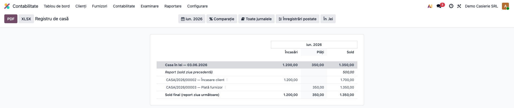
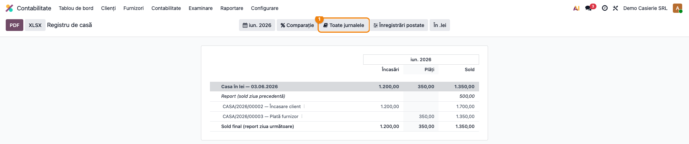
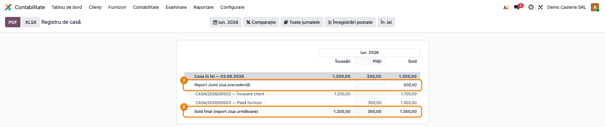
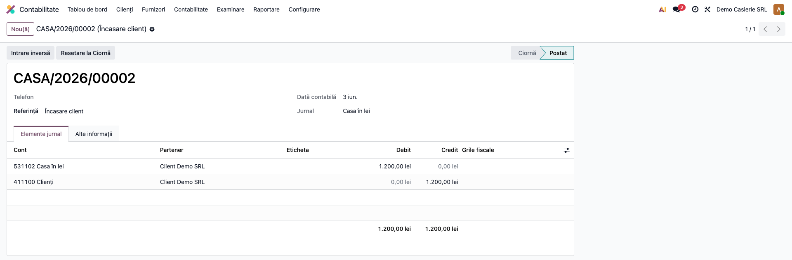
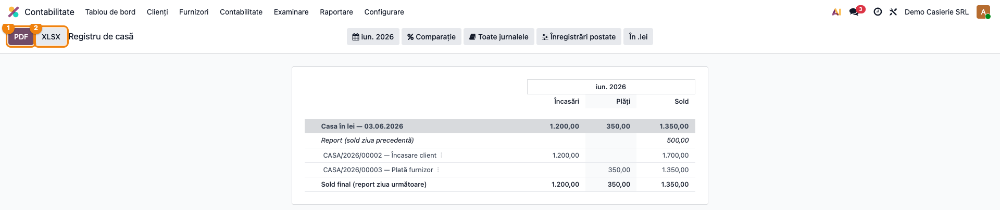

# Fișă Modul: Registru de casă (raport Enterprise)

**Modul:** `l10n_ro_cash_register_report`
**Utilizator principal:** Casier, Contabil trezorerie, Contabil-șef
**Prioritate:** 🟡 Medie (document de evidență a casei, util la control și închidere)
**FR:** FR-28 — Casierie și bancă
**Poziție plan:** Trezorerie (clasa 5)
**Capitol manual:** Cap. 8.4 — Casierie

---

## 1. Scop business

Modulul oferă **Registrul de casă** ca **raport Enterprise nativ** (`account.report`), nu ca
listă sau wizard separat. Pentru un interval de date și pentru jurnalele de casă, raportul
prezintă pentru fiecare zi: **soldul reportat** din ziua precedentă, **mișcările de casă**
(încasări pe debit, plăți pe credit) cu **sold cumulat** după fiecare operațiune și **soldul
final** (reportat pentru ziua următoare). Fiind raport nativ, beneficiază automat de filtrul de
interval, selectorul de jurnale, multi-companie, desfășurare pe niveluri și **export PDF/XLSX/print**
din bara de instrumente.

## 2. Bază legală și context

- **Registrul de casă** — cod 14-4-7A, OMFP 2634/2015 (registre și documente financiar-contabile).
- **Obligația de evidență a operațiunilor de casă** — Legea contabilității 82/1991.
- Formatul tipizat nu mai este obligatoriu (OMFP 2634/2015); obligatoriu rămâne **conținutul minim**:
  data, soldul de report, încasările și plățile zilei, soldul final.

## 3. Utilizatori și roluri

Casier (consultare zilnică), contabil trezorerie (verificare), contabil-șef (control la închidere).

Roluri recomandate pentru testare:
- Administrator funcțional: instalează modulul și verifică meniul din Raportare.
- Utilizator operațional: rulează raportul pe lună, filtrează pe jurnalul de casă.
- Contabil-șef: verifică reportul de sold între zile și exportă registrul.

## 4. Conturi și date implicate

- **Conturi de casă (clasa 5):** **5311** (casa în lei), **5314** (casa în valută) — contul implicit
  al jurnalului de casă (`default_account_id`).
- **Conturi de contrapartidă uzuale:** 4111 (încasări de la clienți), 401 (plăți către furnizori),
  419 (avansuri de la clienți), 542 (avansuri de trezorerie), 581 (viramente interne); la vânzare
  directă cu numerar, 70x + 4427 (TVA colectată).
- Date minime pentru demo:
  - companie românească cu plan de conturi RO;
  - cel puțin un **jurnal de casă** cu cont implicit 5311;
  - câteva mișcări de casă postate în perioada de test (o încasare și o plată).

## 5. Configurare inițială

1. Instalați modulul `l10n_ro_cash_register_report` pe baza demo (necesită Enterprise — `account_reports`).
2. Verificați că există cel puțin un **jurnal de casă** (tip „Numerar") cu cont implicit 5311.
3. Postați câteva operațiuni de casă în perioada de test (încasări și plăți).
4. Verificați că utilizatorul are acces la meniul **Contabilitate → Raportare → Registru de casă**
   (sub grupul „Rapoarte de situații" / „Statement Reports").

## 6. Flux de utilizare

### Pasul 1 — Deschiderea Registrului de casă

Accesați **Contabilitate → Raportare → Registru de casă**. Raportul se deschide pe luna curentă și
afișează, pentru jurnalele de casă, câte o **secțiune per zi** cu totalurile zilei: Încasări, Plăți
și Sold final.



### Pasul 2 — Alegerea jurnalului de casă și a perioadei

Din bara raportului folosiți filtrul **„Jurnale"** (afișează **doar jurnalele de casă**) pentru a
selecta casa dorită și filtrul de **dată** pentru a fixa intervalul (de regulă o lună calendaristică).



### Pasul 3 — Citirea zilei: report, mișcări, sold final

Desfășurați o zi pentru a vedea structura registrului:
- rândul **„Report (sold ziua precedentă)"** — soldul de la care pleacă ziua;
- **liniile de mișcare** — numărul documentului și explicația, cu **Încasări** pe debit, **Plăți**
  pe credit și **Sold** cumulat după fiecare operațiune;
- rândul **„Sold final (report ziua următoare)"** — soldul de închidere al zilei.

Reportul primei zile din interval (în captură, 500,00) **nu** provine din interval, ci este
soldul casei **acumulat din mișcările dinainte de data de început** — modulul îl preia automat,
astfel încât registrul pornește de la soldul real, nu de la zero.



**Note de monografie și raportare** (raportul **reflectă**, nu generează, notele de casă):
- Încasare în numerar: `Dr 5311 = Cr 4111 / 419 / 461 …` (sau, la vânzare directă cu numerar,
  `Dr 5311 = Cr 70x + Cr 4427`) → apare pe coloana **Încasări**. În captură: încasare de la client,
  `Dr 5311 = Cr 4111`.
- Plată în numerar: `Dr 401 / 542 / 6xx … = Cr 5311` → apare pe coloana **Plăți**.
- **Sold final zi** = Report (sold ziua precedentă) + Total încasări − Total plăți; devine reportul
  zilei următoare. Soldul casei nu poate fi negativ — un sold negativ semnalează operațiuni lipsă
  sau greșit datate.

### Pasul 4 — Drill-down la nota contabilă

Pe o linie de mișcare, din caretul ▸ alegeți **„Înregistrări contabile"** pentru a deschide exact
liniile contabile (`account.move.line`) din care provine operațiunea de casă.



### Pasul 5 — Verificarea pe ecran și exportul registrului

Înainte de a exporta, **citiți raportul pe ecran**:
1. **Găsiți** — soldul de report al primei zile din interval (rândul „Report") și soldul final al
   ultimei zile (rândul „Sold final").
2. **Verificați** — reportul primei zile corespunde soldului de închidere din ziua precedentă;
   pe fiecare zi, `Report + Încasări − Plăți = Sold final`; soldul cumulat nu devine negativ;
   intervalul și jurnalul selectate sunt cele corecte.
3. **Exportați** — abia apoi, din bara raportului, apăsați **PDF** (sau **XLSX** / **Print**) pentru
   a obține registrul pe interval, pe zile.



## 7. Legături cu alte module / declarații

| Modul | Rol |
|---|---|
| `account_reports` (Enterprise) | framework de raportare: filtre, desfășurare, export PDF/XLSX/print |
| `l10n_ro_cash_register` (OCA) | registrul de casă **operațional** (zilnic, numerotat, wizard intrare/ieșire) — complementar, **nu** dependență: raportul citește orice mișcare pe contul de casă |
| `l10n_ro` | plan de conturi și localizare RO |

**Ce e automat:** secțiunile pe zile, reportul de sold între zile, soldul cumulat pe operațiune,
exportul PDF/XLSX, filtrarea pe jurnale de casă și interval. **Ce rămâne manual:** înregistrarea și
postarea operațiunilor de casă (în jurnalul de casă / modulul operațional); corectarea operațiunilor
greșit datate care produc sold negativ.

## 8. Verificări pentru consultant

- [ ] Raportul se deschide din **Contabilitate → Raportare → Registru de casă**.
- [ ] Filtrul „Jurnale" afișează **doar** jurnalele de tip casă.
- [ ] Fiecare zi are rândul **„Report (sold ziua precedentă)"** și **„Sold final"**.
- [ ] Pe fiecare zi: `Report + Total încasări − Total plăți = Sold final`.
- [ ] Soldul de report al unei zile = soldul final al zilei precedente cu mișcări.
- [ ] Reportul primei zile preia rulajul casei dinainte de data de început a intervalului.
- [ ] Soldul cumulat pe coloana „Sold" nu devine negativ.
- [ ] Caretul „Înregistrări contabile" deschide `account.move.line` ale operațiunii.
- [ ] Export PDF / XLSX / Print din bara raportului produce registrul pe interval.

## 9. Mesaje de eroare frecvente

| Mesaj / Simptom | Cauză | Remediere |
|---|---|---|
| Raportul e gol pe interval | Nu există mișcări de casă postate în perioadă, sau jurnalul nu e selectat | Verificați perioada și selecția de jurnal; postați operațiunile de casă |
| Reportul primei zile nu corespunde | Mișcări de casă cu dată anterioară nepostate sau pe alt cont | Postați mișcările; verificați că folosesc contul de casă al jurnalului |
| Sold cumulat negativ | Plăți înregistrate fără încasarea/alimentarea casei sau operațiuni greșit datate | Corectați datele operațiunilor; alimentați casa înainte de plăți |
| Jurnalul de casă nu apare în filtru | Jurnalul nu are tip „Numerar" sau nu are cont implicit | Setați tipul „Numerar" și contul implicit 5311 pe jurnal |

## 10. Capturi de ecran

Capturile din `readme/screenshots/` se obțin din `tests/test_screenshots.py` (mixinul
`ScreenshotCase` din `l10n_ro_doc_screenshots`, HttpCase + Playwright, import defensiv), pe
companie RO, cu plan de conturi RO.

Lista capturilor (în ordinea fluxului):
1. `01_registru_deschis.png` — raportul deschis pe luna curentă, secțiuni pe zile
2. `02_filtru_jurnal_perioada.png` — filtrul „Jurnale" (doar casă) și filtrul de interval
3. `03_zi_report_linii_sold.png` — o zi desfășurată: report, mișcări cu sold cumulat, sold final
4. `04_drill_nota.png` — caret „Înregistrări contabile" → `account.move.line`
5. `05_export_pdf.png` — registrul exportat în PDF, pe zile

Regenerare:
```
./odoo/odoo-bin -c odoo.conf -d test19 -u l10n_ro_cash_register_report \
    --test-tags=fise_screenshots --stop-after-init
```

## 11. Observații pentru manual

- Subliniați **diferența față de registrul operațional** (`l10n_ro_cash_register`): acesta din urmă
  este pentru **înregistrarea zilnică** (wizard intrare/ieșire, numerotare); raportul de față este
  pentru **citire, verificare și export pe interval**, pe mai multe zile, cu report automat de sold.
- Regula de aur a casei: **soldul nu poate fi negativ**; un sold cumulat negativ pe raport indică
  operațiuni lipsă sau greșit datate, nu o eroare de raport.
- Reportul de sold leagă zilele între ele: soldul final al unei zile este reportul zilei următoare;
  pe interval, prima zi preia rulajul casei dinainte de data de început.
